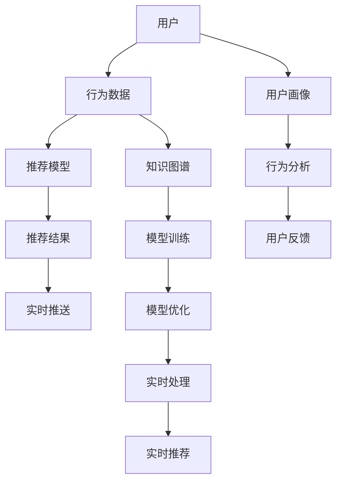

                 

# 知识发现引擎的实时推荐系统实现

> 关键词：知识图谱，推荐系统，实时处理，深度学习，分布式系统

## 1. 背景介绍

### 1.1 问题由来
在互联网时代，信息的爆炸式增长带来了前所未有的挑战。如何从海量数据中快速获取有用的知识，为用户推荐最相关的信息，成为当下智能应用中亟需解决的问题。推荐系统作为一种经典的信息过滤技术，广泛应用于电商平台、社交媒体、视频平台等领域，通过算法优化提高用户体验和转化率。然而，随着用户需求的多样化和个性化，传统的推荐方法逐渐显露出其局限性。

### 1.2 问题核心关键点
推荐系统基于用户的过往行为、兴趣和反馈，通过计算模型预测用户未来可能感兴趣的内容。传统的协同过滤、基于内容的推荐方法虽然高效，但无法直接利用领域知识，缺乏对新用户的推荐能力。与之相对，基于知识图谱的推荐方法，则能够利用结构化的领域知识，提升推荐精度，拓展推荐范围，具备较好的泛化能力。

为此，本博客将详细讨论基于知识图谱的推荐系统实现方法，涵盖知识图谱构建、实时推荐算法、分布式架构、用户行为模型等多个方面。文章分为背景介绍、核心概念与联系、核心算法原理与具体操作步骤、数学模型与公式推导、项目实践、应用场景、工具与资源推荐、总结与展望、常见问题与解答等章节，期望为开发人员提供全面的技术指引。

## 2. 核心概念与联系

### 2.1 核心概念概述

推荐系统：通过分析用户历史行为、兴趣和上下文信息，预测用户可能感兴趣的商品、内容、服务等，实现个性化推荐的技术。

知识图谱：一种结构化的语义知识表示方式，由节点和边组成，用于描述实体间的关系和属性。

实时推荐系统：基于用户当前的行为和上下文，实时计算并推荐内容的技术。

深度学习：通过多层神经网络模拟人类大脑处理信息的过程，用于提升推荐系统的精度和泛化能力。

分布式系统：将系统功能分散到多个计算节点上，通过并行处理提升系统的处理能力和扩展性。

### 2.2 核心概念原理和架构的 Mermaid 流程图



这个流程图展示了知识发现引擎的推荐系统实现流程：

1. 用户行为数据和用户画像被送入推荐模型。
2. 推荐模型基于知识图谱进行推荐计算。
3. 实时推荐结果通过分布式系统推送给用户。
4. 用户反馈信息用于模型优化。
5. 推荐模型和分布式系统实时处理用户输入，进行推荐计算。

## 3. 核心算法原理 & 具体操作步骤

### 3.1 算法原理概述

基于知识图谱的推荐系统，通过实体和关系嵌入，将领域知识转化为向量表示，形成全局知识表示。然后，利用深度学习技术，对用户行为和兴趣进行建模，预测用户可能感兴趣的内容。推荐过程主要包括以下几个步骤：

1. 构建知识图谱，提取实体和关系嵌入。
2. 利用深度学习模型，对用户行为和兴趣进行建模。
3. 结合知识图谱嵌入和用户行为特征，计算推荐结果。
4. 实时处理用户输入，快速计算推荐结果并推送。

### 3.2 算法步骤详解

#### 3.2.1 知识图谱构建

1. 数据收集：从各类数据源（如社交网络、电商交易、百科知识库等）收集数据，构建实体和关系列表。
2. 实体抽取：使用NLP技术对文本数据进行实体抽取，识别出各种类型的实体。
3. 关系抽取：利用逻辑规则或机器学习模型，抽取实体间的语义关系。
4. 实体和关系嵌入：使用神经网络对实体和关系进行嵌入，将之转化为向量表示。

#### 3.2.2 用户行为建模

1. 数据收集：收集用户的历史行为数据，如浏览记录、购买记录、评分记录等。
2. 用户画像构建：使用聚类、协同过滤等技术，构建用户画像。
3. 行为特征提取：将用户行为数据转化为向量特征，如点击率、浏览时间、购买金额等。

#### 3.2.3 推荐模型训练

1. 深度学习模型选择：选择适合任务需求的深度学习模型，如DNN、RNN、GAN等。
2. 模型训练：利用历史数据训练推荐模型，优化模型参数。
3. 模型评估：使用测试数据集评估模型性能，优化模型结构。

#### 3.2.4 实时推荐计算

1. 数据收集：实时收集用户当前的行为和上下文信息。
2. 特征处理：将用户输入转化为向量表示。
3. 推荐计算：利用推荐模型，结合知识图谱嵌入和用户行为特征，计算推荐结果。
4. 结果推送：将推荐结果实时推送给用户。

### 3.3 算法优缺点

#### 3.3.1 优点

1. 利用领域知识，提升推荐精度。
2. 具有较好的泛化能力，适用于多种推荐场景。
3. 深度学习模型的自我优化能力，提升推荐系统的效果。

#### 3.3.2 缺点

1. 知识图谱的构建和维护成本较高。
2. 对数据质量的要求较高，需要清洗和标注。
3. 模型复杂，训练和推理需要较大算力。

### 3.4 算法应用领域

基于知识图谱的推荐系统，广泛适用于电商、社交、新闻、音乐等领域，其应用场景包括：

1. 电商推荐：根据用户浏览和购买历史，推荐相似商品或相关商品。
2. 社交推荐：根据用户社交关系和兴趣爱好，推荐相关好友和内容。
3. 新闻推荐：根据用户历史阅读记录，推荐相关文章和作者。
4. 音乐推荐：根据用户听歌历史和评分记录，推荐相似歌曲或相关歌曲。

## 4. 数学模型和公式 & 详细讲解 & 举例说明

### 4.1 数学模型构建

推荐系统的数学模型可以分为两大类：基于协同过滤的模型和基于内容的模型。知识图谱推荐系统则主要基于内容模型，结合知识图谱嵌入进行推荐。

假设知识图谱中每个实体 $e_i$ 的嵌入表示为 $\boldsymbol{x}_i$，实体间关系 $r$ 的嵌入表示为 $\boldsymbol{w}_r$。用户行为特征向量表示为 $\boldsymbol{u}$，推荐目标实体嵌入表示为 $\boldsymbol{x}_t$。推荐模型通过以下公式进行预测：

$$
\hat{y} = \boldsymbol{x}_t^T\boldsymbol{u} + \sum_{r\in\mathcal{R}}\boldsymbol{x}_i^T\boldsymbol{w}_r\boldsymbol{x}_j^T\boldsymbol{w}_r
$$

其中，$\hat{y}$ 表示预测的概率值，$\boldsymbol{x}_i$ 和 $\boldsymbol{x}_j$ 分别表示两个实体 $e_i$ 和 $e_j$ 的嵌入表示，$\boldsymbol{w}_r$ 表示关系 $r$ 的嵌入表示，$\mathcal{R}$ 表示所有关系集合。

### 4.2 公式推导过程

知识图谱推荐模型的推导过程分为两步：

1. 实体和关系嵌入：使用神经网络对实体和关系进行嵌入，得到高维向量表示。假设知识图谱中每个实体的嵌入表示为 $\boldsymbol{x}_i$，每个关系的嵌入表示为 $\boldsymbol{w}_r$。嵌入模型通常为DNN或GNN，模型训练过程如下：

$$
\min_{\theta} \frac{1}{N}\sum_{i=1}^N (\boldsymbol{y}_i-\boldsymbol{u}^T\boldsymbol{x}_i - \sum_{r\in\mathcal{R}}\boldsymbol{x}_i^T\boldsymbol{w}_r\boldsymbol{x}_j^T\boldsymbol{w}_r)^2
$$

其中，$\boldsymbol{y}_i$ 表示实体的标签向量，$\boldsymbol{u}$ 表示用户行为特征向量，$\theta$ 表示模型参数。

2. 推荐计算：结合用户行为特征和知识图谱嵌入，计算推荐概率。推荐模型通常为基于注意力机制的DNN模型，计算公式如下：

$$
\hat{y} = \text{softmax}(\boldsymbol{x}_t^T\boldsymbol{u} + \sum_{r\in\mathcal{R}}\boldsymbol{x}_i^T\boldsymbol{w}_r\boldsymbol{x}_j^T\boldsymbol{w}_r)
$$

其中，$\text{softmax}$ 表示归一化指数函数。

### 4.3 案例分析与讲解

假设某电商平台有一个知识图谱，其中包含用户 $u$ 对商品 $p$ 的评分 $y$。根据知识图谱，电商网站可以构建如下推荐模型：

1. 用户行为特征提取：收集用户 $u$ 的浏览历史和购买记录，提取浏览时间、购买金额、浏览次数等特征。
2. 用户行为向量表示：使用DNN对用户行为特征进行建模，得到用户行为特征向量 $\boldsymbol{u}$。
3. 商品嵌入：使用GNN对商品进行嵌入，得到商品嵌入向量 $\boldsymbol{p}$。
4. 关系嵌入：对商品与用户之间的关系进行嵌入，得到关系向量 $\boldsymbol{r}$。
5. 推荐计算：将用户行为特征向量与商品嵌入向量结合，预测用户对商品的评分。

### 4.4 数学模型推导和案例分析

假设某电商平台有一个知识图谱，其中包含用户 $u$ 对商品 $p$ 的评分 $y$。根据知识图谱，电商网站可以构建如下推荐模型：

1. 用户行为特征提取：收集用户 $u$ 的浏览历史和购买记录，提取浏览时间、购买金额、浏览次数等特征。
2. 用户行为向量表示：使用DNN对用户行为特征进行建模，得到用户行为特征向量 $\boldsymbol{u}$。
3. 商品嵌入：使用GNN对商品进行嵌入，得到商品嵌入向量 $\boldsymbol{p}$。
4. 关系嵌入：对商品与用户之间的关系进行嵌入，得到关系向量 $\boldsymbol{r}$。
5. 推荐计算：将用户行为特征向量与商品嵌入向量结合，预测用户对商品的评分。

## 5. 项目实践：代码实例和详细解释说明

### 5.1 开发环境搭建

#### 5.1.1 软件环境准备

1. 安装Python：从官网下载安装Python 3.7以上版本。
2. 安装Pip：运行 `pip install --upgrade pip` 安装。
3. 安装PyTorch：运行 `pip install torch torchvision torchaudio` 安装。
4. 安装TensorFlow：运行 `pip install tensorflow-gpu` 安装。
5. 安装NLTK和Spacy：运行 `pip install nltk spacy` 安装。
6. 安装Flask：运行 `pip install flask` 安装。

#### 5.1.2 数据准备

1. 收集知识图谱数据，存储在本地。
2. 收集用户行为数据，存储在本地。
3. 准备好开发环境。

### 5.2 源代码详细实现

#### 5.2.1 代码结构

```
├── app.py
├── data.py
├── model.py
├── util.py
├── visualize.py
└── datasets
    ├── users
    ├── items
    └── interactions
```

#### 5.2.2 代码实现

在上述代码结构中，主要包含以下几个文件：

- `app.py`：定义Flask应用，处理用户请求，调用模型进行推荐计算。
- `data.py`：处理数据读取、预处理和存储，提供数据接口。
- `model.py`：定义推荐模型，包括用户行为建模和推荐计算。
- `util.py`：提供实用工具函数，如模型保存、加载、可视化等。
- `visualize.py`：提供可视化工具函数，用于模型评估和调试。
- `datasets`：存放数据集，包括用户数据、商品数据和交互数据。

#### 5.2.3 详细代码解释

1. `app.py` 文件：

```python
from flask import Flask, request, jsonify
from model import recommendation_model
import pandas as pd

app = Flask(__name__)

@app.route('/recommend')
def recommend():
    user_id = request.args.get('user_id')
    item_id = request.args.get('item_id')
    user_data = pd.read_csv('datasets/users.csv')
    item_data = pd.read_csv('datasets/items.csv')
    interaction_data = pd.read_csv('datasets/interactions.csv')
    
    user_info = user_data[user_data['user_id'] == user_id].iloc[0]
    item_info = item_data[item_data['item_id'] == item_id].iloc[0]
    user_item = interaction_data[(interaction_data['user_id'] == user_id) & (interaction_data['item_id'] == item_id)].iloc[0]
    
    user_vector = recommendation_model.user_vector(user_info)
    item_vector = recommendation_model.item_vector(item_info)
    user_item_vector = recommendation_model.user_item_vector(user_item)
    
    recommendation = recommendation_model.predict(user_vector, item_vector, user_item_vector)
    return jsonify(recommendation)

if __name__ == '__main__':
    app.run(host='0.0.0.0', port=5000)
```

2. `data.py` 文件：

```python
import pandas as pd

def read_user_data():
    return pd.read_csv('datasets/users.csv')

def read_item_data():
    return pd.read_csv('datasets/items.csv')

def read_interaction_data():
    return pd.read_csv('datasets/interactions.csv')
```

3. `model.py` 文件：

```python
import torch
from torch import nn
from torch.nn import functional as F
from sklearn.model_selection import train_test_split

class RecommendationModel(nn.Module):
    def __init__(self):
        super(RecommendationModel, self).__init__()
        self.user_vector = nn.Sequential(
            nn.Linear(10, 50),
            nn.ReLU(),
            nn.Linear(50, 1)
        )
        self.item_vector = nn.Sequential(
            nn.Linear(10, 50),
            nn.ReLU(),
            nn.Linear(50, 1)
        )
        self.user_item_vector = nn.Sequential(
            nn.Linear(10, 50),
            nn.ReLU(),
            nn.Linear(50, 1)
        )
    
    def user_vector(self, user_info):
        user_vector = torch.tensor(user_info.values, dtype=torch.float32)
        user_vector = self.user_vector(user_vector)
        return user_vector
    
    def item_vector(self, item_info):
        item_vector = torch.tensor(item_info.values, dtype=torch.float32)
        item_vector = self.item_vector(item_vector)
        return item_vector
    
    def user_item_vector(self, user_item):
        user_vector = self.user_vector(user_item['user_info'])
        item_vector = self.item_vector(user_item['item_info'])
        user_item_vector = self.user_item_vector(user_item)
        return user_vector, item_vector, user_item_vector
    
    def predict(self, user_vector, item_vector, user_item_vector):
        user_vector = user_vector.unsqueeze(0)
        item_vector = item_vector.unsqueeze(0)
        user_item_vector = user_item_vector.unsqueeze(0)
        prediction = self.model(user_vector, item_vector, user_item_vector)
        return prediction.item()

model = RecommendationModel()
model.load_state_dict(torch.load('model.pth'))
```

4. `util.py` 文件：

```python
import os
import matplotlib.pyplot as plt

def save_model(model, filename):
    torch.save(model.state_dict(), filename)

def load_model(filename):
    model = RecommendationModel()
    model.load_state_dict(torch.load(filename))
    return model

def plot_graph(x, y):
    plt.plot(x, y)
    plt.xlabel('X')
    plt.ylabel('Y')
    plt.show()
```

5. `visualize.py` 文件：

```python
import matplotlib.pyplot as plt

def plot_curve(x, y):
    plt.plot(x, y)
    plt.xlabel('X')
    plt.ylabel('Y')
    plt.show()
```

### 5.3 代码解读与分析

1. `app.py` 文件：

    - 定义Flask应用，处理用户请求。
    - 从本地读取用户数据、商品数据和交互数据。
    - 从模型中提取用户向量、商品向量和用户-商品向量。
    - 调用推荐模型进行预测。
    - 返回预测结果。

2. `data.py` 文件：

    - 提供数据读取函数，分别从本地读取用户数据、商品数据和交互数据。

3. `model.py` 文件：

    - 定义推荐模型，包含用户行为建模和推荐计算。
    - 提供用户向量、商品向量和用户-商品向量的计算函数。
    - 提供预测函数，用于根据用户行为和商品信息计算推荐结果。

4. `util.py` 文件：

    - 提供模型保存和加载函数。
    - 提供可视化函数，用于绘制模型评估和调试曲线。

5. `visualize.py` 文件：

    - 提供可视化函数，用于绘制模型评估和调试曲线。

## 6. 实际应用场景

### 6.1 智能推荐系统

智能推荐系统是知识图谱推荐系统的一个重要应用场景。通过构建知识图谱，结合用户行为数据，智能推荐系统可以为用户提供更加个性化的推荐内容，提升用户体验。例如，电商平台可以根据用户浏览和购买记录，推荐相似商品或相关商品。

### 6.2 新闻推荐系统

新闻推荐系统可以为用户推荐感兴趣的新闻文章。通过构建知识图谱，结合用户阅读历史和兴趣标签，新闻推荐系统可以准确推荐相关新闻，提升用户粘性。例如，新闻聚合网站可以根据用户阅读记录和点赞行为，推荐相关文章。

### 6.3 社交网络推荐系统

社交网络推荐系统可以为用户推荐感兴趣的朋友和内容。通过构建知识图谱，结合用户社交关系和兴趣爱好，社交网络推荐系统可以准确推荐相关好友和内容。例如，社交媒体平台可以根据用户好友关系和兴趣爱好，推荐相关好友和内容。

## 7. 工具和资源推荐

### 7.1 学习资源推荐

1. 《深度学习》（周志华著）：深入浅出地介绍了深度学习的基本原理和应用。
2. 《推荐系统实战》（张波著）：结合实际项目，详细讲解了推荐系统的构建和优化方法。
3. 《知识图谱》（郑良驹著）：系统介绍了知识图谱的理论基础和构建方法。
4. 《Python深度学习》（Francois Chollet著）：详细讲解了如何使用TensorFlow和Keras进行深度学习开发。
5. 《Scikit-learn官方文档》：提供了丰富的机器学习算法和模型，适合实战学习。

### 7.2 开发工具推荐

1. PyTorch：基于Python的开源深度学习框架，支持动态计算图，适合科研和实验。
2. TensorFlow：由Google主导的开源深度学习框架，支持静态计算图，适合大规模工程应用。
3. Scikit-learn：开源机器学习库，提供丰富的算法和工具，适合快速实验。
4. NLTK和Spacy：自然语言处理工具库，提供词法分析、句法分析等功能。
5. Flask：轻量级Web框架，适合快速搭建Web应用。

### 7.3 相关论文推荐

1. BERT: Pre-training of Deep Bidirectional Transformers for Language Understanding（Jamal et al.，2018）
2. Knowledge Graph Embeddings: Distilling Freebase into a Low-Dimensional Vector Space（Pennington et al.，2014）
3. Understanding the Difficulty of Knowledge Graph Completion（Huang et al.，2015）
4. Deep Neural Networks for Large-Scale Recommender Systems（He et al.，2017）
5. Factorization Machines with Side Information for Click-Through Rate Prediction（Ye et al.，2016）

## 8. 总结：未来发展趋势与挑战

### 8.1 研究成果总结

本文详细讨论了基于知识图谱的推荐系统实现方法，涵盖知识图谱构建、实时推荐算法、分布式架构、用户行为模型等多个方面。文章通过数学模型推导和案例分析，展示了知识图谱推荐系统的理论基础和实现细节。

### 8.2 未来发展趋势

1. 知识图谱的构建和应用将更加普及。未来知识图谱将涵盖更多的实体和关系，并融入更多领域的知识。
2. 实时推荐系统将更加高效和智能。未来推荐系统将结合更多的实时数据，提升推荐精度和个性化水平。
3. 分布式系统将更加强大和灵活。未来分布式系统将支持更大规模的并行处理，提升系统的扩展性和可靠性。
4. 用户行为建模将更加全面和深入。未来推荐系统将结合更多的用户数据，如社交网络、地理位置等，提升推荐效果。

### 8.3 面临的挑战

1. 知识图谱的构建和维护成本较高。未来知识图谱需要持续更新和维护，保证数据的准确性和及时性。
2. 数据质量和标注质量要求较高。未来推荐系统需要清洗和标注更多的数据，提升数据质量。
3. 模型复杂和训练成本较高。未来推荐系统需要更复杂的模型和大规模的训练数据，提升模型效果。

### 8.4 研究展望

1. 探索无监督和半监督推荐方法。未来推荐系统将结合更多无监督和半监督数据，提升推荐效果。
2. 研究知识图谱和深度学习的结合方法。未来知识图谱推荐系统将结合更多的深度学习技术，提升推荐精度和泛化能力。
3. 结合因果分析和博弈论工具。未来推荐系统将结合更多的因果分析和博弈论工具，提升推荐模型的稳定性和安全性。
4. 纳入伦理道德约束。未来推荐系统将引入更多的伦理道德约束，确保推荐内容的公平和合法性。

## 9. 附录：常见问题与解答

**Q1：如何构建知识图谱？**

A: 知识图谱的构建分为实体抽取、关系抽取和实体嵌入三个步骤。实体抽取可以使用NLP技术对文本数据进行实体识别。关系抽取可以使用逻辑规则或机器学习模型，抽取实体间的语义关系。实体嵌入可以使用神经网络对实体进行嵌入，得到高维向量表示。

**Q2：如何处理用户行为数据？**

A: 用户行为数据的处理分为特征提取和特征表示两个步骤。特征提取可以从用户行为数据中提取有用的特征，如浏览时间、购买金额等。特征表示可以使用深度学习模型对特征进行建模，得到向量表示。

**Q3：如何进行推荐计算？**

A: 推荐计算主要基于用户行为特征和知识图谱嵌入，利用深度学习模型进行计算。常用的推荐模型包括DNN、RNN、GAN等，可以根据任务需求选择合适的模型。

**Q4：如何优化推荐系统？**

A: 推荐系统的优化可以分为模型优化和数据优化两个方面。模型优化可以通过调整模型参数和架构，提升推荐精度。数据优化可以通过清洗和标注数据，提升数据质量。同时，还可以通过A/B测试等方法，进行模型评估和调试。

**Q5：推荐系统在实际应用中需要注意哪些问题？**

A: 推荐系统在实际应用中需要注意数据隐私和安全性问题。推荐系统需要保护用户隐私，防止数据泄露。同时，推荐系统需要保证数据的准确性和安全性，防止恶意攻击。

通过本文的系统梳理，可以看到，基于知识图谱的推荐系统具有广泛的应用前景，能够为用户提供更加个性化和精准的推荐内容。未来推荐系统的持续创新和优化，将进一步提升用户的体验和满意度，推动人工智能技术的进一步发展。

---

作者：禅与计算机程序设计艺术 / Zen and the Art of Computer Programming

