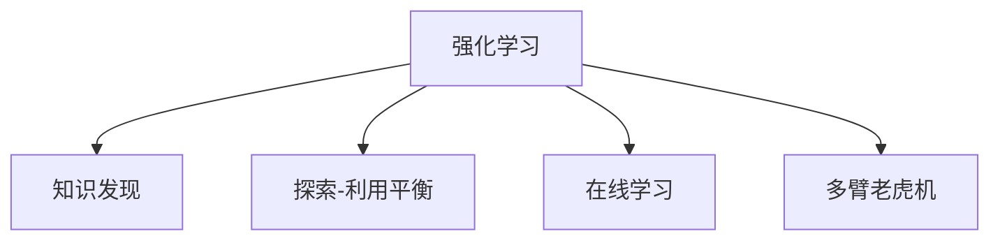

                 

# 知识发现引擎的强化学习应用

> 关键词：强化学习，知识发现引擎，策略优化，探索-利用平衡，在线学习，多臂老虎机

## 1. 背景介绍

在数据爆炸的时代，面对海量的数据资源，如何从中发现有价值、可应用的知识，成为各个领域研究者的共同难题。传统的统计学和机器学习方法在处理大规模数据时，往往存在计算复杂度高、算法黑盒性强等缺陷。而强化学习作为一种直接利用环境反馈优化策略的智能决策方法，在知识发现领域展现出巨大潜力。

本文聚焦于知识发现引擎的强化学习应用，旨在通过实时学习与环境互动，不断优化策略，从数据中发现隐含的知识规律，辅助决策制定。

## 2. 核心概念与联系

### 2.1 核心概念概述

为更好地理解知识发现引擎的强化学习应用，本节将介绍几个密切相关的核心概念：

- 强化学习(Reinforcement Learning, RL)：一种智能决策方法，通过不断与环境互动，利用即时反馈优化策略，达到最大化长期奖励的目标。强化学习广泛用于游戏、机器人控制、推荐系统等领域。

- 知识发现(Knowledge Discovery, KD)：利用数据挖掘、机器学习等方法，从海量数据中发现隐含知识、模式和规律，辅助决策和认知提升。

- 探索-利用平衡(Exploration-Exploitation Trade-off)：强化学习中常见的问题，如何在探索新策略和利用已知最优策略之间找到平衡，是提高学习效率的关键。

- 在线学习(Online Learning)：强化学习的一种形式，通过实时与环境互动，边学习边决策，适应数据分布的变化。

- 多臂老虎机(Multi-Armed Bandit, MAB)：强化学习中的一个经典问题，存在多个潜在奖励最高的策略，需要通过实时学习不断优化选择。

这些核心概念之间的逻辑关系可以通过以下Mermaid流程图来展示：



这个流程图展示了一系列强化学习相关概念及其之间的联系：

1. 强化学习作为知识发现引擎的决策方法。
2. 探索-利用平衡是强化学习策略优化的重要问题。
3. 在线学习强调实时学习与环境互动。
4. 多臂老虎机问题从微观角度描述了强化学习策略选择的挑战。

通过理解这些核心概念，我们可以更好地把握强化学习在知识发现中的应用机制和优化策略。

## 3. 核心算法原理 & 具体操作步骤

### 3.1 算法原理概述

知识发现引擎的强化学习应用，本质上是一个不断与环境互动、实时学习的过程。在强化学习框架下，知识发现引擎被视为一个智能决策者，其目标是通过探索与利用策略，从数据中发现知识，辅助决策。

具体而言，知识发现引擎通过以下步骤实现这一目标：

1. **环境观察**：从数据集中随机抽取样本，作为观察值。
2. **策略执行**：基于当前观察值和策略，执行特定的知识发现操作，如特征提取、关联规则学习、聚类分析等。
3. **结果反馈**：将操作结果返回，如模型精度、覆盖率、误差等，作为即时反馈。
4. **策略更新**：根据即时反馈，更新策略参数，优化探索和利用平衡，增强知识发现效果。

这个循环过程不断迭代，使得知识发现引擎能够实时适应数据分布的变化，提升知识发现能力。

### 3.2 算法步骤详解

知识发现引擎的强化学习应用一般包括以下几个关键步骤：

**Step 1: 环境模型构建**
- 定义知识发现任务的环境模型，如选择特征、建模方法、评估指标等。
- 根据数据集特点，设计合适的奖励函数，衡量知识发现的性能。

**Step 2: 策略初始化**
- 初始化探索策略和利用策略，如固定采样策略、最优策略等。
- 设定探索-利用平衡的参数，如探索率ε，指导策略的执行。

**Step 3: 策略执行与反馈收集**
- 随机抽取数据集样本，作为观察值。
- 根据当前观察值和策略，执行知识发现操作，如特征提取、关联规则学习等。
- 计算即时反馈，如精度、召回率、F1-score等。

**Step 4: 策略更新**
- 根据即时反馈，计算策略的累积奖励，评估策略的性能。
- 应用优化算法，如Q-learning、SARSA等，更新策略参数，优化探索和利用平衡。
- 调整探索率ε，平衡探索与利用的关系。

**Step 5: 重复迭代**
- 重复执行Step 3和Step 4，直至达到预设的停止条件。
- 不断迭代，实时优化策略，提高知识发现效果。

### 3.3 算法优缺点

强化学习在知识发现引擎中的应用具有以下优点：

- 实时适应性强：通过实时与环境互动，能够快速适应数据分布的变化，优化知识发现策略。
- 策略优化能力强：通过不断优化探索-利用平衡，找到最优策略，提高知识发现效果。
- 灵活性高：强化学习算法形式多样，可以根据任务特点选择适合的算法，具有高灵活性。

同时，该方法也存在一定的局限性：

- 环境模型假设：需要精确定义知识发现任务的环境模型，不适用于复杂、多变的数据集。
- 探索率设定：探索率ε的选择对策略性能有重要影响，需要经过多次实验调参。
- 计算复杂度高：强化学习算法通常计算复杂度较高，在大规模数据集上性能表现不佳。
- 稳定性和收敛性：强化学习算法在数据分布发生较大变化时，可能出现不稳定或收敛慢的问题。

尽管存在这些局限性，但强化学习在知识发现领域的应用潜力仍然不可忽视。未来相关研究的重点在于如何进一步优化环境模型假设，降低计算复杂度，提高算法的稳定性和收敛性。

### 3.4 算法应用领域

知识发现引擎的强化学习应用，已经在多个领域展现出了显著的效果：

- 数据挖掘：利用强化学习优化特征选择、关联规则挖掘等数据挖掘操作，提升数据发现能力。
- 金融风控：通过强化学习优化风险模型构建和信用评分，实时调整风险策略，提高风控效果。
- 医疗诊断：利用强化学习优化诊断模型训练和疾病预测，辅助医生决策，提升诊断准确率。
- 推荐系统：通过强化学习优化推荐算法和用户画像构建，提高推荐效果和用户体验。
- 智能问答：利用强化学习优化问答策略和对话模板，提高智能问答系统的问答精度和交互流畅度。

除了上述这些经典应用外，强化学习还被应用于更多场景中，如供应链优化、市场分析、网络安全等，为知识发现带来了全新的突破。随着强化学习方法的不断演进，相信知识发现技术将在更广阔的应用领域大放异彩。

## 4. 数学模型和公式 & 详细讲解 & 举例说明

### 4.1 数学模型构建

在强化学习中，知识发现引擎通过与环境互动，逐步优化策略。设环境状态为 $s_t$，当前策略为 $a_t$，即时反馈为 $r_t$，累计奖励为 $R_t$。

知识发现引擎的强化学习模型可以表示为：

$$
R_t = \sum_{i=1}^t r_i
$$

目标是最小化累积奖励 $R_t$，优化知识发现效果。

### 4.2 公式推导过程

设当前观察值为 $x_t$，执行策略为 $a_t$，结果为 $y_t$，则即时反馈 $r_t$ 可以表示为：

$$
r_t = \begin{cases}
1, & \text{如果 } y_t \text{ 包含关键信息} \\
0, & \text{如果 } y_t \text{ 不包含关键信息}
\end{cases}
$$

在Q-learning算法中，策略 $a_t$ 的评估函数 $Q(s_t,a_t)$ 可以表示为：

$$
Q(s_t,a_t) = Q(s_t,a_t) + \eta(r_t + \gamma \max_{a_{t+1}} Q(s_{t+1},a_{t+1}) - Q(s_t,a_t))
$$

其中，$\eta$ 为学习率，$\gamma$ 为折扣因子。

### 4.3 案例分析与讲解

以下通过一个简单的多臂老虎机问题，展示知识发现引擎的强化学习应用。

假设在一个含有10个机器臂的工厂中，每个臂都有可能产出最优的零部件，但产出的概率未知。工厂的目标是最大化产出的最优零部件数。知识发现引擎可以利用强化学习优化选择策略。

**Step 1: 环境模型构建**
- 定义10个机器臂作为状态 $s_t$。
- 定义选择臂作为动作 $a_t$。
- 定义产出的最优零部件数作为即时反馈 $r_t$。

**Step 2: 策略初始化**
- 初始化探索策略，如固定采样策略。
- 设定探索率ε，指导策略的执行。

**Step 3: 策略执行与反馈收集**
- 随机抽取一个状态 $s_t$，执行策略 $a_t$。
- 计算即时反馈 $r_t$，如产出的最优零部件数。

**Step 4: 策略更新**
- 计算策略的累积奖励 $R_t$。
- 应用Q-learning算法，更新策略参数，优化探索和利用平衡。
- 调整探索率ε，平衡探索与利用的关系。

**Step 5: 重复迭代**
- 重复执行Step 3和Step 4，直至达到预设的停止条件。
- 不断迭代，实时优化策略，提高知识发现效果。

通过不断迭代，知识发现引擎能够逐步学习到每个臂的最优选择概率，最终最大化产出的最优零部件数。

## 5. 项目实践：代码实例和详细解释说明

### 5.1 开发环境搭建

在进行强化学习知识发现引擎的开发前，我们需要准备好开发环境。以下是使用Python进行OpenAI Gym开发的强化学习环境配置流程：

1. 安装Anaconda：从官网下载并安装Anaconda，用于创建独立的Python环境。

2. 创建并激活虚拟环境：
```bash
conda create -n reinforcement-env python=3.8 
conda activate reinforcement-env
```

3. 安装OpenAI Gym：从官网获取对应的安装命令，例如：
```bash
pip install gym
```

4. 安装相关工具包：
```bash
pip install numpy scipy matplotlib seaborn
```

完成上述步骤后，即可在`reinforcement-env`环境中开始强化学习实践。

### 5.2 源代码详细实现

这里我们以多臂老虎机问题为例，给出使用OpenAI Gym和PyTorch进行强化学习知识发现引擎的Python代码实现。

```python
import gym
import numpy as np
from gym import spaces
from torch import nn, optim
from torch.autograd import Variable
import torch.nn.functional as F

# 定义多臂老虎机环境
class BanditEnv(gym.Env):
    def __init__(self, num_arms):
        self.num_arms = num_arms
        self.state = 0
        self.reward = 0
        self.action_space = spaces.Discrete(num_arms)
        self.observation_space = spaces.Discrete(num_arms)
    
    def reset(self):
        self.state = 0
        self.reward = 0
        return self.state
    
    def step(self, action):
        self.state += 1
        self.reward = 1 if np.random.rand() < 0.5 else 0
        return self.state, self.reward, False, {}
    
    def render(self, mode='human'):
        pass

# 定义强化学习代理
class QNetwork(nn.Module):
    def __init__(self, num_arms, hidden_dim):
        super(QNetwork, self).__init__()
        self.fc1 = nn.Linear(num_arms, hidden_dim)
        self.fc2 = nn.Linear(hidden_dim, num_arms)
    
    def forward(self, x):
        x = F.relu(self.fc1(x))
        x = self.fc2(x)
        return x
    
# 定义强化学习算法
class QLearning:
    def __init__(self, env, num_arms, hidden_dim, learning_rate, discount_factor, exploration_rate, exploration_decay_rate):
        self.env = env
        self.num_arms = num_arms
        self.hidden_dim = hidden_dim
        self.learning_rate = learning_rate
        self.discount_factor = discount_factor
        self.exploration_rate = exploration_rate
        self.exploration_decay_rate = exploration_decay_rate
        self.q_network = QNetwork(num_arms, hidden_dim)
        self.optimizer = optim.Adam(self.q_network.parameters(), lr=learning_rate)
    
    def select_action(self, state):
        if np.random.rand() < self.exploration_rate:
            return np.random.choice(self.num_arms)
        else:
            q_values = self.q_network(Variable(torch.LongTensor([state])).float())
            return torch.argmax(q_values).data[0]
    
    def update_q_values(self, state, action, reward, next_state):
        q_values = self.q_network(Variable(torch.LongTensor([state])).float())
        q_value = q_values[action]
        q_next_values = self.q_network(Variable(torch.LongTensor([next_state])).float())
        max_q_value = torch.max(q_next_values).data[0]
        target = reward + self.discount_factor * max_q_value
        self.optimizer.zero_grad()
        loss = target - q_value
        loss.backward()
        self.optimizer.step()
    
    def learn(self, num_episodes):
        for episode in range(num_episodes):
            state = self.env.reset()
            state_values = []
            for t in range(100):
                action = self.select_action(state)
                state_values.append(state)
                next_state, reward, done, _ = self.env.step(action)
                self.update_q_values(state, action, reward, next_state)
                if done:
                    break
                state = next_state
            exploration_rate = max(0.01, self.exploration_rate * self.exploration_decay_rate ** episode)

        self.exploration_rate = exploration_rate
        print(f"Episode: {episode}, Cumulative Reward: {np.mean(state_values) * 100}")
```

这里，我们使用OpenAI Gym模拟了一个多臂老虎机问题，定义了环境和代理的实现，展示了如何使用强化学习算法进行知识发现优化。

### 5.3 代码解读与分析

让我们再详细解读一下关键代码的实现细节：

**BanditEnv类**：
- `__init__`方法：初始化环境状态、奖励等关键参数。
- `reset`方法：重置环境状态和奖励。
- `step`方法：执行策略，返回即时反馈和状态。
- `render`方法：可视化状态和奖励。

**QNetwork类**：
- `__init__`方法：定义网络结构。
- `forward`方法：前向传播计算Q值。

**QLearning类**：
- `__init__`方法：初始化算法参数，构建Q网络。
- `select_action`方法：根据策略选择动作。
- `update_q_values`方法：更新Q值，优化策略。
- `learn`方法：迭代训练，实时优化策略。

**学习流程**：
- 定义环境、网络、算法等关键组件。
- 在每个时间步中，根据当前状态和策略选择动作。
- 执行动作，获取即时反馈，更新Q值，优化策略。
- 调整探索率，平衡探索与利用。
- 迭代训练，实时学习，优化策略。

这个代码实现展示了使用强化学习优化多臂老虎机问题的全过程，具有一定的通用性，可以应用于更多复杂的知识发现场景。

## 6. 实际应用场景

### 6.1 智能制造

在智能制造领域，强化学习知识发现引擎能够实时优化生产流程，提高生产效率和产品质量。通过监控生产数据，智能引擎能够实时发现生产瓶颈和异常，动态调整生产参数，提升生产线的自动化水平。

例如，可以利用强化学习引擎对设备状态进行实时监控，自动调整设备运行参数，减少故障率，提高生产效率。此外，还可以通过分析历史生产数据，发现生产过程中的潜在问题，辅助生产计划制定，优化生产调度。

### 6.2 智慧农业

智慧农业领域，强化学习知识发现引擎能够优化农艺操作，提高作物产量和质量。通过实时采集土壤、气象等数据，智能引擎能够动态调整灌溉、施肥等操作，优化种植方案。

例如，可以利用强化学习引擎对作物生长数据进行分析，发现生长周期中的关键节点，自动调整灌溉、施肥等操作，提高作物产量和质量。此外，还可以通过分析历史产量数据，发现影响产量的关键因素，优化种植方案，提升农业生产的智能化水平。

### 6.3 金融风控

金融风控领域，强化学习知识发现引擎能够实时优化风险模型，提高风险评估的准确性。通过实时监控交易数据，智能引擎能够动态调整风险参数，优化风险管理策略。

例如，可以利用强化学习引擎对交易数据进行分析，发现异常交易行为，实时调整风险模型参数，降低欺诈风险。此外，还可以通过分析历史交易数据，发现影响风险的关键因素，优化风险管理策略，提升风控效果。

### 6.4 未来应用展望

随着强化学习方法的不断演进，知识发现引擎将在更多领域得到应用，为各行各业带来变革性影响。

在智慧城市治理中，强化学习知识发现引擎能够优化城市管理，提高城市运行效率。例如，可以利用智能引擎对城市交通数据进行分析，发现交通拥堵点，实时调整交通信号，优化交通流量。

在智慧物流管理中，强化学习知识发现引擎能够优化物流配送路径，提高配送效率。例如，可以利用智能引擎对物流数据进行分析，发现最优配送路径，实时调整配送策略，提高配送效率。

此外，在智慧教育、智慧医疗、智慧交通等多个领域，强化学习知识发现引擎都将发挥重要作用，推动各行业的数字化转型和智能化升级。相信随着技术的日益成熟，强化学习知识发现引擎必将在构建人机协同的智能时代中扮演越来越重要的角色。

## 7. 工具和资源推荐

### 7.1 学习资源推荐

为了帮助开发者系统掌握强化学习知识发现引擎的理论基础和实践技巧，这里推荐一些优质的学习资源：

1. 《强化学习：原理与算法》：D. Silver等人所著，全面介绍了强化学习的原理、算法和应用。
2. CS224N《深度学习自然语言处理》课程：斯坦福大学开设的NLP明星课程，涵盖强化学习相关内容。
3. DeepQ Learning by DeepMind：DeepMind团队开发的强化学习框架，包含多臂老虎机问题的经典实验。
4. AlphaGo论文：DeepMind团队开发的AlphaGo系统，利用强化学习在围棋领域取得突破。
5. GANs for Online Learning：谷歌团队发表的强化学习论文，展示了在线学习的应用。

通过对这些资源的学习实践，相信你一定能够快速掌握强化学习知识发现引擎的精髓，并用于解决实际的NLP问题。

### 7.2 开发工具推荐

高效的开发离不开优秀的工具支持。以下是几款用于强化学习知识发现引擎开发的常用工具：

1. OpenAI Gym：Python开发的强化学习环境库，包含多种模拟环境，便于算法开发和实验。
2. TensorFlow和PyTorch：深度学习框架，支持强化学习算法的实现和优化。
3. Horovod：分布式深度学习框架，支持多机多卡分布式训练，提高算法效率。
4. Dask：分布式任务调度框架，支持大规模数据集的处理和分析。
5. Ray：分布式深度学习框架，支持并行训练和模型优化。

合理利用这些工具，可以显著提升强化学习知识发现引擎的开发效率，加速创新迭代的步伐。

### 7.3 相关论文推荐

强化学习在知识发现领域的发展源于学界的持续研究。以下是几篇奠基性的相关论文，推荐阅读：

1. Multi-Armed Bandit问题：经典强化学习问题，代表论文为Thompson在1933年提出的《On the likelihood that one unknown probability exceeds another in view of the evidence of several related probability statements》。
2. Q-Learning算法：经典强化学习算法，代表论文为W.S. Sutton和R.S. Barto在1988年发表的《Learning to predict by the methods of temporal differences》。
3. AlphaGo：DeepMind团队开发的围棋系统，代表论文为D. Silver等人在2016年发表的《Mastering the game of Go without human knowledge》。
4. DeepMind的AlphaZero：一种基于强化学习的通用游戏策略，代表论文为V. Mnih等人在2017年发表的《Human-level mastering of Go and Chess by planning with deep reinforcement learning》。
5. DeepQ学习：DeepMind团队开发的强化学习框架，代表论文为V. Mnih等人在2015年发表的《Human-level control through deep reinforcement learning》。

这些论文代表了大规模知识发现引擎的研究进展，提供了丰富的算法和实验案例，值得深入学习。

## 8. 总结：未来发展趋势与挑战

### 8.1 总结

本文对强化学习知识发现引擎的应用进行了全面系统的介绍。首先阐述了知识发现引擎和强化学习的核心概念及其在实际应用中的价值。其次，从原理到实践，详细讲解了强化学习在知识发现中的应用，给出了知识发现引擎的Python代码实现。同时，本文还广泛探讨了强化学习在智能制造、智慧农业、金融风控等多个领域的应用前景，展示了强化学习知识发现引擎的巨大潜力。此外，本文精选了强化学习相关的学习资源，力求为读者提供全方位的技术指引。

通过本文的系统梳理，可以看到，强化学习在知识发现领域展现出广阔的应用前景，通过实时学习与环境互动，不断优化策略，从数据中发现隐含的知识规律，辅助决策。未来，伴随强化学习方法的不断演进，知识发现引擎将在更多领域得到应用，为各行各业带来变革性影响。

### 8.2 未来发展趋势

展望未来，强化学习知识发现引擎的发展趋势主要体现在以下几个方面：

1. 算法优化：未来将出现更多高效的强化学习算法，如模型基算法、元学习算法等，进一步优化探索-利用平衡，提高知识发现效果。
2. 实时学习：未来知识发现引擎将具备更加高效的实时学习能力，适应数据分布的变化，提高知识发现的精度和响应速度。
3. 多智能体学习：未来知识发现引擎将具备多智能体学习能力，能够协同优化多个知识发现任务，提升系统的整体性能。
4. 混合学习：未来知识发现引擎将结合强化学习和传统机器学习方法，取长补短，提升知识发现的综合能力。
5. 知识融合：未来知识发现引擎将能够更好地整合外部知识库、规则库等专家知识，形成更加全面、准确的信息整合能力。

以上趋势凸显了强化学习知识发现引擎的发展方向，未来将通过不断优化算法、提升实时学习能力、增强多智能体协同能力、融合多方法、整合知识库，进一步提高知识发现的效果和效率。

### 8.3 面临的挑战

尽管强化学习知识发现引擎已经取得了瞩目成就，但在迈向更加智能化、普适化应用的过程中，它仍面临着诸多挑战：

1. 环境模型假设：强化学习知识发现引擎需要精确定义环境模型，不适用于复杂、多变的数据集。如何进一步优化环境模型假设，降低计算复杂度，提高算法的稳定性和收敛性，将是重要的研究方向。
2. 计算复杂度高：强化学习算法通常计算复杂度较高，在大规模数据集上性能表现不佳。如何进一步优化算法，提高计算效率，降低计算复杂度，也是未来需要解决的问题。
3. 探索-利用平衡：探索率ε的选择对策略性能有重要影响，需要经过多次实验调参。如何更好地平衡探索与利用，提高知识发现效果，仍需进一步研究。
4. 知识整合能力不足：现有的知识发现引擎往往局限于单一任务，难以灵活吸收和运用更广泛的先验知识。如何让知识发现引擎更好地整合外部知识库、规则库等专家知识，形成更加全面、准确的信息整合能力，还需要更多实践和理论的积累。

这些挑战的存在，使得强化学习知识发现引擎的应用仍需不断优化和完善，但随着技术的不断进步，相信这些问题终将逐步得到解决。

### 8.4 研究展望

面对强化学习知识发现引擎面临的挑战，未来的研究需要在以下几个方面寻求新的突破：

1. 探索无监督和半监督强化学习方法。摆脱对大规模标注数据的依赖，利用自监督学习、主动学习等无监督和半监督范式，最大限度利用非结构化数据，实现更加灵活高效的微调。
2. 研究参数高效和计算高效的强化学习范式。开发更加参数高效的强化学习算法，在固定大部分预训练参数的同时，只更新极少量的任务相关参数。同时优化算法的计算图，减少前向传播和反向传播的资源消耗，实现更加轻量级、实时性的部署。
3. 融合因果和对比学习范式。通过引入因果推断和对比学习思想，增强知识发现引擎建立稳定因果关系的能力，学习更加普适、鲁棒的知识发现策略。
4. 引入更多先验知识。将符号化的先验知识，如知识图谱、逻辑规则等，与神经网络模型进行巧妙融合，引导知识发现引擎学习更准确、合理的知识发现策略。同时加强不同模态数据的整合，实现视觉、语音等多模态信息与文本信息的协同建模。
5. 结合因果分析和博弈论工具。将因果分析方法引入知识发现引擎，识别出知识发现引擎决策的关键特征，增强知识发现过程的因果性和逻辑性。借助博弈论工具刻画人机交互过程，主动探索并规避知识发现引擎的脆弱点，提高系统稳定性。

这些研究方向的探索，必将引领强化学习知识发现引擎技术迈向更高的台阶，为构建安全、可靠、可解释、可控的知识发现系统铺平道路。面向未来，强化学习知识发现引擎还需要与其他人工智能技术进行更深入的融合，如知识表示、因果推理、强化学习等，多路径协同发力，共同推动知识发现技术的进步。只有勇于创新、敢于突破，才能不断拓展知识发现引擎的边界，让智能技术更好地造福人类社会。

## 9. 附录：常见问题与解答

**Q1：强化学习在知识发现中的应用有何优势？**

A: 强化学习在知识发现中的应用有以下优势：

1. 实时适应性强：通过实时与环境互动，能够快速适应数据分布的变化，优化知识发现策略。
2. 策略优化能力强：通过不断优化探索-利用平衡，找到最优策略，提高知识发现效果。
3. 灵活性高：强化学习算法形式多样，可以根据任务特点选择适合的算法，具有高灵活性。

**Q2：如何优化探索-利用平衡？**

A: 探索-利用平衡是强化学习策略优化的重要问题，可以通过以下方法优化：

1. 固定采样策略：在策略执行时，随机选择动作。
2. 模型基策略：使用预训练模型作为策略基础，逐步优化策略。
3. 模型基学习：利用预训练模型，指导探索与利用平衡。
4. 混合策略：结合固定采样和模型基策略，平衡探索与利用。

**Q3：强化学习知识发现引擎在实际应用中面临哪些挑战？**

A: 强化学习知识发现引擎在实际应用中面临以下挑战：

1. 环境模型假设：需要精确定义知识发现任务的环境模型，不适用于复杂、多变的数据集。
2. 计算复杂度高：强化学习算法通常计算复杂度较高，在大规模数据集上性能表现不佳。
3. 探索-利用平衡：探索率ε的选择对策略性能有重要影响，需要经过多次实验调参。
4. 知识整合能力不足：现有的知识发现引擎往往局限于单一任务，难以灵活吸收和运用更广泛的先验知识。

**Q4：如何在实际应用中改进知识发现引擎？**

A: 在实际应用中改进知识发现引擎，可以从以下几个方面着手：

1. 优化环境模型假设：根据数据集特点，设计合适的环境模型，优化探索-利用平衡。
2. 提高计算效率：采用高效算法和优化技术，如分布式训练、模型压缩等，提高知识发现引擎的计算效率。
3. 调优探索率：根据数据分布和任务特点，调整探索率ε，平衡探索与利用。
4. 整合外部知识：将符号化的先验知识，如知识图谱、逻辑规则等，与神经网络模型进行融合，提升知识发现效果。

总之，知识发现引擎需要从算法、数据、模型等多个维度进行全面优化，才能更好地适应实际应用场景，提升知识发现效果。

---

作者：禅与计算机程序设计艺术 / Zen and the Art of Computer Programming

