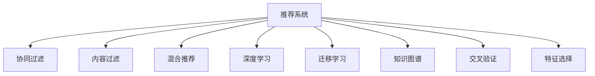

                 

# 知识发现引擎的推荐系统性能优化

## 1. 背景介绍

在信息爆炸的时代，如何有效获取和利用海量数据已成为企业和研究者关注的焦点。推荐系统作为知识发现引擎的重要组成部分，能够帮助用户在海量数据中快速找到有价值的信息，大大提升信息检索的效率。然而，由于推荐系统面临数据稀疏性、用户兴趣动态变化、多模态数据融合等诸多挑战，如何优化推荐系统性能，提升用户体验和业务价值，成为推荐系统研究的重要课题。

### 1.1 问题由来

推荐系统主要分为基于协同过滤、基于内容过滤和混合推荐等几种方式。协同过滤通过分析用户行为数据，挖掘用户之间的相似性，进行个性化推荐。然而，协同过滤方法往往依赖大量的用户行为数据，对数据稀疏性敏感。此外，用户兴趣的变化可能导致推荐算法失效，难以适应长期动态变化的用户兴趣。基于内容过滤的方法能够较好地处理数据稀疏性问题，但难以捕捉用户个性化需求，且无法充分利用用户行为数据。混合推荐方法结合了协同过滤和内容过滤的优点，能够同时考虑用户行为和物品属性，但算法复杂度较高，需要频繁的模型调参和迭代优化。

## 2. 核心概念与联系

### 2.1 核心概念概述

为了更好地理解推荐系统的性能优化方法，本节将介绍几个核心概念：

- 推荐系统(Recommendation System)：利用用户数据和物品属性，为用户推荐感兴趣物品的系统，如电影推荐、商品推荐等。
- 协同过滤(Collaborative Filtering)：通过分析用户行为数据，寻找相似用户或物品，生成个性化推荐。常见方法包括基于用户的协同过滤和基于物品的协同过滤。
- 内容过滤(Content-Based Filtering)：利用物品属性信息，为用户推荐与兴趣相似的物品。
- 混合推荐(Mixed Recommendation)：结合协同过滤和内容过滤的优点，同时考虑用户行为和物品属性，提供更全面、更精准的推荐。
- 深度学习(Deep Learning)：利用神经网络模型处理数据特征，进行推荐。
- 迁移学习(Transfer Learning)：将一个领域学习的知识，迁移到另一个相关领域中，提升模型泛化能力。
- 知识图谱(Knowledge Graph)：用于描述实体之间的关系，辅助推荐系统进行多关系融合。
- 交叉验证(Cross Validation)：将数据集划分为训练集、验证集和测试集，评估模型性能。
- 特征选择(Feature Selection)：从原始数据中选择最有用的特征，减少数据维度，提高模型效率。

这些核心概念之间的逻辑关系可以通过以下Mermaid流程图来展示：



这个流程图展示了许多推荐系统的主要范式及其核心技术，帮助我们更好地理解推荐系统的工作原理和性能优化方法。

## 3. 核心算法原理 & 具体操作步骤
### 3.1 算法原理概述

推荐系统的核心目标是最大化用户满意度和系统收益。推荐算法通过分析用户行为数据，挖掘用户兴趣和物品属性，生成个性化推荐。传统的推荐算法主要包括基于协同过滤的推荐和基于内容的推荐。基于协同过滤的推荐算法通过分析用户行为数据，找到相似用户或物品，生成推荐列表。基于内容的推荐算法利用物品属性，生成与用户兴趣相似的物品推荐。

近年来，深度学习在推荐系统中的应用日益广泛。基于深度学习的推荐系统通过学习用户行为和物品属性之间的复杂非线性关系，生成更加准确、个性化的推荐。基于深度学习的推荐系统包括基于矩阵分解的推荐系统、基于深度神经网络的推荐系统和基于混合模型的推荐系统。基于矩阵分解的推荐系统利用矩阵分解技术，从用户-物品评分矩阵中提取低秩矩阵表示，生成推荐。基于深度神经网络的推荐系统通过卷积神经网络、循环神经网络、变分自编码器等深度神经网络模型，处理用户行为数据和物品属性，生成推荐。基于混合模型的推荐系统将协同过滤和内容过滤的优点相结合，生成更全面、更精准的推荐。

### 3.2 算法步骤详解

基于深度学习的推荐系统一般包括以下几个关键步骤：

**Step 1: 数据预处理**
- 收集用户行为数据和物品属性数据，进行去重、去噪、归一化等预处理。
- 将用户行为数据和物品属性数据进行编码，生成输入特征向量。

**Step 2: 模型训练**
- 构建深度神经网络模型，如卷积神经网络、循环神经网络等，作为推荐模型的基础架构。
- 将用户行为数据和物品属性数据作为输入，训练深度神经网络模型。
- 通过交叉验证等技术，选择合适的模型参数和超参数，优化模型性能。

**Step 3: 推荐生成**
- 将新用户行为数据和物品属性数据输入训练好的深度神经网络模型，生成推荐。
- 根据用户偏好，生成个性化推荐列表。

**Step 4: 推荐结果评估**
- 通过A/B测试、用户反馈等方法，评估推荐结果的用户满意度。
- 统计推荐结果的准确率、召回率、覆盖率等指标，评估推荐系统性能。

### 3.3 算法优缺点

基于深度学习的推荐系统具有以下优点：
1. 能够处理大规模数据集，处理非线性关系，生成精准推荐。
2. 能够同时考虑用户行为和物品属性，提供更加全面、个性化的推荐。
3. 能够实时生成推荐，提升用户体验。

然而，该方法也存在一些局限性：
1. 需要大量的标注数据和计算资源，构建和训练深度神经网络模型。
2. 模型的复杂度较高，需要大量的时间进行调参和迭代优化。
3. 模型的泛化能力较差，难以适应长期动态变化的用户兴趣。
4. 模型的可解释性较差，难以解释推荐结果的生成过程。

尽管存在这些局限性，但基于深度学习的推荐系统仍是目前推荐系统的主流范式。未来相关研究的重点在于如何进一步降低推荐系统的计算成本，提高模型的泛化能力，同时兼顾可解释性和伦理安全性等因素。

### 3.4 算法应用领域

基于深度学习的推荐系统在诸多领域得到了广泛应用，例如：

- 电商推荐：如商品推荐、广告推荐等。利用深度神经网络模型，为用户推荐相关商品和广告，提升用户购买转化率。
- 内容推荐：如新闻推荐、视频推荐等。通过深度神经网络模型，为用户推荐感兴趣的新闻和视频内容，提高用户粘性。
- 社交推荐：如好友推荐、群组推荐等。利用深度神经网络模型，为用户推荐潜在好友和兴趣群组，提升社交网络的用户活跃度。
- 金融推荐：如股票推荐、基金推荐等。利用深度神经网络模型，为用户提供个性化的金融产品推荐，提升投资收益。

除了这些常见应用外，基于深度学习的推荐系统还被创新性地应用到更多场景中，如医疗推荐、教育推荐、出行推荐等，为各行各业带来变革性影响。随着深度学习模型的不断发展，相信基于深度学习的推荐系统必将在更广阔的应用领域发挥更大的作用。

## 4. 数学模型和公式 & 详细讲解  
### 4.1 数学模型构建

本节将使用数学语言对基于深度学习的推荐系统进行更加严格的刻画。

记用户行为数据为 $U = \{(u_i, v_i)\}_{i=1}^N$，其中 $u_i$ 表示用户，$v_i$ 表示用户对物品的评分。记物品属性数据为 $I = \{(i_j, a_j)\}_{j=1}^M$，其中 $i_j$ 表示物品，$a_j$ 表示物品属性。记深度神经网络模型为 $M_{\theta}$，其中 $\theta$ 为模型参数。

定义用户-物品评分矩阵 $X = \{(x_{ui}, y_{ui})\}_{i=1}^N$，其中 $x_{ui}$ 表示用户 $u_i$ 对物品 $i$ 的评分，$y_{ui}$ 表示用户 $u_i$ 对物品 $i$ 的评分是否真实。定义物品属性向量 $A = \{(a_{ij})\}_{j=1}^M$，其中 $a_{ij}$ 表示物品 $i$ 的属性。

定义推荐系统模型 $M_{\theta}(X, A)$，将用户行为数据和物品属性数据作为输入，生成推荐列表 $R$。推荐系统模型的目标是最小化预测评分与实际评分的均方误差，即：

$$
\min_{\theta} \frac{1}{N}\sum_{i=1}^N (y_{ui} - M_{\theta}(x_{ui}, a_{ui}))^2
$$

其中 $M_{\theta}(x_{ui}, a_{ui})$ 为模型 $M_{\theta}$ 在用户 $u_i$ 对物品 $i$ 的评分上的预测值。

### 4.2 公式推导过程

以下我们以矩阵分解方法为例，推导深度神经网络推荐模型的数学原理。

假设用户行为数据和物品属性数据均经过归一化处理，归一化后的用户行为数据为 $\tilde{U} = \{\tilde{u}_i\}_{i=1}^N$，归一化后的物品属性数据为 $\tilde{A} = \{\tilde{a}_j\}_{j=1}^M$。定义矩阵分解后的用户-物品评分矩阵为 $\tilde{X} = \{\tilde{x}_{ui}\}_{i=1}^N$，其中 $\tilde{x}_{ui}$ 表示用户 $u_i$ 对物品 $i$ 的评分矩阵分解后的表示。定义矩阵分解后的物品属性矩阵为 $\tilde{A} = \{\tilde{a}_{ij}\}_{j=1}^M$，其中 $\tilde{a}_{ij}$ 表示物品 $i$ 的属性矩阵分解后的表示。

矩阵分解方法的目标是最小化矩阵分解误差，即：

$$
\min_{\theta} \frac{1}{N}\sum_{i=1}^N (\tilde{x}_{ui} - \theta_i\tilde{a}_{ui})^2
$$

其中 $\theta_i$ 为矩阵分解后的用户-物品评分矩阵的参数。

为了降低矩阵分解的计算复杂度，可以使用卷积神经网络等深度神经网络模型进行矩阵分解。设卷积神经网络模型为 $M_{\theta}$，其中 $\theta$ 为模型参数。则矩阵分解的目标可以转化为：

$$
\min_{\theta} \frac{1}{N}\sum_{i=1}^N (M_{\theta}(\tilde{u}_i, \tilde{a}_i) - \theta_i\tilde{a}_{ui})^2
$$

定义推荐系统模型的预测评分为 $M_{\theta}(\tilde{u}_i, \tilde{a}_i)$，其中 $\tilde{u}_i$ 表示用户 $u_i$ 的归一化行为数据，$\tilde{a}_i$ 表示物品 $i$ 的归一化属性数据。

### 4.3 案例分析与讲解

考虑一个电商推荐系统，其用户行为数据为用户浏览记录、购买记录、评分记录等，物品属性数据为商品属性、商品类别、商品价格等。推荐系统模型的目标是为用户推荐感兴趣的商品，提升用户购买转化率。

在用户行为数据预处理阶段，将用户浏览记录、购买记录、评分记录等数据进行编码，生成输入特征向量。在物品属性数据预处理阶段，将商品属性、商品类别、商品价格等数据进行编码，生成物品属性向量。

在模型训练阶段，构建卷积神经网络模型，将用户行为数据和物品属性数据作为输入，训练模型生成推荐评分。通过交叉验证等技术，选择最优的模型参数和超参数，优化模型性能。

在推荐生成阶段，将新用户行为数据和物品属性数据输入训练好的卷积神经网络模型，生成推荐评分。根据用户偏好，生成个性化推荐列表，推送给用户。

通过该推荐系统，电商网站能够实时为用户推荐感兴趣的商品，提升用户购买转化率，增加网站收益。

## 5. 项目实践：代码实例和详细解释说明
### 5.1 开发环境搭建

在进行推荐系统实践前，我们需要准备好开发环境。以下是使用Python进行TensorFlow开发的环境配置流程：

1. 安装Anaconda：从官网下载并安装Anaconda，用于创建独立的Python环境。

2. 创建并激活虚拟环境：
```bash
conda create -n tf-env python=3.8 
conda activate tf-env
```

3. 安装TensorFlow：根据CUDA版本，从官网获取对应的安装命令。例如：
```bash
conda install tensorflow-gpu -c conda-forge -c pypi
```

4. 安装各类工具包：
```bash
pip install numpy pandas scikit-learn matplotlib tqdm jupyter notebook ipython
```

完成上述步骤后，即可在`tf-env`环境中开始推荐系统实践。

### 5.2 源代码详细实现

这里我们以电商推荐系统为例，给出使用TensorFlow构建卷积神经网络推荐模型的PyTorch代码实现。

首先，定义推荐系统模型：

```python
import tensorflow as tf
from tensorflow.keras import layers

class RecommendationModel(tf.keras.Model):
    def __init__(self, input_shape, output_shape):
        super(RecommendationModel, self).__init__()
        self.encoder = layers.Dense(128, activation='relu')
        self.decoder = layers.Dense(output_shape)

    def call(self, inputs):
        x = self.encoder(inputs)
        return self.decoder(x)
```

然后，定义数据生成器和模型训练函数：

```python
import numpy as np
from sklearn.model_selection import train_test_split

def generate_data(n_users=1000, n_items=1000, n_features=10):
    users = np.random.randint(0, n_users, size=(n_users, n_features))
    items = np.random.randint(0, n_items, size=(n_items, n_features))
    ratings = np.random.rand(n_users, n_items)
    return users, items, ratings

def train_model(model, users, items, ratings, batch_size=32, epochs=10):
    train_users, val_users, train_items, val_items, train_ratings, val_ratings = train_test_split(users, items, ratings)
    train_dataset = tf.data.Dataset.from_tensor_slices((train_users, train_items, train_ratings))
    train_dataset = train_dataset.shuffle(1000).batch(batch_size).repeat()

    val_dataset = tf.data.Dataset.from_tensor_slices((val_users, val_items, val_ratings))
    val_dataset = val_dataset.shuffle(1000).batch(batch_size).repeat()

    optimizer = tf.keras.optimizers.Adam(learning_rate=0.001)
    model.compile(loss='mse', optimizer=optimizer)

    history = model.fit(train_dataset, epochs=epochs, validation_data=val_dataset)
    return model, history
```

接着，启动模型训练流程：

```python
n_users = 1000
n_items = 1000
n_features = 10

users, items, ratings = generate_data(n_users=n_users, n_items=n_items, n_features=n_features)
model = RecommendationModel(input_shape=(n_features, n_features), output_shape=1)
model, history = train_model(model, users, items, ratings)

print(history.history['loss'])
```

以上就是使用TensorFlow构建卷积神经网络推荐模型的完整代码实现。可以看到，TensorFlow提供了丰富的深度学习模型构建和训练工具，使用起来非常方便。

### 5.3 代码解读与分析

让我们再详细解读一下关键代码的实现细节：

**RecommendationModel类**：
- `__init__`方法：初始化卷积神经网络模型。
- `call`方法：定义模型前向传播过程。

**generate_data函数**：
- 生成模拟的用户行为数据和物品属性数据，包括用户特征、物品特征和评分数据。

**train_model函数**：
- 将生成好的用户行为数据和物品属性数据进行交叉验证，划分训练集和验证集。
- 构建训练数据集和验证数据集，分别对训练集和验证集进行批量化处理和迭代优化。
- 使用Adam优化器训练模型，计算并保存训练过程中各epoch的损失函数值。

**训练流程**：
- 定义模拟的用户行为数据和物品属性数据。
- 构建卷积神经网络模型。
- 定义训练函数，使用生成好的用户行为数据和物品属性数据，训练模型。
- 在训练过程中，记录并打印各epoch的损失函数值。

可以看到，TensorFlow提供了丰富的深度学习工具和库，使用起来非常方便。开发者可以利用TensorFlow构建深度神经网络模型，进行数据处理和模型训练，轻松实现推荐系统功能。

当然，工业级的系统实现还需考虑更多因素，如模型的保存和部署、超参数的自动搜索、更灵活的任务适配层等。但核心的推荐系统开发流程与上述类似。

## 6. 实际应用场景
### 6.1 智能广告推荐

智能广告推荐系统能够根据用户行为数据和物品属性数据，为用户推荐感兴趣的广告。通过优化推荐系统，提升广告点击率和转化率，能够有效提升广告主的广告效果和投资回报率。

在技术实现上，可以收集用户点击、浏览、购买等行为数据，将广告内容和广告属性信息作为输入，构建卷积神经网络模型进行广告推荐。微调后的推荐模型能够根据用户历史行为数据，生成个性化广告推荐，提升广告主的市场投放效果。

### 6.2 新闻推荐

新闻推荐系统能够根据用户阅读历史和行为数据，为用户推荐感兴趣的新闻。通过优化推荐系统，提升新闻点击率和阅读时间，能够有效提升新闻媒体的用户粘性和广告收益。

在技术实现上，可以收集用户阅读历史、点赞、评论等行为数据，将新闻内容和新闻属性信息作为输入，构建卷积神经网络模型进行新闻推荐。微调后的推荐模型能够根据用户历史行为数据，生成个性化新闻推荐，提升新闻媒体的用户粘性和广告收益。

### 6.3 金融产品推荐

金融产品推荐系统能够根据用户投资历史和行为数据，为用户推荐感兴趣的投资产品。通过优化推荐系统，提升投资产品的购买转化率，能够有效提升金融机构的客户忠诚度和投资收益。

在技术实现上，可以收集用户投资历史、交易记录等行为数据，将金融产品属性信息作为输入，构建卷积神经网络模型进行金融产品推荐。微调后的推荐模型能够根据用户历史行为数据，生成个性化金融产品推荐，提升金融机构的客户忠诚度和投资收益。

### 6.4 未来应用展望

随着推荐系统的不断发展，未来的推荐系统将具备更强大的学习能力，更广泛的适用场景。

在智慧医疗领域，推荐系统能够推荐个性化的医疗方案，提升医疗服务的质量和治疗效果。在智能教育领域，推荐系统能够推荐个性化的学习内容，提升教育资源的利用效率和学习效果。在智慧城市治理中，推荐系统能够推荐个性化的城市服务，提升城市管理的效率和水平。

此外，在企业生产、社会治理、文娱传媒等众多领域，推荐系统也将得到更广泛的应用，为各行各业带来变革性影响。相信随着推荐系统的持续演进，推荐系统必将在构建智慧社会中扮演越来越重要的角色。

## 7. 工具和资源推荐
### 7.1 学习资源推荐

为了帮助开发者系统掌握推荐系统的理论基础和实践技巧，这里推荐一些优质的学习资源：

1. 《深度学习入门：基于Python的理论与实现》：由深度学习领域知名专家撰写，通俗易懂地介绍了深度学习的基本概念和经典模型。

2. 《Recommender Systems: The Textbook》：推荐系统领域的权威教材，涵盖推荐系统理论和实际应用的全方位内容。

3. 《Neural Networks and Deep Learning》：深度学习领域的重要教材，讲解了神经网络模型和深度学习的基本原理。

4. Google AI的推荐系统教程：由Google AI团队提供，介绍了推荐系统的核心技术和最新研究进展。

5. Kaggle的推荐系统竞赛：Kaggle提供了多个推荐系统竞赛，通过实践竞赛可以深入理解推荐系统的实现方法。

通过对这些资源的学习实践，相信你一定能够快速掌握推荐系统的精髓，并用于解决实际的推荐问题。
### 7.2 开发工具推荐

高效的开发离不开优秀的工具支持。以下是几款用于推荐系统开发的常用工具：

1. TensorFlow：由Google主导开发的深度学习框架，支持多种深度学习模型，能够灵活构建推荐系统。

2. PyTorch：Facebook主导开发的深度学习框架，灵活高效，支持多种深度学习模型，能够构建推荐系统。

3. Keras：Google开发的高级深度学习框架，易于上手，支持多种深度学习模型，能够构建推荐系统。

4. Scikit-learn：用于数据预处理和模型训练的Python库，支持多种机器学习算法，能够辅助推荐系统开发。

5. Jupyter Notebook：用于编写和运行Python代码的交互式环境，支持可视化展示推荐系统的效果。

6. Apache Spark：大数据处理引擎，能够高效处理大规模数据集，能够用于构建推荐系统的数据处理部分。

合理利用这些工具，可以显著提升推荐系统的开发效率，加快创新迭代的步伐。

### 7.3 相关论文推荐

推荐系统作为人工智能领域的核心技术，得到了学界的广泛关注。以下是几篇奠基性的相关论文，推荐阅读：

1. Matrix Factorization Techniques for Recommender Systems：提出了矩阵分解方法，为推荐系统提供了初步的数学基础。

2. collaborative filtering for implicit feedback datasets：提出了协同过滤方法，为推荐系统提供了初步的算法实现。

3. Context-aware recommender systems：提出了上下文感知推荐系统，能够考虑用户行为的多样性和复杂性。

4. Deep learning-based collaborative filtering：利用深度神经网络模型，为推荐系统提供了更加强大的学习能力。

5. Multi-view collaborative filtering：利用多模态数据，为推荐系统提供了更加全面的数据支持。

这些论文代表了大推荐系统的发展脉络。通过学习这些前沿成果，可以帮助研究者把握学科前进方向，激发更多的创新灵感。

## 8. 总结：未来发展趋势与挑战
### 8.1 总结

本文对基于深度学习的推荐系统进行了全面系统的介绍。首先阐述了推荐系统的研究背景和意义，明确了推荐系统在推荐商品、新闻、金融产品等方面的重要作用。其次，从原理到实践，详细讲解了推荐系统的数学原理和关键步骤，给出了推荐系统开发的完整代码实例。同时，本文还广泛探讨了推荐系统在智能广告推荐、新闻推荐、金融产品推荐等多个行业领域的应用前景，展示了推荐系统技术的应用潜力。此外，本文精选了推荐系统的各类学习资源，力求为读者提供全方位的技术指引。

通过本文的系统梳理，可以看到，基于深度学习的推荐系统正在成为推荐系统的主流范式，极大地拓展了推荐系统的应用边界，催生了更多的落地场景。得益于深度学习模型的强大学习能力，推荐系统能够从大规模数据中提取出复杂的用户行为和物品属性，生成更加精准、个性化的推荐。未来，伴随深度学习模型的不断发展，推荐系统必将在更广阔的应用领域发挥更大的作用，深刻影响用户的生产生活方式。

### 8.2 未来发展趋势

展望未来，推荐系统将呈现以下几个发展趋势：

1. 模型规模持续增大。随着算力成本的下降和数据规模的扩张，推荐系统模型将持续增大，能够处理更加复杂多变的推荐场景。

2. 推荐算法多样化。推荐系统将融合多种推荐算法，如协同过滤、内容过滤、深度学习等，提供更全面、个性化的推荐。

3. 多模态融合增强。推荐系统将融合多模态数据，如用户行为数据、物品属性数据、社交网络数据等，提升推荐系统的准确性和鲁棒性。

4. 实时推荐能力提升。推荐系统将实现实时推荐，能够根据用户实时行为数据，动态生成个性化推荐。

5. 用户隐私保护加强。推荐系统将更加注重用户隐私保护，采用差分隐私、联邦学习等技术，确保用户数据的安全性。

6. 推荐系统评价多样化。推荐系统将采用多种评价指标，如准确率、召回率、覆盖率、用户满意度等，综合评估推荐系统性能。

以上趋势凸显了推荐系统技术的广泛应用前景。这些方向的探索发展，必将进一步提升推荐系统的性能和用户满意度，为各行各业带来变革性影响。

### 8.3 面临的挑战

尽管推荐系统已经取得了一定的成果，但在迈向更加智能化、普适化应用的过程中，它仍面临诸多挑战：

1. 推荐系统对数据质量依赖较高，推荐效果受数据稀疏性和用户行为多样性的影响。
2. 推荐系统面临冷启动问题，难以处理新用户或新物品的推荐。
3. 推荐系统算法复杂度较高，需要大量的计算资源和时间进行模型训练和调参。
4. 推荐系统泛化能力较差，难以适应长期动态变化的用户兴趣和物品属性。
5. 推荐系统可解释性较差，难以解释推荐结果的生成过程和推荐依据。
6. 推荐系统推荐结果存在偏差，可能存在性别、种族等歧视性问题。

正视推荐系统面临的这些挑战，积极应对并寻求突破，将使推荐系统走向更加成熟的阶段。相信随着学界和产业界的共同努力，这些挑战终将一一被克服，推荐系统必将在构建智慧社会中扮演越来越重要的角色。

### 8.4 研究展望

面对推荐系统面临的诸多挑战，未来的研究需要在以下几个方面寻求新的突破：

1. 探索无监督和半监督推荐方法。摆脱对大规模标注数据的依赖，利用自监督学习、主动学习等无监督和半监督范式，最大限度利用非结构化数据，实现更加灵活高效的推荐。

2. 研究推荐系统的鲁棒性和泛化能力。引入因果推断、对比学习等方法，增强推荐系统的鲁棒性和泛化能力，提升推荐系统的稳定性和适应性。

3. 引入先验知识与多关系融合。将符号化的先验知识，如知识图谱、逻辑规则等，与推荐系统模型进行巧妙融合，提升推荐系统的推荐效果。

4. 结合因果分析和博弈论工具。将因果分析方法引入推荐系统，识别出推荐结果的关键特征，增强推荐系统的公平性和可解释性。

5. 纳入伦理道德约束。在推荐系统训练目标中引入伦理导向的评估指标，过滤和惩罚有偏见、有害的推荐结果，确保推荐系统的公正性和伦理安全性。

这些研究方向的探索，必将引领推荐系统技术迈向更高的台阶，为构建安全、可靠、可解释、可控的推荐系统铺平道路。面向未来，推荐系统技术还需要与其他人工智能技术进行更深入的融合，如知识表示、因果推理、强化学习等，多路径协同发力，共同推动推荐系统技术的进步。

## 9. 附录：常见问题与解答

**Q1：推荐系统是如何处理冷启动问题的？**

A: 冷启动问题是指新用户或新物品没有足够的历史数据，难以生成有效的推荐。为了解决冷启动问题，推荐系统可以采用以下方法：

1. 利用预训练的深度学习模型，生成新用户或新物品的初始表示。
2. 利用上下文信息，如社交网络、地理位置、时间等信息，生成新用户或新物品的表示。
3. 利用迁移学习，将其他领域或相似领域的数据迁移到新用户或新物品的推荐中。

这些方法可以有效地缓解冷启动问题，提升推荐系统的覆盖率和鲁棒性。

**Q2：推荐系统如何平衡推荐效果和用户隐私保护？**

A: 推荐系统在平衡推荐效果和用户隐私保护方面，可以采用以下方法：

1. 差分隐私技术。在推荐系统训练过程中，通过加入噪声，保护用户隐私信息。
2. 联邦学习技术。通过分布式学习方式，在本地设备上训练推荐模型，保护用户数据隐私。
3. 匿名化处理。将用户数据进行匿名化处理，保护用户隐私信息。

这些方法可以在保证推荐效果的同时，保护用户隐私信息，提升推荐系统的可信度和安全性。

**Q3：推荐系统的可解释性问题如何解决？**

A: 推荐系统的可解释性问题是指推荐结果难以被用户理解，难以解释推荐依据。为了解决可解释性问题，推荐系统可以采用以下方法：

1. 生成可解释性推荐结果。在推荐过程中，生成可解释的推荐依据，如推荐理由、相似物品等。
2. 利用因果分析方法。在推荐系统中引入因果分析方法，解释推荐结果的生成过程和推荐依据。
3. 结合博弈论工具。在推荐系统中引入博弈论工具，分析推荐结果的多关系融合过程，提升推荐系统的公平性和可解释性。

这些方法可以有效地提升推荐系统的可解释性，使用户更好地理解推荐依据，提升推荐系统的可信度和用户满意度。

---

作者：禅与计算机程序设计艺术 / Zen and the Art of Computer Programming

