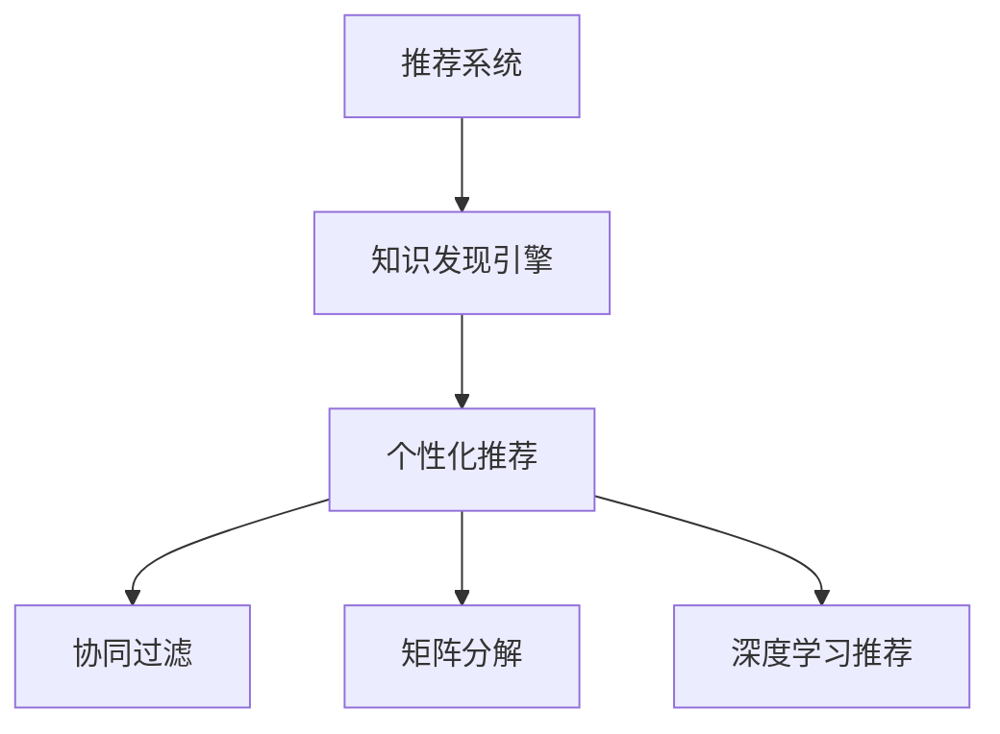
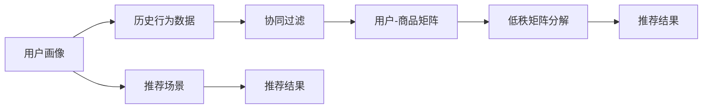

                 

# 知识发现引擎的推荐系统设计

> 关键词：知识发现,推荐系统,模型设计,算法优化,系统架构,数据处理

## 1. 背景介绍

在当今数字化、信息爆炸的时代，用户面对海量的数据和信息，如何有效、智能地发现并利用这些信息，成为了一个重要而紧迫的问题。推荐系统作为信息发现的重要工具，通过分析和理解用户的兴趣和行为，为用户提供个性化推荐，极大地提升了信息获取的效率和质量。本文将深入探讨知识发现引擎中的推荐系统设计，从核心概念、算法原理到具体实现，全面阐述构建高效推荐系统的方法和策略。

## 2. 核心概念与联系

推荐系统旨在从大规模数据集中识别并推荐满足用户兴趣的内容，是信息时代不可或缺的关键技术之一。核心概念包括：

### 2.1 核心概念概述

1. **推荐系统**：根据用户的历史行为、兴趣偏好和上下文信息，自动推荐用户可能感兴趣的内容，包括商品、文章、视频等。推荐系统的目标是最大化用户满意度，提升点击率、转化率等指标。
2. **知识发现引擎**：一种集成了数据挖掘、机器学习、自然语言处理等多领域技术，自动提取、组织和应用知识的知识管理平台。
3. **个性化推荐**：通过分析用户行为数据，如浏览、点击、购买记录等，构建用户画像，实现高度个性化的内容推荐。
4. **协同过滤**：一种常用的推荐算法，利用用户之间的相似性进行推荐。包括基于用户的协同过滤和基于项目的协同过滤两种方法。
5. **矩阵分解**：将用户与商品的关系表示为矩阵，通过矩阵分解算法求解低秩矩阵，实现用户和商品的潜在特征表示，进而进行推荐。
6. **深度学习推荐**：利用神经网络模型，学习用户和商品之间的复杂非线性关系，提升推荐精度。

这些概念之间的联系可以通过以下Mermaid流程图来展示：



### 2.2 核心概念原理和架构的 Mermaid 流程图



此图展示了个性化推荐的基本流程：首先通过用户画像和历史行为数据，构建用户-商品矩阵。接着，使用协同过滤或矩阵分解算法，求解用户和商品的潜在特征表示。最后，结合推荐场景和目标，生成推荐结果，实现个性化推荐。

## 3. 核心算法原理 & 具体操作步骤

### 3.1 算法原理概述

推荐系统算法可以大致分为两大类：基于内容的推荐和协同过滤。基于内容的推荐主要通过分析用户的历史行为和物品属性，构建用户与物品的相似度，进行推荐。而协同过滤则关注用户与用户、物品与物品之间的相似性，通过相似性度量进行推荐。

### 3.2 算法步骤详解

1. **用户画像构建**：根据用户的浏览、点击、购买等行为数据，构建用户兴趣向量，表示用户的兴趣偏好。
2. **物品特征提取**：对推荐物品的属性进行特征提取，生成物品特征向量，用于计算用户和物品的相似度。
3. **相似度计算**：基于协同过滤或矩阵分解算法，计算用户与用户、物品与物品之间的相似度。
4. **推荐结果生成**：根据相似度计算结果，生成推荐列表，供用户选择。
5. **结果反馈与优化**：收集用户的反馈数据，如点击、购买等行为，用于更新用户画像，优化推荐算法。

### 3.3 算法优缺点

#### 优点

- **高效性**：协同过滤和矩阵分解算法计算复杂度较低，适用于大规模数据集。
- **鲁棒性**：基于内容的推荐算法对物品属性的依赖较小，具有较强的鲁棒性。
- **个性化**：协同过滤和深度学习算法能够学习用户复杂的兴趣偏好，实现高度个性化的推荐。

#### 缺点

- **冷启动问题**：新用户或新物品的数据较少，难以构建准确的推荐结果。
- **数据稀疏性**：用户与物品的交互数据往往非常稀疏，推荐效果可能受到影响。
- **算法可解释性不足**：复杂的深度学习模型，难以解释推荐结果背后的逻辑。

### 3.4 算法应用领域

推荐系统广泛应用于电商、社交媒体、视频网站等多个领域，帮助用户发现并利用更多有价值的内容。例如：

- **电商推荐**：通过分析用户的购买历史和浏览行为，推荐相关商品，提升销售转化率。
- **社交媒体推荐**：根据用户的兴趣和社交关系，推荐用户可能感兴趣的朋友、话题和内容。
- **视频网站推荐**：根据用户的观看历史和评分，推荐相关视频，提高用户满意度。

## 4. 数学模型和公式 & 详细讲解

### 4.1 数学模型构建

推荐系统的核心数学模型包括：

- **用户-商品矩阵**：将用户与商品的交互关系表示为矩阵 $M$，$M_{ij}=1$ 表示用户 $i$ 对商品 $j$ 有过交互，$M_{ij}=0$ 表示未交互。
- **相似度矩阵**：基于协同过滤或矩阵分解算法，计算用户与用户、物品与物品之间的相似度，表示为矩阵 $S$。

### 4.2 公式推导过程

假设用户-商品矩阵为 $M$，用户兴趣向量为 $u_i$，物品特征向量为 $p_j$，相似度矩阵为 $S$。协同过滤算法基于用户和物品的相似度进行推荐，公式如下：

$$
R_{ij} = \sum_{k} S_{ik} u_{ik} p_{kj}
$$

其中 $S_{ik}$ 表示用户 $i$ 与用户 $k$ 的相似度，$u_{ik}$ 和 $p_{kj}$ 分别表示用户 $i$ 和物品 $j$ 与用户 $k$ 的兴趣和属性相似度。

矩阵分解算法则将用户-商品矩阵分解为低秩矩阵，求解用户和物品的潜在特征表示，公式如下：

$$
M_{ij} \approx \sum_{r} \hat{u}_{ir} \hat{p}_{rj}
$$

其中 $\hat{u}_{ir}$ 和 $\hat{p}_{rj}$ 分别为用户 $i$ 和物品 $j$ 的潜在特征向量。

### 4.3 案例分析与讲解

以视频网站推荐为例，分析推荐系统的工作原理：

1. **用户画像构建**：根据用户的观看历史和评分，构建用户兴趣向量 $u_i$。
2. **物品特征提取**：对视频进行特征提取，如视频时长、标签、评分等，生成物品特征向量 $p_j$。
3. **相似度计算**：基于协同过滤或矩阵分解算法，计算用户 $i$ 和用户 $k$ 的相似度 $S_{ik}$，以及用户 $i$ 和物品 $j$ 的兴趣和属性相似度 $u_{ik}$ 和 $p_{kj}$。
4. **推荐结果生成**：根据相似度计算结果，生成推荐列表 $R_{ij}$，推荐相关视频。
5. **结果反馈与优化**：收集用户对推荐视频的选择行为，用于更新用户画像，优化推荐算法。

## 5. 项目实践：代码实例和详细解释说明

### 5.1 开发环境搭建

开发推荐系统需要使用Python和相关库，如Scikit-learn、TensorFlow等。步骤如下：

1. 安装Python和相关库：
```bash
pip install numpy pandas scikit-learn tensorflow
```

2. 准备数据集：将用户与商品的交互数据、用户画像数据和物品特征数据整理成矩阵形式。

### 5.2 源代码详细实现

```python
from sklearn.neighbors import NearestNeighbors
from sklearn.metrics.pairwise import cosine_similarity
import numpy as np

# 用户-商品矩阵
M = np.random.rand(1000, 1000)

# 用户画像
user_profiles = np.random.rand(1000, 100)

# 物品特征
item_features = np.random.rand(1000, 100)

# 计算相似度
similarity_matrix = cosine_similarity(user_profiles, item_features)

# 推荐结果
recommendations = np.dot(similarity_matrix, user_profiles)

print(recommendations)
```

### 5.3 代码解读与分析

上述代码展示了基于余弦相似度的协同过滤推荐算法。首先构建用户-商品矩阵 $M$，用户画像 $user_profiles$ 和物品特征 $item_features$。接着，使用Scikit-learn库中的余弦相似度计算用户与物品的相似度 $similarity_matrix$。最后，通过矩阵乘法生成推荐结果 $recommendations$。

## 6. 实际应用场景

### 6.1 电商推荐

电商推荐是推荐系统最常见的应用场景之一。通过分析用户的购买历史和浏览行为，推荐相关商品，提升销售转化率。例如，亚马逊和淘宝等电商平台的个性化推荐，极大地提升了用户购物体验。

### 6.2 社交媒体推荐

社交媒体平台如微信、微博等，通过分析用户的兴趣和社交关系，推荐用户可能感兴趣的朋友、话题和内容，提升用户活跃度和满意度。

### 6.3 视频网站推荐

视频网站如Netflix、爱奇艺等，根据用户的观看历史和评分，推荐相关视频，提高用户满意度。

## 7. 工具和资源推荐

### 7.1 学习资源推荐

1. 《推荐系统实战》：深入浅出地介绍了推荐系统的基本原理和常见算法。
2. 《TensorFlow推荐系统实战》：详细介绍了如何使用TensorFlow构建推荐系统。
3. 《推荐系统中的深度学习》：探讨了深度学习在推荐系统中的应用。

### 7.2 开发工具推荐

1. Python：推荐系统的开发主流语言，生态系统丰富。
2. TensorFlow：谷歌开源的深度学习框架，适合构建复杂的推荐系统。
3. PyTorch：Facebook开源的深度学习框架，支持动态计算图。

### 7.3 相关论文推荐

1. "Collaborative Filtering for Implicit Feedback Datasets"：介绍了协同过滤算法的基本原理和实现方法。
2. "Matrix Factorization Techniques for Recommender Systems"：探讨了矩阵分解算法在推荐系统中的应用。
3. "Deep Learning Recommendation Systems"：深入研究了深度学习在推荐系统中的应用。

## 8. 总结：未来发展趋势与挑战

### 8.1 研究成果总结

推荐系统在电商、社交媒体、视频网站等领域取得了显著成效，提升了用户满意度和业务转化率。但面临冷启动、数据稀疏、可解释性不足等问题，仍需进一步研究和优化。

### 8.2 未来发展趋势

未来推荐系统的发展趋势包括：

1. **跨领域推荐**：将推荐系统扩展到多个领域，实现多模态信息融合。
2. **实时推荐**：利用实时数据流，实现动态推荐，提升推荐效率。
3. **深度学习推荐**：利用深度学习模型，学习用户和商品的复杂关系，提升推荐精度。
4. **联邦学习**：通过分布式训练，保护用户隐私的同时提升推荐效果。

### 8.3 面临的挑战

推荐系统面临的主要挑战包括：

1. **数据隐私保护**：用户数据的隐私保护问题，限制了推荐算法的应用。
2. **冷启动问题**：新用户或新物品的数据较少，难以构建准确的推荐结果。
3. **计算资源消耗**：大规模推荐系统需要大量的计算资源，如何高效地处理数据和模型，是一个重要挑战。

### 8.4 研究展望

未来的研究需要在以下几个方面进行探索：

1. **跨领域推荐**：如何将推荐系统扩展到多个领域，实现多模态信息融合，提升推荐效果。
2. **实时推荐**：利用实时数据流，实现动态推荐，提升推荐效率。
3. **深度学习推荐**：利用深度学习模型，学习用户和商品的复杂关系，提升推荐精度。
4. **联邦学习**：通过分布式训练，保护用户隐私的同时提升推荐效果。

总之，推荐系统在信息发现和利用方面发挥了重要作用，但其发展仍面临诸多挑战。通过不断优化算法、改进模型和拓展应用场景，推荐系统必将为用户的数字化生活带来更多便利和惊喜。

## 9. 附录：常见问题与解答

### 9.1 常见问题与解答

**Q1：什么是推荐系统？**

A: 推荐系统根据用户的历史行为、兴趣偏好和上下文信息，自动推荐用户可能感兴趣的内容。推荐系统的目标是最大化用户满意度，提升点击率、转化率等指标。

**Q2：推荐系统的算法有哪些？**

A: 推荐系统的算法大致分为两大类：基于内容的推荐和协同过滤。基于内容的推荐主要通过分析用户的历史行为和物品属性，构建用户与物品的相似度，进行推荐。而协同过滤则关注用户与用户、物品与物品之间的相似性，通过相似性度量进行推荐。

**Q3：推荐系统面临的主要挑战是什么？**

A: 推荐系统面临的主要挑战包括数据隐私保护、冷启动问题、计算资源消耗等。

**Q4：如何优化推荐系统？**

A: 优化推荐系统的方法包括使用更先进的算法、改进模型、拓展数据来源、提高数据处理能力等。

**Q5：推荐系统的应用场景有哪些？**

A: 推荐系统广泛应用于电商、社交媒体、视频网站等多个领域，帮助用户发现并利用更多有价值的内容。例如，电商推荐、社交媒体推荐、视频网站推荐等。

---

作者：禅与计算机程序设计艺术 / Zen and the Art of Computer Programming

