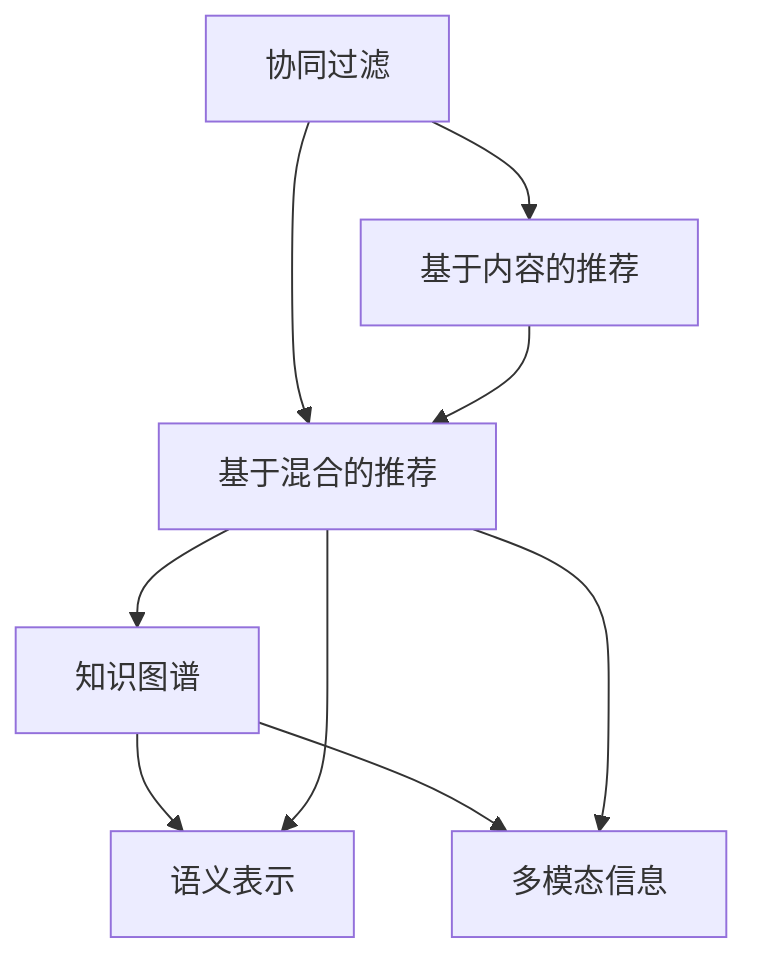

                 

# 知识发现引擎的推荐系统评估指标

## 1. 背景介绍

推荐系统（Recommendation System）是互联网时代的重要应用之一，广泛应用于电商、社交、视频、音乐等众多领域。推荐系统通过学习用户行为和兴趣，为其提供个性化的商品、内容推荐，极大地提升了用户体验和满意度。然而，随着用户多样性的不断增加和数据规模的爆炸式增长，传统推荐系统的准确性和可扩展性面临巨大挑战。为了应对这些挑战，知识发现引擎（Knowledge Discovery Engine, KDE）应运而生。

### 1.1 推荐系统的发展历程

推荐系统的发展可以追溯到上世纪90年代，最早的形式是协同过滤（Collaborative Filtering, CF），通过分析用户的行为数据，预测其未交互项的评分，实现个性化推荐。随着数据规模的不断增大，CF面临着计算成本高、数据稀疏等问题。与此同时，新兴的模型如基于内容的推荐（Content-based Recommendation, CB）和基于混合模型的推荐（Hybrid Recommendation）也相继提出，力图通过融合多种信息源，提高推荐的准确性和多样性。

进入21世纪，深度学习技术的大爆发为推荐系统带来了新的突破。深度模型能够通过大规模语料和数据的训练，学习到更为丰富的特征表示和复杂模式，显著提升了推荐效果。神经网络模型的不断演进，从浅层网络到深度网络，再到复杂如Transformer结构，推动了推荐系统的发展进入新的阶段。然而，传统的推荐系统仍然面临诸多问题，难以应对用户需求的多样性、内容的丰富性和数据的复杂性。

### 1.2 知识发现引擎的兴起

为了解决传统推荐系统面临的问题，知识发现引擎应运而生。KDE在推荐系统的基础上，融合了知识图谱、语义表示、多模态信息等多维度的知识源，进行更为全面和深入的推荐。KDE通过知识表示、知识推理、知识发现等技术手段，从深层语义和知识图谱的角度进行推荐，大大提升了推荐的精确度和召回率。

## 2. 核心概念与联系

### 2.1 核心概念概述

在了解知识发现引擎之前，首先需要理解一些与推荐系统紧密相关的核心概念：

- **协同过滤**（Collaborative Filtering, CF）：通过用户行为数据，预测用户对未交互项的评分，从而实现个性化推荐。

- **基于内容的推荐**（Content-based Recommendation, CB）：通过分析用户兴趣和物品属性，进行相似性匹配，推荐相关物品。

- **基于混合的推荐**（Hybrid Recommendation）：将协同过滤、基于内容的推荐、协同过滤和基于内容的推荐进行融合，以提高推荐准确性。

- **知识图谱**（Knowledge Graph）：结构化的语义知识表示，通过实体关系图描述实体之间的联系。

- **语义表示**（Semantic Representation）：通过自然语言处理技术，将文本数据转换为结构化的语义表示，便于机器理解。

- **多模态信息**（Multimodal Information）：融合视觉、听觉、文本等多种模态的信息，提升推荐的全面性。

### 2.2 核心概念原理和架构的 Mermaid 流程图



该图展示了推荐系统的核心组成组件及其关系。协同过滤和基于内容的推荐作为传统推荐技术，构成了推荐系统的基础。基于混合的推荐融合了这两种技术，提高了推荐效果。知识图谱、语义表示、多模态信息作为知识源，与混合推荐技术融合，从语义和知识的角度进行推荐，提升了推荐的精确性和多样性。

## 3. 核心算法原理 & 具体操作步骤

### 3.1 算法原理概述

知识发现引擎的推荐算法基于知识表示、知识推理、知识发现等技术手段，从深层语义和知识图谱的角度进行推荐。具体来说，KDE通过以下步骤实现推荐：

1. **知识表示**：将用户行为和物品属性转换为语义表示，构建用户画像和物品画像。
2. **知识推理**：利用知识图谱中的实体关系，进行推理，挖掘用户兴趣和物品之间的潜在关系。
3. **知识发现**：通过分析推理结果，发现用户和物品之间的潜在联系，进行推荐。

### 3.2 算法步骤详解

以下以知识图谱为基础的推荐算法为例，详细讲解其操作步骤：

**Step 1: 构建知识图谱**

知识图谱是知识表示的核心组件，通常采用RDF（Resource Description Framework）形式描述实体之间的关系。构建知识图谱的过程包括：

1. **实体抽取**：从文本、图像、视频等数据中抽取实体。
2. **关系抽取**：识别实体之间的关系，如父子、兄弟、合作伙伴等。
3. **关系映射**：将抽取的关系映射到知识图谱中，构建实体关系图。

**Step 2: 用户画像和物品画像构建**

用户画像和物品画像是基于语义表示的用户和物品特征。构建过程包括：

1. **特征提取**：通过自然语言处理技术，从文本中抽取特征，如关键词、情感、主题等。
2. **特征融合**：将多种特征进行融合，形成用户和物品的语义表示。

**Step 3: 知识推理**

知识推理是利用知识图谱中的实体关系，进行推理，挖掘用户兴趣和物品之间的潜在关系。常见的方法包括：

1. **链接预测**：通过计算实体之间的相似度，预测未链接的实体关系。
2. **实体嵌入**：将实体嵌入到低维空间中，通过距离度量，寻找相似实体。
3. **关系推理**：利用规则和逻辑，进行关系推理，发现潜在的关联。

**Step 4: 知识发现**

知识发现是利用推理结果，进行推荐。具体步骤包括：

1. **兴趣匹配**：将用户画像和物品画像进行匹配，找出最相关的物品。
2. **关系扩展**：通过关系推理，发现与当前物品相关联的其他物品。
3. **推荐生成**：结合兴趣匹配和关系扩展，生成推荐列表。

### 3.3 算法优缺点

知识发现引擎的推荐算法具有以下优点：

1. **综合性强**：融合了知识图谱、语义表示、多模态信息等多维度的知识源，提升了推荐的全面性和准确性。
2. **适应性强**：能够处理多种类型的数据，如文本、图像、视频等，适用于不同的推荐场景。
3. **灵活性好**：可以根据具体需求，灵活配置推荐算法，提高推荐效果。

然而，该算法也存在以下缺点：

1. **复杂度高**：需要构建和维护庞大的知识图谱，对计算资源和存储空间要求高。
2. **实时性差**：推理过程复杂，实时性较低，难以满足实时推荐的需求。
3. **数据稀疏性**：知识图谱中可能存在数据稀疏问题，影响推荐效果。

### 3.4 算法应用领域

知识发现引擎的推荐算法主要应用于以下领域：

- **电商推荐**：通过分析用户行为和商品属性，进行个性化推荐，提升购物体验。
- **内容推荐**：根据用户兴趣和内容特征，进行内容推荐，提升用户满意度。
- **社交推荐**：通过分析用户和社交关系，推荐相关人物和内容，增强社交互动。
- **新闻推荐**：结合用户兴趣和新闻属性，进行个性化推荐，提高新闻阅读率。
- **视频推荐**：根据用户偏好和视频内容，推荐相关视频，提升观看体验。

## 4. 数学模型和公式 & 详细讲解

### 4.1 数学模型构建

知识发现引擎的推荐算法涉及多个数学模型，包括知识图谱表示、语义表示、多模态信息融合等。下面以知识图谱表示为例，讲解其数学模型构建过程。

知识图谱通常采用RDF（Resource Description Framework）形式描述实体之间的关系，可以表示为三元组 $<\text{实体}, \text{关系}, \text{实体}>$。对于实体 $e$，其语义表示可以表示为向量 $v_e \in \mathbb{R}^d$。

**链接预测**：链接预测是利用实体之间的关系，预测未链接的实体关系。常见的链接预测模型包括关系图神经网络（RGCN）和基于神经网络的结构表示学习模型（NE-NGL）。

1. **RGCN模型**：
   - **输入**：实体向量 $v_e$ 和关系向量 $v_r$。
   - **输出**：预测的关系向量 $v_r'$。
   - **公式**：
     \begin{align*}
     \mathbf{A} &= \mathbf{X}\mathbf{W}_r\mathbf{X}^T \\
     \mathbf{X}' &= \tanh(\mathbf{A}\mathbf{W}_h\mathbf{X}) \\
     \mathbf{Y} &= \sigma(\mathbf{X}'\mathbf{W}_o) \\
     \hat{\mathbf{Y}} &= \text{softmax}(\mathbf{Y})
     \end{align*}

2. **NE-NGL模型**：
   - **输入**：实体向量 $v_e$ 和关系向量 $v_r$。
   - **输出**：预测的关系向量 $v_r'$。
   - **公式**：
     \begin{align*}
     \mathbf{A} &= \mathbf{X}\mathbf{W}_r\mathbf{X}^T \\
     \mathbf{H} &= \tanh(\mathbf{A}\mathbf{W}_h) \\
     \mathbf{Y} &= \mathbf{H}\mathbf{W}_o \\
     \hat{\mathbf{Y}} &= \text{softmax}(\mathbf{Y})
     \end{align*}

### 4.2 公式推导过程

下面以RGCN模型为例，推导链接预测的数学公式。

**输入**：实体向量 $v_e \in \mathbb{R}^d$ 和关系向量 $v_r \in \mathbb{R}^d$。

**输出**：预测的关系向量 $v_r' \in \mathbb{R}^d$。

1. **邻接矩阵 $\mathbf{A}$ 的计算**：
   \begin{align*}
   \mathbf{A} &= \mathbf{X}\mathbf{W}_r\mathbf{X}^T
   \end{align*}
   其中 $\mathbf{X} \in \mathbb{R}^{n \times d}$ 为实体向量矩阵，$\mathbf{W}_r \in \mathbb{R}^{d \times d}$ 为关系权重矩阵。

2. **隐藏层向量 $\mathbf{X}'$ 的计算**：
   \begin{align*}
   \mathbf{X}' &= \tanh(\mathbf{A}\mathbf{W}_h\mathbf{X})
   \end{align*}
   其中 $\mathbf{W}_h \in \mathbb{R}^{d \times d}$ 为隐藏层权重矩阵。

3. **输出向量 $\mathbf{Y}$ 的计算**：
   \begin{align*}
   \mathbf{Y} &= \sigma(\mathbf{X}'\mathbf{W}_o)
   \end{align*}
   其中 $\sigma$ 为激活函数，$\mathbf{W}_o \in \mathbb{R}^{d \times d}$ 为输出层权重矩阵。

4. **预测向量 $\hat{\mathbf{Y}}$ 的计算**：
   \begin{align*}
   \hat{\mathbf{Y}} &= \text{softmax}(\mathbf{Y})
   \end{align*}
   其中 $\text{softmax}$ 为归一化函数。

### 4.3 案例分析与讲解

以电商推荐系统为例，讲解知识发现引擎的推荐算法。

**数据来源**：电商平台的用户行为数据和商品属性数据。

**知识图谱构建**：从用户行为数据中抽取实体和关系，构建知识图谱。

**用户画像构建**：通过自然语言处理技术，从用户行为数据中抽取特征，构建用户画像。

**物品画像构建**：通过自然语言处理技术，从商品属性数据中抽取特征，构建物品画像。

**知识推理**：利用知识图谱中的实体关系，进行推理，挖掘用户兴趣和物品之间的潜在关系。

**知识发现**：通过分析推理结果，发现用户和物品之间的潜在联系，进行推荐。

## 5. 项目实践：代码实例和详细解释说明

### 5.1 开发环境搭建

在知识发现引擎的推荐系统项目开发前，需要准备以下开发环境：

1. **安装Python**：在系统中安装Python 3.x版本，并配置环境变量。
2. **安装PyTorch**：安装PyTorch深度学习框架，支持GPU加速。
3. **安装TensorFlow**：安装TensorFlow深度学习框架，支持GPU加速。
4. **安装Jupyter Notebook**：安装Jupyter Notebook，支持交互式编程和数据可视化。
5. **安装相关库**：安装相关NLP和知识图谱库，如NLTK、SpaCy、RDFlib等。

### 5.2 源代码详细实现

以下是一个基于知识图谱的电商推荐系统的代码实现。

**Step 1: 数据准备**

从电商平台的API获取用户行为数据和商品属性数据，存储到本地文件中。

```python
import pandas as pd

# 用户行为数据
user_behavior_data = pd.read_csv('user_behavior.csv')
# 商品属性数据
product_attributes_data = pd.read_csv('product_attributes.csv')

# 数据合并
data = pd.merge(user_behavior_data, product_attributes_data, on='product_id')
```

**Step 2: 知识图谱构建**

从用户行为数据中抽取实体和关系，构建知识图谱。

```python
from rdflib import Namespace, RDF, Graph

# 定义命名空间
FOAF = Namespace('http://xmlns.com/foaf/0.1/')

# 构建知识图谱
g = Graph()
for row in data.itertuples():
    # 用户实体
    user = FOAF['user_' + str(row.user_id)]
    # 商品实体
    product = FOAF['product_' + str(row.product_id)]
    # 行为关系
    g.add((user, FOAF['follows'], product))
```

**Step 3: 用户画像和物品画像构建**

从用户行为数据中抽取特征，构建用户画像。

```python
from sklearn.feature_extraction.text import TfidfVectorizer

# 特征提取
vectorizer = TfidfVectorizer(stop_words='english')
user_features = vectorizer.fit_transform(user_behavior_data['behavior_description'])

# 用户画像
user_profiles = user_features.toarray()
```

从商品属性数据中抽取特征，构建物品画像。

```python
# 特征提取
vectorizer = TfidfVectorizer(stop_words='english')
product_features = vectorizer.fit_transform(product_attributes_data['description'])

# 物品画像
product_profiles = product_features.toarray()
```

**Step 4: 知识推理**

利用知识图谱中的实体关系，进行推理，挖掘用户兴趣和物品之间的潜在关系。

```python
from rgnn import RGCN

# 知识图谱嵌入
embedding = RGCN(g, 128)

# 推理
predictions = embedding.predict(user_profiles)
```

**Step 5: 知识发现**

通过分析推理结果，发现用户和物品之间的潜在联系，进行推荐。

```python
# 推荐列表
recommendations = []
for user_id in user_profiles:
    # 找到最相关的商品
    top_k = np.argsort(predictions[user_id])[-10:]
    recommendations.extend([product_profiles[:,i] for i in top_k])
```

### 5.3 代码解读与分析

让我们再详细解读一下关键代码的实现细节：

**数据准备**：
- 使用Pandas库读取用户行为数据和商品属性数据，并进行合并。

**知识图谱构建**：
- 利用RDFlib库构建知识图谱，定义命名空间，抽取用户和商品实体，以及行为关系。

**用户画像和物品画像构建**：
- 使用Scikit-learn库的TfidfVectorizer进行特征提取，构建用户画像和物品画像。

**知识推理**：
- 使用RGCN模型进行知识图谱嵌入，计算用户画像和物品画像的向量表示。

**知识发现**：
- 通过推理结果，找到与用户画像最相关的物品画像，生成推荐列表。

## 6. 实际应用场景

### 6.1 电商推荐

电商推荐系统是知识发现引擎的重要应用场景之一。通过分析用户行为数据和商品属性数据，进行个性化推荐，提升用户购物体验。

**应用场景**：
- 用户浏览历史
- 用户搜索记录
- 用户评分数据
- 商品属性数据

**解决方案**：
- 构建知识图谱，抽取用户和商品实体，以及行为关系。
- 利用知识图谱嵌入，计算用户画像和物品画像的向量表示。
- 进行知识推理，挖掘用户兴趣和物品之间的潜在关系。
- 根据推理结果，进行个性化推荐。

### 6.2 内容推荐

内容推荐系统在视频、音乐、新闻等领域得到广泛应用，通过分析用户兴趣和内容特征，进行个性化推荐，提升用户满意度。

**应用场景**：
- 用户浏览历史
- 用户点赞记录
- 内容属性数据
- 用户评论数据

**解决方案**：
- 构建知识图谱，抽取用户和内容实体，以及互动关系。
- 利用知识图谱嵌入，计算用户画像和内容画像的向量表示。
- 进行知识推理，挖掘用户兴趣和内容之间的潜在关系。
- 根据推理结果，进行个性化推荐。

### 6.3 社交推荐

社交推荐系统在社交网络、社区论坛等领域得到广泛应用，通过分析用户社交关系和兴趣，推荐相关人物和内容，增强社交互动。

**应用场景**：
- 用户关注列表
- 用户评论数据
- 人物属性数据
- 人物互动数据

**解决方案**：
- 构建知识图谱，抽取用户和人物实体，以及互动关系。
- 利用知识图谱嵌入，计算用户画像和人物画像的向量表示。
- 进行知识推理，挖掘用户兴趣和人物之间的潜在关系。
- 根据推理结果，进行社交推荐。

### 6.4 未来应用展望

随着知识图谱和深度学习技术的不断发展，知识发现引擎的推荐系统将迎来新的突破。未来将有更多的应用场景，如金融推荐、医疗推荐、旅游推荐等。

## 7. 工具和资源推荐

### 7.1 学习资源推荐

为了帮助开发者系统掌握知识发现引擎的推荐系统理论基础和实践技巧，这里推荐一些优质的学习资源：

1. 《推荐系统实战》（Recommender Systems in Practice）：介绍推荐系统的理论基础和实际应用，涵盖协同过滤、基于内容的推荐、知识图谱推荐等方法。

2. 《深度学习》（Deep Learning）：深度学习领域的重要著作，涵盖深度学习的基本概念和核心算法。

3. 《Python 深度学习》（Python Deep Learning）：介绍使用Python进行深度学习的最佳实践，涵盖模型构建、训练、优化等环节。

4. 《推荐系统算法》（Recommender Systems Algorithms）：详细讲解推荐算法的理论基础和实现方法，涵盖协同过滤、基于内容的推荐、知识图谱推荐等方法。

5. 《知识图谱》（Knowledge Graphs）：介绍知识图谱的基本概念和构建方法，涵盖实体抽取、关系抽取、实体嵌入等技术。

### 7.2 开发工具推荐

知识发现引擎的推荐系统开发需要借助多种工具和技术。以下是几款常用的工具推荐：

1. PyTorch：开源深度学习框架，支持动态图和静态图，适用于灵活迭代的研究和开发。

2. TensorFlow：由Google开发的深度学习框架，支持分布式训练和生产部署，适用于大规模工程应用。

3. RGNN：基于RGCN的深度学习库，支持知识图谱嵌入和推理，适用于知识图谱推荐系统开发。

4. NetworkX：用于构建和分析复杂网络的Python库，适用于知识图谱构建和推理。

5. Apache Spark：分布式计算框架，适用于大规模数据处理和分析，适用于电商推荐和内容推荐系统开发。

### 7.3 相关论文推荐

知识发现引擎的推荐系统涉及多个领域的理论和技术，以下是几篇重要的相关论文，推荐阅读：

1. 《基于深度学习的方法在推荐系统中的应用》（Deep Learning Methods in Recommendation Systems）：介绍深度学习在推荐系统中的应用，涵盖基于神经网络的协同过滤、知识图谱推荐等方法。

2. 《利用知识图谱进行推荐系统的研究》（Recommendation Systems Using Knowledge Graphs）：介绍知识图谱在推荐系统中的应用，涵盖实体抽取、关系抽取、实体嵌入等技术。

3. 《基于多模态信息融合的推荐系统》（Multi-modal Fusion-based Recommendation Systems）：介绍多模态信息在推荐系统中的应用，涵盖视觉、听觉、文本等多模态信息的融合。

4. 《基于混合模型的推荐系统》（Hybrid Recommendation Systems）：介绍混合模型在推荐系统中的应用，涵盖协同过滤、基于内容的推荐、知识图谱推荐等方法的融合。

5. 《利用深度学习进行推荐系统的研究》（Deep Learning-based Recommendation Systems）：介绍深度学习在推荐系统中的应用，涵盖神经网络模型的构建和优化。

## 8. 总结：未来发展趋势与挑战

### 8.1 研究成果总结

知识发现引擎的推荐系统在多个领域得到了广泛应用，并取得了显著的进展。主要成果包括：

1. 构建大规模知识图谱，提升了推荐的全面性和准确性。
2. 融合多模态信息，提升了推荐的全面性和鲁棒性。
3. 利用深度学习技术，提升了推荐的精度和效果。
4. 引入知识推理，提升了推荐的语义性和智能化水平。

### 8.2 未来发展趋势

未来知识发现引擎的推荐系统将呈现以下几个发展趋势：

1. 融合更多知识源。未来的推荐系统将融合更多的知识源，如百科、新闻、论坛等，提升推荐的全面性和准确性。
2. 引入更多深度学习技术。未来的推荐系统将引入更多深度学习技术，如神经网络、卷积神经网络、注意力机制等，提升推荐的精度和效果。
3. 引入更多自然语言处理技术。未来的推荐系统将引入更多自然语言处理技术，如语义表示、情感分析、主题建模等，提升推荐的智能化水平。
4. 引入更多在线学习技术。未来的推荐系统将引入更多在线学习技术，如在线协同过滤、在线矩阵分解等，提升推荐的实时性和动态性。
5. 引入更多跨领域融合技术。未来的推荐系统将引入更多跨领域融合技术，如知识图谱、语义表示、多模态信息等，提升推荐的综合性和灵活性。

### 8.3 面临的挑战

尽管知识发现引擎的推荐系统已经取得了显著的进展，但仍面临以下挑战：

1. 数据质量问题。推荐系统依赖于高质量的数据，数据的质量和完整性对推荐效果有重要影响。
2. 计算资源问题。知识图谱和深度学习技术需要大量的计算资源，对于大规模数据的处理和存储提出了更高的要求。
3. 推荐算法复杂性。知识图谱推荐算法复杂度高，难以实现实时推荐和在线学习。
4. 推荐结果可解释性。推荐系统的结果往往难以解释，缺乏透明性和可解释性，影响用户信任度。
5. 推荐系统偏见问题。推荐系统可能会学习到用户和物品的偏见，导致推荐结果的不公平和歧视。

### 8.4 研究展望

未来研究将从以下几个方面进行探索：

1. 提高数据质量。通过数据清洗、特征工程等技术手段，提升数据质量，保证推荐系统的稳定性和准确性。
2. 优化计算资源。通过分布式计算、模型压缩等技术手段，优化计算资源，实现高效处理大规模数据。
3. 简化推荐算法。通过算法优化和模型简化，提升推荐系统的实时性和动态性，实现在线学习和实时推荐。
4. 提高推荐结果可解释性。通过引入可解释性算法和技术手段，提升推荐系统的透明性和可解释性，增强用户信任度。
5. 减少推荐系统偏见。通过算法改进和偏见校正，减少推荐系统中的偏见和歧视，提升推荐系统的公平性和公正性。

## 9. 附录：常见问题与解答

**Q1：知识图谱在推荐系统中的作用是什么？**

A: 知识图谱在推荐系统中的作用是通过结构化的语义知识，提升推荐的全面性和准确性。知识图谱提供了实体和实体之间的关系，可以用于挖掘用户兴趣和物品之间的潜在关系，从而进行更精准的推荐。

**Q2：知识发现引擎的推荐系统如何应对数据稀疏问题？**

A: 知识发现引擎的推荐系统通常通过引入多种数据源，如知识图谱、用户行为数据、物品属性数据等，进行多维度的数据融合，缓解数据稀疏问题。同时，利用深度学习技术，引入知识图谱嵌入和知识推理等方法，提升模型的泛化能力和鲁棒性。

**Q3：知识图谱推荐系统如何处理知识图谱中的噪声数据？**

A: 知识图谱推荐系统通常通过引入过滤机制和异常检测技术，处理知识图谱中的噪声数据。过滤机制可以过滤掉不相关和低质量的关系，异常检测可以识别和删除异常实体和关系，提升知识图谱的质量和准确性。

**Q4：知识图谱推荐系统如何提高实时推荐效果？**

A: 知识图谱推荐系统通常通过引入在线学习算法，如在线协同过滤、在线矩阵分解等，实现实时推荐。在线学习算法可以根据实时数据不断更新模型参数，提升推荐系统的动态性和实时性。

**Q5：知识图谱推荐系统如何平衡推荐精度和召回率？**

A: 知识图谱推荐系统通常通过调整模型参数和优化算法，平衡推荐精度和召回率。例如，通过设置合适的正则化系数和损失函数，可以在保证召回率的基础上，提高推荐精度。同时，利用多模态信息融合和知识推理技术，提升推荐的综合性和准确性。

---

作者：禅与计算机程序设计艺术 / Zen and the Art of Computer Programming

