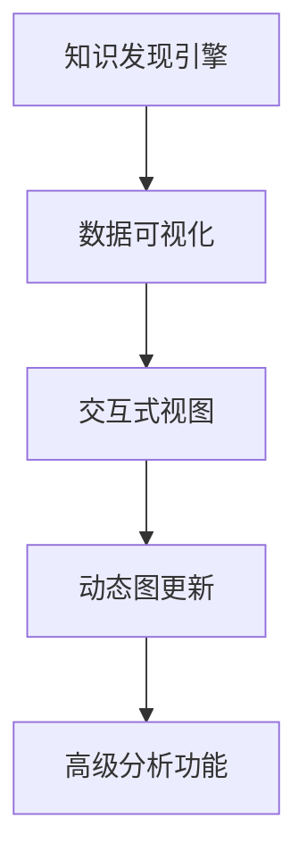

                 

# 知识发现引擎的数据可视化技术与实现

> 关键词：数据可视化, 知识发现引擎, 数据探索, 交互式视图, 动态图

## 1. 背景介绍

### 1.1 问题由来
随着数据科学和人工智能技术的飞速发展，企业越来越依赖数据来驱动业务决策和创新。然而，大数据时代也带来了数据繁杂、形式多样的挑战，使得数据价值的挖掘变得困难重重。

知识发现引擎（Knowledge Discovery Engine, KDE）正是在这种背景下应运而生的技术工具，通过智能分析、数据挖掘和可视化，帮助企业高效地发现数据中蕴含的知识和价值。数据可视化是KDE不可或缺的核心技术之一，通过直观展示数据特征和趋势，使决策者能够更迅速、更准确地理解和利用数据。

### 1.2 问题核心关键点
数据可视化技术在KDE中的应用，主要包括以下几个关键点：

- **数据处理与展示**：将原始数据转换为可视化图形，提供直观、易理解的信息展示。
- **交互式分析**：通过交互式工具，让用户能够自由探索数据，发现潜在的规律和模式。
- **动态图更新**：数据集更新后，能够即时反映最新信息，保持视图的有效性。
- **高级分析功能**：结合机器学习、统计学等方法，提供更深入的洞见和预测能力。

### 1.3 问题研究意义
数据可视化在知识发现中的应用，具有以下几方面的研究意义：

- **提升决策效率**：通过直观展示复杂数据，使决策者能够迅速理解关键信息，做出更准确的决策。
- **激发创新思维**：可视化工具帮助发现数据中的异常、趋势和关联，激发新的商业模式和产品创意。
- **促进知识共享**：使数据和分析结果更易于沟通和分享，加快企业内部知识的传播和应用。
- **增强数据信任**：可视化结果具有视觉直观性，提升了数据在管理层和用户中的信任度。

## 2. 核心概念与联系

### 2.1 核心概念概述

要深入理解KDE中的数据可视化技术，首先需要了解几个核心概念：

- **知识发现引擎**：利用数据挖掘和机器学习技术，从大量数据中自动发现潜在的知识、规律和趋势。
- **数据可视化**：通过图形、图表等手段，将数据转换为直观、易懂的视觉表达，帮助用户理解数据特征和关系。
- **交互式视图**：指用户可以通过鼠标、键盘等交互设备，对可视化图形进行动态操作，获取更多信息。
- **动态图更新**：数据集更新时，自动重新渲染可视化视图，保持视图的实时性和有效性。
- **高级分析功能**：结合统计学、机器学习等方法，提供更深入的数据洞察和预测能力。

这些概念之间相互联系，共同构成了KDE中的数据可视化技术体系。知识发现引擎依赖于数据可视化，提供可视化的数据集探索；而数据可视化则依赖于知识发现引擎，展示深入的分析结果。交互式视图和动态图更新技术，则进一步提升了数据可视化的可用性和用户体验。

### 2.2 核心概念原理和架构的 Mermaid 流程图


## 3. 核心算法原理 & 具体操作步骤
### 3.1 算法原理概述

KDE中的数据可视化算法原理主要包括：

- **数据预处理**：清洗、转换、归一化数据，确保数据适合可视化展示。
- **可视化模型选择**：根据数据特性选择合适的可视化模型，如散点图、柱状图、热力图等。
- **交互式交互设计**：设计用户界面和交互机制，使用户能够对数据进行拖放、缩放、旋转等操作。
- **动态更新机制**：实现数据集更新后视图的即时刷新，保持数据的时效性。
- **高级分析算法**：结合统计学、机器学习等算法，提取数据特征和模式，提供预测和洞见。

### 3.2 算法步骤详解

#### 步骤1：数据预处理

数据预处理是数据可视化的基础，包括以下几个步骤：

1. **数据清洗**：删除无效数据、处理缺失值、去除异常值，保证数据质量。
2. **数据转换**：将数据转换为适合可视化的形式，如时间序列数据转换为折线图，分类数据转换为柱状图。
3. **数据归一化**：对数据进行标准化处理，如归一化、对数转换，避免可视化时因数据量级差异过大导致显示失真。

#### 步骤2：可视化模型选择

根据数据特性和分析目标，选择合适的可视化模型：

1. **散点图**：适用于展示两变量的相关性，便于发现数据中的模式和异常。
2. **柱状图和饼图**：用于展示分类数据的比例分布，直观展示各类别占比。
3. **折线图和面积图**：适合展示时间序列数据的变化趋势，便于观察长期动态。
4. **热力图**：用于展示矩阵数据的分布特征，如交易网络中的关系强度。
5. **散点矩阵图**：展示多变量之间的相关性，便于同时观察多个变量之间的关系。

#### 步骤3：交互式交互设计

设计用户界面和交互机制，提升用户体验：

1. **拖放功能**：用户可以通过拖拽数据点，调整图表布局和颜色，突出展示感兴趣的数据。
2. **缩放和旋转**：用户可以通过鼠标滚轮或滑块，缩放和旋转图表，观察数据细节。
3. **筛选和过滤**：用户可以通过搜索或下拉菜单，筛选特定条件下的数据，聚焦分析。
4. **导出和分享**：提供导出功能，将图表导出为PDF、PNG等格式，或分享到社交平台。

#### 步骤4：动态更新机制

实现数据集更新后视图的即时刷新：

1. **数据监听**：在数据源上设置数据监听，一旦数据变化，立即触发图表更新。
2. **异步渲染**：通过异步渲染技术，将图表更新和数据加载过程分开，保持视图流畅性。
3. **缓存机制**：使用缓存机制，减少重复渲染，提升性能。

#### 步骤5：高级分析算法

结合统计学、机器学习等算法，提取数据特征和模式，提供预测和洞见：

1. **回归分析**：对时间序列数据进行回归分析，预测未来趋势。
2. **聚类分析**：使用K-means、层次聚类等算法，对数据进行聚类分析，发现分组特征。
3. **关联规则**：利用Apriori、FP-growth等算法，发现数据集中的关联规则，发现潜在的关系。
4. **分类和回归模型**：使用决策树、随机森林、梯度提升等模型，对数据进行分类和回归预测。

### 3.3 算法优缺点

数据可视化技术在KDE中具有以下优点：

1. **提升决策效率**：通过直观展示数据特征，使决策者能够迅速理解和利用数据。
2. **激发创新思维**：可视化工具帮助发现数据中的异常和模式，激发新的商业和产品创意。
3. **促进知识共享**：使数据和分析结果更易于沟通和分享，加快企业内部知识的传播和应用。
4. **增强数据信任**：可视化结果具有视觉直观性，提升了数据在管理层和用户中的信任度。

同时，数据可视化技术也存在一些缺点：

1. **数据噪声干扰**：如果数据中包含大量噪声和异常值，可视化结果可能误导决策者。
2. **过度简化**：可视化过程中，某些复杂的关系和模式可能被简化或丢失。
3. **视觉误导**：图表设计不当可能导致视觉误导，使决策者产生错误的判断。
4. **交互复杂性**：交互设计复杂，可能导致用户的学习成本较高。

### 3.4 算法应用领域

数据可视化技术在KDE中的应用，主要涵盖以下几个领域：

- **市场营销分析**：通过可视化展示销售数据、客户行为等，帮助企业优化营销策略。
- **客户关系管理**：展示客户画像、购买记录等数据，提升客户满意度和服务质量。
- **产品开发与设计**：展示产品使用数据、市场反馈等，指导产品迭代和改进。
- **供应链管理**：展示供应链各环节的数据，优化库存管理、物流调度和成本控制。
- **财务分析**：展示财务报表、交易记录等，发现潜在的财务风险和机会。
- **健康医疗管理**：展示患者数据、治疗效果等，提升医疗服务和健康管理水平。

## 4. 数学模型和公式 & 详细讲解 & 举例说明

### 4.1 数学模型构建

在KDE中，数据可视化的数学模型主要基于以下几个基本公式：

1. **散点图**：
   $$
   (x_i, y_i) \rightarrow \begin{cases}
   \text{点}(x_i, y_i) & \text{在坐标系中展示} \\
   \text{颜色编码} & \text{表示数据属性}
   \end{cases}
   $$

2. **柱状图**：
   $$
   \text{柱状图}(X, Y, Z) \rightarrow \begin{cases}
   X\text{-轴} & \text{分类变量} \\
   Y\text{-轴} & \text{数值变量} \\
   Z\text{-轴} & \text{柱状高度，表示数值大小}
   \end{cases}
   $$

3. **折线图**：
   $$
   \text{折线图}(t, y(t)) \rightarrow \begin{cases}
   X\text{-轴} & \text{时间变量} \\
   Y\text{-轴} & \text{数值变量}
   \end{cases}
   $$

4. **热力图**：
   $$
   \text{热力图}(X, Y, Z) \rightarrow \begin{cases}
   X\text{-轴} & \text{分类变量} \\
   Y\text{-轴} & \text{分类变量} \\
   Z\text{-轴} & \text{颜色表示数值大小}
   \end{cases}
   $$

### 4.2 公式推导过程

以散点图为例，推导其数学模型：

1. **散点图的基本形式**：
   $$
   (x_i, y_i) \rightarrow \text{点}(x_i, y_i)
   $$

2. **颜色编码**：
   $$
   \text{颜色} = f(X_k), \quad k=1,...,K
   $$

其中，$X_k$为数据的一个属性，$f$为映射函数，将属性映射到颜色空间。

### 4.3 案例分析与讲解

**案例：销售数据分析**

假设有一家电商公司，需要对销售数据进行可视化分析，找出影响销售的关键因素。

1. **数据预处理**：清洗销售数据，去除缺失值和异常值，将销售金额归一化处理。
2. **可视化模型选择**：选择散点图，展示不同地区和销售金额的关系。
3. **交互式交互设计**：设计交互式视图，允许用户通过滑块调整时间范围，查看不同时间段的销售趋势。
4. **动态图更新**：设置数据监听，一旦数据更新，立即刷新视图。
5. **高级分析算法**：结合回归分析，预测未来的销售趋势。

## 5. 项目实践：代码实例和详细解释说明

### 5.1 开发环境搭建

为了进行数据可视化项目的开发，需要以下环境：

1. **Python 3.x**：作为主要的编程语言。
2. **Jupyter Notebook**：用于编写和运行代码。
3. **Pandas**：用于数据处理和清洗。
4. **Matplotlib**：用于创建静态图表。
5. **Seaborn**：基于Matplotlib，提供更高级的图表绘制功能。
6. **Plotly**：用于创建交互式视图和动态图。

### 5.2 源代码详细实现

下面以散点图和柱状图为例，展示数据可视化的Python代码实现。

```python
import pandas as pd
import matplotlib.pyplot as plt
import seaborn as sns
import plotly.graph_objects as go

# 加载数据
data = pd.read_csv('sales_data.csv')

# 散点图
fig = plt.figure()
ax = fig.add_subplot(111)
ax.scatter(data['region'], data['sales'], c=data['category'], cmap='viridis')
plt.title('Sales by Region')
plt.xlabel('Region')
plt.ylabel('Sales')
plt.show()

# 柱状图
sns.barplot(x='region', y='sales', data=data, hue='category', palette='viridis')
plt.title('Sales by Region and Category')
plt.show()

# 交互式散点图
trace1 = go.Scatter(x=data['region'], y=data['sales'], mode='markers', marker=dict(color=data['category'], colorscale='viridis'))
layout = dict(title='Sales by Region and Category', xaxis_title='Region', yaxis_title='Sales')
fig = dict(data=[trace1], layout=layout)
plotly.offline.plot(fig, filename='interactivescatter.html')
```

### 5.3 代码解读与分析

**代码解析**：

1. **数据加载**：使用Pandas库读取CSV文件，将数据加载到DataFrame中。
2. **散点图绘制**：使用Matplotlib库绘制散点图，通过`scatter`函数展示不同地区的销售金额，通过颜色映射展示不同分类。
3. **柱状图绘制**：使用Seaborn库绘制柱状图，通过`barplot`函数展示不同地区的销售金额和分类关系。
4. **交互式散点图绘制**：使用Plotly库创建交互式散点图，通过`Scatter`函数展示散点图，通过`plotly.offline.plot`函数保存为HTML文件。

**性能分析**：

1. **数据处理效率**：使用Pandas库进行数据清洗和归一化处理，提升数据处理效率。
2. **图表美观性**：使用Matplotlib和Seaborn库绘制高质量的静态图表，提升用户体验。
3. **交互性**：使用Plotly库创建交互式视图，使用户能够自由探索数据。

**运行结果展示**：

1. **静态图表展示**：使用Matplotlib和Seaborn库绘制的散点图和柱状图，展示了数据的基本特征和分布关系。
2. **交互式图表展示**：使用Plotly库创建的交互式散点图，用户可以通过滑块调整时间范围，查看不同时间段的销售趋势。

## 6. 实际应用场景

### 6.1 市场营销分析

在市场营销分析中，数据可视化技术可以用于展示销售数据、客户行为等，帮助企业优化营销策略。

**案例**：一家电商公司需要分析不同地区的销售数据，找出销售趋势和影响因素。

1. **数据预处理**：清洗和归一化销售数据，去除异常值和缺失值。
2. **可视化模型选择**：选择散点图，展示不同地区和销售金额的关系。
3. **交互式交互设计**：设计交互式视图，允许用户通过滑块调整时间范围，查看不同时间段的销售趋势。
4. **动态图更新**：设置数据监听，一旦数据更新，立即刷新视图。
5. **高级分析算法**：结合回归分析，预测未来的销售趋势。

### 6.2 客户关系管理

在客户关系管理中，数据可视化技术可以用于展示客户画像、购买记录等，提升客户满意度和服务质量。

**案例**：一家电信公司需要分析客户流失率，找出流失原因和影响因素。

1. **数据预处理**：清洗和归一化客户数据，去除异常值和缺失值。
2. **可视化模型选择**：选择柱状图，展示不同客户群体的流失率和满意评分。
3. **交互式交互设计**：设计交互式视图，允许用户通过滑块调整时间范围，查看不同时间段的流失趋势。
4. **动态图更新**：设置数据监听，一旦数据更新，立即刷新视图。
5. **高级分析算法**：使用关联规则，发现流失客户和满意客户的关联特征。

### 6.3 产品开发与设计

在产品开发与设计中，数据可视化技术可以用于展示产品使用数据、市场反馈等，指导产品迭代和改进。

**案例**：一家科技公司需要分析产品使用数据，找出用户反馈和改进点。

1. **数据预处理**：清洗和归一化产品使用数据，去除异常值和缺失值。
2. **可视化模型选择**：选择折线图，展示产品使用趋势和用户满意度变化。
3. **交互式交互设计**：设计交互式视图，允许用户通过滑块调整时间范围，查看不同时间段的趋势变化。
4. **动态图更新**：设置数据监听，一旦数据更新，立即刷新视图。
5. **高级分析算法**：结合回归分析，预测产品未来的使用趋势和改进点。

## 7. 工具和资源推荐

### 7.1 学习资源推荐

为了帮助开发者系统掌握数据可视化技术，以下是几本推荐书籍和课程：

1. **《Python数据科学手册》**：一本全面介绍Python数据科学库（包括Pandas、Matplotlib、Seaborn等）的书籍，适合初学者和进阶者。
2. **《数据可视化之美》**：一本专注于数据可视化技术和方法的书籍，涵盖散点图、柱状图、折线图等基础图表，以及高级分析功能。
3. **《Python数据可视化基础》**：一门由Coursera提供的在线课程，系统介绍Matplotlib、Seaborn、Plotly等库的使用，适合快速上手。
4. **《R语言数据可视化》**：一门由Udemy提供的在线课程，介绍R语言的数据可视化技术，适合有一定R语言基础的学习者。
5. **《TensorFlow实战》**：一本介绍TensorFlow在数据可视化中的应用的书籍，涵盖动态图、交互式视图等高级功能。

### 7.2 开发工具推荐

为了高效地进行数据可视化开发，以下是几款推荐的开发工具：

1. **Jupyter Notebook**：一个流行的开源Jupyter界面，支持Python、R等语言，非常适合交互式开发。
2. **RStudio**：一个流行的R语言开发环境，集成了代码编辑器、控制台、图形界面等功能，适合R语言开发。
3. **Tableau**：一个商业化的数据可视化工具，支持拖拽操作、高级分析、交互式视图等功能，适合数据分析师。
4. **Power BI**：一个微软推出的商业智能工具，支持数据导入、可视化、报表发布等功能，适合企业级应用。
5. **D3.js**：一个JavaScript库，用于创建交互式和动态数据可视化图表，适合前端开发。

### 7.3 相关论文推荐

以下是几篇推荐的数据可视化相关论文，适合深入学习和研究：

1. **《Interactive Data Visualization in the Internet of Things》**：一篇关于物联网环境下数据可视化技术的论文，探讨了数据流、传感器数据等场景下的可视化需求和实现方法。
2. **《Visualization Analytics》**：一篇综述性论文，总结了数据可视化的发展历程和主要技术，展望了未来发展方向。
3. **《Knowledge Discovery through Data Visualization》**：一篇关于数据可视化在知识发现中的应用论文，探讨了可视化技术在数据挖掘、数据探索等方面的作用。
4. **《Visualizing Data Science》**：一篇关于数据科学可视化技术的论文，介绍了机器学习、深度学习等技术在数据可视化中的应用。
5. **《Visualization as a Tool for Data Science》**：一篇关于数据科学中可视化工具的论文，介绍了PyTorch、TensorFlow等框架中的可视化库和功能。

## 8. 总结：未来发展趋势与挑战

### 8.1 总结

本文对KDE中的数据可视化技术进行了全面系统的介绍，涵盖数据预处理、可视化模型选择、交互式交互设计、动态图更新、高级分析算法等关键步骤。通过实例分析，展示了数据可视化在市场营销、客户关系管理、产品开发与设计等多个领域的应用。同时，还推荐了相关的学习资源、开发工具和论文，帮助读者深入学习和实践。

### 8.2 未来发展趋势

展望未来，数据可视化技术将呈现以下几个发展趋势：

1. **自动化和智能化**：自动化生成图表和分析结果，提升数据处理效率。引入机器学习、深度学习等技术，提升可视化的智能化水平。
2. **多模态融合**：结合文本、图像、视频等多模态数据，提供更全面的可视化分析。
3. **实时可视化**：实时采集和展示数据，提升数据的时效性和实时性。
4. **交互式可视化**：引入更多交互功能，使用户能够自由探索和操作数据。
5. **动态图更新**：实现数据的即时刷新和更新，保持视图的有效性和时效性。

### 8.3 面临的挑战

尽管数据可视化技术在KDE中已经取得了显著成果，但在未来发展中仍面临以下挑战：

1. **数据噪声干扰**：大数据中可能包含大量噪声和异常值，影响可视化结果的准确性。
2. **可视化复杂性**：图表设计不当可能导致用户的学习成本较高，降低可视化的可用性。
3. **数据隐私和安全**：数据可视化过程中可能涉及用户隐私和数据安全问题，需要加强数据保护措施。
4. **计算资源消耗**：大规模数据集的处理和可视化可能消耗大量的计算资源，需要优化算法和工具。

### 8.4 研究展望

未来的数据可视化研究，需要从以下几个方面进行突破：

1. **自动化生成工具**：开发自动化生成图表和分析结果的工具，提升数据处理效率。
2. **智能化分析方法**：引入机器学习、深度学习等技术，提升可视化的智能化水平。
3. **多模态数据融合**：结合文本、图像、视频等多模态数据，提供更全面的可视化分析。
4. **实时可视化系统**：实现数据的实时采集和展示，提升数据的时效性和实时性。
5. **交互式可视化界面**：引入更多交互功能，使用户能够自由探索和操作数据。
6. **动态图更新机制**：实现数据的即时刷新和更新，保持视图的有效性和时效性。

## 9. 附录：常见问题与解答

**Q1：数据可视化在KDE中的应用场景有哪些？**

A: 数据可视化在KDE中的应用场景广泛，包括市场营销分析、客户关系管理、产品开发与设计、供应链管理、财务分析、健康医疗管理等。

**Q2：如何选择合适的可视化模型？**

A: 选择合适的可视化模型需要考虑数据特性和分析目标，如散点图适合展示两变量的相关性，柱状图适合展示分类数据的比例分布，折线图适合展示时间序列数据的变化趋势，热力图适合展示矩阵数据的分布特征。

**Q3：如何进行数据预处理？**

A: 数据预处理包括清洗、转换、归一化数据，确保数据适合可视化展示。具体步骤如下：
1. 数据清洗：删除无效数据、处理缺失值、去除异常值。
2. 数据转换：将数据转换为适合可视化的形式，如时间序列数据转换为折线图，分类数据转换为柱状图。
3. 数据归一化：对数据进行标准化处理，如归一化、对数转换，避免可视化时因数据量级差异过大导致显示失真。

**Q4：如何设计交互式视图？**

A: 设计交互式视图需要考虑以下步骤：
1. 拖放功能：用户可以通过拖拽数据点，调整图表布局和颜色，突出展示感兴趣的数据。
2. 缩放和旋转：用户可以通过鼠标滚轮或滑块，缩放和旋转图表，观察数据细节。
3. 筛选和过滤：用户可以通过搜索或下拉菜单，筛选特定条件下的数据，聚焦分析。
4. 导出和分享：提供导出功能，将图表导出为PDF、PNG等格式，或分享到社交平台。

**Q5：如何进行动态图更新？**

A: 实现动态图更新需要以下步骤：
1. 数据监听：在数据源上设置数据监听，一旦数据变化，立即触发图表更新。
2. 异步渲染：通过异步渲染技术，将图表更新和数据加载过程分开，保持视图流畅性。
3. 缓存机制：使用缓存机制，减少重复渲染，提升性能。

**Q6：如何进行高级分析？**

A: 结合统计学、机器学习等算法，提取数据特征和模式，提供预测和洞见，具体步骤如下：
1. 回归分析：对时间序列数据进行回归分析，预测未来趋势。
2. 聚类分析：使用K-means、层次聚类等算法，对数据进行聚类分析，发现分组特征。
3. 关联规则：利用Apriori、FP-growth等算法，发现数据集中的关联规则，发现潜在的关系。
4. 分类和回归模型：使用决策树、随机森林、梯度提升等模型，对数据进行分类和回归预测。

作者：禅与计算机程序设计艺术 / Zen and the Art of Computer Programming

