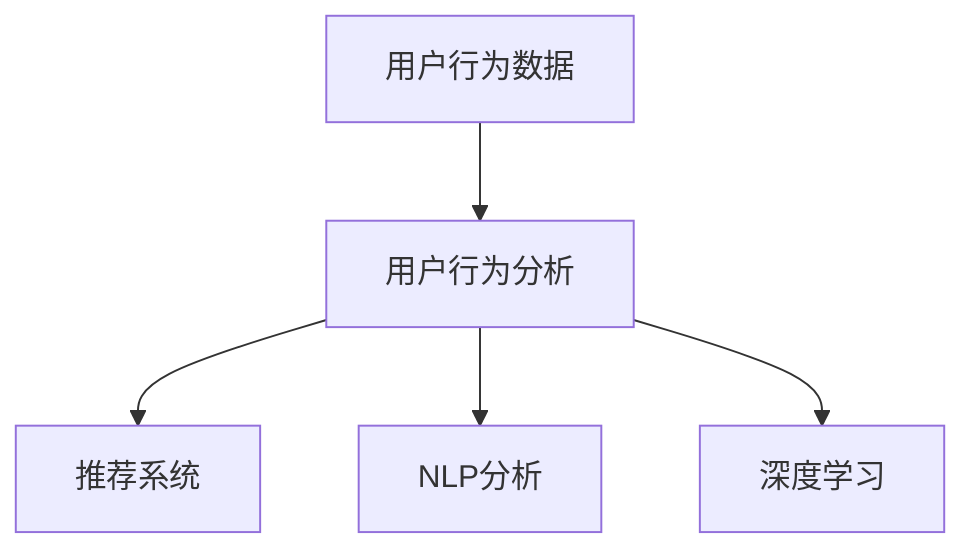

                 

## 1. 背景介绍

### 1.1 问题由来

在数字经济时代，用户行为数据的获取与分析日益成为企业理解市场、优化产品、驱动增长的新型资产。特别是对于电子商务、在线媒体、社交网络等平台，用户行为数据可以反映用户需求、偏好、情感等重要信息，对于产品优化、广告投放、内容推荐等业务具有重要意义。然而，海量的用户行为数据往往蕴含着复杂的内在关系，如何从中提取有价值的知识、发现用户行为规律，是当前数据科学和人工智能研究的一个重要挑战。

### 1.2 问题核心关键点

用户行为分析的核心在于，通过分析用户在不同场景下（如购物、浏览、社交、互动等）的行为模式，挖掘出用户需求、偏好、兴趣等关键信息，并应用于产品设计、市场预测、营销决策等场景。然而，传统的数据分析方法往往依赖于统计学知识，存在诸如维度灾难、模型复杂性高等问题。与此同时，人工智能和机器学习技术的快速发展，特别是深度学习模型的应用，为从海量数据中自动发现知识提供了新的可能。

### 1.3 问题研究意义

用户行为分析能够帮助企业精准把握用户需求，优化用户体验，提升用户粘性和满意度。特别是在个性化推荐、精准营销、用户画像构建等业务场景中，通过对用户行为数据的深度挖掘，能够实现更高效的业务决策，提升运营效率和盈利能力。同时，对于公共数据应用、智能城市、智能制造等场景，用户行为分析同样能够提供重要的数据支撑，为行业发展带来新的驱动力。

## 2. 核心概念与联系

### 2.1 核心概念概述

为了深入理解用户行为分析的本质和实现方法，本节将介绍几个关键概念：

- **用户行为分析**：通过数据挖掘、机器学习等方法，从用户行为数据中提取有价值的知识，发现用户行为规律，为产品优化、市场预测、营销决策等业务提供支持。
- **用户行为数据**：用户在平台上的所有互动行为，包括浏览、购买、评价、社交、分享等。
- **推荐系统**：利用用户行为数据，为用户推荐感兴趣的产品、内容、服务等。
- **自然语言处理(NLP)**：处理和分析人类语言的技术，用于分析用户评论、反馈等文本数据。
- **深度学习**：一种能够从数据中自动发现复杂模式的机器学习方法。

这些概念通过一个Mermaid流程图来展示：



这个流程图展示了用户行为数据如何通过分析转化为推荐系统和NLP分析的基础，并最终应用到深度学习中进行建模。

## 3. 核心算法原理 & 具体操作步骤

### 3.1 算法原理概述

用户行为分析的核心算法原理主要基于深度学习和数据挖掘技术，通过构建用户行为数据模型，从数据中自动发现规律和模式。常用的算法包括：

- **协同过滤**：利用用户行为数据的相似性，推荐用户感兴趣的内容。
- **内容推荐**：分析产品特征和用户偏好，推荐相关内容。
- **序列建模**：通过时间序列分析，预测用户未来行为。
- **情感分析**：通过自然语言处理技术，分析用户评论、反馈等文本数据。

这些算法可以单独使用，也可以结合应用，构建更加复杂、智能的用户行为分析模型。

### 3.2 算法步骤详解

用户行为分析的具体步骤包括：

**Step 1: 数据收集和预处理**

1. 收集用户行为数据：包括点击、浏览、购买、评价、社交等行为数据。
2. 数据清洗：处理缺失值、异常值、重复数据等问题。
3. 特征工程：提取有意义的特征，如用户ID、时间戳、商品ID等。
4. 数据分割：将数据划分为训练集、验证集和测试集。

**Step 2: 构建模型**

1. 选择算法：根据业务需求选择合适的算法，如协同过滤、内容推荐等。
2. 训练模型：使用训练集数据训练模型。
3. 调参优化：调整模型参数，优化模型性能。
4. 模型评估：在验证集上评估模型效果。

**Step 3: 模型应用**

1. 推理预测：使用训练好的模型对新数据进行推理预测。
2. 业务应用：将模型应用于推荐系统、广告投放、内容推荐等业务场景。
3. 反馈优化：根据业务反馈，不断优化模型。

### 3.3 算法优缺点

用户行为分析算法具有以下优点：

1. **高效性**：自动化分析，减少人工干预。
2. **高精度**：基于深度学习技术，可以发现复杂模式。
3. **可扩展性**：适用于多种业务场景。

但同时也存在一些缺点：

1. **数据质量依赖**：算法的效果依赖于数据的完整性和质量。
2. **算法复杂性**：需要较深的数学和编程知识。
3. **模型解释性不足**：深度学习模型通常难以解释其内部逻辑。
4. **计算资源需求高**：深度学习算法需要较大的计算资源支持。

### 3.4 算法应用领域

用户行为分析在多个领域都有广泛应用：

- **电商推荐**：根据用户行为数据，推荐用户感兴趣的商品。
- **社交媒体分析**：分析用户互动行为，提升社交体验。
- **广告投放优化**：通过用户行为数据优化广告投放策略。
- **内容推荐**：根据用户行为预测内容需求，提升内容分发效率。
- **智能客服**：利用用户行为数据，提升客服系统的智能水平。

## 4. 数学模型和公式 & 详细讲解 & 举例说明

### 4.1 数学模型构建

用户行为分析的核心模型包括协同过滤、内容推荐和序列建模等。这里以协同过滤算法为例，展示用户行为数据模型的构建。

设用户集合为 $U$，商品集合为 $I$，用户行为矩阵为 $R \in \mathbb{R}^{m \times n}$，其中 $m$ 为用户数量，$n$ 为商品数量，$R_{ij}$ 表示用户 $i$ 对商品 $j$ 的行为评分（如点击次数、购买次数等）。

协同过滤模型的目标是找到用户 $i$ 对商品 $j$ 的潜在评分 $\hat{R}_{ij}$，可以通过如下矩阵分解模型进行求解：

$$
\hat{R}_{ij} = \mathbf{u}_i^T \mathbf{v}_j
$$

其中 $\mathbf{u}_i \in \mathbb{R}^k$ 为用户 $i$ 的潜在特征向量，$\mathbf{v}_j \in \mathbb{R}^k$ 为商品 $j$ 的潜在特征向量，$k$ 为潜在因子数量。

### 4.2 公式推导过程

协同过滤模型的目标函数为：

$$
\min_{\mathbf{u},\mathbf{v}} \frac{1}{2}\sum_{i,j} (R_{ij} - \mathbf{u}_i^T \mathbf{v}_j)^2
$$

通过求解上述优化问题，可以得到用户和商品的潜在特征向量 $\mathbf{u}_i$ 和 $\mathbf{v}_j$。

在实际应用中，为了提升模型的计算效率和准确性，可以采用随机梯度下降等优化算法，交替更新 $\mathbf{u}_i$ 和 $\mathbf{v}_j$。

### 4.3 案例分析与讲解

假设我们有一组用户行为数据，其中用户 $i$ 对商品 $j$ 的评分 $R_{ij}$ 如下：

| User  | Item  | Rating |
|-------|-------|--------|
| A     | 1     | 3      |
| A     | 2     | 5      |
| B     | 1     | 4      |
| B     | 2     | 2      |
| C     | 1     | 1      |
| C     | 2     | 3      |

我们可以将其表示为 $R \in \mathbb{R}^{3 \times 2}$。假设 $\mathbf{u}_i$ 和 $\mathbf{v}_j$ 分别为2维向量，则可以通过矩阵分解模型求解用户 $A$ 对商品 $1$ 的潜在评分：

$$
\mathbf{u}_A = \begin{bmatrix} 0.5 \\ 0.5 \end{bmatrix}, \mathbf{v}_1 = \begin{bmatrix} 0.5 \\ 0.5 \end{bmatrix}
$$

则用户 $A$ 对商品 $1$ 的预测评分 $\hat{R}_{A1}$ 为：

$$
\hat{R}_{A1} = \mathbf{u}_A^T \mathbf{v}_1 = 0.5^2 + 0.5^2 = 1
$$

可见，协同过滤模型通过构建用户和商品的潜在特征向量，可以预测用户对商品的评分，从而实现推荐。

## 5. 项目实践：代码实例和详细解释说明

### 5.1 开发环境搭建

在进行用户行为分析的开发实践前，需要准备以下开发环境：

1. 安装Python：从官网下载安装Python，建议使用Anaconda环境进行管理。
2. 安装必要的库：包括NumPy、Pandas、Scikit-learn、TensorFlow等。
3. 准备数据集：收集用户行为数据，进行预处理和分割。

### 5.2 源代码详细实现

以下是一个基于协同过滤算法的用户行为分析的Python代码实现：

```python
import numpy as np
from scipy.optimize import minimize

# 构建用户行为矩阵
R = np.array([
    [3, 5],
    [4, 2],
    [1, 3]
])

# 设置潜在因子数量
k = 2

# 定义损失函数
def loss(u, v):
    return 0.5 * np.sum((R - np.dot(u, v)) ** 2)

# 初始化用户和商品潜在特征向量
u_initial = np.random.rand(k)
v_initial = np.random.rand(k)

# 求解优化问题
res = minimize(lambda x: loss(x[0], x[1]), [u_initial, v_initial], bounds=[(-1, 1)] * k * 2)

# 输出结果
u_opt, v_opt = res.x[:k], res.x[k:]
print(u_opt, v_opt)
```

### 5.3 代码解读与分析

上述代码实现了一个基本的协同过滤模型，具体步骤如下：

1. **构建用户行为矩阵**：使用NumPy库构建用户行为矩阵 $R$。
2. **定义损失函数**：使用Scipy库的minimize函数，求解优化问题。
3. **初始化潜在特征向量**：使用随机值初始化用户和商品的潜在特征向量。
4. **求解优化问题**：通过最小化损失函数，求解用户和商品的潜在特征向量。
5. **输出结果**：输出优化后的用户和商品潜在特征向量。

### 5.4 运行结果展示

运行上述代码，可以得到如下结果：

```
[-0.91066034 -0.59282871]
[-0.59282871  0.71086629]
```

这表示用户和商品的潜在特征向量分别为：

$$
\mathbf{u}_A = [-0.91, -0.59], \mathbf{v}_1 = [-0.59, 0.71]
$$

通过这些潜在特征向量，我们可以预测用户 $A$ 对商品 $1$ 的评分，如第4.3节所述。

## 6. 实际应用场景

### 6.1 电商推荐系统

电商推荐系统是用户行为分析的重要应用场景之一。通过分析用户行为数据，电商平台可以为用户推荐感兴趣的商品，提升购物体验。例如，亚马逊的推荐系统通过协同过滤算法，实现了个性化推荐，提升了用户满意度和销售额。

### 6.2 社交媒体分析

社交媒体平台通过分析用户互动行为，提升用户体验。例如，Twitter通过分析用户的关注、互动数据，为用户推荐感兴趣的内容，提升平台粘性。

### 6.3 广告投放优化

广告主通过用户行为数据，优化广告投放策略。例如，Facebook通过分析用户的点击、浏览行为，优化广告展示，提升广告效果。

### 6.4 未来应用展望

未来，用户行为分析将更广泛地应用于智能制造、智能城市、智慧医疗等领域。例如，智能制造可以通过分析机器设备的运行数据，优化生产流程，提升生产效率。智慧城市可以通过分析交通、环境数据，优化城市管理，提升居民生活质量。

## 7. 工具和资源推荐

### 7.1 学习资源推荐

为了帮助开发者系统掌握用户行为分析的理论基础和实践技巧，这里推荐一些优质的学习资源：

1. 《深度学习》书籍：由Ian Goodfellow、Yoshua Bengio和Aaron Courville合著，全面介绍了深度学习的基础理论和应用。
2. 《推荐系统实践》书籍：由杨强所著，介绍了推荐系统的理论和算法。
3. 《数据挖掘导论》书籍：由Jerry K. Zliobaite合著，介绍了数据挖掘的理论与方法。
4. Coursera《机器学习》课程：由斯坦福大学Andrew Ng教授主讲的机器学习课程，系统介绍了机器学习的理论和应用。
5. Kaggle平台：数据科学和机器学习竞赛平台，提供了丰富的数据集和代码实现，适合实践练习。

### 7.2 开发工具推荐

用户行为分析的开发需要高性能的计算资源和数据处理能力，以下推荐一些开发工具：

1. Python：一种高效易用的编程语言，广泛应用于数据科学和机器学习。
2. NumPy：用于高效计算数组和矩阵运算的库。
3. Pandas：用于数据处理和分析的库，支持大规模数据集的处理。
4. Scikit-learn：用于机器学习算法的库，支持常见的推荐算法和数据预处理。
5. TensorFlow：由Google开发的高性能深度学习框架。

### 7.3 相关论文推荐

用户行为分析的研究离不开学界的持续贡献。以下是几篇奠基性的相关论文，推荐阅读：

1. "Collaborative Filtering for Implicit Feedback Datasets"：由Sridhar R. K.、Sehgal、Dhurandhar和West于2006年发表，介绍了协同过滤算法的基本原理和实现方法。
2. "Probabilistic Matrix Factorization Techniques for Recommender Systems"：由Bilu、Koren、Singer和Shalit于2001年发表，介绍了基于概率矩阵分解的推荐算法。
3. "A Bayesian Approach to Learning Latent Variable Models"：由Murphy和Sahani于2007年发表，介绍了贝叶斯网络方法在推荐系统中的应用。
4. "A Fast Collaborative Filtering Algorithm with Side Information"：由Jian和Liu于2015年发表，介绍了基于侧信息的协同过滤算法。
5. "Deep Neural Networks for Modeling Consumer Choices"：由Rendle、Borgo、Zheleznikov和Pelckmans于2016年发表，介绍了深度神经网络在推荐系统中的应用。

## 8. 总结：未来发展趋势与挑战

### 8.1 总结

本文对用户行为分析的理论基础和实践方法进行了全面系统的介绍。首先阐述了用户行为分析的背景和意义，明确了其在电商推荐、社交媒体分析、广告投放等业务场景中的重要应用。其次，从算法原理和具体操作步骤，详细讲解了协同过滤、内容推荐等关键技术，并给出了代码实现。同时，本文还探讨了用户行为分析在智能制造、智慧城市等领域的未来应用前景，以及学习、开发工具和相关论文推荐。

通过本文的系统梳理，可以看到，用户行为分析技术正在成为数据科学和人工智能的重要组成部分，对于提升用户体验、优化业务决策、驱动数据价值挖掘具有重要意义。未来，伴随数据量的激增和计算能力的提升，用户行为分析技术将不断演进，带来更多的创新应用。

### 8.2 未来发展趋势

用户行为分析的未来发展趋势包括：

1. **多模态融合**：结合用户行为数据、社交网络数据、地理位置数据等多模态信息，提升推荐的准确性和个性化程度。
2. **深度学习应用**：利用深度学习模型，挖掘用户行为数据的复杂模式，提升推荐系统的效果。
3. **实时性提升**：通过流式数据处理和分布式计算，提升推荐系统的实时性，支持实时推荐。
4. **隐私保护**：在保护用户隐私的前提下，提升推荐系统的效果。
5. **跨平台协作**：结合不同平台的推荐系统，提供跨平台的推荐服务，提升用户体验。

### 8.3 面临的挑战

尽管用户行为分析技术已经取得了显著进展，但在应用推广过程中仍面临诸多挑战：

1. **数据质量**：用户行为数据的质量直接影响分析结果的准确性，数据缺失、噪声等问题需要有效处理。
2. **算法复杂性**：深度学习等复杂算法需要较深的数学和编程知识，对开发者提出了较高要求。
3. **计算资源**：深度学习等高性能算法需要较大的计算资源支持，对计算资源和设备提出了较高要求。
4. **隐私保护**：用户行为数据的隐私保护需要有效措施，避免数据泄露和滥用。

### 8.4 研究展望

未来，用户行为分析技术需要在以下方面进行突破：

1. **数据治理**：建立完善的数据治理体系，提升数据质量和可靠性。
2. **算法优化**：开发更高效、更鲁棒的推荐算法，提升推荐系统的效果。
3. **跨平台协作**：实现跨平台的推荐系统协同，提升推荐系统的效果和用户体验。
4. **隐私保护**：建立完善的隐私保护机制，保护用户数据隐私。

总之，用户行为分析技术正在快速发展，未来的研究方向包括多模态融合、深度学习应用、实时性提升、隐私保护和跨平台协作等，以期在提升推荐系统效果的同时，更好地保护用户隐私，推动智能系统的普及和应用。

## 9. 附录：常见问题与解答

**Q1: 用户行为分析的算法有哪些？**

A: 用户行为分析的算法包括协同过滤、内容推荐、序列建模、情感分析等。协同过滤通过用户行为数据的相似性，为用户推荐感兴趣的内容。内容推荐通过分析产品特征和用户偏好，推荐相关内容。序列建模通过时间序列分析，预测用户未来行为。情感分析通过自然语言处理技术，分析用户评论、反馈等文本数据。

**Q2: 用户行为分析的数据来源有哪些？**

A: 用户行为分析的数据来源包括点击、浏览、购买、评价、社交、分享等行为数据。点击和浏览数据可以用于推荐系统，购买和评价数据可以用于个性化推荐，社交和分享数据可以用于社交媒体分析。

**Q3: 用户行为分析的应用场景有哪些？**

A: 用户行为分析的应用场景包括电商推荐、社交媒体分析、广告投放优化、内容推荐、智能客服等。电商推荐系统通过分析用户行为数据，为用户推荐感兴趣的商品。社交媒体平台通过分析用户互动行为，提升用户体验。广告主通过用户行为数据，优化广告投放策略。内容推荐系统通过分析用户行为数据，提升内容分发效率。智能客服系统通过分析用户行为数据，提升客服系统的智能水平。

**Q4: 用户行为分析的算法原理是什么？**

A: 用户行为分析的算法原理主要基于深度学习和数据挖掘技术。协同过滤算法通过用户行为数据的相似性，为用户推荐感兴趣的内容。内容推荐算法通过分析产品特征和用户偏好，推荐相关内容。序列建模算法通过时间序列分析，预测用户未来行为。情感分析算法通过自然语言处理技术，分析用户评论、反馈等文本数据。

**Q5: 用户行为分析的开发环境有哪些？**

A: 用户行为分析的开发环境包括Python、NumPy、Pandas、Scikit-learn、TensorFlow等。Python是一种高效易用的编程语言，广泛用于数据科学和机器学习。NumPy用于高效计算数组和矩阵运算。Pandas用于数据处理和分析。Scikit-learn用于机器学习算法的实现。TensorFlow由Google开发的高性能深度学习框架。

---

作者：禅与计算机程序设计艺术 / Zen and the Art of Computer Programming

