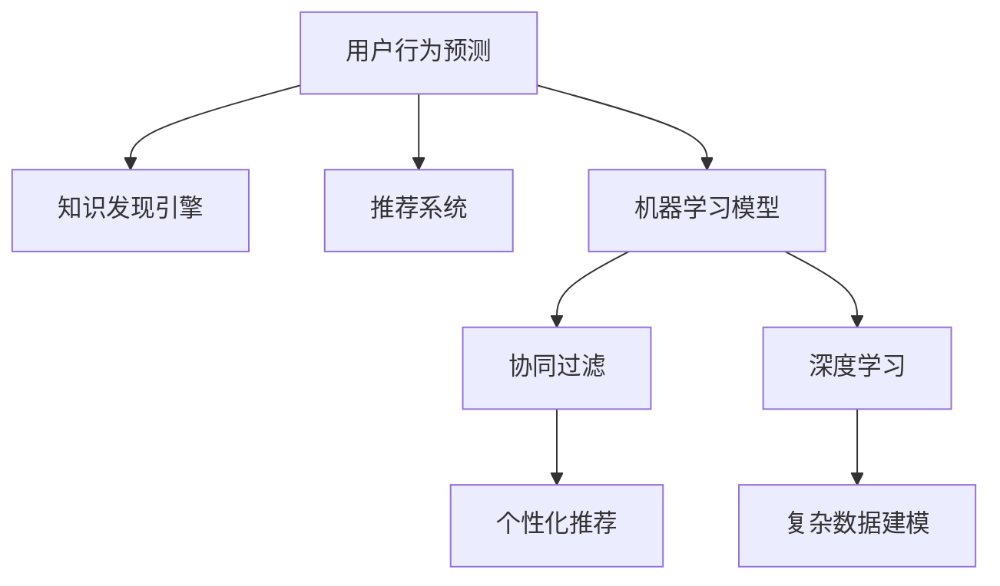

                 

# 知识发现引擎的用户行为预测模型

> 关键词：用户行为预测, 知识发现引擎, 推荐系统, 模型优化, 机器学习

## 1. 背景介绍

### 1.1 问题由来
在现代信息社会中，用户行为预测成为了数字经济的核心竞争力。无论是电商平台、社交网络、内容平台，还是金融服务、在线教育、智能家居，了解用户的真实需求和偏好，并提供个性化服务，是实现商业成功的关键。传统的推荐系统、广告定向、内容个性化等业务场景中，用户行为预测模型发挥了不可或缺的作用。然而，随着数据量的快速增长，模型的复杂度也在不断提升，如何高效、准确地预测用户行为，成为了一个巨大的挑战。

### 1.2 问题核心关键点
用户行为预测的核心在于能够利用历史数据，识别出用户的潜在兴趣和需求，从而提供个性化的推荐内容、广告投放、服务体验等。在数据驱动的业务场景中，用户行为预测模型需要具有以下几个特性：
1. **高效性**：在短时间内处理海量数据，快速提供预测结果。
2. **准确性**：准确捕捉用户行为的微妙变化，避免偏差。
3. **可解释性**：能够清晰解释模型预测的逻辑，提升用户信任。
4. **鲁棒性**：对异常数据和噪声具有较强的适应能力。
5. **通用性**：在不同业务场景中具有广泛的适用性。

### 1.3 问题研究意义
用户行为预测模型不仅能够提升用户体验，还能显著增加企业的收益。通过精准推荐，可以减少用户流失率，提高客户满意度，从而带动产品销量。因此，研究高效、准确、可解释的预测模型，对于推动商业创新和用户行为优化具有重要意义：

1. **提升业务效率**：准确预测用户行为，可以优化业务流程，减少人工操作，提升业务效率。
2. **增强用户体验**：个性化的服务体验，让用户感到被重视，增强品牌忠诚度。
3. **优化资源配置**：通过预测流量峰值，合理调配资源，避免资源浪费。
4. **驱动商业模式创新**：基于用户行为的数据洞察，发掘新的业务机会，创造新的收入点。

## 2. 核心概念与联系

### 2.1 核心概念概述

为更好地理解用户行为预测模型的构建和应用，本节将介绍几个关键概念及其相互联系：

- **用户行为预测**：通过历史数据和行为模式，预测用户未来的行为，如购买、浏览、点击等。
- **知识发现引擎**：结合知识图谱、规则库等外部知识，进行智能推理和决策。
- **推荐系统**：利用用户行为数据，推荐个性化内容、商品、服务等。
- **机器学习模型**：通过统计学习方法，自动发现数据中的模式，提升预测精度。
- **协同过滤**：通过用户间、物品间的相似性，推荐潜在相关内容。
- **深度学习**：利用神经网络模型，对复杂数据结构进行建模。

这些核心概念之间的逻辑关系可以通过以下Mermaid流程图来展示：



这个流程图展示了一系列关键概念及其相互联系：

1. 用户行为预测是基础，通过分析用户历史行为，进行后续的决策和推荐。
2. 知识发现引擎结合外部知识，提供更加准确的推理和预测。
3. 推荐系统通过协同过滤和深度学习，实现个性化推荐。
4. 机器学习模型为预测提供统计学基础，提升模型精度。
5. 协同过滤和深度学习是机器学习模型中的两种典型技术。

这些概念共同构成了用户行为预测模型的核心框架，使其能够在各类业务场景中发挥强大的作用。

## 3. 核心算法原理 & 具体操作步骤

### 3.1 算法原理概述

用户行为预测模型的构建，基于机器学习算法的理论基础。其核心思想是通过对历史数据的分析和模式识别，建立一个预测模型，对用户未来的行为进行推断。

形式化地，假设历史数据集为 $D=\{(x_i, y_i)\}_{i=1}^N$，其中 $x_i$ 为特征向量，$y_i$ 为标签。定义预测模型 $M_{\theta}$，其中 $\theta$ 为模型参数。预测模型的目标是最大化模型在未知数据上的泛化能力，即：

$$
\hat{\theta}=\mathop{\arg\min}_{\theta} \mathcal{L}(M_{\theta}, D)
$$

其中 $\mathcal{L}$ 为损失函数，用于衡量模型预测输出与真实标签之间的差异。

在实际应用中，常见的损失函数包括均方误差损失、交叉熵损失等。通过优化算法（如梯度下降）更新模型参数，最小化损失函数，即可得到预测模型。

### 3.2 算法步骤详解

用户行为预测模型的构建通常包括以下几个关键步骤：

**Step 1: 数据准备与预处理**
- 收集用户历史行为数据，包括点击、浏览、购买、评分等。
- 对数据进行清洗，去除噪声和异常值。
- 对数据进行特征工程，提取有意义的特征向量。

**Step 2: 模型选择与训练**
- 选择合适的预测模型，如线性回归、决策树、随机森林、神经网络等。
- 将数据集划分为训练集、验证集和测试集。
- 使用训练集对模型进行训练，最小化损失函数。

**Step 3: 模型评估与优化**
- 在验证集上评估模型性能，选择合适的超参数。
- 对模型进行交叉验证，提升泛化能力。
- 利用正则化技术，如L2正则、Dropout等，避免过拟合。

**Step 4: 模型部署与应用**
- 将训练好的模型部署到生产环境。
- 根据新数据，实时进行预测。
- 不断收集用户反馈，迭代优化模型。

以上是用户行为预测模型的一般流程。在实际应用中，还需要针对具体业务场景，对模型进行优化设计和参数调优。

### 3.3 算法优缺点

用户行为预测模型具有以下优点：
1. 高效性：通过自动化机器学习算法，可以快速构建预测模型。
2. 灵活性：可以处理多种类型的数据，如数值型、文本型、时间序列等。
3. 准确性：基于历史数据的统计学习，能够捕捉到用户行为的微妙变化。
4. 可解释性：通过特征工程和模型解释工具，可以清晰解释模型预测的逻辑。
5. 鲁棒性：通过正则化和交叉验证，模型对异常数据和噪声具有较强的适应能力。

同时，该方法也存在一定的局限性：
1. 数据依赖性：模型的性能高度依赖于历史数据的数量和质量。
2. 数据隐私问题：处理用户数据时需要注意隐私保护，避免数据泄露。
3. 模型复杂性：复杂的模型可能难以解释，需要额外的解释工具。
4. 计算资源消耗：大规模数据集的训练和部署，需要较高的计算资源。

尽管存在这些局限性，但用户行为预测模型在推荐系统、广告定向、用户画像等领域仍有着广泛的应用，显示了其强大的预测能力。

### 3.4 算法应用领域

用户行为预测模型在多个领域有着广泛的应用：

1. **电商推荐系统**：通过预测用户可能感兴趣的商品，提升销售额和用户体验。
2. **内容推荐系统**：根据用户历史行为，推荐视频、文章、音乐等内容。
3. **广告定向系统**：精准定位用户，进行个性化广告投放。
4. **社交网络分析**：分析用户行为，进行社区发现和用户画像。
5. **金融风险控制**：预测用户违约概率，进行风险评估和控制。
6. **智能家居控制**：根据用户习惯，自动调整家居设备设置。

这些应用场景展示了用户行为预测模型的强大潜力，推动了商业智能化和用户个性化服务的进程。

## 4. 数学模型和公式 & 详细讲解 & 举例说明

### 4.1 数学模型构建

本节将使用数学语言对用户行为预测模型的构建进行更加严格的刻画。

假设用户行为预测模型为 $M_{\theta}(x) \in \mathbb{R}$，其中 $x$ 为特征向量，$\theta$ 为模型参数。模型训练的目标是最小化预测误差，即：

$$
\mathcal{L}(\theta) = \frac{1}{N}\sum_{i=1}^N (y_i - M_{\theta}(x_i))^2
$$

其中 $y_i$ 为实际标签，$M_{\theta}(x_i)$ 为模型对 $x_i$ 的预测值。

通过最小化损失函数，可以更新模型参数 $\theta$：

$$
\theta \leftarrow \theta - \eta \nabla_{\theta}\mathcal{L}(\theta)
$$

其中 $\eta$ 为学习率，$\nabla_{\theta}\mathcal{L}(\theta)$ 为损失函数对参数 $\theta$ 的梯度。

### 4.2 公式推导过程

以下我们以线性回归模型为例，推导预测误差和梯度计算公式。

假设特征向量 $x_i \in \mathbb{R}^d$，线性回归模型为 $M_{\theta}(x) = \theta^T x$。则预测误差为：

$$
\ell(y_i, M_{\theta}(x_i)) = (y_i - M_{\theta}(x_i))^2 = (y_i - \theta^T x_i)^2
$$

将其代入损失函数，得：

$$
\mathcal{L}(\theta) = \frac{1}{N}\sum_{i=1}^N (y_i - \theta^T x_i)^2
$$

根据梯度下降算法，对损失函数求导，得：

$$
\nabla_{\theta}\mathcal{L}(\theta) = -\frac{2}{N}\sum_{i=1}^N x_i(y_i - \theta^T x_i)x_i^T
$$

根据梯度下降公式，更新模型参数：

$$
\theta \leftarrow \theta - \eta\nabla_{\theta}\mathcal{L}(\theta)
$$

以上是线性回归模型的推导过程。其他机器学习模型（如决策树、神经网络等）的推导过程类似，但具体公式有所差异。

### 4.3 案例分析与讲解

以电商推荐系统为例，分析用户行为预测模型的实际应用。假设某电商平台的商品推荐系统，记录了用户的历史点击、购买记录，并收集了商品的详细信息。模型训练的目标是预测用户对未购买商品的可能性评分。

1. **数据准备与预处理**：
   - 收集用户历史行为数据，包括点击次数、购买记录、评分等。
   - 对数据进行清洗，去除无效数据和异常值。
   - 对商品数据进行特征提取，如价格、品牌、类别等。

2. **模型选择与训练**：
   - 选择线性回归模型，将用户行为数据和商品特征数据拼接成特征向量 $x_i$。
   - 将数据集划分为训练集、验证集和测试集。
   - 使用训练集对模型进行训练，最小化损失函数。

3. **模型评估与优化**：
   - 在验证集上评估模型性能，使用准确率、召回率、F1值等指标。
   - 进行交叉验证，选择最优的超参数。
   - 应用正则化技术，如L2正则、Dropout等，避免过拟合。

4. **模型部署与应用**：
   - 将训练好的模型部署到推荐系统中。
   - 对新用户行为数据进行实时预测，推荐潜在感兴趣的商品。
   - 不断收集用户反馈，迭代优化模型。

通过以上步骤，可以构建一个高效、准确的电商推荐系统，提升用户体验和平台收益。

## 5. 项目实践：代码实例和详细解释说明

### 5.1 开发环境搭建

在进行用户行为预测模型的开发和测试前，需要先搭建好开发环境。以下是使用Python进行Scikit-learn开发的开发环境配置流程：

1. 安装Anaconda：从官网下载并安装Anaconda，用于创建独立的Python环境。

2. 创建并激活虚拟环境：
```bash
conda create -n sklearn-env python=3.8 
conda activate sklearn-env
```

3. 安装Scikit-learn：使用pip安装Scikit-learn库。
```bash
pip install scikit-learn
```

4. 安装相关工具包：
```bash
pip install numpy pandas matplotlib seaborn jupyter notebook ipython
```

完成上述步骤后，即可在`sklearn-env`环境中开始项目实践。

### 5.2 源代码详细实现

我们以线性回归模型为例，给出使用Scikit-learn进行用户行为预测的Python代码实现。

```python
from sklearn.linear_model import LinearRegression
from sklearn.metrics import mean_squared_error
from sklearn.model_selection import train_test_split
import pandas as pd

# 加载数据集
data = pd.read_csv('user_behavior_data.csv')

# 数据预处理
# 假设特征向量为 x，标签为 y
X = data[['feature1', 'feature2', 'feature3']]
y = data['label']

# 数据划分
X_train, X_test, y_train, y_test = train_test_split(X, y, test_size=0.2, random_state=42)

# 模型训练
model = LinearRegression()
model.fit(X_train, y_train)

# 模型评估
y_pred = model.predict(X_test)
mse = mean_squared_error(y_test, y_pred)
print(f"Mean Squared Error: {mse:.2f}")

# 模型部署与应用
# 对新数据进行实时预测
new_data = pd.read_csv('new_user_behavior_data.csv')
pred = model.predict(new_data)
print(f"Predicted label for new data: {pred}")
```

### 5.3 代码解读与分析

让我们再详细解读一下关键代码的实现细节：

**用户行为数据预处理**：
- 使用Pandas库加载数据集，假设特征向量为 $x$，标签为 $y$。
- 对数据进行划分，将部分数据作为训练集，部分数据作为测试集。

**线性回归模型训练**：
- 使用Scikit-learn的LinearRegression类创建线性回归模型。
- 调用fit方法对模型进行训练，使用训练集数据和标签。

**模型评估**：
- 使用测试集数据对模型进行评估，计算预测误差。
- 使用均方误差作为评估指标，输出评估结果。

**模型部署与应用**：
- 对新的用户行为数据进行实时预测，调用predict方法。
- 输出预测结果，可用于推荐系统、广告定向等业务场景。

可以看到，使用Scikit-learn进行用户行为预测的代码实现非常简单高效。开发者可以更加关注模型构建和业务优化，而不必过多关注底层实现细节。

当然，工业级的系统实现还需考虑更多因素，如模型保存和部署、超参数搜索、特征工程等。但核心的用户行为预测模型构建过程，基本与此类似。

## 6. 实际应用场景

### 6.1 电商推荐系统

电商推荐系统是用户行为预测模型的典型应用场景。通过分析用户历史购买和浏览行为，预测用户对未购买商品的可能性评分，从而推荐个性化的商品。在实际应用中，推荐系统可以实时处理用户行为数据，并根据模型预测结果动态调整推荐内容。

例如，某电商平台的推荐系统记录了用户的历史浏览和购买记录，包括商品名称、价格、评分等信息。模型训练的目标是预测用户对未购买商品的可能性评分，推荐系统则根据评分排序，生成推荐商品列表。

### 6.2 广告定向系统

广告定向系统通过用户行为预测模型，精准定位潜在用户，进行个性化广告投放。广告主可以根据用户兴趣、地理位置、设备类型等特征，投放不同类型的广告。通过预测模型的分析，广告主可以实时优化广告投放策略，提升广告转化率和投放效率。

例如，某广告平台收集了用户的历史广告点击和浏览记录，包括广告ID、广告内容、点击次数等信息。模型训练的目标是预测用户对特定广告的兴趣评分，广告投放系统则根据评分进行定向投放，避免无效曝光。

### 6.3 金融风险控制

金融风险控制是用户行为预测模型的另一重要应用场景。通过分析用户的交易记录和行为模式，预测用户的违约风险，进行风险评估和控制。金融机构可以根据模型预测结果，制定相应的风控策略，防范金融风险。

例如，某金融公司收集了用户的交易记录和行为数据，包括交易金额、交易时间、交易地点等信息。模型训练的目标是预测用户的违约概率，风险控制系统则根据评分进行风险评估，进行相应的风险控制措施。

### 6.4 未来应用展望

随着用户行为预测模型的不断发展，未来在更多领域将有广泛应用。例如：

1. **智能家居控制**：根据用户的生活习惯，自动调整家居设备设置，提升生活质量。
2. **智慧医疗**：分析用户的健康数据，预测疾病风险，进行个性化健康管理。
3. **智能交通**：预测交通流量和用户出行需求，优化交通管理。
4. **智能客服**：预测用户需求，提供个性化的服务方案，提升客户满意度。
5. **智能合约**：分析用户行为，制定合理的合约条款，降低纠纷风险。

这些应用场景展示了用户行为预测模型的强大潜力，推动了各行各业的智能化和个性化服务进程。

## 7. 工具和资源推荐

### 7.1 学习资源推荐

为了帮助开发者系统掌握用户行为预测模型的理论基础和实践技巧，这里推荐一些优质的学习资源：

1. 《机器学习》（西瓜书）：清华大学出版社的经典教材，全面介绍了机器学习的基本概念和算法。
2. 《深度学习》（花书）：Ian Goodfellow的专著，深入讲解了深度学习的基础理论和前沿技术。
3. 《Python机器学习》：Sebastian Raschka的入门教程，详细介绍了Scikit-learn等常用库的使用。
4. 《Hands-On Machine Learning with Scikit-Learn, Keras, and TensorFlow》：Aurélien Géron的实战教程，结合实际案例，讲解了机器学习模型开发的最佳实践。
5. Kaggle竞赛平台：提供大量的机器学习竞赛和数据集，是提升实战技能的好地方。

通过对这些资源的学习实践，相信你一定能够快速掌握用户行为预测模型的精髓，并用于解决实际的业务问题。

### 7.2 开发工具推荐

高效的开发离不开优秀的工具支持。以下是几款用于用户行为预测模型开发的常用工具：

1. Python：强大的编程语言，支持丰富的科学计算库，是机器学习开发的主流语言。
2. Scikit-learn：开源的机器学习库，提供了大量常用的模型和工具函数。
3. TensorFlow：由Google开发的深度学习框架，支持复杂的神经网络模型。
4. PyTorch：Facebook开发的深度学习框架，灵活性高，适合研究应用。
5. Jupyter Notebook：交互式开发环境，支持代码编辑、数据可视化等功能。
6. Google Colab：免费的在线Jupyter Notebook环境，支持GPU/TPU资源，方便实验。

合理利用这些工具，可以显著提升用户行为预测模型的开发效率，加快创新迭代的步伐。

### 7.3 相关论文推荐

用户行为预测模型的研究源于学界的持续探索。以下是几篇奠基性的相关论文，推荐阅读：

1. Adaptive Boosting（AdaBoost）：提出了AdaBoost算法，提高了分类器的准确性和鲁棒性。
2. Support Vector Machines（SVM）：提出了SVM模型，在高维空间中实现有效的分类和回归。
3. Random Forest：提出了随机森林算法，通过集成学习提升了模型的泛化能力。
4. Gradient Boosting Machines（GBM）：提出了GBM模型，在数据处理和模型训练中引入迭代优化策略。
5. Deep Learning for Recommender Systems：探讨了深度学习在推荐系统中的应用，提升了推荐精度和效果。

这些论文代表了大规模用户行为预测模型的发展脉络。通过学习这些前沿成果，可以帮助研究者把握学科前进方向，激发更多的创新灵感。

## 8. 总结：未来发展趋势与挑战

### 8.1 总结

本文对用户行为预测模型的构建和应用进行了全面系统的介绍。首先阐述了用户行为预测在数字经济中的重要意义，明确了模型构建的基本框架和核心算法。其次，从原理到实践，详细讲解了模型的构建流程和关键步骤，给出了预测模型的完整代码实例。同时，本文还广泛探讨了模型在电商推荐、广告定向、金融风控等多个行业领域的应用前景，展示了模型的强大潜力。此外，本文精选了模型开发的各类学习资源，力求为读者提供全方位的技术指引。

通过本文的系统梳理，可以看到，用户行为预测模型在推荐系统、广告定向、风险控制等领域发挥了重要作用，提升了用户体验和企业收益。未来，随着算力成本的下降和数据量的增长，用户行为预测模型的应用将更加广泛，进一步推动智能化进程。

### 8.2 未来发展趋势

展望未来，用户行为预测模型的发展趋势如下：

1. **模型规模化**：随着算力成本的下降，模型规模将进一步增大，能够处理更大规模的数据集和更复杂的特征。
2. **算法多样化**：除了传统的机器学习算法，深度学习、强化学习等算法将被更多地应用到用户行为预测中。
3. **跨领域融合**：用户行为预测模型将与知识图谱、时间序列分析等技术结合，提升预测精度和泛化能力。
4. **实时化**：通过流式计算和实时数据处理，实现对用户行为的实时预测。
5. **自动化**：基于自动化机器学习（AutoML）技术，简化模型构建流程，提升开发效率。
6. **可解释性**：通过模型解释工具和可视化技术，增强模型的可解释性，提升用户信任。

以上趋势凸显了用户行为预测模型的广阔前景。这些方向的探索发展，必将进一步提升模型的预测精度和应用范围，为智能化服务注入新动能。

### 8.3 面临的挑战

尽管用户行为预测模型已经取得了不少成就，但在迈向更加智能化、个性化应用的过程中，仍面临以下挑战：

1. **数据获取与质量**：高质量用户数据的获取和处理，需要大量时间和资源。数据质量问题也会影响模型的训练效果。
2. **算法复杂度**：复杂模型需要更多的计算资源和训练时间，导致模型部署困难。
3. **模型解释性**：复杂的机器学习模型，难以解释其内部决策逻辑，用户可能难以理解和信任。
4. **隐私保护**：用户数据的隐私保护和安全性，需要严格的数据治理和技术手段。
5. **鲁棒性**：模型对异常数据和噪声的适应能力，需要进一步提升。
6. **动态变化**：用户行为受多种因素影响，模型需要实时更新，以适应动态变化的环境。

正视模型面临的这些挑战，积极应对并寻求突破，将是大规模用户行为预测模型走向成熟的必由之路。相信随着学界和产业界的共同努力，这些挑战终将一一被克服，用户行为预测模型必将在构建智能化服务中发挥越来越重要的作用。

### 8.4 研究展望

面向未来，用户行为预测模型的研究需要在以下几个方面寻求新的突破：

1. **自动化机器学习**：简化模型构建流程，提升开发效率。
2. **深度学习与强化学习结合**：提升模型的复杂性和泛化能力。
3. **跨领域知识融合**：结合知识图谱、时间序列分析等技术，提升预测精度。
4. **可解释性增强**：利用可视化工具和解释技术，增强模型的可解释性。
5. **实时计算与流式处理**：实现对用户行为的实时预测。
6. **隐私保护技术**：引入隐私保护技术，保护用户数据隐私。

这些研究方向将进一步提升用户行为预测模型的精度和应用范围，推动智能化服务的进步。

## 9. 附录：常见问题与解答

**Q1：用户行为预测模型是否适用于所有业务场景？**

A: 用户行为预测模型在大多数业务场景中都有应用价值，但对于一些特定的场景，如游戏推荐、推荐物品集合等，可能需要采用不同的模型。因此，在选择模型时需要根据具体的业务需求进行评估和调整。

**Q2：如何选择合适的机器学习算法？**

A: 选择机器学习算法需要考虑数据类型、特征数量、业务需求等因素。例如，对于小规模数据集，可以使用简单的线性回归或决策树模型；对于大规模高维数据，可以尝试深度学习模型。在模型选择过程中，需要根据数据特性和业务需求，综合考虑模型的复杂度和预测精度。

**Q3：模型训练过程中需要注意哪些问题？**

A: 模型训练过程中需要注意数据预处理、模型选择、超参数调整等问题。数据预处理需要确保数据的干净和一致性，避免噪声和异常值的影响。模型选择需要根据数据特性和业务需求，选择合适的算法和模型。超参数调整需要根据模型性能和资源消耗，寻找最优的参数组合。

**Q4：模型评估时需要注意哪些指标？**

A: 模型评估时需要注意准确率、召回率、F1值、ROC曲线、AUC值等指标。这些指标可以综合评估模型的预测效果和鲁棒性。在实际应用中，需要根据具体的业务需求，选择合适的评估指标。

**Q5：模型部署时需要注意哪些问题？**

A: 模型部署时需要考虑模型保存、模型服务化、模型更新等问题。模型保存需要选择合适的文件格式和压缩方法，保证模型的可读性和可恢复性。模型服务化需要将模型封装为标准化接口，方便调用和集成。模型更新需要根据新数据和业务需求，不断优化模型性能。

通过以上问题的回答，相信你对用户行为预测模型的基本原理和应用有了更深入的理解。希望本文能够为你提供有价值的指导，帮助你更好地进行模型开发和业务应用。

