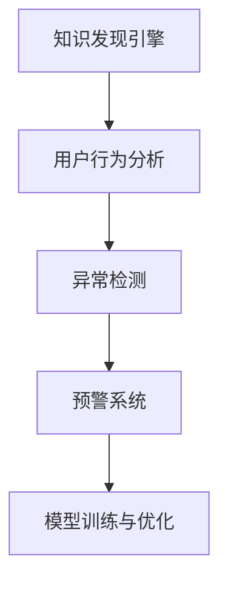

                 

# 知识发现引擎的用户行为预警系统

> 关键词：知识发现引擎, 用户行为分析, 异常检测, 预警系统, 机器学习, 深度学习, 预测建模, 数据挖掘, 信息安全

## 1. 背景介绍

### 1.1 问题由来

随着互联网的普及和电子商务的发展，线上交易和服务成为人们日常生活的重要组成部分。然而，用户行为也逐渐复杂多样，甚至可能存在异常行为，如恶意交易、欺诈等，对平台和用户自身都造成了损失。如何通过高效的手段及时检测并预警用户行为异常，保障交易安全和服务质量，成为各大电商平台的共同挑战。

### 1.2 问题核心关键点

通过知识发现引擎构建用户行为预警系统，旨在通过大数据分析和机器学习技术，挖掘用户行为模式，识别异常行为，实现及时预警和处理。该系统的核心关键点包括：

1. **数据采集与处理**：收集用户行为数据，进行数据清洗、特征提取等预处理。
2. **行为模式挖掘**：通过建模，挖掘用户正常行为模式，形成行为基准模型。
3. **异常检测与识别**：利用异常检测算法，识别异常行为。
4. **预警与响应**：构建实时预警系统，对异常行为进行及时响应。
5. **模型训练与优化**：持续训练模型，提升异常检测效果。

## 2. 核心概念与联系

### 2.1 核心概念概述

为更好地理解基于知识发现引擎的用户行为预警系统，本节将介绍几个密切相关的核心概念：

- **知识发现引擎(Knowledge Discovery Engine, KDE)**：通过数据挖掘、机器学习和统计学方法，从大量数据中自动地提取有用知识的技术和工具。在用户行为预警系统中，知识发现引擎用于挖掘用户行为模式，构建正常行为基准模型。
- **用户行为分析(User Behavior Analysis, UBA)**：对用户在平台上的行为进行分析和挖掘，理解用户行为模式、需求和反馈。
- **异常检测(Anomaly Detection)**：识别和评估系统中是否存在异常事件或行为，并对其进行隔离和处理。
- **预警系统(Warning System)**：利用算法和技术，对异常行为进行实时监测和预警，及时采取应对措施。
- **机器学习(Machine Learning, ML)**：通过数据训练模型，使计算机系统具备自主学习的能力，进行预测和决策。
- **深度学习(Deep Learning, DL)**：一种基于多层神经网络的机器学习方法，可以处理复杂、非线性的数据关系。
- **预测建模(Predictive Modeling)**：通过构建数学模型，预测未来的行为或事件。
- **数据挖掘(Data Mining)**：从数据中提取有用信息、模式和知识的过程。
- **信息安全(Information Security)**：保护计算机系统、网络和数据不受未授权访问、破坏或泄露的技术和实践。

这些核心概念之间的逻辑关系可以通过以下Mermaid流程图来展示：



这个流程图展示了的核心概念及其之间的关系：

1. 知识发现引擎通过用户行为分析，挖掘用户正常行为模式，构建基准模型。
2. 异常检测在基准模型的基础上，识别用户异常行为。
3. 预警系统对异常行为进行实时监测和预警。
4. 模型训练与优化持续提升异常检测效果。

## 3. 核心算法原理 & 具体操作步骤
### 3.1 算法原理概述

基于知识发现引擎的用户行为预警系统，其核心思想是：通过用户行为数据的收集和处理，构建用户正常行为基准模型，利用异常检测算法实时监测用户行为，识别并预警异常行为。

形式化地，假设用户行为数据集为 $D=\{(x_i, y_i)\}_{i=1}^N, x_i \in \mathbb{R}^d, y_i \in \{0,1\}$，其中 $x_i$ 为用户行为特征向量，$y_i$ 为行为标签（正常或异常）。构建基准模型为 $M_0$，异常检测算法为 $A$，预警系统为 $W$。系统的工作流程为：

1. 数据收集与处理：收集用户行为数据 $D$，进行数据清洗、特征提取等预处理。
2. 基准模型构建：通过机器学习算法，训练模型 $M_0$，使其能够准确预测正常行为。
3. 异常检测：将实时行为数据输入 $M_0$ 进行预测，若预测结果与真实标签有较大差异，则标记为异常行为。
4. 预警响应：异常行为触发预警系统 $W$，发出警报并进行相应处理。
5. 模型优化：持续收集新的数据，训练和优化模型 $M_0$，提升异常检测效果。

### 3.2 算法步骤详解

基于知识发现引擎的用户行为预警系统一般包括以下几个关键步骤：

**Step 1: 数据收集与预处理**
- 从用户行为日志中收集用户操作数据，包含点击、购买、评价、访问等行为信息。
- 进行数据清洗，去除噪声、重复和异常数据。
- 提取特征，如用户ID、行为时间、行为频率、交易金额等。

**Step 2: 基准模型构建**
- 选择机器学习算法，如决策树、随机森林、神经网络等。
- 使用历史正常行为数据训练模型，构建正常行为基准模型 $M_0$。
- 使用交叉验证等方法评估模型性能，选择最优模型。

**Step 3: 异常检测与识别**
- 对实时行为数据进行特征提取。
- 输入 $M_0$ 进行预测，若预测结果与真实标签有较大差异，则标记为异常行为。
- 结合统计方法、阈值设定等手段，进一步筛选异常行为。

**Step 4: 预警与响应**
- 对检测到的异常行为进行实时警报，通知相关人员处理。
- 根据异常行为类型和严重程度，采取相应的应对措施，如冻结账号、拒绝交易等。
- 记录异常行为日志，分析异常原因，防止类似事件再次发生。

**Step 5: 模型训练与优化**
- 定期收集新的数据，持续训练模型 $M_0$，更新基准模型。
- 根据异常检测效果，调整算法参数和特征选择，优化模型性能。
- 结合在线学习、增量学习等方法，使模型能实时更新和适应新数据。

以上是基于知识发现引擎的用户行为预警系统的核心算法步骤。在实际应用中，还需要针对具体任务的特点，对各个环节进行优化设计，如改进特征工程、选择更合适的算法、应用高级异常检测技术等，以进一步提升系统性能。

### 3.3 算法优缺点

基于知识发现引擎的用户行为预警系统具有以下优点：
1. 高效性。通过机器学习算法，实时监测用户行为，及时发现异常，响应速度较快。
2. 可扩展性。基于数据驱动，可根据需要灵活调整模型，适应不同的业务场景。
3. 准确性。通过模型训练和异常检测，识别异常行为的准确率较高。
4. 灵活性。能够处理复杂、非线性的数据关系，适应多变的用户行为模式。

同时，该系统也存在一定的局限性：
1. 依赖高质量数据。异常检测的效果很大程度上取决于数据的质量和数量，获取高质量数据的成本较高。
2. 模型复杂度高。需要较高的计算资源和存储资源来训练和存储模型。
3. 误报率高。由于异常行为的定义和识别较为复杂，存在一定的误报风险。
4. 模型自适应性不足。模型需要定期更新和优化，以适应数据分布的变化。

尽管存在这些局限性，但就目前而言，基于知识发现引擎的用户行为预警方法仍然是异常检测领域的主流范式。未来相关研究的重点在于如何进一步降低数据需求，提高模型的实时性和自适应性，同时兼顾误报率和模型的准确性。

### 3.4 算法应用领域

基于知识发现引擎的用户行为预警系统已经在电子商务、金融、医疗等多个领域得到了广泛的应用，覆盖了几乎所有常见场景，例如：

- 电子商务中的交易异常检测：识别和阻止欺诈交易、恶意刷单等行为。
- 金融领域的风险管理：检测和防范金融欺诈、洗钱等行为。
- 医疗系统的健康监测：监测患者行为异常，及时进行医疗干预。
- 网络安全的威胁检测：识别和应对网络攻击、病毒传播等行为。

除了上述这些经典应用外，该系统也被创新性地应用到更多场景中，如智能客服、个性化推荐、数据分析等，为相关领域的安全和效率提供了新的解决方案。

## 4. 数学模型和公式 & 详细讲解 & 举例说明
### 4.1 数学模型构建

本节将使用数学语言对基于知识发现引擎的用户行为预警系统进行更加严格的刻画。

假设用户行为数据集为 $D=\{(x_i, y_i)\}_{i=1}^N, x_i \in \mathbb{R}^d, y_i \in \{0,1\}$，其中 $x_i$ 为用户行为特征向量，$y_i$ 为行为标签（正常或异常）。构建基准模型为 $M_0$，异常检测算法为 $A$。

定义模型 $M_0$ 在数据样本 $(x,y)$ 上的损失函数为 $\ell(M_0)(x,y)$，则在数据集 $D$ 上的经验风险为：

$$
\mathcal{L}(M_0) = \frac{1}{N}\sum_{i=1}^N \ell(M_0)(x_i,y_i)
$$

其中 $\ell(M_0)(x,y)$ 为模型 $M_0$ 对行为样本 $(x,y)$ 的预测误差，常见有均方误差（MSE）、交叉熵（CE）等损失函数。

基于深度学习的用户行为预警系统，其核心是一个多层的神经网络模型。假设模型 $M_0$ 的结构为：

$$
M_0(x) = \sigma(W_0\sigma(W_1\sigma(\ldots\sigma(W_{L-1}\sigma(W_Lx)\ldots)+b_1)+b_0)
$$

其中 $\sigma$ 为激活函数，$W_l$ 和 $b_l$ 为模型参数。

异常检测算法 $A$ 可以基于不同的方法，如统计方法、机器学习、深度学习等。例如，基于统计的 Z-score 方法，可以通过计算特征值的均值和标准差，识别异常值：

$$
z_i = \frac{x_i - \mu}{\sigma}
$$

其中 $\mu$ 和 $\sigma$ 分别为特征 $x_i$ 的均值和标准差。若 $|z_i|$ 超过阈值 $\tau$，则标记为异常。

## 5. 项目实践：代码实例和详细解释说明
### 5.1 开发环境搭建

在进行用户行为预警系统的开发前，我们需要准备好开发环境。以下是使用Python进行TensorFlow开发的环境配置流程：

1. 安装Anaconda：从官网下载并安装Anaconda，用于创建独立的Python环境。

2. 创建并激活虚拟环境：
```bash
conda create -n tf-env python=3.8 
conda activate tf-env
```

3. 安装TensorFlow：根据CUDA版本，从官网获取对应的安装命令。例如：
```bash
conda install tensorflow=2.7 -c pytorch -c conda-forge
```

4. 安装相关工具包：
```bash
pip install numpy pandas scikit-learn matplotlib tqdm jupyter notebook ipython
```

完成上述步骤后，即可在`tf-env`环境中开始项目实践。

### 5.2 源代码详细实现

下面我们以用户行为异常检测为例，给出使用TensorFlow实现用户行为预警系统的代码实现。

首先，定义异常检测的特征数据和标签数据：

```python
import tensorflow as tf
import numpy as np

# 生成模拟用户行为数据
np.random.seed(42)
X_train = np.random.normal(size=(1000, 10))
y_train = np.random.randint(0, 2, size=(1000,))

# 定义特征集和标签集
features = X_train
labels = y_train
```

然后，定义模型结构并进行训练：

```python
# 定义多层感知器模型
model = tf.keras.Sequential([
    tf.keras.layers.Dense(32, activation='relu', input_shape=(10,)),
    tf.keras.layers.Dense(1, activation='sigmoid')
])

# 编译模型，指定损失函数和优化器
model.compile(loss='binary_crossentropy', optimizer='adam', metrics=['accuracy'])

# 训练模型
model.fit(features, labels, epochs=10, batch_size=32)
```

接着，定义异常检测函数：

```python
def predict_anomaly(model, X_test):
    predictions = model.predict(X_test)
    # 将预测结果转化为二值标签
    threshold = 0.5
    anomalies = np.where(predictions > threshold, 1, 0)
    return anomalies

# 对新样本进行预测
X_test = np.random.normal(size=(100, 10))
anomalies = predict_anomaly(model, X_test)
print(anomalies)
```

最后，对模型进行评估：

```python
# 在测试集上评估模型性能
test_data = np.random.normal(size=(100, 10))
y_test = np.random.randint(0, 2, size=(100,))
predictions = model.predict(test_data)
print(classification_report(y_test, predictions.round()))
```

以上就是使用TensorFlow实现用户行为异常检测的完整代码实现。可以看到，利用深度学习模型，我们可以在给定特征和标签的数据集上快速构建异常检测系统，并通过预测和评估，了解模型的性能。

### 5.3 代码解读与分析

让我们再详细解读一下关键代码的实现细节：

**特征数据和标签数据**：
- 使用numpy生成随机特征数据和标签数据，用于训练和测试。

**模型结构**：
- 定义多层感知器模型，包括两个全连接层，第一个层使用ReLU激活函数，第二个层使用sigmoid激活函数，用于二分类任务。

**模型编译与训练**：
- 使用binary_crossentropy作为损失函数，adam作为优化器，训练模型10个epoch，batch size为32。

**异常检测函数**：
- 使用训练好的模型对新样本进行预测，将预测结果转化为二值标签，并设定阈值0.5，判断是否为异常。

**模型评估**：
- 对测试集进行预测，使用classification_report评估模型性能，包括准确率、召回率、F1分数等指标。

## 6. 实际应用场景
### 6.1 电商交易异常检测

在电子商务平台中，用户行为异常检测系统可以有效识别和阻止欺诈交易、恶意刷单等行为，保障平台和用户利益。

具体而言，系统可以收集用户订单信息、交易记录、用户行为数据等，通过异常检测算法识别异常交易行为，及时发出预警并采取措施，如冻结账户、拒绝交易等。

### 6.2 金融欺诈检测

金融领域的安全风险复杂多样，异常检测系统在金融欺诈检测中发挥了重要作用。

系统可以收集用户的交易记录、资金流动、个人信息等数据，通过异常检测算法识别异常行为，及时发现并防范金融欺诈行为，保护用户资金安全。

### 6.3 医疗健康监测

在医疗系统中，异常检测系统可以对患者的健康数据进行监测，及时发现异常行为，提供医疗干预。

例如，系统可以收集患者的生命体征数据、行为数据、健康记录等，通过异常检测算法识别异常行为，如心律不齐、行为异常等，及时发出预警，提供医疗建议。

### 6.4 网络安全威胁检测

在网络安全领域，异常检测系统可以识别和应对各种网络攻击、病毒传播等行为。

例如，系统可以收集网络流量数据、用户行为数据等，通过异常检测算法识别异常行为，如DDoS攻击、恶意软件传播等，及时发出预警并采取措施，如限制访问、隔离网络等。

### 6.5 智能客服系统

在智能客服系统中，异常检测系统可以对用户行为进行监测，及时发现并处理异常情况。

例如，系统可以收集用户聊天记录、行为数据等，通过异常检测算法识别异常对话，如恶意攻击、违规言论等，及时进行干预，提高服务质量和用户体验。

## 7. 工具和资源推荐
### 7.1 学习资源推荐

为了帮助开发者系统掌握用户行为预警技术的理论基础和实践技巧，这里推荐一些优质的学习资源：

1. **《机器学习》**：周志华著，全面介绍了机器学习的基本概念和经典算法，是了解机器学习框架的必备入门书籍。
2. **《深度学习》**：Ian Goodfellow、Yoshua Bengio和Aaron Courville合著，深入浅出地介绍了深度学习的基本原理和应用，是理解深度学习的经典教材。
3. **《TensorFlow官方文档》**：由Google开发和维护的TensorFlow文档，提供丰富的教程和样例，是TensorFlow学习的官方资源。
4. **Kaggle平台**：提供大量公开的机器学习和深度学习竞赛数据集和解决方案，可以用于实践和竞赛。
5. **Coursera《机器学习》课程**：由斯坦福大学Andrew Ng教授主讲，是了解机器学习的基础课程，覆盖了机器学习的基本概念和算法。

通过对这些资源的学习实践，相信你一定能够快速掌握用户行为预警技术的精髓，并用于解决实际的业务问题。

### 7.2 开发工具推荐

高效的开发离不开优秀的工具支持。以下是几款用于用户行为预警系统开发的常用工具：

1. **TensorFlow**：由Google主导开发的深度学习框架，支持多种计算图，适合大规模工程应用。
2. **PyTorch**：基于Python的深度学习框架，灵活动态的计算图，适合快速迭代研究。
3. **Keras**：基于TensorFlow和Theano的高级神经网络API，提供了简单易用的接口，适合快速开发原型。
4. **Scikit-learn**：Python科学计算库，提供了丰富的机器学习算法和工具，适合数据处理和模型训练。
5. **Pandas**：Python数据处理库，提供了高效的数据结构和数据操作方法，适合数据预处理。

合理利用这些工具，可以显著提升用户行为预警任务的开发效率，加快创新迭代的步伐。

### 7.3 相关论文推荐

用户行为预警技术的发展源于学界的持续研究。以下是几篇奠基性的相关论文，推荐阅读：

1. **《异常检测：基于统计和机器学习的最新进展》**：Xiang Rong、Jie Yin、Zhongzhi Shi合著，介绍了异常检测的基本概念和算法，是了解异常检测的入门论文。
2. **《基于深度学习的异常检测方法综述》**：Lei Cui、Feng Xie、Liang Zhang合著，综述了基于深度学习的异常检测方法，包括CNN、RNN、LSTM等模型。
3. **《一种基于概率图模型的异常检测算法》**：Fu Wu、Ding Zhang、Hui Chen合著，介绍了基于概率图模型的异常检测算法，具有较高的异常检测效果。
4. **《基于深度学习的异常检测：方法、挑战与展望》**：Huanwen Zheng、Yu Sun、Qingshan Zeng合著，综述了深度学习在异常检测中的应用，并提出了未来的研究方向。

这些论文代表了大规模数据异常检测技术的发展脉络。通过学习这些前沿成果，可以帮助研究者把握学科前进方向，激发更多的创新灵感。

## 8. 总结：未来发展趋势与挑战
### 8.1 总结

本文对基于知识发现引擎的用户行为预警系统进行了全面系统的介绍。首先阐述了用户行为预警系统的研究背景和意义，明确了异常检测在保障交易安全和服务质量方面的重要价值。其次，从原理到实践，详细讲解了异常检测的数学模型和关键步骤，给出了用户行为异常检测的代码实现。同时，本文还广泛探讨了异常检测方法在电子商务、金融、医疗等多个行业领域的应用前景，展示了异常检测范式的巨大潜力。此外，本文精选了异常检测技术的各类学习资源，力求为读者提供全方位的技术指引。

通过本文的系统梳理，可以看到，基于知识发现引擎的用户行为预警技术正在成为异常检测领域的重要范式，极大地拓展了异常检测模型应用边界，催生了更多的落地场景。受益于大数据和深度学习技术的发展，异常检测模型能够处理更复杂、非线性的数据关系，提升异常检测效果。未来，伴随技术的持续演进，异常检测方法还将进一步提高准确性、实时性和自适应性，为更广泛的应用场景提供新的解决方案。

### 8.2 未来发展趋势

展望未来，用户行为预警技术将呈现以下几个发展趋势：

1. **实时性提升**：随着计算能力的提高和数据采集技术的进步，异常检测系统可以实现更加高效的实时监测，快速响应异常行为。
2. **自适应性增强**：异常检测模型将能够不断学习新数据，实时更新和适应数据分布的变化，提高异常检测效果。
3. **多模态融合**：异常检测将融合多模态数据，如文本、图像、语音等，提升对异常行为的识别能力。
4. **领域特定模型**：针对不同业务场景，开发领域特定的异常检测模型，提高异常检测的针对性和准确性。
5. **可解释性增强**：异常检测模型将具备更强的可解释性，帮助用户理解异常行为的来源和原因。
6. **安全性提高**：异常检测模型将增强安全性，防止恶意攻击和数据泄露，保障系统的稳定性和可靠性。

以上趋势凸显了用户行为预警技术的广阔前景。这些方向的探索发展，必将进一步提升异常检测系统的性能和应用范围，为传统行业带来变革性影响。

### 8.3 面临的挑战

尽管用户行为预警技术已经取得了瞩目成就，但在迈向更加智能化、普适化应用的过程中，它仍面临着诸多挑战：

1. **数据质量瓶颈**：异常检测的效果很大程度上取决于数据的质量和数量，获取高质量数据的成本较高。如何进一步降低数据需求，提高数据质量，将是一大难题。
2. **模型复杂度高**：异常检测模型需要较高的计算资源和存储资源来训练和存储，对硬件要求较高。如何优化模型结构，降低资源消耗，提高实时性，将是重要的优化方向。
3. **误报率高**：由于异常行为的定义和识别较为复杂，存在一定的误报风险。如何降低误报率，提高检测精度，将是关键的优化目标。
4. **模型自适应性不足**：模型需要定期更新和优化，以适应数据分布的变化。如何增强模型的自适应性，使其能够持续学习新数据，将是重要的研究方向。
5. **隐私和安全问题**：异常检测涉及用户隐私和数据安全，如何在保护隐私的前提下，实现异常检测，将是亟待解决的难题。

面对这些挑战，未来需要在多个层面进行深入研究和实践，包括改进数据采集和预处理技术，优化模型结构和算法，增强模型自适应性，保护用户隐私等。只有不断突破技术瓶颈，才能实现用户行为预警系统的全面优化和应用。

### 8.4 研究展望

面对用户行为预警技术所面临的种种挑战，未来的研究需要在以下几个方面寻求新的突破：

1. **无监督学习应用**：利用无监督学习技术，通过聚类和异常值检测等方法，发现数据中的异常行为，减少对标注数据的需求。
2. **增量学习技术**：采用增量学习技术，使模型能够在线学习新数据，实时更新和适应数据分布的变化，提高模型的鲁棒性和实时性。
3. **多模态融合技术**：利用多模态数据，如文本、图像、语音等，提升异常检测的准确性和鲁棒性。
4. **深度强化学习**：结合深度强化学习技术，训练智能检测模型，使其具备自主学习和适应新数据的能力。
5. **分布式训练技术**：利用分布式训练技术，加速模型训练和推理，提高系统的处理能力和实时性。
6. **可解释性和隐私保护**：开发可解释性和隐私保护的异常检测算法，提高模型的透明度和可信度，保障用户隐私。

这些研究方向的探索，必将引领用户行为预警技术迈向更高的台阶，为构建安全、可靠、可解释、可控的异常检测系统铺平道路。面向未来，用户行为预警技术还需要与其他人工智能技术进行更深入的融合，如知识表示、因果推理、强化学习等，多路径协同发力，共同推动异常检测系统的进步。只有勇于创新、敢于突破，才能不断拓展异常检测的边界，让智能技术更好地造福人类社会。

## 9. 附录：常见问题与解答

**Q1：如何构建用户正常行为基准模型？**

A: 构建用户正常行为基准模型是用户行为预警系统的核心步骤。一般需要以下步骤：
1. 收集历史正常行为数据，进行数据清洗和特征提取。
2. 选择适合的机器学习算法，如决策树、随机森林、神经网络等。
3. 使用历史正常行为数据训练模型，构建正常行为基准模型。
4. 使用交叉验证等方法评估模型性能，选择最优模型。
5. 根据实际应用场景，调整模型参数和特征选择，优化模型性能。

**Q2：异常检测算法有哪些？**

A: 异常检测算法种类繁多，常见的包括：
1. 统计方法，如Z-score、均值方差法等。
2. 机器学习方法，如KNN、SVM、随机森林等。
3. 深度学习方法，如CNN、RNN、LSTM等。
4. 基于图的方法，如孤立点检测、社区发现等。
5. 集成学习方法，如Boosting、Bagging等。
6. 时间序列方法，如ARIMA、Holt-Winters等。

不同的异常检测算法适用于不同的数据类型和应用场景，开发者应根据具体需求选择适合的算法。

**Q3：异常检测模型如何进行实时监测？**

A: 异常检测模型进行实时监测一般需要以下步骤：
1. 收集实时用户行为数据，进行数据清洗和特征提取。
2. 输入基准模型进行预测，计算预测结果与真实标签的差异。
3. 结合统计方法、阈值设定等手段，筛选异常行为。
4. 对检测到的异常行为进行实时警报，通知相关人员处理。
5. 持续收集新的数据，训练和优化模型，提升异常检测效果。

通过实时监测，异常检测系统可以及时发现和响应异常行为，保障系统的稳定性和安全性。

**Q4：异常检测模型的评估方法有哪些？**

A: 异常检测模型的评估方法包括：
1. 准确率（Accuracy）：模型正确检测出异常的比例。
2. 召回率（Recall）：模型正确检测出异常的比例。
3. 精确率（Precision）：模型检测为异常且实际为异常的比例。
4. F1分数（F1 Score）：综合考虑准确率和召回率的指标。
5. ROC曲线和AUC值：衡量模型在不同阈值下的性能表现。
6. 混淆矩阵（Confusion Matrix）：显示模型在不同标签上的表现。

评估方法应根据具体应用场景选择，结合实际业务需求进行综合分析。

**Q5：异常检测模型的训练和优化策略有哪些？**

A: 异常检测模型的训练和优化策略包括：
1. 数据增强：通过数据生成、数据扩充等技术，增加训练数据量，提升模型性能。
2. 特征选择：选择对异常检测有用的特征，去除冗余和噪声特征，提升模型泛化能力。
3. 模型调参：通过网格搜索、随机搜索等方法，选择最优模型参数，提升模型效果。
4. 模型集成：通过集成多个模型的预测结果，提高异常检测的鲁棒性和准确性。
5. 自适应学习：采用在线学习、增量学习等技术，使模型能够持续学习新数据，适应数据分布的变化。
6. 模型融合：利用多模态数据，融合不同模型的预测结果，提升异常检测效果。

通过综合应用这些训练和优化策略，可以显著提升异常检测模型的性能和应用效果。

---

作者：禅与计算机程序设计艺术 / Zen and the Art of Computer Programming

