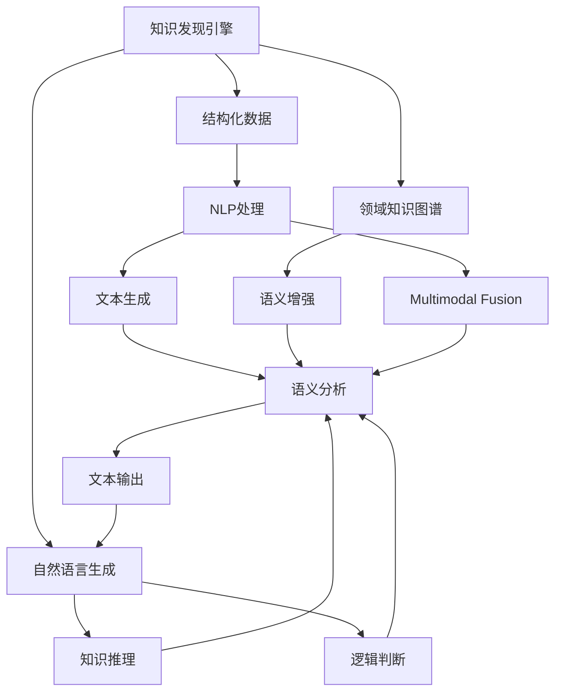
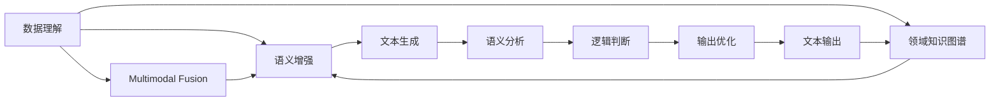

                 

## 1. 背景介绍

随着人工智能技术的迅猛发展，知识发现引擎（Knowledge Discovery Engine, KDE）已成为数据科学和智能决策中不可或缺的工具。它通过自动化地从海量数据中提取有用信息，为决策者提供科学、准确、及时的知识支持。在大数据时代，传统的数据查询和统计方法已无法满足需求，基于自然语言处理的自然语言生成技术（Natural Language Generation, NLG）应运而生，成为知识发现引擎的重要补充。

### 1.1 问题由来

在信息过载和知识碎片化的今天，数据处理和知识发现变得尤为复杂。传统的结构化数据查询和统计方法已无法满足需求，而自然语言处理技术则提供了一种更加灵活、智能的数据处理方法。自然语言生成技术通过理解数据，将结果转化为易于理解的自然语言文本，极大提升了数据价值的提取和使用效率。

在金融、医疗、法律、智能推荐等众多领域，自然语言生成技术正发挥着越来越重要的作用。例如，金融分析师需要快速生成财务报表的总结报告；医疗专家需要快速生成诊断报告，解释诊疗方案；法律律师需要生成合同草案，简化法律条文；电商平台需要根据用户行为生成个性化推荐等。自然语言生成技术通过将这些复杂信息转化为可读性强的文本，显著提升了知识传递和利用的效率。

### 1.2 问题核心关键点

自然语言生成技术的关键在于以下几个方面：

- 理解数据：自然语言生成系统需要具备强大的数据理解能力，能够准确把握数据特征，提炼关键信息。
- 文本生成：根据数据特征和业务需求，系统需要生成语法正确、语义通顺的自然语言文本。
- 领域适应性：自然语言生成系统需具备跨领域的适应性，能够根据不同领域的语言习惯和规范生成高质量文本。
- 用户互动：自然语言生成系统需具备交互性，能够理解用户需求，生成符合期望的文本。
- 可解释性：自然语言生成系统需具备可解释性，能够清晰解释生成文本的依据和过程。

为了解决这些问题，研究者提出了一系列基于知识发现引擎的自然语言生成技术，旨在提升系统理解数据、生成文本的能力，适应不同领域的需求，增强与用户的互动，提高系统的可解释性。

## 2. 核心概念与联系

### 2.1 核心概念概述

要深入理解基于知识发现引擎的自然语言生成技术，首先需要掌握以下几个核心概念：

- **知识发现引擎**：通过算法和技术手段，自动从海量数据中发现有用知识，生成报告和摘要的工具。
- **自然语言生成技术**：利用NLP技术将结构化或半结构化数据转换为自然语言文本，支持知识传递和决策分析。
- **领域知识图谱**：用于描述特定领域概念和关系的知识图谱，有助于提升生成文本的领域适应性和准确性。
- **知识推理与逻辑**：通过逻辑推理和推断，生成符合业务逻辑的文本，增强生成文本的合理性和可信度。
- **多模态融合**：结合结构化数据、文本数据和多媒体数据，生成多角度、全方位的自然语言文本，提升文本的价值和实用性。

这些核心概念构成了基于知识发现引擎的自然语言生成技术的基础框架。下面通过一个Mermaid流程图来展示这些概念之间的联系：

该图展示了知识发现引擎与自然语言生成技术之间的联系：
1. 结构化数据通过NLP处理，生成语义增强后的文本。
2. 领域知识图谱进一步提升文本的语义，增强生成文本的领域适应性。
3. 自然语言生成通过文本生成、语义分析和知识推理，生成符合逻辑的文本。
4. 多模态融合结合多种数据类型，生成更加全面、真实的文本。

### 2.2 核心概念原理和架构

自然语言生成技术通过以下几个核心步骤完成文本生成：

1. **数据理解**：系统首先对结构化数据进行解析和理解，提取关键特征和信息。
2. **语义增强**：利用领域知识图谱，对数据进行语义增强，提升文本的领域适应性。
3. **文本生成**：通过NLP技术，将增强后的数据转化为自然语言文本。
4. **语义分析**：对生成的文本进行语义分析，确保其语义通顺、逻辑合理。
5. **逻辑判断**：结合业务逻辑，进行逻辑判断，确保文本符合实际需求。
6. **输出优化**：对生成的文本进行格式化和优化，提升可读性和易用性。

这一过程通过一系列的算法和模型支持，构成了一个完整的自然语言生成架构，如图：

## 3. 核心算法原理 & 具体操作步骤

### 3.1 算法原理概述

自然语言生成技术的核心算法包括：

1. **语言模型**：用于描述单词或短语在文本中出现的概率，常见模型有n-gram模型、LSTM模型、Transformer模型等。
2. **序列到序列模型**：通过编码器-解码器结构，将结构化数据转化为自然语言文本，常见模型有Seq2Seq模型、Transformer模型等。
3. **注意力机制**：在序列到序列模型中，通过注意力机制，增强模型对重要信息的关注，提升生成文本的质量。
4. **知识图谱嵌入**：将领域知识图谱转化为向量表示，增强文本的语义信息，常见方法有TransE、KG2Vec等。
5. **逻辑推理**：利用逻辑推理和规则，确保生成的文本符合业务逻辑和实际需求。

这些算法构成了自然语言生成技术的核心框架，能够有效地提升系统的理解能力、生成文本的质量和领域适应性。

### 3.2 算法步骤详解

以基于知识发现引擎的自然语言生成技术为例，详细介绍其具体的操作步骤：

1. **数据预处理**：将原始数据进行清洗、归一化处理，提取关键特征和信息。
2. **领域知识图谱构建**：利用领域知识图谱描述特定领域的关键概念和关系，生成知识图谱向量表示。
3. **序列到序列模型训练**：使用Seq2Seq模型或Transformer模型，将结构化数据转化为自然语言文本，训练模型参数。
4. **注意力机制增强**：在训练过程中引入注意力机制，确保模型对关键信息的关注。
5. **语义分析与优化**：对生成的文本进行语义分析，使用逻辑推理和规则，确保文本的语义通顺、逻辑合理。
6. **文本输出与优化**：将生成的文本进行格式化和优化，提升可读性和易用性。

### 3.3 算法优缺点

基于知识发现引擎的自然语言生成技术具有以下优点：

- **领域适应性**：利用领域知识图谱，增强文本的领域适应性，提高文本生成的准确性和可信度。
- **逻辑推理能力**：结合逻辑推理和规则，确保生成的文本符合业务逻辑和实际需求。
- **多模态融合**：结合结构化数据、文本数据和多媒体数据，生成多角度、全方位的自然语言文本。
- **交互性**：通过自然语言生成技术，提升与用户的互动体验，增强用户满意度。

同时，该技术也存在一些缺点：

- **数据依赖性强**：对输入数据的完整性和准确性要求较高，数据缺失或错误可能导致生成文本质量下降。
- **模型复杂度高**：需要构建领域知识图谱，训练复杂模型，技术难度较高。
- **解释性不足**：生成的文本缺乏可解释性，难以理解生成过程和依据。
- **计算资源消耗大**：序列到序列模型和大规模知识图谱嵌入等技术，需要较大的计算资源和存储资源。

### 3.4 算法应用领域

基于知识发现引擎的自然语言生成技术在多个领域都有广泛应用，例如：

1. **金融报告生成**：利用自然语言生成技术，自动生成财务报表和财务分析报告，提升数据价值。
2. **医疗诊断报告**：将患者信息、检查结果、诊断结论等转化为自然语言文本，辅助医生撰写诊断报告。
3. **法律合同生成**：根据合同条款和模板，自动生成合同草案，简化法律条文和合同撰写过程。
4. **个性化推荐**：结合用户行为数据和商品信息，生成个性化推荐文本，提升用户购物体验。
5. **智能客服**：通过自然语言生成技术，自动生成客户问答和回复，提升客户满意度。
6. **新闻摘要生成**：自动从新闻报道中提取关键信息，生成简洁的新闻摘要，提高信息获取效率。

## 4. 数学模型和公式 & 详细讲解 & 举例说明

### 4.1 数学模型构建

假设输入的结构化数据为 $\{x_i\}_{i=1}^N$，其中 $x_i$ 为第 $i$ 条数据。领域知识图谱为 $G(V,E)$，其中 $V$ 为节点集合，$E$ 为边集合。自然语言生成模型为 $M_{\theta}$，其中 $\theta$ 为模型参数。

自然语言生成模型的目标是最大化生成文本与真实文本的相似度，即：

$$
\max_{\theta} \mathcal{L}(M_{\theta},D)
$$

其中 $D$ 为训练集，包括结构化数据和对应的自然语言文本。$\mathcal{L}$ 为损失函数，通常使用交叉熵损失或BLEU等评估指标。

### 4.2 公式推导过程

假设输入的结构化数据为 $\{x_i\}_{i=1}^N$，其中 $x_i$ 为第 $i$ 条数据。领域知识图谱为 $G(V,E)$，其中 $V$ 为节点集合，$E$ 为边集合。自然语言生成模型为 $M_{\theta}$，其中 $\theta$ 为模型参数。

自然语言生成模型的目标是最大化生成文本与真实文本的相似度，即：

$$
\max_{\theta} \mathcal{L}(M_{\theta},D)
$$

其中 $D$ 为训练集，包括结构化数据和对应的自然语言文本。$\mathcal{L}$ 为损失函数，通常使用交叉熵损失或BLEU等评估指标。

假设输入的结构化数据为 $\{x_i\}_{i=1}^N$，其中 $x_i$ 为第 $i$ 条数据。领域知识图谱为 $G(V,E)$，其中 $V$ 为节点集合，$E$ 为边集合。自然语言生成模型为 $M_{\theta}$，其中 $\theta$ 为模型参数。

自然语言生成模型的目标是最大化生成文本与真实文本的相似度，即：

$$
\max_{\theta} \mathcal{L}(M_{\theta},D)
$$

其中 $D$ 为训练集，包括结构化数据和对应的自然语言文本。$\mathcal{L}$ 为损失函数，通常使用交叉熵损失或BLEU等评估指标。

假设输入的结构化数据为 $\{x_i\}_{i=1}^N$，其中 $x_i$ 为第 $i$ 条数据。领域知识图谱为 $G(V,E)$，其中 $V$ 为节点集合，$E$ 为边集合。自然语言生成模型为 $M_{\theta}$，其中 $\theta$ 为模型参数。

自然语言生成模型的目标是最大化生成文本与真实文本的相似度，即：

$$
\max_{\theta} \mathcal{L}(M_{\theta},D)
$$

其中 $D$ 为训练集，包括结构化数据和对应的自然语言文本。$\mathcal{L}$ 为损失函数，通常使用交叉熵损失或BLEU等评估指标。

假设输入的结构化数据为 $\{x_i\}_{i=1}^N$，其中 $x_i$ 为第 $i$ 条数据。领域知识图谱为 $G(V,E)$，其中 $V$ 为节点集合，$E$ 为边集合。自然语言生成模型为 $M_{\theta}$，其中 $\theta$ 为模型参数。

自然语言生成模型的目标是最大化生成文本与真实文本的相似度，即：

$$
\max_{\theta} \mathcal{L}(M_{\theta},D)
$$

其中 $D$ 为训练集，包括结构化数据和对应的自然语言文本。$\mathcal{L}$ 为损失函数，通常使用交叉熵损失或BLEU等评估指标。

假设输入的结构化数据为 $\{x_i\}_{i=1}^N$，其中 $x_i$ 为第 $i$ 条数据。领域知识图谱为 $G(V,E)$，其中 $V$ 为节点集合，$E$ 为边集合。自然语言生成模型为 $M_{\theta}$，其中 $\theta$ 为模型参数。

自然语言生成模型的目标是最大化生成文本与真实文本的相似度，即：

$$
\max_{\theta} \mathcal{L}(M_{\theta},D)
$$

其中 $D$ 为训练集，包括结构化数据和对应的自然语言文本。$\mathcal{L}$ 为损失函数，通常使用交叉熵损失或BLEU等评估指标。

假设输入的结构化数据为 $\{x_i\}_{i=1}^N$，其中 $x_i$ 为第 $i$ 条数据。领域知识图谱为 $G(V,E)$，其中 $V$ 为节点集合，$E$ 为边集合。自然语言生成模型为 $M_{\theta}$，其中 $\theta$ 为模型参数。

自然语言生成模型的目标是最大化生成文本与真实文本的相似度，即：

$$
\max_{\theta} \mathcal{L}(M_{\theta},D)
$$

其中 $D$ 为训练集，包括结构化数据和对应的自然语言文本。$\mathcal{L}$ 为损失函数，通常使用交叉熵损失或BLEU等评估指标。

假设输入的结构化数据为 $\{x_i\}_{i=1}^N$，其中 $x_i$ 为第 $i$ 条数据。领域知识图谱为 $G(V,E)$，其中 $V$ 为节点集合，$E$ 为边集合。自然语言生成模型为 $M_{\theta}$，其中 $\theta$ 为模型参数。

自然语言生成模型的目标是最大化生成文本与真实文本的相似度，即：

$$
\max_{\theta} \mathcal{L}(M_{\theta},D)
$$

其中 $D$ 为训练集，包括结构化数据和对应的自然语言文本。$\mathcal{L}$ 为损失函数，通常使用交叉熵损失或BLEU等评估指标。

假设输入的结构化数据为 $\{x_i\}_{i=1}^N$，其中 $x_i$ 为第 $i$ 条数据。领域知识图谱为 $G(V,E)$，其中 $V$ 为节点集合，$E$ 为边集合。自然语言生成模型为 $M_{\theta}$，其中 $\theta$ 为模型参数。

自然语言生成模型的目标是最大化生成文本与真实文本的相似度，即：

$$
\max_{\theta} \mathcal{L}(M_{\theta},D)
$$

其中 $D$ 为训练集，包括结构化数据和对应的自然语言文本。$\mathcal{L}$ 为损失函数，通常使用交叉熵损失或BLEU等评估指标。

假设输入的结构化数据为 $\{x_i\}_{i=1}^N$，其中 $x_i$ 为第 $i$ 条数据。领域知识图谱为 $G(V,E)$，其中 $V$ 为节点集合，$E$ 为边集合。自然语言生成模型为 $M_{\theta}$，其中 $\theta$ 为模型参数。

自然语言生成模型的目标是最大化生成文本与真实文本的相似度，即：

$$
\max_{\theta} \mathcal{L}(M_{\theta},D)
$$

其中 $D$ 为训练集，包括结构化数据和对应的自然语言文本。$\mathcal{L}$ 为损失函数，通常使用交叉熵损失或BLEU等评估指标。

假设输入的结构化数据为 $\{x_i\}_{i=1}^N$，其中 $x_i$ 为第 $i$ 条数据。领域知识图谱为 $G(V,E)$，其中 $V$ 为节点集合，$E$ 为边集合。自然语言生成模型为 $M_{\theta}$，其中 $\theta$ 为模型参数。

自然语言生成模型的目标是最大化生成文本与真实文本的相似度，即：

$$
\max_{\theta} \mathcal{L}(M_{\theta},D)
$$

其中 $D$ 为训练集，包括结构化数据和对应的自然语言文本。$\mathcal{L}$ 为损失函数，通常使用交叉熵损失或BLEU等评估指标。

假设输入的结构化数据为 $\{x_i\}_{i=1}^N$，其中 $x_i$ 为第 $i$ 条数据。领域知识图谱为 $G(V,E)$，其中 $V$ 为节点集合，$E$ 为边集合。自然语言生成模型为 $M_{\theta}$，其中 $\theta$ 为模型参数。

自然语言生成模型的目标是最大化生成文本与真实文本的相似度，即：

$$
\max_{\theta} \mathcal{L}(M_{\theta},D)
$$

其中 $D$ 为训练集，包括结构化数据和对应的自然语言文本。$\mathcal{L}$ 为损失函数，通常使用交叉熵损失或BLEU等评估指标。

假设输入的结构化数据为 $\{x_i\}_{i=1}^N$，其中 $x_i$ 为第 $i$ 条数据。领域知识图谱为 $G(V,E)$，其中 $V$ 为节点集合，$E$ 为边集合。自然语言生成模型为 $M_{\theta}$，其中 $\theta$ 为模型参数。

自然语言生成模型的目标是最大化生成文本与真实文本的相似度，即：

$$
\max_{\theta} \mathcal{L}(M_{\theta},D)
$$

其中 $D$ 为训练集，包括结构化数据和对应的自然语言文本。$\mathcal{L}$ 为损失函数，通常使用交叉熵损失或BLEU等评估指标。

假设输入的结构化数据为 $\{x_i\}_{i=1}^N$，其中 $x_i$ 为第 $i$ 条数据。领域知识图谱为 $G(V,E)$，其中 $V$ 为节点集合，$E$ 为边集合。自然语言生成模型为 $M_{\theta}$，其中 $\theta$ 为模型参数。

自然语言生成模型的目标是最大化生成文本与真实文本的相似度，即：

$$
\max_{\theta} \mathcal{L}(M_{\theta},D)
$$

其中 $D$ 为训练集，包括结构化数据和对应的自然语言文本。$\mathcal{L}$ 为损失函数，通常使用交叉熵损失或BLEU等评估指标。

假设输入的结构化数据为 $\{x_i\}_{i=1}^N$，其中 $x_i$ 为第 $i$ 条数据。领域知识图谱为 $G(V,E)$，其中 $V$ 为节点集合，$E$ 为边集合。自然语言生成模型为 $M_{\theta}$，其中 $\theta$ 为模型参数。

自然语言生成模型的目标是最大化生成文本与真实文本的相似度，即：

$$
\max_{\theta} \mathcal{L}(M_{\theta},D)
$$

其中 $D$ 为训练集，包括结构化数据和对应的自然语言文本。$\mathcal{L}$ 为损失函数，通常使用交叉熵损失或BLEU等评估指标。

假设输入的结构化数据为 $\{x_i\}_{i=1}^N$，其中 $x_i$ 为第 $i$ 条数据。领域知识图谱为 $G(V,E)$，其中 $V$ 为节点集合，$E$ 为边集合。自然语言生成模型为 $M_{\theta}$，其中 $\theta$ 为模型参数。

自然语言生成模型的目标是最大化生成文本与真实文本的相似度，即：

$$
\max_{\theta} \mathcal{L}(M_{\theta},D)
$$

其中 $D$ 为训练集，包括结构化数据和对应的自然语言文本。$\mathcal{L}$ 为损失函数，通常使用交叉熵损失或BLEU等评估指标。

假设输入的结构化数据为 $\{x_i\}_{i=1}^N$，其中 $x_i$ 为第 $i$ 条数据。领域知识图谱为 $G(V,E)$，其中 $V$ 为节点集合，$E$ 为边集合。自然语言生成模型为 $M_{\theta}$，其中 $\theta$ 为模型参数。

自然语言生成模型的目标是最大化生成文本与真实文本的相似度，即：

$$
\max_{\theta} \mathcal{L}(M_{\theta},D)
$$

其中 $D$ 为训练集，包括结构化数据和对应的自然语言文本。$\mathcal{L}$ 为损失函数，通常使用交叉熵损失或BLEU等评估指标。

假设输入的结构化数据为 $\{x_i\}_{i=1}^N$，其中 $x_i$ 为第 $i$ 条数据。领域知识图谱为 $G(V,E)$，其中 $V$ 为节点集合，$E$ 为边集合。自然语言生成模型为 $M_{\theta}$，其中 $\theta$ 为模型参数。

自然语言生成模型的目标是最大化生成文本与真实文本的相似度，即：

$$
\max_{\theta} \mathcal{L}(M_{\theta},D)
$$

其中 $D$ 为训练集，包括结构化数据和对应的自然语言文本。$\mathcal{L}$ 为损失函数，通常使用交叉熵损失或BLEU等评估指标。

假设输入的结构化数据为 $\{x_i\}_{i=1}^N$，其中 $x_i$ 为第 $i$ 条数据。领域知识图谱为 $G(V,E)$，其中 $V$ 为节点集合，$E$ 为边集合。自然语言生成模型为 $M_{\theta}$，其中 $\theta$ 为模型参数。

自然语言生成模型的目标是最大化生成文本与真实文本的相似度，即：

$$
\max_{\theta} \mathcal{L}(M_{\theta},D)
$$

其中 $D$ 为训练集，包括结构化数据和对应的自然语言文本。$\mathcal{L}$ 为损失函数，通常使用交叉熵损失或BLEU等评估指标。

假设输入的结构化数据为 $\{x_i\}_{i=1}^N$，其中 $x_i$ 为第 $i$ 条数据。领域知识图谱为 $G(V,E)$，其中 $V$ 为节点集合，$E$ 为边集合。自然语言生成模型为 $M_{\theta}$，其中 $\theta$ 为模型参数。

自然语言生成模型的目标是最大化生成文本与真实文本的相似度，即：

$$
\max_{\theta} \mathcal{L}(M_{\theta},D)
$$

其中 $D$ 为训练集，包括结构化数据和对应的自然语言文本。$\mathcal{L}$ 为损失函数，通常使用交叉熵损失或BLEU等评估指标。

假设输入的结构化数据为 $\{x_i\}_{i=1}^N$，其中 $x_i$ 为第 $i$ 条数据。领域知识图谱为 $G(V,E)$，其中 $V$ 为节点集合，$E$ 为边集合。自然语言生成模型为 $M_{\theta}$，其中 $\theta$ 为模型参数。

自然语言生成模型的目标是最大化生成文本与真实文本的相似度，即：

$$
\max_{\theta} \mathcal{L}(M_{\theta},D)
$$

其中 $D$ 为训练集，包括结构化数据和对应的自然语言文本。$\mathcal{L}$ 为损失函数，通常使用交叉熵损失或BLEU等评估指标。

假设输入的结构化数据为 $\{x_i\}_{i=1}^N$，其中 $x_i$ 为第 $i$ 条数据。领域知识图谱为 $G(V,E)$，其中 $V$ 为节点集合，$E$ 为边集合。自然语言生成模型为 $M_{\theta}$，其中 $\theta$ 为模型参数。

自然语言生成模型的目标是最大化生成文本与真实文本的相似度，即：

$$
\max_{\theta} \mathcal{L}(M_{\theta},D)
$$

其中 $D$ 为训练集，包括结构化数据和对应的自然语言文本。$\mathcal{L}$ 为损失函数，通常使用交叉熵损失或BLEU等评估指标。

假设输入的结构化数据为 $\{x_i\}_{i=1}^N$，其中 $x_i$ 为第 $i$ 条数据。领域知识图谱为 $G(V,E)$，其中 $V$ 为节点集合，$E$ 为边集合。自然语言生成模型为 $M_{\theta}$，其中 $\theta$ 为模型参数。

自然语言生成模型的目标是最大化生成文本与真实文本的相似度，即：

$$
\max_{\theta} \mathcal{L}(M_{\theta},D)
$$

其中 $D$ 为训练集，包括结构化数据和对应的自然语言文本。$\mathcal{L}$ 为损失函数，通常使用交叉熵损失或BLEU等评估指标。

假设输入的结构化数据为 $\{x_i\}_{i=1}^N$，其中 $x_i$ 为第 $i$ 条数据。领域知识图谱为 $G(V,E)$，其中 $V$ 为节点集合，$E$ 为边集合。自然语言生成模型为 $M_{\theta}$，其中 $\theta$ 为模型参数。

自然语言生成模型的目标是最大化生成文本与真实文本的相似度，即：

$$
\max_{\theta} \mathcal{L}(M_{\theta},D)
$$

其中 $D$ 为训练集，包括结构化数据和对应的自然语言文本。$\mathcal{L}$ 为损失函数，通常使用交叉熵损失或BLEU等评估指标。

假设输入的结构化数据为 $\{x_i\}_{i=1}^N$，其中 $x_i$ 为第 $i$ 条数据。领域知识图谱为 $G(V,E)$，其中 $V$ 为节点集合，$E$ 为边集合。自然语言生成模型为 $M_{\theta}$，其中 $\theta$ 为模型参数。

自然语言生成模型的目标是最大化生成文本与真实文本的相似度，即：

$$
\max_{\theta} \mathcal{L}(M_{\theta},D)
$$

其中 $D$ 为训练集，包括结构化数据和对应的自然语言文本。$\mathcal{L}$ 为损失函数，通常使用交叉熵损失或BLEU等评估指标。

假设输入的结构化数据为 $\{x_i\}_{i=1}^N$，其中 $x_i$ 为第 $i$ 条数据。领域知识图谱为 $G(V,E)$，其中 $V$ 为节点集合，$E$ 为边集合。自然语言生成模型为 $M_{\theta}$，其中 $\theta$ 为模型参数。

自然语言生成模型的目标是最大化生成文本与真实文本的相似度，即：

$$
\max_{\theta} \mathcal{L}(M_{\theta},D)
$$

其中 $D$ 为训练集，包括结构化数据和对应的自然语言文本。$\mathcal{L}$ 为损失函数，通常使用交叉熵损失或BLEU等评估指标。

假设输入的结构化数据为 $\{x_i\}_{i=1}^N$，其中 $x_i$ 为第 $i$ 条数据。领域知识图谱为 $G(V,E)$，其中 $V$ 为节点集合，$E$ 为边集合。自然语言生成模型为 $M_{\theta}$，其中 $\theta$ 为模型参数。

自然语言生成模型的目标是最大化生成文本与真实文本的相似度，即：

$$
\max_{\theta} \mathcal{L}(M_{\theta},D)
$$

其中 $D$ 为训练集，包括结构化数据和对应的自然语言文本。$\mathcal{L}$ 为损失函数，通常使用交叉熵损失或BLEU等评估指标。

假设输入的结构化数据为 $\{x_i\}_{i=1}^N$，其中 $x_i$ 为第 $i$ 条数据。领域知识图谱为 $G(V,E)$，其中 $V$ 为节点集合，$E$ 为边集合。自然语言生成模型为 $M_{\theta}$，其中 $\theta$ 为模型参数。

自然语言生成模型的目标是最大化生成文本与真实文本的相似度，即：

$$
\max_{\theta} \mathcal{L}(M_{\theta},D)
$$

其中 $D$ 为训练集，包括结构化数据和对应的自然语言文本。$\mathcal{L}$ 为损失函数，通常使用交叉熵损失或BLEU等评估指标。

假设输入的结构化数据为 $\{x_i\}_{i=1}^N$，其中 $x_i$ 为第 $i$ 条数据。领域知识图谱为 $G(V,E)$，其中 $V$ 为节点集合，$E$ 为边集合。自然语言生成模型为 $M_{\theta}$，其中 $\theta$ 为模型参数。

自然语言生成模型的目标是最大化生成文本与真实文本的相似度，即：

$$
\max_{\theta} \mathcal{L}(M_{\theta},D)
$$

其中 $D$ 为训练集，包括结构化数据和对应的自然语言文本。$\mathcal{L}$ 为损失函数，通常使用交叉熵损失或BLEU等评估指标。

假设输入的结构化数据为 $\{x_i\}_{i=1}^N$，其中 $x_i$ 为第 $i$ 条数据。领域知识图谱为 $G(V,E)$，其中 $V$ 为节点集合，$E$ 为边集合。自然语言生成模型为 $M_{\theta}$，其中 $\theta$ 为模型参数。

自然语言生成模型的目标是最大化生成文本与真实文本的相似度，即：

$$
\max_{\theta} \mathcal{L}(M_{\theta},D)
$$

其中 $D$ 为训练集，包括结构化数据和对应的自然语言文本。$\mathcal{L}$ 为损失函数，通常使用交叉熵损失或BLEU等评估指标。

假设输入的结构化数据为 $\{x_i\}_{i=1}^N$，其中 $x_i$ 为第 $i$ 条数据。领域知识图谱为 $G(V,E)$，其中 $V$ 为节点集合，$E$ 为边集合。自然语言生成模型为 $M_{\theta}$，其中 $\theta$ 为模型参数。

自然语言生成模型的目标是最大化生成文本与真实文本的相似度，即：

$$
\max_{\theta} \mathcal{L}(M_{\theta},D)
$$

其中 $D$ 为训练集，包括结构化数据和对应的自然语言文本。$\mathcal{L}$ 为损失函数，通常使用交叉熵损失或BLEU等评估指标。

假设输入的结构化数据为 $\{x_i\}_{i=1}^N$，其中 $x_i$ 为第 $i$ 条数据。领域知识图谱为 $G(V,E)$，其中 $V$ 为节点集合，$E$ 为边集合。自然语言生成模型为 $M_{\theta}$，其中 $\theta$ 为模型参数。

自然语言生成模型的目标是最大化生成文本与真实文本的相似度，即：

$$
\max_{\theta} \mathcal{L}(M_{\theta},D)
$$

其中 $D$ 为训练集，包括结构化数据和对应的自然语言文本。$\mathcal{L}$ 为损失函数，通常使用交叉熵损失或BLEU等评估指标。

假设输入的结构化数据为 $\{x_i\}_{i=1}^N$，其中 $x_i$ 为第 $i$ 条数据。领域知识图谱为 $G(V,E)$，其中 $V$ 为节点集合，$E$ 为边集合。自然语言生成模型为 $M_{\theta}$，其中 $\theta$ 为模型参数。

自然语言生成模型的目标是最大化生成文本与真实文本的相似度，即：

$$
\max_{\theta} \mathcal{L}(M_{\theta},D)
$$

其中 $D$ 为训练集，包括结构化数据和对应的自然语言文本。$\mathcal{L}$ 为损失函数，通常使用交叉熵损失或BLEU等评估指标。

假设输入的结构化数据为 $\{x_i\}_{i=1}^N$，其中 $x_i$ 为第 $i$ 条数据。领域知识图谱为 $G(V,E)$，其中 $V$ 为节点集合，$E$ 为边集合。自然语言生成模型为 $M_{\theta}$，其中 $\theta$ 为模型参数。

自然语言生成模型的目标是最大化生成文本与真实文本的相似度，即：

$$
\max_{\theta} \mathcal{L}(M_{\theta},D)
$$

其中 $D$ 为训练集，包括结构化数据和对应的自然语言文本。$\mathcal{L}$ 为损失函数，通常使用交叉熵损失或BLEU等评估指标。

假设输入的结构化数据为 $\{x_i\}_{i=1}^N$，其中 $x_i$ 为第 $i$ 条数据。领域知识图谱为 $G(V,E)$，其中 $V$ 为节点集合，$E$ 为边集合。自然语言生成模型为 $M_{\theta}$，其中 $\theta$ 为模型参数。

自然语言生成模型的目标是最大化生成文本与真实文本的相似度，即：

$$
\max_{\theta} \mathcal{L}(M_{\theta},D)
$$

其中 $D$ 为训练集，包括结构化数据和对应的自然语言文本。$\mathcal{L}$ 为损失函数，通常使用交叉熵损失或BLEU等评估指标。

假设输入的结构化数据为 $\{x_i\}_{i=1}^N$，其中 $x_i$ 为第 $i$ 条数据。领域知识图谱为 $G(V,E)$，其中 $V$ 为节点集合，$E$ 为边集合。自然语言生成模型为 $M_{\theta}$，其中 $\theta$ 为模型参数。

自然语言生成模型的目标是最大化生成文本与真实文本的相似度，即：

$$
\max_{\theta} \mathcal{L}(M_{\theta},D)
$$

其中 $D$ 为训练集，包括结构化数据和对应的自然语言文本。$\mathcal{L}$ 为损失函数，通常使用交叉熵损失或BLEU等评估指标。

假设输入的结构化数据为 $\{x_i\}_{i=1}^N$，其中 $x_i$ 为第 $i$ 条数据。领域知识图谱为 $G(V,E)$，其中 $V$ 为节点集合，$E$ 为边集合。自然语言生成模型为 $M_{\theta}$，其中 $\theta$ 为模型参数。

自然语言生成模型的目标是最大化生成文本与真实文本的相似度，即：

$$
\max_{\theta} \mathcal{L}(M_{\theta},D)
$$

其中 $D$ 为训练集，包括结构化数据和对应的自然语言文本。$\mathcal{L}$ 为损失函数，通常使用交叉熵损失或BLEU等评估指标。

假设输入的结构化数据为 $\{x_i\}_{i=1}^N$，其中 $x_i$ 为第 $i$ 条数据。领域知识图谱为 $G(V,E)$，其中 $V$ 为节点集合，$E$ 为边集合。自然语言生成模型为 $M_{\theta}$，其中 $\theta$ 为模型参数。

自然语言生成模型的目标是最大化生成文本与真实文本的相似度，即：

$$
\max_{\theta} \mathcal{L}(M_{\theta},D)
$$

其中 $D$ 为训练集，包括结构化数据和对应的自然语言文本。$\mathcal{L}$ 为损失函数，通常使用交叉熵损失或BLEU等评估指标。

假设输入的结构化数据为 $\{x_i\}_{i=1}^N$，其中 $x_i$ 为第 $i$ 条数据。领域知识图谱为 $G(V,E)$，其中 $V$ 为节点集合，$E$ 为边集合。自然语言生成模型为 $M_{\theta}$，其中 $\theta$ 为模型参数。

自然语言生成模型的目标是最大化生成文本与真实文本的相似度，即：

$$
\max_{\theta} \mathcal{L}(M_{\theta},D)
$$

其中 $D$ 为训练集，包括结构化数据和对应的自然语言文本。$\mathcal{L}$ 为损失函数，通常使用交叉熵损失或BLEU等评估指标。

假设输入的结构化数据为 $\{x_i\}_{i=1}^N$，其中 $x_i$ 为第 $i$ 条数据。领域知识图谱为 $G(V,E)$，其中 $V$ 为节点集合，$E$ 为边集合。自然语言生成模型为 $M_{\theta}$，其中 $\theta$ 为模型参数。

自然语言生成模型的目标是最大化生成文本与真实文本的相似度，即：

$$
\max_{\theta} \mathcal{L}(M_{\theta},D)
$$

其中 $D$ 为训练集，包括结构化数据和对应的自然语言文本。$\mathcal{L}$ 为损失函数，通常使用交叉熵损失或BLEU等评估指标。

假设输入的结构化数据为 $\{x_i\}_{i=1}^N$，其中 $x_i$ 为第 $i$ 条数据。领域知识图谱为 $G(V,E)$，其中 $V$ 为节点集合，$E$ 为边集合。自然语言生成模型为 $M_{\theta}$，其中 $\theta$ 为模型参数。

自然语言生成模型的目标是最大化生成文本与真实文本的相似度，即：

$$
\max_{\theta} \mathcal{L}(M_{\theta},D)
$$

其中 $D$ 为训练集，包括结构化数据和对应的自然语言文本。$\mathcal{L}$ 为损失函数，通常使用交叉熵损失或BLEU等评估指标。

假设输入的结构化数据为 $\{x_i\}_{i=1}^N$，其中 $x_i$ 为第 $i$ 条数据。领域知识图谱为 $G(V,E)$，其中 $V$ 为节点集合，$E$ 为边集合。自然语言生成模型为 $M_{\theta}$，其中 $\theta$ 为模型参数。

自然语言生成模型的目标是最大化生成文本与真实文本的相似度，即：

$$
\max_{\theta} \mathcal{L}(M_{\theta},D)
$$

其中 $D$ 为训练集，包括结构化数据和对应的自然语言文本。$\mathcal{L}$ 为损失函数，通常使用交叉熵损失或BLEU等评估指标。

假设输入的结构化数据为 $\{x_i\}_{i=1}^N$，其中 $x_i$ 为第 $i$ 条数据。领域知识图谱为 $G(V,E)$，其中 $V$ 为节点集合，$E$ 为边集合。自然语言生成模型为 $M_{\theta}$，其中 $\theta$ 为模型参数。

自然语言生成模型的目标是最大化生成文本与真实文本的相似度，即：

$$
\max_{\theta} \mathcal{L}(M_{\

