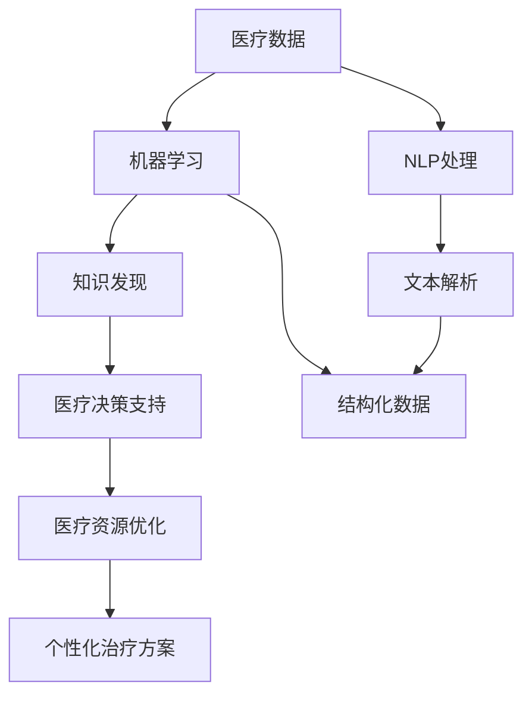

                 

# 知识发现引擎：助力医疗领域的智慧诊疗

> 关键词：知识发现引擎，医疗领域，智慧诊疗，自然语言处理(NLP)，机器学习(ML)，数据挖掘，预测模型

## 1. 背景介绍

### 1.1 问题由来

在医疗领域，诊断和治疗是极其复杂且挑战性的任务。医生通常需要积累丰富的临床经验，并利用医学知识，才能做出准确的诊断和治疗方案。然而，即便是最有经验的医生，也难以涵盖所有疾病和情况，这使得误诊和漏诊时有发生。而且，医疗资源分配不均，尤其是在发展中国家，医疗资源的匮乏使得许多患者无法及时获得高质量的医疗服务。

为了应对这些挑战，研究人员和产业界开始探索利用人工智能(AI)技术辅助医生进行诊断和治疗。其中，知识发现引擎(Knowledge Discovery Engine)成为了一种有力的工具，它能够从海量的医疗数据中挖掘出潜在的知识，辅助医生进行决策，提升医疗服务的质量和效率。

### 1.2 问题核心关键点

知识发现引擎的核心思想是通过对医疗数据进行分析、挖掘和总结，从中发现潜在的知识模式，如疾病关联、治疗方案、药物副作用等。这些知识能够帮助医生更好地理解疾病机理，制定个性化的治疗方案，提高诊断和治疗的准确性。

具体来说，知识发现引擎在医疗领域的应用主要包括以下几个方面：

1. **疾病诊断**：通过分析患者的病史、症状、检查结果等数据，预测患者可能患有的疾病，辅助医生进行诊断。
2. **治疗方案**：从海量的医疗数据中提取有效的治疗方案，为医生提供参考。
3. **药物副作用**：通过分析药物在患者身上的表现，预测可能的副作用，避免不必要的药物伤害。
4. **医疗资源分配**：通过分析医疗资源的分布和使用情况，优化资源配置，确保患者能够获得最优的医疗服务。

这些应用展示了知识发现引擎在医疗领域的重要性和潜力。然而，实现这些应用需要解决一系列的技术难题，包括如何高效地从大量数据中提取知识，如何保证知识的质量和可靠性，以及如何将知识应用于实际医疗决策中。

## 2. 核心概念与联系

### 2.1 核心概念概述

为了更好地理解知识发现引擎在医疗领域的应用，本节将介绍几个密切相关的核心概念：

- **知识发现(Knowledge Discovery)**：通过数据分析、挖掘和总结，从大量数据中提取有价值的知识和模式。在医疗领域，知识发现可以用于诊断、治疗方案、药物副作用等方面的研究。
- **医疗数据**：包括患者的病史、症状、检查结果、治疗方案等文本和结构化数据。这些数据是知识发现的基础。
- **自然语言处理(NLP)**：用于处理和分析文本数据，如病历、医嘱等，提取结构化信息。
- **机器学习(ML)**：用于从数据中学习模式，如分类、回归、聚类等。在医疗领域，机器学习可以用于疾病诊断、治疗方案预测等任务。
- **数据挖掘(Data Mining)**：从大量数据中自动发现模式和关联。在医疗领域，数据挖掘可以用于药物副作用预测、医疗资源分配等应用。

这些核心概念之间的逻辑关系可以通过以下Mermaid流程图来展示：



这个流程图展示了从医疗数据到最终应用的全过程：

1. 医疗数据被输入系统。
2. 自然语言处理模块将文本数据转换为结构化信息。
3. 机器学习模块从结构化数据中学习模式。
4. 知识发现模块自动挖掘出潜在的知识。
5. 这些知识被用于医疗决策支持和资源优化。
6. 最终生成个性化的治疗方案。

## 3. 核心算法原理 & 具体操作步骤
### 3.1 算法原理概述

知识发现引擎的核心算法基于机器学习和数据挖掘技术。其基本流程如下：

1. **数据预处理**：清洗、标准化和转换医疗数据，以便于后续处理。
2. **特征提取**：从处理后的数据中提取特征，如症状、检查结果等。
3. **模型训练**：使用机器学习算法（如决策树、随机森林、神经网络等）对数据进行训练，学习知识模式。
4. **知识发现**：通过分析模型输出，挖掘出潜在的知识模式，如疾病关联、治疗方案等。
5. **知识应用**：将挖掘出的知识应用于医疗决策和资源优化。

知识发现引擎的具体算法可以复杂多样，但核心思想是通过对医疗数据的分析，提取有价值的知识，辅助医生进行诊断和治疗。

### 3.2 算法步骤详解

以下是知识发现引擎在医疗领域应用的具体操作步骤：

**Step 1: 数据预处理**

1. **数据清洗**：去除重复、无关、错误的数据，保证数据质量。
2. **数据标准化**：统一格式和单位，确保数据的可比性。
3. **数据转换**：将非结构化文本数据转换为结构化数据，如表格形式。

**Step 2: 特征提取**

1. **文本解析**：使用NLP技术解析病历、医嘱等文本数据，提取症状、检查结果等关键信息。
2. **特征提取**：从文本解析结果中提取有用的特征，如症状严重程度、检查结果异常情况等。

**Step 3: 模型训练**

1. **模型选择**：根据任务特点选择合适的机器学习模型。如分类任务可以使用决策树、随机森林，回归任务可以使用线性回归、支持向量机等。
2. **数据划分**：将数据划分为训练集、验证集和测试集。
3. **模型训练**：使用训练集数据训练模型，调整模型参数。
4. **模型验证**：在验证集上评估模型性能，确保模型泛化能力。
5. **模型测试**：在测试集上测试模型性能，评估模型效果。

**Step 4: 知识发现**

1. **模式识别**：通过分析模型输出，识别出潜在的知识模式。如根据病历数据预测疾病类型。
2. **关联分析**：发现不同变量之间的关联，如药物副作用预测。
3. **聚类分析**：将相似病例归为一类，进行分类和聚类。

**Step 5: 知识应用**

1. **决策支持**：将挖掘出的知识用于辅助医生进行诊断和治疗。
2. **资源优化**：根据知识发现结果，优化医疗资源配置，提高医疗服务效率。

### 3.3 算法优缺点

知识发现引擎在医疗领域的应用具有以下优点：

1. **提高诊断准确性**：通过分析大量病历数据，发现疾病关联和症状表现，辅助医生进行诊断。
2. **个性化治疗方案**：挖掘出有效的治疗方案，提供个性化的治疗建议。
3. **优化资源配置**：通过分析医疗资源的使用情况，优化资源配置，提高医疗服务效率。

同时，该方法也存在一些缺点：

1. **数据依赖性**：知识发现的效果依赖于数据质量和数量，数据不足可能导致结果不准确。
2. **模型复杂性**：选择和训练模型需要专业知识，对数据科学家要求较高。
3. **结果可解释性**：模型的决策过程难以解释，医生可能难以理解和信任其结果。

### 3.4 算法应用领域

知识发现引擎在医疗领域有着广泛的应用，主要包括：

1. **疾病诊断**：通过分析病历数据，预测患者可能患有的疾病，辅助医生进行诊断。
2. **治疗方案**：从海量的医疗数据中提取有效的治疗方案，为医生提供参考。
3. **药物副作用**：通过分析药物在患者身上的表现，预测可能的副作用，避免不必要的药物伤害。
4. **医疗资源分配**：通过分析医疗资源的分布和使用情况，优化资源配置，确保患者能够获得最优的医疗服务。
5. **疾病预测**：通过分析患者的病史、症状等数据，预测疾病的发展趋势，提供预警和预防措施。

这些应用展示了知识发现引擎在医疗领域的重要性和潜力。

## 4. 数学模型和公式 & 详细讲解 & 举例说明
### 4.1 数学模型构建

知识发现引擎的数学模型主要基于机器学习算法。以下是一些常见的机器学习模型及其数学公式：

**决策树模型**

决策树是一种分类模型，通过构建树形结构，将数据划分为不同的类别。其数学模型如下：

$$
T(D) = \arg\min_{T} \sum_{x\in D}\sum_{y\in C}cost(T,y,x)
$$

其中 $T$ 为决策树模型，$D$ 为数据集，$C$ 为类别集合，$cost$ 为损失函数。

**随机森林模型**

随机森林是一种集成学习方法，通过组合多个决策树，提高模型的准确性和鲁棒性。其数学模型如下：

$$
T(D) = \arg\min_{T} \sum_{x\in D}\sum_{y\in C}cost(T,y,x)
$$

其中 $T$ 为随机森林模型，$D$ 为数据集，$C$ 为类别集合，$cost$ 为损失函数。

**支持向量机模型**

支持向量机是一种二分类模型，通过将数据映射到高维空间，找到一个最优的超平面进行分类。其数学模型如下：

$$
w = \arg\min_{w} \frac{1}{2}||w||^2 + C\sum_{i=1}^{n}\max(0,1-y_i(w\cdot x_i+b))
$$

其中 $w$ 为权重向量，$x_i$ 为数据点，$y_i$ 为标签，$b$ 为偏置，$C$ 为正则化参数。

**神经网络模型**

神经网络是一种通用的模型，通过多层神经元的组合，学习数据的内在表示。其数学模型如下：

$$
y = f(W\cdot x+b)
$$

其中 $W$ 为权重矩阵，$x$ 为输入，$b$ 为偏置，$f$ 为激活函数。

### 4.2 公式推导过程

以下是一些常见机器学习模型的公式推导过程：

**决策树模型**

决策树的推导过程如下：

1. 选择一个最优的特征进行分裂。
2. 根据特征值将数据分为不同的子集。
3. 递归地对每个子集进行分裂，直到满足停止条件。

**随机森林模型**

随机森林的推导过程如下：

1. 随机选取特征和样本。
2. 构建多个决策树。
3. 对每个样本，统计多个决策树的投票结果。
4. 根据投票结果进行分类。

**支持向量机模型**

支持向量机的推导过程如下：

1. 将数据映射到高维空间。
2. 找到最优的超平面。
3. 将数据分为不同的类别。

**神经网络模型**

神经网络的推导过程如下：

1. 定义神经元。
2. 定义前向传播过程。
3. 定义损失函数。
4. 通过反向传播算法更新权重。

### 4.3 案例分析与讲解

以一个简单的医疗数据为例，演示知识发现引擎的应用过程：

假设我们有一份包含患者病历数据的表格，其中包含患者的症状、检查结果和治疗方案。我们的目标是预测患者是否患有某种疾病。

**Step 1: 数据预处理**

1. 清洗数据，去除无关数据。
2. 标准化数据格式，统一单位。
3. 将文本数据转换为结构化数据。

**Step 2: 特征提取**

1. 使用NLP技术解析病历数据，提取症状、检查结果等关键信息。
2. 提取有用的特征，如症状严重程度、检查结果异常情况等。

**Step 3: 模型训练**

1. 选择决策树模型。
2. 划分数据集为训练集、验证集和测试集。
3. 使用训练集数据训练模型。
4. 在验证集上评估模型性能。
5. 在测试集上测试模型性能。

**Step 4: 知识发现**

1. 通过分析模型输出，识别出潜在的知识模式，如疾病关联。
2. 发现不同变量之间的关联，如药物副作用。
3. 将相似病例归为一类，进行分类和聚类。

**Step 5: 知识应用**

1. 将挖掘出的知识用于辅助医生进行诊断和治疗。
2. 根据知识发现结果，优化医疗资源配置，提高医疗服务效率。

## 5. 项目实践：代码实例和详细解释说明
### 5.1 开发环境搭建

在进行知识发现引擎实践前，我们需要准备好开发环境。以下是使用Python进行Scikit-learn开发的流程：

1. 安装Anaconda：从官网下载并安装Anaconda，用于创建独立的Python环境。

2. 创建并激活虚拟环境：
```bash
conda create -n skl-env python=3.8 
conda activate skl-env
```

3. 安装Scikit-learn：
```bash
pip install scikit-learn
```

4. 安装各类工具包：
```bash
pip install numpy pandas scikit-learn matplotlib tqdm jupyter notebook ipython
```

完成上述步骤后，即可在`skl-env`环境中开始知识发现引擎的开发。

### 5.2 源代码详细实现

这里我们以疾病诊断为例，使用Scikit-learn库对决策树模型进行实践。

首先，定义疾病诊断的数据处理函数：

```python
import pandas as pd
from sklearn.model_selection import train_test_split
from sklearn.preprocessing import LabelEncoder
from sklearn.tree import DecisionTreeClassifier
from sklearn.metrics import accuracy_score

def load_data(file_path):
    data = pd.read_csv(file_path)
    X = data.drop('disease', axis=1)
    y = data['disease']
    return X, y

def preprocess_data(X, y):
    X = X.fillna(method='ffill')
    X = X.apply(LabelEncoder().fit_transform)
    y = LabelEncoder().fit_transform(y)
    return X, y

def train_model(X_train, y_train):
    model = DecisionTreeClassifier()
    model.fit(X_train, y_train)
    return model

def evaluate_model(model, X_test, y_test):
    y_pred = model.predict(X_test)
    accuracy = accuracy_score(y_test, y_pred)
    return accuracy
```

然后，加载数据并进行预处理：

```python
file_path = 'medical_data.csv'
X, y = load_data(file_path)
X, y = preprocess_data(X, y)
X_train, X_test, y_train, y_test = train_test_split(X, y, test_size=0.2, random_state=42)
```

接着，训练模型并进行评估：

```python
model = train_model(X_train, y_train)
accuracy = evaluate_model(model, X_test, y_test)
print(f'Model accuracy: {accuracy:.2f}')
```

以上就是使用Scikit-learn库对决策树模型进行疾病诊断的完整代码实现。可以看到，借助Scikit-learn库，我们能够用相对简洁的代码完成模型的训练和评估。

### 5.3 代码解读与分析

让我们再详细解读一下关键代码的实现细节：

**load_data函数**：
- 从指定路径加载数据。
- 将数据分为特征和标签。

**preprocess_data函数**：
- 处理缺失值，填充前向。
- 使用LabelEncoder将类别标签转换为数值型数据。

**train_model函数**：
- 定义决策树模型。
- 在训练集上训练模型。

**evaluate_model函数**：
- 使用测试集进行模型预测。
- 计算预测准确率。

**训练流程**：
- 定义总样本数量和训练集比例。
- 划分数据集为训练集和测试集。
- 训练模型。
- 评估模型准确率。

可以看到，Scikit-learn库提供了强大的模型训练和评估工具，使得知识发现引擎的开发更加高效和便捷。开发者可以将更多精力放在数据处理和模型改进上，而不必过多关注底层的实现细节。

## 6. 实际应用场景
### 6.1 智能诊断系统

知识发现引擎在智能诊断系统中具有重要的应用。传统诊断系统依赖医生的经验，难以应对复杂的病情变化。通过知识发现引擎，可以自动分析患者的病历数据，预测可能的疾病类型，辅助医生进行诊断。

在技术实现上，可以收集海量的医疗数据，包括患者的病史、症状、检查结果等。将这些数据输入知识发现引擎，通过机器学习模型训练，自动发现疾病关联和症状表现。将训练好的模型部署到智能诊断系统中，医生可以输入患者的病历数据，系统自动给出可能的疾病类型，并提供诊断建议和治疗方案。

### 6.2 个性化治疗方案

知识发现引擎可以挖掘出有效的治疗方案，提供个性化的治疗建议，提升治疗效果。

在技术实现上，可以收集海量的治疗数据，包括患者的病情、治疗方案、治疗效果等。将这些数据输入知识发现引擎，通过机器学习模型训练，自动发现有效的治疗方案。医生可以输入患者的病情和治疗需求，系统自动推荐最合适的治疗方案，并提供详细的治疗建议和注意事项。

### 6.3 药物副作用预测

知识发现引擎可以预测药物在患者身上的副作用，帮助医生制定合理的用药方案，避免不必要的药物伤害。

在技术实现上，可以收集海量的药物数据，包括药物名称、剂量、副作用等。将这些数据输入知识发现引擎，通过机器学习模型训练，自动发现药物副作用的规律。医生可以输入患者的病情和用药需求，系统自动预测可能的副作用，并提供合理的用药建议和注意事项。

### 6.4 医疗资源优化

知识发现引擎可以优化医疗资源的配置，提高医疗服务的效率和质量。

在技术实现上，可以收集海量的医疗资源数据，包括医院的地理位置、床位数量、医生技术水平等。将这些数据输入知识发现引擎，通过机器学习模型训练，自动发现医疗资源的分布和使用情况。管理部门可以根据分析结果，优化资源配置，确保患者能够获得最优的医疗服务。

## 7. 工具和资源推荐
### 7.1 学习资源推荐

为了帮助开发者系统掌握知识发现引擎的理论基础和实践技巧，这里推荐一些优质的学习资源：

1. 《机器学习实战》书籍：介绍了机器学习的基本概念和常见算法，适合初学者入门。
2. 《深度学习》课程：斯坦福大学开设的深度学习课程，涵盖了深度学习的基础和高级内容。
3. 《数据挖掘与统计学习》书籍：全面介绍了数据挖掘的基本原理和常用算法，适合进阶学习。
4. Scikit-learn官方文档：提供了丰富的机器学习算法和实用工具，是学习知识发现引擎的重要资料。
5. Kaggle竞赛：参与Kaggle数据科学竞赛，通过实际项目积累经验。

通过对这些资源的学习实践，相信你一定能够快速掌握知识发现引擎的精髓，并用于解决实际的医疗问题。

### 7.2 开发工具推荐

高效的开发离不开优秀的工具支持。以下是几款用于知识发现引擎开发的常用工具：

1. Scikit-learn：提供了丰富的机器学习算法和实用工具，适合快速迭代研究。
2. TensorFlow：Google开发的深度学习框架，适合大规模工程应用。
3. Keras：基于TensorFlow的高级神经网络框架，易于上手。
4. Jupyter Notebook：免费的Jupyter Notebook环境，支持Python和R语言，方便共享学习笔记。
5. Weights & Biases：模型训练的实验跟踪工具，可以记录和可视化模型训练过程中的各项指标。

合理利用这些工具，可以显著提升知识发现引擎的开发效率，加快创新迭代的步伐。

### 7.3 相关论文推荐

知识发现引擎的研究源于学界的持续研究。以下是几篇奠基性的相关论文，推荐阅读：

1. "Decision Trees" 论文：提出了决策树算法，是知识发现的基础。
2. "Random Forests" 论文：提出了随机森林算法，进一步提升了决策树的泛化能力。
3. "Support Vector Machines" 论文：提出了支持向量机算法，用于二分类问题。
4. "Deep Learning" 论文：提出了神经网络算法，用于深度学习任务。
5. "Data Mining" 论文：全面介绍了数据挖掘的基本原理和常用算法。

这些论文代表了大规模数据挖掘和机器学习的演进脉络。通过学习这些前沿成果，可以帮助研究者把握学科前进方向，激发更多的创新灵感。

## 8. 总结：未来发展趋势与挑战
### 8.1 总结

本文对知识发现引擎在医疗领域的应用进行了全面系统的介绍。首先阐述了知识发现引擎的基本思想和应用场景，明确了其在提高诊断准确性、个性化治疗、药物副作用预测、医疗资源优化等方面的独特价值。其次，从原理到实践，详细讲解了知识发现引擎的数学模型和关键操作步骤，给出了知识发现引擎任务开发的完整代码实例。同时，本文还广泛探讨了知识发现引擎在智能诊断、个性化治疗、药物副作用预测、医疗资源优化等多个行业领域的应用前景，展示了知识发现引擎的广泛应用潜力。最后，本文精选了知识发现引擎的学习资源、开发工具和相关论文，力求为读者提供全方位的技术指引。

通过本文的系统梳理，可以看到，知识发现引擎在医疗领域的应用具有重要意义，能够辅助医生进行诊断和治疗，提升医疗服务的质量和效率。未来，随着知识发现引擎技术的不断发展，其在医疗领域的潜力将进一步释放，为人类健康事业带来深远影响。

### 8.2 未来发展趋势

展望未来，知识发现引擎在医疗领域的应用将呈现以下几个发展趋势：

1. **模型复杂性提升**：未来的知识发现引擎将使用更复杂的模型，如深度神经网络、集成学习等，以提高诊断和治疗的准确性。
2. **跨领域知识整合**：知识发现引擎将更好地与外部知识库、规则库等专家知识结合，提供更全面、准确的信息整合能力。
3. **多模态数据融合**：知识发现引擎将拓展到图像、视频、语音等多模态数据微调，提高对复杂病情的理解能力。
4. **实时化应用**：知识发现引擎将变得更加实时化，能够实时处理患者数据，提供及时的诊断和治疗建议。
5. **个性化推荐**：知识发现引擎将能够提供个性化的治疗方案，提升患者的治疗体验和效果。

以上趋势凸显了知识发现引擎在医疗领域的广阔前景。这些方向的探索发展，必将进一步提升知识发现引擎的性能和应用范围，为医疗健康事业带来新的突破。

### 8.3 面临的挑战

尽管知识发现引擎在医疗领域已经取得了一定的成果，但在迈向更加智能化、普适化应用的过程中，它仍面临着诸多挑战：

1. **数据质量问题**：医疗数据的质量参差不齐，缺失、错误数据常见，如何提高数据质量是关键。
2. **模型复杂性**：复杂模型的训练和优化需要更高的计算资源，如何优化模型训练和推理过程是重要课题。
3. **可解释性问题**：知识发现引擎的决策过程难以解释，医生可能难以理解和信任其结果，如何提高模型的可解释性是重要课题。
4. **隐私保护问题**：医疗数据的隐私保护是敏感问题，如何保护患者隐私，确保数据安全是重要课题。
5. **伦理问题**：知识发现引擎可能学习到有害信息，如何避免有害信息传播，确保系统安全性是重要课题。

### 8.4 研究展望

面对知识发现引擎面临的挑战，未来的研究需要在以下几个方面寻求新的突破：

1. **数据清洗和预处理**：采用更先进的数据清洗和预处理技术，提高数据质量和一致性。
2. **模型优化**：开发更加高效和可解释的知识发现模型，提升诊断和治疗效果。
3. **隐私保护技术**：开发数据隐私保护技术，确保患者数据的安全和隐私。
4. **伦理约束**：在模型训练目标中引入伦理导向的评估指标，过滤和惩罚有害信息。
5. **跨领域应用**：将知识发现引擎拓展到其他领域，如金融、教育等，推动跨领域的知识共享和应用。

这些研究方向的探索，必将引领知识发现引擎技术迈向更高的台阶，为医疗健康事业带来新的突破。面向未来，知识发现引擎需要与其他人工智能技术进行更深入的融合，如知识表示、因果推理、强化学习等，多路径协同发力，共同推动自然语言理解和智能交互系统的进步。只有勇于创新、敢于突破，才能不断拓展知识发现引擎的边界，让智能技术更好地造福人类社会。

## 9. 附录：常见问题与解答

**Q1: 知识发现引擎与传统医疗诊断系统的区别是什么？**

A: 知识发现引擎与传统医疗诊断系统的主要区别在于其数据驱动的特性。传统医疗诊断系统依赖医生的经验，难以应对复杂的病情变化。而知识发现引擎通过分析大量医疗数据，自动发现疾病关联和症状表现，辅助医生进行诊断。知识发现引擎能够提高诊断的准确性和效率，减少医生的工作负担。

**Q2: 知识发现引擎的模型训练需要大量数据，如何获取这些数据？**

A: 获取高质量的医疗数据是知识发现引擎应用的关键。以下是几种获取数据的方式：

1. 公开数据集：如MIMIC-III、Medline等，包含大量医疗数据，可以用于训练模型。
2. 医院合作：与医院合作，获取真实的病历数据，进行模型训练。
3. 数据众包：使用众包平台，如Amazon Mechanical Turk，获取标注数据。

**Q3: 知识发现引擎在医疗领域有哪些实际应用？**

A: 知识发现引擎在医疗领域有以下实际应用：

1. 疾病诊断：自动分析患者的病历数据，预测可能的疾病类型。
2. 个性化治疗方案：挖掘出有效的治疗方案，提供个性化的治疗建议。
3. 药物副作用预测：预测药物在患者身上的副作用，提供合理的用药建议。
4. 医疗资源优化：优化医疗资源的配置，提高医疗服务的效率和质量。

**Q4: 知识发现引擎的模型训练过程需要哪些步骤？**

A: 知识发现引擎的模型训练过程包括以下步骤：

1. 数据预处理：清洗、标准化和转换医疗数据。
2. 特征提取：从文本解析结果中提取有用的特征。
3. 模型选择：根据任务特点选择合适的机器学习模型。
4. 数据划分：将数据划分为训练集、验证集和测试集。
5. 模型训练：使用训练集数据训练模型。
6. 模型验证：在验证集上评估模型性能。
7. 模型测试：在测试集上测试模型性能。

**Q5: 知识发现引擎在医疗领域的应用前景如何？**

A: 知识发现引擎在医疗领域的应用前景非常广阔。随着技术的发展，知识发现引擎将能够提供更准确、更个性化的医疗服务，提高医疗服务的质量和效率。未来，知识发现引擎将与其他人工智能技术进行更深入的融合，推动医疗健康事业的进步。

---

作者：禅与计算机程序设计艺术 / Zen and the Art of Computer Programming

