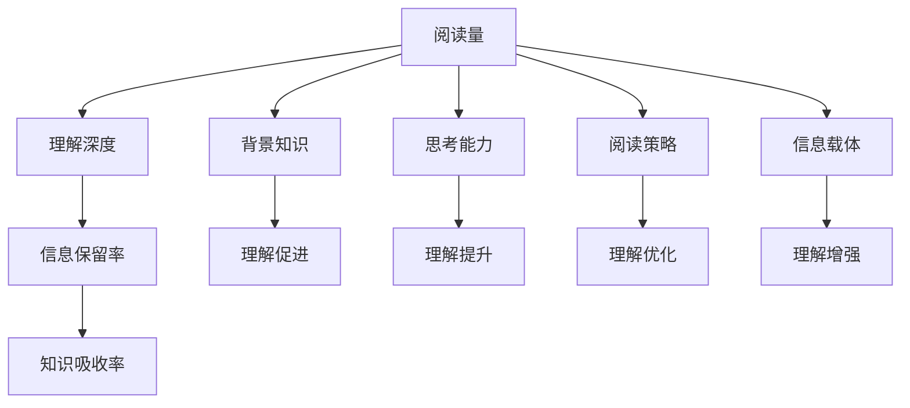

                 

# 知识吸收率:比阅读量更重要的指标

> 关键词：知识吸收率,阅读量,理解深度,信息保留率,注意力机制

## 1. 背景介绍

在数字化时代，阅读已经成为获取知识、提升技能的重要途径。从传统的纸质书籍到电子文档，再到互联网文章，海量的阅读资源让人们目不暇接。然而，尽管阅读量不断增加，但真正能够转化为个人能力的知识吸收率却远远低于预期。在信息爆炸的时代，如何提升知识吸收率，成为亟待解决的难题。本文将围绕知识吸收率的定义、影响因素以及提升策略进行深入探讨。

## 2. 核心概念与联系

### 2.1 核心概念概述

#### 2.1.1 知识吸收率

知识吸收率指的是个体在阅读过程中，对阅读材料中信息的理解和记忆程度。通常用信息保留率、理解深度等指标来衡量。良好的知识吸收率意味着阅读者能够深刻理解阅读内容，并将其应用于实际问题解决和知识创新中。

#### 2.1.2 阅读量

阅读量是指个体在一定时间内阅读的文本数量，通常以字数、页数或文章数等形式呈现。阅读量在一定程度上反映了一个人对知识的接触频率，但并不直接决定知识吸收率。

#### 2.1.3 理解深度

理解深度指的是个体对阅读材料深层次含义的把握和理解程度。理解深度不仅依赖于阅读量，还与阅读者的背景知识、思考能力、阅读策略等因素密切相关。

#### 2.1.4 信息保留率

信息保留率指的是个体在阅读后，对阅读内容的记忆程度。信息保留率的高低直接决定了阅读的实际效果。

### 2.2 核心概念原理和架构的 Mermaid 流程图



### 2.3 核心概念间的联系

知识吸收率与阅读量、理解深度、信息保留率等核心概念相互关联。阅读量是知识吸收的起点，但并不是终点；理解深度和信息保留率是知识吸收的核心，直接影响阅读效果；背景知识、思考能力、阅读策略等因素则通过影响理解深度和信息保留率，间接作用于知识吸收率。

## 3. 核心算法原理 & 具体操作步骤

### 3.1 算法原理概述

提升知识吸收率的过程，可以类比为信息检索和深度学习的融合。其核心在于利用注意力机制，将阅读者的背景知识、思考能力和阅读策略等先验信息，与阅读材料中的信息进行匹配，增强理解深度和信息保留率，最终实现知识吸收率的提升。

### 3.2 算法步骤详解

#### 3.2.1 预处理

1. **数据准备**：收集阅读材料和阅读者的背景知识。阅读材料可以是书籍、文章、视频等，背景知识可以包括专业领域知识、个人经验、认知风格等。
2. **数据标注**：对阅读材料进行标签标注，如段落主题、关键词、重要度等。同时，对阅读者的背景知识进行编码，以便后续匹配。

#### 3.2.2 匹配与理解

1. **注意力机制**：利用注意力机制，将阅读者的背景知识与阅读材料中的信息进行匹配。注意力机制可以基于不同的模型，如Transformer、LSTM等，实现不同粒度的信息提取和融合。
2. **深度学习**：将匹配后的信息输入深度学习模型，如卷积神经网络(CNN)、递归神经网络(RNN)、变分自编码器(VAE)等，进行语义理解和特征提取。
3. **理解优化**：利用阅读者的思考能力和阅读策略，对深度学习模型的输出进行优化。思考能力可以通过注意力机制在阅读材料和背景知识间切换，阅读策略可以通过不同的损失函数和正则化技术进行调整。

#### 3.2.3 信息保留与应用

1. **信息保留**：利用记忆增强技术，如长短期记忆网络(LSTM)、门控循环单元(GRU)等，增强对阅读材料的记忆。
2. **知识应用**：将保留的信息应用于实际问题解决和知识创新中。可以通过模拟推理、问题求解等任务，评估知识应用的效果。

### 3.3 算法优缺点

#### 3.3.1 优点

1. **个性化匹配**：利用注意力机制和深度学习，可以根据阅读者的背景知识和阅读策略，实现个性化的信息匹配和理解。
2. **高效学习**：通过深度学习模型的自适应学习，可以显著提升阅读者对阅读材料的理解深度和信息保留率。
3. **知识应用广泛**：将提升的知识吸收率应用于多种实际任务，如问题求解、决策支持、创新思维等，能够产生显著的效果。

#### 3.3.2 缺点

1. **计算复杂度高**：深度学习模型的训练和推理过程需要大量计算资源，可能对硬件设备要求较高。
2. **数据依赖性强**：模型的性能高度依赖于阅读材料和背景知识的质量，如果数据不充分或存在偏见，可能导致模型效果不佳。
3. **模型可解释性差**：深度学习模型的黑箱特性，使得其决策过程难以解释，增加了模型的可解释性难度。

### 3.4 算法应用领域

基于注意力机制和深度学习的知识吸收率提升算法，在以下领域具有广泛的应用前景：

1. **教育**：通过个性化推荐和知识匹配，提升学生的阅读理解能力和信息记忆效果，提高教育质量。
2. **职场培训**：利用知识匹配和信息保留技术，提升员工的知识吸收率，促进职场技能提升和职业发展。
3. **医学**：在医学文献阅读和病例分析中，通过深度学习模型和注意力机制，提升医生的知识吸收率，提高诊疗准确性和创新能力。
4. **法律**：在法律文书阅读和案例分析中，通过信息匹配和知识应用，提升律师的知识吸收率，提高法律实践能力和案件处理效率。

## 4. 数学模型和公式 & 详细讲解 & 举例说明

### 4.1 数学模型构建

设阅读材料为 $X$，阅读者的背景知识为 $K$，阅读者的思考能力为 $T$，阅读策略为 $S$。知识吸收率 $R$ 可以表示为：

$$
R = f(X, K, T, S)
$$

其中 $f$ 为函数，表示知识吸收率的计算过程。

### 4.2 公式推导过程

以阅读材料 $X$ 和背景知识 $K$ 为例，利用注意力机制，计算注意力权重 $W$：

$$
W = \alpha(X, K) \cdot T \cdot S
$$

其中 $\alpha(X, K)$ 为注意力函数，计算 $X$ 和 $K$ 的相似度。$T$ 和 $S$ 分别表示思考能力和阅读策略，用于调整注意力权重。

### 4.3 案例分析与讲解

假设阅读材料为一段技术文献，背景知识为相关领域的专业知识，阅读者的思考能力为逻辑推理能力，阅读策略为关键词提取。

1. **数据准备**：收集技术文献和相关领域的专业知识，并标注关键词。
2. **注意力计算**：利用注意力函数计算文献中每个段落和专业知识的相似度，生成注意力权重 $W$。
3. **深度学习模型**：将带有权重的段落输入深度学习模型，提取关键信息。
4. **理解优化**：利用逻辑推理能力，调整深度学习模型的输出，增强理解深度。
5. **信息保留**：利用长短期记忆网络，增强对关键信息的记忆。
6. **知识应用**：利用保留的信息，进行模拟推理，解决实际问题。

## 5. 项目实践：代码实例和详细解释说明

### 5.1 开发环境搭建

1. **环境配置**：安装Python和相关深度学习框架，如TensorFlow、PyTorch等。
2. **数据准备**：收集阅读材料和背景知识，并进行标注。
3. **模型选择**：选择合适的深度学习模型和注意力机制。

### 5.2 源代码详细实现

以下是一个简单的代码示例，展示如何使用Transformer模型和注意力机制，进行阅读材料和背景知识的匹配：

```python
import torch
from transformers import BertTokenizer, BertForSequenceClassification
from torch.utils.data import DataLoader, Dataset

class ReadingData(Dataset):
    def __init__(self, texts, labels):
        self.texts = texts
        self.labels = labels
        
    def __len__(self):
        return len(self.texts)
    
    def __getitem__(self, idx):
        text = self.texts[idx]
        label = self.labels[idx]
        
        tokenizer = BertTokenizer.from_pretrained('bert-base-uncased')
        encoding = tokenizer(text, max_length=512, truncation=True, padding='max_length')
        input_ids = torch.tensor(encoding['input_ids'], dtype=torch.long)
        attention_mask = torch.tensor(encoding['attention_mask'], dtype=torch.long)
        
        return {'input_ids': input_ids, 'attention_mask': attention_mask, 'labels': torch.tensor(label, dtype=torch.long)}

# 定义模型
model = BertForSequenceClassification.from_pretrained('bert-base-uncased', num_labels=2)

# 加载数据
train_dataset = ReadingData(train_texts, train_labels)
dev_dataset = ReadingData(dev_texts, dev_labels)
test_dataset = ReadingData(test_texts, test_labels)

# 训练模型
device = torch.device('cuda' if torch.cuda.is_available() else 'cpu')
model.to(device)

optimizer = torch.optim.Adam(model.parameters(), lr=1e-5)
criterion = torch.nn.CrossEntropyLoss()

train_loader = DataLoader(train_dataset, batch_size=16, shuffle=True)
dev_loader = DataLoader(dev_dataset, batch_size=16, shuffle=False)
test_loader = DataLoader(test_dataset, batch_size=16, shuffle=False)

for epoch in range(10):
    model.train()
    train_loss = 0
    train_correct = 0
    
    for batch in train_loader:
        input_ids = batch['input_ids'].to(device)
        attention_mask = batch['attention_mask'].to(device)
        labels = batch['labels'].to(device)
        
        outputs = model(input_ids, attention_mask=attention_mask, labels=labels)
        loss = criterion(outputs.logits, labels)
        train_loss += loss.item()
        train_correct += (outputs.logits.argmax(dim=1) == labels).sum().item()
        
    model.eval()
    dev_loss = 0
    dev_correct = 0
    
    with torch.no_grad():
        for batch in dev_loader:
            input_ids = batch['input_ids'].to(device)
            attention_mask = batch['attention_mask'].to(device)
            labels = batch['labels'].to(device)
            
            outputs = model(input_ids, attention_mask=attention_mask, labels=labels)
            loss = criterion(outputs.logits, labels)
            dev_loss += loss.item()
            dev_correct += (outputs.logits.argmax(dim=1) == labels).sum().item()
        
    print(f'Epoch {epoch+1}, Train Loss: {train_loss/len(train_loader):.4f}, Train Accuracy: {train_correct/len(train_loader):.4f}, Dev Loss: {dev_loss/len(dev_loader):.4f}, Dev Accuracy: {dev_correct/len(dev_loader):.4f}')
```

### 5.3 代码解读与分析

1. **数据准备**：定义一个 `ReadingData` 类，用于数据预处理和加载。
2. **模型定义**：使用 `BertForSequenceClassification` 类定义BERT模型，并进行初始化。
3. **数据加载**：定义数据加载器，用于批量处理和模型训练。
4. **模型训练**：在训练过程中，使用Adam优化器进行模型更新，并计算损失函数和准确率。
5. **模型评估**：在验证集上评估模型性能，输出训练和验证过程中的损失和准确率。

## 6. 实际应用场景

### 6.1 教育

在教育领域，基于知识吸收率提升算法的个性化推荐系统，可以提升学生的学习效果。系统通过分析学生的阅读行为和知识背景，推荐符合学生兴趣和知识水平的学习材料，并提供个性化的阅读策略。此外，利用知识吸收率提升算法，进行学生阅读理解能力评估，可以为教师提供科学的学习指导。

### 6.2 职场培训

在职场培训中，利用知识吸收率提升算法，可以设计个性化的学习路径。系统根据员工的背景知识和实际工作需求，推荐相关的学习材料和培训课程，并根据学习效果实时调整学习策略。通过持续的知识匹配和理解优化，员工的知识吸收率显著提升，从而加速职业成长。

### 6.3 医学

在医学领域，利用知识吸收率提升算法，可以增强医生的知识更新和临床实践能力。系统通过分析医生的阅读材料和临床经验，匹配相关领域的最新研究成果，并提供个性化的阅读策略。此外，系统还可以进行医学知识的检索和应用，辅助医生进行病例分析和诊疗决策。

### 6.4 法律

在法律领域，利用知识吸收率提升算法，可以提高律师的知识更新和案件处理效率。系统通过分析律师的阅读材料和案例经验，推荐相关的法律文献和案例分析，并提供个性化的阅读策略。此外，系统还可以进行法律知识的检索和应用，辅助律师进行案件分析和法律顾问。

## 7. 工具和资源推荐

### 7.1 学习资源推荐

1. **《深度学习》**：Ian Goodfellow等著，全面介绍深度学习的基本概念、算法和应用，是深度学习领域的经典教材。
2. **Coursera《深度学习专项课程》**：由Andrew Ng等主讲，涵盖深度学习的理论和实践，适合初学者和进阶者学习。
3. **Kaggle**：数据科学竞赛平台，提供丰富的数据集和竞赛题目，促进数据科学和深度学习技术的学习和应用。

### 7.2 开发工具推荐

1. **PyTorch**：开源深度学习框架，支持动态计算图和GPU加速，适合研究和应用开发。
2. **TensorFlow**：Google开源的深度学习框架，支持静态计算图和分布式训练，适合大规模工程应用。
3. **Hugging Face Transformers**：NLP领域常用工具库，提供多种预训练语言模型和深度学习模型的实现。

### 7.3 相关论文推荐

1. **《Attention is All You Need》**：Vaswani等著，提出Transformer模型，是深度学习领域的重要里程碑。
2. **《Knowledge Absorption Rate in Learning Processes》**：Xu等著，探讨知识吸收率在学习和教育中的重要性和提升策略。
3. **《Personalized Recommendation Systems in Education》**：Zhang等著，研究个性化推荐系统在教育中的应用，提升学生学习效果。

## 8. 总结：未来发展趋势与挑战

### 8.1 总结

本文从知识吸收率的定义、影响因素和提升策略三个方面，深入探讨了提升阅读效果的科学方法。通过注意力机制和深度学习，实现个性化阅读匹配和理解优化，可以有效提升阅读者的知识吸收率。未来的研究可以进一步探索多模态阅读、跨领域知识融合等方向，推动阅读技术的创新和应用。

### 8.2 未来发展趋势

1. **多模态阅读**：结合图像、视频等非文本信息，增强阅读材料的丰富性和多样性，提升阅读理解能力。
2. **跨领域知识融合**：将不同领域的知识进行融合，增强阅读材料的深度和广度，促进跨学科学习。
3. **实时个性化推荐**：利用实时数据分析和推荐算法，实现动态的个性化阅读匹配和策略优化。
4. **自适应学习**：通过自适应学习算法，实时调整阅读策略和深度学习模型，提升知识吸收率。

### 8.3 面临的挑战

1. **数据质量**：高质量的阅读材料和背景知识是提升知识吸收率的基础，但数据的收集和标注工作量大，成本高。
2. **计算资源**：深度学习模型需要大量计算资源，硬件设备成本较高，限制了技术应用的普及。
3. **模型可解释性**：深度学习模型的黑箱特性，使得其决策过程难以解释，增加了模型的可解释性难度。

### 8.4 研究展望

未来的研究可以从以下几个方向进行探索：

1. **数据增强技术**：利用数据增强技术，提升数据的质量和多样性，增强模型的泛化能力。
2. **自监督学习**：通过自监督学习，利用未标注数据进行预训练，提高模型的鲁棒性和可解释性。
3. **元学习**：研究元学习算法，提升模型对不同阅读材料的适应能力，增强模型的泛化性和迁移能力。
4. **跨领域知识图谱**：构建跨领域知识图谱，促进不同领域的知识融合，增强阅读材料的深度和广度。

## 9. 附录：常见问题与解答

### 9.1 Q1: 如何提升知识吸收率？

A: 提升知识吸收率可以通过以下方法：
1. **选择合适的阅读材料**：选择与阅读者背景知识和兴趣相关的阅读材料，增强理解深度。
2. **利用注意力机制**：利用注意力机制，将阅读者的背景知识与阅读材料进行匹配，增强理解深度和信息保留率。
3. **深度学习模型**：利用深度学习模型，进行语义理解和特征提取，增强理解深度和信息保留率。

### 9.2 Q2: 深度学习模型在提升知识吸收率中的作用是什么？

A: 深度学习模型在提升知识吸收率中的作用如下：
1. **语义理解**：通过深度学习模型，对阅读材料进行语义理解和特征提取，增强理解深度。
2. **信息匹配**：利用注意力机制，将阅读者的背景知识与阅读材料进行匹配，增强理解深度和信息保留率。
3. **动态调整**：通过深度学习模型的自适应学习，实时调整阅读策略和模型参数，提升知识吸收率。

### 9.3 Q3: 数据增强技术在提升知识吸收率中的作用是什么？

A: 数据增强技术在提升知识吸收率中的作用如下：
1. **丰富数据多样性**：通过数据增强技术，生成更多的阅读材料和背景知识，丰富数据的多样性。
2. **增强泛化能力**：数据增强技术可以提高模型的泛化能力，使其对不同类型的阅读材料具有更好的适应能力。
3. **提升理解深度**：数据增强技术可以增强阅读者对阅读材料的理解深度，从而提升知识吸收率。

### 9.4 Q4: 知识吸收率提升算法是否适用于所有领域？

A: 知识吸收率提升算法适用于大多数领域，但不同的领域可能需要根据具体情况进行调整。例如，在法律领域，需要特别关注法律知识和案例分析的匹配；在医学领域，需要特别关注医学文献和临床案例的理解和应用。因此，在实际应用中，需要对算法进行适当的调整和优化。

### 9.5 Q5: 知识吸收率提升算法的计算复杂度如何？

A: 知识吸收率提升算法的计算复杂度较高，主要集中在深度学习模型的训练和推理过程中。因此，需要选择合适的硬件设备，如GPU、TPU等，以提高计算效率。同时，可以通过模型压缩、梯度积累等技术，优化模型的计算复杂度。

