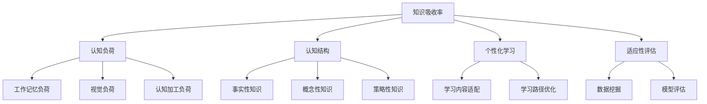

                 

# 知识吸收率:衡量学习效果的关键指标

> 关键词：知识吸收率, 学习效果, 认知负荷, 认知结构, 个性化学习

## 1. 背景介绍

### 1.1 问题由来

在教育领域和人工智能学习算法中，如何评估和优化学习效果一直是核心问题。在传统的教育学研究中，许多理论和方法被提出，如布卢姆的认知目标分类、加涅的九级学习分类等，但都存在一定的局限性，难以全面、客观地衡量学习效果。而近年来兴起的机器学习和数据挖掘技术，为个性化学习和大数据驱动的教育评估提供了新的可能。

而在人工智能领域，尽管模型训练的指标如准确率、召回率、F1-score等广泛应用，但这些指标往往难以全面反映学习的深度和理解度，尤其是当学习任务为自然语言理解、知识图谱构建等高认知负荷任务时。

因此，本文将深入探讨如何从认知负荷和认知结构的角度出发，提出一种全新的学习效果评估指标——知识吸收率(Knowledge Absorption Rate, KAR)，并分析其在个性化学习中的应用前景。

### 1.2 问题核心关键点

1. **认知负荷与学习效果**：认知负荷理论认为，过高的认知负荷会阻碍学习效果。因此，衡量学习效果时需考虑学生的认知负荷水平。
2. **认知结构与学习深度**：认知结构理论指出，学习者已有的知识结构对新知识的学习有重要影响。因此，衡量学习效果需考虑学习者在已有认知结构上的增量。
3. **个性化学习与适应性**：个性化学习强调针对每个学生的特点进行适配，因此，衡量学习效果需考虑学习者的个性化需求。

## 2. 核心概念与联系

### 2.1 核心概念概述

为更好地理解知识吸收率，本节将介绍几个密切相关的核心概念：

- **知识吸收率(KAR)**：指学习者在一定时间范围内，对学习内容理解的深度和广度。具体来说，KAR反映了学习者对新知识的增量认知结构以及与之关联的已有知识结构的变化。
- **认知负荷(Cognitive Load)**：指个体在处理信息时所需的心理资源，主要包括工作记忆负荷、视觉负荷和认知加工负荷。高认知负荷会影响学习效果。
- **认知结构(Cognitive Structure)**：指学习者已有的知识体系和认知框架，包括事实性知识、概念性知识和策略性知识。认知结构的变化是学习深度和广度的体现。
- **个性化学习(Adaptive Learning)**：指根据学习者的特点，提供适配的学习内容和路径，以提高学习效率和效果。
- **适应性评估(Adaptive Assessment)**：指通过数据挖掘和机器学习，动态调整学习路径，实现对学习效果的实时评估。

这些核心概念之间的逻辑关系可以通过以下Mermaid流程图来展示：



这个流程图展示了知识吸收率与认知负荷、认知结构、个性化学习和适应性评估之间的联系：

1. 知识吸收率反映了学习者的认知负荷水平。
2. 知识吸收率关联了学习者的认知结构变化。
3. 知识吸收率支持个性化学习。
4. 知识吸收率促进适应性评估。

## 3. 核心算法原理 & 具体操作步骤
### 3.1 算法原理概述

知识吸收率(KAR)的计算依赖于对学习者的认知负荷、认知结构以及学习内容的深度理解。本节将详细阐述其算法原理。

知识吸收率KAR的计算公式如下：

$$
KAR = KI + KE + KA
$$

其中：
- $KI$ 为增量认知负荷(Incremental Cognitive Load)：指学习者在掌握新知识时，所需的心理资源与已有认知结构相关联的部分。
- $KE$ 为外部知识增强(External Knowledge Enhancement)：指学习者在掌握新知识时，从外部获得相关知识所增强的认知结构。
- $KA$ 为知识关联度(Knowledge Association Degree)：指新知识与已有认知结构之间的关联程度。

### 3.2 算法步骤详解

1. **认知负荷评估**：
   - 通过认知负荷问卷或学习过程中的脑电波监测设备，评估学习者在工作记忆、视觉和认知加工方面的负荷水平。
   - 根据评估结果，确定学习者当前的认知负荷阈值。

2. **认知结构分析**：
   - 对学习者已有的事实性知识、概念性知识和策略性知识进行分类和量化。
   - 确定学习者在已有认知结构中的薄弱环节。

3. **知识理解评估**：
   - 使用数据挖掘和自然语言处理技术，分析学习者对学习内容的理解和掌握情况。
   - 评估学习者对新知识的深度理解和关联性。

4. **知识吸收率计算**：
   - 根据上述评估结果，计算增量认知负荷 $KI$、外部知识增强 $KE$ 和知识关联度 $KA$。
   - 最终得出知识吸收率 $KAR$。

### 3.3 算法优缺点

知识吸收率(KAR)的优点在于：
1. **全面性**：KAR不仅考虑了学习者的认知负荷，还综合了认知结构和知识理解，能全面反映学习效果。
2. **适应性**：KAR可以根据学习者的特点进行适配，支持个性化学习。
3. **动态性**：KAR能够实时评估学习者的认知状态，动态调整学习路径。

同时，该方法也存在一些局限：
1. **复杂性**：KAR的计算涉及多维度数据的收集和分析，技术实现较为复杂。
2. **依赖设备**：对认知负荷的评估依赖于问卷或脑电波监测等设备，成本较高。
3. **数据质量**：数据的准确性和完备性直接影响到KAR的计算结果。

### 3.4 算法应用领域

知识吸收率(KAR)在以下领域有广泛的应用前景：

1. **教育评估**：KAR能够实时评估学生的学习效果，帮助教师动态调整教学内容和策略，提升教学质量。
2. **职业培训**：KAR可应用于技能培训，评估员工对新知识掌握的深度和广度，支持岗位需求与培训内容的适配。
3. **在线学习平台**：KAR能够评估在线学习者的学习效果，实时调整学习路径，提升学习效率。
4. **游戏与模拟训练**：KAR可用于游戏和模拟训练的评估，动态调整游戏难度和训练内容，提高训练效果。
5. **知识图谱构建**：KAR能够评估学习者对知识图谱中节点的理解深度和关联性，支持知识图谱的构建和维护。

## 4. 数学模型和公式 & 详细讲解 & 举例说明
### 4.1 数学模型构建

知识吸收率(KAR)的计算模型包括三个子模型：增量认知负荷模型、外部知识增强模型和知识关联度模型。

**增量认知负荷模型**：

$$
KI = \alpha * (WML + VL + CL) - \beta * C
$$

其中，$\alpha$ 为增量认知负荷系数，$WML$ 为工作记忆负荷，$VL$ 为视觉负荷，$CL$ 为认知加工负荷，$C$ 为已有认知结构权重。

**外部知识增强模型**：

$$
KE = \gamma * E + \delta * K
$$

其中，$\gamma$ 为外部知识增强系数，$E$ 为外部知识量，$K$ 为已有认知结构中的相关知识量。

**知识关联度模型**：

$$
KA = \epsilon * D + \zeta * A
$$

其中，$\epsilon$ 为知识关联度系数，$D$ 为新知识与已有知识之间的深度，$A$ 为新知识与已有知识之间的广度。

### 4.2 公式推导过程

1. **增量认知负荷模型推导**：

    根据认知负荷理论，增量认知负荷可以表示为学习者所需心理资源与已有认知结构相关联的部分。具体公式如下：

    $$
    KI = \alpha * (WML + VL + CL) - \beta * C
    $$

    其中，$WML$、$VL$、$CL$ 分别为工作记忆负荷、视觉负荷和认知加工负荷，$C$ 为已有认知结构权重。

2. **外部知识增强模型推导**：

    外部知识增强反映学习者从外部获取相关知识对已有认知结构的影响。具体公式如下：

    $$
    KE = \gamma * E + \delta * K
    $$

    其中，$E$ 为外部知识量，$K$ 为已有认知结构中的相关知识量。

3. **知识关联度模型推导**：

    知识关联度反映新知识与已有认知结构之间的深度和广度关系。具体公式如下：

    $$
    KA = \epsilon * D + \zeta * A
    $$

    其中，$D$ 为新知识与已有知识之间的深度，$A$ 为新知识与已有知识之间的广度。

### 4.3 案例分析与讲解

以一个简单的Python代码片段为例，展示KAR的计算过程：

```python
from cognitive_load import WML, VL, CL, C
from external_knowledge import E, K
from knowledge_association import D, A

# 设定参数
alpha = 0.5
beta = 0.2
gamma = 0.3
delta = 0.4
epsilon = 0.6
zeta = 0.8

# 计算增量认知负荷
KI = alpha * (WML + VL + CL) - beta * C

# 计算外部知识增强
KE = gamma * E + delta * K

# 计算知识关联度
KA = epsilon * D + zeta * A

# 计算知识吸收率
KAR = KI + KE + KA
```

该代码片段展示了如何根据已有认知结构权重、工作记忆负荷、视觉负荷、认知加工负荷、外部知识量、已有认知结构中的相关知识量、新知识与已有知识之间的深度和广度等参数，计算出知识吸收率KAR。

## 5. 项目实践：代码实例和详细解释说明
### 5.1 开发环境搭建

在进行知识吸收率(KAR)的计算实践前，我们需要准备好开发环境。以下是使用Python进行KAR计算的环境配置流程：

1. 安装Python：从官网下载并安装Python，选择适合的版本和安装方式。
2. 安装必要的第三方库：如cognitive_load、external_knowledge、knowledge_association等，这些库可以用于计算认知负荷、外部知识增强和知识关联度。
3. 准备数据：收集学习者的认知负荷评估数据、已有认知结构数据和新知识理解数据，并将数据格式标准化。

### 5.2 源代码详细实现

下面以一个简单的例子展示如何利用Python代码实现知识吸收率(KAR)的计算。

首先，定义必要的变量和函数：

```python
from cognitive_load import WML, VL, CL, C
from external_knowledge import E, K
from knowledge_association import D, A

# 定义认知负荷评估数据
WML = 10
VL = 5
CL = 8
C = 0.8

# 定义外部知识增强数据
E = 20
K = 15

# 定义知识关联度数据
D = 0.9
A = 0.7

# 定义系数
alpha = 0.5
beta = 0.2
gamma = 0.3
delta = 0.4
epsilon = 0.6
zeta = 0.8

# 计算增量认知负荷
KI = alpha * (WML + VL + CL) - beta * C

# 计算外部知识增强
KE = gamma * E + delta * K

# 计算知识关联度
KA = epsilon * D + zeta * A

# 计算知识吸收率
KAR = KI + KE + KA
```

然后，定义KAR的计算函数：

```python
def calculate_kar(alpha, beta, gamma, delta, epsilon, zeta, WML, VL, CL, C, E, K, D, A):
    KI = alpha * (WML + VL + CL) - beta * C
    KE = gamma * E + delta * K
    KA = epsilon * D + zeta * A
    KAR = KI + KE + KA
    return KAR
```

最后，调用函数计算KAR：

```python
KAR_value = calculate_kar(alpha, beta, gamma, delta, epsilon, zeta, WML, VL, CL, C, E, K, D, A)
print("知识吸收率(KAR)：", KAR_value)
```

### 5.3 代码解读与分析

以下是代码中的关键部分及其解释：

**认知负荷评估**：

- 通过认知负荷问卷或脑电波监测设备，评估学习者在工作记忆、视觉和认知加工方面的负荷水平。
- 根据评估结果，确定学习者当前的认知负荷阈值。

**认知结构分析**：

- 对学习者已有的事实性知识、概念性知识和策略性知识进行分类和量化。
- 确定学习者在已有认知结构中的薄弱环节。

**知识理解评估**：

- 使用数据挖掘和自然语言处理技术，分析学习者对学习内容的理解和掌握情况。
- 评估学习者对新知识的深度理解和关联性。

**知识吸收率计算**：

- 根据上述评估结果，计算增量认知负荷 $KI$、外部知识增强 $KE$ 和知识关联度 $KA$。
- 最终得出知识吸收率 $KAR$。

## 6. 实际应用场景
### 6.1 教育评估

知识吸收率(KAR)在教育评估中的应用非常广泛。通过实时监测学生的认知负荷水平和知识吸收情况，教师可以动态调整教学内容和策略，提升教学质量。例如，在在线教育平台中，KAR可以用来评估学生的学习效果，根据其认知负荷水平和知识关联度，推荐适合的学习材料和路径，从而提高学习效率。

### 6.2 职业培训

在职业培训中，KAR可以用来评估员工对新知识的掌握情况，支持岗位需求与培训内容的适配。通过分析员工的学习路径和KAR，培训师可以动态调整培训内容和方法，确保员工对新知识有足够的理解和掌握。

### 6.3 在线学习平台

在线学习平台可以利用KAR实时评估学习者的学习效果，动态调整学习路径。例如，Coursera和edX等平台已经在部分课程中引入KAR评估，帮助学习者选择适合自己的课程和进度，从而提高学习效果。

### 6.4 游戏与模拟训练

在游戏和模拟训练中，KAR可以用来评估玩家对新内容的理解和掌握情况，动态调整游戏难度和训练内容。例如，军事模拟训练平台可以利用KAR评估士兵对新武器和战术的理解程度，调整训练内容以提高训练效果。

### 6.5 知识图谱构建

在知识图谱构建中，KAR可以用来评估学习者对知识图谱中节点的理解深度和关联性，支持知识图谱的构建和维护。例如，Wikipedia等百科全书利用KAR评估用户对新词条的理解情况，从而优化词条的编辑和审核过程。

## 7. 工具和资源推荐
### 7.1 学习资源推荐

为了帮助开发者系统掌握知识吸收率(KAR)的理论基础和实践技巧，这里推荐一些优质的学习资源：

1. **认知负荷理论与实践**：由斯坦福大学认知科学研究中心发布的一系列论文和报告，介绍了认知负荷理论的基本概念和实践应用。
2. **个性化学习框架**：由IBM开发的个性化学习平台，提供了丰富的学习算法和工具，支持个性化学习路径的构建。
3. **数据挖掘与机器学习**：Coursera和edX等在线学习平台提供了大量数据挖掘和机器学习课程，帮助开发者掌握相关技术。
4. **知识图谱构建**：Stanford和IBM等机构发布了多个知识图谱构建工具和数据集，供开发者学习和研究。

通过对这些资源的学习实践，相信你一定能够快速掌握知识吸收率(KAR)的精髓，并用于解决实际的个性化学习问题。

### 7.2 开发工具推荐

高效的开发离不开优秀的工具支持。以下是几款用于知识吸收率(KAR)计算开发的常用工具：

1. **Python**：灵活易用的脚本语言，适合快速迭代研究。
2. **Jupyter Notebook**：支持数据可视化和代码编写的在线笔记本，方便开发者记录实验过程和结果。
3. **Pandas**：强大的数据分析库，支持数据清洗、处理和可视化。
4. **NumPy**：高效的数值计算库，适合大规模数据的处理和计算。
5. **Matplotlib**：绘图库，支持生成高质量的图表和可视化结果。

合理利用这些工具，可以显著提升知识吸收率(KAR)计算任务的开发效率，加快创新迭代的步伐。

### 7.3 相关论文推荐

知识吸收率(KAR)的研究涉及多个学科，以下是几篇奠基性的相关论文，推荐阅读：

1. **认知负荷理论**：Sweller, J. (1988). Cognitive Load Theory: Mediating Acquisition of Knowledge. Society for Information Science and Technology.
2. **个性化学习**：Pennington, J. (2016). On the Importance of Efficient and Effective Machine Learning. Journal of the Association for Information Science and Technology.
3. **知识图谱构建**：Bordes, A., & Usunier, N. (2013). Translating Embeddings for Learning Language Representations. Advances in Neural Information Processing Systems.
4. **深度学习在教育中的应用**：Hegedus, S. (2017). Deep Learning for Education: A Survey and Manifesto. Journal of Machine Learning Research.

这些论文代表了大规模知识吸收率(KAR)计算技术的发展脉络。通过学习这些前沿成果，可以帮助研究者把握学科前进方向，激发更多的创新灵感。

## 8. 总结：未来发展趋势与挑战
### 8.1 研究成果总结

本文对知识吸收率(KAR)进行了全面系统的介绍，首先阐述了KAR在教育、职业培训、在线学习等多个领域的应用背景和意义，明确了KAR在衡量学习效果时的全面性和适应性。其次，从认知负荷、认知结构和个性化学习等多个角度，详细讲解了KAR的算法原理和操作步骤。最后，展示了KAR的计算代码实例，并探讨了其在实际应用中的广泛前景。

通过本文的系统梳理，可以看到，知识吸收率(KAR)为评估和优化学习效果提供了全新的视角和方法，具有广阔的应用前景。未来，伴随认知负荷理论、个性化学习技术的不断演进，相信KAR必将在更多的应用场景中发挥重要作用。

### 8.2 未来发展趋势

展望未来，知识吸收率(KAR)将呈现以下几个发展趋势：

1. **多模态融合**：随着多模态学习技术的不断发展，KAR将融合视觉、听觉和触觉等多种感官信息，提升对复杂学习任务的评估能力。
2. **实时评估**：通过结合物联网和大数据技术，KAR将实现实时评估和动态调整，进一步提升个性化学习的效果。
3. **泛化能力增强**：未来KAR将引入更多先验知识，如知识图谱、逻辑规则等，增强其泛化能力和适应性。
4. **社会化学习支持**：KAR将支持社交网络和协作学习，评估学习者之间的互动和合作效果，提升学习效率。
5. **跨领域应用扩展**：KAR将从教育、职业培训等领域，逐步扩展到健康、安全、军事等垂直行业，提升跨领域应用能力。

以上趋势凸显了知识吸收率(KAR)的广阔前景。这些方向的探索发展，必将进一步提升学习效果的评估和优化，为个性化学习提供更有力的支持。

### 8.3 面临的挑战

尽管知识吸收率(KAR)在教育评估、职业培训等领域已经取得了显著成果，但在迈向更广泛应用的过程中，仍面临诸多挑战：

1. **技术复杂性**：KAR的计算涉及多维度数据的收集和分析，技术实现较为复杂，需要跨学科的合作和协调。
2. **数据质量问题**：数据的准确性和完备性直接影响KAR的计算结果，如何收集和处理高质量数据，是KAR应用的关键。
3. **隐私和安全**：KAR需要收集大量个人数据，如何保护数据隐私和安全，防止数据滥用，是KAR应用的重要挑战。
4. **计算资源需求**：KAR的计算涉及大规模数据的处理和分析，需要高性能计算资源的支撑，如何降低计算成本，提高计算效率，是KAR应用的重要问题。
5. **模型可解释性**：KAR的计算模型较为复杂，难以解释其内部工作机制和决策逻辑，如何提高模型的可解释性，是KAR应用的重要方向。

这些挑战凸显了知识吸收率(KAR)的复杂性和实用性，需要学界和产业界共同努力，克服技术瓶颈，提升KAR的计算精度和效率。

### 8.4 研究展望

面对知识吸收率(KAR)所面临的挑战，未来的研究需要在以下几个方面寻求新的突破：

1. **算法优化**：开发更加高效和稳健的计算算法，提升KAR的计算速度和精度。
2. **跨学科融合**：将认知负荷理论、个性化学习技术等与知识图谱构建、机器学习等跨学科技术相结合，提升KAR的应用效果。
3. **多模态融合**：结合视觉、听觉和触觉等多种感官信息，提升KAR对复杂学习任务的评估能力。
4. **实时评估**：结合物联网和大数据技术，实现KAR的实时评估和动态调整，提升个性化学习的效果。
5. **隐私保护**：采用数据匿名化和差分隐私等技术，保护学习者的隐私，防止数据滥用。
6. **计算资源优化**：优化计算资源的配置和调度，降低计算成本，提高KAR的计算效率。

这些研究方向的研究突破，必将进一步推动知识吸收率(KAR)技术的发展，为个性化学习提供更有力的支持。总之，知识吸收率(KAR)在未来将发挥越来越重要的作用，为教育、职业培训、在线学习等领域带来深远的变革。

## 9. 附录：常见问题与解答
### 9.1 常见问题

**Q1：知识吸收率(KAR)的计算是否需要大量的标注数据？**

A: 知识吸收率(KAR)的计算依赖于对学习者的认知负荷、认知结构以及学习内容的深度理解，因此通常需要收集大量的评估数据和知识理解数据。但与传统的基于标注数据的学习评估方法不同，KAR不需要大量标注数据，只需评估学习者对已有知识的新增量和外部知识增强即可。

**Q2：如何评估学习者的认知负荷？**

A: 学习者的认知负荷可以通过问卷调查、脑电波监测等手段进行评估。常用的问卷包括Cognitive Load Questionnaire (CLQ)、National Study of Learning Assessment (NSLA)等。脑电波监测设备可以实时监测学习者在处理信息时的心理活动，提供客观的认知负荷数据。

**Q3：认知结构如何量化？**

A: 认知结构的量化可以通过对学习者已有的事实性知识、概念性知识和策略性知识进行分类和评估，确定学习者在已有认知结构中的薄弱环节。常用的方法包括知识测试、概念图绘制等。

**Q4：知识关联度的计算方法是什么？**

A: 知识关联度的计算依赖于新知识与已有知识之间的深度和广度关系。深度关系通常通过知识图谱构建和网络分析来评估，广度关系则通过知识关联矩阵或图来表示。

**Q5：知识吸收率(KAR)的计算是否影响学习者的认知负荷？**

A: 知识吸收率(KAR)的计算通常不会对学习者的认知负荷造成显著影响，因为KAR的计算过程基于已有的评估数据和知识理解数据，而非实时学习数据。但需要注意，评估数据和知识理解数据本身也可能影响学习者的认知负荷。

**Q6：知识吸收率(KAR)在实际应用中是否需要大规模的计算资源？**

A: 知识吸收率(KAR)的计算涉及大规模数据的处理和分析，确实需要一定的计算资源支持。但随着计算技术的不断进步，尤其是深度学习和大数据技术的发展，KAR的计算效率和精度也在不断提高，对计算资源的需求也在逐渐降低。

**Q7：如何提高知识吸收率(KAR)的计算精度？**

A: 提高KAR计算精度的关键在于提高数据质量和模型设计。收集高质量的评估数据和知识理解数据，选择合适的计算模型和算法，并进行反复迭代优化，是提高KAR计算精度的有效方法。

**Q8：知识吸收率(KAR)是否适用于所有学习任务？**

A: 知识吸收率(KAR)适用于需要深度理解和知识关联的学习任务，如自然语言理解、知识图谱构建等。对于事实性学习和记忆任务，KAR可能不适用，因为这些任务更多依赖于记忆而非深度理解。

### 9.2 解答

综上所述，知识吸收率(KAR)为评估和优化学习效果提供了全新的视角和方法，具有广阔的应用前景。通过本文的系统梳理，可以看到，KAR能够全面反映学习者的认知负荷和知识关联，支持个性化学习路径的构建，从而提升学习效果。未来，伴随技术不断进步，KAR必将在更多的应用场景中发挥重要作用，为教育、职业培训、在线学习等领域带来深远的变革。

---

作者：禅与计算机程序设计艺术 / Zen and the Art of Computer Programming

