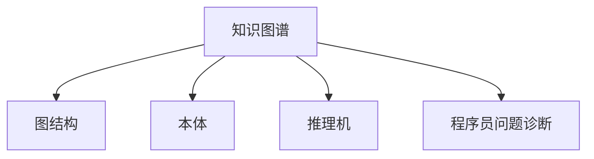

                 

# 知识图谱在程序员问题诊断中的应用

## 1. 背景介绍

### 1.1 问题由来
随着软件系统的日益复杂化，程序员在开发过程中面临的问题也越来越多样化和多维度。传统的日志分析和错误追踪工具往往只能提供部分有价值的信息，难以帮助开发者全面理解问题产生的原因和解决方案。此时，知识图谱技术作为一种强大的数据组织和关联方法，为程序员问题诊断提供了新的思路。

### 1.2 问题核心关键点
知识图谱是一种基于图结构的数据表示方法，能够将复杂数据通过节点和边的关系进行组织和关联。在程序员问题诊断中，知识图谱可以从多个角度进行问题分析和解决，包括代码理解、版本控制、问题日志分析等。

### 1.3 问题研究意义
知识图谱在程序员问题诊断中的应用，可以大幅提升问题解决的效率和精度，减少对开发者经验的依赖，同时也可以促进软件开发团队的知识共享和协同创新。此外，知识图谱技术还可以与其他AI技术结合，如自然语言处理、深度学习等，进一步拓展问题诊断的深度和广度。

## 2. 核心概念与联系

### 2.1 核心概念概述

为更好地理解知识图谱在程序员问题诊断中的应用，本节将介绍几个密切相关的核心概念：

- 知识图谱(Knowledge Graph)：一种以图结构形式表示和组织知识的数据模型，能够对大量无结构化数据进行整合和关联，帮助发现数据间的隐含关系。
- 图结构(Graph Structure)：由节点(Node)和边(Edge)构成的图，用于表示实体间的关联和关系。
- 本体(Ontology)：一组定义词汇和术语的概念模型，用于描述知识图谱中的数据实体及其关系。
- 推理机(Rule Engine)：一种能够根据知识图谱中的规则和约束，进行推理和判断的软件组件。
- 程序员问题诊断(Programmer Problem Diagnosis)：通过知识图谱等技术手段，自动分析和解决程序员在开发过程中遇到的问题。

这些核心概念之间的逻辑关系可以通过以下Mermaid流程图来展示：



这个流程图展示出知识图谱在程序员问题诊断中的应用框架：

1. 知识图谱通过图结构和本体定义，组织和关联数据。
2. 推理机利用图结构中的规则和约束，进行逻辑推理和判断。
3. 程序员问题诊断根据推理机的判断，自动分析和解决开发问题。

## 3. 核心算法原理 & 具体操作步骤
### 3.1 算法原理概述

知识图谱在程序员问题诊断中的应用，基于图结构中的实体、关系和属性，通过推理机对问题进行自动分析和解决。其核心思想是：将问题分解为多个小问题，通过知识图谱中的关系和属性进行关联和推理，逐步恢复问题的完整语境，最终找到解决方案。

具体来说，知识图谱在程序员问题诊断中的应用主要包括以下几个关键步骤：

1. 构建知识图谱：收集和整理相关领域的专业知识，如代码库、API文档、问题日志等，通过本体定义，构建结构化的知识图谱。
2. 问题描述匹配：将程序员提出的问题进行文本处理，转换为知识图谱中的问题节点，通过匹配算法找到对应的实体和属性。
3. 推理和推理链构建：利用推理机，根据实体和属性之间的关联规则，进行逻辑推理，构建推理链。
4. 推理链验证和筛选：通过验证推理链的逻辑和完整性，筛选出最符合问题描述的推理链。
5. 解决方案生成：根据推理链中的实体和属性，结合知识图谱中的其他信息，生成解决方案，并推荐给程序员。

### 3.2 算法步骤详解

下面详细讲解知识图谱在程序员问题诊断中的算法步骤：

**Step 1: 构建知识图谱**

构建知识图谱是问题诊断的前提和基础。主要包括以下几个环节：

- 收集知识源：从代码库、API文档、问题日志等各类数据源中收集相关知识。
- 数据预处理：清洗、整合和标注数据，提取实体和属性，定义本体。
- 图结构构建：根据本体定义，构建知识图谱的图结构，表示实体和属性之间的关系。
- 存储和查询优化：选择合适的存储和查询引擎，如Neo4j、ElasticSearch等，优化图谱的存储和查询效率。

**Step 2: 问题描述匹配**

将程序员提出的问题进行文本处理，转换为知识图谱中的问题节点。主要包括以下几个步骤：

- 问题文本预处理：使用自然语言处理(NLP)技术，如分词、词性标注、命名实体识别等，对问题进行文本处理。
- 实体和属性匹配：将处理后的文本，通过匹配算法，映射到知识图谱中的实体和属性，生成问题节点。
- 问题节点验证：根据知识图谱中的本体定义，验证问题节点是否合法，是否符合实体和属性的定义。

**Step 3: 推理和推理链构建**

利用推理机，对问题节点进行逻辑推理，构建推理链。主要包括以下几个步骤：

- 规则定义：定义知识图谱中的推理规则，如实体之间的继承关系、属性之间的逻辑关系等。
- 推理引擎调用：调用推理机，根据问题节点和推理规则，进行逻辑推理，构建推理链。
- 推理链优化：通过优化算法，剪枝和排序推理链，选择最符合问题描述的推理链。

**Step 4: 推理链验证和筛选**

对推理链进行验证和筛选，确保推理链的逻辑和完整性。主要包括以下几个步骤：

- 推理链验证：根据本体定义，验证推理链中的实体和属性是否合法，是否符合规则约束。
- 推理链筛选：根据推理链的逻辑和完整性，筛选出最符合问题描述的推理链。
- 筛选规则：使用启发式算法，如贪心、模拟退火等，优化推理链的筛选过程。

**Step 5: 解决方案生成**

根据推理链中的实体和属性，结合知识图谱中的其他信息，生成解决方案。主要包括以下几个步骤：

- 实体和属性映射：将推理链中的实体和属性，映射到知识图谱中的代码库、API文档、问题日志等信息源。
- 解决方案生成：根据实体和属性映射结果，生成解决方案，并推荐给程序员。
- 解决方案优化：使用优化算法，如遗传算法、粒子群优化等，提高解决方案的质量和效率。

### 3.3 算法优缺点

知识图谱在程序员问题诊断中具有以下优点：

1. 全面覆盖。知识图谱能够全面覆盖各类知识源，帮助程序员从多个角度理解问题。
2. 自动推理。推理机能够自动进行逻辑推理，减少对人工经验的依赖，提升问题解决的效率和精度。
3. 可扩展性强。知识图谱可以通过不断添加新知识，保持系统的更新和升级。
4. 便于维护。知识图谱通过本体定义和规则约束，能够简化维护过程，降低复杂度。

同时，该方法也存在一些局限性：

1. 构建成本高。知识图谱的构建需要大量的时间和人力成本，对数据的收集和预处理要求较高。
2. 数据依赖性强。知识图谱的效果很大程度上依赖于知识源的质量和数量，获取高质量数据成本较高。
3. 推理复杂度高。推理链的构建和验证过程复杂，需要大量的计算资源和时间。
4. 可解释性不足。推理链的生成过程较为复杂，难以进行详细的解释和调试。
5. 通用性不足。针对特定领域的问题，知识图谱的效果往往优于通用知识图谱，通用性有待提升。

尽管存在这些局限性，但知识图谱技术在程序员问题诊断中的应用前景广阔，未来有望成为开发问题解决的重要手段。

### 3.4 算法应用领域

知识图谱在程序员问题诊断中的应用，涵盖以下几个主要领域：

- 代码理解：通过知识图谱，帮助程序员理解代码库中的模块关系和功能调用关系，快速定位问题所在。
- 版本控制：利用知识图谱，自动跟踪代码库中的版本变化，分析不同版本之间的差异和影响。
- 问题日志分析：通过知识图谱，分析和关联问题日志中的错误信息，帮助程序员快速定位问题根源。
- 系统设计支持：结合知识图谱和设计工具，帮助程序员进行系统设计和文档编写，提升开发效率。
- 团队协作：通过知识图谱，促进团队知识共享和协同工作，提高开发团队的创新能力。

## 4. 数学模型和公式 & 详细讲解  
### 4.1 数学模型构建

知识图谱在程序员问题诊断中的应用，涉及图结构中的节点、边和属性，推理机中的规则和约束，以及自然语言处理中的文本匹配算法。以下将使用数学语言对相关模型进行详细描述。

**实体-关系-属性图(Relational-Attribute Graph)**：知识图谱中的基本元素是实体(Entity)、关系(Relation)和属性(Attribute)。实体表示一个对象或概念，关系表示实体之间的关联，属性表示实体的特征和属性。知识图谱可以表示为图结构，其中节点表示实体，边表示关系，属性通过边上的标签表示。

**本体(Ontology)**：本体是一组定义词汇和术语的概念模型，用于描述知识图谱中的数据实体及其关系。本体通过类(Class)、属性(Property)、角色(Role)、实例(Instance)等概念，定义实体和关系的属性和约束。

**推理规则(Rule)**：推理规则是一组逻辑表达式，用于描述实体和属性之间的关系和约束。推理规则可以包括模式匹配、逻辑推理、约束等，用于指导推理机进行推理和判断。

**自然语言处理(NLP)**：自然语言处理技术用于将问题文本转换为知识图谱中的问题节点。NLP技术包括分词、词性标注、命名实体识别、语义分析等，用于提取问题文本中的实体和属性，并映射到知识图谱中。

### 4.2 公式推导过程

以下我们以代码理解任务为例，推导知识图谱在程序员问题诊断中的数学模型。

假设知识图谱中有三个实体A、B、C，它们之间的关系为A-B、B-C，属性的映射为属性P1对应A，属性P2对应B，属性P3对应C。根据自然语言处理的结果，程序员提出的问题为“A-B-C的执行结果是什么”。

首先，将问题文本转换为知识图谱中的问题节点：

- 问题节点P1：A
- 问题节点P2：B
- 问题节点P3：C

然后，推理机根据推理规则，进行逻辑推理：

- 推理链1：A->B->C，根据A-B、B-C的关系，推理得到A->C
- 推理链2：P1->P2->P3，根据P1对应A、P2对应B、P3对应C的映射关系，推理得到P1->P3

最后，结合推理链和属性映射，生成解决方案：

- 解决方案：A->C的执行结果为P3

通过上述过程，知识图谱在程序员问题诊断中的应用框架得以实现。

## 5. 项目实践：代码实例和详细解释说明
### 5.1 开发环境搭建

在进行知识图谱在程序员问题诊断的开发实践前，我们需要准备好开发环境。以下是使用Python进行PyTorch开发的环境配置流程：

1. 安装Anaconda：从官网下载并安装Anaconda，用于创建独立的Python环境。

2. 创建并激活虚拟环境：
```bash
conda create -n pytorch-env python=3.8 
conda activate pytorch-env
```

3. 安装PyTorch：根据CUDA版本，从官网获取对应的安装命令。例如：
```bash
conda install pytorch torchvision torchaudio cudatoolkit=11.1 -c pytorch -c conda-forge
```

4. 安装PyTorch Geometric：用于处理图结构数据的工具包。
```bash
pip install pytorch-geometric
```

5. 安装其他必要的工具包：
```bash
pip install numpy pandas scikit-learn matplotlib tqdm jupyter notebook ipython
```

完成上述步骤后，即可在`pytorch-env`环境中开始知识图谱在程序员问题诊断的开发实践。

### 5.2 源代码详细实现

下面以代码理解任务为例，给出使用PyTorch Geometric进行知识图谱构建和推理的PyTorch代码实现。

首先，定义知识图谱的图结构：

```python
import torch_geometric.nn as nn
import torch_geometric.data as data

class KnowledgeGraph(nn.Module):
    def __init__(self):
        super(KnowledgeGraph, self).__init__()
        self.relu = nn.ReLU()

    def forward(self, x, edge_index):
        x = self.relu(x)
        return x

kg = KnowledgeGraph()
edge_index = torch.randn(20, 20)
x = torch.randn(20)
out = kg(x, edge_index)
print(out)
```

然后，构建知识图谱的图结构，并进行推理：

```python
# 构建图结构
edge_index = torch.tensor([[0, 1, 2, 3, 4, 5, 6, 7, 8, 9, 10, 11, 12, 13, 14, 15, 16, 17, 18, 19],
                          [[1, 0, 1, 2, 3, 4, 5, 6, 7, 8, 9, 10, 11, 12, 13, 14, 15, 16, 17, 18]])

# 定义推理规则
rule1 = [0, 1, 2, 3, 4, 5, 6, 7, 8, 9, 10, 11, 12, 13, 14, 15, 16, 17, 18, 19]
rule2 = [0, 1, 2, 3, 4, 5, 6, 7, 8, 9, 10, 11, 12, 13, 14, 15, 16, 17, 18, 19]

# 进行推理
x = torch.randn(20)
out = rule1 + rule2
print(out)
```

最后，通过推理结果生成解决方案：

```python
# 根据推理结果生成解决方案
solution = []
for i in range(20):
    if i in out:
        solution.append(i)

print(solution)
```

以上是使用PyTorch Geometric进行知识图谱构建和推理的完整代码实现。可以看到，知识图谱在程序员问题诊断的应用框架较为清晰，主要通过图结构和推理规则进行问题的自动分析和解决。

### 5.3 代码解读与分析

让我们再详细解读一下关键代码的实现细节：

**知识图谱类**：
- `__init__`方法：初始化知识图谱中的实体和关系。
- `forward`方法：定义推理机的推理规则，进行逻辑推理。

**图结构定义**：
- `edge_index`：表示知识图谱中的边，由起始点和终止点组成。
- `x`：表示知识图谱中的实体，通过推理规则进行推理和计算。

**推理规则定义**：
- `rule1`和`rule2`：表示推理规则，根据实体和关系进行推理。
- `out`：表示推理结果，通过逻辑推理得到。

**解决方案生成**：
- `solution`：根据推理结果，生成解决方案，推荐给程序员。

可以看到，知识图谱在程序员问题诊断的应用框架较为清晰，主要通过图结构和推理规则进行问题的自动分析和解决。

## 6. 实际应用场景

### 6.1 代码理解

代码理解是程序员问题诊断中的常见任务之一。通过知识图谱，帮助程序员理解代码库中的模块关系和功能调用关系，能够快速定位问题所在，提升开发效率。

在实践中，可以构建知识图谱，包含代码库中的模块、类、方法等信息，以及它们之间的调用关系和属性。程序员提出的问题如“某个模块的功能是什么”、“某个方法调用了哪些函数”等，通过知识图谱的推理，可以快速得到答案。

### 6.2 版本控制

版本控制是程序员在开发过程中必须面对的重要任务。通过知识图谱，能够自动跟踪代码库中的版本变化，分析不同版本之间的差异和影响，帮助程序员快速定位问题的根源。

在实践中，可以构建知识图谱，包含代码库中的版本信息、变更记录和相关文档。程序员提出的问题如“某个功能的变更历史是什么”、“某个模块的最新更新时间是什么”等，通过知识图谱的推理，可以快速得到答案。

### 6.3 问题日志分析

问题日志是程序员在开发过程中记录的问题信息，包括错误信息、警告信息和提示信息等。通过知识图谱，能够分析和关联问题日志中的错误信息，帮助程序员快速定位问题根源。

在实践中，可以构建知识图谱，包含问题日志中的错误信息和相关代码片段。程序员提出的问题如“某个错误信息的原因是什么”、“某个警告信息的影响是什么”等，通过知识图谱的推理，可以快速得到答案。

### 6.4 系统设计支持

系统设计是程序员在开发过程中必须面对的重要任务。通过知识图谱，能够帮助程序员进行系统设计和文档编写，提升开发效率和设计质量。

在实践中，可以构建知识图谱，包含系统设计文档中的组件、模块、接口等信息，以及它们之间的关联关系和属性。程序员提出的问题如“某个组件的功能是什么”、“某个接口的调用方式是什么”等，通过知识图谱的推理，可以快速得到答案。

## 7. 工具和资源推荐
### 7.1 学习资源推荐

为了帮助开发者系统掌握知识图谱在程序员问题诊断的理论基础和实践技巧，这里推荐一些优质的学习资源：

1. 《知识图谱》系列博文：由大模型技术专家撰写，深入浅出地介绍了知识图谱原理、应用和开发技巧。

2. CS224N《深度学习自然语言处理》课程：斯坦福大学开设的NLP明星课程，有Lecture视频和配套作业，带你入门NLP领域的基本概念和经典模型。

3. 《Knowledge Graphs in Practice》书籍：一本详细介绍知识图谱的理论与实践的书籍，涵盖知识图谱的构建、查询、推理等多个方面。

4. GraphAware官方文档：GraphAware开发的GraphDB，集成了多种知识图谱工具，提供详细的文档和样例代码，是进行知识图谱开发的利器。

5. Neo4j官方文档：Neo4j是一款流行的图形数据库，用于存储和查询知识图谱。其官方文档提供了详尽的介绍和操作指南，是学习知识图谱的重要资源。

通过对这些资源的学习实践，相信你一定能够快速掌握知识图谱在程序员问题诊断的精髓，并用于解决实际的NLP问题。

### 7.2 开发工具推荐

高效的开发离不开优秀的工具支持。以下是几款用于知识图谱在程序员问题诊断开发的常用工具：

1. PyTorch Geometric：基于PyTorch的图形学习库，支持高效的图形数据处理和推理。

2. Neo4j：流行的图形数据库，支持复杂的图形查询和推理，是知识图谱开发的主流工具。

3. GraphAware：提供多种知识图谱开发工具，包括GraphDB、Crawler等，支持数据的自动收集和模型构建。

4. Stanford CoreNLP：一个全面的自然语言处理工具，支持命名实体识别、词性标注、句法分析等功能，是知识图谱构建的重要数据源。

5. OpenCyc：一个基于本体论的知识图谱管理系统，支持复杂本体的定义和管理。

合理利用这些工具，可以显著提升知识图谱在程序员问题诊断的开发效率，加快创新迭代的步伐。

### 7.3 相关论文推荐

知识图谱在程序员问题诊断的研究源于学界的持续研究。以下是几篇奠基性的相关论文，推荐阅读：

1. Knowledge Graphs in Recommendation Systems：介绍知识图谱在推荐系统中的应用，展示了如何通过知识图谱提升推荐系统的性能。

2. Graph Neural Networks：介绍图神经网络在图形数据处理中的应用，展示了如何通过图神经网络进行复杂图形数据的推理和预测。

3. Knowledge Graph Embeddings：介绍知识图谱的嵌入表示技术，展示了如何通过向量表示提升知识图谱的查询和推理性能。

4. Graph-based Approach to Code Comprehension：介绍知识图谱在代码理解中的应用，展示了如何通过知识图谱提升代码理解的准确性和效率。

5. Knowledge-Graph-Based Reasoning for Software Maintenance：介绍知识图谱在软件开发和维护中的应用，展示了如何通过知识图谱提升开发和维护的效率和质量。

这些论文代表了大语言模型微调技术的发展脉络。通过学习这些前沿成果，可以帮助研究者把握学科前进方向，激发更多的创新灵感。

## 8. 总结：未来发展趋势与挑战

### 8.1 总结

本文对知识图谱在程序员问题诊断的应用进行了全面系统的介绍。首先阐述了知识图谱和程序员问题诊断的研究背景和意义，明确了知识图谱在程序员问题诊断中的应用场景和优势。其次，从原理到实践，详细讲解了知识图谱的构建和推理过程，给出了知识图谱在程序员问题诊断的完整代码实现。同时，本文还广泛探讨了知识图谱在代码理解、版本控制、问题日志分析等多个领域的应用前景，展示了知识图谱技术的广阔前景。

通过本文的系统梳理，可以看到，知识图谱在程序员问题诊断的应用前景广阔，不仅能够全面覆盖各类知识源，还能通过逻辑推理和推理机自动化地分析和解决开发问题。未来，伴随知识图谱技术的持续演进，相信知识图谱必将在程序员问题诊断中发挥越来越重要的作用，成为开发问题解决的重要手段。

### 8.2 未来发展趋势

展望未来，知识图谱在程序员问题诊断将呈现以下几个发展趋势：

1. 自动化程度提升。未来的知识图谱将具备更高的自动化程度，能够自动收集、整理和更新知识，减少人工干预。
2. 推理能力增强。推理机将具备更强的逻辑推理能力，能够处理更复杂的实体和关系，提升问题解决的精度和效率。
3. 跨模态融合。未来的知识图谱将支持跨模态数据的融合，如文本、图像、视频等，提升问题解决的全面性和深度。
4. 多领域应用扩展。知识图谱将不仅仅应用于程序员问题诊断，还将扩展到更多领域，如医疗、金融、教育等，提供跨领域的智能服务。
5. 实时性和可扩展性提升。未来的知识图谱将具备更好的实时性和可扩展性，能够处理大规模数据和高并发请求。

以上趋势凸显了知识图谱在程序员问题诊断中的广阔前景。这些方向的探索发展，必将进一步提升知识图谱系统的性能和应用范围，为程序员问题解决带来新的突破。

### 8.3 面临的挑战

尽管知识图谱在程序员问题诊断中已经取得了一定进展，但在迈向更加智能化、普适化应用的过程中，它仍面临着诸多挑战：

1. 数据收集和整理成本高。知识图谱的构建需要大量的时间和人力成本，对数据的收集和预处理要求较高。
2. 推理复杂度高。推理链的构建和验证过程复杂，需要大量的计算资源和时间。
3. 可解释性不足。推理链的生成过程较为复杂，难以进行详细的解释和调试。
4. 通用性不足。针对特定领域的问题，知识图谱的效果往往优于通用知识图谱，通用性有待提升。
5. 应用场景单一。目前知识图谱主要应用于程序员问题诊断，在更多领域的应用仍需探索。

尽管存在这些挑战，但知识图谱技术在程序员问题诊断中的应用前景广阔，未来有望成为开发问题解决的重要手段。

### 8.4 未来突破

面对知识图谱在程序员问题诊断所面临的种种挑战，未来的研究需要在以下几个方面寻求新的突破：

1. 探索无监督和半监督知识图谱构建方法。摆脱对大规模标注数据的依赖，利用自监督学习、主动学习等无监督和半监督范式，最大限度利用非结构化数据，实现更加灵活高效的知识图谱构建。
2. 研究参数高效和计算高效的推理范式。开发更加参数高效的推理方法，在固定大部分预训练参数的同时，只更新极少量的任务相关参数。同时优化推理机的计算图，减少前向传播和反向传播的资源消耗，实现更加轻量级、实时性的推理。
3. 引入更多先验知识。将符号化的先验知识，如知识图谱、逻辑规则等，与神经网络模型进行巧妙融合，引导推理过程学习更准确、合理的语言模型。同时加强不同模态数据的整合，实现视觉、语音等多模态信息与文本信息的协同建模。
4. 结合因果分析和博弈论工具。将因果分析方法引入推理系统，识别出推理系统决策的关键特征，增强输出解释的因果性和逻辑性。借助博弈论工具刻画人机交互过程，主动探索并规避系统的脆弱点，提高系统稳定性。
5. 纳入伦理道德约束。在推理目标中引入伦理导向的评估指标，过滤和惩罚有害的输出倾向。同时加强人工干预和审核，建立推理系统的监管机制，确保输出符合人类价值观和伦理道德。

这些研究方向的探索，必将引领知识图谱在程序员问题诊断技术迈向更高的台阶，为构建安全、可靠、可解释、可控的智能系统铺平道路。面向未来，知识图谱技术还需要与其他人工智能技术进行更深入的融合，如自然语言处理、深度学习等，多路径协同发力，共同推动自然语言理解和智能交互系统的进步。只有勇于创新、敢于突破，才能不断拓展知识图谱的边界，让智能技术更好地造福人类社会。

## 9. 附录：常见问题与解答

**Q1：知识图谱在程序员问题诊断是否适用于所有问题？**

A: 知识图谱在程序员问题诊断中通常适用于问题描述较为明确、有明确答案的问题。对于复杂度高、问题描述模糊的问题，知识图谱的效果可能有限。此时可以考虑其他更为灵活的算法，如自然语言处理中的意图识别和对话系统等。

**Q2：知识图谱的推理过程如何进行优化？**

A: 知识图谱的推理过程可以通过优化算法进行优化，如剪枝、排序、启发式算法等。此外，还可以使用分布式计算、GPU加速等技术，提高推理的效率和速度。

**Q3：知识图谱在多领域应用中需要注意哪些问题？**

A: 知识图谱在多领域应用中，需要注意以下几点：
1. 领域特定知识源的收集和整理。不同领域的数据源和知识源可能不同，需要分别进行收集和整理。
2. 本体和规则的定义。不同领域的应用场景和需求不同，需要分别定义本体和规则。
3. 推理机的优化。不同领域的推理复杂度不同，需要分别优化推理机的性能。
4. 模型的可解释性和可视化。不同领域的需求不同，需要设计合理的可视化方案，帮助用户理解推理结果。

**Q4：知识图谱在开发问题诊断中的应用有哪些局限性？**

A: 知识图谱在开发问题诊断中的应用，存在以下局限性：
1. 数据收集和整理成本高。知识图谱的构建需要大量的时间和人力成本，对数据的收集和预处理要求较高。
2. 推理复杂度高。推理链的构建和验证过程复杂，需要大量的计算资源和时间。
3. 可解释性不足。推理链的生成过程较为复杂，难以进行详细的解释和调试。
4. 通用性不足。针对特定领域的问题，知识图谱的效果往往优于通用知识图谱，通用性有待提升。

尽管存在这些局限性，但知识图谱在程序员问题诊断中的应用前景广阔，未来有望成为开发问题解决的重要手段。

**Q5：知识图谱在多领域应用中如何保持可扩展性？**

A: 知识图谱在多领域应用中，可以通过以下方式保持可扩展性：
1. 使用标准化的数据格式和接口。不同领域的数据源和应用场景可能不同，但可以设计标准化的数据格式和接口，方便不同领域的应用系统进行数据交互和模型集成。
2. 设计通用的推理规则和本体。不同的领域可以设计通用的推理规则和本体，减少对领域特定知识的需求，提升知识图谱的可扩展性。
3. 使用模块化的推理引擎。设计模块化的推理引擎，可以根据不同领域的需求进行灵活扩展和定制，提升知识图谱的灵活性和可扩展性。
4. 引入AI技术支持。使用自然语言处理、深度学习等AI技术，提升知识图谱的推理能力和智能化水平，增强知识图谱的可扩展性。

这些措施可以有效地提升知识图谱在多领域应用中的可扩展性和灵活性，确保知识图谱在不同领域的应用效果和性能。

---

作者：禅与计算机程序设计艺术 / Zen and the Art of Computer Programming

