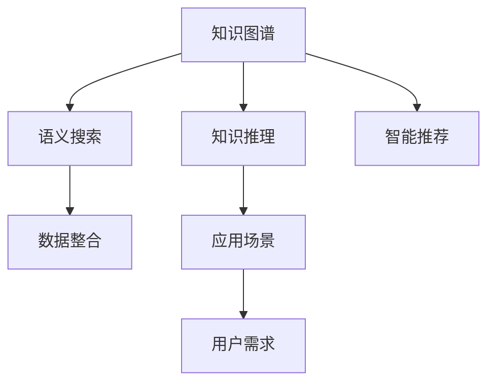

                 

# 知识图谱技术在个人知识管理中的应用

> 关键词：知识图谱, 个人知识管理, 语义搜索, 知识推理, 智能推荐, 数据整合, 应用案例

## 1. 背景介绍

随着信息技术的快速发展和知识的不断积累，个人面对的“知识鸿沟”越来越深。无论是日常生活中的琐事、工作中的专业技能，还是学习中的知识体系，个人的记忆和存储都显得力不从心。为了解决这一问题，个人知识管理应运而生，它通过数字化工具帮助用户系统地整理、检索和应用各类知识，有效提升学习和工作效率。但随着知识量的指数级增长，传统的知识管理方式已经无法满足需求。在这个背景下，知识图谱技术应运而生。

### 1.1 问题由来

知识图谱是一种以语义化结构化的方式描述和关联实体之间关系的技术。它能够自动化地从大量无结构化的文本数据中提取出有价值的信息，并以图形化的方式进行组织和呈现。知识图谱在智能推荐、信息检索、知识推理等领域取得了显著成果，这些技术也逐渐被引入到个人知识管理中，以解决知识管理中的诸多难题。

### 1.2 问题核心关键点

个人知识管理的主要难题包括：

- **知识积累效率低下**：面对海量的信息，个人难以有效积累和整理知识。
- **知识检索困难**：无结构化的文本数据，难以通过传统的关键词匹配方式进行快速定位。
- **知识推理能力不足**：缺乏对知识间关联关系的理解，难以进行深入的推理和应用。
- **个性化推荐缺失**：难以根据个人的兴趣和需求进行智能推荐，提升学习效率。
- **数据整合复杂**：多源异构数据集成难度大，难以构建完整的知识体系。

知识图谱技术通过将知识转化为结构化的语义图谱，为知识管理提供了全新的视角和解决方案，特别是在智能推荐、信息检索、知识推理等方面表现出强大的潜力。

## 2. 核心概念与联系

### 2.1 核心概念概述

为了更好地理解知识图谱技术在个人知识管理中的应用，本节将介绍几个关键概念：

- **知识图谱**：知识图谱是一种以图形化的方式描述和关联实体之间关系的语义网络。它通常由节点（实体）和边（关系）组成，通过对海量数据进行语义解析和抽取，构建出一个有机的知识体系。
- **语义搜索**：语义搜索是基于语义理解的查询方式，能够通过理解查询的语义，而非简单的关键词匹配，进行更精准的知识检索。
- **知识推理**：知识推理是通过对知识图谱中的关系进行逻辑推理，发现知识间的隐含联系，从而进行更深层次的知识理解和应用。
- **智能推荐**：智能推荐系统通过分析用户的行为数据和偏好，结合知识图谱中的信息，为用户推荐最相关的知识资源。
- **数据整合**：数据整合是将不同来源的数据进行集成和清洗，形成统一的知识体系的过程。

这些核心概念之间的逻辑关系可以通过以下Mermaid流程图来展示：



这个流程图展示了知识图谱技术在个人知识管理中的核心概念及其之间的联系：

1. 知识图谱是基础，通过语义解析和抽取，构建知识体系。
2. 语义搜索和知识推理利用知识图谱进行智能的检索和推理。
3. 智能推荐结合用户需求，提供个性化的知识服务。
4. 数据整合是将异构数据转化为知识图谱的预处理步骤。

这些概念共同构成了知识图谱在个人知识管理中的应用框架，使得知识管理更加高效、智能。

## 3. 核心算法原理 & 具体操作步骤

### 3.1 算法原理概述

知识图谱在个人知识管理中的应用，主要基于以下两个算法原理：

1. **知识抽取与融合**：从无结构化数据中提取实体和关系，构建知识图谱。
2. **语义搜索与推理**：通过知识图谱进行语义化的搜索和推理，为用户提供个性化的知识服务。

### 3.2 算法步骤详解

#### 3.2.1 知识抽取与融合

知识抽取的目的是从无结构化的文本数据中提取实体和关系，构建知识图谱。常用的知识抽取方法包括：

- **基于规则的方法**：通过定义一组规则，从文本中手动或自动地识别实体和关系。例如，利用正则表达式、自然语言处理技术进行实体识别。
- **基于统计的方法**：通过训练机器学习模型，自动学习实体和关系的识别规则。例如，使用关系抽取模型识别实体间的关系。
- **混合方法**：结合基于规则和基于统计的方法，利用规则提高效率，通过统计模型进行更准确的识别。

知识融合的目的是将多源异构数据整合到统一的语义图谱中，常用的融合方法包括：

- **冲突解决**：解决不同数据源中相同实体或关系之间的冲突，如通过优先级排序、投票机制等。
- **一致性校验**：校验数据的一致性，如时间戳、实体类型等，确保数据的质量。
- **实体链接**：通过跨数据源进行实体链接，构建完整的知识体系。

#### 3.2.2 语义搜索与推理

语义搜索的目的是基于用户查询的语义，从知识图谱中检索相关的实体和关系，常用的搜索方法包括：

- **基于规则的搜索**：通过定义一组搜索规则，从知识图谱中匹配用户查询。例如，利用正则表达式进行匹配。
- **基于机器学习的搜索**：通过训练模型，自动学习查询和结果之间的映射关系。例如，使用深度学习模型进行匹配。

知识推理的目的是通过知识图谱中的关系进行逻辑推理，发现知识间的隐含联系，常用的推理方法包括：

- **基于规则的推理**：通过定义一组推理规则，从知识图谱中自动推导新的事实。例如，利用IF-THEN规则进行推理。
- **基于深度学习的推理**：通过训练模型，自动学习复杂的推理关系。例如，使用图神经网络进行推理。

### 3.3 算法优缺点

知识图谱技术在个人知识管理中的应用，具有以下优点：

- **语义化检索**：基于语义理解的检索，能够提供更精准、更有用的结果。
- **知识推理能力**：能够发现知识间的隐含联系，提升知识的深度应用。
- **个性化推荐**：通过分析用户行为，提供个性化的知识推荐。

但同时也存在一些缺点：

- **构建难度大**：知识图谱的构建需要大量的人工干预和预处理，工作量较大。
- **数据质量要求高**：知识图谱依赖于数据的质量和完整性，如果数据有偏差，会影响结果的准确性。
- **计算复杂度高**：语义推理和推理计算复杂度较高，需要高效的算法和设备支持。

### 3.4 算法应用领域

知识图谱技术在个人知识管理中的应用，主要集中在以下几个领域：

- **学习管理**：通过构建学习知识图谱，提供个性化的学习资源推荐和路径规划，提升学习效率。
- **职业发展**：通过构建职业知识图谱，提供职业路径分析、技能提升建议，辅助职业规划。
- **健康管理**：通过构建健康知识图谱，提供个性化的健康管理方案和医疗咨询。
- **生活助手**：通过构建生活知识图谱，提供日常生活中的智能提醒、信息查询等服务。

这些应用领域充分展示了知识图谱在个人知识管理中的广泛价值和潜力。

## 4. 数学模型和公式 & 详细讲解 & 举例说明

### 4.1 数学模型构建

知识图谱的数学模型主要由两部分组成：

1. **实体-关系图**：以节点和边的形式表示实体和关系。节点表示实体，边表示实体之间的关系。
2. **节点属性图**：以节点形式表示实体的属性信息。

数学模型构建的关键在于如何将文本数据转换为知识图谱。常用的方法是基于规则或统计模型进行实体和关系的抽取，然后构建节点和边的关系图。

### 4.2 公式推导过程

以实体抽取为例，假设有一篇新闻文本，需要从中抽取人名实体。可以用正则表达式或NLP模型进行实体识别，得到人名实体列表。然后，通过规则或模型进行实体链接，将人名实体与已有的知识图谱中的实体进行匹配，构建实体-关系图。

### 4.3 案例分析与讲解

例如，一个常见的应用场景是构建一个健康知识图谱。首先，需要从医疗文献、百科全书等数据源中抽取实体和关系，构建健康知识图谱的节点和边。然后，通过语义搜索和推理，提供个性化的健康咨询和建议。

## 5. 项目实践：代码实例和详细解释说明

### 5.1 开发环境搭建

为了实现知识图谱在个人知识管理中的应用，需要搭建一个完整的开发环境。以下是主要的步骤：

1. 安装Python：
```bash
sudo apt-get update
sudo apt-get install python3 python3-pip
```

2. 安装必要的库：
```bash
pip install tqdm transformers py2neo rdflib
```

其中，`tqdm`用于进度条显示，`transformers`是用于处理文本数据和语义理解的库，`py2neo`是用于与Neo4j数据库交互的库，`rdflib`是用于处理RDF数据的库。

3. 安装Neo4j数据库：
```bash
sudo apt-get install neo4j
```

### 5.2 源代码详细实现

以下是一个简单的知识图谱构建和查询的Python代码实现，其中使用了`transformers`和`py2neo`库：

```python
from transformers import BertTokenizer, BertForTokenClassification
from py2neo import Graph
import rdflib
import tqdm

# 连接Neo4j数据库
graph = Graph("bolt://localhost:7474", auth=("neo4j", "password"))

# 定义实体和关系类型
entity_type = "Person"
relation_type = "WorksFor"

# 加载BERT模型和分词器
tokenizer = BertTokenizer.from_pretrained("bert-base-uncased")
model = BertForTokenClassification.from_pretrained("bert-base-uncased")

# 加载训练数据
train_data = load_train_data()

# 定义节点和边
for (text, label) in train_data:
    # 将文本分词
    tokens = tokenizer.encode(text, add_special_tokens=False)
    
    # 获取实体
    entity = graph.run(
        """
        MATCH (p:Person)
        WHERE p.name = 'Tom Hanks'
        RETURN p
        """
    ).data()[0]
    
    # 创建节点和边
    graph.run(
        """
        CREATE (n:Person {name: 'Tom Hanks'})
        MATCH (p:Person)
        WHERE p.name = 'Tom Hanks'
        MERGE (p)-[: WorksFor]-(o:Organization)
        SET o.name = 'Disney'
        """
    )

# 查询相关实体
graph.run(
    """
    MATCH (p:Person)-[:WorksFor]->(o:Organization)
    WHERE o.name = 'Disney'
    RETURN p.name
    """
)
```

### 5.3 代码解读与分析

这段代码实现了从文本数据中抽取实体，并将实体添加到Neo4j数据库中的节点和边。具体步骤如下：

1. 连接Neo4j数据库。
2. 定义实体和关系类型。
3. 加载BERT模型和分词器。
4. 加载训练数据。
5. 定义节点和边，包括实体的创建和边的链接。
6. 查询相关实体。

### 5.4 运行结果展示

运行上述代码后，可以在Neo4j数据库中看到构建的实体和边的关系图谱。

## 6. 实际应用场景

### 6.1 学习管理

知识图谱在个人学习管理中的应用，可以通过构建学习资源和路径的知识图谱，提供个性化的学习资源推荐和路径规划。例如，可以通过分析用户的学习数据，推荐与用户兴趣相关的课程和资料。

### 6.2 职业发展

知识图谱在职业发展中的应用，可以通过构建职业路径和技能图谱，提供职业规划建议和技能提升方案。例如，可以通过分析用户的职业数据，推荐相关的培训课程和职业发展路径。

### 6.3 健康管理

知识图谱在健康管理中的应用，可以通过构建健康知识图谱，提供个性化的健康咨询和建议。例如，可以通过分析用户的健康数据，推荐适合的健康计划和医疗咨询。

### 6.4 未来应用展望

随着知识图谱技术的不断成熟，其在个人知识管理中的应用将更加广泛和深入。未来的发展方向包括：

1. **多模态知识图谱**：将文本、图像、音频等多种数据源进行整合，构建更加全面和丰富的知识图谱。
2. **智能推荐系统**：结合知识图谱和用户行为数据，提供更加精准和个性化的推荐。
3. **知识推理与分析**：通过知识图谱进行更深入的知识推理和分析，发现知识间的隐含联系。
4. **实时更新与维护**：实现知识图谱的实时更新和维护，确保知识的时效性和准确性。

## 7. 工具和资源推荐

### 7.1 学习资源推荐

为了帮助开发者系统掌握知识图谱技术在个人知识管理中的应用，这里推荐一些优质的学习资源：

1. 《Graph Neural Networks: A Review of Methods and Applications》论文：该论文总结了图神经网络的最新进展和应用案例，对于理解知识图谱中的节点和关系非常有帮助。
2. 《Semantic Web and Knowledge Graphs》书籍：该书介绍了语义网和知识图谱的基本概念和技术，是入门知识图谱的必读之作。
3. 《Knowledge Graphs: An Introduction》文章：该文章介绍了知识图谱的基本原理和应用，适合初学者阅读。
4. 《Linked Data: Foundations of the Web of Data》书籍：该书介绍了Linked Data的基本概念和技术，是理解知识图谱和语义网的重要参考。
5. 《Knowledge Graphs for AI》课程：由斯坦福大学开设的在线课程，介绍了知识图谱在AI中的应用，适合进阶学习。

### 7.2 开发工具推荐

为了实现知识图谱在个人知识管理中的应用，以下是几款常用的开发工具：

1. **Py2neo**：用于与Neo4j数据库交互的Python库，支持节点和边的创建、查询等操作。
2. **TinkerPop**：一个通用的图形处理框架，支持多种图形数据库，提供了丰富的API和工具。
3. **RDF4J**：一个RDF处理库，支持RDF数据的创建、查询和转换。
4. **JaCoP**：一个基于Cyclopather的图形建模工具，用于构建和可视化知识图谱。
5. **Protege**：一个图形建模工具，支持构建和查询知识图谱，并提供可视化界面。

### 7.3 相关论文推荐

知识图谱技术的发展离不开学术界的持续研究。以下是几篇奠基性的相关论文，推荐阅读：

1. **“A Survey on Knowledge Graphs”**：总结了知识图谱的基本概念、构建方法和应用场景，适合入门学习。
2. **“Knowledge Graphs in Semantic Web”**：介绍了知识图谱在语义网中的应用，详细讨论了其构建和推理技术。
3. **“Link Prediction in Knowledge Graphs”**：介绍了知识图谱中的链接预测技术，是理解知识推理的基础。
4. **“Knowledge Graph Embeddings”**：介绍了知识图谱的嵌入表示方法，如TransE、RE等，是理解知识图谱嵌入技术的重要参考。
5. **“Knowledge Graph-Based Recommender Systems”**：介绍了知识图谱在推荐系统中的应用，包括模型设计和评估方法。

## 8. 总结：未来发展趋势与挑战

### 8.1 研究成果总结

本文对知识图谱技术在个人知识管理中的应用进行了全面的介绍，主要内容包括：

1. 知识图谱的基本概念和原理。
2. 知识图谱在语义搜索和推理中的应用。
3. 知识图谱在智能推荐系统中的应用。
4. 知识图谱在多模态数据融合中的应用。
5. 知识图谱在实时更新和维护中的应用。

通过本文的系统梳理，可以看到，知识图谱技术在个人知识管理中的应用前景广阔，能够显著提升知识的积累和应用效率。

### 8.2 未来发展趋势

展望未来，知识图谱技术在个人知识管理中的应用将呈现以下几个发展趋势：

1. **多模态知识图谱**：将文本、图像、音频等多种数据源进行整合，构建更加全面和丰富的知识图谱。
2. **智能推荐系统**：结合知识图谱和用户行为数据，提供更加精准和个性化的推荐。
3. **知识推理与分析**：通过知识图谱进行更深入的知识推理和分析，发现知识间的隐含联系。
4. **实时更新与维护**：实现知识图谱的实时更新和维护，确保知识的时效性和准确性。
5. **知识图谱可视化**：通过图形界面展示知识图谱，提供更加直观和易于理解的知识结构。

这些趋势展示了知识图谱技术在个人知识管理中的巨大潜力和发展方向。

### 8.3 面临的挑战

尽管知识图谱技术在个人知识管理中的应用前景广阔，但在迈向更加智能化、普适化应用的过程中，它仍面临着诸多挑战：

1. **数据质量和完整性**：知识图谱依赖于数据的质量和完整性，如果数据有偏差，会影响结果的准确性。
2. **计算复杂度**：语义推理和推理计算复杂度较高，需要高效的算法和设备支持。
3. **用户隐私保护**：在构建知识图谱时，需要保护用户隐私和数据安全，防止数据泄露。
4. **知识更新与维护**：知识图谱需要不断更新和维护，以保持其时效性和准确性。
5. **跨领域知识融合**：不同领域的知识图谱难以整合，需要设计统一的表示方法。

### 8.4 研究展望

面对知识图谱在个人知识管理应用中面临的挑战，未来的研究需要在以下几个方面寻求新的突破：

1. **跨领域知识融合**：设计统一的表示方法和接口，实现不同领域知识图谱的整合。
2. **知识图谱可视化**：通过图形界面展示知识图谱，提供更加直观和易于理解的知识结构。
3. **知识推理与分析**：通过知识图谱进行更深入的知识推理和分析，发现知识间的隐含联系。
4. **实时更新与维护**：实现知识图谱的实时更新和维护，确保知识的时效性和准确性。
5. **用户隐私保护**：设计隐私保护机制，保护用户隐私和数据安全。

这些研究方向将推动知识图谱技术在个人知识管理中的应用不断成熟，为构建更加智能、便捷的知识管理系统提供有力支持。

## 9. 附录：常见问题与解答

**Q1：知识图谱在个人知识管理中的应用主要有哪些？**

A: 知识图谱在个人知识管理中的应用主要包括：

1. **学习管理**：通过构建学习资源和路径的知识图谱，提供个性化的学习资源推荐和路径规划。
2. **职业发展**：通过构建职业路径和技能图谱，提供职业规划建议和技能提升方案。
3. **健康管理**：通过构建健康知识图谱，提供个性化的健康咨询和建议。
4. **生活助手**：通过构建生活知识图谱，提供日常生活中的智能提醒、信息查询等服务。

**Q2：知识图谱的构建主要有哪些方法？**

A: 知识图谱的构建主要包括以下方法：

1. **基于规则的方法**：通过定义一组规则，从文本中手动或自动地识别实体和关系。
2. **基于统计的方法**：通过训练机器学习模型，自动学习实体和关系的识别规则。
3. **混合方法**：结合基于规则和基于统计的方法，利用规则提高效率，通过统计模型进行更准确的识别。

**Q3：知识图谱在实时更新和维护中需要注意哪些问题？**

A: 知识图谱在实时更新和维护中需要注意以下问题：

1. **数据源的及时性**：确保数据源的及时更新，以反映最新的知识信息。
2. **冲突解决机制**：解决不同数据源中相同实体或关系之间的冲突，如通过优先级排序、投票机制等。
3. **数据质量控制**：校验数据的一致性，如时间戳、实体类型等，确保数据的质量。
4. **版本控制**：设计版本控制机制，确保知识图谱的迭代更新和回滚。

**Q4：知识图谱在语义搜索中的应用主要有哪些？**

A: 知识图谱在语义搜索中的应用主要包括：

1. **基于规则的搜索**：通过定义一组搜索规则，从知识图谱中匹配用户查询。
2. **基于机器学习的搜索**：通过训练模型，自动学习查询和结果之间的映射关系。

**Q5：知识图谱在智能推荐系统中的应用主要有哪些？**

A: 知识图谱在智能推荐系统中的应用主要包括：

1. **基于知识的推荐**：通过分析用户行为和知识图谱中的信息，提供个性化的知识资源推荐。
2. **基于关联的推荐**：通过分析实体之间的关联关系，提供相关实体的推荐。

---

作者：禅与计算机程序设计艺术 / Zen and the Art of Computer Programming

