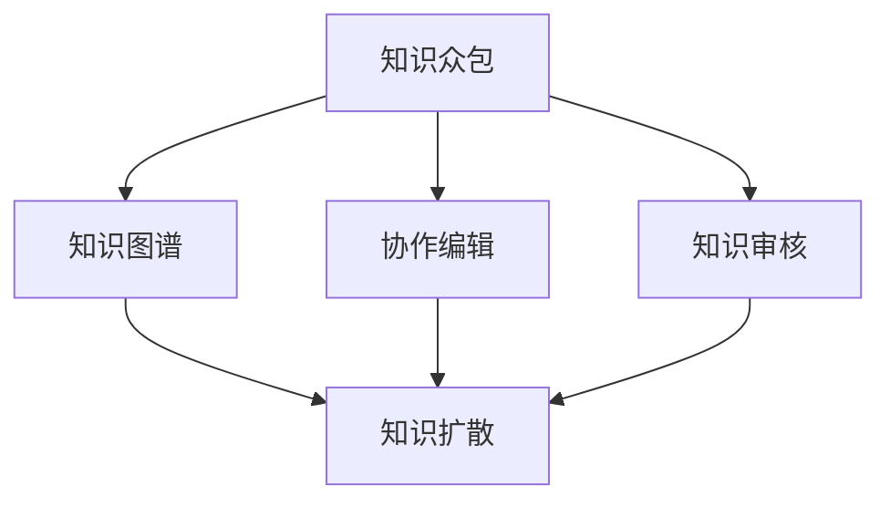

                 

# 知识的众包：群众智慧的汇聚与应用

## 1. 背景介绍

### 1.1 问题由来
在信息爆炸的今天，知识的积累和传播速度不断加快，人类社会对知识的需求也日益增长。然而，个体知识范围的局限性和时间精力的限制，使得单个人难以全面掌握某个领域的所有知识。而网络平台和众包平台的兴起，为汇聚和共享知识提供了新的可能性。通过将复杂的知识任务分解为更小、更可管理的部分，并利用众包机制，可让全球数以亿计的用户参与到知识的汇聚过程中，极大地扩展了知识的边界。

### 1.2 问题核心关键点
当前知识众包平台的典型代表包括知乎、维基百科、CrowdFlower等。它们通过在线社区、知识库、任务管理系统等形式，将专业知识生产、审核和传播过程公开化、协作化。这些平台让个体用户能以自由参与者的身份，发表意见、分享知识、纠正错误，共同构建和完善某个领域的知识图谱。

### 1.3 问题研究意义
研究知识的众包汇聚机制，对于知识管理的智能化、互联网社区的发展、学术知识的传播具有重要意义：

1. 促进知识共享：基于互联网的知识众包平台，打破时间和地域限制，使得全球用户都能方便地获取和分享知识，加速知识的传播和积累。
2. 提高知识质量：众包机制引入多轮审核和反馈，使得知识生产过程更加严谨和精确，减少错误信息的传播。
3. 提升协作效率：借助网络平台的通信和协作工具，知识汇聚过程中的沟通和合作变得高效便捷，加快了知识生产的进程。
4. 激发创新活力：互联网平台的开放性鼓励了多样化、多角度的思维碰撞，为学术创新和实际问题解决提供了新的思路和方法。

## 2. 核心概念与联系

### 2.1 核心概念概述

为了更好地理解知识的众包汇聚过程，本节将介绍几个关键概念：

- **知识众包(Knowledge Crowdsourcing)**：通过网络平台，将复杂的知识生产任务分解为多个子任务，发动大众用户参与，共同完成知识的汇聚过程。典型的例子包括维基百科、知乎等。
- **知识图谱(Knowledge Graph)**：将知识以节点和边的形式组织成图结构，用于表示实体之间的关系。知识图谱是知识管理的基础，也是众包平台的核心。
- **协作编辑(Collaborative Editing)**：多个用户共同编辑和维护知识库，通过版本控制、多轮审核等机制，确保知识库的准确性和完整性。
- **知识审核(Knowledge Verification)**：对知识库中的内容进行审核，识别并修正错误信息，保证知识质量。
- **知识扩散(Knowledge Diffusion)**：知识通过网络平台传播和分享，扩大知识覆盖范围，促进知识的社会化应用。

这些核心概念之间的联系可以通过以下Mermaid流程图来展示：



这个流程图展示了知识众包的基本流程及其与其他核心概念的联系：

1. 知识众包平台将复杂的知识生产任务分解成多个子任务。
2. 用户通过协作编辑，共同维护知识图谱。
3. 对知识图谱进行审核，保证其准确性。
4. 知识通过扩散机制，在用户间传播。

## 3. 核心算法原理 & 具体操作步骤

### 3.1 算法原理概述

知识的众包汇聚过程，本质上是一种基于协作的知识生产和审核机制。其核心思想是：将复杂知识任务分解为更小的子任务，发动用户群体参与完成，并通过多轮审核机制确保知识准确性。

形式化地，假设知识图谱为 $G=(V,E)$，其中 $V$ 为节点集合，$E$ 为边集合。用户 $u$ 通过协作编辑 $G_u$，添加新的节点和边，同时删除不准确的信息。审核机制 $H$ 对 $G_u$ 进行验证，识别错误并进行修正。最终的知识图谱为：

$$
G' = \bigcup_{u \in U} G_u
$$

其中 $U$ 为用户群体。

### 3.2 算法步骤详解

知识众包的具体操作步骤包括：

**Step 1: 任务分解**
- 根据知识图谱的不同模块和层次，将知识生产任务分解为多个子任务。例如，将某个领域的百科全书条目分为若干个词条，每个词条作为一个子任务。

**Step 2: 用户参与**
- 将子任务发布到众包平台上，吸引用户参与。用户可以通过输入、编辑、审核等方式参与到知识图谱的构建中。

**Step 3: 协作编辑**
- 用户使用平台提供的编辑工具，对知识图谱进行修改和完善。编辑过程中，可同时与其他用户协作，实现知识的聚合和补充。

**Step 4: 知识审核**
- 审核机制对编辑后的知识图谱进行多轮验证，识别并修正错误信息，保证知识图谱的准确性。审核过程可引入专家参与，确保审核的专业性。

**Step 5: 知识扩散**
- 将完成的知识图谱发布到网络平台，供其他用户访问和引用。通过平台内部的社交机制，促进知识在用户之间的传播和分享。

### 3.3 算法优缺点

知识众包汇聚方法具有以下优点：
1. 众包机制吸纳了全球用户的智慧，加速了知识的汇聚过程。
2. 多轮审核机制保证了知识图谱的准确性和完整性。
3. 协作编辑提高了知识生产的效率和多样性。
4. 扩散机制促进了知识的传播和应用，扩大了知识的社会影响力。

同时，该方法也存在一定的局限性：
1. 用户参与度依赖于平台设计。平台的用户体验和激励机制决定了用户的参与热情和质量。
2. 知识质量依赖于用户的专业水平。用户的专业性和审核机制的有效性，直接影响知识图谱的质量。
3. 知识图谱可能存在偏见。如果用户群体过于单一，知识图谱可能反映部分群体的观点，缺乏多样性。
4. 知识图谱的更新周期长。知识图谱的构建和维护需要大量的时间和精力投入。

尽管存在这些局限性，但就目前而言，基于众包的知识汇聚方法仍是获取高质量知识的重要途径。未来相关研究的重点在于如何进一步优化平台设计，提高用户参与度和知识质量，同时兼顾知识图谱的更新速度和多样性。

### 3.4 算法应用领域

知识众包汇聚技术已经在知识管理、科学合作、教育、公共决策等多个领域得到了广泛的应用，其典型应用场景包括：

- **维基百科(Wikipedia)**：世界上最大的在线百科全书，通过众包机制持续更新和完善。
- **知乎(Zhihu)**：专业问答社区，用户通过发布问题和答案，参与知识汇聚和讨论。
- **CrowdFlower**：提供多种数据标注和众包服务，帮助企业高效收集和审核数据。
- **Pandora's Box**：一个开源的协作编辑平台，支持用户在Wiki、维基百科的词条上进行编辑和审核。
- **Google Scholar**：学术论文搜索引擎，汇集了全球学术论文数据，通过众包机制完善引用和分类。

除了上述这些经典应用外，知识众包汇聚技术还在越来越多的领域被创新性地应用，如公共政策咨询、科普教育、开源软件开发等，为不同领域知识的社会化传播和应用提供了新的可能性。

## 4. 数学模型和公式 & 详细讲解 & 举例说明

### 4.1 数学模型构建

为了更好地量化知识的汇聚过程，我们需要构建一个数学模型来描述知识图谱的演化和优化。

假设知识图谱 $G=(V,E)$ 的节点数为 $n$，边数为 $m$。用户的编辑行为可以看作对节点和边的添加、删除或修改。设用户 $u$ 对节点 $v \in V$ 的编辑次数为 $e_{uv}$，对边 $(v,w) \in E$ 的编辑次数为 $e_{vw}$。

知识图谱的更新过程可以表示为：

$$
G_{t+1} = G_t + \sum_{u \in U} G_{u,t}
$$

其中 $G_{u,t}$ 表示用户 $u$ 在时间步 $t$ 的编辑操作，可以表示为：

$$
G_{u,t} = \sum_{v \in V} e_{uv}(v) + \sum_{(v,w) \in E} e_{vw}(v,w)
$$

### 4.2 公式推导过程

知识审核的过程通常需要引入专家或用户的多轮反馈，以确保知识图谱的准确性。我们可以引入一个审核矩阵 $H$，表示对知识图谱中的每一条边进行审核的结果，其中 $H_{vw} \in \{0,1\}$，表示 $(v,w)$ 这条边是否通过审核。

知识图谱的最终状态可以表示为：

$$
G' = G + \sum_{t=1}^T H_t G_{u,t}
$$

其中 $H_t$ 表示在第 $t$ 轮审核中，所有用户和专家的审核结果。

### 4.3 案例分析与讲解

以知乎为例，探讨知识的众包汇聚过程。

知乎是一个问答社区，用户可以发布问题并邀请其他用户回答。每个问题和回答都是一个知识节点，不同问题之间可能存在关联。用户通过编辑、评论、点赞等方式参与到知识的汇聚中。

知乎的众包汇聚过程可以表示为：
- 用户发布问题或回答，形成知识图谱的初始状态。
- 其他用户通过评论和点赞，表示对问题和回答的认可程度。
- 编辑机制允许用户对问题和回答进行修改和完善，通过协作实现知识的补充和更新。
- 审核机制通过专家和用户的多轮反馈，识别并修正错误信息，保证知识图谱的准确性。
- 知识通过扩散机制，在用户之间传播和分享，扩大了知识的覆盖范围。

## 5. 项目实践：代码实例和详细解释说明

### 5.1 开发环境搭建

在进行知识众包平台的开发之前，我们需要准备好开发环境。以下是使用Python进行Web开发的环境配置流程：

1. 安装Anaconda：从官网下载并安装Anaconda，用于创建独立的Python环境。

2. 创建并激活虚拟环境：
```bash
conda create -n crowdsourcing python=3.8 
conda activate crowdsourcing
```

3. 安装必要的Web框架：
```bash
pip install Flask
```

4. 安装前端框架：
```bash
pip install Flask-WTF
```

5. 安装数据库连接库：
```bash
pip install psycopg2-binary
```

6. 安装CrowdFlower平台的开源项目：
```bash
pip install Pandora's Box
```

完成上述步骤后，即可在`crowdsourcing-env`环境中开始知识众包平台的开发。

### 5.2 源代码详细实现

这里我们以CrowdFlower平台为例，给出一个简单的知识众包汇聚系统的代码实现。

首先，定义知识图谱的数据模型：

```python
from flask_sqlalchemy import SQLAlchemy

db = SQLAlchemy()

class GraphNode(db.Model):
    id = db.Column(db.Integer, primary_key=True)
    name = db.Column(db.String(100), unique=True)
    description = db.Column(db.Text)

class GraphEdge(db.Model):
    id = db.Column(db.Integer, primary_key=True)
    node_from_id = db.Column(db.Integer, db.ForeignKey('graph_node.id'))
    node_to_id = db.Column(db.Integer, db.ForeignKey('graph_node.id'))
```

然后，定义知识图谱的协作编辑和审核机制：

```python
from flask import request, jsonify

@app.route('/graph/<int:node_id>/edit', methods=['POST'])
def edit_node(node_id):
    name = request.form.get('name')
    description = request.form.get('description')
    
    node = GraphNode(name=name, description=description)
    db.session.add(node)
    db.session.commit()
    
    return jsonify({'message': 'Node added successfully'})

@app.route('/graph/<int:node_id>/delete', methods=['DELETE'])
def delete_node(node_id):
    node = GraphNode.query.get(node_id)
    db.session.delete(node)
    db.session.commit()
    
    return jsonify({'message': 'Node deleted successfully'})

@app.route('/graph/<int:node_id>/review', methods=['POST'])
def review_edge(node_id):
    from_id = request.form.get('from_id')
    to_id = request.form.get('to_id')
    
    edge = GraphEdge(node_from_id=from_id, node_to_id=to_id)
    db.session.add(edge)
    db.session.commit()
    
    return jsonify({'message': 'Edge added successfully'})

@app.route('/graph/<int:edge_id>/delete', methods=['DELETE'])
def delete_edge(edge_id):
    edge = GraphEdge.query.get(edge_id)
    db.session.delete(edge)
    db.session.commit()
    
    return jsonify({'message': 'Edge deleted successfully'})
```

最后，启动Web服务并测试：

```python
if __name__ == '__main__':
    app.run(debug=True)
```

### 5.3 代码解读与分析

这里我们详细解读一下关键代码的实现细节：

**GraphNode类**：
- `__init__`方法：初始化节点名称和描述。
- `add`方法：将新节点添加到数据库。
- `delete`方法：删除指定节点。

**GraphEdge类**：
- `__init__`方法：初始化边的起点和终点。
- `add`方法：将新边添加到数据库。
- `delete`方法：删除指定边。

**路由函数**：
- `/graph/<int:node_id>/edit`：处理节点的添加和编辑请求。
- `/graph/<int:node_id>/delete`：处理节点的删除请求。
- `/graph/<int:node_id>/review`：处理边的添加请求。
- `/graph/<int:edge_id>/delete`：处理边的删除请求。

代码中使用了Flask框架和SQLAlchemy数据库连接库，实现了简单的知识众包汇聚功能。开发者可以将这些代码作为基础，进一步扩展平台的功能，如用户认证、权限控制、数据导出等。

## 6. 实际应用场景

### 6.1 知识管理平台

知识管理平台通过众包机制，将复杂的知识任务分解为多个子任务，发动用户群体参与完成，形成集体的知识图谱。例如，维基百科就是一个典型的知识管理平台，用户可以自由地添加、修改和审核百科条目，构建了全球最广泛的知识库。

### 6.2 科学合作项目

科学合作项目中，研究人员常常需要收集和整合大量的文献数据。知识众包汇聚技术可以辅助研究人员，通过众包机制汇聚各领域的知识，形成统一的知识图谱。例如，Nature Research项目，通过众包机制，将全球科学家的研究成果整合到一个平台上，方便研究人员检索和引用。

### 6.3 教育资源平台

教育资源平台通过众包汇聚用户生成内容，形成高质量的教学资源。例如，Khan Academy和Coursera等在线教育平台，通过用户生成内容，汇聚全球教育资源，为学习者提供丰富的学习材料。

### 6.4 公共决策支持

公共决策支持系统中，政府机构需要快速获取和整合多领域的知识信息。知识众包汇聚技术可以辅助政府部门，通过众包机制汇聚社会各界的智慧，形成统一的决策支持知识库。例如，欧盟的Open Decision-making Platform，通过众包机制汇聚社会各界的意见，辅助决策过程。

### 6.5 企业知识图谱

企业知识图谱通过众包汇聚员工和合作伙伴的知识，形成企业的知识资产。例如，IBM的Watson平台，通过众包汇聚员工和客户的知识，形成知识图谱，支持企业决策和创新。

### 6.6 开源软件开发

开源软件开发平台通过众包汇聚全球开发者的代码贡献，形成开放的软件生态。例如，GitHub平台，通过众包汇聚全球开发者的代码，形成开放的软件库，支持软件开发和创新。

## 7. 工具和资源推荐

### 7.1 学习资源推荐

为了帮助开发者系统掌握知识众包汇聚的理论基础和实践技巧，这里推荐一些优质的学习资源：

1. 《众包设计模式》系列博文：由知识众包领域的专家撰写，深入浅出地介绍了众包的设计模式和最佳实践。

2. 《众包经济学》课程：斯坦福大学开设的众包经济学课程，讲解了众包平台的核心原理和商业模式。

3. 《众包研究》书籍：详细介绍了众包理论基础和实践案例，对知识众包汇聚技术的深入理解具有重要参考价值。

4. CrowdFlower官方文档：CrowdFlower平台的官方文档，提供了详尽的API接口和用户指南，是学习知识众包平台开发的必备资料。

5. Google Scholar论文库：收集了全球学术论文数据，通过众包机制完善引用和分类，是知识众包汇聚技术的重要数据来源。

通过对这些资源的学习实践，相信你一定能够快速掌握知识众包汇聚的精髓，并用于解决实际的NLP问题。

### 7.2 开发工具推荐

高效的开发离不开优秀的工具支持。以下是几款用于知识众包平台开发的常用工具：

1. Flask：基于Python的Web开发框架，灵活且易于使用，支持用户注册、权限控制等常见功能。

2. SQLAlchemy：用于数据库连接和操作，支持多种数据库，适用于Web应用的快速开发。

3. Pandora's Box：开源的协作编辑平台，支持用户对知识图谱进行编辑和审核，具有丰富的功能。

4. GitHub：全球最大的开源软件开发平台，支持代码的众包汇聚和版本控制，是知识众包汇聚技术的重要应用场景。

5. AWS：提供强大的云服务，支持大规模数据处理和存储，是构建知识众包平台的高效选择。

合理利用这些工具，可以显著提升知识众包汇聚任务的开发效率，加快创新迭代的步伐。

### 7.3 相关论文推荐

知识众包汇聚技术的发展源于学界的持续研究。以下是几篇奠基性的相关论文，推荐阅读：

1. The Wiki Weighs In: Identifying Knowledge-Based Edges in Wikipedia（维基百科中的知识边）：提出通过维基百科页面的内容和链接，识别出知识图谱中的知识边，对众包汇聚技术具有重要参考价值。

2. How Crowdsourcing Can Support Development of a Knowledge-Based Education System（众包如何支持知识型教育系统的发展）：探讨了众包汇聚技术在教育系统中的应用，对知识管理具有借鉴意义。

3. Crowdsourcing in Information Extraction: A Survey（信息抽取中的众包技术综述）：详细介绍了信息抽取领域中的众包技术，对知识众包汇聚技术的发展具有参考价值。

4. The Strengths and Weaknesses of Open Data in Government Decision-making（开放数据在政府决策中的优缺点）：讨论了众包汇聚技术在公共决策中的应用，对政府信息管理具有借鉴意义。

这些论文代表了大语言模型微调技术的发展脉络。通过学习这些前沿成果，可以帮助研究者把握学科前进方向，激发更多的创新灵感。

## 8. 总结：未来发展趋势与挑战

### 8.1 总结

本文对知识的众包汇聚机制进行了全面系统的介绍。首先阐述了知识众包汇聚的背景和意义，明确了众包机制在知识管理和知识传播中的独特价值。其次，从原理到实践，详细讲解了知识众包汇聚的数学模型和操作步骤，给出了知识众包平台开发的完整代码实例。同时，本文还广泛探讨了众包汇聚技术在知识管理、科学合作、教育、公共决策等多个领域的应用前景，展示了众包技术的广阔前景。最后，本文精选了众包技术的各类学习资源，力求为读者提供全方位的技术指引。

通过本文的系统梳理，可以看到，知识众包汇聚机制正在成为知识管理智能化、互联网社区协作化的重要工具，极大地扩展了知识生产的广度和深度。未来，伴随知识众包技术的不断演进，将会有更多应用场景被开发出来，进一步促进知识的汇聚和社会化传播。

### 8.2 未来发展趋势

展望未来，知识众包汇聚技术将呈现以下几个发展趋势：

1. 平台智能化。基于人工智能技术，平台将能更智能地识别和推荐任务，提高用户参与度和知识质量。
2. 知识图谱动态化。利用实时数据流和云计算技术，知识图谱将能动态更新和优化，保持最新的知识状态。
3. 跨领域协作。跨领域的知识汇聚将能提升知识图谱的普适性和应用范围，促进不同学科之间的交叉和融合。
4. 知识图谱标准化。制定统一的知识图谱标准，促进不同平台之间的互操作和知识共享。
5. 知识图谱隐私保护。保护用户隐私和数据安全，防止知识图谱被滥用。

以上趋势凸显了知识众包汇聚技术的广阔前景。这些方向的探索发展，必将进一步提升知识管理的智能化、互联网社区协作化的水平，为知识的汇聚和社会化传播带来新的可能性。

### 8.3 面临的挑战

尽管知识众包汇聚技术已经取得了瞩目成就，但在迈向更加智能化、协作化的过程中，它仍面临着诸多挑战：

1. 用户参与度依赖于平台设计。平台的用户体验和激励机制决定了用户的参与热情和质量。如何设计出更吸引用户的平台，是一个重要课题。
2. 知识质量依赖于用户的专业水平。用户的专业性和审核机制的有效性，直接影响知识图谱的质量。如何提高用户的专业水平，确保审核机制的有效性，是另一个关键问题。
3. 知识图谱可能存在偏见。如果用户群体过于单一，知识图谱可能反映部分群体的观点，缺乏多样性。如何扩大用户群体的多样性，是知识汇聚中的一个重要方向。
4. 知识图谱的更新周期长。知识图谱的构建和维护需要大量的时间和精力投入。如何提高知识图谱的更新效率，是知识众包汇聚技术的一个重要课题。
5. 知识图谱的隐私保护。保护用户隐私和数据安全，防止知识图谱被滥用，是一个亟待解决的问题。

尽管存在这些挑战，但未来相关研究的重点在于如何进一步优化平台设计，提高用户参与度和知识质量，同时兼顾知识图谱的更新速度和多样性。相信随着学界和产业界的共同努力，这些挑战终将一一被克服，知识众包汇聚技术必将在知识的汇聚和社会化传播中扮演越来越重要的角色。

### 8.4 研究展望

面对知识众包汇聚技术所面临的种种挑战，未来的研究需要在以下几个方面寻求新的突破：

1. 探索众包平台智能化技术。引入人工智能技术，使平台能够智能推荐任务、识别并纠正错误信息，提高知识汇聚的效率和质量。

2. 开发知识图谱动态更新机制。利用实时数据流和云计算技术，实现知识图谱的动态更新和优化，保持最新的知识状态。

3. 引入跨领域协作机制。通过跨学科的知识汇聚，促进不同学科之间的交叉和融合，提升知识图谱的普适性和应用范围。

4. 制定统一的知识图谱标准。制定统一的知识图谱标准，促进不同平台之间的互操作和知识共享，推动知识汇聚技术的标准化发展。

5. 加强知识图谱隐私保护。保护用户隐私和数据安全，防止知识图谱被滥用，增强知识汇聚的安全性。

这些研究方向的探索，必将引领知识众包汇聚技术迈向更高的台阶，为知识汇聚和社会化传播提供新的解决方案。面向未来，知识众包汇聚技术还需要与其他人工智能技术进行更深入的融合，如知识表示、因果推理、强化学习等，多路径协同发力，共同推动知识汇聚和社会化传播的进步。只有勇于创新、敢于突破，才能不断拓展知识汇聚的边界，让知识汇聚技术更好地造福人类社会。

## 9. 附录：常见问题与解答

**Q1：知识众包汇聚如何保证知识图谱的准确性和完整性？**

A: 知识众包汇聚过程中，通过多轮审核机制确保知识图谱的准确性和完整性。具体而言，知识图谱的编辑和审核过程可以表示为：
- 用户通过协作编辑，对知识图谱进行补充和完善。
- 审核机制对编辑后的知识图谱进行多轮验证，识别并修正错误信息。
- 专家参与审核，保证审核的专业性和公正性。

**Q2：知识众包汇聚技术在实际应用中面临哪些资源瓶颈？**

A: 知识众包汇聚技术的实际应用中，面临以下资源瓶颈：
- 用户参与度依赖于平台设计。平台的用户体验和激励机制决定了用户的参与热情和质量。
- 知识质量依赖于用户的专业水平。用户的专业性和审核机制的有效性，直接影响知识图谱的质量。
- 知识图谱可能存在偏见。如果用户群体过于单一，知识图谱可能反映部分群体的观点，缺乏多样性。
- 知识图谱的更新周期长。知识图谱的构建和维护需要大量的时间和精力投入。
- 知识图谱的隐私保护。保护用户隐私和数据安全，防止知识图谱被滥用，是一个亟待解决的问题。

**Q3：知识众包汇聚技术在未来有哪些可能的突破方向？**

A: 未来，知识众包汇聚技术可能的突破方向包括：
- 探索知识众包平台智能化技术。引入人工智能技术，使平台能够智能推荐任务、识别并纠正错误信息，提高知识汇聚的效率和质量。
- 开发知识图谱动态更新机制。利用实时数据流和云计算技术，实现知识图谱的动态更新和优化，保持最新的知识状态。
- 引入跨领域协作机制。通过跨学科的知识汇聚，促进不同学科之间的交叉和融合，提升知识图谱的普适性和应用范围。
- 制定统一的知识图谱标准。制定统一的知识图谱标准，促进不同平台之间的互操作和知识共享，推动知识汇聚技术的标准化发展。
- 加强知识图谱隐私保护。保护用户隐私和数据安全，防止知识图谱被滥用，增强知识汇聚的安全性。

这些突破方向将进一步推动知识众包汇聚技术的发展，促进知识的汇聚和社会化传播，为社会带来更大的价值。

---

作者：禅与计算机程序设计艺术 / Zen and the Art of Computer Programming

