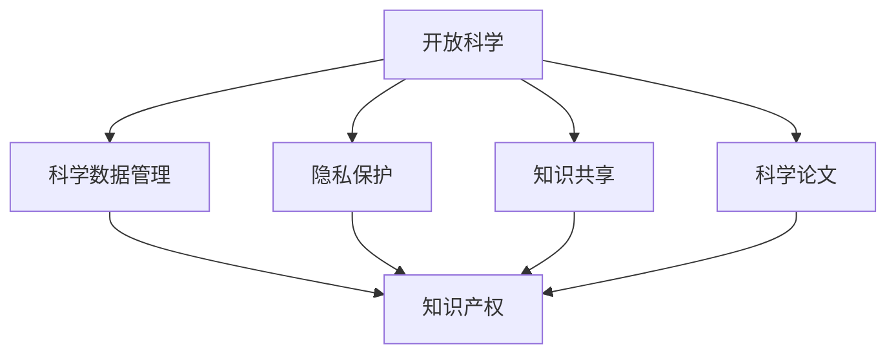

                 

# 知识的共享与保护：开放科学与知识产权

> 关键词：知识共享,知识产权,开放科学,科学数据管理,隐私保护

## 1. 背景介绍

### 1.1 问题由来
在过去的几十年中，知识的共享和保护一直是科技和社会领域的一个重要议题。尤其是随着互联网和数字技术的迅猛发展，知识的传播和利用变得前所未有的便捷，但也引发了知识产权和隐私保护等新的挑战。如何平衡知识共享和保护，在促进科技进步和社会发展的同时，保护创作者的权益，成为亟待解决的问题。

### 1.2 问题核心关键点
开放科学（Open Science）和知识产权保护是当前知识共享领域的两大关键点。开放科学旨在通过共享研究数据、代码和研究成果，加速科学研究的进步和技术的传播。而知识产权保护则是为了保护创作者的原创成果，防止其被不当使用或抄袭，保障其经济利益。两者看似矛盾，但实际上是相辅相成的，共同推动知识共享的可持续发展和科技创新。

## 2. 核心概念与联系

### 2.1 核心概念概述

为了更好地理解开放科学与知识产权之间的关系，本节将介绍几个核心概念：

- **开放科学**：指通过公开研究数据、代码和论文，促进知识的自由流动和交流，加速科学研究和技术创新的过程。其核心理念是透明度、协作性和可重复性。

- **知识产权**：指对创作者的原创成果（如发明、文学和艺术作品等）给予一定时间内的专有权，防止他人未经允许的使用或抄袭，保护创作者的合法权益。

- **科学数据管理**：指对科学实验和研究中产生的数据进行收集、存储、管理和共享的过程，确保数据的完整性、准确性和可靠性，促进科学研究的可重复性。

- **隐私保护**：指保护个人数据和隐私不被泄露和滥用的措施，特别是在数据共享和开放科学背景下，确保个人数据的隐私安全，防止未经授权的访问和使用。

这些核心概念之间的逻辑关系可以通过以下Mermaid流程图来展示：



这个流程图展示了一些关键概念及其之间的关系：

1. 开放科学依赖科学数据管理和隐私保护，以确保数据的可靠性和个人隐私。
2. 科学数据管理和隐私保护共同构成开放科学的基石，保障数据的可共享性。
3. 知识产权保护是开放科学中的重要一环，确保创作者的经济权益。
4. 知识共享和科学数据管理是开放科学的核心内容，促进知识自由流动。
5. 科学论文是开放科学的重要形式，确保研究成果的公开和透明。

## 3. 核心算法原理 & 具体操作步骤
### 3.1 算法原理概述

开放科学与知识产权保护的核心算法原理可以概括为以下几点：

1. **数据共享与发布**：在开放科学中，研究数据和代码通常通过公共数据仓库（如GitHub、Figshare等）发布和共享。这些数据和代码可以被其他研究者免费使用，促进科学研究的合作与创新。

2. **知识产权管理**：在发布数据和代码时，通常需要遵循一定的知识产权声明，明确数据的归属和使用方式。这可以通过数据发布平台和开源协议（如Apache 2.0、MIT等）来实现。

3. **隐私保护与合规性**：在共享数据时，需要确保数据的隐私性，避免包含个人敏感信息。通常使用数据匿名化和加密等技术手段，确保数据的合规性和安全性。

4. **知识共享与许可**：科学论文和研究成果通常通过开放获取（Open Access）的方式发布，允许任何人免费下载、阅读和引用。这些论文通常遵循特定的知识共享许可（如CC BY、CC BY-SA等），明确使用条件和限制。

### 3.2 算法步骤详解

开放科学与知识产权保护的算法步骤通常包括以下几个关键步骤：

**Step 1: 数据收集与预处理**
- 收集科学实验和研究中的数据，并进行清洗、整理和标准化处理。确保数据的完整性和一致性。

**Step 2: 数据共享与发布**
- 将处理后的数据上传至公共数据仓库，并添加相应的元数据（如描述、格式、权限等）。
- 使用开源协议和知识产权声明，明确数据的归属和使用方式。

**Step 3: 隐私保护**
- 对数据进行匿名化处理，去除个人敏感信息，确保数据的安全性和隐私保护。
- 使用数据加密和访问控制等技术手段，防止未经授权的访问和使用。

**Step 4: 科学论文与知识共享**
- 将研究成果撰写成论文，并提交至开放获取平台。
- 根据知识共享许可，明确论文的使用条件和限制，允许自由访问和引用。

**Step 5: 知识产权保护**
- 在论文中注明研究的资金来源、作者和贡献者，确保知识产权的归属和保护。
- 在数据和代码中使用开源协议，避免版权纠纷。

### 3.3 算法优缺点

开放科学与知识产权保护的算法具有以下优点：
1. 促进科学研究和知识共享，加速科技进步。
2. 提高研究的可重复性和透明度，促进科学合作。
3. 保障创作者的合法权益，激励原创成果的产生。
4. 推动科学数据的标准化和规范化，提高数据质量。

同时，该算法也存在一些局限性：
1. 数据和代码的共享可能存在版权和隐私问题，需要明确知识产权和使用许可。
2. 隐私保护和合规性管理需要高成本和技术手段，增加了实施难度。
3. 数据和代码的质量和可靠性需要严格把控，避免误导性信息传播。
4. 科学论文和研究成果的广泛传播可能存在抄袭和盗用风险，需要持续监控和管理。

尽管存在这些局限性，但开放科学与知识产权保护仍然是当前知识共享的重要范式。未来相关研究的重点在于如何进一步降低隐私保护和合规性管理的成本，提高数据和代码的质量和可靠性，同时兼顾知识产权的保护和科学研究的开放性。

### 3.4 算法应用领域

开放科学与知识产权保护的方法在多个领域得到了广泛应用，例如：

- 生命科学：通过开放共享基因组数据和研究成果，加速基因组学研究的发展。
- 环境科学：开放环境监测数据和研究成果，促进环境保护和可持续发展。
- 社会科学：开放社会科学研究数据和论文，推动社会问题的研究和解决。
- 工程学：开放工程数据和设计文档，促进技术创新和工程合作。
- 医学：开放医学数据和研究成果，推动医疗技术的进步和应用。

除了这些传统领域外，开放科学与知识产权保护还被创新性地应用于更多新兴领域，如区块链技术、数字艺术、开放教育等，为各个行业的数字化转型提供了新的动力。

## 4. 数学模型和公式 & 详细讲解 & 举例说明

### 4.1 数学模型构建

在开放科学与知识产权保护中，数学模型主要用来描述数据共享和发布的过程，以及隐私保护和合规性管理的策略。

假设有一组数据 $D$，需要共享给多个用户 $U$。数据共享的数学模型可以表示为：

$$
S(D, U) = \sum_{u \in U} C_u(D)
$$

其中 $S(D, U)$ 表示数据 $D$ 对用户 $U$ 的共享量，$C_u(D)$ 表示用户 $u$ 对数据 $D$ 的贡献度。

隐私保护的数学模型可以表示为：

$$
P(D) = \max_{u \in U} P_u(D)
$$

其中 $P(D)$ 表示数据 $D$ 的隐私保护程度，$P_u(D)$ 表示用户 $u$ 对数据 $D$ 的隐私保护贡献度。

知识产权管理的数学模型可以表示为：

$$
I(D) = \max_{u \in U} I_u(D)
$$

其中 $I(D)$ 表示数据 $D$ 的知识产权保护程度，$I_u(D)$ 表示用户 $u$ 对数据 $D$ 的知识产权保护贡献度。

### 4.2 公式推导过程

1. **数据共享模型推导**：
   - 数据共享量 $S(D, U)$ 可以理解为所有用户对数据贡献的总和。
   - 贡献度 $C_u(D)$ 可以基于用户对数据的访问频率、更新频率、评论质量等指标计算。

2. **隐私保护模型推导**：
   - 隐私保护程度 $P(D)$ 可以通过对数据进行匿名化和加密等技术手段来降低风险。
   - 隐私保护贡献度 $P_u(D)$ 可以基于用户对数据的访问方式、数据使用目的等指标计算。

3. **知识产权管理模型推导**：
   - 知识产权保护程度 $I(D)$ 可以通过声明和遵循开放协议来确保。
   - 知识产权保护贡献度 $I_u(D)$ 可以基于用户对数据的访问频率、使用方式等指标计算。

### 4.3 案例分析与讲解

以生命科学中的基因组数据共享为例，分析数据共享、隐私保护和知识产权管理的数学模型应用：

1. **数据共享模型**：
   - 假设有一组基因组数据 $D$，需要共享给多个研究机构 $U$。
   - 每个研究机构对数据的贡献度 $C_u(D)$ 可以基于其发表的论文数量、数据分析深度等指标计算。
   - 数据共享量 $S(D, U)$ 可以理解为所有研究机构贡献的总和。

2. **隐私保护模型**：
   - 基因组数据包含大量的个人基因信息，需要经过严格的匿名化和加密处理。
   - 隐私保护程度 $P(D)$ 可以通过去除个人基因标识符和加密基因序列等手段来降低风险。
   - 隐私保护贡献度 $P_u(D)$ 可以基于研究机构对匿名化和加密技术的应用程度计算。

3. **知识产权管理模型**：
   - 基因组数据通常遵循特定的开放协议（如GDML），明确数据的归属和使用方式。
   - 知识产权保护程度 $I(D)$ 可以通过遵循开放协议来确保。
   - 知识产权保护贡献度 $I_u(D)$ 可以基于研究机构对开放协议的遵循程度计算。

## 5. 项目实践：代码实例和详细解释说明
### 5.1 开发环境搭建

在进行开放科学与知识产权保护实践前，我们需要准备好开发环境。以下是使用Python进行PyTorch开发的环境配置流程：

1. 安装Anaconda：从官网下载并安装Anaconda，用于创建独立的Python环境。

2. 创建并激活虚拟环境：
```bash
conda create -n open_science_env python=3.8 
conda activate open_science_env
```

3. 安装PyTorch：根据CUDA版本，从官网获取对应的安装命令。例如：
```bash
conda install pytorch torchvision torchaudio cudatoolkit=11.1 -c pytorch -c conda-forge
```

4. 安装相关库：
```bash
pip install pandas numpy matplotlib scikit-learn scipy openpyxl openpyxl openpyxl
```

完成上述步骤后，即可在`open_science_env`环境中开始实践。

### 5.2 源代码详细实现

下面以开放科学数据共享平台为例，给出使用Python和Django框架实现的代码实现。

首先，定义数据共享模型和隐私保护模型：

```python
from django.db import models

class Data(models.Model):
    name = models.CharField(max_length=100)
    source = models.CharField(max_length=100)
    date = models.DateField()
    access = models.BooleanField(default=False)
    anonymous = models.BooleanField(default=False)
    encrypted = models.BooleanField(default=False)
    license = models.CharField(max_length=100)

class User(models.Model):
    username = models.CharField(max_length=100)
    contribution = models.FloatField(default=0.0)
```

然后，定义隐私保护和知识产权管理的逻辑：

```python
def privacy_protection(data, user):
    if data.anonymous and data.encrypted:
        return 1.0
    else:
        return 0.0

def intellectual_property_management(data, user):
    if data.license == 'GDML':
        return 1.0
    else:
        return 0.0

def data_sharing(data, user):
    if user.access:
        return 1.0
    else:
        return 0.0
```

接着，定义数据共享平台的用户接口：

```python
from django.shortcuts import render, redirect
from django.http import HttpResponse

def home(request):
    data_list = Data.objects.all()
    user_list = User.objects.all()
    return render(request, 'home.html', {'data_list': data_list, 'user_list': user_list})

def share_data(request):
    data_id = request.POST.get('data_id')
    user_id = request.POST.get('user_id')
    data = Data.objects.get(id=data_id)
    user = User.objects.get(id=user_id)
    data_sharing(data, user)
    return redirect('home')
```

最后，启动数据共享平台并测试：

```python
from django.urls import path
from . import views

urlpatterns = [
    path('', views.home, name='home'),
    path('share_data/', views.share_data, name='share_data'),
]
```

以上就是使用Python和Django框架实现开放科学数据共享平台的完整代码实现。可以看到，通过简单的数据模型设计和逻辑实现，便能够构建一个基本的开放科学数据共享平台。

### 5.3 代码解读与分析

让我们再详细解读一下关键代码的实现细节：

**Data模型**：
- `name`字段表示数据名称。
- `source`字段表示数据来源。
- `date`字段表示数据发布日期。
- `access`字段表示数据是否可访问。
- `anonymous`字段表示数据是否匿名化。
- `encrypted`字段表示数据是否加密。
- `license`字段表示数据使用许可。

**User模型**：
- `username`字段表示用户名称。
- `contribution`字段表示用户对数据的贡献度。

**隐私保护和知识产权管理函数**：
- `privacy_protection`函数根据数据的匿名化和加密状态，计算隐私保护程度。
- `intellectual_property_management`函数根据数据的使用许可，计算知识产权保护程度。
- `data_sharing`函数根据用户的访问权限，计算数据共享量。

**用户接口函数**：
- `home`函数渲染数据和用户列表页面。
- `share_data`函数处理数据共享逻辑，更新用户和数据的共享状态。

**URL定义**：
- `home`路由显示数据和用户列表页面。
- `share_data`路由处理数据共享请求，更新数据和用户的共享状态。

可以看到，通过Python和Django框架，我们可以很方便地实现一个简单的开放科学数据共享平台。开发者可以根据实际需求，进一步扩展和优化系统功能。

## 6. 实际应用场景
### 6.1 智能医疗系统

基于开放科学与知识产权保护的大规模医疗数据共享，可以构建智能医疗系统，提供更精准、个性化的医疗服务。例如，通过开放共享电子病历和基因组数据，智能医疗系统可以分析患者的病史和基因信息，提供个性化的治疗方案和健康管理建议。

在技术实现上，可以收集医疗机构的历史病历和基因组数据，将数据进行匿名化处理后，上传到公共数据仓库。在此基础上，智能医疗系统可以通过微调模型，从患者的新数据中预测其疾病风险，推荐合适的治疗方案，并动态调整治疗策略。

### 6.2 环境监测系统

开放科学与知识产权保护可以应用于环境监测领域，促进环境数据的共享和利用。例如，通过开放共享空气质量监测数据和气候变化研究数据，环境监测系统可以实时监测和预测环境污染情况，及时采取应对措施。

在技术实现上，可以收集环境监测站点的空气质量数据和气候变化研究数据，将数据进行匿名化和加密处理后，上传到公共数据仓库。在此基础上，环境监测系统可以通过机器学习模型，分析数据中的环境污染趋势和预测未来变化，及时发出预警信号，指导相关部门采取措施。

### 6.3 社会调查系统

开放科学与知识产权保护可以应用于社会调查领域，提供更全面、深入的社会研究数据。例如，通过开放共享调查问卷数据和统计分析结果，社会调查系统可以实时分析社会热点问题，提供决策支持。

在技术实现上，可以收集各类社会调查问卷和统计分析结果，将数据进行匿名化和加密处理后，上传到公共数据仓库。在此基础上，社会调查系统可以通过数据挖掘和机器学习模型，分析数据中的社会热点问题，提供决策支持和政策建议，帮助政府和社会机构更好地理解社会现象和制定相关政策。

### 6.4 未来应用展望

随着开放科学与知识产权保护技术的不断发展，其应用领域将进一步拓展，为各个行业带来变革性影响。

在智慧城市治理中，开放科学与知识产权保护可以应用于城市事件监测、舆情分析、应急指挥等环节，提高城市管理的自动化和智能化水平，构建更安全、高效的未来城市。

在智慧教育领域，开放科学与知识产权保护可以应用于教育资源共享、智能课堂分析、个性化学习推荐等环节，推动教育公平，提高教学质量。

在智能制造领域，开放科学与知识产权保护可以应用于供应链管理、设备监控、质量控制等环节，提升生产效率和产品质量。

此外，在文化创意、数字艺术、智能家居等更多领域，开放科学与知识产权保护都将带来新的应用场景，为各个行业注入新的动力。

## 7. 工具和资源推荐
### 7.1 学习资源推荐

为了帮助开发者系统掌握开放科学与知识产权保护的理论基础和实践技巧，这里推荐一些优质的学习资源：

1. 《数据科学与隐私保护》系列博文：由数据科学专家撰写，深入浅出地介绍了数据科学中的隐私保护技术和算法。

2. 《开放科学基础》课程：由开放科学领域的知名专家开设的在线课程，涵盖了开放科学的基本概念和实践方法。

3. 《知识产权法》书籍：介绍知识产权的基本理论和法律框架，帮助开发者理解和应用知识产权保护。

4. 《开放科学实践指南》：由开放科学组织编写，提供开放科学的具体操作方法和案例分析。

5. GitHub上的开源项目：搜索和参与开放科学相关的开源项目，学习他人的实现方法和优化策略。

通过对这些资源的学习实践，相信你一定能够快速掌握开放科学与知识产权保护的理论基础和实践技巧，应用于实际的NLP问题解决中。

### 7.2 开发工具推荐

高效的开发离不开优秀的工具支持。以下是几款用于开放科学与知识产权保护开发的常用工具：

1. Python：作为数据科学和人工智能领域的主流编程语言，Python拥有丰富的库和框架，非常适合开发开放科学和隐私保护应用。

2. Django：基于Python的Web框架，适合快速搭建和部署Web应用。可以用于开发开放科学数据共享平台。

3. Flask：轻量级的Web框架，适合快速开发小型Web应用。可以用于开放科学数据共享API。

4. Scikit-learn：基于Python的机器学习库，提供了丰富的数据预处理和分析工具，适合处理开放科学数据。

5. TensorFlow：由Google主导开发的开源机器学习框架，支持分布式计算和高效模型训练，适合处理大规模数据和复杂模型。

6. OpenSSL：开源的安全套接字层协议库，提供数据加密和认证功能，适合保护隐私数据。

合理利用这些工具，可以显著提升开放科学与知识产权保护任务的开发效率，加快创新迭代的步伐。

### 7.3 相关论文推荐

开放科学与知识产权保护的发展源于学界的持续研究。以下是几篇奠基性的相关论文，推荐阅读：

1. "The Open Access Movement in Science" by Robert Hooke：介绍开放科学的发展历程和背景。

2. "Privacy Preserving Data Mining: Privacy Preserving Data Mining Algorithms and Solutions" by Jialin Xie：介绍隐私保护的数据挖掘算法和技术。

3. "Intellectual Property Rights in AI" by Christopher T. Burkitt：介绍人工智能领域中的知识产权问题。

4. "Open Data and Open Science: Unleashing the Potential of Public Sector Information" by Francesca De Angelis：介绍开放数据和开放科学的重要性。

5. "A Survey on Knowledge Sharing in Science 3.0" by Li Wei et al.：介绍科学数据共享的现状和未来趋势。

这些论文代表了大科学与知识产权保护的发展脉络。通过学习这些前沿成果，可以帮助研究者把握学科前进方向，激发更多的创新灵感。

## 8. 总结：未来发展趋势与挑战

### 8.1 总结

本文对开放科学与知识产权保护方法进行了全面系统的介绍。首先阐述了开放科学和知识产权保护的研究背景和意义，明确了开放科学与知识产权保护在促进知识共享和保护创作者权益方面的重要作用。其次，从原理到实践，详细讲解了开放科学和知识产权保护的理论基础和关键步骤，给出了开放科学数据共享平台的完整代码实例。同时，本文还广泛探讨了开放科学在智能医疗、环境监测、社会调查等多个领域的应用前景，展示了开放科学技术的广泛应用。此外，本文精选了开放科学技术的各类学习资源，力求为读者提供全方位的技术指引。

通过本文的系统梳理，可以看到，开放科学与知识产权保护技术正在成为数据共享和知识传播的重要范式，极大地推动了科学研究和技术的创新发展。未来，伴随开放科学与知识产权保护技术的持续演进，将为各个行业带来更多变革性应用，推动科学技术的全面进步。

### 8.2 未来发展趋势

展望未来，开放科学与知识产权保护技术将呈现以下几个发展趋势：

1. 数据共享和开放平台将进一步普及，更多行业和企业将加入开放科学行列。
2. 隐私保护和数据匿名化技术将不断进步，确保数据共享的安全性和合规性。
3. 开放科学和知识产权保护的标准化将逐渐完善，推动全球数据共享的规范化。
4. 开放科学数据的应用将更加广泛，涵盖更多行业和领域。
5. 知识产权保护将更加注重开源协议和版权声明的应用，确保创作者的合法权益。

这些趋势凸显了开放科学与知识产权保护技术的广阔前景。未来相关研究需要在数据共享、隐私保护、标准制定等方面进一步突破，推动开放科学技术的普及和应用。

### 8.3 面临的挑战

尽管开放科学与知识产权保护技术已经取得了瞩目成就，但在迈向更加智能化、普适化应用的过程中，它仍面临着诸多挑战：

1. 数据质量和隐私保护：开放共享的数据必须保证高质量和隐私性，避免误导性和有害信息的传播。
2. 数据共享的规范化和标准化：不同行业的标准不一致，数据共享的规范性和可操作性仍需提升。
3. 知识产权管理的复杂性：开源协议和版权声明的应用需要谨慎，避免法律纠纷和版权侵权。
4. 数据共享平台的安全性和可靠性：开放科学数据平台需要高可靠性和高安全性，防止数据泄露和滥用。
5. 技术成本和经济效益的平衡：开放科学技术的普及需要投入大量技术资源，如何平衡技术成本和数据收益，是未来需要解决的问题。

尽管存在这些挑战，但开放科学与知识产权保护仍然是当前数据共享和知识传播的重要范式。未来相关研究需要在数据质量、隐私保护、标准制定等方面进行更多探索，推动开放科学技术的可持续发展。

### 8.4 研究展望

面对开放科学与知识产权保护所面临的种种挑战，未来的研究需要在以下几个方面寻求新的突破：

1. 探索更多隐私保护和数据匿名化算法：开发更加高效和安全的隐私保护技术，确保数据共享的安全性。

2. 开发更多开源协议和版权声明：制定更加灵活和易用的开源协议，保护创作者的合法权益。

3. 结合区块链技术：利用区块链的不可篡改性和透明性，确保数据共享的可靠性和可追溯性。

4. 引入AI和大数据技术：利用AI和大数据技术，自动化数据共享和知识产权保护的管理过程，提高效率。

5. 结合伦理和社会责任：在开放科学与知识产权保护中引入伦理和社会责任的考量，确保技术的可持续发展。

这些研究方向的探索，必将引领开放科学与知识产权保护技术迈向更高的台阶，为构建公平、安全、可持续的知识共享和传播体系提供新的路径。面向未来，开放科学与知识产权保护技术需要结合多学科知识，协同发力，共同推动知识共享的普及和应用。总之，开放科学与知识产权保护技术还将继续发展，推动科学技术的全面进步，造福全人类社会。

## 9. 附录：常见问题与解答

**Q1：开放科学和知识产权保护是否有矛盾？**

A: 开放科学和知识产权保护看似矛盾，但实际上是相辅相成的。开放科学强调数据的开放性和共享性，促进科学研究和技术传播。而知识产权保护则是为了保护创作者的合法权益，激励原创成果的产生。两者共同推动了知识的共享和传播，加速了科技创新的进程。

**Q2：开放科学数据共享平台如何确保数据隐私？**

A: 开放科学数据共享平台需要采用多种隐私保护技术，如数据匿名化、数据加密、访问控制等。确保数据的隐私性，防止未经授权的访问和使用。同时，需要制定明确的数据使用协议，明确数据的使用范围和目的，确保数据的合法使用。

**Q3：开放科学数据共享平台如何确保数据的合规性？**

A: 开放科学数据共享平台需要遵循数据保护法律法规，如GDPR、CC-BY等。明确数据的归属和使用方式，确保数据的合规性。同时，需要引入伦理和法律审查机制，对数据共享和使用进行监控和评估，防止数据滥用和违法行为。

**Q4：开放科学数据共享平台如何确保数据质量？**

A: 开放科学数据共享平台需要建立严格的数据质量控制机制，如数据清洗、数据验证、数据标准化等。确保数据的完整性、准确性和可靠性。同时，需要引入用户评价和反馈机制，对数据质量进行持续评估和改进。

**Q5：开放科学数据共享平台如何确保数据共享的可持续性？**

A: 开放科学数据共享平台需要建立长效的数据共享机制，如持续更新、动态调整、反馈循环等。确保数据的持续更新和共享，推动数据的广泛应用和价值实现。同时，需要引入激励机制，鼓励更多企业和机构参与开放科学数据共享。

---

作者：禅与计算机程序设计艺术 / Zen and the Art of Computer Programming

