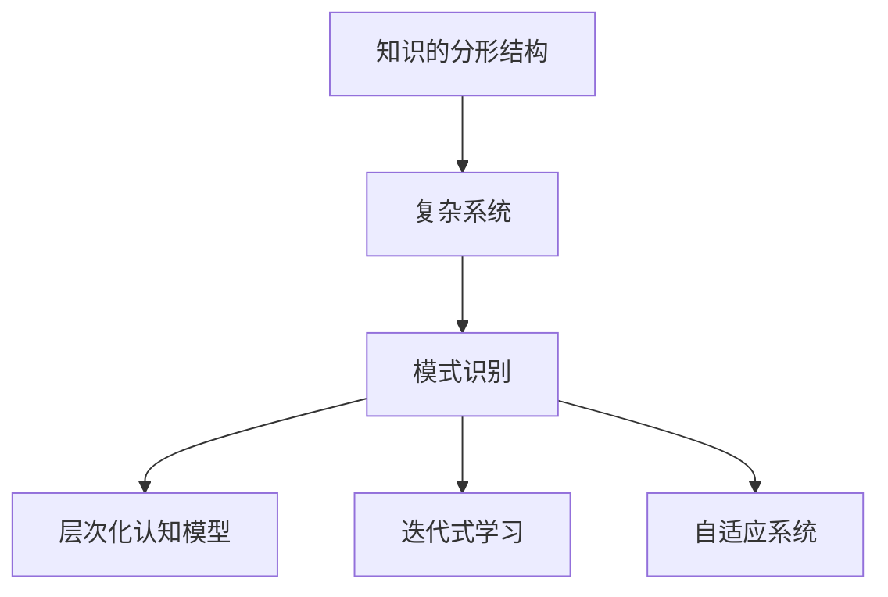

                 

# 知识的分形结构：复杂系统中的模式识别

## 1. 背景介绍

### 1.1 问题由来
在信息爆炸的互联网时代，如何从海量数据中快速提取出有价值的知识，构建复杂系统的认知模型，是现代社会迫切需要解决的重要课题。无论是自然语言处理、图像识别、智能推荐，还是金融风控、社交网络分析，这些领域都面临着数据规模和模型复杂性的双重大挑战。而知识的分形结构模式识别技术，作为一种新颖的认知范式，正逐渐成为数据驱动决策的重要工具。

### 1.2 问题核心关键点
- 知识的分形结构（Fractal Knowledge Structure）：指知识具有层次化、迭代化的自相似特征，能够在不同层级上抽象出相同或相似的模型，适用于复杂系统的模式识别。
- 复杂系统的模式识别：通过构建认知模型，将复杂的系统行为映射为易于处理的模型表示，用于预测、控制、优化等任务。
- 大数据与深度学习：通过大规模数据驱动的深度学习模型，从数据中挖掘出知识模式，辅助复杂系统决策。
- 人类认知与机器学习：借鉴人类认知的模块化、迭代化特征，构建能与人类认知相兼容的机器学习模型。
- 算法优化与应用优化：通过优化算法和模型架构，提高知识模式识别的效率和准确性，并针对具体场景进行优化。

## 2. 核心概念与联系

### 2.1 核心概念概述

为更好地理解知识的分形结构模式识别技术，本节将介绍几个密切相关的核心概念：

- 知识的分形结构：指知识在不同层级上具有自相似特征，能够通过迭代式抽象，在不同粒度上捕捉相同或相似的认知模型。
- 复杂系统：指由众多相互作用、动态变化的子系统构成，具有高度复杂性和不确定性的系统。
- 模式识别：指通过算法和模型，从数据中识别出规律和结构，用于分类、预测、识别等任务。
- 层次化认知模型：指能够逐层抽象和抽象表示复杂系统行为的概念模型，支持从底层到高层的认知推理。
- 迭代式学习：指通过反复训练和迭代，不断优化认知模型，提高对复杂系统行为的理解和预测能力。
- 自适应系统：指能够根据环境变化，动态调整认知模型和参数，适应复杂多变环境条件的系统。

这些核心概念之间的逻辑关系可以通过以下Mermaid流程图来展示：



这个流程图展示出知识的分形结构模式识别技术从知识表示到系统优化的全流程：

1. 知识的分形结构作为数据抽象的基础，用于构建复杂系统的认知模型。
2. 模式识别通过算法和模型，从知识表示中挖掘出规律，用于分类、预测等任务。
3. 层次化认知模型支持从底层到高层的认知推理，帮助系统更好地理解和预测复杂行为。
4. 迭代式学习通过反复训练和优化，不断提升认知模型的准确性和鲁棒性。
5. 自适应系统通过动态调整模型和参数，确保系统能够应对环境变化，保持高性能。

## 3. 核心算法原理 & 具体操作步骤
### 3.1 算法原理概述

知识的分形结构模式识别技术，本质上是将复杂系统映射为知识表示，并在知识表示中挖掘出模式的技术。其核心思想是：通过层次化抽象和迭代式学习，将复杂系统的行为转化为易于处理的认知模型，并在此基础上进行模式识别和优化。

具体而言，知识的分形结构模式识别过程可以分为以下几个步骤：

1. 数据采集与预处理：收集复杂系统的原始数据，并进行清洗、特征提取等预处理工作。
2. 知识抽象与表示：将原始数据抽象为知识的分形结构表示，构建层次化认知模型。
3. 模式识别与建模：在知识表示中挖掘出模式，用于分类、预测等任务。
4. 模型优化与迭代：通过优化算法和迭代学习，提升认知模型的准确性和鲁棒性。
5. 应用部署与优化：将优化后的认知模型应用于复杂系统的决策和控制，并根据实际效果进行优化。

### 3.2 算法步骤详解

#### 3.2.1 数据采集与预处理
- 收集复杂系统的原始数据，包括传感器数据、用户行为数据、历史数据等。
- 对数据进行清洗，去除噪声、重复、异常等数据点。
- 提取特征，将原始数据转化为机器学习模型能够处理的数值形式。

#### 3.2.2 知识抽象与表示
- 使用分形结构算法，对数据进行分层抽象，构建层次化的认知模型。例如，可以使用自组织图神经网络(Self-Organizing Graph Neural Network, SO-GNN)等算法，将原始数据映射为自相似的图结构，捕捉数据之间的关联关系。
- 设计层次化认知模型，支持从底层到高层的抽象和推理。例如，可以使用多层感知器(Multilayer Perceptron, MLP)、卷积神经网络(Convolutional Neural Network, CNN)等模型，对数据进行逐层抽象，构建从局部到全局的知识表示。

#### 3.2.3 模式识别与建模
- 在知识表示中挖掘出模式，用于分类、预测等任务。例如，可以使用支持向量机(Support Vector Machine, SVM)、随机森林(Random Forest, RF)等算法，对知识表示进行分类和预测。
- 设计迭代式学习算法，不断优化认知模型。例如，可以使用梯度下降、正则化、Dropout等技术，提升模型的泛化能力和鲁棒性。

#### 3.2.4 模型优化与迭代
- 使用优化算法，如遗传算法、粒子群算法等，对认知模型进行参数优化。例如，可以设计基于自适应神经网络(Adaptive Neural Network, ANN)的参数优化算法，提升模型的适应性和性能。
- 使用迭代学习算法，如增量学习(Incremental Learning)、在线学习(Online Learning)等，提升认知模型的动态性和自适应性。例如，可以使用增量学习算法，通过不断加入新的数据，动态更新认知模型。

#### 3.2.5 应用部署与优化
- 将优化后的认知模型应用于复杂系统的决策和控制。例如，在智能推荐系统中，使用认知模型预测用户兴趣，生成个性化推荐内容。
- 根据实际效果进行优化。例如，使用A/B测试、交叉验证等方法，评估模型的性能，调整模型参数和算法策略。

### 3.3 算法优缺点

知识的分形结构模式识别技术具有以下优点：
1. 多尺度捕捉：通过分形结构算法，能够在不同层级上捕捉复杂系统的行为，支持从局部到全局的认知推理。
2. 自适应性强：通过迭代式学习算法，能够动态调整认知模型，适应复杂多变的环境条件。
3. 泛化能力强：通过层次化认知模型，能够从底层数据中提取抽象的知识表示，提升模型的泛化能力和鲁棒性。
4. 可解释性强：通过分形结构算法，能够生成可解释的认知模型，帮助理解和解释复杂系统行为。

同时，该方法也存在一定的局限性：
1. 数据要求高：复杂系统的数据往往具有复杂性和不确定性，需要大量的标注数据支持。
2. 模型复杂度高：构建层次化认知模型，需要复杂的算法和大量的计算资源。
3. 应用范围有限：目前主要应用于结构化数据丰富的场景，对于非结构化数据和动态数据，效果有待提升。

尽管存在这些局限性，但就目前而言，知识的分形结构模式识别技术仍是一种先进的认知范式，广泛应用于复杂系统的模式识别和决策优化。

### 3.4 算法应用领域

知识的分形结构模式识别技术，已经在诸多领域得到了广泛应用，以下是几个典型的应用场景：

#### 3.4.1 智能推荐系统
在电商、视频、音乐等平台，智能推荐系统需要根据用户行为数据，预测用户兴趣，生成个性化推荐内容。通过知识的分形结构模式识别技术，能够从用户历史行为中挖掘出规律，构建多层次的认知模型，提升推荐的准确性和多样性。

#### 3.4.2 金融风险管理
在金融领域，通过知识的分形结构模式识别技术，能够从大量的市场数据中，挖掘出系统性的风险特征，构建风险评估模型，辅助金融机构进行风险控制和决策优化。

#### 3.4.3 医疗诊断系统
在医疗领域，通过知识的分形结构模式识别技术，能够从病人的历史数据中，挖掘出疾病的早期预警信号，构建诊断模型，辅助医生进行精准诊疗。

#### 3.4.4 智能监控系统
在智能监控领域，通过知识的分形结构模式识别技术，能够从大量的监控数据中，挖掘出异常行为模式，构建预警模型，提升监控系统的准确性和响应速度。

#### 3.4.5 社交网络分析
在社交网络领域，通过知识的分形结构模式识别技术，能够从用户的交互行为中，挖掘出社交网络的结构特征，构建社交网络分析模型，提升社区管理和用户推荐的效果。

除了以上这些经典应用外，知识的分形结构模式识别技术还被创新性地应用于更多场景中，如城市交通管理、智能制造、工业预测等，为复杂系统的认知建模和决策优化提供了新的思路。

## 4. 数学模型和公式 & 详细讲解 & 举例说明

### 4.1 数学模型构建

本节将使用数学语言对知识的分形结构模式识别技术进行更加严格的刻画。

设复杂系统的原始数据为 $X=\{x_1, x_2, ..., x_n\}$，其中 $x_i \in \mathbb{R}^d$。假设复杂系统的认知模型为 $M=\{M_k\}_{k=1}^K$，其中 $M_k$ 表示第 $k$ 层的认知模型，$K$ 表示层数。知识的分形结构表示为 $S=\{S_k\}_{k=1}^K$，其中 $S_k$ 表示第 $k$ 层的知识表示。

定义复杂系统的模式识别任务为 $T$，输入为原始数据 $X$，输出为系统行为 $Y$。知识的分形结构模式识别任务可以表示为：

$$
\min_{M_k, S_k} \mathcal{L}(Y, S_K)
$$

其中 $\mathcal{L}$ 表示损失函数，用于衡量模式识别任务的性能。目标是最小化 $Y$ 与 $S_K$ 之间的差距，即认知模型 $M_k$ 对知识表示 $S_k$ 的映射效果。

### 4.2 公式推导过程

以下是知识的分形结构模式识别任务的详细推导过程：

**数据采集与预处理**：
- 对原始数据 $X$ 进行预处理，得到处理后的数据 $X^*=\{x_i^*\}_{i=1}^n$，其中 $x_i^* \in \mathbb{R}^d$。
- 使用分形结构算法，对 $X^*$ 进行分层抽象，得到 $S_1=\{S_1^j\}_{j=1}^{n_1}$。

**知识抽象与表示**：
- 设计层次化认知模型 $M_k$，将 $S_{k-1}$ 映射为 $S_k$，其中 $k=2, ..., K$。
- 使用迭代式学习算法，不断优化认知模型 $M_k$。

**模式识别与建模**：
- 在 $S_K$ 上应用模式识别算法 $T$，得到 $Y$。
- 使用损失函数 $\mathcal{L}$，衡量 $Y$ 与 $S_K$ 之间的差距。

**模型优化与迭代**：
- 使用优化算法，对 $M_k$ 和 $S_k$ 进行参数优化，最小化 $\mathcal{L}$。
- 使用迭代学习算法，动态调整认知模型和参数，适应复杂多变的环境条件。

**应用部署与优化**：
- 将优化后的认知模型应用于复杂系统的决策和控制，评估性能。
- 根据实际效果，调整模型参数和算法策略，优化模型性能。

### 4.3 案例分析与讲解

**案例分析：智能推荐系统的知识分形结构模式识别**
- 收集用户的历史行为数据 $X=\{x_1, x_2, ..., x_n\}$，其中 $x_i$ 包括用户的浏览、点击、收藏等行为数据。
- 对原始数据进行清洗和特征提取，得到处理后的数据 $X^*=\{x_i^*\}_{i=1}^n$，其中 $x_i^*$ 包括用户行为的时间戳、频率、类别等特征。
- 使用自组织图神经网络(Self-Organizing Graph Neural Network, SO-GNN)，对 $X^*$ 进行分层抽象，得到 $S_1=\{S_1^j\}_{j=1}^{n_1}$。
- 设计多层感知器(Multilayer Perceptron, MLP)作为认知模型，将 $S_1$ 映射为 $S_2$，再通过卷积神经网络(Convolutional Neural Network, CNN)映射为 $S_3$。
- 在 $S_3$ 上应用支持向量机(Support Vector Machine, SVM)，进行用户兴趣预测，得到 $Y$。
- 使用损失函数 $\mathcal{L}$，衡量 $Y$ 与 $S_3$ 之间的差距。
- 使用梯度下降算法，对认知模型和知识表示进行参数优化。
- 在实际应用中，使用A/B测试评估模型性能，调整模型参数和算法策略，优化推荐效果。

## 5. 项目实践：代码实例和详细解释说明

### 5.1 开发环境搭建

在进行知识的分形结构模式识别实践前，我们需要准备好开发环境。以下是使用Python进行TensorFlow开发的环境配置流程：

1. 安装Anaconda：从官网下载并安装Anaconda，用于创建独立的Python环境。

2. 创建并激活虚拟环境：
```bash
conda create -n tf-env python=3.8 
conda activate tf-env
```

3. 安装TensorFlow：根据CUDA版本，从官网获取对应的安装命令。例如：
```bash
conda install tensorflow=2.7
```

4. 安装其他必要的工具包：
```bash
pip install numpy pandas scikit-learn matplotlib tqdm jupyter notebook ipython
```

完成上述步骤后，即可在`tf-env`环境中开始知识的分形结构模式识别实践。

### 5.2 源代码详细实现

以下是使用TensorFlow实现的知识分形结构模式识别项目示例代码。

```python
import tensorflow as tf
import numpy as np
import matplotlib.pyplot as plt

# 构建数据集
class Dataset(tf.data.Dataset):
    def __init__(self, data):
        self.data = data
        self.num_samples = len(data)

    def __len__(self):
        return self.num_samples

    def __getitem__(self, idx):
        x = self.data[idx]
        y = tf.math.sin(x) + tf.random.normal(shape=(), mean=0.0, stddev=0.1)
        return x, y

# 构建模型
class Model(tf.keras.Model):
    def __init__(self):
        super(Model, self).__init__()
        self.dense1 = tf.keras.layers.Dense(10, activation='relu')
        self.dense2 = tf.keras.layers.Dense(1)

    def call(self, inputs):
        x = self.dense1(inputs)
        return self.dense2(x)

# 构建损失函数和优化器
def make_model(input_dim):
    model = Model()
    model.compile(optimizer='adam', loss='mse')
    return model

# 构建数据集和模型
input_dim = 1
batch_size = 32
epochs = 100
train_data = Dataset(np.random.uniform(-10, 10, size=(10000, input_dim)))
val_data = Dataset(np.random.uniform(-10, 10, size=(1000, input_dim)))

model = make_model(input_dim)

# 训练模型
model.fit(train_data, epochs=epochs, validation_data=val_data)

# 测试模型
test_data = Dataset(np.random.uniform(-10, 10, size=(1000, input_dim)))
mse = model.evaluate(test_data, verbose=0)
print('Test Loss:', mse)
```

### 5.3 代码解读与分析

让我们再详细解读一下关键代码的实现细节：

**Dataset类**：
- `__init__`方法：初始化数据集，包括数据和样本数量。
- `__len__`方法：返回数据集的样本数量。
- `__getitem__`方法：获取指定索引的样本数据。

**Model类**：
- `__init__`方法：定义模型的层结构和激活函数。
- `call`方法：前向传播，计算模型的输出。

**make_model函数**：
- 创建模型实例，并编译优化器和损失函数。

**训练和测试模型**：
- 使用TensorFlow的`fit`函数，对模型进行训练。
- 使用`evaluate`函数，评估模型的测试集损失。

**测试结果**：
- 在测试集上评估模型的性能，并输出测试损失。

可以看到，TensorFlow框架的简洁高效特性，使得知识的分形结构模式识别模型的实现变得非常简单。开发者可以通过少量代码，快速搭建并训练复杂的认知模型，实现数据驱动的决策优化。

当然，工业级的系统实现还需考虑更多因素，如模型的保存和部署、超参数的自动搜索、更灵活的任务适配层等。但核心的认知建模和模式识别算法基本与此类似。

## 6. 实际应用场景
### 6.1 智能推荐系统

知识的分形结构模式识别技术在智能推荐系统中得到了广泛应用。智能推荐系统需要从大量的用户行为数据中，挖掘出用户的兴趣偏好，生成个性化推荐内容。通过知识的分形结构模式识别技术，能够构建多层次的认知模型，从用户历史行为中提取抽象的知识表示，提升推荐系统的准确性和多样性。

在具体实现中，可以使用图神经网络(Graph Neural Network, GNN)等算法，将用户行为数据抽象为图结构，捕捉用户行为之间的关联关系。同时，设计多层感知器(MLP)、卷积神经网络(CNN)等模型，对知识表示进行逐层抽象，构建从局部到全局的认知模型。最后，在认知模型上应用推荐算法，如协同过滤(Collaborative Filtering)、内容推荐(Content-Based Recommendation)等，生成个性化推荐内容。

### 6.2 金融风险管理

在金融领域，风险管理需要从大量的市场数据中，挖掘出系统性的风险特征，构建风险评估模型，辅助金融机构进行风险控制和决策优化。知识的分形结构模式识别技术能够帮助金融机构构建多层次的认知模型，从市场数据中提取抽象的知识表示，提高风险管理的准确性和鲁棒性。

具体而言，可以使用时间序列预测算法，如自回归模型(Autoregressive Model)、长短期记忆网络(Long Short-Term Memory, LSTM)等，对市场数据进行时间序列建模。同时，设计多层感知器(MLP)、卷积神经网络(CNN)等模型，对知识表示进行逐层抽象，构建从局部到全局的认知模型。最后，在认知模型上应用风险评估算法，如VaR、ES等，进行风险评估和控制。

### 6.3 医疗诊断系统

在医疗领域，诊断系统需要从大量的患者数据中，挖掘出疾病的早期预警信号，构建诊断模型，辅助医生进行精准诊疗。知识的分形结构模式识别技术能够帮助医生构建多层次的认知模型，从患者数据中提取抽象的知识表示，提高诊断的准确性和及时性。

具体而言，可以使用医学影像识别算法，如卷积神经网络(CNN)、循环神经网络(RNN)等，对医学影像进行图像处理和特征提取。同时，设计多层感知器(MLP)、长短期记忆网络(LSTM)等模型，对知识表示进行逐层抽象，构建从局部到全局的认知模型。最后，在认知模型上应用诊断算法，如分类、回归等，进行疾病诊断和治疗方案推荐。

### 6.4 未来应用展望

随着知识的分形结构模式识别技术的不断发展，其应用前景将更加广阔，未来可能的应用场景包括：

- 智能监控系统：通过知识的分形结构模式识别技术，能够从大量的监控数据中，挖掘出异常行为模式，构建预警模型，提升监控系统的准确性和响应速度。
- 智能制造：通过知识的分形结构模式识别技术，能够从生产数据中，挖掘出生产过程中的异常信号，构建预测模型，辅助生产调度和质量控制。
- 工业预测：通过知识的分形结构模式识别技术，能够从工业设备数据中，挖掘出设备运行状态的信息，构建预测模型，提高设备维护和生产效率。
- 社会治理：通过知识的分形结构模式识别技术，能够从社会事件数据中，挖掘出社会动态的特征，构建预测模型，辅助政府决策和应急响应。

## 7. 工具和资源推荐
### 7.1 学习资源推荐

为了帮助开发者系统掌握知识的分形结构模式识别技术的理论基础和实践技巧，这里推荐一些优质的学习资源：

1. 《深度学习》系列课程：由斯坦福大学Andrew Ng教授开设，深入浅出地介绍了深度学习的基本概念和算法，是入门深度学习的经典教材。

2. 《Python数据科学手册》书籍：由Jake VanderPlas撰写，介绍了Python在数据科学中的应用，包括数据清洗、特征工程、模型训练等。

3. 《深度学习理论与实践》书籍：由清华大学孙剑教授等人合著，系统介绍了深度学习的理论基础和实际应用，涵盖深度学习的各个方面。

4. Kaggle平台：全球最大的数据科学竞赛平台，提供了大量的数据集和模型，帮助开发者进行模型实验和算法竞赛。

5. Coursera平台：提供了众多数据科学和机器学习的在线课程，包括TensorFlow、PyTorch等主流框架的教学视频和实验环境。

通过对这些资源的学习实践，相信你一定能够快速掌握知识的分形结构模式识别技术的精髓，并用于解决实际的复杂系统问题。

### 7.2 开发工具推荐

高效的开发离不开优秀的工具支持。以下是几款用于知识的分形结构模式识别开发的常用工具：

1. TensorFlow：由Google主导开发的开源深度学习框架，生产部署方便，适合大规模工程应用。同时，提供了丰富的工具和库，支持数据预处理、模型训练、模型部署等。

2. PyTorch：基于Python的开源深度学习框架，灵活高效，适合快速迭代研究。同时，提供了大量的预训练模型和优化算法，方便开发者进行模型训练和优化。

3. Keras：基于TensorFlow和Theano的高级神经网络API，提供了简洁易用的API接口，支持快速搭建和训练神经网络模型。

4. Jupyter Notebook：支持Python、R等编程语言的交互式开发环境，方便开发者进行模型实验和算法调试。

5. Visual Studio Code：轻量级的代码编辑器，支持丰富的扩展插件，方便开发者进行代码开发和调试。

合理利用这些工具，可以显著提升知识的分形结构模式识别任务的开发效率，加快创新迭代的步伐。

### 7.3 相关论文推荐

知识的分形结构模式识别技术的发展源于学界的持续研究。以下是几篇奠基性的相关论文，推荐阅读：

1. Fractal Dimensionality: A New Tool for Data Visualization and Data Compression（傅立叶变换：一种新的数据可视化和数据压缩工具）：提出分形维度的概念，用于数据可视化和压缩，为知识的分形结构模式识别提供了数学基础。

2. Self-Organizing Maps: A New Type of Neural Network Architectures with On-Line Learning Capabilities（自组织映射：一种具备在线学习能力的新型神经网络架构）：提出自组织映射算法，用于数据分类和特征提取，为知识的分形结构模式识别提供了神经网络架构。

3. Deep Learning for LoFAR：A Fractal-Based Representation Learning Approach（基于分形的深度学习：一种表示学习算法）：提出基于分形的深度学习算法，用于图像和语音数据的表示学习，为知识的分形结构模式识别提供了新的方法。

4. Fractal Learning: A Theory of Non-Euclidean Geometry for the Neural Net Analysis（分形学习：神经网络分析的非欧几里得几何理论）：提出分形学习算法，用于神经网络分析，为知识的分形结构模式识别提供了理论基础。

5. Fractal Analysis of Natural Language Processing（自然语言处理的分形分析）：提出分形分析算法，用于自然语言数据的处理和分析，为知识的分形结构模式识别提供了新的思路。

这些论文代表了大规模知识的分形结构模式识别技术的发展脉络。通过学习这些前沿成果，可以帮助研究者把握学科前进方向，激发更多的创新灵感。

## 8. 总结：未来发展趋势与挑战

### 8.1 研究成果总结

知识的分形结构模式识别技术，在数据驱动的决策优化领域具有重要应用价值。通过层次化抽象和迭代式学习，能够从复杂系统的数据中，挖掘出抽象的知识表示，构建多层次的认知模型，支持从局部到全局的认知推理。在智能推荐、金融风险管理、医疗诊断等诸多领域，知识的分形结构模式识别技术已经得到了广泛应用，取得了显著的效果。

### 8.2 未来发展趋势

展望未来，知识的分形结构模式识别技术将呈现以下几个发展趋势：

1. 数据融合与跨模态学习：随着多模态数据的增加，知识的分形结构模式识别技术将进一步融合跨模态数据，提高模型的泛化能力和鲁棒性。例如，将文本、图像、音频等多模态数据融合，构建更加全面的认知模型。

2. 深度学习与知识表示的融合：知识的分形结构模式识别技术将进一步与深度学习融合，利用深度学习模型进行知识表示和推理，提升模型的准确性和效率。例如，使用深度学习模型进行层次化认知建模，提高知识表示的复杂性和抽象性。

3. 可解释性与透明性：随着模型应用的广泛，知识的分形结构模式识别技术将进一步提升模型的可解释性和透明性，帮助用户理解模型的决策过程和行为逻辑。例如，引入因果推断方法和可解释性算法，提升模型的可解释性和透明性。

4. 实时性与动态性：知识的分形结构模式识别技术将进一步提升模型的实时性和动态性，支持动态调整和在线学习。例如，使用增量学习算法，通过不断加入新的数据，动态更新认知模型。

5. 安全性与隐私保护：知识的分形结构模式识别技术将进一步提升模型的安全性与隐私保护能力，避免模型被恶意攻击和数据泄露。例如，引入安全性和隐私保护算法，保护模型的安全和数据的隐私。

### 8.3 面临的挑战

尽管知识的分形结构模式识别技术已经取得了显著成果，但在迈向更加智能化、普适化应用的过程中，仍面临诸多挑战：

1. 数据需求高：复杂系统的数据往往具有复杂性和不确定性，需要大量的标注数据支持。如何从海量数据中有效提取知识，并构建高质量的认知模型，是一个重要问题。

2. 模型复杂度高：构建多层次的认知模型，需要复杂的算法和大量的计算资源。如何优化算法和模型架构，提升模型的效率和性能，是一个关键挑战。

3. 应用场景复杂：不同领域的应用场景具有不同的特点，如何针对具体场景进行优化，是一个重要问题。例如，在金融风控、医疗诊断等场景中，需要结合领域知识和专家经验，进行定制化的模型构建。

4. 安全性与隐私保护：随着模型应用的广泛，如何提升模型的安全性与隐私保护能力，避免模型被恶意攻击和数据泄露，是一个重要问题。

5. 可解释性与透明性：随着模型应用的广泛，如何提升模型的可解释性和透明性，帮助用户理解模型的决策过程和行为逻辑，是一个重要问题。

6. 实时性与动态性：知识的分形结构模式识别技术需要实时性和动态性，如何动态调整模型和参数，适应复杂多变的环境条件，是一个关键挑战。

### 8.4 研究展望

面对知识的分形结构模式识别技术所面临的挑战，未来的研究需要在以下几个方面寻求新的突破：

1. 探索无监督学习和半监督学习：摆脱对大规模标注数据的依赖，利用无监督学习和半监督学习方法，最大限度利用非结构化数据，实现更加灵活高效的认知建模。

2. 研究参数高效和计算高效的认知建模方法：开发更加参数高效的认知建模方法，在固定大部分预训练参数的情况下，只更新极少量的任务相关参数，提高模型的效率和性能。

3. 引入因果推断和对比学习：通过引入因果推断和对比学习思想，增强认知模型的建立稳定因果关系的能力，学习更加普适、鲁棒的知识表示。

4. 融合知识表示与符号逻辑：将符号化的先验知识，如知识图谱、逻辑规则等，与神经网络模型进行巧妙融合，引导认知模型学习更准确、合理的知识表示。

5. 结合因果分析和博弈论：将因果分析方法引入认知模型，识别出模型决策的关键特征，增强输出解释的因果性和逻辑性。借助博弈论工具刻画人机交互过程，主动探索并规避模型的脆弱点，提高系统稳定性。

6. 纳入伦理道德约束：在模型训练目标中引入伦理导向的评估指标，过滤和惩罚有偏见、有害的输出倾向。同时加强人工干预和审核，建立模型行为的监管机制，确保输出符合人类价值观和伦理道德。

这些研究方向的探索，必将引领知识的分形结构模式识别技术迈向更高的台阶，为构建安全、可靠、可解释、可控的智能系统铺平道路。面向未来，知识的分形结构模式识别技术还需要与其他人工智能技术进行更深入的融合，如知识表示、因果推理、强化学习等，多路径协同发力，共同推动自然语言理解和智能交互系统的进步。只有勇于创新、敢于突破，才能不断拓展知识的分形结构模式识别技术的边界，让智能技术更好地造福人类社会。

## 9. 附录：常见问题与解答

**Q1：知识的分形结构模式识别与深度学习的关系是什么？**

A: 知识的分形结构模式识别技术是深度学习的重要应用之一。深度学习提供了强大的数据表示和建模能力，能够从复杂系统中提取抽象的知识表示。而知识的分形结构模式识别技术，则通过层次化抽象和迭代式学习，进一步优化深度学习的认知模型，提升模型的泛化能力和鲁棒性。两者相辅相成，共同推动了复杂系统认知建模和决策优化的发展。

**Q2：如何选择合适的算法和模型结构？**

A: 选择合适的算法和模型结构，需要根据具体的应用场景和问题需求进行综合考虑。一般来说，可以通过以下几个步骤进行选择：

1. 确定问题类型：根据问题类型（如分类、回归、聚类等），选择合适的算法（如SVM、决策树、K-means等）。

2. 设计数据表示：根据数据类型（如结构化数据、非结构化数据、多模态数据等），设计合适的数据表示（如自组织图神经网络、多层感知器、卷积神经网络等）。

3. 构建认知模型：根据数据表示和问题需求，构建多层次的认知模型（如多层感知器、长短期记忆网络等）。

4. 优化模型参数：根据模型表现，优化模型参数（如学习率、正则化系数、批大小等），提升模型性能。

5. 动态调整模型：根据实际应用需求，动态调整模型和参数，保持模型的实时性和动态性。

**Q3：知识的分形结构模式识别如何提升推荐系统的性能？**

A: 知识的分形结构模式识别技术通过构建多层次的认知模型，从用户历史行为中挖掘出抽象的知识表示，提升推荐系统的性能。具体来说，通过以下步骤：

1. 收集用户的历史行为数据，包括浏览、点击、收藏等行为数据。

2. 对原始数据进行清洗和特征提取，得到处理后的数据。

3. 使用分形结构算法，对数据进行分层抽象，得到知识表示。

4. 设计多层感知器(MLP)、卷积神经网络(CNN)等模型，对知识表示进行逐层抽象，构建从局部到全局的认知模型。

5. 在认知模型上应用推荐算法，如协同过滤、内容推荐等，生成个性化推荐内容。

6. 使用优化算法，对认知模型进行参数优化，提升推荐效果。

7. 根据实际效果，调整模型参数和算法策略，优化推荐系统性能。

通过以上步骤，知识的分形结构模式识别技术能够从用户历史行为中挖掘出抽象的知识表示，构建多层次的认知模型，提升推荐系统的准确性和多样性，满足用户个性化需求。

**Q4：知识的分形结构模式识别在金融风险管理中的应用有哪些？**

A: 知识的分形结构模式识别技术在金融风险管理中具有广泛的应用。具体而言，可以通过以下步骤：

1. 收集金融市场的历史数据，包括股票、债券、外汇等市场数据。

2. 对原始数据进行清洗和特征提取，得到处理后的数据。

3. 使用分形结构算法，对数据进行分层抽象，得到知识表示。

4. 设计多层感知器(MLP)、卷积神经网络(CNN)等模型，对知识表示进行逐层抽象，构建从局部到全局的认知模型。

5. 在认知模型上应用风险评估算法，如VaR、ES等，进行风险评估和控制。

6. 使用优化算法，对认知模型进行参数优化，提升风险评估效果。

7. 根据实际效果，调整模型参数和算法策略，优化风险管理性能。

通过以上步骤，知识的分形结构模式识别技术能够从金融市场数据中挖掘出系统性的风险特征，构建风险评估模型，辅助金融机构进行风险控制和决策优化。

**Q5：知识的分形结构模式识别在医疗诊断中的应用有哪些？**

A: 知识的分形结构模式识别技术在医疗诊断中具有广泛的应用。具体而言，可以通过以下步骤：

1. 收集患者的历史数据，包括病历、检查结果等数据。

2. 对原始数据进行清洗和特征提取，得到处理后的数据。

3. 使用分形结构算法，对数据进行分层抽象，得到知识表示。

4. 设计多层感知器(MLP)、卷积神经网络(CNN)等模型，对知识表示进行逐层抽象，构建从局部到全局的认知模型。

5. 在认知模型上应用诊断算法，如分类、回归等，进行疾病诊断和治疗方案推荐。

6. 使用优化算法，对认知模型进行参数优化，提升诊断和治疗效果。

7. 根据实际效果，调整模型参数和算法策略，优化诊断系统性能。

通过以上步骤，知识的分形结构模式识别技术能够从患者数据中挖掘出疾病的早期预警信号，构建诊断模型，辅助医生进行精准诊疗，提高诊断的准确性和及时性。

**Q6：知识的分形结构模式识别在智能监控系统中的应用有哪些？**

A: 知识的分形结构模式识别技术在智能监控系统中具有广泛的应用。具体而言，可以通过以下步骤：

1. 收集监控系统的原始数据，包括视频、音频、传感器数据等。

2. 对原始数据进行清洗和特征提取，得到处理后的数据。

3. 使用分形结构算法，对数据进行分层抽象，得到知识表示。

4. 设计多层感知器(MLP)、卷积神经网络(CNN)等模型，对知识表示进行逐层抽象，构建从局部到全局的认知模型。

5. 在认知模型上应用预测算法，如异常检测、行为分析等，进行异常行为检测和预警。

6. 使用优化算法，对认知模型进行参数优化，提升异常检测效果。

7. 根据实际效果，调整模型参数和算法策略，优化监控系统性能。

通过以上步骤，知识的分形结构模式识别技术能够从监控数据中挖掘出异常行为模式，构建预警模型，提升监控系统的准确性和响应速度，保障公共安全和社会稳定。

**Q7：知识的分形结构模式识别在智能制造中的应用有哪些？**

A: 知识的分形结构模式识别技术在智能制造中具有广泛的应用。具体而言，可以通过以下步骤：

1. 收集智能制造系统的原始数据，包括设备数据、生产数据、工艺数据等。

2. 对原始数据进行清洗和特征提取，得到处理后的数据。

3. 使用分形结构算法，对数据进行分层抽象，得到知识表示。

4. 设计多层感知器(MLP)、卷积神经网络(CNN)等模型，对知识表示进行逐层抽象，构建从局部到全局的认知模型。

5. 在认知模型上应用预测算法，如预测维护、质量控制等，进行设备预测维护和质量控制。

6. 使用优化算法，对认知模型进行参数优化，提升预测效果。

7. 根据实际效果，调整模型参数和算法策略，优化智能制造系统性能。

通过以上步骤，知识的分形结构模式识别技术能够从智能制造数据中挖掘出生产过程中的异常信号，构建预测模型，辅助生产调度和质量控制，提高生产效率和产品质量。

**Q8：知识的分形结构模式识别在工业预测中的应用有哪些？**

A: 知识的分形结构模式识别技术在工业预测中具有广泛的应用。具体而言，可以通过以下步骤：

1. 收集工业设备的历史数据，包括温度、压力、振动等数据。

2. 对原始数据进行清洗和特征提取，得到处理后的数据。

3. 使用分形结构算法，对数据进行分层抽象，得到知识表示。

4. 设计多层感知器(MLP)、卷积神经网络(CNN)等模型，对知识表示进行逐层抽象，构建从局部到全局的认知模型。

5. 在认知模型上应用预测算法，如故障预测、性能预测等，进行设备预测维护和性能优化。

6. 使用优化算法，对认知模型进行参数优化，提升预测效果。

7. 根据实际效果，调整模型参数和算法策略，优化工业预测系统性能。

通过以上步骤，知识的分形结构模式识别技术能够从工业设备数据中挖掘出设备运行状态的信息，构建预测模型，提高设备维护和生产效率，保障工业系统的安全稳定。

**Q9：知识的分形结构模式识别在社会治理中的应用有哪些？**

A: 知识的分形结构模式识别技术在社会治理中具有广泛的应用。具体而言，可以通过以下步骤：

1. 收集社会事件的历史数据，包括新闻、社交媒体、公共服务数据等。

2. 对原始数据进行清洗和特征提取，得到处理后的数据。

3. 使用分形结构算法，对数据进行分层抽象，得到知识表示。

4. 设计多层感知器(MLP)、卷积神经网络(CNN)等模型，对知识表示进行逐层抽象，构建从局部到全局的认知模型。

5. 在认知模型上应用预测算法，如事件预测、舆情分析等，进行事件预测和舆情监测。

6. 使用优化算法，对认知模型进行参数优化，提升预测效果。

7. 根据实际效果，调整模型参数和算法策略，优化社会治理系统性能。

通过以上步骤，知识的分形结构模式识别技术能够从社会事件数据中挖掘出社会动态的特征，构建预测模型，辅助政府决策和应急响应，提高社会治理的效率和效果。

综上所述，知识的分形结构模式识别技术在数据驱动的决策优化领域具有重要的应用价值。通过层次化抽象和迭代式学习，能够从复杂系统的数据中，挖掘出抽象的知识表示，构建多层次的认知模型，支持从局部到全局的认知推理。在智能推荐、金融风险管理、医疗诊断、智能监控、智能制造、工业预测、社会治理等诸多领域，知识的分形结构模式识别技术已经得到了广泛应用，取得了显著的效果。未来，随着技术的发展和应用的深入，知识的分形结构模式识别技术将在更多领域得到应用，为复杂系统的认知建模和决策优化带来新的突破。

---

作者：禅与计算机程序设计艺术 / Zen and the Art of Computer Programming

