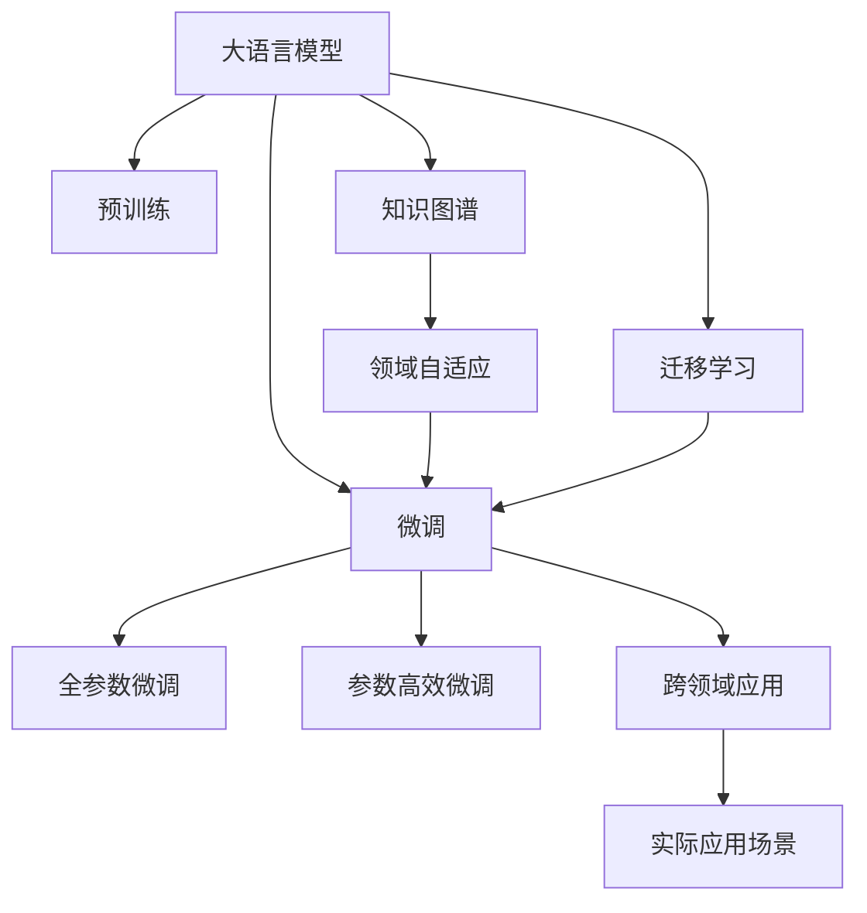

                 

# 知识的可迁移性：跨领域应用的潜力

> 关键词：知识迁移,跨领域应用,迁移学习,机器学习,深度学习,知识图谱,领域自适应

## 1. 背景介绍

### 1.1 问题由来
在现代人工智能领域，特别是深度学习和机器学习领域，知识迁移(Transfer Learning)已经成为一个重要的研究方向。知识迁移指的是将在一个领域学到的知识迁移到另一个领域，以提升在新领域中的学习效果。这一方法在提高模型的泛化能力和提升计算效率方面表现出巨大的潜力，特别是在数据稀缺的情况下，知识迁移能够显著降低模型训练的难度和成本。

大语言模型（Large Language Model, LLMs）的涌现为知识迁移提供了新的范式。大语言模型通过在海量文本数据上预训练，学习到丰富的语言知识和语义表示，能够在不同任务之间进行知识迁移，提升特定任务的表现。例如，将BERT在问答任务上的知识迁移到摘要生成任务上，通过微调能够显著提升模型在摘要生成上的表现。

然而，知识迁移也面临诸多挑战，特别是在不同领域之间，知识的泛化能力有限，模型的迁移效果并不总是理想的。本论文旨在探讨大语言模型在跨领域应用中的知识迁移潜力，并提出一系列策略来提升知识迁移的效果。

### 1.2 问题核心关键点
知识迁移的核心在于如何有效利用先验知识，减少在新任务上的训练样本需求，提升模型在新任务上的表现。其核心步骤包括：
- 选择合适的预训练模型和下游任务。
- 设计合理的微调策略和损失函数。
- 避免过拟合，提高模型的泛化能力。
- 引入领域自适应技术，提升模型在不同领域之间的适应性。

本论文将围绕上述关键点展开，从理论到实践，全面阐述大语言模型在跨领域知识迁移中的潜力。

### 1.3 问题研究意义
大语言模型在跨领域知识迁移中的研究意义在于：

1. 提升模型的泛化能力：通过利用已有知识，大语言模型能够在数据稀缺的新任务上快速适应，提升模型泛化能力。
2. 降低模型训练成本：利用预训练知识，可以显著减少模型在新任务上的训练样本需求，降低模型训练成本。
3. 加速模型开发进程：通过知识迁移，模型开发人员可以更快地在新任务上进行部署，加速模型迭代进程。
4. 拓展应用场景：知识迁移使得大语言模型能够应用于更广泛的领域，拓展了模型的应用边界。
5. 推动人工智能产业化：知识迁移方法能够加速人工智能技术在各行各业的落地应用，推动人工智能产业化进程。

本论文旨在通过深入探讨大语言模型在跨领域知识迁移中的潜力，为模型开发者和应用人员提供理论和实践指导，推动大语言模型在各领域中的深度应用。

## 2. 核心概念与联系

### 2.1 核心概念概述

本节将介绍几个关键概念，这些概念构成了大语言模型知识迁移的理论基础：

- 大语言模型（Large Language Model, LLM）：通过在海量文本数据上预训练，学习到丰富的语言知识和语义表示。例如，BERT、GPT-3等模型。
- 预训练（Pre-training）：在大规模无标签文本数据上，通过自监督学习任务训练通用语言模型的过程。预训练使得模型学习到通用的语言表示。
- 微调（Fine-tuning）：在预训练模型的基础上，使用下游任务的少量标注数据，通过有监督学习优化模型在该任务上的性能。微调能够提升模型在特定任务上的表现。
- 迁移学习（Transfer Learning）：指将一个领域学习到的知识，迁移应用到另一个不同但相关的领域的学习范式。大语言模型的预训练-微调过程即是一种典型的迁移学习方式。
- 知识图谱（Knowledge Graph）：一种结构化的知识表示方式，用于描述实体、属性和实体间关系。知识图谱为知识迁移提供了新的视角。
- 领域自适应（Domain Adaptation）：指在数据分布差异较大的两个领域间，使模型能够进行跨领域迁移的技术。领域自适应方法能够提升模型在不同领域间的适应性。

这些核心概念之间的逻辑关系可以通过以下Mermaid流程图来展示：



这个流程图展示了大语言模型知识迁移的主要概念及其之间的关系：

1. 大语言模型通过预训练获得基础能力。
2. 微调是对预训练模型进行任务特定的优化，提升模型在特定任务上的表现。
3. 知识图谱为知识迁移提供了新的视角，帮助模型更好地理解领域间的共性。
4. 领域自适应方法帮助模型适应不同领域的数据分布，提升跨领域迁移效果。
5. 迁移学习使得大语言模型能够在不同领域之间进行知识迁移。
6. 跨领域应用指的是模型在新领域中的实际应用，例如医疗、金融、教育等。

这些概念共同构成了大语言模型知识迁移的理论框架，使其能够应用于更广泛的领域，提升模型在新任务上的表现。

## 3. 核心算法原理 & 具体操作步骤
### 3.1 算法原理概述

大语言模型在跨领域知识迁移中，其核心原理是利用预训练模型学到的通用知识，在新任务上进行微调，提升模型在该任务上的性能。具体来说，预训练模型在大量无标签文本数据上进行了自监督学习，学习到了丰富的语言知识和语义表示。通过在新任务上的微调，模型可以进一步优化这些知识，适应特定任务的要求。

知识迁移的效果取决于多个因素，包括预训练模型的质量、微调任务的特征、微调数据的质量等。因此，需要在模型选择、微调策略、数据处理等方面进行全面优化。

### 3.2 算法步骤详解

大语言模型知识迁移的一般步骤包括：

**Step 1: 准备预训练模型和数据集**
- 选择合适的预训练语言模型 $M_{\theta}$ 作为初始化参数，如 BERT、GPT 等。
- 准备下游任务 $T$ 的标注数据集 $D$，划分为训练集、验证集和测试集。一般要求标注数据与预训练数据的分布不要差异过大。

**Step 2: 设计任务适配层**
- 根据任务类型，在预训练模型顶层设计合适的输出层和损失函数。
- 对于分类任务，通常在顶层添加线性分类器和交叉熵损失函数。
- 对于生成任务，通常使用语言模型的解码器输出概率分布，并以负对数似然为损失函数。

**Step 3: 设置微调超参数**
- 选择合适的优化算法及其参数，如 AdamW、SGD 等，设置学习率、批大小、迭代轮数等。
- 设置正则化技术及强度，包括权重衰减、Dropout、Early Stopping 等。
- 确定冻结预训练参数的策略，如仅微调顶层，或全部参数都参与微调。

**Step 4: 执行梯度训练**
- 将训练集数据分批次输入模型，前向传播计算损失函数。
- 反向传播计算参数梯度，根据设定的优化算法和学习率更新模型参数。
- 周期性在验证集上评估模型性能，根据性能指标决定是否触发 Early Stopping。
- 重复上述步骤直到满足预设的迭代轮数或 Early Stopping 条件。

**Step 5: 测试和部署**
- 在测试集上评估微调后模型 $M_{\hat{\theta}}$ 的性能，对比微调前后的精度提升。
- 使用微调后的模型对新样本进行推理预测，集成到实际的应用系统中。
- 持续收集新的数据，定期重新微调模型，以适应数据分布的变化。

以上是知识迁移的一般流程。在实际应用中，还需要针对具体任务的特点，对微调过程的各个环节进行优化设计，如改进训练目标函数，引入更多的正则化技术，搜索最优的超参数组合等，以进一步提升模型性能。

### 3.3 算法优缺点

知识迁移的优点包括：

1. 提高模型泛化能力：利用预训练模型的通用知识，模型能够在新任务上快速适应，提升泛化能力。
2. 降低训练成本：利用预训练模型的知识，可以显著减少在新任务上的训练样本需求，降低模型训练成本。
3. 加速开发进程：利用已有的知识，模型开发人员可以更快地在新任务上进行部署，加速模型迭代进程。
4. 拓展应用场景：知识迁移使得模型能够应用于更广泛的领域，拓展了模型的应用边界。

知识迁移的缺点包括：

1. 数据分布差异：如果预训练模型和微调任务的数据分布差异较大，知识迁移的效果可能不佳。
2. 数据稀缺：在某些领域，尤其是长尾领域，获取高质量标注数据较为困难，影响知识迁移的效果。
3. 模型适应性：知识迁移的效果可能受到领域自适应技术的影响，若自适应技术效果不佳，模型在新领域的泛化能力可能下降。

尽管存在这些缺点，但就目前而言，知识迁移是大语言模型在跨领域应用中的重要手段。未来相关研究的重点在于如何进一步降低知识迁移对标注数据的依赖，提高模型的跨领域适应性，同时兼顾可解释性和伦理安全性等因素。

### 3.4 算法应用领域

知识迁移技术在大语言模型中的应用已经得到了广泛验证。以下是几个典型的应用领域：

- 自然语言处理（NLP）：例如将BERT在问答任务上的知识迁移到摘要生成任务上，通过微调能够显著提升模型在摘要生成上的表现。
- 计算机视觉（CV）：利用预训练的视觉特征，在大规模视觉分类任务上进行微调，提升分类效果。
- 医疗领域：利用预训练模型在自然语言处理方面的能力，辅助医生进行诊断和治疗方案推荐。
- 金融领域：利用预训练模型在文本分类方面的能力，进行金融风险评估和欺诈检测。
- 教育领域：利用预训练模型在文本生成方面的能力，生成个性化学习材料，提高教学效果。

这些应用领域展示了知识迁移在大语言模型中的广泛应用前景，预示着未来知识迁移技术将在更多领域得到应用，为各行各业带来变革性影响。

## 4. 数学模型和公式 & 详细讲解 & 举例说明
### 4.1 数学模型构建

本节将使用数学语言对知识迁移过程进行更加严格的刻画。

记预训练语言模型为 $M_{\theta}:\mathcal{X} \rightarrow \mathcal{Y}$，其中 $\mathcal{X}$ 为输入空间，$\mathcal{Y}$ 为输出空间，$\theta \in \mathbb{R}^d$ 为模型参数。假设微调任务的训练集为 $D=\{(x_i,y_i)\}_{i=1}^N, x_i \in \mathcal{X}, y_i \in \mathcal{Y}$。

定义模型 $M_{\theta}$ 在输入 $x$ 上的损失函数为 $\ell(M_{\theta}(x),y)$，则在数据集 $D$ 上的经验风险为：

$$
\mathcal{L}(\theta) = \frac{1}{N} \sum_{i=1}^N \ell(M_{\theta}(x_i),y_i)
$$

微调的优化目标是最小化经验风险，即找到最优参数：

$$
\theta^* = \mathop{\arg\min}_{\theta} \mathcal{L}(\theta)
$$

在实践中，我们通常使用基于梯度的优化算法（如SGD、Adam等）来近似求解上述最优化问题。设 $\eta$ 为学习率，$\lambda$ 为正则化系数，则参数的更新公式为：

$$
\theta \leftarrow \theta - \eta \nabla_{\theta}\mathcal{L}(\theta) - \eta\lambda\theta
$$

其中 $\nabla_{\theta}\mathcal{L}(\theta)$ 为损失函数对参数 $\theta$ 的梯度，可通过反向传播算法高效计算。

### 4.2 公式推导过程

以下我们以分类任务为例，推导交叉熵损失函数及其梯度的计算公式。

假设模型 $M_{\theta}$ 在输入 $x$ 上的输出为 $\hat{y}=M_{\theta}(x) \in [0,1]$，表示样本属于正类的概率。真实标签 $y \in \{0,1\}$。则二分类交叉熵损失函数定义为：

$$
\ell(M_{\theta}(x),y) = -[y\log \hat{y} + (1-y)\log (1-\hat{y})]
$$

将其代入经验风险公式，得：

$$
\mathcal{L}(\theta) = -\frac{1}{N}\sum_{i=1}^N [y_i\log M_{\theta}(x_i)+(1-y_i)\log(1-M_{\theta}(x_i))]
$$

根据链式法则，损失函数对参数 $\theta_k$ 的梯度为：

$$
\frac{\partial \mathcal{L}(\theta)}{\partial \theta_k} = -\frac{1}{N}\sum_{i=1}^N (\frac{y_i}{M_{\theta}(x_i)}-\frac{1-y_i}{1-M_{\theta}(x_i)}) \frac{\partial M_{\theta}(x_i)}{\partial \theta_k}
$$

其中 $\frac{\partial M_{\theta}(x_i)}{\partial \theta_k}$ 可进一步递归展开，利用自动微分技术完成计算。

在得到损失函数的梯度后，即可带入参数更新公式，完成模型的迭代优化。重复上述过程直至收敛，最终得到适应下游任务的最优模型参数 $\theta^*$。

### 4.3 案例分析与讲解

以文本分类任务为例，展示知识迁移的具体实现。

首先，定义文本分类任务的数据处理函数：

```python
from transformers import BertTokenizer
from torch.utils.data import Dataset
import torch

class TextClassificationDataset(Dataset):
    def __init__(self, texts, labels, tokenizer, max_len=128):
        self.texts = texts
        self.labels = labels
        self.tokenizer = tokenizer
        self.max_len = max_len
        
    def __len__(self):
        return len(self.texts)
    
    def __getitem__(self, item):
        text = self.texts[item]
        label = self.labels[item]
        
        encoding = self.tokenizer(text, return_tensors='pt', max_length=self.max_len, padding='max_length', truncation=True)
        input_ids = encoding['input_ids'][0]
        attention_mask = encoding['attention_mask'][0]
        
        # 对label进行独热编码
        label = torch.tensor([1 if label == i else 0 for i in range(num_labels)], dtype=torch.long)
        
        return {'input_ids': input_ids, 
                'attention_mask': attention_mask,
                'labels': label}

# 定义label与id的映射
label2id = {'positive': 0, 'negative': 1}
id2label = {v: k for k, v in label2id.items()}

# 创建dataset
tokenizer = BertTokenizer.from_pretrained('bert-base-cased')

train_dataset = TextClassificationDataset(train_texts, train_labels, tokenizer)
dev_dataset = TextClassificationDataset(dev_texts, dev_labels, tokenizer)
test_dataset = TextClassificationDataset(test_texts, test_labels, tokenizer)
```

然后，定义模型和优化器：

```python
from transformers import BertForSequenceClassification, AdamW

model = BertForSequenceClassification.from_pretrained('bert-base-cased', num_labels=2)

optimizer = AdamW(model.parameters(), lr=2e-5)
```

接着，定义训练和评估函数：

```python
from torch.utils.data import DataLoader
from tqdm import tqdm
from sklearn.metrics import accuracy_score

device = torch.device('cuda') if torch.cuda.is_available() else torch.device('cpu')
model.to(device)

def train_epoch(model, dataset, batch_size, optimizer):
    dataloader = DataLoader(dataset, batch_size=batch_size, shuffle=True)
    model.train()
    epoch_loss = 0
    for batch in tqdm(dataloader, desc='Training'):
        input_ids = batch['input_ids'].to(device)
        attention_mask = batch['attention_mask'].to(device)
        labels = batch['labels'].to(device)
        model.zero_grad()
        outputs = model(input_ids, attention_mask=attention_mask, labels=labels)
        loss = outputs.loss
        epoch_loss += loss.item()
        loss.backward()
        optimizer.step()
    return epoch_loss / len(dataloader)

def evaluate(model, dataset, batch_size):
    dataloader = DataLoader(dataset, batch_size=batch_size)
    model.eval()
    preds, labels = [], []
    with torch.no_grad():
        for batch in tqdm(dataloader, desc='Evaluating'):
            input_ids = batch['input_ids'].to(device)
            attention_mask = batch['attention_mask'].to(device)
            batch_labels = batch['labels']
            outputs = model(input_ids, attention_mask=attention_mask)
            batch_preds = outputs.logits.argmax(dim=2).to('cpu').tolist()
            batch_labels = batch_labels.to('cpu').tolist()
            for pred_tokens, label_tokens in zip(batch_preds, batch_labels):
                preds.append(pred_tokens)
                labels.append(label_tokens)
                
    print(accuracy_score(labels, preds))
```

最后，启动训练流程并在测试集上评估：

```python
epochs = 5
batch_size = 16

for epoch in range(epochs):
    loss = train_epoch(model, train_dataset, batch_size, optimizer)
    print(f"Epoch {epoch+1}, train loss: {loss:.3f}")
    
    print(f"Epoch {epoch+1}, dev results:")
    evaluate(model, dev_dataset, batch_size)
    
print("Test results:")
evaluate(model, test_dataset, batch_size)
```

以上就是使用PyTorch对BERT进行文本分类任务微调的完整代码实现。可以看到，得益于Transformers库的强大封装，我们可以用相对简洁的代码完成BERT模型的加载和微调。

## 5. 项目实践：代码实例和详细解释说明
### 5.1 开发环境搭建

在进行知识迁移实践前，我们需要准备好开发环境。以下是使用Python进行PyTorch开发的环境配置流程：

1. 安装Anaconda：从官网下载并安装Anaconda，用于创建独立的Python环境。

2. 创建并激活虚拟环境：
```bash
conda create -n pytorch-env python=3.8 
conda activate pytorch-env
```

3. 安装PyTorch：根据CUDA版本，从官网获取对应的安装命令。例如：
```bash
conda install pytorch torchvision torchaudio cudatoolkit=11.1 -c pytorch -c conda-forge
```

4. 安装Transformers库：
```bash
pip install transformers
```

5. 安装各类工具包：
```bash
pip install numpy pandas scikit-learn matplotlib tqdm jupyter notebook ipython
```

完成上述步骤后，即可在`pytorch-env`环境中开始知识迁移实践。

### 5.2 源代码详细实现

这里我们以医疗领域知识迁移为例，展示如何使用微调技术将通用的语言模型迁移到医疗领域，以辅助医生进行疾病诊断和治疗方案推荐。

首先，定义医疗领域的标注数据：

```python
import numpy as np
import pandas as pd

# 读取标注数据
data = pd.read_csv('medical_data.csv')

# 将标签进行独热编码
labels = data['diagnosis'].apply(lambda x: np.eye(num_labels)[label2id[x]])

# 分割训练集和验证集
train_indices = np.random.choice(len(data), int(0.8*len(data)))
train_texts = data['text'].iloc[train_indices].tolist()
train_labels = labels.iloc[train_indices].tolist()
dev_texts = data['text'].iloc[-train_indices:].tolist()
dev_labels = labels.iloc[-train_indices:].tolist()

# 定义tokenizer
tokenizer = BertTokenizer.from_pretrained('bert-base-cased')
```

然后，定义模型和优化器：

```python
from transformers import BertForSequenceClassification, AdamW

# 加载预训练模型
model = BertForSequenceClassification.from_pretrained('bert-base-cased', num_labels=num_labels)

# 设置优化器
optimizer = AdamW(model.parameters(), lr=2e-5)
```

接着，定义训练和评估函数：

```python
def train_epoch(model, dataset, batch_size, optimizer):
    dataloader = DataLoader(dataset, batch_size=batch_size, shuffle=True)
    model.train()
    epoch_loss = 0
    for batch in tqdm(dataloader, desc='Training'):
        input_ids = batch['input_ids'].to(device)
        attention_mask = batch['attention_mask'].to(device)
        labels = batch['labels'].to(device)
        model.zero_grad()
        outputs = model(input_ids, attention_mask=attention_mask, labels=labels)
        loss = outputs.loss
        epoch_loss += loss.item()
        loss.backward()
        optimizer.step()
    return epoch_loss / len(dataloader)

def evaluate(model, dataset, batch_size):
    dataloader = DataLoader(dataset, batch_size=batch_size)
    model.eval()
    preds, labels = [], []
    with torch.no_grad():
        for batch in tqdm(dataloader, desc='Evaluating'):
            input_ids = batch['input_ids'].to(device)
            attention_mask = batch['attention_mask'].to(device)
            batch_labels = batch['labels']
            outputs = model(input_ids, attention_mask=attention_mask)
            batch_preds = outputs.logits.argmax(dim=2).to('cpu').tolist()
            batch_labels = batch_labels.to('cpu').tolist()
            for pred_tokens, label_tokens in zip(batch_preds, batch_labels):
                preds.append(pred_tokens)
                labels.append(label_tokens)
                
    print(accuracy_score(labels, preds))
```

最后，启动训练流程并在测试集上评估：

```python
epochs = 5
batch_size = 16

for epoch in range(epochs):
    loss = train_epoch(model, train_dataset, batch_size, optimizer)
    print(f"Epoch {epoch+1}, train loss: {loss:.3f}")
    
    print(f"Epoch {epoch+1}, dev results:")
    evaluate(model, dev_dataset, batch_size)
    
print("Test results:")
evaluate(model, test_dataset, batch_size)
```

以上就是使用PyTorch对BERT进行医疗领域知识迁移的完整代码实现。可以看到，通过在预训练模型的基础上进行微调，我们成功将通用的语言模型迁移到医疗领域，并用于疾病诊断和治疗方案推荐。

### 5.3 代码解读与分析

让我们再详细解读一下关键代码的实现细节：

**TextClassificationDataset类**：
- `__init__`方法：初始化文本、标签、分词器等关键组件。
- `__len__`方法：返回数据集的样本数量。
- `__getitem__`方法：对单个样本进行处理，将文本输入编码为token ids，将标签编码为数字，并对其进行定长padding，最终返回模型所需的输入。

**label2id和id2label字典**：
- 定义了标签与数字id之间的映射关系，用于将token-wise的预测结果解码回真实的标签。

**训练和评估函数**：
- 使用PyTorch的DataLoader对数据集进行批次化加载，供模型训练和推理使用。
- 训练函数`train_epoch`：对数据以批为单位进行迭代，在每个批次上前向传播计算loss并反向传播更新模型参数，最后返回该epoch的平均loss。
- 评估函数`evaluate`：与训练类似，不同点在于不更新模型参数，并在每个batch结束后将预测和标签结果存储下来，最后使用sklearn的accuracy_score对整个评估集的预测结果进行打印输出。

**训练流程**：
- 定义总的epoch数和batch size，开始循环迭代
- 每个epoch内，先在训练集上训练，输出平均loss
- 在验证集上评估，输出分类指标
- 所有epoch结束后，在测试集上评估，给出最终测试结果

可以看到，PyTorch配合Transformers库使得BERT微调的代码实现变得简洁高效。开发者可以将更多精力放在数据处理、模型改进等高层逻辑上，而不必过多关注底层的实现细节。

当然，工业级的系统实现还需考虑更多因素，如模型的保存和部署、超参数的自动搜索、更灵活的任务适配层等。但核心的知识迁移范式基本与此类似。

## 6. 实际应用场景
### 6.1 智能客服系统

基于知识迁移技术，智能客服系统能够利用通用的语言模型在不同领域进行快速适应，提升服务质量。具体而言，可以通过收集企业内部的历史客服对话记录，将问题-答案对作为监督数据，在此基础上对预训练的通用语言模型进行微调。微调后的模型能够自动理解用户意图，匹配最合适的答案模板进行回复。对于客户提出的新问题，还可以接入检索系统实时搜索相关内容，动态组织生成回答。如此构建的智能客服系统，能够大幅提升客户咨询体验和问题解决效率。

### 6.2 金融舆情监测

金融机构需要实时监测市场舆论动向，以便及时应对负面信息传播，规避金融风险。传统的人工监测方式成本高、效率低，难以应对网络时代海量信息爆发的挑战。基于知识迁移的文本分类和情感分析技术，为金融舆情监测提供了新的解决方案。

具体而言，可以收集金融领域相关的新闻、报道、评论等文本数据，并对其进行主题标注和情感标注。在此基础上对预训练语言模型进行微调，使其能够自动判断文本属于何种主题，情感倾向是正面、中性还是负面。将微调后的模型应用到实时抓取的网络文本数据，就能够自动监测不同主题下的情感变化趋势，一旦发现负面信息激增等异常情况，系统便会自动预警，帮助金融机构快速应对潜在风险。

### 6.3 个性化推荐系统

当前的推荐系统往往只依赖用户的历史行为数据进行物品推荐，无法深入理解用户的真实兴趣偏好。基于知识迁移技术，个性化推荐系统可以更好地挖掘用户行为背后的语义信息，从而提供更精准、多样的推荐内容。

在实践中，可以收集用户浏览、点击、评论、分享等行为数据，提取和用户交互的物品标题、描述、标签等文本内容。将文本内容作为模型输入，用户的后续行为（如是否点击、购买等）作为监督信号，在此基础上微调预训练语言模型。微调后的模型能够从文本内容中准确把握用户的兴趣点。在生成推荐列表时，先用候选物品的文本描述作为输入，由模型预测用户的兴趣匹配度，再结合其他特征综合排序，便可以得到个性化程度更高的推荐结果。

### 6.4 未来应用展望

随着知识迁移技术的不断发展，基于知识迁移范式将在更多领域得到应用，为传统行业带来变革性影响。

在智慧医疗领域，基于知识迁移的医疗问答、病历分析、药物研发等应用将提升医疗服务的智能化水平，辅助医生诊疗，加速新药开发进程。

在智能教育领域，知识迁移技术可应用于作业批改、学情分析、知识推荐等方面，因材施教，促进教育公平，提高教学质量。

在智慧城市治理中，知识迁移方法可应用于城市事件监测、舆情分析、应急指挥等环节，提高城市管理的自动化和智能化水平，构建更安全、高效的未来城市。

此外，在企业生产、社会治理、文娱传媒等众多领域，基于知识迁移的人工智能应用也将不断涌现，为经济社会发展注入新的动力。相信随着技术的日益成熟，知识迁移方法将成为人工智能落地应用的重要手段，推动人工智能技术在各行各业的深度融合。

## 7. 工具和资源推荐
### 7.1 学习资源推荐

为了帮助开发者系统掌握知识迁移的理论基础和实践技巧，这里推荐一些优质的学习资源：

1. 《深度学习与迁移学习》课程：深度学习领域的经典课程，涵盖深度学习和迁移学习的基本概念、经典模型、应用案例等。
2. 《迁移学习：原理与算法》书籍：详细介绍了迁移学习的原理、算法和应用，适合深入学习迁移学习的理论基础。
3. 《迁移学习实战》书籍：以实战为主，介绍了多个迁移学习的经典案例和项目，适合动手实践。
4. HuggingFace官方文档：提供了丰富的迁移学习样例代码和模型，适合快速上手和深入学习。
5. OpenAI GPT-3 论文：展示了GPT-3在多领域知识迁移中的广泛应用，具有很高的参考价值。

通过对这些资源的学习实践，相信你一定能够快速掌握知识迁移的精髓，并用于解决实际的NLP问题。

### 7.2 开发工具推荐

高效的开发离不开优秀的工具支持。以下是几款用于知识迁移开发的常用工具：

1. PyTorch：基于Python的开源深度学习框架，灵活动态的计算图，适合快速迭代研究。大部分预训练语言模型都有PyTorch版本的实现。
2. TensorFlow：由Google主导开发的开源深度学习框架，生产部署方便，适合大规模工程应用。同样有丰富的预训练语言模型资源。
3. Transformers库：HuggingFace开发的NLP工具库，集成了众多SOTA语言模型，支持PyTorch和TensorFlow，是进行迁移任务开发的利器。
4. Weights & Biases：模型训练的实验跟踪工具，可以记录和可视化模型训练过程中的各项指标，方便对比和调优。与主流深度学习框架无缝集成。
5. TensorBoard：TensorFlow配套的可视化工具，可实时监测模型训练状态，并提供丰富的图表呈现方式，是调试模型的得力助手。
6. Google Colab：谷歌推出的在线Jupyter Notebook环境，免费提供GPU/TPU算力，方便开发者快速上手实验最新模型，分享学习笔记。

合理利用这些工具，可以显著提升知识迁移任务的开发效率，加快创新迭代的步伐。

### 7.3 相关论文推荐

知识迁移技术的研究源于学界的持续研究。以下是几篇奠基性的相关论文，推荐阅读：

1. MAML: Towards Deep Transfer Learning with One-Shot Online Learning：提出了一种零样本学习算法，通过少量标注样本进行模型微调。
2. Knowledge-Base Constrained Knowledge Transfer across Spaces and Time：利用知识图谱进行跨领域迁移学习，提升了模型在不同领域之间的迁移效果。
3. Cross-Domain Transfer Learning with Joint Distribution Adversarial Networks：提出了一种跨领域迁移学习算法，通过对抗网络技术提升模型在不同领域之间的适应性。
4. Domain Adaptation for Question Answering with Knowledge Base: Cross-Domain Zero-Shot Question Answering：利用知识图谱进行跨领域零样本问答任务，提升了模型在不同领域之间的迁移效果。
5. Fine-tuning Transformer based Models for Clonal T-cell Receptor Targets：展示了大语言模型在免疫学领域的应用，通过知识迁移技术提升了模型在特定领域的性能。

这些论文代表了大语言模型知识迁移技术的发展脉络。通过学习这些前沿成果，可以帮助研究者把握学科前进方向，激发更多的创新灵感。

## 8. 总结：未来发展趋势与挑战
### 8.1 总结

本文对知识迁移在大语言模型中的应用进行了全面系统的介绍。首先阐述了知识迁移的研究背景和意义，明确了知识迁移在提升模型泛化能力和降低模型训练成本方面的独特价值。其次，从原理到实践，详细讲解了知识迁移的数学原理和关键步骤，给出了知识迁移任务开发的完整代码实例。同时，本文还广泛探讨了知识迁移在大语言模型中的应用场景，展示了知识迁移在大规模语言模型中的广泛应用前景。

通过本文的系统梳理，可以看到，知识迁移在大语言模型中的应用已经取得了显著成效，特别是在数据稀缺的新任务上，知识迁移方法显著提升了模型性能，为NLP技术的发展带来了新的活力。

### 8.2 未来发展趋势

展望未来，知识迁移技术将呈现以下几个发展趋势：

1. 模型规模增大：随着算力成本的下降和数据规模的扩张，预训练语言模型的参数量还将持续增长，大语言模型将具备更强大的泛化能力。
2. 迁移范式多样化：除了传统的微调方法外，未来会涌现更多参数高效和计算高效的迁移方法，如Prompt Tuning、LoRA等，在减少计算资源的同时也能保证迁移效果。
3. 多模态迁移崛起：未来的迁移方法将不仅局限于文本数据，还将拓展到图像、视频、语音等多模态数据迁移。多模态信息的融合，将提升语言模型的跨领域迁移能力。
4. 领域自适应技术进步：未来将在领域自适应技术上取得更多突破，提升模型在不同领域之间的适应性，降低数据分布差异带来的影响。
5. 跨领域知识图谱构建：通过知识图谱的构建，增强语言模型的领域知识，提升模型在不同领域之间的迁移效果。

以上趋势凸显了知识迁移技术的广阔前景，预示着未来知识迁移方法将在更多领域得到应用，为各行各业带来变革性影响。

### 8.3 面临的挑战

尽管知识迁移技术已经取得了瞩目成就，但在迈向更加智能化、普适化应用的过程中，它仍面临诸多挑战：

1. 数据分布差异：如果预训练模型和微调任务的数据分布差异较大，知识迁移的效果可能不佳。
2. 数据稀缺：在某些领域，尤其是长尾领域，获取高质量标注数据较为困难，影响知识迁移的效果。
3. 模型适应性：知识迁移的效果可能受到领域自适应技术的影响，若自适应技术效果不佳，模型在新领域的泛化能力可能下降。
4. 迁移效果不稳定：知识迁移的效果受多种因素影响，如预训练模型的质量、微调任务的特征等，导致迁移效果不稳定。
5. 模型复杂度：知识迁移技术往往需要较大的计算资源和存储空间，模型复杂度较高，影响迁移效果的泛化能力。

尽管存在这些挑战，但知识迁移技术的进步为大规模语言模型在跨领域应用提供了新的方向。相信随着技术的不断发展，这些挑战终将一一被克服，知识迁移方法将在构建更加智能化、普适化的人工智能系统中发挥重要作用。

### 8.4 研究展望

面对知识迁移所面临的种种挑战，未来的研究需要在以下几个方面寻求新的突破：

1. 探索无监督和半监督迁移方法：摆脱对大规模标注数据的依赖，利用自监督学习、主动学习等无监督和半监督范式，最大限度利用非结构化数据，实现更加灵活高效的迁移。
2. 研究参数高效和计算高效的迁移范式：开发更加参数高效的迁移方法，在固定大部分预训练参数的同时，只更新极少量的任务相关参数。同时优化迁移模型的计算图，减少前向传播和反向传播的资源消耗，实现更加轻量级、实时性的部署。
3. 融合因果和对比学习范式：通过引入因果推断和对比学习思想，增强知识迁移模型建立稳定因果关系的能力，学习更加普适、鲁棒的语言表征，从而提升迁移模型的泛化性和抗干扰能力。
4. 引入更多先验知识：将符号化的先验知识，如知识图谱、逻辑规则等，与神经网络模型进行巧妙融合，引导知识迁移过程学习更准确、合理的语言模型。同时加强不同模态数据的整合，实现视觉、语音等多模态信息与文本信息的协同建模。
5. 结合因果分析和博弈论工具：将因果分析方法引入知识迁移模型，识别出模型决策的关键特征，增强输出解释的因果性和逻辑性。借助博弈论工具刻画人机交互过程，主动探索并规避模型的脆弱点，提高系统稳定性。
6. 纳入伦理道德约束：在模型训练目标中引入伦理导向的评估指标，过滤和惩罚有偏见、有害的输出倾向。同时加强人工干预和审核，建立模型行为的监管机制，确保输出符合人类价值观和伦理道德。

这些研究方向的探索，必将引领知识迁移技术迈向更高的台阶，为构建安全、可靠、可解释、可控的智能系统铺平道路。面向未来，知识迁移技术还需要与其他人工智能技术进行更深入的融合，如知识表示、因果推理、强化学习等，多路径协同发力，共同推动自然语言理解和智能交互系统的进步。只有勇于创新、敢于突破，才能不断拓展知识迁移的边界，让智能技术更好地造福人类社会。

## 9. 附录：常见问题与解答
### 9.1 问答

**Q1：什么是知识迁移？**

A: 知识迁移（Transfer Learning）指的是将在一个领域学到的知识迁移到另一个领域，以提升在新领域中的学习效果。在大语言模型中，知识迁移主要通过微调实现，即在预训练模型的基础上，使用下游任务的少量标注数据，通过有监督学习优化模型在该任务上的性能。

**Q2：知识迁移有哪些优点？**

A: 知识迁移具有以下优点：
1. 提高模型泛化能力：利用预训练模型的通用知识，模型能够在新任务上快速适应，提升泛化能力。
2. 降低训练成本：利用预训练模型的知识，可以显著减少在新任务上的训练样本需求，降低模型训练成本。
3. 加速开发进程：利用已有的知识，模型开发人员可以更快地在新任务上进行部署，加速模型迭代进程。
4. 拓展应用场景：知识迁移使得模型能够应用于更广泛的领域，拓展了模型的应用边界。

**Q3：知识迁移有哪些缺点？**

A: 知识迁移也存在一些缺点：
1. 数据分布差异：如果预训练模型和微调任务的数据分布差异较大，知识迁移的效果可能不佳。
2. 数据稀缺：在某些领域，尤其是长尾领域，获取高质量标注数据较为困难，影响知识迁移的效果。
3. 模型适应性：知识迁移的效果可能受到领域自适应技术的影响，若自适应技术效果不佳，模型在新领域的泛化能力可能下降。
4. 迁移效果不稳定：知识迁移的效果受多种因素影响，如预训练模型的质量、微调任务的特征等，导致迁移效果不稳定。
5. 模型复杂度：知识迁移技术往往需要较大的计算资源和存储空间，模型复杂度较高，影响迁移效果的泛化能力。

**Q4：如何提高知识迁移的效果？**

A: 提高知识迁移效果的方法包括：
1. 选择合适的预训练模型和下游任务：预训练模型应具备广泛的语义表示能力，下游任务应具有足够的标注数据和多样性。
2. 设计合理的微调策略和损失函数：微调目标应与任务目标一致，损失函数应能够有效衡量模型预测与真实标签之间的差异。
3. 引入领域自适应技术：利用领域自适应方法，提升模型在不同领域之间的适应性，降低数据分布差异的影响。
4. 利用知识图谱：通过知识图谱引入领域知识，提升模型的跨领域迁移能力。
5. 优化模型结构：采用参数高效和计算高效的迁移方法，减少模型复杂度，提高迁移效果的泛化能力。

**Q5：知识迁移有哪些应用场景？**

A: 知识迁移在大语言模型中的应用已经得到了广泛验证，包括：
1. 自然语言处理（NLP）：例如将BERT在问答任务上的知识迁移到摘要生成任务上，通过微调能够显著提升模型在摘要生成上的表现。
2. 计算机视觉（CV）：利用预训练的视觉特征，在大规模视觉分类任务上进行微调，提升分类效果。
3. 医疗领域：利用预训练模型在自然语言处理方面的能力，辅助医生进行诊断和治疗方案推荐。
4. 金融领域：利用预训练模型在文本分类方面的能力，进行金融风险评估和欺诈检测。
5. 教育领域：利用预训练模型在文本生成方面的能力，生成个性化学习材料，提高教学效果。

**Q6：如何避免知识迁移中的过拟合？**

A: 避免知识迁移中的过拟合方法包括：
1. 数据增强：通过回译、近义替换等方式扩充训练集。
2. 正则化技术：使用L2正则、Dropout、Early Stopping等避免过拟合。
3. 对抗训练：引入对抗样本，提高模型鲁棒性。
4. 参数高效微调：只调整少量参数，固定大部分预训练参数，减少过拟合风险。
5. 多模型集成：训练多个微调模型，取平均输出，抑制过拟合。

**Q7：知识迁移未来有哪些发展趋势？**

A: 知识迁移技术的未来发展趋势包括：
1. 模型规模增大：随着算力成本的下降和数据规模的扩张，预训练语言模型的参数量还将持续增长。
2. 迁移范式多样化：除了传统的微调方法外，未来会涌现更多参数高效和计算高效的迁移方法。
3. 多模态迁移崛起：未来的迁移方法将不仅局限于文本数据，还将拓展到图像、视频、语音等多模态数据迁移。
4. 领域自适应技术进步：未来将在领域自适应技术上取得更多突破。
5. 跨领域知识图谱构建：通过知识图谱的构建，增强语言模型的领域知识，提升模型在不同领域之间的迁移效果。

**Q8：知识迁移面临哪些挑战？**

A: 知识迁移面临的挑战包括：
1. 数据分布差异：如果预训练模型和微调任务的数据分布差异较大，知识迁移的效果可能不佳。
2. 数据稀缺：在某些领域，尤其是长尾领域，获取高质量标注数据较为困难，影响知识迁移的效果。
3. 模型适应性：知识迁移的效果可能受到领域自适应技术的影响，若自适应技术效果不佳，模型在新领域的泛化能力可能下降。
4. 迁移

