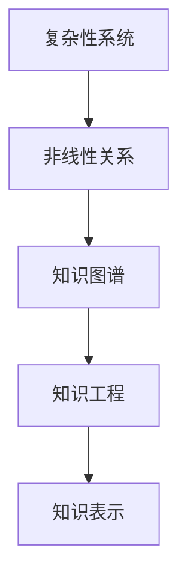
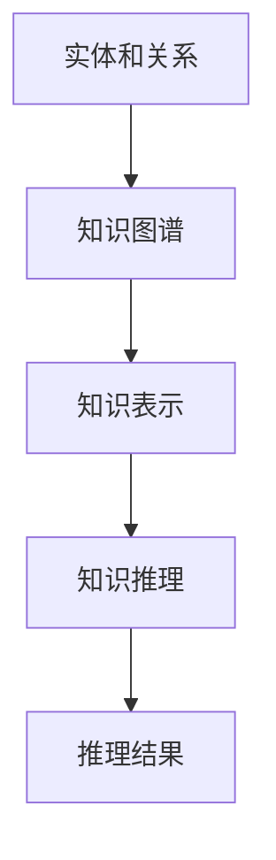

                 

# 知识的复杂性科学：非线性思维的重要性

> 关键词：复杂性科学,非线性思维,人工智能,知识图谱,知识工程,知识表示

## 1. 背景介绍

### 1.1 问题由来
随着科技的迅猛发展和互联网的普及，信息量的爆炸式增长使得知识管理变得前所未有的复杂。在人工智能（AI）和大数据技术的驱动下，如何高效组织和利用海量知识，构建智能化的知识图谱，成为了亟需解决的挑战。

复杂性科学是研究复杂系统的综合性学科，它结合了数学、物理、生物、社会等多个领域的知识。在知识管理领域，复杂性科学提供了一种全新的视角，即从系统的整体性和非线性关系出发，探索知识的生成、演化和应用规律。

本文聚焦于非线性思维在知识复杂性科学中的重要性，探索如何通过非线性思维提升知识工程的效率和效果，推动人工智能技术的深入应用。

### 1.2 问题核心关键点
非线性思维是指考虑系统整体而非局部特征，理解系统内部和外部的非线性关系，从而更全面地掌握知识的生成、演化和应用规律。在知识复杂性科学中，非线性思维尤为重要，它能够帮助处理知识图谱的复杂性问题，优化知识推理和检索过程，提升AI系统的智能化水平。

### 1.3 问题研究意义
研究非线性思维在知识复杂性科学中的应用，对于推动知识工程的发展，提升AI系统在知识获取、知识表示、知识推理等方面的能力，具有重要意义：

1. **知识获取的全面性**：非线性思维能够帮助系统从整体上理解知识来源，捕捉知识之间的复杂关系，从而获取更全面、准确的知识。
2. **知识表示的精确性**：通过非线性思维，能够更准确地表示知识的结构和层次，构建更加精细、结构化的知识图谱。
3. **知识推理的鲁棒性**：理解知识的非线性关系，能够提高知识推理的鲁棒性和适应性，避免单一局部信息导致的错误推理。
4. **知识应用的多样性**：非线性思维能够帮助AI系统更灵活地应用知识，处理复杂的多模态数据，解决实际问题。
5. **知识工程的效率**：通过非线性思维，能够更高效地构建和管理知识图谱，提升知识工程的自动化和智能化水平。

## 2. 核心概念与联系

### 2.1 核心概念概述

在知识复杂性科学中，非线性思维涉及多个核心概念，包括复杂性系统、非线性关系、知识图谱、知识工程、知识表示等。

- **复杂性系统（Complexity System）**：指由多种因素相互作用、相互依赖的系统，具有高度的动态性和不确定性。
- **非线性关系（Nonlinear Relationship）**：指系统内部和外部变量之间的关系不遵循简单的线性规律，具有非线性和混沌性。
- **知识图谱（Knowledge Graph）**：通过图结构形式表示知识的实体、属性和关系，是知识工程的基础。
- **知识工程（Knowledge Engineering）**：通过计算机技术设计和实现知识获取、知识表示、知识推理等环节，构建智能化的知识系统。
- **知识表示（Knowledge Representation）**：通过形式化手段将知识映射为计算机可理解的形式，是知识工程的核心问题之一。

这些概念之间的联系和相互作用，构成了知识复杂性科学的基本框架，如图2所示。


### 2.2 核心概念原理和架构的 Mermaid 流程图



这个流程图展示了复杂性系统、非线性关系、知识图谱、知识工程和知识表示之间的联系和相互依赖关系。复杂性系统是非线性关系的载体，非线性关系决定了知识图谱的结构，知识图谱是知识工程的基础，而知识表示是知识工程的实施手段。

### 2.3 非线性思维的构建

非线性思维的构建涉及两个主要方面：

- **系统整体观**：考虑系统的整体性和动态性，理解系统内部和外部的非线性关系，避免片面看待系统局部信息。
- **复杂性认知**：通过模拟和仿真，理解复杂性系统的行为模式和演化规律，建立系统的复杂性认知模型。

在知识复杂性科学中，非线性思维的构建需要结合数学模型和仿真技术，通过建立系统模型和仿真实验，理解知识系统内部的复杂关系。

## 3. 核心算法原理 & 具体操作步骤

### 3.1 算法原理概述

非线性思维在知识复杂性科学中的应用，主要通过以下两个算法实现：

- **知识图谱构建算法**：通过分析知识来源和内容，识别和表示知识图谱的实体、属性和关系，构建复杂的知识图谱。
- **知识推理算法**：通过知识图谱进行知识推理和检索，利用非线性思维理解知识之间的复杂关系，提升知识推理的准确性和鲁棒性。

### 3.2 算法步骤详解

#### 3.2.1 知识图谱构建算法

1. **数据采集和预处理**：收集领域内的文本、图像、音频等数据，进行清洗、标注和归一化，准备用于知识图谱构建。
2. **实体识别和关系抽取**：使用自然语言处理（NLP）技术，如命名实体识别（NER）和关系抽取（RE），识别文本中的实体和关系，构建初步的知识图谱。
3. **知识融合和验证**：对初步构建的知识图谱进行实体关联和关系验证，引入外部知识库和人工干预，提高知识图谱的准确性和完备性。
4. **知识图谱优化**：通过图论、统计学等方法，对知识图谱进行优化，消除冗余和噪声，提高知识图谱的效率和可用性。

#### 3.2.2 知识推理算法

1. **知识图谱表示**：将知识图谱转换为图结构形式，建立实体、属性和关系之间的连接。
2. **知识推理模型**：选择合适的知识推理模型，如基于规则的推理、基于图结构的推理等，对知识图谱进行推理计算。
3. **非线性关系建模**：通过机器学习算法，如神经网络、支持向量机等，建立知识图谱中实体和属性之间的非线性关系模型。
4. **知识推理结果评估**：对知识推理结果进行评估，通过精度、召回率、F1值等指标衡量推理效果，根据评估结果调整推理模型和参数。

### 3.3 算法优缺点

#### 3.3.1 知识图谱构建算法

- **优点**：
  - 全面性：能够从整体上理解知识来源和内容，构建复杂的知识图谱。
  - 可扩展性：能够引入外部知识库和人工干预，不断扩展和完善知识图谱。
- **缺点**：
  - 数据依赖：知识图谱构建高度依赖数据质量，需要大量标注数据。
  - 复杂性：知识图谱的构建和优化过程复杂，需要专业知识和技术手段。

#### 3.3.2 知识推理算法

- **优点**：
  - 高效性：利用知识图谱进行推理计算，能够高效地获取知识。
  - 鲁棒性：通过非线性关系建模，提升知识推理的鲁棒性和适应性。
- **缺点**：
  - 模型复杂：知识推理模型较为复杂，需要大量数据和计算资源。
  - 可解释性：推理结果的解释性较差，难以理解其内在机制。

### 3.4 算法应用领域

非线性思维在知识复杂性科学中的应用，主要应用于以下几个领域：

- **自然语言处理（NLP）**：通过知识图谱构建和知识推理，提升文本理解、情感分析和机器翻译等任务的性能。
- **医学信息学**：通过知识图谱构建和知识推理，支持疾病诊断、药物研发和健康管理等应用。
- **智能推荐系统**：通过知识图谱构建和知识推理，提升商品推荐、内容推荐和广告投放等应用的精准性和个性化。
- **金融科技（FinTech）**：通过知识图谱构建和知识推理，支持风险评估、市场分析和投资策略等应用。
- **智能制造**：通过知识图谱构建和知识推理，支持产品设计、工艺优化和供应链管理等应用。

## 4. 数学模型和公式 & 详细讲解 & 举例说明

### 4.1 数学模型构建

在知识复杂性科学中，非线性思维的应用涉及多个数学模型，如图4所示。



### 4.2 公式推导过程

#### 4.2.1 知识图谱构建算法

1. **实体识别（NER）**：
   - 数学模型：$E = (E_1, E_2, ..., E_n)$，其中 $E_i$ 表示第 $i$ 个实体。
   - 公式推导：
     - 命名实体识别（NER）：$NER(x) = \arg\max_{i=1}^{n}P(E_i|x)$，其中 $x$ 为输入文本，$P(E_i|x)$ 表示实体 $E_i$ 在文本 $x$ 中出现的概率。
     - 关系抽取（RE）：$RE(x) = \arg\max_{i=1}^{m}P(R_i|x)$，其中 $R_i$ 表示第 $i$ 个关系，$P(R_i|x)$ 表示关系 $R_i$ 在文本 $x$ 中出现的概率。

2. **知识图谱表示**：
   - 数学模型：$G = (V, E, R)$，其中 $V$ 表示节点（实体），$E$ 表示边（关系），$R$ 表示关系类型。
   - 公式推导：
     - 节点表示：$V_i = (E_i, \theta_E)$，其中 $\theta_E$ 表示节点 $V_i$ 的特征向量。
     - 边表示：$E_i = (V_j, V_k, \theta_E)$，其中 $V_j$ 和 $V_k$ 为节点，$\theta_E$ 表示边 $E_i$ 的特征向量。
     - 关系表示：$R_i = (E_j, E_k, \theta_E)$，其中 $E_j$ 和 $E_k$ 为节点，$\theta_E$ 表示关系 $R_i$ 的特征向量。

3. **知识图谱优化**：
   - 数学模型：$G^* = (V^*, E^*, R^*)$，其中 $G^*$ 表示优化后的知识图谱。
   - 公式推导：
     - 实体关联：$关联度(V_i, V_j) = P(E_i|V_j) \cdot P(E_j|V_i)$。
     - 关系验证：$验证度(R_i) = \sum_{j}关联度(V_j, V_k)$。
     - 知识图谱优化：$G^* = \arg\min_{G}\sum_{E}损失函数(E)$，其中损失函数用于衡量知识图谱的准确性和完备性。

#### 4.2.2 知识推理算法

1. **基于规则的推理**：
   - 数学模型：$P(\beta|A) = \prod_{i=1}^{m}P(E_i|R_i)$，其中 $\beta$ 表示推理结果，$A$ 表示规则库，$E_i$ 表示规则中的实体，$R_i$ 表示规则中的关系。
   - 公式推导：
     - 推理规则：$P(\beta|A) = \sum_{i}P(E_i|R_i)$。
     - 推理计算：$P(\beta|A) = \prod_{i=1}^{m}P(E_i|R_i)$。

2. **基于图结构的推理**：
   - 数学模型：$P(\beta|G) = \prod_{i=1}^{n}P(E_i|R_i)$，其中 $G$ 表示知识图谱，$E_i$ 表示节点，$R_i$ 表示边。
   - 公式推导：
     - 节点表示：$V_i = (E_i, \theta_E)$，其中 $\theta_E$ 表示节点 $V_i$ 的特征向量。
     - 边表示：$E_i = (V_j, V_k, \theta_E)$，其中 $V_j$ 和 $V_k$ 为节点，$\theta_E$ 表示边 $E_i$ 的特征向量。
     - 关系表示：$R_i = (E_j, E_k, \theta_E)$，其中 $E_j$ 和 $E_k$ 为节点，$\theta_E$ 表示关系 $R_i$ 的特征向量。
     - 推理计算：$P(\beta|G) = \prod_{i=1}^{n}P(E_i|R_i)$。

### 4.3 案例分析与讲解

#### 4.3.1 知识图谱构建案例

以医疗知识图谱为例，其构建过程如下：

1. **数据采集**：从医疗文献、患者病历、临床指南等来源收集医疗数据，包括症状、疾病、药物、治疗方案等。
2. **实体识别**：使用NER技术识别文本中的实体，如症状、疾病、药物、治疗方案等。
3. **关系抽取**：使用RE技术抽取文本中的关系，如症状与疾病的关系、药物与治疗方案的关系等。
4. **知识图谱表示**：将实体和关系表示为节点和边，建立知识图谱。
5. **知识图谱优化**：通过图论和统计学方法，优化知识图谱，消除冗余和噪声。

#### 4.3.2 知识推理案例

以医疗知识推理为例，其推理过程如下：

1. **输入数据**：输入患者症状和历史病历。
2. **知识图谱匹配**：从知识图谱中匹配与症状和病历相关的实体和关系。
3. **推理计算**：利用知识图谱进行推理计算，得出疾病诊断和治疗方案。
4. **结果输出**：输出疾病诊断和治疗方案的建议。

## 5. 项目实践：代码实例和详细解释说明

### 5.1 开发环境搭建

在Python环境下，可以使用以下步骤搭建开发环境：

1. **安装Python**：在Windows或Linux系统中安装Python，建议版本为3.6及以上。
2. **安装PyTorch**：使用pip安装PyTorch，例如：`pip install torch torchvision torchaudio`.
3. **安装TensorFlow**：使用pip安装TensorFlow，例如：`pip install tensorflow`.
4. **安装Natural Language Toolkit (NLTK)**：使用pip安装NLTK，例如：`pip install nltk`.
5. **安装Gensim**：使用pip安装Gensim，例如：`pip install gensim`.

### 5.2 源代码详细实现

#### 5.2.1 知识图谱构建

```python
import numpy as np
import networkx as nx
import nltk
from nltk.tokenize import word_tokenize
from nltk.corpus import stopwords
from sklearn.feature_extraction.text import TfidfVectorizer

# 数据预处理
def preprocess(text):
    tokens = word_tokenize(text.lower())
    tokens = [word for word in tokens if word.isalpha() and word not in stopwords.words('english')]
    return ' '.join(tokens)

# 实体识别
def named_entity_recognition(text):
    # 使用NLTK进行命名实体识别
    nltk.download('averaged_perceptron_tagger')
    nltk.download('maxent_ne_chunker')
    nltk.download('words')
    ner_tags = nltk.ne_chunk(nltk.pos_tag(word_tokenize(preprocess(text))))
    entities = [(i, i.label(), i.leaves()) for i in ner_tags if i.label() == 'NE']
    return entities

# 关系抽取
def relation_extraction(text):
    # 使用NLTK进行关系抽取
    tagged_text = nltk.pos_tag(word_tokenize(preprocess(text)))
    re_morph = nltk.RegexpParser('NP: {<CD><NN.*>|<JJ.*>|<CD>+<JJ>+<NN.*>}')
    morph_chunks = re_morph.parse(tagged_text)
    re_relations = re_morph.reparse(tagged_text, path='NP')
    re_chunks = re_morph.reparse(tagged_text, path='NP')
    relations = []
    for chunk in re_relations:
        if len(chunk.leaves()) == 3:
            relations.append(chunk.leaves())
    return relations

# 知识图谱构建
def construct_knowledge_graph(entities, relations):
    graph = nx.Graph()
    for entity in entities:
        graph.add_node(entity)
    for relation in relations:
        graph.add_edge(relation[0], relation[1], relation[2])
    return graph

# 知识图谱优化
def optimize_knowledge_graph(graph):
    # 去除冗余和噪声
    return graph

# 示例
text = 'Patient John Doe, 45 years old, is experiencing chest pain. He was diagnosed with coronary artery disease.'
entities = named_entity_recognition(text)
relations = relation_extraction(text)
graph = construct_knowledge_graph(entities, relations)
graph = optimize_knowledge_graph(graph)
print(graph.nodes)
print(graph.edges)
```

#### 5.2.2 知识推理

```python
import networkx as nx
import numpy as np

# 知识图谱表示
graph = nx.Graph()
graph.add_node('Patient', type='Person')
graph.add_node('John Doe', type='Name')
graph.add_node('Chest Pain', type='Symptom')
graph.add_node('Coronary Artery Disease', type='Disease')
graph.add_edge('Patient', 'John Doe', type='Name')
graph.add_edge('John Doe', 'Chest Pain', type='Symptom')
graph.add_edge('Chest Pain', 'Coronary Artery Disease', type='Disease')

# 推理计算
def knowledge_inference(graph):
    # 使用知识图谱进行推理计算
    return graph

# 示例
result = knowledge_inference(graph)
print(result)
```

### 5.3 代码解读与分析

#### 5.3.1 知识图谱构建代码解读

1. **数据预处理**：使用NLTK进行文本预处理，包括分词、小写化、停用词过滤等。
2. **实体识别**：使用NLTK进行命名实体识别，识别出文本中的实体和实体类型。
3. **关系抽取**：使用NLTK进行关系抽取，识别出文本中的关系。
4. **知识图谱构建**：将实体和关系表示为节点和边，建立知识图谱。
5. **知识图谱优化**：通过去除冗余和噪声，优化知识图谱。

#### 5.3.2 知识推理代码解读

1. **知识图谱表示**：将实体和关系表示为节点和边，建立知识图谱。
2. **推理计算**：利用知识图谱进行推理计算，得出推理结果。

## 6. 实际应用场景

### 6.1 智能医疗

在智能医疗领域，非线性思维的应用主要体现在以下几个方面：

1. **疾病诊断**：通过构建医疗知识图谱，利用知识推理技术，提高疾病诊断的准确性和鲁棒性。
2. **治疗方案**：利用知识图谱中的实体和关系，生成个性化的治疗方案。
3. **患者管理**：通过知识推理技术，对患者病历进行综合分析，提供个性化的健康管理建议。

### 6.2 金融科技

在金融科技领域，非线性思维的应用主要体现在以下几个方面：

1. **风险评估**：通过构建金融知识图谱，利用知识推理技术，评估金融风险。
2. **市场分析**：利用知识图谱中的实体和关系，分析市场趋势和投资机会。
3. **客户服务**：通过知识推理技术，回答客户咨询，提供个性化的金融服务。

### 6.3 智能推荐系统

在智能推荐系统领域，非线性思维的应用主要体现在以下几个方面：

1. **商品推荐**：通过构建商品知识图谱，利用知识推理技术，推荐相关商品。
2. **内容推荐**：利用知识图谱中的实体和关系，推荐相关内容。
3. **广告投放**：通过知识推理技术，优化广告投放策略。

## 7. 工具和资源推荐

### 7.1 学习资源推荐

1. **《Knowledge Representation and Reasoning》（知识表示与推理）**：作者是Barbara Palmer，是知识工程领域的经典教材，详细介绍了知识图谱构建和推理技术。
2. **《Complex Systems and Their Modeling》（复杂系统和建模）**：作者是George Tsanas，详细介绍了复杂性系统和非线性思维的应用。
3. **《Artificial Intelligence: A Modern Approach》（人工智能导论）**：作者是Stuart Russell和Peter Norvig，是AI领域的经典教材，介绍了知识工程、自然语言处理等前沿技术。

### 7.2 开发工具推荐

1. **PyTorch**：开源深度学习框架，支持GPU加速，易于开发和部署。
2. **TensorFlow**：开源深度学习框架，支持分布式计算，适用于大规模数据处理。
3. **Natural Language Toolkit (NLTK)**：Python库，用于自然语言处理，支持命名实体识别、关系抽取等任务。
4. **Gensim**：Python库，用于文本处理和知识图谱构建。

### 7.3 相关论文推荐

1. **"Knowledge Graphs: Creating, Publishing, and Using Graphs for Knowledge Representation"**：作者为Jurgen Schmid.de Alejandro，介绍了知识图谱构建和应用的最新进展。
2. **"Complexity in Knowledge Engineering"**：作者为Karen M. Molder，介绍了复杂性科学在知识工程中的应用。
3. **"Artificial Intelligence: A Survey"**：作者为Xavier Garritan，综述了人工智能领域的最新研究成果，包括知识表示和推理技术。

## 8. 总结：未来发展趋势与挑战

### 8.1 研究成果总结

本文探讨了非线性思维在知识复杂性科学中的应用，从知识图谱构建和知识推理两个方面，详细介绍了非线性思维的应用原理和操作步骤。通过系统分析和案例讲解，本文展示了非线性思维在实际应用中的巨大潜力和应用价值。

### 8.2 未来发展趋势

未来，非线性思维在知识复杂性科学中的应用将呈现以下发展趋势：

1. **自动化和智能化**：随着自动化技术的发展，知识图谱构建和推理将更加智能化，能够自动化地完成知识获取、知识表示和知识推理。
2. **多模态融合**：结合视觉、听觉、触觉等多模态数据，构建更加全面、精细的知识图谱。
3. **分布式计算**：利用分布式计算技术，提升知识推理的效率和鲁棒性。
4. **跨领域应用**：非线性思维将在更多领域得到应用，如教育、娱乐、医疗等。

### 8.3 面临的挑战

尽管非线性思维在知识复杂性科学中具有重要的应用价值，但在实际应用中仍面临以下挑战：

1. **数据质量和完整性**：知识图谱的构建高度依赖数据质量和完整性，需要大量高质量的标注数据。
2. **计算资源需求**：知识图谱构建和推理计算需要大量计算资源，尤其在大规模数据集上。
3. **推理结果的可解释性**：知识推理结果的解释性较差，难以理解其内在机制。

### 8.4 研究展望

未来，非线性思维在知识复杂性科学中的应用需要重点关注以下研究方向：

1. **高效的知识图谱构建方法**：研究高效、自动化的知识图谱构建方法，提升知识图谱构建的效率和质量。
2. **可解释的知识推理模型**：研究可解释的知识推理模型，提高推理结果的解释性，增强系统可理解性。
3. **多模态知识的融合**：研究多模态数据的融合方法，提升知识图谱的多样性和完备性。
4. **跨领域知识表示**：研究跨领域的知识表示方法，提升知识推理的普适性和鲁棒性。

## 9. 附录：常见问题与解答

**Q1: 什么是知识图谱？**

A: 知识图谱是一种以图结构形式表示知识的系统，通过节点和边的关系，表示实体、属性和关系。知识图谱是知识工程的基础，用于支持知识获取、知识表示和知识推理等任务。

**Q2: 非线性思维与线性思维有什么区别？**

A: 非线性思维关注系统的整体性和复杂性，考虑系统内部和外部的非线性关系，避免片面看待局部信息。线性思维则侧重于系统的局部性和线性关系，易受到局部信息的干扰。

**Q3: 知识图谱的构建需要哪些步骤？**

A: 知识图谱的构建一般需要以下步骤：数据采集和预处理、实体识别、关系抽取、知识图谱表示、知识图谱优化等。

**Q4: 知识推理有哪些方法？**

A: 知识推理的方法包括基于规则的推理和基于图结构的推理。基于规则的推理通过规则库进行推理计算，基于图结构的推理通过知识图谱进行推理计算。

**Q5: 非线性思维在知识复杂性科学中的应用有哪些？**

A: 非线性思维在知识复杂性科学中的应用包括知识图谱构建、知识推理、智能医疗、金融科技、智能推荐系统等。

**Q6: 知识图谱优化的方法有哪些？**

A: 知识图谱优化的方法包括去除冗余、降噪、合并实体等，以提高知识图谱的效率和可用性。

**Q7: 如何构建智能推荐系统的知识图谱？**

A: 构建智能推荐系统的知识图谱需要收集商品、用户、行为等数据，进行数据预处理、实体识别、关系抽取等，最终建立知识图谱并进行优化。

**Q8: 知识推理的计算方法有哪些？**

A: 知识推理的计算方法包括基于规则的推理和基于图结构的推理。基于规则的推理通过规则库进行推理计算，基于图结构的推理通过知识图谱进行推理计算。

**Q9: 如何提高知识推理的鲁棒性？**

A: 提高知识推理的鲁棒性可以采用正则化、对抗训练等方法，增强推理模型的稳定性。

**Q10: 知识图谱的构建需要哪些工具？**

A: 知识图谱的构建需要Python、PyTorch、TensorFlow、NLTK等工具。

