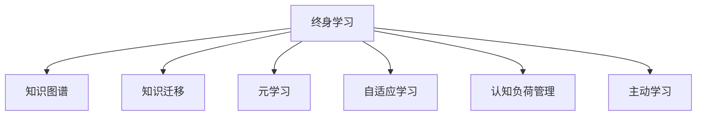

                 

## 1. 背景介绍

在日新月异的科技领域，知识更新速度之快，令人目不暇接。从人工智能到区块链，从量子计算到生物工程，每个领域都在迅速发展和迭代。在这种背景下，终身学习（Lifelong Learning）成为每个从业者必须具备的能力。终身学习不仅关乎职业发展，更是对个人成长和适应未来的挑战。本文将从多个角度探讨终身学习的必要性和实践方法，希望为读者提供有价值的见解和指导。

## 2. 核心概念与联系

### 2.1 核心概念概述

在深入探讨终身学习的概念和实践前，我们需要先明确一些核心概念：

- **终身学习**（Lifelong Learning）：一种持续不断、贯穿个人整个职业生涯的学习方式。它强调在知识和技能不断变化的环境中，通过不断学习和适应新知识，保持个人和职业的持续成长。
- **知识图谱**：一种以图形式表示知识结构的工具，通过节点和边的关系，构建知识之间的关联。
- **知识迁移**：指将在一个领域学到的知识应用到另一个领域的过程，可以帮助学习者更快地掌握新知识。
- **元学习**：一种学习如何学习的策略，使学习者能够通过少量样本数据快速适应新任务。
- **自适应学习**：根据学习者的反馈和表现，自动调整学习内容和策略，提升学习效率。
- **认知负荷**：学习过程中，大脑需要处理的信息量。过多的认知负荷会降低学习效果。

### 2.2 核心概念原理和架构的 Mermaid 流程图



这个流程图展示了终身学习与其他核心概念的联系。终身学习通过构建知识图谱、利用知识迁移、应用元学习、实现自适应学习和有效管理认知负荷，最终实现主动学习，提升学习效果。

## 3. 核心算法原理 & 具体操作步骤

### 3.1 算法原理概述

终身学习的核心在于通过持续学习和适应新知识，不断提升个人和职业能力。其算法原理可以归纳为以下几个方面：

1. **知识图谱构建**：通过网络爬虫、知识库整合等方式，构建领域知识图谱。知识图谱不仅包括事实信息，还涵盖概念、关系等，有助于理解复杂概念和知识结构。

2. **知识迁移**：利用预训练模型、迁移学习等方法，将已有知识迁移到新领域。例如，在自然语言处理领域，可以先将BERT等模型在通用数据上预训练，然后针对具体任务进行微调，提升模型在新领域的性能。

3. **元学习**：通过学习如何快速学习新任务，提高学习效率。例如，在深度学习中，可以使用Meta-Learning算法，如MAML（Model-Agnostic Meta-Learning），通过少量数据适应新任务。

4. **自适应学习**：根据学习者的表现和反馈，动态调整学习内容和策略。例如，在在线教育平台，可以实时分析学习者的答题情况和进度，调整推荐内容和学习路径。

5. **认知负荷管理**：合理设计学习内容和结构，避免过载。例如，将复杂概念拆分为多个小节，逐步学习，减少一次性信息过载。

### 3.2 算法步骤详解

1. **知识图谱构建**：
   - 数据收集：利用网络爬虫从权威网站、学术论文等获取知识数据。
   - 知识融合：整合多个知识源，消除冗余，保留高质量知识。
   - 图谱构建：将知识数据转换为节点和边的形式，构建知识图谱。

2. **知识迁移**：
   - 预训练模型选择：选择适合目标领域的预训练模型，如BERT、GPT等。
   - 微调策略设计：根据任务特点，设计微调策略，保留重要层，只微调顶层。
   - 模型评估：在验证集上评估模型性能，调整超参数。

3. **元学习**：
   - 数据集选择：选择具有代表性的少量数据集。
   - 元算法选择：选择适合的元学习算法，如MAML、Proximal Policy Optimization（PPO）等。
   - 模型训练：在元数据集上训练元模型，优化学习策略。

4. **自适应学习**：
   - 反馈机制设计：设计反馈机制，实时收集学习者表现数据。
   - 模型调整：根据反馈数据，动态调整学习内容和策略。
   - 效果评估：定期评估学习效果，优化调整策略。

5. **认知负荷管理**：
   - 知识拆分：将复杂知识拆分为多个小节，逐步学习。
   - 交互式学习：通过互动问答、模拟实验等方式，增强理解和记忆。
   - 学习时间管理：合理分配学习时间，避免过载。

### 3.3 算法优缺点

**优点**：
1. **高效学习**：终身学习通过持续学习和知识迁移，可以快速掌握新知识。
2. **提升技能**：元学习和自适应学习，可以不断优化学习策略，提升技能水平。
3. **灵活应用**：认知负荷管理有助于适应不同学习者的需求，灵活调整学习内容。

**缺点**：
1. **成本高**：构建知识图谱和设计学习算法需要较高的技术水平和资源投入。
2. **复杂性高**：终身学习涉及多个概念和技术，需要系统化的学习和实践。
3. **难以标准化**：不同领域、不同学习者需求差异大，难以制定统一的标准。

### 3.4 算法应用领域

终身学习在多个领域都有广泛应用，以下是几个典型的应用场景：

1. **人工智能**：
   - 深度学习：利用元学习和自适应学习，优化模型参数和训练策略。
   - 自然语言处理：通过知识迁移和认知负荷管理，提升模型理解和生成能力。

2. **教育**：
   - 在线教育：根据学习者的反馈和表现，动态调整推荐内容和路径。
   - 智能辅导：通过知识图谱和元学习，提供个性化辅导和学习建议。

3. **医疗**：
   - 医学知识图谱：构建医学知识图谱，辅助医生诊断和治疗。
   - 患者教育：通过知识迁移和自适应学习，提升患者的疾病认知和治疗依从性。

4. **金融**：
   - 风险管理：通过知识迁移和元学习，预测市场变化和风险。
   - 投资策略：利用自适应学习和认知负荷管理，优化投资组合和策略。

## 4. 数学模型和公式 & 详细讲解 & 举例说明

### 4.1 数学模型构建

终身学习的数学模型可以抽象为以下形式：

- **知识图谱**：用图论中的节点和边表示知识结构，记为 $G(V,E)$，其中 $V$ 表示知识节点集合，$E$ 表示知识边集合。
- **知识迁移**：通过预训练模型和微调，将知识图谱中的知识迁移到新领域，记为 $M_{\theta}$。
- **元学习**：学习如何快速适应新任务，记为 $f_{\phi}(\theta)$。
- **自适应学习**：根据学习者的反馈，动态调整学习策略，记为 $A_{\alpha}(\mathcal{D})$。
- **认知负荷管理**：通过学习时间和内容的设计，减少认知负荷，记为 $C_{\beta}(\mathcal{L})$。

### 4.2 公式推导过程

以知识迁移为例，假设预训练模型为 $M_{\theta}$，目标任务为 $T$，知识图谱为 $G(V,E)$。

1. **预训练模型选择**：
   - 选择适合目标任务的预训练模型，如BERT、GPT等。
   - 初始化模型参数 $\theta$。

2. **微调策略设计**：
   - 保留底层参数，只微调顶层。
   - 设计合适的微调目标函数，如交叉熵损失。

3. **模型评估**：
   - 在验证集上评估模型性能，使用验证误差 $\epsilon$ 作为指标。
   - 调整超参数，如学习率 $\eta$、批大小 $b$ 等。

4. **模型训练**：
   - 使用梯度下降算法，更新模型参数。
   - 设置迭代轮数 $N$，迭代 $N$ 次更新参数。

### 4.3 案例分析与讲解

**案例：自然语言处理中的知识迁移**

在自然语言处理领域，可以使用BERT等预训练模型进行知识迁移。例如，将BERT在通用语料上预训练后，针对特定的问答任务进行微调。

1. **预训练模型选择**：
   - 选择BERT作为预训练模型。
   - 初始化BERT的模型参数 $\theta$。

2. **微调策略设计**：
   - 保留BERT的底两层参数，只微调顶层。
   - 设计交叉熵损失函数，用于评估模型性能。

3. **模型评估**：
   - 在验证集上评估模型性能，使用验证误差 $\epsilon$ 作为指标。
   - 调整学习率 $\eta$ 和批大小 $b$。

4. **模型训练**：
   - 使用梯度下降算法，更新BERT的参数。
   - 设置迭代轮数 $N=5$，迭代 $N$ 次更新参数。

## 5. 项目实践：代码实例和详细解释说明

### 5.1 开发环境搭建

为了进行终身学习的项目实践，我们需要搭建合适的开发环境。以下是一些推荐的步骤：

1. **安装Python**：确保Python版本为3.6或以上。
2. **安装PyTorch**：通过pip安装PyTorch，支持深度学习和神经网络。
3. **安装TensorFlow**：通过pip安装TensorFlow，支持更广泛的计算图。
4. **安装其他库**：安装Pandas、NumPy、SciPy等常用库，用于数据处理和科学计算。

### 5.2 源代码详细实现

以下是一个简化的PyTorch代码示例，用于知识迁移的微调：

```python
import torch
import torch.nn as nn
import torch.optim as optim
from transformers import BertTokenizer, BertForQuestionAnswering

# 定义模型和优化器
model = BertForQuestionAnswering.from_pretrained('bert-base-uncased')
optimizer = optim.Adam(model.parameters(), lr=2e-5)

# 定义损失函数
criterion = nn.CrossEntropyLoss()

# 加载数据集
tokenizer = BertTokenizer.from_pretrained('bert-base-uncased')
train_dataset = ...

# 训练函数
def train(epoch):
    model.train()
    for batch in train_loader:
        inputs, targets = batch
        outputs = model(inputs)
        loss = criterion(outputs, targets)
        optimizer.zero_grad()
        loss.backward()
        optimizer.step()

# 评估函数
def evaluate():
    model.eval()
    with torch.no_grad():
        evaluator = ...
        results = evaluator(model, dev_loader)
        print(results)

# 启动训练流程
train_epochs = 5
train_loader = ...

for epoch in range(train_epochs):
    train(epoch)
    evaluate()

# 保存模型
torch.save(model.state_dict(), 'model.pth')
```

### 5.3 代码解读与分析

**代码解读**：
- `BertForQuestionAnswering`：从预训练模型中加载BERT模型。
- `Adam`：使用Adam优化器进行模型训练。
- `CrossEntropyLoss`：使用交叉熵损失函数。
- `train_loader`：定义训练数据加载器。
- `train` 和 `evaluate`：定义训练和评估函数。

**分析**：
- 代码中展示了如何使用PyTorch和Transformers库进行BERT模型的微调。
- 训练函数中，通过循环迭代训练集，更新模型参数。
- 评估函数中，通过验证集评估模型性能，调整学习策略。
- 最后保存模型，以备后续使用。

## 6. 实际应用场景

### 6.1 教育

终身学习在教育领域的应用非常广泛，尤其是在线教育和智能辅导系统。例如，Coursera、edX等平台通过不断更新课程内容，提供最新的学习资源，帮助学生快速适应新知识。

### 6.2 医疗

在医疗领域，终身学习可以帮助医生不断更新医疗知识，提升诊断和治疗能力。例如，利用知识图谱和预训练模型，快速掌握新药和治疗方案。

### 6.3 金融

金融领域需要持续更新市场信息和分析模型，终身学习可以帮助分析师快速适应新情况。例如，通过元学习和自适应学习，预测市场趋势，优化投资策略。

### 6.4 未来应用展望

未来，终身学习将在更多领域得到应用，为人类社会带来深远影响。以下是几个值得关注的趋势：

1. **自动化**：随着AI技术的发展，越来越多的任务将自动化，无需人工干预。
2. **个性化**：利用终身学习，可以提供个性化的学习和发展路径，满足不同需求。
3. **跨领域**：终身学习能够跨领域应用，如自然语言处理、医学、金融等，实现多领域知识的融合。
4. **协作学习**：通过知识图谱和元学习，促进人类与AI的协作，提升整体学习效率。
5. **自适应系统**：构建自适应学习系统，根据学习者的表现动态调整学习内容和策略。

## 7. 工具和资源推荐

### 7.1 学习资源推荐

1. **Coursera**：提供大量在线课程，涵盖计算机科学、数据科学等多个领域，帮助学习者系统掌握知识。
2. **edX**：与全球顶尖大学合作，提供高质量的在线课程和专业认证。
3. **Kaggle**：提供大量数据集和竞赛，帮助学习者提升数据分析和机器学习技能。
4. **arXiv**：提供大量学术论文，帮助学习者了解最新的科研进展和前沿技术。
5. **GitHub**：提供大量开源项目和代码库，帮助学习者快速上手实践。

### 7.2 开发工具推荐

1. **PyTorch**：深度学习框架，支持动态计算图，适合快速迭代研究。
2. **TensorFlow**：深度学习框架，支持分布式计算，适合大规模工程应用。
3. **Transformers**：自然语言处理工具库，提供大量预训练模型和微调样例。
4. **Jupyter Notebook**：交互式编程环境，支持Python和R等多种语言。
5. **Colab**：谷歌提供的在线Jupyter Notebook环境，免费提供GPU/TPU算力。

### 7.3 相关论文推荐

1. **Lifelong Learning for AI**：探讨终身学习的理论基础和应用方法，帮助理解终身学习的核心概念。
2. **Knowledge Graphs for Lifelong Learning**：介绍知识图谱在终身学习中的作用，帮助构建领域知识图谱。
3. **Meta-Learning in Deep Learning**：介绍元学习的原理和应用，帮助理解如何通过元学习提升学习效率。
4. **Adaptive Learning in AI**：探讨自适应学习的原理和应用，帮助理解如何动态调整学习策略。
5. **Cognitive Load Management in AI**：介绍认知负荷管理的原理和应用，帮助理解如何优化学习内容和结构。

## 8. 总结：未来发展趋势与挑战

### 8.1 研究成果总结

终身学习是未来人工智能发展的重要方向，其研究成果已经涉及多个领域。通过构建知识图谱、利用知识迁移、应用元学习和自适应学习，可以在多个领域实现快速学习和适应。

### 8.2 未来发展趋势

1. **知识图谱的扩展**：随着数据量的增加，知识图谱将越来越丰富和详细，帮助学习者更好地理解和掌握知识。
2. **元学习的普及**：元学习将成为AI系统的重要组成部分，帮助学习系统快速适应新任务。
3. **自适应系统的完善**：自适应学习系统将越来越普及，帮助学习者个性化学习，提高学习效果。
4. **认知负荷的优化**：通过合理设计学习内容和结构，减少认知负荷，提升学习效率。
5. **跨领域知识的融合**：终身学习将促进多领域知识的融合，实现跨领域应用。

### 8.3 面临的挑战

尽管终身学习具有广阔的前景，但在实现过程中仍面临诸多挑战：

1. **数据获取难度**：构建高质量的知识图谱需要大量数据，数据获取难度较大。
2. **模型复杂性**：终身学习涉及多个概念和技术，模型设计复杂。
3. **计算资源需求高**：终身学习需要大量计算资源，计算成本较高。
4. **知识迁移效果不佳**：知识迁移效果受预训练模型和微调策略的影响，效果不稳定。
5. **认知负荷管理难度大**：合理设计学习内容和结构需要大量实验和调整。

### 8.4 研究展望

未来的研究需要在以下几个方面寻求新的突破：

1. **自动化知识获取**：通过自动化数据收集和知识图谱构建，降低数据获取难度。
2. **高效模型设计**：优化模型结构，提高学习效率，降低计算资源需求。
3. **多模态学习**：将视觉、语音等多模态信息与文本信息结合，提升终身学习的效果。
4. **跨领域知识迁移**：利用元学习和自适应学习，促进跨领域知识的迁移和应用。
5. **认知负荷优化**：通过交互式学习和自适应学习，合理设计学习内容和结构，减少认知负荷。

## 9. 附录：常见问题与解答

**Q1: 终身学习是否适用于所有领域？**

A: 终身学习在多个领域都有广泛应用，如教育、医疗、金融等。但对于某些特殊领域，如军事、法律等，需要结合领域特点进行定制化设计。

**Q2: 终身学习是否需要大量时间投入？**

A: 终身学习需要系统化的学习和实践，但通过合理设计学习内容和策略，可以在较短时间内取得显著效果。利用在线课程和自适应学习系统，可以大大减少学习时间和成本。

**Q3: 终身学习是否需要高昂的计算资源？**

A: 终身学习需要一定的计算资源，但可以通过并行计算、分布式训练等方法，优化资源利用率，降低计算成本。

**Q4: 终身学习是否需要专业知识？**

A: 终身学习需要一定的专业知识基础，但通过在线课程和自学资源，可以逐步掌握相关知识，逐步深入学习。

**Q5: 终身学习是否适合所有人？**

A: 终身学习适用于大多数需要持续学习和适应新知识的人群，但需要根据个人情况和兴趣进行选择。

---

作者：禅与计算机程序设计艺术 / Zen and the Art of Computer Programming

