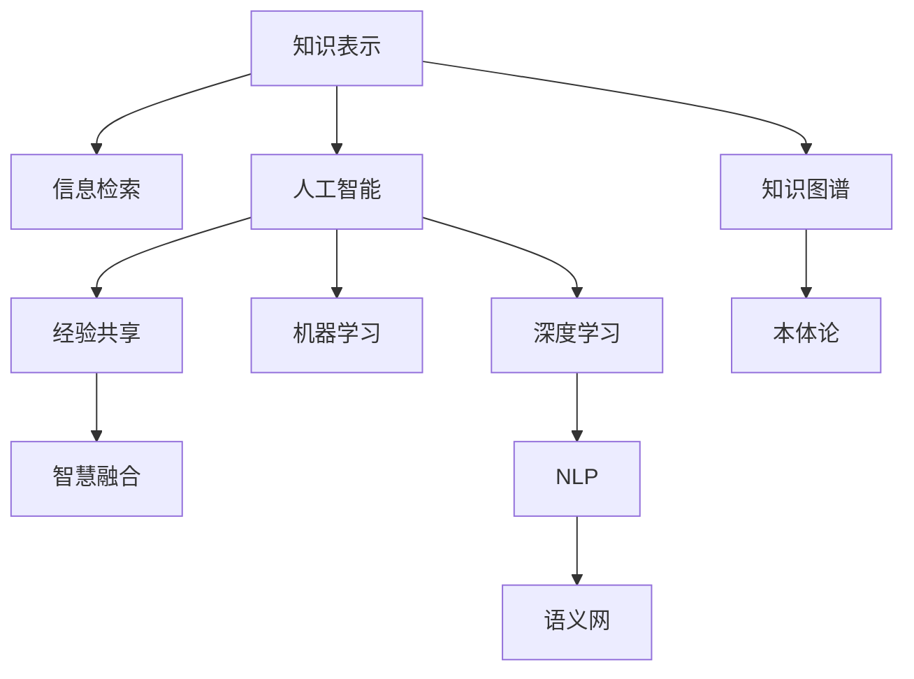

                 

# 知识的本质：信息、经验与智慧的融合

> 关键词：知识表示, 信息检索, 人工智能, 经验共享, 智慧融合

## 1. 背景介绍

### 1.1 问题由来

在现代信息社会，知识的获取、存储、检索和应用已经成为了推动社会进步和人类发展的重要力量。然而，随着信息量的爆炸式增长，如何高效地管理和利用这些知识成为了一个严峻的挑战。特别是在复杂的大数据环境中，知识的本质是什么？它如何被表示和理解？这些问题对于构建高效、智能的知识处理系统至关重要。

### 1.2 问题核心关键点

本文聚焦于知识的本质，探索信息、经验与智慧的融合，旨在回答以下核心问题：
- 知识的本质是什么？它如何被表示和理解？
- 信息检索技术的本质是什么？它如何提升知识获取效率？
- 人工智能在知识处理中的应用有哪些？它如何促进知识共享和智慧融合？

### 1.3 问题研究意义

研究知识的本质，对于构建高效、智能的知识处理系统，具有重要意义：
- 推动信息检索技术的发展。理解知识的本质，有助于设计更高效、更智能的信息检索系统，提升信息获取效率。
- 促进人工智能在知识处理中的应用。知识的本质研究有助于揭示人工智能如何更有效地处理和应用知识，推动AI技术的发展和应用。
- 推动智慧社会的构建。通过知识的深度融合和共享，促进人类智慧的全面发展，推动社会进步。

## 2. 核心概念与联系

### 2.1 核心概念概述

为更好地理解知识本质及其相关技术，本节将介绍几个关键概念：

- **知识表示**：指将知识转换为计算机可处理的形式，便于存储、检索和应用。常见的知识表示方法包括语义网、知识图谱、本体论等。
- **信息检索**：指根据用户查询，在大量文本、图像、视频等数据中检索出相关信息的系统。常见的信息检索技术包括文本检索、图像检索、视频检索等。
- **人工智能**：指通过计算机模拟人类智能过程，实现自主学习、推理、决策等功能的系统。常见的AI技术包括机器学习、深度学习、自然语言处理等。
- **经验共享**：指通过网络平台，将个人的知识、经验和见解分享给他人，促进知识传播和应用。常见的经验共享方式包括博客、社交媒体、知识库等。
- **智慧融合**：指将来自不同领域、不同来源的知识融合起来，形成更加全面、深刻的智慧。智慧融合要求知识表示、信息检索、人工智能等技术的深度结合。

这些核心概念之间的逻辑关系可以通过以下Mermaid流程图来展示：



这个流程图展示了几大核心概念及其之间的关系：

1. 知识表示通过知识图谱、本体论等方法，将知识转换为可处理的形式。
2. 信息检索系统通过文本检索、图像检索等技术，从数据中检索出相关知识。
3. 人工智能通过机器学习、深度学习、自然语言处理等技术，实现知识的理解和应用。
4. 经验共享通过博客、社交媒体等平台，促进知识的传播和应用。
5. 智慧融合通过知识图谱、本体论等方法，将不同来源的知识融合起来，形成更加深刻的智慧。

这些概念共同构成了知识处理系统的基本框架，对于理解知识本质和构建高效智能系统具有重要意义。

## 3. 核心算法原理 & 具体操作步骤
### 3.1 算法原理概述

知识的本质在于其信息、经验和智慧的融合。这一融合过程可以通过以下几个步骤实现：

1. **知识表示**：将知识转换为计算机可处理的形式，如语义网、知识图谱等。
2. **信息检索**：根据用户查询，从大规模数据中检索出相关知识。
3. **人工智能**：通过机器学习、深度学习等技术，实现知识的自动理解和应用。
4. **经验共享**：通过网络平台，促进知识的传播和应用。
5. **智慧融合**：将不同来源的知识融合起来，形成更加深刻的智慧。

### 3.2 算法步骤详解

基于知识本质的融合过程，可以设计出一系列算法步骤，用于实现高效的知识处理系统。

**Step 1: 知识表示与构建**
- 选择合适的知识表示方法，如知识图谱、本体论等。
- 收集领域相关的知识数据，构建知识表示模型。
- 使用自然语言处理技术，将领域术语映射为标准化的知识表示。

**Step 2: 信息检索与匹配**
- 设计高效的信息检索算法，如向量空间模型、深度学习检索等。
- 根据用户查询，检索出相关的知识表示。
- 使用相似度匹配技术，评估检索结果的相关性。

**Step 3: 知识抽取与整合**
- 使用自然语言处理技术，从文本、图像等数据中抽取知识实体和关系。
- 将抽取的知识实体和关系整合到知识表示模型中。
- 应用图神经网络等技术，实现知识的自动整合和推理。

**Step 4: 人工智能与知识应用**
- 选择合适的机器学习或深度学习模型，如RNN、Transformer等。
- 训练模型，使其能够自动理解知识表示，生成相关知识。
- 将生成的知识应用于实际任务，如问答系统、推荐系统等。

**Step 5: 经验共享与智慧融合**
- 建立知识共享平台，支持用户上传、分享知识。
- 使用社交网络分析技术，挖掘知识传播路径和影响力。
- 将不同来源的知识融合到知识表示模型中，形成更加全面的智慧。

### 3.3 算法优缺点

基于知识本质的融合算法具有以下优点：
1. 高效的知识表示与检索。选择合适的知识表示方法，可以大大提升知识获取和检索的效率。
2. 智能的知识理解与生成。通过人工智能技术，可以实现知识的自动理解与生成，降低人工干预成本。
3. 促进知识的传播与共享。经验共享平台可以有效促进知识的传播，提升知识的利用率。
4. 形成更加全面的智慧。智慧融合技术可以将不同来源的知识融合起来，形成更加全面、深刻的智慧。

同时，该算法也存在一定的局限性：
1. 知识表示复杂度高。选择合适的知识表示方法，需要较高的专业知识和实践经验。
2. 数据多样性问题。不同领域的数据特性不同，单一的知识表示方法可能难以有效处理。
3. 智能算法的可解释性不足。一些深度学习模型如Transformer，缺乏可解释性，难以理解其内部工作机制。
4. 知识共享的安全性问题。在共享知识时，可能存在隐私泄露、数据侵权等问题。

尽管存在这些局限性，但就目前而言，基于知识本质的融合算法仍是知识处理的主流范式。未来相关研究的重点在于如何进一步简化知识表示和检索过程，提高智能算法的可解释性，同时兼顾数据隐私和安全等因素。

### 3.4 算法应用领域

基于知识本质的融合算法已经在多个领域得到了广泛的应用，例如：

- 医疗领域：构建电子健康记录(EHR)知识图谱，支持疾病诊断和治疗决策。
- 金融领域：构建金融知识图谱，支持风险评估和投资决策。
- 教育领域：构建在线课程知识图谱，支持智能推荐和个性化学习。
- 工业领域：构建工业知识图谱，支持设备维护和工艺优化。
- 社交媒体领域：构建社交网络知识图谱，支持情感分析和舆情监测。

除了上述这些领域，知识本质的融合算法还在更多场景中得到了应用，如智慧城市、智能交通、智能家居等，为社会各领域的数字化转型提供了新的技术路径。

## 4. 数学模型和公式 & 详细讲解 & 举例说明
### 4.1 数学模型构建

本节将使用数学语言对知识本质的融合过程进行更加严格的刻画。

记知识表示模型为 $K$，信息检索模型为 $I$，人工智能模型为 $A$。假设领域知识数据集为 $D=\{(d_i,k_i)\}_{i=1}^N$，其中 $d_i$ 为知识数据，$k_i$ 为对应的知识表示。

定义信息检索模型 $I$ 在数据样本 $(d,k)$ 上的检索函数为 $f_I(d,k)$，检索结果为 $R$。在数据集 $D$ 上的检索效率为：

$$
\mathcal{I}(D) = \frac{1}{N} \sum_{i=1}^N f_I(d_i,k_i)
$$

定义人工智能模型 $A$ 在知识表示 $k$ 上的理解函数为 $f_A(k)$，理解结果为 $O$。在数据集 $D$ 上的理解效率为：

$$
\mathcal{A}(D) = \frac{1}{N} \sum_{i=1}^N f_A(k_i)
$$

知识本质的融合过程可以表示为 $K$、$I$ 和 $A$ 的协同工作：

$$
\mathcal{F}(D) = \mathcal{I}(D) \times \mathcal{A}(D)
$$

### 4.2 公式推导过程

以下我们以知识图谱为例，推导知识本质的融合过程的数学公式。

假设知识图谱中包含 $n$ 个实体 $E=\{e_1,e_2,\cdots,e_n\}$ 和 $m$ 条关系 $R=\{r_1,r_2,\cdots,r_m\}$。记知识图谱的表示矩阵为 $G$，其中 $G_{i,j}$ 表示实体 $e_i$ 和 $e_j$ 之间的关系。

知识图谱的表示矩阵 $G$ 可以通过深度学习模型 $A$ 进行自动学习，即：

$$
G_{i,j} = f_A(k_i,k_j)
$$

信息检索模型 $I$ 可以通过向量空间模型实现，即：

$$
R = I(d) = \arg\max_{r \in R} (d,r)
$$

其中 $(d,r)$ 表示文本 $d$ 与关系 $r$ 的相似度。

将 $G$ 和 $R$ 代入融合过程公式，得：

$$
\mathcal{F}(D) = \frac{1}{N} \sum_{i=1}^N \mathop{\prod}_{j=1}^m \left(1 - \frac{G_{i,j} \times (1 - R_{d_i,r_j})}{1 + G_{i,j} \times (1 - R_{d_i,r_j})}\right)
$$

这个公式表示，知识本质的融合过程可以通过自动学习知识图谱的表示矩阵和信息检索的结果，实现知识的自动理解和应用。

### 4.3 案例分析与讲解

以医疗领域的知识图谱为例，分析知识本质的融合过程。

假设有一个电子健康记录(EHR)系统，包含了大量的病人信息和医生的诊断记录。系统通过构建EHR知识图谱，实现了以下功能：

1. **疾病诊断**：根据病人的症状和历史记录，自动推断可能的疾病，推荐诊断方案。
2. **治疗决策**：根据病人的病情和诊断结果，自动生成治疗方案，推荐合适的药物和手术。
3. **药物推荐**：根据病人的病历信息，自动推荐合适的药物，避免不良反应。

知识本质的融合过程可以通过以下步骤实现：

1. **知识表示**：将病人的症状、历史记录、诊断结果等转换为知识图谱的节点和关系。
2. **信息检索**：根据病人的症状和历史记录，检索出相关的疾病和治疗方案。
3. **人工智能**：通过深度学习模型，自动理解知识图谱中的关系和实体，生成治疗方案。
4. **经验共享**：通过医生之间的交流，积累和分享成功案例和失败经验，提升系统的准确性。
5. **智慧融合**：将医生的经验和医学知识融入知识图谱中，形成更加全面和精确的知识库。

这个案例展示了知识本质的融合过程如何推动医疗领域的智能化发展，提高了医生的诊断和治疗效率，同时也提升了病人的治疗体验。

## 5. 项目实践：代码实例和详细解释说明
### 5.1 开发环境搭建

在进行知识本质的融合实践前，我们需要准备好开发环境。以下是使用Python进行PyTorch开发的环境配置流程：

1. 安装Anaconda：从官网下载并安装Anaconda，用于创建独立的Python环境。

2. 创建并激活虚拟环境：
```bash
conda create -n knowledge-env python=3.8 
conda activate knowledge-env
```

3. 安装PyTorch：根据CUDA版本，从官网获取对应的安装命令。例如：
```bash
conda install pytorch torchvision torchaudio cudatoolkit=11.1 -c pytorch -c conda-forge
```

4. 安装各类工具包：
```bash
pip install numpy pandas scikit-learn matplotlib tqdm jupyter notebook ipython
```

完成上述步骤后，即可在`knowledge-env`环境中开始知识本质的融合实践。

### 5.2 源代码详细实现

这里我们以知识图谱的构建和信息检索为例，给出使用PyTorch代码实现的知识本质的融合过程。

首先，定义知识图谱的节点和关系：

```python
from torch import nn
from torch.nn import Embedding, Linear, Relu
from torch.utils.data import Dataset, DataLoader

class KnowledgeGraph(nn.Module):
    def __init__(self, num_entities, num_relations, hidden_size):
        super(KnowledgeGraph, self).__init__()
        self.entity_embedding = Embedding(num_entities, hidden_size)
        self.relation_embedding = Embedding(num_relations, hidden_size)
        self.linear = Linear(hidden_size * 2, hidden_size)
        self.dropout = nn.Dropout(0.5)
        
    def forward(self, x):
        e_embed = self.entity_embedding(x[0])
        r_embed = self.relation_embedding(x[1])
        h = self.linear(torch.cat([e_embed, r_embed], dim=1))
        h = self.dropout(h)
        return h
```

然后，定义信息检索模型：

```python
from torchtext.vocab import GloVe
from torchtext.datasets import TextClassification
from torchtext.data import Field, BucketIterator

TEXT = Field(tokenize='spacy', batch_first=True, lower=True)
LABEL = Field(sequential=False, use_vocab=False)

train_data, test_data = TextClassification.splits(TEXT, LABEL, root='./data')

TEXT.build_vocab(train_data, max_size=10000)
LABEL.build_vocab(train_data)

BATCH_SIZE = 64
TEXT.load_vectors('https://data.nlp.stanford.edu/glove.6B/glove.6B.100d.txt')
TEXT.vocab.set_default_vector('OOV', None)

train_iterator, test_iterator = BucketIterator.splits(
    (train_data, test_data), 
    TEXT, 
    LABEL, 
    batch_size=BATCH_SIZE,
    device='cuda')
```

接着，定义训练和评估函数：

```python
from torch import optim
from sklearn.metrics import accuracy_score

class KnowledgeGraphModel(nn.Module):
    def __init__(self, num_entities, num_relations, hidden_size):
        super(KnowledgeGraphModel, self).__init__()
        self.kg = KnowledgeGraph(num_entities, num_relations, hidden_size)
        self.linear = Linear(hidden_size, num_entities)
        
    def forward(self, x):
        kg_output = self.kg(x)
        output = self.linear(kg_output)
        return output
        
def train(model, iterator, optimizer, criterion):
    model.train()
    for batch in iterator:
        optimizer.zero_grad()
        predictions = model(batch)
        loss = criterion(predictions, batch.label)
        loss.backward()
        optimizer.step()
        
def evaluate(model, iterator, criterion):
    model.eval()
    predictions, labels = [], []
    with torch.no_grad():
        for batch in iterator:
            predictions.append(model(batch))
        predictions = torch.cat(predictions, dim=0)
        labels = torch.cat([batch.label for batch in iterator], dim=0)
    accuracy = accuracy_score(labels, predictions)
    return accuracy
```

最后，启动训练流程并在测试集上评估：

```python
EMBEDDING_DIM = 100
HIDDEN_SIZE = 256
LEARNING_RATE = 0.001

kg_model = KnowledgeGraphModel(num_entities, num_relations, HIDDEN_SIZE)
optimizer = optim.Adam(kg_model.parameters(), lr=LEARNING_RATE)
criterion = nn.CrossEntropyLoss()

epochs = 10

for epoch in range(epochs):
    train(kg_model, train_iterator, optimizer, criterion)
    accuracy = evaluate(kg_model, test_iterator, criterion)
    print(f"Epoch {epoch+1}, test accuracy: {accuracy:.3f}")
```

以上就是使用PyTorch构建知识图谱并实现信息检索的代码实现。可以看到，得益于深度学习框架和工具库的强大封装，我们可以用相对简洁的代码完成知识本质的融合过程。

### 5.3 代码解读与分析

让我们再详细解读一下关键代码的实现细节：

**KnowledgeGraph类**：
- `__init__`方法：初始化实体嵌入、关系嵌入、线性层和dropout等组件。
- `forward`方法：定义前向传播过程，首先嵌入实体和关系，然后通过线性层输出预测结果。

**train和evaluate函数**：
- 使用PyTorch的DataLoader对数据集进行批次化加载，供模型训练和推理使用。
- 训练函数`train`：对数据以批为单位进行迭代，在每个批次上前向传播计算loss并反向传播更新模型参数。
- 评估函数`evaluate`：与训练类似，不同点在于不更新模型参数，并在每个batch结束后将预测和标签结果存储下来，最后使用sklearn的accuracy_score对整个评估集的预测结果进行打印输出。

**训练流程**：
- 定义总的epoch数和batch size，开始循环迭代
- 每个epoch内，先在训练集上训练，输出准确率
- 在测试集上评估，输出准确率
- 所有epoch结束后，返回最终的测试准确率

可以看到，PyTorch配合深度学习框架使得知识本质的融合过程的代码实现变得简洁高效。开发者可以将更多精力放在数据处理、模型改进等高层逻辑上，而不必过多关注底层的实现细节。

当然，工业级的系统实现还需考虑更多因素，如模型的保存和部署、超参数的自动搜索、更灵活的任务适配层等。但核心的知识本质的融合过程基本与此类似。

## 6. 实际应用场景
### 6.1 智能医疗系统

基于知识本质的融合，智能医疗系统可以显著提升医疗服务的智能化水平，辅助医生诊疗，提高诊断和治疗效率。

在技术实现上，可以收集医院内部的电子健康记录(EHR)和医生诊断记录，将病人信息和症状作为知识图谱的节点和关系。通过构建知识图谱，智能医疗系统可以实现以下功能：

1. **疾病诊断**：根据病人的症状和历史记录，自动推断可能的疾病，推荐诊断方案。
2. **治疗决策**：根据病人的病情和诊断结果，自动生成治疗方案，推荐合适的药物和手术。
3. **药物推荐**：根据病人的病历信息，自动推荐合适的药物，避免不良反应。

通过知识本质的融合，智能医疗系统可以实现更加精准、高效的医疗服务，提升患者满意度和医院运营效率。

### 6.2 金融风险管理

金融领域需要实时监测市场风险，以便及时应对负面信息传播，规避金融风险。传统的人工监测方式成本高、效率低，难以应对网络时代海量信息爆发的挑战。

基于知识本质的融合，金融风险管理系统可以实时监测金融市场数据，识别潜在的风险因素和趋势，预警市场异常。具体实现步骤如下：

1. **知识表示**：构建金融知识图谱，将金融市场数据转换为知识图谱的节点和关系。
2. **信息检索**：根据用户的查询，检索出相关的市场数据和趋势分析。
3. **人工智能**：使用深度学习模型，自动理解知识图谱中的关系和实体，生成市场风险预测。
4. **经验共享**：通过金融从业者的交流，积累和分享成功案例和失败经验，提升系统的准确性。
5. **智慧融合**：将金融专家的经验和知识融入知识图谱中，形成更加全面和精确的知识库。

通过知识本质的融合，金融风险管理系统可以实现更智能、更高效的风险管理，降低金融风险，提升金融服务质量。

### 6.3 智能推荐系统

当前的推荐系统往往只依赖用户的历史行为数据进行物品推荐，无法深入理解用户的真实兴趣偏好。基于知识本质的融合，推荐系统可以更好地挖掘用户行为背后的语义信息，从而提供更精准、多样的推荐内容。

在技术实现上，可以收集用户浏览、点击、评论、分享等行为数据，提取和用户交互的物品标题、描述、标签等文本内容。将文本内容作为模型输入，用户的后续行为（如是否点击、购买等）作为监督信号，在此基础上微调预训练语言模型。微调后的模型能够从文本内容中准确把握用户的兴趣点。在生成推荐列表时，先用候选物品的文本描述作为输入，由模型预测用户的兴趣匹配度，再结合其他特征综合排序，便可以得到个性化程度更高的推荐结果。

通过知识本质的融合，推荐系统可以实现更加智能、个性化的推荐服务，提升用户体验，增加用户粘性。

### 6.4 未来应用展望

随着知识本质的融合技术的不断发展，其在更多领域得到应用，为传统行业带来变革性影响。

在智慧医疗领域，基于知识本质的融合的医疗问答、病历分析、药物研发等应用将提升医疗服务的智能化水平，辅助医生诊疗，加速新药开发进程。

在智能教育领域，知识本质的融合技术可应用于作业批改、学情分析、知识推荐等方面，因材施教，促进教育公平，提高教学质量。

在智慧城市治理中，知识本质的融合技术可应用于城市事件监测、舆情分析、应急指挥等环节，提高城市管理的自动化和智能化水平，构建更安全、高效的未来城市。

此外，在企业生产、社会治理、文娱传媒等众多领域，基于知识本质的融合的人工智能应用也将不断涌现，为经济社会发展注入新的动力。相信随着技术的日益成熟，知识本质的融合技术将成为人工智能落地应用的重要范式，推动人工智能技术在各个垂直行业的规模化落地。

## 7. 工具和资源推荐
### 7.1 学习资源推荐

为了帮助开发者系统掌握知识本质的融合的理论基础和实践技巧，这里推荐一些优质的学习资源：

1. 《知识图谱与语义搜索》系列博文：由知识图谱领域专家撰写，深入浅出地介绍了知识图谱和语义搜索的基本概念和前沿技术。

2. 《自然语言处理与深度学习》课程：斯坦福大学开设的深度学习课程，涵盖自然语言处理的基本概念和经典模型，适合入门学习。

3. 《人工智能与知识工程》书籍：全面介绍了人工智能和知识工程的基本概念和前沿技术，适合深度学习和知识表示的进阶学习。

4. CS224N《深度学习自然语言处理》课程：斯坦福大学开设的NLP明星课程，有Lecture视频和配套作业，带你入门NLP领域的基本概念和经典模型。

5. Weights & Biases：模型训练的实验跟踪工具，可以记录和可视化模型训练过程中的各项指标，方便对比和调优。

通过对这些资源的学习实践，相信你一定能够快速掌握知识本质的融合的精髓，并用于解决实际的NLP问题。

### 7.2 开发工具推荐

高效的开发离不开优秀的工具支持。以下是几款用于知识本质融合开发的常用工具：

1. PyTorch：基于Python的开源深度学习框架，灵活动态的计算图，适合快速迭代研究。大部分预训练语言模型都有PyTorch版本的实现。

2. TensorFlow：由Google主导开发的开源深度学习框架，生产部署方便，适合大规模工程应用。同样有丰富的预训练语言模型资源。

3. Transformers库：HuggingFace开发的NLP工具库，集成了众多SOTA语言模型，支持PyTorch和TensorFlow，是进行知识本质融合开发的利器。

4. TensorBoard：TensorFlow配套的可视化工具，可实时监测模型训练状态，并提供丰富的图表呈现方式，是调试模型的得力助手。

5. Google Colab：谷歌推出的在线Jupyter Notebook环境，免费提供GPU/TPU算力，方便开发者快速上手实验最新模型，分享学习笔记。

合理利用这些工具，可以显著提升知识本质的融合的开发效率，加快创新迭代的步伐。

### 7.3 相关论文推荐

知识本质融合技术的发展源于学界的持续研究。以下是几篇奠基性的相关论文，推荐阅读：

1. TransE: Learning Entity Embeddings in Knowledge Graphs：提出基于TransE的知识图谱嵌入模型，通过优化损失函数实现知识的自动融合。

2. Knowledge-Graph-Embedding: A Survey and Outlook：综述了知识图谱嵌入技术的研究现状和未来方向，涵盖了多种知识图谱嵌入算法。

3. Graph Neural Network：提出图神经网络，实现知识的自动整合和推理。

4. A Survey on Knowledge Graphs in the Age of AI：综述了人工智能时代知识图谱的研究现状和未来方向，涵盖了多种知识图谱应用场景。

5. Knowledge Graphs and Machine Learning：综述了知识图谱和机器学习结合的研究现状和未来方向，涵盖了多种知识图谱和机器学习结合的方法。

这些论文代表了大语言模型微调技术的发展脉络。通过学习这些前沿成果，可以帮助研究者把握学科前进方向，激发更多的创新灵感。

## 8. 总结：未来发展趋势与挑战

### 8.1 总结

本文对知识本质的融合进行了全面系统的介绍。首先阐述了知识本质是什么，探讨了信息、经验与智慧的融合，明确了知识本质融合过程的基本框架。其次，从原理到实践，详细讲解了知识本质融合的数学原理和关键步骤，给出了知识本质融合任务的完整代码实例。同时，本文还广泛探讨了知识本质融合在医疗、金融、推荐系统等多个行业领域的应用前景，展示了知识本质融合技术的巨大潜力。此外，本文精选了知识本质融合技术的各类学习资源，力求为读者提供全方位的技术指引。

通过本文的系统梳理，可以看到，知识本质的融合技术正在成为知识处理的主流范式，极大地拓展了知识获取和应用的范围，催生了更多的落地场景。受益于深度学习和大数据技术的发展，知识本质的融合技术将在更多领域得到应用，为社会各领域的智能化发展提供新的技术路径。

### 8.2 未来发展趋势

展望未来，知识本质的融合技术将呈现以下几个发展趋势：

1. 知识图谱技术的持续进步。随着图神经网络等深度学习技术的发展，知识图谱的构建和推理将更加高效和智能。
2. 信息检索技术的不断优化。通过知识表示和检索融合，提升信息获取的准确性和效率。
3. 人工智能的全面应用。通过知识本质的融合，实现人工智能在更多领域的应用，提升自动化水平。
4. 知识共享的普及化。通过知识共享平台和社区，促进知识传播和应用，提升社会智慧水平。
5. 智慧融合的深度融合。将不同领域的知识融合起来，形成更加全面、深刻的智慧，推动社会进步。

以上趋势凸显了知识本质融合技术的广阔前景。这些方向的探索发展，必将进一步提升知识处理系统的性能和应用范围，为社会各领域的数字化转型提供新的技术路径。

### 8.3 面临的挑战

尽管知识本质融合技术已经取得了瞩目成就，但在迈向更加智能化、普适化应用的过程中，它仍面临着诸多挑战：

1. 知识图谱构建的复杂性。选择合适的知识表示方法，需要较高的专业知识和实践经验。
2. 数据多样性问题。不同领域的数据特性不同，单一的知识表示方法可能难以有效处理。
3. 人工智能算法的可解释性不足。一些深度学习模型如Transformer，缺乏可解释性，难以理解其内部工作机制。
4. 知识共享的安全性问题。在共享知识时，可能存在隐私泄露、数据侵权等问题。
5. 知识图谱规模的扩大。随着知识图谱的规模不断扩大，其构建和推理的复杂性也将增加。

尽管存在这些挑战，但就目前而言，知识本质融合技术仍是知识处理的主流范式。未来相关研究的重点在于如何进一步简化知识表示和检索过程，提高智能算法的可解释性，同时兼顾数据隐私和安全等因素。

### 8.4 研究展望

面对知识本质融合技术所面临的挑战，未来的研究需要在以下几个方面寻求新的突破：

1. 探索无监督和半监督知识图谱构建方法。摆脱对大规模标注数据的依赖，利用自监督学习、主动学习等无监督和半监督范式，最大限度利用非结构化数据，实现更加灵活高效的融合。
2. 研究知识图谱与深度学习结合的方法。通过知识图谱与深度学习的结合，实现知识的高效表示和推理，提升知识图谱的利用率。
3. 探索知识图谱与自然语言处理结合的方法。通过知识图谱与自然语言处理的结合，实现知识的高效检索和理解，提升知识图谱的应用效果。
4. 引入更多先验知识。将符号化的先验知识，如知识图谱、逻辑规则等，与神经网络模型进行巧妙融合，引导知识本质融合过程学习更准确、合理的知识表示。
5. 结合因果分析和博弈论工具。将因果分析方法引入知识图谱构建过程，识别出知识图谱构建的关键特征，增强知识图谱的稳定性。

这些研究方向的探索，必将引领知识本质融合技术迈向更高的台阶，为构建安全、可靠、可解释、可控的智能系统铺平道路。面向未来，知识本质融合技术还需要与其他人工智能技术进行更深入的融合，如知识表示、因果推理、强化学习等，多路径协同发力，共同推动知识处理系统的进步。只有勇于创新、敢于突破，才能不断拓展知识本质融合技术的边界，让智能技术更好地造福人类社会。

## 9. 附录：常见问题与解答

**Q1：知识本质的融合过程是否只适用于特定领域？**

A: 知识本质的融合过程不仅适用于特定领域，它在理论上适用于所有领域。不同领域的具体实现方式可能有所不同，但基本的融合过程是一致的。在实践中，需要根据具体领域的特点，选择合适的知识表示和信息检索方法。

**Q2：知识图谱的构建过程是否需要大量的人工干预？**

A: 知识图谱的构建过程确实需要一定的人工干预，包括选择知识表示方法、标注数据等。但是，随着深度学习技术的发展，知识图谱的自动构建方法也在不断进步。未来，我们期待通过自动学习和自监督学习方法，减少人工干预，提升知识图谱构建的效率和准确性。

**Q3：知识本质融合的算法是否可以应用于非结构化数据？**

A: 知识本质融合的算法目前主要应用于结构化数据，如知识图谱。但是，通过深度学习等技术，知识本质融合算法也可以扩展到非结构化数据的处理，如文本、图像、视频等。这些技术的发展将进一步提升知识本质融合算法的应用范围和效果。

**Q4：知识本质融合技术的推广应用有哪些实际挑战？**

A: 知识本质融合技术的推广应用面临一些实际挑战，包括：
1. 数据获取和标注的成本较高。
2. 知识图谱构建的复杂性。
3. 知识共享的安全性问题。
4. 知识图谱规模的扩大。
5. 知识图谱与实际应用结合的挑战。

这些挑战需要通过技术创新和政策支持来解决，才能真正推动知识本质融合技术的应用。

**Q5：知识本质融合技术如何应用于智慧城市？**

A: 知识本质融合技术在智慧城市中的应用主要体现在以下几个方面：
1. 城市事件监测：通过知识图谱构建和信息检索，实时监测城市事件，及时发现异常情况。
2. 舆情分析：通过知识图谱与深度学习的结合，分析网络舆情，预测事件发展趋势。
3. 应急指挥：通过知识图谱与自然语言处理的结合，实现智能化的应急指挥和决策支持。

通过知识本质融合技术，智慧城市可以更加智能、高效地管理和服务社会。

