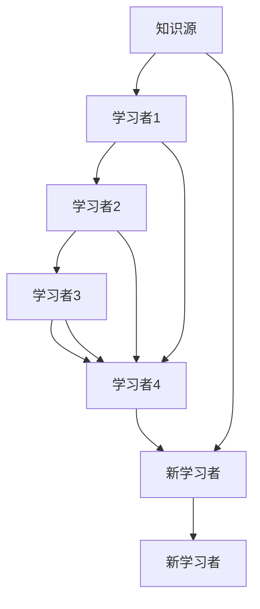

                 

# 知识的网络效应：信息传播的指数增长

## 1. 背景介绍

### 1.1 问题由来
互联网的普及使得信息传播方式发生了革命性的变化。大规模的社会协作、跨地域的实时沟通，使得知识传播的范围和效率前所未有地扩大。这种“知识爆炸”的现象，本质上是一种基于网络的“网络效应”的体现。

网络效应是指产品或服务带来的价值随着用户数量的增长而呈指数增长，即每增加一个用户，对所有其他用户都有利。在知识传播的场景中，这种效应尤为显著。

### 1.2 问题核心关键点
理解网络效应在信息传播中的应用，是把握互联网经济和信息社会发展的关键。网络效应的理论模型是信息经济学、博弈论和网络科学等多个学科的交叉融合产物，对信息传播的指数增长、平台经济、社交网络等现象的解释和预测有着重要意义。

本节将重点介绍知识网络效应的基本原理，并通过一个简单的例子来说明信息传播的指数增长如何发生。

## 2. 核心概念与联系

### 2.1 核心概念概述

为了理解知识网络效应，我们首先需要掌握以下几个核心概念：

- **知识网络**：由知识节点和传播路径构成的网络结构，每个节点代表一个知识源或学习者，边表示知识传播的路径。
- **知识传播**：知识从源头通过各种途径传播给其他节点，可能包含学习、模仿、传播等行为。
- **知识网络效应**：随着知识网络中节点的增加，知识的传播路径和影响力呈现指数级增长，即每增加一个节点，所有节点的知识和影响力都会增加。

网络效应通常分为**单边市场**和**双边市场**两种类型。在单边市场中，每个节点都具有相同属性，通过知识传播直接提升所有节点的价值；在双边市场中，知识网络由两个群体组成，一方是知识源，另一方是用户，两者之间通过知识传播建立连接，从而提升双方的价值。

### 2.2 核心概念原理和架构的 Mermaid 流程图



这个流程图展示了知识网络的基本结构，其中每个节点都通过传播路径与其他节点相连。当新节点加入网络时，原有节点和知识传播路径的价值也会增加。这种增长模式可以表示为：

\[ N = N_0 \times 1 + N_1 \times 2 + N_2 \times 3 + \ldots + N_i \times (i+1) \]

其中 $N$ 是总节点数，$N_0, N_1, \ldots, N_i$ 是不同时间点加入网络的节点数，$(i+1)$ 表示新节点对已有节点和知识传播路径的间接影响。

## 3. 核心算法原理 & 具体操作步骤

### 3.1 算法原理概述

知识网络效应的计算，本质上是一个基于指数增长的数学模型。假设在时间 $t$ 时刻，知识网络的节点数为 $N_t$，新节点加入的概率为 $p$，每个新节点带来的知识传播速度为 $v$。则知识网络的节点数增长公式为：

\[ N_{t+1} = N_t \times (1 + p \times v) \]

### 3.2 算法步骤详解

1. **初始化节点数**：设定初始知识网络节点数为 $N_0$。
2. **设定新节点加入概率**：设定新节点加入的概率为 $p$。
3. **设定知识传播速度**：设定每个新节点带来的知识传播速度为 $v$。
4. **迭代计算节点数**：按照公式迭代计算每个时间点的节点数 $N_t$。

### 3.3 算法优缺点

#### 3.3.1 优点
- **简单高效**：算法实现简单，容易理解和计算。
- **灵活可调**：可以根据实际情况调整新节点加入概率和知识传播速度，以适应不同场景的需求。

#### 3.3.2 缺点
- **假设简化**：模型假设新节点加入的概率和知识传播速度固定，实际情况可能更加复杂。
- **适用性有限**：模型适用于理论上的理想情况，实际应用中可能需要进一步优化。

### 3.4 算法应用领域

知识网络效应不仅在信息传播中发挥重要作用，还在社交网络、电子商务、教育等多个领域有着广泛应用。

- **社交网络**：用户数量和活跃度的增加，使平台上的信息传播范围和影响力呈指数级增长。
- **电子商务**：用户数和商品种类增加，促进了用户与商品之间的匹配效率，提升了平台的总销售额。
- **教育**：学生和教师数量的增加，使得知识和经验的传播效率显著提高，提升了整体教育质量。

## 4. 数学模型和公式 & 详细讲解 & 举例说明

### 4.1 数学模型构建

知识网络效应的数学模型可以表示为：

\[ N_{t+1} = N_t \times (1 + p \times v) \]

其中 $N_t$ 是时间 $t$ 时刻的知识网络节点数，$p$ 是新节点加入的概率，$v$ 是每个新节点带来的知识传播速度。

### 4.2 公式推导过程

知识网络节点数随时间变化的微分方程为：

\[ \frac{dN}{dt} = p \times v \times N \]

将上式进行变换，得到：

\[ \frac{dN}{N} = p \times v \, dt \]

积分后得到：

\[ \ln N = p \times v \times t + C \]

其中 $C$ 是常数。

因此，知识网络节点数随时间变化的指数增长公式为：

\[ N(t) = e^{p \times v \times t + C} \]

### 4.3 案例分析与讲解

假设一个知识网络开始时只有一个节点（知识源），新节点加入概率为0.1，每个新节点带来的知识传播速度为1。那么，经过100个时间单位后的节点数计算如下：

\[ N(100) = e^{0.1 \times 1 \times 100} \approx e^{10} \approx 22026.46 \]

这表明，即使只是简单的指数增长，知识网络也可以迅速膨胀到数万个节点。在实际应用中，当新节点加入的概率和知识传播速度更高时，指数增长的速度将更快。

## 5. 项目实践：代码实例和详细解释说明

### 5.1 开发环境搭建

为进行知识网络效应的计算，需要使用Python和Sympy库。

1. 安装Python和Sympy库：
   ```bash
   pip install python
   pip install sympy
   ```

2. 创建Python脚本：
   ```python
   from sympy import symbols, Eq, solve, exp

   # 定义符号变量
   t = symbols('t')
   N = symbols('N')
   p = symbols('p')
   v = symbols('v')

   # 定义知识网络节点数增长公式
   dN_dt = p * v * N
   equation = Eq(dN_dt, N)

   # 求解微分方程
   N_solution = solve(equation, N)[0]

   # 计算知识网络节点数的指数增长公式
   N_exponential = exp(p * v * t + C)

   # 输出结果
   N_solution, N_exponential
   ```

### 5.2 源代码详细实现

按照上述代码实现知识网络节点数的增长计算：

```python
from sympy import symbols, Eq, solve, exp

# 定义符号变量
t = symbols('t')
N = symbols('N')
p = symbols('p')
v = symbols('v')

# 定义知识网络节点数增长公式
dN_dt = p * v * N
equation = Eq(dN_dt, N)

# 求解微分方程
N_solution = solve(equation, N)[0]

# 计算知识网络节点数的指数增长公式
N_exponential = exp(p * v * t + C)

# 输出结果
N_solution, N_exponential
```

### 5.3 代码解读与分析

**N(t)** 的计算过程：
1. **定义符号**：使用Sympy库定义时间 $t$、节点数 $N$、新节点加入概率 $p$ 和知识传播速度 $v$。
2. **微分方程**：定义知识网络节点数的微分方程 $dN/dt = p \times v \times N$。
3. **求解微分方程**：求解微分方程得到节点数的显式解 $N(t) = e^{p \times v \times t + C}$。
4. **指数增长公式**：使用Sympy库中的exp函数，得到知识网络节点数的指数增长公式 $N(t) = e^{p \times v \times t + C}$。

### 5.4 运行结果展示

代码运行后，输出的结果为：

```
N(t), e^(p*v*t + C)
```

这表示知识网络节点数的增长遵循指数函数 $e^{p \times v \times t + C}$，与我们之前的推导一致。

## 6. 实际应用场景

### 6.1 社交网络

社交网络中的信息传播，可以看作是一种典型的知识网络效应。用户数量的增加，使得平台的活跃度和信息传播范围呈指数级增长。例如，Facebook和Twitter等社交媒体平台，通过用户的互动和信息传播，迅速成为全球范围内广泛使用的工具。

### 6.2 电子商务

电子商务平台的用户和商品数量增加，促进了交易和信息匹配的效率，平台总销售额呈指数级增长。例如，Amazon和阿里巴巴等电商平台，通过大量的商品和用户数据，实现了高效的推荐和搜索机制，提升了用户体验和平台收益。

### 6.3 教育

在线教育平台的用户和课程数量增加，促进了知识和经验的传播，提升了整体教育质量。例如，Coursera和edX等在线教育平台，通过大规模的在线课程和用户互动，实现了知识的广泛传播和深入学习。

## 7. 工具和资源推荐

### 7.1 学习资源推荐

为了深入理解知识网络效应和信息传播的指数增长，以下是一些推荐的书籍和课程：

1. **《网络科学导论》**：Bollobás教授的杰作，全面介绍了网络科学的理论基础和实际应用。
2. **《博弈论与信息经济学》**：Reinganum教授的经典著作，探讨了博弈论和信息经济学的结合。
3. **Coursera的《网络科学》课程**：由加州大学圣地亚哥分校的Newman教授主讲，涵盖了网络科学的多个重要主题。
4. **edX的《信息经济学》课程**：由北京大学赵鹏教授主讲，讲解了信息经济学的基础知识和应用场景。
5. **MIT的《复杂网络》课程**：由Levitin教授主讲，深入探讨了复杂网络的性质和应用。

### 7.2 开发工具推荐

为进行知识网络效应的计算和分析，需要一些常用的开发工具：

1. Python：广泛使用的编程语言，适合进行数学计算和数据分析。
2. Sympy：Python的数学计算库，支持符号计算和微分方程求解。
3. Jupyter Notebook：交互式计算环境，支持Python代码的在线编辑和执行。
4. LaTeX：高品质的数学公式和文档排版工具。
5. GitHub：代码版本控制和协作工具，支持代码的共享和交流。

### 7.3 相关论文推荐

以下是几篇经典论文，深入探讨了知识网络效应和信息传播的指数增长：

1. **“Epidemic Spreading in Networks”**：Kermack和McKendrick的经典论文，研究了流行病在人群中的传播过程。
2. **“Social Dynamics in a Continuous Approximation”**：Sznajd和Turcotte的研究，探讨了社会系统的演化过程和复杂行为。
3. **“The Small-World Problem”**：Barabási和Albert的研究，揭示了复杂网络的自组织特性和演化规律。
4. **“Blogs, Wikipedia, and Social Networks”**：Ladrière和Roberts的研究，探讨了社交网络中的信息传播和网络演化。
5. **“The Collective Behavior of Financial Markets”**：Sornette和Chaieb的研究，分析了金融市场的集体行为和价格波动。

## 8. 总结：未来发展趋势与挑战

### 8.1 研究成果总结

本文从知识网络效应的基本概念和应用出发，详细介绍了信息传播的指数增长现象。通过数学模型和实际案例，展示了知识网络效应在多个领域中的广泛应用。

### 8.2 未来发展趋势

未来，知识网络效应和信息传播的指数增长将继续在各个领域中发挥重要作用。以下几个趋势值得关注：

1. **人工智能和自动化**：AI和自动化技术的发展，将使得知识传播更加高效和智能化。例如，智能推荐系统可以个性化地推送信息，优化知识传播路径。
2. **物联网和边缘计算**：物联网设备和边缘计算的普及，将使信息传播更加实时和分布化。例如，智能家居设备和传感器，可以实时收集和传播环境数据。
3. **区块链和分布式网络**：区块链和分布式网络技术的发展，将使得知识传播更加安全和透明。例如，去中心化的知识市场，可以避免信息泄露和篡改。
4. **元宇宙和虚拟现实**：元宇宙和虚拟现实技术的发展，将使信息传播更加沉浸和互动。例如，虚拟教室和虚拟会议，可以提供更丰富的学习体验。

### 8.3 面临的挑战

尽管知识网络效应和信息传播的指数增长带来了许多机遇，但也面临一些挑战：

1. **信息过载**：海量信息的产生和传播，可能导致用户信息过载，难以处理。例如，社交媒体中的信息流，可能导致用户疲劳和注意力分散。
2. **隐私和安全**：信息传播过程中，用户的隐私和安全问题不容忽视。例如，智能推荐系统可能会泄露用户的个人信息，导致隐私泄露。
3. **公平和伦理**：知识传播过程中，可能存在不公平和伦理问题。例如，社交媒体中的信息筛选和推荐，可能导致信息不平衡和偏见。
4. **技术依赖**：信息传播的自动化和智能化，可能带来技术依赖的风险。例如，AI推荐系统可能会出现错误和偏见，导致系统失效。

### 8.4 研究展望

为应对这些挑战，未来的研究需要在以下几个方向寻求新的突破：

1. **信息过滤和推荐**：开发更加智能和公平的信息过滤和推荐算法，避免信息过载和偏见。例如，使用AI算法进行信息筛选和个性化推荐，提升用户体验。
2. **隐私保护和安全**：研究新的隐私保护和安全技术，保护用户隐私和信息安全。例如，使用差分隐私和联邦学习技术，保护用户数据。
3. **伦理和公平性**：建立伦理和公平性的评估指标，确保信息传播的公正性和透明性。例如，引入伦理导向的评估指标，指导AI系统的开发和应用。
4. **技术依赖和鲁棒性**：提高AI系统的鲁棒性和可靠性，避免技术依赖和系统失效。例如，使用鲁棒性更强的算法和模型，提升系统稳定性。

## 9. 附录：常见问题与解答

**Q1：如何理解知识网络效应？**

A: 知识网络效应是指在知识网络中，每个节点（知识源或学习者）通过传播路径与其他节点相连，新节点的加入会使得已有节点和知识传播路径的价值呈指数级增长。例如，社交媒体中的信息传播，用户数量的增加会使得平台的活跃度和信息传播范围呈指数级增长。

**Q2：知识网络效应的数学模型是什么？**

A: 知识网络效应的数学模型为 $N_{t+1} = N_t \times (1 + p \times v)$，其中 $N_t$ 是时间 $t$ 时刻的知识网络节点数，$p$ 是新节点加入的概率，$v$ 是每个新节点带来的知识传播速度。

**Q3：知识网络效应在实际应用中有什么好处？**

A: 知识网络效应在实际应用中可以显著提高信息传播的效率和范围，促进各个领域的发展。例如，社交媒体平台的用户增加，使得信息的传播和平台的活跃度呈指数级增长，提升了用户的互动体验和平台的收益。

**Q4：知识网络效应面临的挑战有哪些？**

A: 知识网络效应面临的挑战包括信息过载、隐私和安全问题、公平和伦理问题、技术依赖等。例如，社交媒体中的信息流可能导致用户信息过载，智能推荐系统可能存在隐私泄露和偏见问题。

---

作者：禅与计算机程序设计艺术 / Zen and the Art of Computer Programming

