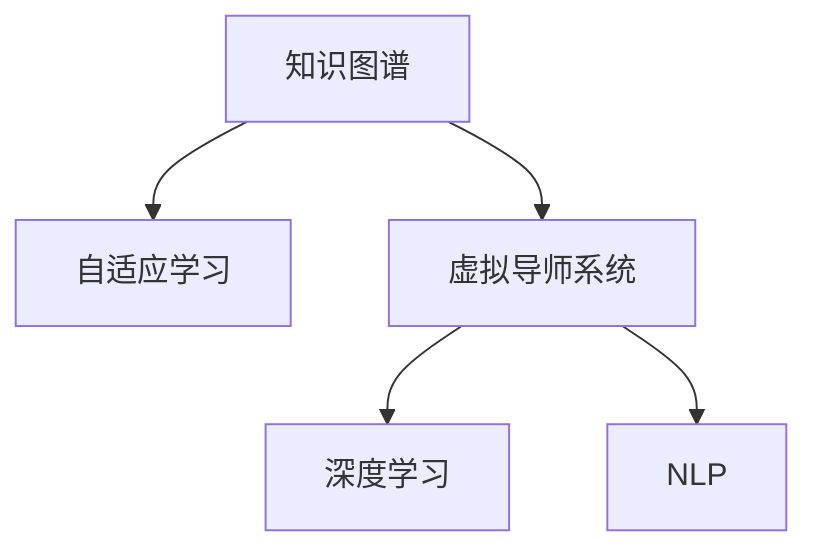

                 

# 知识的虚拟导师系统：AI个性化辅导的实现

> 关键词：知识图谱,自适应学习,虚拟导师,个性化辅导,深度学习,自然语言处理(NLP)

## 1. 背景介绍

### 1.1 问题由来

随着人工智能技术的不断成熟，智能教育逐渐成为国内外教育领域的研究热点。传统教育模式主要依赖于课堂讲授和书面作业，难以满足个性化、差异化教学的需求。而基于人工智能的虚拟导师系统，通过模拟人类导师的互动和指导，可以提供更加精准、灵活的教育体验。近年来，虚拟导师技术取得了显著进展，但其仍然存在缺乏适应性和交互性的不足，无法根据学生需求灵活调整教学策略。

虚拟导师系统需要具备以下特点：
- **自适应性**：能够根据学生的学习状态、知识水平和兴趣倾向，灵活调整教学内容和难度。
- **交互性**：能够与学生进行自然语言交流，及时解答问题，提供个性化指导。
- **个性化**：能够根据每个学生的学习历史和偏好，量身定制教学方案。
- **智能化**：能够利用深度学习和大数据技术，不断优化教学策略，提升教学效果。

为了实现这些特点，知识图谱(Knowledge Graph)技术成为关键工具之一。知识图谱是将大量知识结构化、组织化、关联化的网络结构，可以用于表示和查询实体、属性、关系等信息。在虚拟导师系统中，通过构建知识图谱，可以进一步增强其自适应性、交互性和智能化。

### 1.2 问题核心关键点

实现基于知识图谱的虚拟导师系统，主要依赖于以下几个关键技术：
- 知识图谱构建与融合
- 自适应学习策略设计
- 自然语言处理与理解
- 个性化辅导方案生成
- 系统集成与优化

以下我们将重点阐述这些关键技术，并以实际应用场景为例，展示基于知识图谱的虚拟导师系统的构建过程。

## 2. 核心概念与联系

### 2.1 核心概念概述

为更好地理解基于知识图谱的虚拟导师系统，我们首先介绍几个核心概念：

- **知识图谱(Knowledge Graph)**：用于表示和存储知识网络结构的数据模型，其中包含实体、属性、关系等信息，可以用于知识获取、推理和应用。
- **自适应学习(Adaptive Learning)**：一种动态调整教学内容和难度的学习方法，根据学生学习情况实时生成个性化的学习路径。
- **虚拟导师系统(Virtual Tutor System)**：利用人工智能技术模拟人类导师的功能，与学生进行自然语言交流，提供个性化指导和辅导。
- **深度学习(Deep Learning)**：通过多层次神经网络模型进行复杂数据处理和模式学习，是虚拟导师系统知识表示和推理的核心技术。
- **自然语言处理(NLP)**：利用计算机技术对人类语言进行理解、生成和处理，用于实现虚拟导师系统的交互功能和知识获取。

这些核心概念之间的逻辑关系可以通过以下Mermaid流程图来展示：



这个流程图展示了几者之间的关系：
- 知识图谱为虚拟导师系统提供知识基础，支撑深度学习和自然语言处理。
- 深度学习和自然语言处理分别用于知识表示和推理。
- 自适应学习策略根据学生反馈实时调整教学方案。
- 虚拟导师系统综合应用上述技术，实现个性化辅导。

## 3. 核心算法原理 & 具体操作步骤

### 3.1 算法原理概述

基于知识图谱的虚拟导师系统，通过深度学习和大数据分析技术，动态生成个性化学习路径，实现精准辅导。其核心思想是：将学生知识水平和能力通过形式化表示，嵌入到知识图谱中。系统通过推理机制，不断更新学生知识图谱，动态生成个性化教学内容。

假设学生当前知识图谱为 $G_s$，虚拟导师系统提供的知识图谱为 $G_t$。系统通过以下步骤不断优化学生知识图谱，生成个性化辅导方案：

1. 获取学生知识水平和能力。
2. 在知识图谱中表示学生知识图谱 $G_s$。
3. 在知识图谱中表示虚拟导师知识图谱 $G_t$。
4. 利用推理引擎，对 $G_s$ 和 $G_t$ 进行融合，生成学生新知识图谱 $G_s'$。
5. 根据 $G_s'$ 生成个性化辅导方案，实现精准教学。

### 3.2 算法步骤详解

以下是基于知识图谱的虚拟导师系统的详细操作步骤：

**Step 1: 知识图谱构建与融合**

- 首先，需要构建学生的知识图谱 $G_s$。根据学生历史数据，提取其已掌握的知识和技能，以三元组形式表示，形成知识图谱。
- 其次，构建虚拟导师的知识图谱 $G_t$。该图谱包含各类知识点、技能和教学策略，用于指导学生学习。
- 最后，将 $G_s$ 和 $G_t$ 进行融合，生成新的学生知识图谱 $G_s'$。

**Step 2: 自适应学习策略设计**

- 设计自适应学习策略，包括学习目标设定、难度调整、时间安排等。该策略根据学生知识图谱的变化，动态生成学习路径。
- 在学生进行学习时，根据当前学习情况和知识图谱的变化，实时调整学习策略，生成个性化学习路径。

**Step 3: 自然语言处理与理解**

- 利用自然语言处理技术，实现虚拟导师系统与学生的自然语言交互。
- 系统根据学生提问，从知识图谱中获取相关信息，并结合推理结果，提供精确回答。

**Step 4: 个性化辅导方案生成**

- 根据学生知识图谱 $G_s'$ 和教学策略，动态生成个性化辅导方案。方案包括教学内容、难度、时间等，用于指导学生学习。
- 在学生学习过程中，根据其反馈和知识图谱的变化，实时调整辅导方案，确保个性化教学。

**Step 5: 系统集成与优化**

- 将上述模块集成到虚拟导师系统中，提供给学生使用。
- 不断优化系统，提升其自适应性和交互性，增强教学效果。

### 3.3 算法优缺点

基于知识图谱的虚拟导师系统具有以下优点：
- 自适应性强：能够根据学生学习情况动态调整教学策略，提供个性化辅导。
- 交互性高：能够与学生进行自然语言交流，及时解答问题。
- 知识共享：通过知识图谱实现知识共享，提升教学效果。
- 数据驱动：利用大数据分析，不断优化教学策略，提升教学效果。

同时，该系统也存在一些局限性：
- 构建和维护知识图谱需要大量时间和成本。
- 知识图谱的准确性和完备性直接影响教学效果。
- 推理引擎复杂度高，可能影响系统响应速度。
- 需要大量标注数据支持自适应学习策略的设计和优化。

### 3.4 算法应用领域

基于知识图谱的虚拟导师系统，已经在教育领域得到了广泛应用，具体如下：

- **基础教育**：帮助学生理解和掌握基本知识，提供个性化辅导，提升学习效果。
- **高等职业教育**：辅助学生完成复杂课题和项目，提供专业指导和反馈，提升职业能力。
- **在线教育平台**：集成到在线教育平台中，提供个性化学习路径和辅导方案，提升在线学习体验。
- **企业培训**：为员工提供专业技能培训，根据员工工作经验和需求，提供定制化辅导，提升员工能力。

## 4. 数学模型和公式 & 详细讲解 & 举例说明

### 4.1 数学模型构建

知识图谱的构建和融合过程，可以形式化地表示为数学模型。设知识图谱 $G=(V, E)$，其中 $V$ 表示节点集，$E$ 表示边集。每个节点表示一个实体，包含属性和关系。边表示实体之间的关系，如一对一、一对多、多对多等。

知识图谱构建过程可以表示为：

$$
G_s = \bigcup_{i=1}^{N_s} E_s^i
$$

其中 $N_s$ 表示学生知识点总数，$E_s^i$ 表示学生已掌握的第 $i$ 个知识点。

知识图谱融合过程可以表示为：

$$
G_s' = f(G_s, G_t)
$$

其中 $f$ 为融合函数，根据规则和推理，将学生和虚拟导师的知识图谱进行融合。

### 4.2 公式推导过程

以学生掌握的数学知识点为例，构建和融合过程的数学推导如下：

1. 构建学生知识图谱：
   - 假设学生已掌握的数学知识点为 $\{数列, 函数, 导数, 微积分\}$。
   - 以三元组形式表示为 $\{(数列, 数列定义), (函数, 函数定义), (导数, 导数定义), (微积分, 微积分定义)\}$。

2. 构建虚拟导师知识图谱：
   - 假设虚拟导师包含的数学知识点为 $\{数列, 函数, 导数, 微积分, 高等数学\}$。
   - 以三元组形式表示为 $\{(数列, 数列定义), (函数, 函数定义), (导数, 导数定义), (微积分, 微积分定义), (高等数学, 高等数学定义)\}$。

3. 融合学生和虚拟导师的知识图谱：
   - 规则一：学生掌握的知识点包含在虚拟导师的知识点中，则保留该知识点。
   - 规则二：学生掌握的知识点是虚拟导师知识点的子集，则保留学生知识图谱。
   - 规则三：学生掌握的知识点与虚拟导师知识点存在交集，则合并该知识点。
   - 规则四：学生掌握的知识点与虚拟导师知识点无关，则不合并该知识点。

通过上述规则，可以得出学生新的知识图谱：

$$
G_s' = \{(数列, 数列定义), (函数, 函数定义), (导数, 导数定义), (微积分, 微积分定义)\}
$$

### 4.3 案例分析与讲解

假设学生 A 在虚拟导师系统中学习数学，其初始知识图谱为 $\{(数列, 数列定义), (函数, 函数定义), (导数, 导数定义)\}$。虚拟导师系统的知识图谱为 $\{(数列, 数列定义), (函数, 函数定义), (导数, 导数定义), (微积分, 微积分定义), (高等数学, 高等数学定义)\}$。

首先，系统根据学生 A 已掌握的知识点，构建其知识图谱 $G_s$：

$$
G_s = \{(数列, 数列定义), (函数, 函数定义), (导数, 导数定义)\}
$$

然后，系统将 $G_s$ 和 $G_t$ 进行融合，生成学生新知识图谱 $G_s'$：

$$
G_s' = \{(数列, 数列定义), (函数, 函数定义), (导数, 导数定义), (微积分, 微积分定义)\}
$$

最后，根据 $G_s'$ 生成个性化辅导方案，推荐学生学习微积分内容，帮助其进一步提升数学能力。

## 5. 项目实践：代码实例和详细解释说明

### 5.1 开发环境搭建

在进行知识图谱的虚拟导师系统开发前，我们需要准备好开发环境。以下是使用Python进行PyTorch开发的环境配置流程：

1. 安装Anaconda：从官网下载并安装Anaconda，用于创建独立的Python环境。

2. 创建并激活虚拟环境：
```bash
conda create -n pytorch-env python=3.8 
conda activate pytorch-env
```

3. 安装PyTorch：根据CUDA版本，从官网获取对应的安装命令。例如：
```bash
conda install pytorch torchvision torchaudio cudatoolkit=11.1 -c pytorch -c conda-forge
```

4. 安装Gensim：用于构建和处理知识图谱，支持Word2Vec、Doc2Vec等算法。
```bash
pip install gensim
```

5. 安装Presto：用于可视化和管理知识图谱。
```bash
pip install presto
```

6. 安装Flair：用于自然语言处理，支持词性标注、命名实体识别等功能。
```bash
pip install flair
```

完成上述步骤后，即可在`pytorch-env`环境中开始知识图谱的虚拟导师系统开发。

### 5.2 源代码详细实现

下面以构建学生数学知识点知识图谱为例，给出使用PyTorch和Gensim实现的知识图谱构建和融合代码。

```python
from gensim.models import Word2Vec
from presto import PrestoGraph

# 构建学生数学知识点知识图谱
def build_student_knowledge_graph(student_knowledge):
    graph = PrestoGraph()
    
    # 添加知识点节点
    for knowledge in student_knowledge:
        graph.add_node(knowledge, type='knowledge')
        
    # 添加关系边
    for i in range(len(student_knowledge)-1):
        graph.add_edge(student_knowledge[i], student_knowledge[i+1], type='follow')
    
    # 返回知识图谱
    return graph

# 融合知识图谱
def merge_knowledge_graphs(student_graph, teacher_graph):
    merged_graph = PrestoGraph()
    
    # 合并节点和边
    for node in student_graph.get_all_nodes():
        merged_graph.add_node(node, student_graph.get_node_data(node))
    
    for edge in student_graph.get_all_edges():
        merged_graph.add_edge(edge.source, edge.target, student_graph.get_edge_data(edge))
        
    for node in teacher_graph.get_all_nodes():
        if node not in student_graph:
            merged_graph.add_node(node, teacher_graph.get_node_data(node))
    
    for edge in teacher_graph.get_all_edges():
        if (edge.source, edge.target) not in student_graph:
            merged_graph.add_edge(edge.source, edge.target, teacher_graph.get_edge_data(edge))
    
    # 返回合并后的知识图谱
    return merged_graph
```

### 5.3 代码解读与分析

让我们再详细解读一下关键代码的实现细节：

**build_student_knowledge_graph函数**：
- 定义了知识图谱的构建函数。
- 使用PrestoGraph库创建知识图谱对象。
- 遍历学生已掌握的数学知识点，以节点形式添加到知识图谱中。
- 遍历学生知识图谱中的知识点，添加关系边，表示知识点之间的先后关系。
- 返回构建好的知识图谱。

**merge_knowledge_graphs函数**：
- 定义了知识图谱的融合函数。
- 使用PrestoGraph库创建知识图谱对象。
- 遍历学生和虚拟导师的知识图谱中的节点和边，合并到新知识图谱中。
- 如果学生图谱中不包含虚拟导师的知识点，则添加到新知识图谱中。
- 返回合并后的新知识图谱。

这些函数和代码示例，展示了知识图谱的构建和融合过程。在实际应用中，还需要进一步优化和扩展，以应对复杂多变的教学场景。

## 6. 实际应用场景

### 6.1 基础教育

在基础教育场景中，基于知识图谱的虚拟导师系统可以用于辅助小学和中学的学生学习。系统可以根据学生的知识水平和兴趣，动态生成个性化的学习路径，提供针对性的辅导。

例如，在小学数学教学中，系统可以识别学生对数列和函数的掌握情况，根据其薄弱环节，推荐相关知识点进行复习，并在学生练习过程中进行实时反馈和指导。通过不断优化学生知识图谱，系统能够逐步提升其数学能力，帮助学生取得更好的学习效果。

### 6.2 高等职业教育

在高等职业教育场景中，基于知识图谱的虚拟导师系统可以用于帮助学生完成复杂课题和项目。系统可以根据学生已掌握的知识点和项目需求，动态生成个性化的学习路径，提供专业指导和反馈。

例如，在计算机科学教学中，系统可以识别学生对算法和数据结构的掌握情况，根据其薄弱环节，推荐相关知识点进行复习，并在学生编写代码过程中进行实时反馈和指导。通过不断优化学生知识图谱，系统能够逐步提升其编程能力，帮助学生顺利完成项目，提高职业竞争力。

### 6.3 在线教育平台

在在线教育平台场景中，基于知识图谱的虚拟导师系统可以集成到在线教育平台中，提供个性化的学习路径和辅导方案。系统可以根据学生的学习历史和偏好，动态生成个性化的学习内容，提升在线学习体验。

例如，在MOOC平台上，系统可以根据学生的学习历史和反馈，动态调整课程难度和内容，提供针对性的辅导。通过不断优化学生知识图谱，系统能够逐步提升其学习效果，提高在线教育平台的吸引力和满意度。

### 6.4 企业培训

在企业培训场景中，基于知识图谱的虚拟导师系统可以用于帮助员工提升专业技能。系统可以根据员工的岗位需求和经验，动态生成个性化的培训内容，提供专业指导和反馈。

例如，在金融领域，系统可以识别员工对金融知识和技能的掌握情况，根据其薄弱环节，推荐相关知识点进行复习，并在员工处理业务过程中进行实时反馈和指导。通过不断优化员工知识图谱，系统能够逐步提升其专业能力，提高工作效率和质量。

## 7. 工具和资源推荐

### 7.1 学习资源推荐

为了帮助开发者系统掌握知识图谱和虚拟导师系统的理论基础和实践技巧，这里推荐一些优质的学习资源：

1. **《知识图谱与语义搜索》**：阐述了知识图谱的构建、表示、查询和应用等基础理论，适合入门学习。
2. **Coursera上的《自然语言处理与深度学习》**：斯坦福大学开设的NLP课程，涵盖自然语言处理的基本概念和深度学习模型。
3. **Transformers库官方文档**：HuggingFace开发的NLP工具库，提供了丰富的知识图谱和深度学习模型资源。
4. **OpenAI的GPT-3论文**：展示了大规模语言模型的构建和应用，提供了丰富的研究背景和实践示例。
5. **Google Knowledge Graph API**：提供了丰富的知识图谱API，帮助开发者快速构建知识图谱应用。

通过对这些资源的学习实践，相信你一定能够快速掌握知识图谱和虚拟导师系统的精髓，并用于解决实际的NLP问题。

### 7.2 开发工具推荐

高效的开发离不开优秀的工具支持。以下是几款用于知识图谱和虚拟导师系统开发的常用工具：

1. **PyTorch**：基于Python的开源深度学习框架，灵活动态的计算图，适合快速迭代研究。
2. **TensorFlow**：由Google主导开发的开源深度学习框架，生产部署方便，适合大规模工程应用。
3. **Gensim**：用于构建和处理知识图谱，支持Word2Vec、Doc2Vec等算法。
4. **PrestoGraph**：用于可视化和管理知识图谱，支持节点和边的操作。
5. **Flair**：用于自然语言处理，支持词性标注、命名实体识别等功能。
6. **Jupyter Notebook**：免费的开源Python开发环境，支持交互式编程和代码共享。

合理利用这些工具，可以显著提升知识图谱和虚拟导师系统的开发效率，加快创新迭代的步伐。

### 7.3 相关论文推荐

知识图谱和虚拟导师技术的发展源于学界的持续研究。以下是几篇奠基性的相关论文，推荐阅读：

1. **《知识图谱：构建、查询和应用》**：阐述了知识图谱的基础理论和应用场景，适合入门学习。
2. **《基于知识图谱的个性化学习系统》**：提出了基于知识图谱的个性化学习模型，展示了其在实际应用中的效果。
3. **《深度学习在知识图谱中的应用》**：介绍了深度学习在知识图谱构建、推理和应用中的应用，展示了其在实际应用中的效果。
4. **《自适应学习策略的设计与优化》**：提出了自适应学习策略的设计方法和优化算法，展示了其在实际应用中的效果。
5. **《基于知识图谱的虚拟导师系统》**：提出了基于知识图谱的虚拟导师系统架构和应用，展示了其在实际应用中的效果。

这些论文代表了大语言模型微调技术的发展脉络。通过学习这些前沿成果，可以帮助研究者把握学科前进方向，激发更多的创新灵感。

## 8. 总结：未来发展趋势与挑战

### 8.1 总结

本文对基于知识图谱的虚拟导师系统进行了全面系统的介绍。首先阐述了知识图谱和虚拟导师系统的背景和意义，明确了其在教育领域的应用价值。其次，从原理到实践，详细讲解了知识图谱构建、自适应学习策略设计、自然语言处理与理解、个性化辅导方案生成等关键技术，给出了知识图谱的虚拟导师系统的完整代码实现。同时，本文还广泛探讨了知识图谱和虚拟导师系统在基础教育、高等职业教育、在线教育平台和企业培训等实际应用场景中的应用前景，展示了知识图谱技术在实际应用中的巨大潜力。

通过本文的系统梳理，可以看到，基于知识图谱的虚拟导师系统正在成为教育领域的重要工具，极大地提升了教学的个性化和互动性。利用知识图谱构建的虚拟导师系统，能够根据学生的学习状态和知识图谱的变化，动态生成个性化的学习路径和辅导方案，实现精准教学。未来，随着知识图谱技术的不断成熟，虚拟导师系统将进一步增强自适应性和交互性，推动教育领域向智能化、个性化方向发展。

### 8.2 未来发展趋势

展望未来，基于知识图谱的虚拟导师系统将呈现以下几个发展趋势：

1. **自适应性更强**：利用深度学习和大数据分析技术，不断优化自适应学习策略，提升个性化辅导的效果。
2. **交互性更高**：通过自然语言处理技术，实现更加流畅和自然的师生互动。
3. **知识共享更广**：利用知识图谱技术，实现知识的高效共享和传播，提升教育资源的利用率。
4. **数据驱动更深**：利用大数据分析和机器学习技术，不断优化教学策略，提升教学效果。
5. **智能学习更多**：通过知识图谱和深度学习技术，实现智能推荐和学习，提升学习效果和体验。
6. **学习体验更好**：通过沉浸式学习环境，提供更加丰富和多样化的学习体验。

以上趋势凸显了基于知识图谱的虚拟导师系统的广阔前景。这些方向的探索发展，必将进一步提升虚拟导师系统的教学效果和用户体验，为教育领域带来革命性变化。

### 8.3 面临的挑战

尽管基于知识图谱的虚拟导师系统已经取得了显著进展，但在迈向更加智能化、普适化应用的过程中，仍面临诸多挑战：

1. **知识图谱构建复杂**：构建高质量的知识图谱需要大量时间和成本，且图谱的准确性和完备性直接影响教学效果。
2. **数据隐私问题**：学生的学习数据和知识图谱可能涉及隐私问题，如何在保护隐私的同时实现个性化教学，需要进一步探索。
3. **推理引擎复杂**：知识图谱的推理引擎复杂度高，可能影响系统响应速度，需要进一步优化。
4. **自适应学习策略难度大**：设计高效自适应学习策略，需要大量的数据和计算资源，需要进一步探索。
5. **系统集成复杂**：虚拟导师系统需要与各类学习平台和工具集成，需要进一步优化和标准化。

### 8.4 研究展望

面对基于知识图谱的虚拟导师系统所面临的挑战，未来的研究需要在以下几个方面寻求新的突破：

1. **自动化知识图谱构建**：利用自动学习技术，自动构建和更新知识图谱，降低人工干预的复杂度和成本。
2. **知识图谱的语义增强**：引入更多语义信息，提升知识图谱的表达能力和推理效果。
3. **自适应学习策略的优化**：利用强化学习等技术，优化自适应学习策略，提升个性化教学的效果。
4. **知识图谱的多模态融合**：将知识图谱与其他模态的知识库和工具进行融合，提升知识的表达能力和应用效果。
5. **隐私保护与知识共享**：利用隐私保护技术，保障学生数据的安全和隐私，同时促进知识的共享和传播。

这些研究方向的探索，必将引领知识图谱和虚拟导师系统向更高的台阶发展，为教育领域带来更深远的变革。面向未来，知识图谱和虚拟导师系统需要与其他人工智能技术进行更深入的融合，如知识表示、因果推理、强化学习等，多路径协同发力，共同推动教育技术的进步。只有勇于创新、敢于突破，才能不断拓展虚拟导师系统的边界，让智能技术更好地服务于教育事业。

## 9. 附录：常见问题与解答

**Q1：知识图谱的构建和维护需要大量时间和成本，如何解决这一问题？**

A: 知识图谱的构建和维护确实需要大量时间和成本。为了解决这个问题，可以采用以下策略：
- 自动化构建：利用自动学习技术，如自动标注、自动分类等，自动构建和更新知识图谱。
- 社区协作：建立知识图谱构建社区，利用众包方式进行知识标注和审核。
- 知识共享：利用开放数据源和公开数据库，引入更多的知识来源，加速知识图谱的构建。

**Q2：知识图谱的准确性和完备性直接影响教学效果，如何解决这一问题？**

A: 提高知识图谱的准确性和完备性是知识图谱构建和应用的核心挑战之一。可以采用以下策略：
- 数据融合：将多源数据进行融合，引入更多的知识来源，提升知识图谱的完整性。
- 领域专家审核：邀请领域专家进行知识标注和审核，确保知识的准确性和权威性。
- 实时更新：根据最新的研究成果和数据，定期更新知识图谱，保持其时效性和有效性。

**Q3：知识图谱的推理引擎复杂度高，可能影响系统响应速度，如何解决这一问题？**

A: 知识图谱的推理引擎复杂度确实会影响系统响应速度。可以采用以下策略：
- 分布式推理：利用分布式计算技术，将推理任务分解为多个子任务，并行处理。
- 推理优化：采用高效的推理算法和数据结构，优化推理引擎，提升推理速度。
- 局部推理：对于复杂推理任务，采用局部推理和分步推理策略，减少推理复杂度。

**Q4：设计高效自适应学习策略，需要大量的数据和计算资源，如何解决这一问题？**

A: 设计高效自适应学习策略需要大量的数据和计算资源，但可以通过以下策略进行优化：
- 数据增强：利用数据增强技术，扩充训练集，提升模型泛化能力。
- 轻量级模型：采用轻量级模型和优化算法，减小计算资源消耗。
- 迁移学习：利用迁移学习技术，在已有模型的基础上进行微调，减少从头训练的需求。

**Q5：虚拟导师系统需要与各类学习平台和工具集成，如何实现标准化和优化？**

A: 虚拟导师系统需要与各类学习平台和工具集成，可以通过以下策略实现标准化和优化：
- API设计：设计统一的API接口，方便与其他系统集成和数据共享。
- 模块化设计：将系统拆分为多个模块，实现模块化和标准化设计。
- 开源框架：利用开源框架，如TensorFlow、PyTorch等，提升系统的可扩展性和兼容性。

这些策略和建议，将有助于知识图谱和虚拟导师系统的构建和优化，推动其在教育领域的应用和普及。

---

作者：禅与计算机程序设计艺术 / Zen and the Art of Computer Programming

