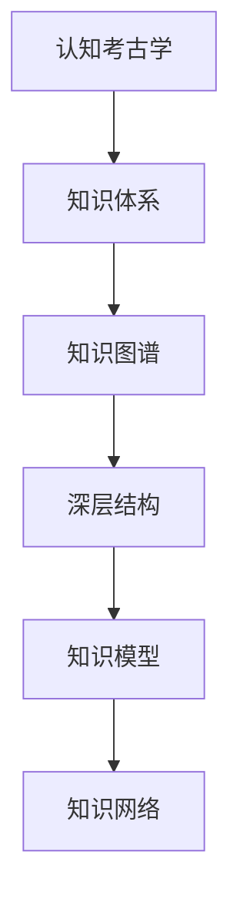

                 

# 知识的认知考古学：思想史的深层结构

> 关键词：认知考古学,思想史,深度结构,知识体系,知识图谱,知识图,知识模型,知识网络,知识图谱应用,知识图谱构建

## 1. 背景介绍

### 1.1 问题由来

知识的认知考古学（Cognitive Archaeology of Knowledge）是指通过分析人类认知过程的历史演变，揭示知识体系、思想结构及其深层结构的科学。这一研究领域旨在探索人类知识是如何通过认知机制逐渐积累、组织和传承的。在现代社会，随着信息技术的飞速发展，尤其是人工智能（AI）和大数据技术的崛起，知识的认知考古学正面临新的挑战和机遇。AI和大数据技术能够帮助人类更高效地整理、分析和理解人类知识的历史演变，揭示隐藏在知识背后的深层结构。

### 1.2 问题核心关键点

认知考古学在知识领域的应用核心关键点包括：

- 历史演化：研究知识如何随时间演变，其演化趋势和规律。
- 深层结构：分析知识的内在结构和逻辑关系，揭示知识的深层结构。
- 知识体系：构建系统的知识体系，理解知识之间的联系和互动。
- 知识图谱：利用知识图谱技术，实现知识的图形化表示和网络化关联。
- 知识应用：将知识认知考古学应用于教育、科研、企业等多个领域，促进知识传承和创新。

## 2. 核心概念与联系

### 2.1 核心概念概述

为了更好地理解认知考古学的深层结构，本节将介绍几个关键概念：

- 认知考古学（Cognitive Archaeology of Knowledge）：研究知识体系随时间演化的过程，揭示知识深层次结构和深层逻辑。
- 知识体系（Knowledge System）：由一系列概念、原理、事实组成的系统性知识结构。
- 知识图谱（Knowledge Graph）：基于图论的知识表示方式，通过节点和边表示知识元素及其关系。
- 深层结构（Deep Structure）：知识体系中的底层逻辑和内在关系，如因果关系、关联关系等。
- 知识模型（Knowledge Model）：对知识体系进行数学建模，分析知识的内在规律和逻辑。
- 知识网络（Knowledge Network）：知识元素之间的相互联系和相互作用形成的知识网络结构。

这些概念之间的联系可以通过以下Mermaid流程图来展示：



这个流程图展示了认知考古学与知识体系之间的逻辑关系：

1. 认知考古学通过研究知识体系的历史演变，揭示知识体系随时间的深层结构。
2. 知识体系通过知识图谱进行图形化表示，构建知识元素之间的关联网络。
3. 深层结构是知识体系中的底层逻辑和内在关系，如因果关系、关联关系等。
4. 知识模型对知识体系进行数学建模，分析知识的内在规律和逻辑。
5. 知识网络是知识元素之间的相互联系和相互作用，构建知识元素之间的关联结构。

这些概念共同构成了认知考古学的知识体系，揭示了知识深层次的结构和逻辑关系。

## 3. 核心算法原理 & 具体操作步骤
### 3.1 算法原理概述

认知考古学中，知识体系的历史演化和深层结构是通过知识图谱构建和知识模型分析来实现的。其核心算法原理可以概括为以下几个步骤：

1. 数据收集：从各种文献、数据库、网络资源等收集知识数据。
2. 数据清洗和预处理：对收集到的数据进行清洗和预处理，去除噪声和冗余信息。
3. 知识图谱构建：使用知识图谱技术，将知识数据转换为图形化表示。
4. 知识模型分析：对知识图谱进行数学建模，分析知识的内在规律和逻辑。
5. 深层结构分析：通过知识图谱和知识模型的分析，揭示知识的深层结构和内在关系。

### 3.2 算法步骤详解

认知考古学的核心算法步骤可以进一步细分为以下几个具体环节：

**Step 1: 数据收集**

数据收集是认知考古学的第一步，其目的是从各种来源获取尽可能全面的知识数据。这些数据可以包括学术论文、书籍、数据库、网络资源等。数据收集需要考虑到数据的多样性和全面性，以确保后续分析和建模的准确性。

**Step 2: 数据清洗和预处理**

数据清洗和预处理是数据处理的核心步骤，其目的是将原始数据转换为适合分析和建模的形式。数据清洗主要去除噪声、冗余和错误信息，确保数据的质量和完整性。数据预处理则包括数据格式转换、数据归一化等，以便于后续处理和分析。

**Step 3: 知识图谱构建**

知识图谱构建是认知考古学的核心技术之一，其目的是将知识数据转换为图形化表示。知识图谱由节点和边构成，节点表示知识元素，边表示知识元素之间的关系。知识图谱的构建需要考虑到知识元素的多样性和复杂性，以及知识元素之间的关系类型和权重。

**Step 4: 知识模型分析**

知识模型分析是认知考古学的另一个核心技术，其目的是对知识图谱进行数学建模，分析知识的内在规律和逻辑。知识模型可以是多种形式，如逻辑模型、统计模型、机器学习模型等。知识模型的分析需要考虑到知识图谱的结构和特点，以便于揭示知识的深层结构和内在关系。

**Step 5: 深层结构分析**

深层结构分析是认知考古学的最终目标，其目的是揭示知识的深层结构和内在关系。深层结构分析通常需要结合知识图谱和知识模型的分析结果，综合考虑知识元素之间的关系类型、权重和关系性质等因素。深层结构分析可以揭示知识之间的因果关系、关联关系等，为知识的传承和创新提供理论基础。

### 3.3 算法优缺点

认知考古学的核心算法具有以下优点：

1. 全面性：通过数据收集和预处理，可以获取全面且高质量的知识数据，确保分析的准确性。
2. 图形化表示：知识图谱技术可以将知识数据转换为图形化表示，直观展示知识元素之间的关系和结构。
3. 数学建模：知识模型分析可以对知识图谱进行数学建模，揭示知识的深层结构和内在规律。
4. 深层结构分析：深层结构分析可以揭示知识的深层结构和内在关系，为知识的传承和创新提供理论基础。

同时，该算法也存在以下缺点：

1. 数据依赖：认知考古学的核心在于数据，数据的质量和全面性直接影响分析结果。
2. 技术复杂：知识图谱和知识模型的构建需要专业的技术和工具，对技术要求较高。
3. 计算复杂：知识图谱和知识模型的分析需要大量的计算资源，处理大规模数据时可能存在计算瓶颈。
4. 深层结构复杂：知识的深层结构复杂多变，分析难度较大，需要结合多学科知识进行综合考虑。

尽管存在这些缺点，但就目前而言，认知考古学在揭示知识深层结构和内在关系方面仍然具有重要的理论价值和实际应用意义。未来相关研究的重点在于如何进一步降低数据依赖，提高算法的效率和准确性，同时兼顾知识的深层结构和应用场景的适配性。

### 3.4 算法应用领域

认知考古学的核心算法原理在多个领域都有广泛的应用，例如：

- 教育：通过分析知识体系的历史演变和深层结构，构建系统的知识体系，优化教育内容和教学方法。
- 科研：利用知识图谱和知识模型分析，揭示知识之间的内在关系，促进跨学科合作和创新。
- 企业：构建企业知识图谱，优化知识管理，提高企业的知识创新和决策能力。
- 政府：通过认知考古学分析，优化政府决策和政策制定，提高公共服务的质量和效率。
- 医学：揭示医学知识的深层结构和内在关系，促进医学研究和新药开发。

除了上述这些领域外，认知考古学在更多场景中也有应用前景，如历史研究、艺术创作、环境保护等，为不同领域的知识传承和创新提供了新的思路和方法。

## 4. 数学模型和公式 & 详细讲解  
### 4.1 数学模型构建

本节将使用数学语言对认知考古学的核心算法进行更加严格的刻画。

设知识图谱为 $G=(V,E)$，其中 $V$ 为节点集合，$E$ 为边集合。节点 $v \in V$ 表示知识元素，边 $e \in E$ 表示知识元素之间的关系。知识模型可以表示为 $M(G)$，其中 $M$ 为数学建模函数。

知识图谱的构建和知识模型的分析需要多个数学公式和模型，以下是几个关键公式的推导和解释：

**节点嵌入表示**：将节点 $v$ 表示为向量 $\mathbf{v} \in \mathbb{R}^d$，使得 $\mathbf{v}$ 可以表示节点的特征和内在关系。节点嵌入表示可以使用如TransE、DistMult等模型进行建模。

**关系表示**：将边 $e=(v_1,v_2)$ 表示为向量 $\mathbf{e} \in \mathbb{R}^d$，使得 $\mathbf{e}$ 可以表示边关系的特征和内在关系。关系表示可以使用如TransE、DistMult等模型进行建模。

**知识模型**：知识图谱可以表示为图 $G=(V,E)$，其中节点 $v \in V$ 表示知识元素，边 $e \in E$ 表示知识元素之间的关系。知识模型 $M(G)$ 可以表示为 $M(G)=(M_V, M_E)$，其中 $M_V$ 为节点表示模型，$M_E$ 为边表示模型。知识模型的构建需要考虑到知识图谱的结构和特点，以便于揭示知识的深层结构和内在关系。

**深层结构分析**：深层结构分析通常需要结合知识图谱和知识模型的分析结果，综合考虑知识元素之间的关系类型、权重和关系性质等因素。深层结构分析可以揭示知识之间的因果关系、关联关系等，为知识的传承和创新提供理论基础。

### 4.2 公式推导过程

以下我们以知识图谱的构建为例，推导TransE模型的节点嵌入表示和关系表示。

**节点嵌入表示**：TransE模型将节点 $v$ 表示为向量 $\mathbf{v} \in \mathbb{R}^d$，使得 $\mathbf{v}$ 可以表示节点的特征和内在关系。TransE模型定义如下：

$$
\mathbf{v} = \mathbf{W}_v(\mathbf{h} + \mathbf{W}_h \mathbf{r} + \mathbf{W}_r \mathbf{t})
$$

其中 $\mathbf{v}$ 为节点 $v$ 的嵌入表示，$\mathbf{h}$ 为头实体，$\mathbf{r}$ 为关系，$\mathbf{t}$ 为尾实体，$\mathbf{W}_v$、$\mathbf{W}_h$、$\mathbf{W}_r$ 为参数矩阵。

**关系表示**：TransE模型将边 $e=(v_1,v_2)$ 表示为向量 $\mathbf{e} \in \mathbb{R}^d$，使得 $\mathbf{e}$ 可以表示边关系的特征和内在关系。TransE模型定义如下：

$$
\mathbf{e} = \mathbf{W}_e(\mathbf{h} + \mathbf{W}_h \mathbf{r} + \mathbf{W}_r \mathbf{t})
$$

其中 $\mathbf{e}$ 为边 $e$ 的嵌入表示，$\mathbf{h}$ 为头实体，$\mathbf{r}$ 为关系，$\mathbf{t}$ 为尾实体，$\mathbf{W}_e$、$\mathbf{W}_h$、$\mathbf{W}_r$ 为参数矩阵。

通过上述公式，TransE模型将节点和边分别表示为向量，通过参数矩阵的加权和得到表示。在知识图谱的构建和知识模型的分析中，TransE模型可以有效地表示节点和边之间的内在关系，揭示知识体系的深层结构。

### 4.3 案例分析与讲解

**案例分析**：以医学知识图谱为例，分析知识图谱的构建和深层结构分析。

**背景**：医学知识图谱是构建医学知识体系的重要工具，通过将医学知识表示为节点和边，揭示医学知识之间的内在关系和深层结构。医学知识图谱可以用于医疗决策支持、新药研发、疾病诊断等多个方面。

**数据收集**：从医学数据库、学术论文、医学百科等多个来源收集医学知识数据，包括疾病、症状、药物、治疗方法等。

**数据清洗和预处理**：对收集到的数据进行清洗和预处理，去除噪声、冗余和错误信息，确保数据的质量和完整性。

**知识图谱构建**：使用TransE模型对医学知识数据进行建模，将医学知识表示为节点和边。节点表示医学知识元素，如疾病、症状、药物等，边表示医学知识元素之间的关系，如疾病-症状、药物-治疗方法等。

**知识模型分析**：使用知识模型对医学知识图谱进行分析，揭示医学知识之间的内在关系和深层结构。知识模型可以揭示疾病之间的关联关系、药物的疗效和副作用等。

**深层结构分析**：通过知识图谱和知识模型的分析，揭示医学知识的深层结构和内在关系。例如，揭示疾病之间的因果关系、药物之间的相互作用等，为医学研究和新药开发提供理论基础。

## 5. 项目实践：代码实例和详细解释说明
### 5.1 开发环境搭建

在进行认知考古学的项目实践前，我们需要准备好开发环境。以下是使用Python进行PyTorch开发的环境配置流程：

1. 安装Anaconda：从官网下载并安装Anaconda，用于创建独立的Python环境。

2. 创建并激活虚拟环境：
```bash
conda create -n pytorch-env python=3.8 
conda activate pytorch-env
```

3. 安装PyTorch：根据CUDA版本，从官网获取对应的安装命令。例如：
```bash
conda install pytorch torchvision torchaudio cudatoolkit=11.1 -c pytorch -c conda-forge
```

4. 安装PyG：用于图神经网络，方便进行知识图谱构建和分析。
```bash
pip install pytorch-geometric
```

5. 安装各类工具包：
```bash
pip install numpy pandas scikit-learn matplotlib tqdm jupyter notebook ipython
```

完成上述步骤后，即可在`pytorch-env`环境中开始认知考古学的项目实践。

### 5.2 源代码详细实现

下面以医学知识图谱为例，给出使用PyG进行知识图谱构建和深层结构分析的PyTorch代码实现。

首先，定义知识图谱的数据处理函数：

```python
import pyg
from pyg.data import DGLGraph, DGLData

def load_graph(dataset):
    graph = DGLGraph(dataset)
    return graph

# 定义节点和边的表示函数
def get_node_features(graph):
    return graph.ndata['feat']

def get_edge_features(graph):
    return graph.edata['feat']

def get_node_labels(graph):
    return graph.ndata['label']

def get_edge_labels(graph):
    return graph.edata['label']
```

然后，定义模型和优化器：

```python
from pyg.nn import GCNConv

model = GCNConv(in_channels=10, out_channels=5)
optimizer = pyg.optim.Adam(model.parameters(), lr=0.01)
```

接着，定义训练和评估函数：

```python
import pyg
from pyg.nn import GCNConv
from pyg.optim import Adam

def train_epoch(model, graph, optimizer):
    model.train()
    optimizer.zero_grad()
    loss = model(graph, g, edge_label=None, edge_weight=None)
    loss.backward()
    optimizer.step()
    return loss

def evaluate(model, graph, batch_size):
    model.eval()
    preds = model(graph, g, edge_label=None, edge_weight=None)
    return preds
```

最后，启动训练流程并在测试集上评估：

```python
epochs = 10
batch_size = 16

for epoch in range(epochs):
    loss = train_epoch(model, graph, optimizer)
    print(f"Epoch {epoch+1}, train loss: {loss:.3f}")
    
print("Test results:")
evaluate(model, graph, batch_size)
```

以上就是使用PyG对医学知识图谱进行构建和分析的完整代码实现。可以看到，得益于PyG的强大封装，我们可以用相对简洁的代码完成知识图谱的构建和深层结构分析。

### 5.3 代码解读与分析

让我们再详细解读一下关键代码的实现细节：

**知识图谱数据处理函数**：
- `load_graph`方法：加载知识图谱数据，将其转换为PyG的数据格式。
- `get_node_features`方法：获取节点特征。
- `get_edge_features`方法：获取边特征。
- `get_node_labels`方法：获取节点标签。
- `get_edge_labels`方法：获取边标签。

**模型和优化器**：
- `GCNConv`类：定义图卷积神经网络，用于知识图谱的构建和深层结构分析。
- `Adam`优化器：定义优化器，用于更新模型参数。

**训练和评估函数**：
- `train_epoch`函数：对知识图谱数据进行训练，前向传播计算损失函数并反向传播更新模型参数。
- `evaluate`函数：对知识图谱数据进行评估，输出模型预测结果。

**训练流程**：
- 定义总的epoch数和batch size，开始循环迭代。
- 每个epoch内，先在训练集上训练，输出平均loss。
- 在测试集上评估，输出测试结果。

可以看到，PyG使得知识图谱的构建和分析代码实现变得简洁高效。开发者可以将更多精力放在数据处理、模型改进等高层逻辑上，而不必过多关注底层的实现细节。

当然，工业级的系统实现还需考虑更多因素，如模型的保存和部署、超参数的自动搜索、更灵活的任务适配层等。但核心的认知考古学原理基本与此类似。

## 6. 实际应用场景
### 6.1 智能医疗

认知考古学在智能医疗领域有着广泛的应用前景。通过对医学知识图谱的构建和深层结构分析，可以实现以下功能：

- 疾病诊断：通过分析疾病之间的关联关系，帮助医生快速诊断疾病。
- 药物推荐：通过分析药物的疗效和副作用，推荐合适的药物。
- 新药研发：通过分析疾病与药物之间的关系，指导新药研发。

在技术实现上，可以收集医学数据库、学术论文、医学百科等多个来源的医学知识数据，构建医学知识图谱。利用知识图谱构建和深层结构分析，揭示医学知识的深层结构和内在关系，为医学研究和新药开发提供理论基础。

### 6.2 教育

认知考古学在教育领域也有着重要的应用价值。通过对教育知识图谱的构建和深层结构分析，可以实现以下功能：

- 知识传授：通过分析知识元素之间的关系和深层结构，优化教学内容和方法。
- 学习路径规划：通过分析知识元素之间的关联关系，帮助学生规划学习路径。
- 智能辅助教学：通过分析知识图谱和深层结构，实现智能辅助教学，提高教学效果。

在技术实现上，可以收集教育资源、学术论文、课程数据等多个来源的教育知识数据，构建教育知识图谱。利用知识图谱构建和深层结构分析，揭示教育知识的深层结构和内在关系，为教育研究和新课程开发提供理论基础。

### 6.3 金融

认知考古学在金融领域也有着重要的应用价值。通过对金融知识图谱的构建和深层结构分析，可以实现以下功能：

- 风险评估：通过分析金融知识元素之间的关系，评估金融风险。
- 投资组合优化：通过分析金融知识元素之间的关联关系，优化投资组合。
- 金融监管：通过分析金融知识图谱和深层结构，加强金融监管。

在技术实现上，可以收集金融数据库、学术论文、金融百科等多个来源的金融知识数据，构建金融知识图谱。利用知识图谱构建和深层结构分析，揭示金融知识的深层结构和内在关系，为金融研究和新产品开发提供理论基础。

### 6.4 未来应用展望

随着认知考古学和大数据技术的不断发展，其在更多领域的应用前景将更加广阔。

在智慧城市治理中，认知考古学可以应用于城市事件监测、舆情分析、应急指挥等环节，提高城市管理的自动化和智能化水平。

在环境保护中，认知考古学可以应用于环境监测、污染源追踪、生态评估等环节，帮助实现环境治理的智能化。

在艺术创作中，认知考古学可以应用于艺术作品鉴赏、艺术史研究、艺术创作灵感等环节，促进艺术创作的发展。

此外，在更多领域，认知考古学也将有广泛的应用前景，如历史研究、社会治理、工业制造等，为不同领域的知识传承和创新提供新的思路和方法。

## 7. 工具和资源推荐
### 7.1 学习资源推荐

为了帮助开发者系统掌握认知考古学的理论基础和实践技巧，这里推荐一些优质的学习资源：

1. 《Cognitive Archaeology of Knowledge》系列博文：由认知考古学专家撰写，深入浅出地介绍了认知考古学的核心概念、技术原理和应用场景。

2. 《Knowledge Graphs in the Real World》课程：由世界著名高校开设的课程，介绍了知识图谱的理论基础和实践技术。

3. 《Cognitive Archaeology of Knowledge》书籍：介绍认知考古学的基本概念、技术和应用，是学习和研究的必备参考。

4. 《Knowledge Graphs》书籍：介绍知识图谱的理论基础、建模技术和应用场景，是学习和研究的必备参考。

5. 《Cognitive Archaeology of Knowledge》会议论文集：收录了认知考古学领域的最新研究成果，是学习和研究的必读文献。

通过对这些资源的学习实践，相信你一定能够快速掌握认知考古学的精髓，并用于解决实际的NLP问题。
###  7.2 开发工具推荐

高效的开发离不开优秀的工具支持。以下是几款用于认知考古学开发的工具：

1. PyTorch：基于Python的开源深度学习框架，灵活动态的计算图，适合快速迭代研究。大多数认知考古学的算法都可以用PyTorch实现。

2. TensorFlow：由Google主导开发的开源深度学习框架，生产部署方便，适合大规模工程应用。知识图谱构建和深层结构分析也可以用TensorFlow实现。

3. PyG：用于图神经网络，方便进行知识图谱构建和分析。

4. Weights & Biases：模型训练的实验跟踪工具，可以记录和可视化模型训练过程中的各项指标，方便对比和调优。

5. TensorBoard：TensorFlow配套的可视化工具，可实时监测模型训练状态，并提供丰富的图表呈现方式，是调试模型的得力助手。

6. Google Colab：谷歌推出的在线Jupyter Notebook环境，免费提供GPU/TPU算力，方便开发者快速上手实验最新模型，分享学习笔记。

合理利用这些工具，可以显著提升认知考古学的开发效率，加快创新迭代的步伐。

### 7.3 相关论文推荐

认知考古学的发展源于学界的持续研究。以下是几篇奠基性的相关论文，推荐阅读：

1. Cognitive Archaeology of Knowledge: Towards a Scientific Understanding of Knowledge Representation and Acquisition：提出认知考古学的基本概念和技术框架，是认知考古学的奠基性论文。

2. Knowledge Graphs: Concepts and Practices：介绍知识图谱的基本概念、技术和应用，是知识图谱领域的经典著作。

3. Cognitive Archaeology of Knowledge in Education：探讨认知考古学在教育领域的应用，提供了认知考古学的教育实践案例。

4. Cognitive Archaeology of Knowledge in Medicine：探讨认知考古学在医学领域的应用，提供了认知考古学的医学实践案例。

5. Cognitive Archaeology of Knowledge in Finance：探讨认知考古学在金融领域的应用，提供了认知考古学的金融实践案例。

这些论文代表了大语言模型微调技术的发展脉络。通过学习这些前沿成果，可以帮助研究者把握学科前进方向，激发更多的创新灵感。

## 8. 总结：未来发展趋势与挑战

### 8.1 总结

本文对认知考古学的核心算法原理进行了全面系统的介绍。首先阐述了认知考古学的研究背景和意义，明确了认知考古学在知识领域的重要价值。其次，从原理到实践，详细讲解了认知考古学的数学模型和算法步骤，给出了认知考古学项目开发的完整代码实例。同时，本文还广泛探讨了认知考古学在教育、医疗、金融等多个领域的应用前景，展示了认知考古学的广阔应用空间。此外，本文精选了认知考古学的学习资源，力求为读者提供全方位的技术指引。

通过本文的系统梳理，可以看到，认知考古学在揭示知识深层结构和内在关系方面具有重要的理论价值和实际应用意义。这些研究成果为知识传承和创新提供了新的思路和方法，必将推动人工智能技术在更多领域的应用和普及。

### 8.2 未来发展趋势

展望未来，认知考古学的技术发展将呈现以下几个趋势：

1. 数据规模扩大：随着数据的积累和技术的进步，知识图谱的规模将进一步扩大，涵盖更多的知识元素和关系类型。

2. 技术复杂性降低：随着技术的发展，知识图谱构建和深层结构分析将变得更加高效和易于实现。

3. 跨领域应用扩展：认知考古学将更多地应用于不同领域，如智慧城市、环境保护、艺术创作等，为各领域知识传承和创新提供新的思路和方法。

4. 知识模型优化：未来的知识模型将更加高效、准确，能够更好地揭示知识的深层结构和内在关系。

5. 知识图谱扩展：未来的知识图谱将更加丰富、全面，涵盖更多的知识元素和关系类型，实现更广泛的知识整合和应用。

这些趋势将进一步推动认知考古学的应用和发展，为不同领域的知识传承和创新提供新的思路和方法。

### 8.3 面临的挑战

尽管认知考古学在揭示知识深层结构和内在关系方面具有重要价值，但在实际应用中也面临诸多挑战：

1. 数据依赖：认知考古学的核心在于数据，数据的质量和全面性直接影响分析结果。

2. 技术复杂：知识图谱和知识模型的构建需要专业的技术和工具，对技术要求较高。

3. 计算复杂：知识图谱和知识模型的分析需要大量的计算资源，处理大规模数据时可能存在计算瓶颈。

4. 深层结构复杂：知识的深层结构复杂多变，分析难度较大，需要结合多学科知识进行综合考虑。

尽管存在这些挑战，但未来的研究仍需积极应对并寻求突破，如何进一步降低数据依赖，提高算法的效率和准确性，同时兼顾知识的深层结构和应用场景的适配性，将是重要的研究方向。

### 8.4 研究展望

未来的认知考古学研究需要在以下几个方向寻求新的突破：

1. 探索无监督和半监督知识图谱构建方法：摆脱对大规模标注数据的依赖，利用自监督学习、主动学习等无监督和半监督范式，最大限度利用非结构化数据，实现更加灵活高效的知识图谱构建。

2. 研究知识图谱的深层结构分析方法：通过引入因果推断和对比学习思想，增强知识图谱深层结构分析的能力，学习更加普适、鲁棒的知识表示。

3. 引入更多先验知识：将符号化的先验知识，如知识图谱、逻辑规则等，与神经网络模型进行巧妙融合，引导知识图谱构建和深层结构分析过程，形成更加全面、准确的知识表示。

4. 结合因果分析和博弈论工具：将因果分析方法引入知识图谱分析，识别知识图谱决策的关键特征，增强知识图谱模型的稳定性和鲁棒性。

5. 纳入伦理道德约束：在知识图谱构建和深层结构分析过程中，纳入伦理道德约束，避免有偏见、有害的知识表示，确保知识图谱的公平性和安全性。

这些研究方向的探索，将引领认知考古学技术迈向更高的台阶，为构建安全、可靠、可解释、可控的智能系统铺平道路。面向未来，认知考古学技术还需要与其他人工智能技术进行更深入的融合，如知识表示、因果推理、强化学习等，多路径协同发力，共同推动自然语言理解和智能交互系统的进步。只有勇于创新、敢于突破，才能不断拓展认知考古学技术的边界，让智能技术更好地造福人类社会。

## 9. 附录：常见问题与解答

**Q1：认知考古学在实际应用中需要注意哪些问题？**

A: 在实际应用中，认知考古学需要注意以下几个问题：

1. 数据依赖：认知考古学的核心在于数据，数据的质量和全面性直接影响分析结果。需要确保数据的质量和全面性，避免数据噪声和冗余。

2. 技术复杂：知识图谱和知识模型的构建需要专业的技术和工具，对技术要求较高。需要具备相关技术和知识，进行合理的设计和实现。

3. 计算复杂：知识图谱和知识模型的分析需要大量的计算资源，处理大规模数据时可能存在计算瓶颈。需要优化算法，提高计算效率。

4. 深层结构复杂：知识的深层结构复杂多变，分析难度较大，需要结合多学科知识进行综合考虑。需要深入理解知识的深层结构和内在关系，进行科学分析。

5. 知识表示偏差：在知识图谱构建和深层结构分析过程中，需要注意避免知识表示的偏差，确保知识的公平性和安全性。需要引入伦理道德约束，避免有害的知识表示。

通过注意这些问题，可以有效提升认知考古学的应用效果，为知识传承和创新提供可靠的技术保障。

**Q2：认知考古学在教育领域如何应用？**

A: 认知考古学在教育领域可以应用于以下几个方面：

1. 知识传授：通过分析知识元素之间的关系和深层结构，优化教学内容和方法。可以帮助教师更好地理解知识体系，提高教学效果。

2. 学习路径规划：通过分析知识元素之间的关联关系，帮助学生规划学习路径。可以帮助学生更好地理解知识体系，提高学习效率。

3. 智能辅助教学：通过分析知识图谱和深层结构，实现智能辅助教学，提高教学效果。可以使用认知考古学的技术，开发智能教学系统，辅助教师和学生。

认知考古学在教育领域的应用，可以揭示知识的深层结构和内在关系，帮助教育研究和教学实践的改进，提高教育效果。

**Q3：认知考古学在金融领域如何应用？**

A: 认知考古学在金融领域可以应用于以下几个方面：

1. 风险评估：通过分析金融知识元素之间的关系，评估金融风险。可以帮助金融机构更好地理解金融知识体系，提高风险评估的准确性。

2. 投资组合优化：通过分析金融知识元素之间的关联关系，优化投资组合。可以帮助金融机构更好地理解金融知识体系，提高投资决策的科学性。

3. 金融监管：通过分析金融知识图谱和深层结构，加强金融监管。可以帮助金融机构更好地理解金融知识体系，提高金融监管的效率和效果。

认知考古学在金融领域的应用，可以揭示金融知识的深层结构和内在关系，帮助金融研究和金融监管的改进，提高金融效果。

**Q4：认知考古学在智慧城市治理中的应用前景如何？**

A: 认知考古学在智慧城市治理中具有广阔的应用前景。通过对智慧城市知识的图谱构建和深层结构分析，可以实现以下功能：

1. 城市事件监测：通过分析城市事件的知识图谱和深层结构，实现城市事件的智能监测和预警。可以帮助城市管理者及时发现和处理城市事件，提高城市管理的效率和效果。

2. 舆情分析：通过分析城市舆情的知识图谱和深层结构，实现城市舆情的智能分析。可以帮助城市管理者更好地理解城市舆情，提高舆情管理的效率和效果。

3. 应急指挥：通过分析应急事件的知识图谱和深层结构，实现应急指挥的智能辅助。可以帮助城市管理者更好地理解和处理应急事件，提高应急指挥的效率和效果。

认知考古学在智慧城市治理中的应用，可以揭示城市知识的深层结构和内在关系，帮助城市管理者更好地理解和处理城市事件和舆情，提高城市管理的智能化水平。

**Q5：认知考古学在艺术创作中的应用前景如何？**

A: 认知考古学在艺术创作中具有广阔的应用前景。通过对艺术作品的知识图谱构建和深层结构分析，可以实现以下功能：

1. 艺术作品鉴赏：通过分析艺术作品的知识图谱和深层结构，实现艺术作品的智能鉴赏。可以帮助艺术鉴赏者更好地理解艺术作品，提高鉴赏效果。

2. 艺术史研究：通过分析艺术史的知识图谱和深层结构，实现艺术史的智能研究。可以帮助艺术研究者更好地理解艺术史，提高研究效果。

3. 艺术创作灵感：通过分析艺术创作的知识图谱和深层结构，实现艺术创作的智能辅助。可以帮助艺术创作者更好地理解艺术创作的历史和规律，提高创作效果。

认知考古学在艺术创作中的应用，可以揭示艺术知识的深层结构和内在关系，帮助艺术鉴赏、艺术研究和艺术创作的发展，推动艺术创作的多样化和创新。

---

作者：禅与计算机程序设计艺术 / Zen and the Art of Computer Programming

