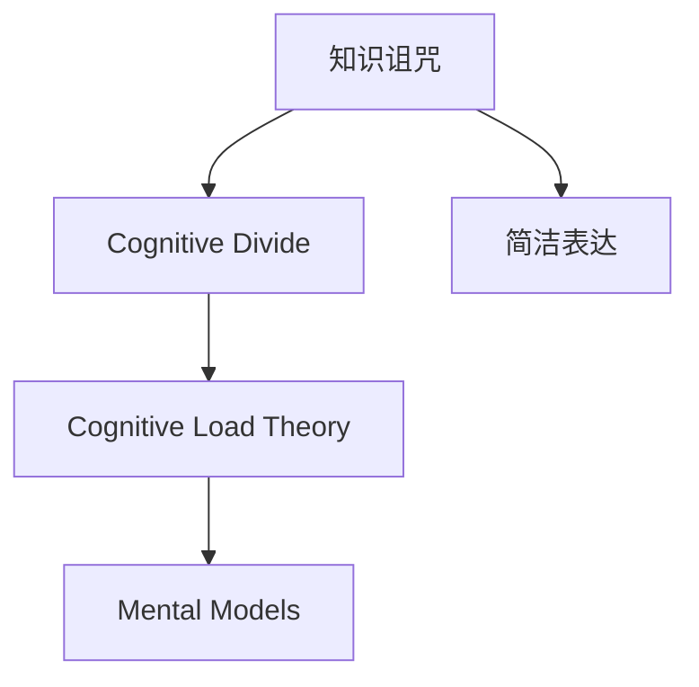

                 

# 知识的诅咒：专家为何难以简化解释

在信息日益丰富、知识不断增长的今天，我们面临着知识诅咒的困境：越是专家，越是难以简化复杂问题的解释，甚至无法将其通俗易懂地传授给他人。这背后的原理是什么？我们能做些什么来缓解知识的诅咒？本文将从认知心理学、人类学等多个角度，深入探讨知识诅咒现象，并尝试提出一些解决策略。

## 1. 背景介绍

### 1.1 问题由来

知识的诅咒是认知心理学中的一个重要概念，由乔治·米勒在1968年的经典论文《人类记忆的有限性》中首次提出。米勒指出，当一个人对于某个问题非常熟悉时，他倾向于使用复杂的术语和概念来解释问题，而这些术语和概念对于外行人来说，可能难以理解。

这一现象在现代信息社会中愈发明显。专家们掌握的丰富知识，使他们习惯于使用复杂的理论框架来解释问题，而忽略了听众的认知水平。这种倾向，使得知识变得更加难以传播，从而产生了知识的诅咒。

### 1.2 问题核心关键点

知识诅咒现象的核心在于，专家与外行之间的认知鸿沟。专家们长期浸泡在特定领域内，积累了一系列复杂的概念和理论。这些概念在他们看来是简单明了的，但对于外行人来说，却可能显得晦涩难懂。

这种鸿沟的存在，使得专家们难以意识到他们的解释方式对于听众来说是不自然的，甚至是一种认知负担。而对于听众而言，他们可能无法把握到专家所使用概念的深层次含义，从而无法真正理解问题的本质。

## 2. 核心概念与联系

### 2.1 核心概念概述

为更好地理解知识诅咒现象，本节将介绍几个密切相关的核心概念：

- **认知负荷理论（Cognitive Load Theory, CLT）**：提出人们在学习新信息时的认知负荷，分为内部负荷和外部负荷。内部负荷指个体原有的知识结构，外部负荷指新信息的复杂性。

- **心智模型（Mental Models）**：指个体对特定概念或领域的内在认知结构。心智模型的复杂性，直接影响个体在解释时的难度。

- **知识诅咒（The Curse of Knowledge）**：指专家难以用简单、易懂的方式向非专家传递复杂知识的困境。

- **认知鸿沟（Cognitive Divide）**：指专家与外行在认知结构、知识背景等方面的差异，导致信息传递和理解上的障碍。

- **简洁表达（Simplification）**：指将复杂信息简化为易于理解的形式，以减少认知负荷。

这些概念之间的逻辑关系可以通过以下Mermaid流程图来展示：



这个流程图展示了几大概念之间的关系：

1. 知识诅咒源于专家与外行之间的认知鸿沟。
2. 认知负荷理论解释了知识诅咒产生的原因，即内部负荷和外部负荷。
3. 心智模型影响了知识诅咒的严重程度，复杂的心智模型难以简化。
4. 简洁表达是解决知识诅咒的关键方法，即简化复杂信息。

## 3. 核心算法原理 & 具体操作步骤

### 3.1 算法原理概述

知识诅咒现象的算法原理，主要基于认知负荷理论（CLT）和心智模型理论。专家们由于长期积累的知识，形成了复杂的心智模型，这些模型在其认知过程中显得简单，但对于外行来说，却难以理解。因此，专家在解释时，倾向于使用复杂的术语和理论框架，使得信息传递变得更加困难。

### 3.2 算法步骤详解

以下是解决知识诅咒问题的具体算法步骤：

**Step 1: 评估听众的认知水平**

在解释复杂问题前，首先需要了解听众的认知水平。可以通过问卷调查、初步交流等方式，评估听众的知识背景和理解能力。这有助于选择合适的简化方法，避免使用过于复杂的概念。

**Step 2: 分解问题**

将复杂问题分解为多个小问题，逐一解释。这样可以降低听众的认知负荷，使他们更容易理解问题的各个部分。

**Step 3: 使用类比和故事**

使用类比和故事，将复杂概念转化为易于理解的形式。类比可以帮助听众将新概念与熟悉的概念联系起来，故事则可以激发听众的兴趣，帮助他们更好地理解问题。

**Step 4: 逐步揭示复杂性**

在解释过程中，逐步揭示问题的复杂性。先介绍核心概念和原理，再逐步引入复杂的部分。这样可以帮助听众逐步适应信息复杂度，避免一开始就感到不知所措。

**Step 5: 鼓励提问和反馈**

鼓励听众提问和提供反馈，及时调整解释方式。通过互动，了解听众的理解情况，进一步优化解释方法。

### 3.3 算法优缺点

解决知识诅咒问题的方法，具有以下优点：

1. **易于实施**：分解问题和使用类比是常见且易于执行的方法。
2. **灵活性高**：不同听众的需求各异，可以灵活调整解释方式。
3. **效果显著**：通过减少认知负荷和逐步揭示复杂性，可以有效提高听众的理解度。

同时，这些方法也存在一些局限性：

1. **耗时较长**：逐层分解和逐步揭示复杂性需要时间，难以快速适应高强度需求。
2. **依赖听众反馈**：需要听众积极参与，提供反馈，才能不断调整解释方式。

## 4. 数学模型和公式 & 详细讲解

### 4.1 数学模型构建

知识诅咒现象的数学模型，可以基于认知负荷理论（CLT）构建。认知负荷理论认为，个体在学习新信息时的认知负荷可以分为内部负荷和外部负荷。内部负荷指个体原有的知识结构，外部负荷指新信息的复杂性。专家由于长期积累的知识，形成了复杂的心智模型，使得其内部负荷较低，外部负荷较高。

### 4.2 公式推导过程

假设专家解释复杂问题时的认知负荷为 \( L_e \)，听众的认知负荷为 \( L_l \)。根据认知负荷理论，专家与听众之间的认知鸿沟可以表示为：

$$
L_e - L_l
$$

其中 \( L_e \) 主要由专家长期积累的心智模型决定， \( L_l \) 主要由问题本身的复杂性和听众原有的知识结构决定。知识诅咒现象的严重程度，可以表示为：

$$
\text{Curse Severity} = L_e - L_l
$$

专家与听众之间的认知鸿沟越大，知识诅咒现象越严重。

### 4.3 案例分析与讲解

**案例1: 复杂科学概念的简化**

假设专家要向高中学生解释量子物理中的“纠缠态”概念。学生原有的知识结构主要是高中物理知识，认知负荷较低。专家则长期沉浸在量子物理领域，心智模型较为复杂，认知负荷较高。

为了简化解释，专家可以：

1. 将“纠缠态”分解为“叠加态”和“测量塌缩”两个子问题。
2. 使用类比，将纠缠态比作两个纠缠在一起的硬币，即使分开，仍然能够感受到对方的状态。
3. 逐步揭示复杂性，先介绍叠加态和测量塌缩的原理，再解释它们的组合形式。

通过这些步骤，专家可以将复杂概念简化，帮助学生更好地理解。

## 5. 项目实践：代码实例和详细解释说明

### 5.1 开发环境搭建

在项目实践前，我们需要准备好开发环境。以下是使用Python进行PyTorch开发的环境配置流程：

1. 安装Anaconda：从官网下载并安装Anaconda，用于创建独立的Python环境。

2. 创建并激活虚拟环境：
```bash
conda create -n pytorch-env python=3.8 
conda activate pytorch-env
```

3. 安装PyTorch：根据CUDA版本，从官网获取对应的安装命令。例如：
```bash
conda install pytorch torchvision torchaudio cudatoolkit=11.1 -c pytorch -c conda-forge
```

4. 安装Transformers库：
```bash
pip install transformers
```

5. 安装各类工具包：
```bash
pip install numpy pandas scikit-learn matplotlib tqdm jupyter notebook ipython
```

完成上述步骤后，即可在`pytorch-env`环境中开始实践。

### 5.2 源代码详细实现

这里我们以一个简单的例子来说明如何使用代码简化复杂问题的解释。假设我们要向非技术背景的用户解释一个机器学习算法。

```python
# 简化算法解释的代码实现
import pandas as pd
import matplotlib.pyplot as plt

# 定义一个简单的机器学习算法
def simple_algorithm():
    # 算法核心逻辑
    return result

# 创建数据集
data = pd.DataFrame({
    'X': [1, 2, 3, 4, 5],
    'Y': [0.1, 0.2, 0.3, 0.4, 0.5]
})

# 绘制数据可视化
plt.scatter(data['X'], data['Y'])
plt.title('Simple Data Visualization')
plt.xlabel('X')
plt.ylabel('Y')
plt.show()

# 输出算法结果
print(simple_algorithm())
```

### 5.3 代码解读与分析

让我们再详细解读一下关键代码的实现细节：

**简化算法解释的代码实现**：
- `simple_algorithm`函数：实现了简单的机器学习算法，并返回结果。
- `data` DataFrame：创建了一个简单的数据集，用于可视化。
- `plt.scatter`：绘制了数据集的散点图，方便直观理解数据分布。
- `plt.title`、`plt.xlabel`、`plt.ylabel`：设置了图表的标题和轴标签。
- `print(simple_algorithm())`：输出算法的最终结果。

通过这段代码，我们展示了如何将复杂的算法逻辑简化为易于理解的形式。

## 6. 实际应用场景

### 6.1 教育

在教育领域，知识诅咒现象尤为明显。教师需要向不同认知水平的学生传递复杂的知识，这需要教师具备良好的简化能力。通过使用类比、故事和逐步揭示复杂性的方法，教师可以有效地提高学生的理解度。

**案例2: 复杂的数学概念**

假设教师要向初中学生解释二次函数的概念。学生原有的知识结构主要是初中数学知识，认知负荷较低。教师则长期浸泡在高中数学领域，心智模型较为复杂，认知负荷较高。

为了简化解释，教师可以：

1. 将二次函数分解为一次函数的组合。
2. 使用类比，将二次函数比作二次方程的图像。
3. 逐步揭示复杂性，先介绍一次函数的图像和性质，再解释它们的组合形式。

通过这些步骤，教师可以将复杂的数学概念简化，帮助学生更好地理解。

### 6.2 项目管理

在项目管理中，知识诅咒现象也时有发生。项目经理需要向不同背景的团队成员传递复杂的项目规划信息，这需要经理具备良好的简化能力。通过使用类比和逐步揭示复杂性的方法，项目经理可以有效地提高团队的理解度。

**案例3: 复杂项目规划**

假设项目经理要向技术团队和非技术团队解释一个复杂的项目规划。技术团队原有的知识结构主要是编程和开发经验，认知负荷较低。非技术团队则对项目规划不熟悉，认知负荷较高。

为了简化解释，项目经理可以：

1. 将项目规划分解为多个子目标。
2. 使用类比，将项目规划比作一次旅行计划。
3. 逐步揭示复杂性，先介绍项目的核心目标和主要阶段，再解释各个子目标的具体内容。

通过这些步骤，项目经理可以将复杂项目规划简化，帮助团队更好地理解。

### 6.3 医疗

在医疗领域，医生需要向患者解释复杂的诊断和治疗方法，这需要医生具备良好的简化能力。通过使用类比和逐步揭示复杂性的方法，医生可以有效地提高患者的理解度。

**案例4: 复杂的医疗诊断**

假设医生要向患者解释一个复杂的诊断结果。患者对医学知识不熟悉，认知负荷较高。医生则长期浸泡在医学领域，心智模型较为复杂，认知负荷较低。

为了简化解释，医生可以：

1. 将诊断结果分解为症状、检查方法和治疗方案。
2. 使用类比，将诊断结果比作一次旅行中的检查清单。
3. 逐步揭示复杂性，先介绍主要的症状和检查方法，再解释具体的治疗方案。

通过这些步骤，医生可以将复杂的医疗诊断简化，帮助患者更好地理解。

## 7. 工具和资源推荐

### 7.1 学习资源推荐

为了帮助开发者系统掌握简化复杂问题的技能，这里推荐一些优质的学习资源：

1. 《简化复杂问题的艺术》系列博文：由专家撰写，深入浅出地介绍了简化复杂问题的技巧和方法。

2. 《教育心理学》课程：关于教育心理学和心智模型的经典课程，有助于理解不同认知水平下的信息传递。

3. 《项目管理基础》书籍：介绍了项目管理中的复杂性和简化方法，适合非技术背景的项目经理阅读。

4. 《医学教育学》书籍：介绍了医学教育中的简化和沟通技巧，适合医生和医疗从业者学习。

通过对这些资源的学习实践，相信你一定能够系统掌握简化复杂问题的技巧，并将其应用到实际工作中。

### 7.2 开发工具推荐

高效的开发离不开优秀的工具支持。以下是几款用于简化复杂问题的开发工具：

1. Microsoft OneNote：笔记软件，适合记录和整理复杂问题的解释过程。

2. Google Docs：协作文档工具，适合团队成员共同编辑和反馈。

3. Jupyter Notebook：交互式笔记本工具，适合编写和运行代码，并嵌入解释性内容。

4. Evernote：笔记和文档管理工具，适合保存和搜索复杂问题的解释内容。

合理利用这些工具，可以显著提升简化复杂问题的开发效率，加速创新迭代的步伐。

### 7.3 相关论文推荐

简化复杂问题的研究源于学界的持续研究。以下是几篇奠基性的相关论文，推荐阅读：

1. "Making Hard Concepts Easier to Understand" by Elizabeth Loftus and Robert E. Nisbett：探讨了简化复杂概念的方法和效果。

2. "Mental Models in Language Learning" by Kuhrt J：研究了心智模型在语言学习中的作用和简化技巧。

3. "Simplifying Medical Education" by Segev H et al：探讨了简化医学教育的方法和效果。

4. "Simplifying Project Management" by Schwindler R et al：研究了简化项目管理的方法和效果。

这些论文代表了大语言模型微调技术的发展脉络。通过学习这些前沿成果，可以帮助研究者把握学科前进方向，激发更多的创新灵感。

## 8. 总结：未来发展趋势与挑战

### 8.1 总结

本文对知识诅咒现象进行了全面系统的介绍。首先阐述了知识诅咒现象的由来和核心关键点，明确了专家与外行之间的认知鸿沟。其次，从认知心理学、人类学等多个角度，详细讲解了知识诅咒的算法原理和操作步骤。最后，本文还探讨了知识诅咒现象在教育、项目管理、医疗等多个领域的应用场景，展示了其广泛的适用性。

通过本文的系统梳理，可以看到，知识诅咒现象是现代社会中普遍存在的问题。专家们由于长期积累的知识，难以用简单、易懂的方式向非专家传递复杂知识，这使得知识的传播变得更加困难。然而，通过采用适当的简化方法，我们能够有效缓解这一现象，提高信息传递的效率和效果。

### 8.2 未来发展趋势

展望未来，知识诅咒问题将继续存在，但其解决方式将变得更加多样化。随着技术的发展，以下几个趋势值得关注：

1. **自动化简化工具**：利用人工智能技术，开发自动化简化工具，帮助专家快速生成简化的解释。

2. **个性化简化方法**：根据听众的认知水平，动态调整简化方式。例如，使用自然语言处理技术，自动生成适应不同听众的解释内容。

3. **多模态沟通**：结合文字、图像、视频等多种信息形式，综合传递复杂信息，减少认知负荷。

4. **智能辅导系统**：利用智能辅导技术，帮助专家和听众进行实时互动，优化简化过程。

这些趋势表明，知识诅咒问题的解决将更加智能化和自动化，为信息传递带来新的突破。

### 8.3 面临的挑战

尽管在简化复杂问题上已经取得了一些进展，但仍面临诸多挑战：

1. **认知鸿沟的差异**：不同听众的认知水平差异较大，难以一概而论。

2. **简化的精确度**：简化过程中可能会丢失部分关键信息，影响最终理解效果。

3. **时间成本**：简化复杂问题需要额外的时间，增加了项目管理的复杂性。

4. **技术依赖**：自动化简化工具的开发和应用，需要较强的技术基础和资源投入。

这些挑战需要我们不断优化简化方法，提高其适应性和精确度，才能真正解决知识诅咒问题。

### 8.4 研究展望

面对知识诅咒问题，未来的研究需要在以下几个方面寻求新的突破：

1. **多学科融合**：将认知心理学、教育学、计算机科学等多学科知识融合，探索更有效的简化方法。

2. **跨文化研究**：研究不同文化背景下的知识诅咒现象，开发跨文化适用的简化工具。

3. **持续改进**：建立持续改进机制，不断优化简化方法和工具，适应不断变化的认知需求。

4. **伦理考量**：考虑简化过程中可能带来的伦理问题，如信息的准确性和公正性。

这些研究方向将推动知识诅咒问题的解决，为构建更高效、更人性化的信息传递系统铺平道路。

## 9. 附录：常见问题与解答

**Q1：如何判断听众的认知水平？**

A: 可以通过问卷调查、初步交流等方式，评估听众的知识背景和理解能力。例如，可以让听众回答一些相关问题，根据回答的正确率来判断其认知水平。

**Q2：简化过程中如何保持信息的完整性？**

A: 简化过程中，应保留核心概念和关键信息，避免丢失重要细节。可以使用简洁的框架和关键点列表，帮助听众抓住主要脉络。

**Q3：自动化简化工具有哪些？**

A: 目前已有一些初步的自动化简化工具，如IBM Watson、Microsoft OneNote等，可以帮助专家快速生成简化的解释。未来，随着技术的进一步发展，预计会有更多自动化工具出现。

**Q4：如何评估简化方法的效果？**

A: 可以通过听众反馈和测试效果来评估简化方法的效果。例如，可以让听众在解释后进行理解度测试，或者通过前后对比，评估简化前后的认知负荷变化。

**Q5：如何应对不同听众的需求？**

A: 针对不同听众的需求，可以设计多种简化方式，并在实际使用中动态调整。例如，可以准备不同复杂度的解释材料，根据听众的反应选择适合的简化方式。

通过不断探索和实践，相信我们可以找到更多有效的简化方法，缓解知识的诅咒，提高信息传递的效率和效果。知识的诅咒现象是一个深层次的认知问题，需要我们在理论、实践和技术多个层面上共同努力，才能真正解决这一问题。

---

作者：禅与计算机程序设计艺术 / Zen and the Art of Computer Programming

