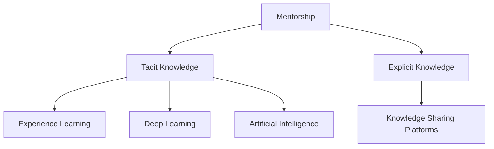

                 

# 知识的隐性传递：导师制与经验学习

> 关键词：知识传递,导师制,经验学习,隐性知识,显性知识,知识分享平台,深度学习,人工智能

## 1. 背景介绍

### 1.1 问题由来

在当今快速发展的科技领域中，知识和技能的学习成为了从业者职业生涯中不可或缺的一部分。尤其是在技术领域，如人工智能（AI）、大数据、区块链等，新技术层出不穷，从业者需要不断学习和适应新的技术，以保持自身的竞争力。然而，知识的获取不仅需要依靠正式的教育和培训课程，还需要通过实践经验和人际互动进行学习。这种经验学习（Experiential Learning），即通过实际工作、项目、实习等方式进行的学习，被认为是提升技能和知识的有效途径。

### 1.2 问题核心关键点

经验学习的核心在于知识的隐性传递。所谓的隐性知识（Tacit Knowledge），是指那些难以用言语或文字表达的，需要通过实践和体验才能掌握的知识。例如，项目管理的技巧、软件开发的方法论、人际沟通的策略等。这些知识往往无法通过传统的教育体系进行有效传授，需要通过导师制（Mentorship）的形式，通过师徒关系，从经验丰富的导师那里获得。

导师制作为一种重要的经验学习方式，已经在各种行业中得到了广泛应用。在科技领域，特别是在AI、机器学习等前沿技术领域，导师制更是被视为推动技术创新和人才培养的重要手段。通过导师制的形式，新手可以从经验丰富的导师那里获得实际工作中的指导和建议，快速掌握关键技能，并在实践中不断提升。

### 1.3 问题研究意义

研究导师制与经验学习的本质，对于理解知识传递机制、提升从业者技能和推动技术创新具有重要意义。通过深入探讨导师制和经验学习的原理和实践，可以：

- **提升技能和知识水平**：帮助新手快速适应和掌握新技术，提高工作效率。
- **加速技术创新**：通过知识共享和经验交流，促进技术的传播和创新。
- **培养行业人才**：导师制的形式有助于人才的培养和成长，构建一个健康的技术生态系统。
- **促进职业发展**：通过导师制的形式，从业者可以获得更多的职业机会和发展空间。

## 2. 核心概念与联系

### 2.1 核心概念概述

为更好地理解导师制与经验学习的内涵和应用，本节将介绍几个关键概念：

- **导师制（Mentorship）**：一种通过师徒关系进行的非正式知识传递方式，强调经验和实践的传授。
- **隐性知识（Tacit Knowledge）**：难以用言语或文字表达的，需要通过实践和体验才能掌握的知识。
- **显性知识（Explicit Knowledge）**：能够用文字或符号表达的知识，如书籍、教程、文档等。
- **经验学习（Experiential Learning）**：通过实际工作、项目、实习等方式进行的学习，强调实践和体验的重要性。
- **知识分享平台（Knowledge Sharing Platforms）**：利用互联网技术搭建的，方便知识共享和经验交流的平台，如GitHub、Stack Overflow等。
- **深度学习（Deep Learning）**：一种机器学习技术，通过多层神经网络对数据进行抽象学习，实现复杂模式识别和预测。
- **人工智能（Artificial Intelligence）**：通过模拟人类智能行为，使机器具备学习、推理和自我改进能力的学科。

这些概念之间的逻辑关系可以通过以下Mermaid流程图来展示：



这个流程图展示了这个概念体系的核心关系：

1. 导师制传递隐性知识，同时也在实践中获得了显性知识。
2. 隐性知识与显性知识通过知识分享平台进行传递和整合。
3. 隐性知识在深度学习中起到至关重要的作用。
4. 隐性知识和显性知识共同构成了人工智能的基础。

## 3. 核心算法原理 & 具体操作步骤

### 3.1 算法原理概述

导师制与经验学习的核心算法原理可以归结为知识传递的机制和经验学习的循环过程。在导师制中，知识传递分为两个方向：从导师到徒弟（单向传递）和双向互动。在经验学习中，学习者通过实践和反思，不断更新和完善自己的知识体系。

### 3.2 算法步骤详解

#### 3.2.1 师徒配对与初始化

1. **师徒配对**：根据徒弟的技能水平和兴趣领域，寻找合适的导师进行配对。这通常基于专业背景、工作经验、性格相容度等因素进行匹配。
2. **导师培训**：为导师提供必要的培训和指导，帮助其掌握经验传递的方法和技巧。
3. **初始化设置**：制定导师制的基本框架，包括沟通频率、学习内容、评估标准等。

#### 3.2.2 知识传递与实践指导

1. **知识传递**：导师通过一对一的指导，向徒弟传授隐性知识。这包括演示、解释、讨论等形式。
2. **实践指导**：导师安排徒弟参与实际项目或任务，提供具体的指导和反馈。
3. **反思与总结**：徒弟在实践中反思，并总结所学知识，形成自己的理解。

#### 3.2.3 评估与反馈

1. **学习评估**：定期对徒弟的学习进度和效果进行评估，帮助其发现不足和改进方向。
2. **导师反馈**：导师根据评估结果，调整指导策略，优化教学方法。
3. **共同改进**：师徒双方共同探讨学习中的问题，制定改进计划。

### 3.3 算法优缺点

**优点**：

- **即时反馈**：通过导师制，徒弟可以及时获得反馈，快速发现和解决问题。
- **个性化指导**：导师制能够根据徒弟的具体情况进行个性化指导，提高学习效率。
- **综合技能提升**：通过实践和指导，徒弟不仅学习到专业知识，还提升了解决问题的综合能力。

**缺点**：

- **依赖导师经验**：导师制的有效性依赖于导师的经验和指导质量，经验不足或指导不当可能导致学习效果不佳。
- **时间与资源投入**：师徒双方需要投入大量时间和精力进行学习和指导，可能影响日常工作。
- **缺乏标准化**：导师制缺乏统一的标准和评估体系，可能导致学习效果不稳定。

### 3.4 算法应用领域

导师制与经验学习在多个领域得到了广泛应用，包括但不限于：

- **技术领域**：如软件开发、数据分析、机器学习等，通过导师制传授技能和知识。
- **教育领域**：高校和职业培训机构中，通过导师制进行专业指导和职业规划。
- **医疗领域**：医学实习和临床培训中，导师指导学生进行病例分析和手术操作。
- **商业领域**：销售团队和项目管理中，导师制帮助新人快速适应岗位和提高绩效。
- **艺术领域**：音乐、绘画、写作等艺术学科中，导师制指导学生进行创作和表演。

## 4. 数学模型和公式 & 详细讲解 & 举例说明

### 4.1 数学模型构建

本节将使用数学语言对导师制与经验学习的核心算法进行详细描述。

假设师徒之间存在 $T$ 次知识传递过程，每次传递的知识量分别为 $K_1, K_2, \ldots, K_T$，徒弟在每次传递后对知识的理解和应用能力提升量为 $\Delta_1, \Delta_2, \ldots, \Delta_T$。则徒弟在经过 $T$ 次传递后的总知识提升量为：

$$
\sum_{t=1}^T K_t + \sum_{t=1}^T \Delta_t
$$

其中，第一项 $K_t$ 表示导师每次传递的显性知识，第二项 $\Delta_t$ 表示徒弟在每次传递后对知识的隐性吸收和实践经验。

### 4.2 公式推导过程

以下将详细推导导师制与经验学习的数学公式，并以具体案例进行讲解。

**假设条件**：
- 每次知识传递的显性知识 $K_t$ 是独立同分布的随机变量，其分布为 $P(K_t)$。
- 徒弟每次学习后的隐性提升量 $\Delta_t$ 也是一个随机变量，其分布为 $P(\Delta_t)$。

**知识传递过程**：
- 第 $t$ 次知识传递时，导师传递的显性知识 $K_t$ 被徒弟吸收，并转化为隐性知识 $\Delta_t$。
- 每次知识传递后，徒弟的知识水平提升量为 $K_t + \Delta_t$。

**总知识提升量**：
- 将每次传递的知识和提升量相加，得到徒弟在 $T$ 次传递后的总知识提升量：
$$
\sum_{t=1}^T (K_t + \Delta_t) = \sum_{t=1}^T K_t + \sum_{t=1}^T \Delta_t
$$

**实际案例**：
- **案例描述**：徒弟小李是一名初级软件开发工程师，通过导师的指导，学习了新框架的使用。导师每次传递的知识包括具体的代码示例和设计模式，小李通过实践和反思，逐渐掌握了新框架的使用方法。
- **数学建模**：
  - 假设每次传递的显性知识 $K_t$ 为独立同分布的随机变量，其期望为 $\mathbb{E}[K_t]$，方差为 $\text{Var}(K_t)$。
  - 假设徒弟每次学习后的隐性提升量 $\Delta_t$ 为独立同分布的随机变量，其期望为 $\mathbb{E}[\Delta_t]$，方差为 $\text{Var}(\Delta_t)$。
- **公式推导**：
  - 在 $T$ 次传递后，小李的知识提升量为：
$$
\sum_{t=1}^T (K_t + \Delta_t) = \sum_{t=1}^T K_t + \sum_{t=1}^T \Delta_t
$$
  - 期望和方差的计算公式为：
$$
\mathbb{E}\left[\sum_{t=1}^T (K_t + \Delta_t)\right] = \sum_{t=1}^T \mathbb{E}[K_t] + \sum_{t=1}^T \mathbb{E}[\Delta_t]
$$
$$
\text{Var}\left[\sum_{t=1}^T (K_t + \Delta_t)\right] = \sum_{t=1}^T \text{Var}(K_t) + \sum_{t=1}^T \text{Var}(\Delta_t)
$$

### 4.3 案例分析与讲解

**案例分析**：

- **案例背景**：小李是一名初级AI工程师，通过导师的指导，学习了最新深度学习模型的设计和优化方法。
- **知识传递过程**：导师通过每次讨论和项目实践，向小李传递了多个模型架构、优化技巧和工程实践。小李通过实践和反思，逐渐掌握了模型设计和优化的技巧。
- **案例评估**：通过多次评估，发现小李在每次知识传递后的技能提升量，并进行统计分析。

## 5. 项目实践：代码实例和详细解释说明

### 5.1 开发环境搭建

在进行导师制与经验学习的项目实践前，我们需要准备好开发环境。以下是使用Python进行开发的环境配置流程：

1. 安装Python：从官网下载并安装Python，安装最新的稳定版本。
2. 安装必要的库：安装Pandas、NumPy、Matplotlib等数据分析和可视化库。
3. 搭建服务器环境：如果需要进行大规模数据处理和分布式计算，可以使用Docker容器或Kubernetes集群搭建服务器环境。
4. 配置本地开发环境：安装必要的IDE，如PyCharm、Jupyter Notebook等，以及版本控制工具，如Git。

完成上述步骤后，即可在本地或服务器环境中开始项目实践。

### 5.2 源代码详细实现

以下是一个简单的导师制与经验学习的项目实践示例，使用Python语言实现。

**项目需求**：
- 师徒两人进行多次知识传递，每次传递的知识和提升量随机生成。
- 记录每次传递的知识和提升量，并计算总知识提升量。
- 绘制知识提升量随传递次数变化的趋势图。

**代码实现**：

```python
import numpy as np
import matplotlib.pyplot as plt

# 设定知识传递次数
T = 10

# 设定每次传递的知识和提升量的分布参数
K_mean = 5
K_std = 2
Delta_mean = 2
Delta_std = 1

# 生成知识传递数据
K = np.random.normal(K_mean, K_std, T)
Delta = np.random.normal(Delta_mean, Delta_std, T)

# 计算总知识提升量
total_knowledge = np.sum(K) + np.sum(Delta)

# 绘制知识提升量趋势图
plt.plot(range(1, T+1), total_knowledge)
plt.xlabel('Times of Knowledge Transfer')
plt.ylabel('Total Knowledge Improvement')
plt.title('Total Knowledge Improvement Over Time')
plt.show()
```

### 5.3 代码解读与分析

**代码解读**：

- 代码中首先设定了知识传递的次数 $T$，每次传递的知识 $K_t$ 和提升量 $\Delta_t$ 的分布参数。
- 使用NumPy库生成随机分布的知识传递数据，并计算总知识提升量。
- 使用Matplotlib库绘制知识提升量随传递次数变化的趋势图。

**分析与优化**：

- 通过代码实现，可以看出知识传递和提升量的随机性对最终知识提升量的影响。
- 在实际应用中，可以根据具体情况调整知识传递和提升量的分布参数，以更好地模拟实际场景。
- 可以使用更复杂的数学模型，如蒙特卡洛模拟，进行更精确的知识传递分析。

## 6. 实际应用场景

### 6.1 技术公司培训计划

在技术公司中，导师制与经验学习常用于员工培训计划。通过将公司内的资深工程师作为导师，对新员工进行知识传递和技能培训，帮助他们快速适应公司文化和技术栈。

**实际应用**：
- 新员工入职后，安排导师进行一对一的指导，每周进行一次知识传递和学习回顾。
- 导师通过实战项目和代码评审，帮助新员工掌握关键技能。
- 公司定期进行培训效果评估，根据评估结果调整培训内容和导师安排。

### 6.2 教育机构专业课程

在教育机构中，导师制与经验学习常用于专业课程的教授。通过将教授和资深学生作为导师，对新学生进行知识传递和项目指导，帮助他们理解复杂课程内容。

**实际应用**：
- 学生在课程学习过程中，安排导师进行一对一指导，每周进行一次知识传递和学习反馈。
- 导师通过课程项目和编程实践，帮助学生掌握课程内容。
- 学校定期进行课程效果评估，根据评估结果调整课程内容和方法。

### 6.3 医疗机构实习项目

在医疗机构中，导师制与经验学习常用于实习生的培训项目。通过将资深医生和护士作为导师，对实习生进行知识传递和技能培训，帮助他们掌握医疗实践中的关键操作。

**实际应用**：
- 实习生在医院轮转期间，安排导师进行一对一的指导，每周进行一次知识传递和学习反馈。
- 导师通过实际案例和临床操作，帮助实习生掌握医疗实践中的关键技能。
- 医院定期进行实习效果评估，根据评估结果调整培训内容和导师安排。

## 7. 工具和资源推荐

### 7.1 学习资源推荐

为了帮助开发者系统掌握导师制与经验学习的理论基础和实践技巧，这里推荐一些优质的学习资源：

1. **《导师制与经验学习》书籍**：深入探讨导师制与经验学习的原理和实践，提供大量实际案例和最佳实践。
2. **Coursera《领导力与个人发展》课程**：学习如何建立有效的导师关系，提升领导力和个人发展能力。
3. **LinkedIn Learning《导师制与知识分享》课程**：学习如何通过导师制进行知识传递，提升团队协作和创新能力。
4. **Harvard Business Review《导师制与职业发展》文章**：深入分析导师制在职业发展中的作用，提供实用的建议和方法。

通过对这些资源的学习实践，相信你一定能够快速掌握导师制与经验学习的精髓，并用于解决实际的组织和个人发展问题。

### 7.2 开发工具推荐

高效的开发离不开优秀的工具支持。以下是几款用于导师制与经验学习开发的常用工具：

1. **GitHub**：版本控制工具，方便协作开发和知识分享。
2. **Jira**：项目管理工具，帮助追踪任务和进度，提高团队协作效率。
3. **Slack**：即时通讯工具，方便师徒之间的沟通和交流。
4. **Zoom**：视频会议工具，支持远程培训和知识传递。
5. **Microsoft Teams**：协作工具，支持团队协作和文档共享。

合理利用这些工具，可以显著提升导师制与经验学习的开发效率，加快创新迭代的步伐。

### 7.3 相关论文推荐

导师制与经验学习的相关研究已经深入广泛，以下是几篇奠基性的相关论文，推荐阅读：

1. **《导师制对员工绩效的影响》**：研究导师制对员工绩效的影响，分析其对职业发展和组织创新的作用。
2. **《经验学习与组织创新》**：探讨经验学习在组织创新中的作用，分析其对知识传递和创新的影响。
3. **《导师制与团队协作》**：研究导师制在团队协作中的作用，分析其对团队效率和知识共享的影响。

这些论文代表了这个领域的研究方向，通过学习这些前沿成果，可以帮助研究者把握学科前进方向，激发更多的创新灵感。

## 8. 总结：未来发展趋势与挑战

### 8.1 总结

本文对导师制与经验学习的核心概念和实践方法进行了全面系统的介绍。首先阐述了导师制与经验学习的背景和意义，明确了其在日常工作、教育培训、医疗实习等领域的重要作用。其次，从原理到实践，详细讲解了导师制与经验学习的数学模型和实际应用，提供了完整的代码实现和案例分析。同时，本文还探讨了导师制与经验学习在科技公司、教育机构、医疗机构等不同领域的具体应用，展示了其广泛的应用前景。最后，本文精选了相关学习资源、开发工具和研究论文，力求为读者提供全方位的技术指引。

通过本文的系统梳理，可以看到，导师制与经验学习在推动知识传递和技能提升方面具有重要价值，其成功实施依赖于合适的匹配、有效的指导和及时反馈。随着知识共享平台和远程协作工具的不断发展，导师制与经验学习的实施将更加灵活和高效。未来，通过不断优化导师制与经验学习的实施方法和工具，将进一步提升知识传递的效果，推动组织和个人的发展。

### 8.2 未来发展趋势

展望未来，导师制与经验学习将呈现以下几个发展趋势：

1. **技术赋能**：利用AI和大数据技术，建立更加智能化的导师推荐和匹配系统，提升匹配效率和匹配质量。
2. **远程协作**：通过视频会议、协作工具等技术，实现远程导师制和经验学习的实施，突破地理限制。
3. **实时反馈**：利用实时数据分析和反馈系统，帮助导师和徒弟及时发现问题并改进指导效果。
4. **跨领域应用**：将导师制与经验学习的理念应用于更多领域，如医疗、教育、制造业等，推动各行业的知识传递和技能提升。
5. **自适应学习**：开发自适应学习系统，根据徒弟的学习进度和反馈，动态调整指导策略和内容。

这些趋势展示了导师制与经验学习在未来的广泛应用前景，通过技术手段的不断创新，将进一步提升其效果和效率。

### 8.3 面临的挑战

尽管导师制与经验学习在各个领域都得到了广泛应用，但在实施过程中仍然面临一些挑战：

1. **导师资源不足**：特别是在科技公司和高校等快速发展的领域，经验丰富的导师资源有限，难以满足所有徒弟的需求。
2. **指导质量不均**：不同导师的指导质量参差不齐，可能影响学习效果和职业发展。
3. **时间与成本投入**：师徒双方需要投入大量时间和精力进行学习和指导，可能影响日常工作。
4. **评估体系不完善**：缺乏统一的标准和评估体系，难以全面衡量学习效果和指导质量。
5. **技术工具缺乏**：现有的技术工具和平台往往无法满足导师制与经验学习的具体需求，需要进一步开发和优化。

这些挑战需要从系统设计、资源管理和技术手段等方面进行改进，才能更好地实现导师制与经验学习的目标。

### 8.4 研究展望

未来的研究需要在以下几个方面寻求新的突破：

1. **导师推荐算法**：开发更加智能化的导师推荐算法，根据徒弟的背景和需求，推荐最合适的导师。
2. **指导质量评估**：建立全面的指导质量评估体系，帮助评估和改进指导效果。
3. **实时反馈系统**：开发实时反馈系统，及时发现和解决问题，提升指导质量。
4. **跨领域应用**：探索将导师制与经验学习的理念应用于更多领域，推动各行业的知识传递和技能提升。
5. **自适应学习系统**：开发自适应学习系统，根据徒弟的学习进度和反馈，动态调整指导策略和内容。

这些研究方向将推动导师制与经验学习的发展，使其在更多领域得到广泛应用，为推动知识传递和技能提升提供更强的技术支撑。

## 9. 附录：常见问题与解答

**Q1: 如何选择合适的导师？**

A: 选择导师需要考虑多个因素，包括专业背景、工作经验、性格相容度等。通常情况下，可以根据徒弟的需求和兴趣，寻找经验丰富、擅长指导的导师。

**Q2: 如何评估导师制与经验学习的有效性？**

A: 评估导师制与经验学习的有效性可以从以下几个方面入手：
- 评估徒弟的学习进度和技能提升情况。
- 收集导师和徒弟的反馈，了解指导效果。
- 定期进行效果评估，根据评估结果调整指导策略。

**Q3: 导师制与经验学习在不同行业中的应用有何差异？**

A: 导师制与经验学习在不同行业中的应用存在一定的差异，具体如下：
- 技术领域：重点关注技术栈的掌握和项目实践能力的提升。
- 教育领域：重点关注课程内容的理解和方法论的掌握。
- 医疗领域：重点关注临床操作技能的掌握和医疗实践能力的提升。
- 商业领域：重点关注销售技能、项目管理能力等商业技能的提升。

这些差异需要根据具体行业的需求进行优化和调整。

**Q4: 如何提高导师制的实施效果？**

A: 提高导师制的实施效果可以从以下几个方面入手：
- 建立完善的指导制度和评估体系。
- 提供必要的培训和指导，提升导师的指导能力。
- 鼓励导师和徒弟之间的沟通和交流，建立良好的互动关系。
- 利用技术手段进行优化，如利用知识分享平台、协作工具等。

通过这些措施，可以有效提升导师制的实施效果，促进知识传递和技能提升。

---

作者：禅与计算机程序设计艺术 / Zen and the Art of Computer Programming

