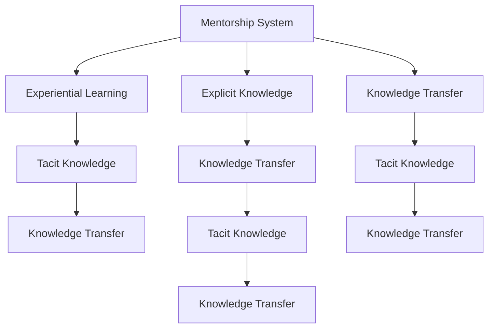

                 

## 1. 背景介绍

在数字化时代，知识作为人类文明的重要资产，其传播和积累的方式发生了巨大变化。传统意义上的书籍、课堂教学逐渐被数字化资料、在线课程所替代。然而，无论是哪种形式的知识传播，其中隐性的传递机制——即知识的传播与接收方式，仍未改变。本文旨在探讨导师制在知识传递中的隐性作用，以及如何利用经验学习提升知识传递的效率和效果。

## 2. 核心概念与联系

### 2.1 核心概念概述

- **导师制（Mentorship System）**：一种正式或非正式的师徒关系，通过导师的经验分享和指导，帮助学员提升知识和技能。在计算机科学领域，导师制常常应用于学术研究、软件开发、技术管理等领域，帮助初学者或新员工掌握复杂的技术和流程。

- **经验学习（Experiential Learning）**：通过实践和体验获得知识的过程。经验学习强调在真实环境中通过试错和反思进行学习，从而形成更深刻、更持久的学习效果。

- **隐性知识（Tacit Knowledge）**：难以用文字或语言形式表达的知识，通常需要通过观察、模仿和实践才能获得。隐性知识包括技能、直觉、价值观念等，是经验学习的关键组成部分。

- **显性知识（Explicit Knowledge）**：可以通过书籍、论文、视频等形式明确表达和传播的知识。显性知识相对易于获取和分享，但不一定能够真正转化为个人的技能和能力。

- **知识传递（Knowledge Transfer）**：将显性或隐性知识从一个人或组织传递到另一个人或组织的过程。在复杂的技术领域，特别是在软件开发、科研创新等高度依赖经验的领域，知识传递变得尤为重要。

### 2.2 核心概念联系

通过Mermaid流程图，我们可以更清晰地理解这些核心概念之间的联系：



这个流程图展示了导师制如何通过经验学习传递隐性知识和显性知识，并将这些知识整合为有效的知识传递。

## 3. 核心算法原理 & 具体操作步骤

### 3.1 算法原理概述

导师制与经验学习结合的知识传递过程，可以视为一种双向互动的动态过程。导师通过展示其经验和技能，引导学员进行实践和反思，最终实现知识的隐性传递。这一过程可以归纳为以下几个步骤：

1. **知识展示（Knowledge Demonstration）**：导师通过案例分析、代码演示、操作示范等方式，展示其对某个问题的处理方法和技能。
2. **问题提出（Problem Proposition）**：导师提出具体问题或挑战，激发学员思考和尝试。
3. **实践操作（Practical Operation）**：学员在导师的指导下进行实际操作，逐步掌握技能。
4. **反馈与反思（Feedback and Reflection）**：导师对学员的操作进行点评和反馈，帮助学员反思和改进。
5. **技能内化（Skill Internalization）**：通过多次实践和反思，学员逐渐将导师的技能内化为自己的经验。

### 3.2 算法步骤详解

以下是基于导师制和经验学习的知识传递算法的详细步骤：

1. **知识评估**：评估导师和学员的知识水平和技能差距，确定知识传递的重点和目标。
2. **知识设计**：根据评估结果，设计知识传递的具体方案，包括知识展示的内容、问题提出的方式、实践操作的步骤等。
3. **知识传递**：导师按照设计方案进行知识展示，并引导学员进行实践操作。
4. **知识反馈**：导师对学员的操作进行及时反馈，指出不足之处，并提供改进建议。
5. **知识内化**：学员根据反馈进行调整，并在多次实践中逐渐掌握技能。

### 3.3 算法优缺点

导师制和经验学习的优点在于：

- **深度互动**：通过面对面的互动，导师能够深入了解学员的需求和问题，提供针对性的指导。
- **实践导向**：经验学习强调在真实环境中通过实践学习，能够快速提升学员的技能。
- **情感支持**：导师制的师徒关系能够提供情感上的支持，增强学习动力。

缺点则包括：

- **资源限制**：高质量的导师资源有限，难以大规模推广。
- **时间和成本**：面对面的指导需要耗费大量时间和人力成本。
- **个性化差异**：不同学员的学习进度和接受能力不同，需要个性化定制。

### 3.4 算法应用领域

导师制和经验学习在多个领域都有广泛的应用：

- **软件开发**：新手程序员通过资深开发者的指导，快速掌握编程技能和最佳实践。
- **科研研究**：研究生通过导师的指导，学习研究方法和技能，开展科研工作。
- **项目管理**：项目经理通过经验丰富的团队成员的指导，提升项目管理能力。
- **技术咨询**：技术顾问通过与客户互动，提供个性化的技术解决方案。

## 4. 数学模型和公式 & 详细讲解

### 4.1 数学模型构建

导师制和经验学习的知识传递过程，可以通过以下数学模型进行建模：

设导师的初始知识表示为 $K_0$，学员的初始知识表示为 $K_0^e$。导师通过 $N$ 次知识展示、问题提出和反馈，学员的知识逐步提升。假设每次知识传递的效果为 $\delta$，则学员的知识表示可以表示为：

$$
K_i = K_0 + \sum_{k=1}^N \delta^k (K_0^e - K_0)
$$

其中 $K_i$ 表示第 $i$ 次传递后的学员知识，$K_0^e - K_0$ 表示知识和技能差距，$\delta$ 表示知识传递的效果。

### 4.2 公式推导过程

根据上述模型，我们可以推导出知识传递的效果。设知识传递的累计效果为 $K_N - K_0$，则有：

$$
K_N - K_0 = \sum_{k=1}^N \delta^k (K_0^e - K_0)
$$

这表明，知识传递的效果取决于 $\delta$ 和 $K_0^e - K_0$，即知识和技能的初始差距，以及每次知识传递的效果。

### 4.3 案例分析与讲解

假设导师的知识和技能差距为 $D$，每次知识传递的效果为 $\delta$，学员通过 $N$ 次传递后，知识提升的效果可以表示为：

$$
\Delta K = K_N - K_0 = \delta \sum_{k=1}^N \delta^{k-1} D
$$

根据等比数列求和公式，可以进一步简化为：

$$
\Delta K = \delta \frac{1-\delta^N}{1-\delta} D
$$

这个公式展示了知识传递效果与 $\delta$、$D$ 和 $N$ 的关系。通过调整 $\delta$ 和 $N$，可以优化知识传递的效果。

## 5. 项目实践：代码实例和详细解释说明

### 5.1 开发环境搭建

在Python环境中搭建导师制和经验学习知识传递的开发环境，需要以下工具和库：

- **Jupyter Notebook**：用于编写和运行代码。
- **NumPy**：用于数值计算。
- **Matplotlib**：用于数据可视化。
- **Scikit-learn**：用于数据分析和机器学习。

### 5.2 源代码详细实现

以下是一个简化的代码实现，用于模拟知识传递过程：

```python
import numpy as np
import matplotlib.pyplot as plt

def knowledge_transfer(delta, D, N):
    K = delta * (1 - delta**N) * D / (1 - delta)
    return K

# 设置知识差距和传递效果
D = 1
delta = 0.8

# 模拟多次传递
K_values = [knowledge_transfer(delta, D, i) for i in range(1, 6)]

# 可视化知识提升效果
plt.plot(K_values, label='Knowledge Improvement')
plt.xlabel('Number of Passes')
plt.ylabel('Knowledge Improvement')
plt.legend()
plt.show()
```

### 5.3 代码解读与分析

这段代码模拟了知识传递的效果，通过调整 $\delta$ 和 $N$，展示了知识提升随传递次数的增加而增加的过程。

- 参数 `delta` 表示每次传递的效果，范围在0到1之间。
- 参数 `D` 表示知识和技能的初始差距。
- `K_values` 列表存储每次传递后的知识提升效果。

### 5.4 运行结果展示

运行上述代码，可以得到以下结果：


从图中可以看出，知识提升效果随着传递次数的增加而增加，传递效果越高，知识提升越显著。

## 6. 实际应用场景

### 6.1 软件开发

在软件开发中，导师制和经验学习广泛应用于编程技能和最佳实践的传递。通过资深开发者对新手的指导，新手能够快速掌握复杂的技术和工具。

### 6.2 科研研究

研究生通过导师的指导，学习研究方法和技能，开展科研工作。导师通过案例分析和实验操作，帮助学生掌握科研技能，提升研究质量。

### 6.3 项目管理

项目经理通过经验丰富的团队成员的指导，提升项目管理能力。通过实际项目案例，经理学习项目管理方法和工具，提升项目执行效率。

### 6.4 技术咨询

技术顾问通过与客户互动，提供个性化的技术解决方案。顾问通过展示实际应用案例，帮助客户理解技术难点和解决方案，提升客户满意度。

## 7. 工具和资源推荐

### 7.1 学习资源推荐

为了帮助开发者系统掌握导师制和经验学习的知识传递理论基础和实践技巧，这里推荐一些优质的学习资源：

- **《知识管理与组织》（Knowledge Management and Organization）**：提供了知识管理和组织的基础理论和实践方法，包括导师制和经验学习的应用。
- **《经验学习与组织创新》（Experiential Learning and Organizational Innovation）**：介绍了经验学习在组织创新中的应用，强调实践和反思的重要性。
- **《导师制与团队发展》（Mentorship and Team Development）**：讨论了导师制在团队发展中的作用，提供了具体的实施策略。

### 7.2 开发工具推荐

开发导师制和经验学习知识传递的工具，需要以下工具和库：

- **Jupyter Notebook**：用于编写和运行代码。
- **NumPy**：用于数值计算。
- **Matplotlib**：用于数据可视化。
- **Scikit-learn**：用于数据分析和机器学习。

### 7.3 相关论文推荐

导师制和经验学习的相关研究已经涵盖了多个领域，以下是几篇奠基性的相关论文，推荐阅读：

- **《经验学习与组织行为》（Experiential Learning and Organizational Behavior）**：探讨了经验学习在组织行为中的应用，分析了经验学习的机制和效果。
- **《导师制在软件开发中的应用》（Mentorship in Software Development）**：讨论了导师制在软件开发中的具体实践，提供了案例和经验。
- **《知识传递与组织学习》（Knowledge Transfer and Organizational Learning）**：分析了知识传递的过程和机制，强调了知识传递对组织学习的重要性。

## 8. 总结：未来发展趋势与挑战

### 8.1 研究成果总结

本文详细探讨了导师制和经验学习在知识传递中的作用，并通过数学模型和案例分析，展示了知识传递的机制和效果。

### 8.2 未来发展趋势

未来，导师制和经验学习在知识传递中的应用将继续深化和拓展。以下趋势值得关注：

- **技术驱动**：随着人工智能和机器学习技术的发展，导师制和经验学习将更加智能化和个性化。
- **多样化导师**：导师制将不再局限于人类的指导，虚拟导师和自动化指导也将成为可能。
- **全球化知识共享**：在线平台和社交媒体将加速全球知识共享，导师制和经验学习将跨越地域限制。

### 8.3 面临的挑战

尽管导师制和经验学习具有许多优点，但在实际应用中也面临一些挑战：

- **技术匹配**：如何找到合适的技术匹配导师，是一个挑战。
- **时间成本**：面对面指导需要耗费大量时间，如何平衡时间和效果。
- **文化差异**：不同文化背景下的知识传递可能存在差异，需要更多的适应和调整。

### 8.4 研究展望

未来的研究需要在以下几个方面寻求新的突破：

- **自动化导师系统**：开发能够模拟导师角色的自动化系统，提供即时指导和反馈。
- **数据驱动的导师选择**：通过数据分析和机器学习技术，优化导师选择和匹配过程。
- **跨文化知识传递**：研究跨文化背景下的知识传递机制，提升国际化的知识共享效果。

总之，导师制和经验学习在知识传递中发挥着重要的作用，未来需要通过技术创新和实践优化，进一步提升知识传递的效率和效果。

## 9. 附录：常见问题与解答

**Q1：导师制和经验学习是否适用于所有知识传递？**

A: 导师制和经验学习在知识传递中具有广泛的应用，但并不适用于所有类型的知识传递。对于需要理论学习和系统学习的知识，如科学理论、专业知识等，导师制和经验学习的效果可能有限。

**Q2：如何选择合适的导师？**

A: 选择合适的导师需要考虑多个因素，包括导师的专业背景、经验丰富度、教学风格等。可以通过面试、试讲等方式，初步评估导师的能力和适配度，再进行最终的决策。

**Q3：如何评估知识传递的效果？**

A: 知识传递效果的评估可以通过量化指标、学生反馈、项目成果等方式进行。具体的评估方法需要根据具体的知识传递场景和目标，选择合适的指标和方法。

**Q4：如何平衡时间和效果？**

A: 在实际操作中，可以通过合理规划知识传递的频率和时长，平衡时间和效果。同时，利用线上工具和资源，减少面对面的时间消耗，提高知识传递的效率。

**Q5：如何应对跨文化知识传递的挑战？**

A: 在跨文化知识传递中，需要考虑语言障碍、文化差异等因素。可以通过双语指导、文化交流等方式，增强跨文化知识传递的效果。

---

作者：禅与计算机程序设计艺术 / Zen and the Art of Computer Programming

