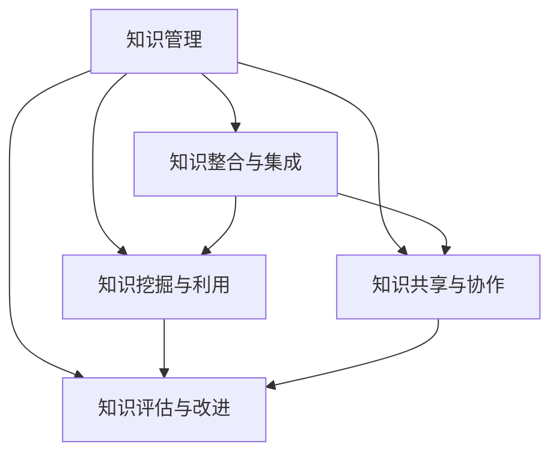

                 

# 知识管理：管理者的核心能力

在当今信息爆炸的时代，知识和信息已经成为了企业竞争力的关键因素。有效的知识管理不仅能够提升企业的创新能力和业务效率，还能够帮助企业实现长期发展。本文将从背景介绍、核心概念与联系、核心算法原理与操作步骤、数学模型与详细讲解、项目实践、实际应用场景、工具与资源推荐、总结、未来发展趋势与挑战以及常见问题解答等多个角度，全面探讨知识管理的核心能力。

## 1. 背景介绍

### 1.1 问题由来

随着全球化进程的加快和科技的飞速发展，企业面临的市场竞争越来越激烈。信息时代带来的海量数据和信息，对企业的知识管理和创新能力提出了更高的要求。然而，由于信息分散、知识碎片化、缺乏有效组织和共享机制，很多企业在知识管理方面存在不少问题。这些问题不仅影响企业的运营效率，还可能错失市场机遇。

例如，传统企业中，信息主要通过文件、会议和邮件等方式传递，这些信息往往是孤立和分散的。信息孤岛现象严重，导致信息传递不畅，知识共享和复用困难。随着技术的进步，尤其是人工智能和大数据技术的普及，许多企业开始利用信息技术改善知识管理，但仍然存在许多挑战。因此，如何更好地管理、利用和分享知识，成为现代企业管理者必须面对的重要课题。

### 1.2 问题核心关键点

为了解决知识管理中的问题，我们需要从以下几个关键点入手：

- **知识整合与集成**：如何将分散的、异构的知识整合和集成起来，形成系统的、可共享的知识库。
- **知识挖掘与利用**：如何通过先进的技术手段，从大量信息中挖掘出有价值的知识，并有效利用这些知识。
- **知识共享与协作**：如何建立有效的知识共享机制，促进员工之间的协作与交流，最大化知识的价值。
- **知识评估与改进**：如何对知识管理的效果进行评估，并不断改进和优化知识管理流程。

### 1.3 问题研究意义

有效的知识管理对企业的长期发展具有重要意义：

- **提升创新能力**：知识管理可以加速信息流动和知识共享，帮助企业快速响应市场变化，提升创新能力和竞争力。
- **提高运营效率**：通过知识管理，企业可以优化流程、提高效率，降低运营成本。
- **增强员工协作**：知识共享和协作机制的建立，可以促进团队合作，提升团队士气和工作满意度。
- **提升决策质量**：基于丰富的知识资源，企业可以做出更加明智的决策，降低风险。

## 2. 核心概念与联系

### 2.1 核心概念概述

为了更好地理解知识管理的核心能力，本节将介绍几个密切相关的核心概念：

- **知识管理(Knowledge Management, KM)**：通过规划、控制和利用知识资产来提高组织运营效率和竞争优势的战略过程。
- **知识整合与集成(Knowledge Integration and Integration, KII)**：将分散的、异构的知识源进行整合和集成，形成系统化的知识体系。
- **知识挖掘与利用(Knowledge Mining and Utilization, KMU)**：通过先进的计算技术从大量信息中挖掘出有价值的知识，并有效利用这些知识。
- **知识共享与协作(Knowledge Sharing and Collaboration, KSC)**：建立有效的知识共享机制，促进员工之间的协作与交流。
- **知识评估与改进(Knowledge Assessment and Improvement, KAI)**：对知识管理的效果进行评估，并不断改进和优化知识管理流程。

这些概念之间的逻辑关系可以通过以下Mermaid流程图来展示：



这个流程图展示的知识管理的核心概念及其之间的关系：

1. 知识管理是整个知识管理的战略过程。
2. 知识整合与集成、知识挖掘与利用、知识共享与协作、知识评估与改进是知识管理的具体实践环节。
3. 这些具体实践环节相互关联，形成一个有机的整体。

## 3. 核心算法原理 & 具体操作步骤

### 3.1 算法原理概述

知识管理的核心算法原理主要包括以下几个方面：

- **知识映射与关联**：通过知识图谱、本体等方法，将分散的知识源进行映射和关联，形成系统的知识体系。
- **知识抽取与挖掘**：通过文本挖掘、数据挖掘等技术手段，从大量信息中抽取和挖掘出有价值的知识。
- **知识表示与存储**：通过语义网、元数据等方法，将知识表示成易于理解和检索的形式，并存储在知识库中。
- **知识共享与协作**：通过社交网络、协作平台等技术，促进知识的共享和协作，提升团队协作效率。
- **知识评估与改进**：通过度量与评估技术，对知识管理的效果进行量化评估，并不断改进和优化知识管理流程。

### 3.2 算法步骤详解

知识管理的核心算法步骤主要包括：

1. **知识采集**：从各种数据源（如文档、数据库、社交网络等）中采集相关知识。
2. **知识整合与映射**：通过知识图谱、本体等方法，将采集到的知识进行整合和映射，形成系统的知识体系。
3. **知识抽取与挖掘**：利用自然语言处理（NLP）、文本挖掘等技术，从大量信息中抽取和挖掘出有价值的知识。
4. **知识表示与存储**：将抽取出的知识表示成语义网、元数据等形式，存储在知识库中。
5. **知识共享与协作**：通过协作平台、社交网络等技术，促进知识的共享和协作，提升团队协作效率。
6. **知识评估与改进**：通过度量与评估技术，对知识管理的效果进行量化评估，并不断改进和优化知识管理流程。

### 3.3 算法优缺点

知识管理的核心算法具有以下优点：

- **系统性**：通过知识图谱、本体等方法，将分散的知识进行整合和映射，形成系统的知识体系，有助于全面、系统地管理知识。
- **高效性**：利用先进的计算技术，从大量信息中抽取和挖掘出有价值的知识，提高知识管理的效率。
- **协作性**：通过协作平台、社交网络等技术，促进知识的共享和协作，提升团队协作效率。

同时，知识管理的核心算法也存在一些缺点：

- **复杂性**：知识管理涉及的环节较多，包括知识采集、整合、抽取、表示、共享、评估等多个环节，技术实现较为复杂。
- **数据质量依赖**：知识管理的质量很大程度上依赖于数据的质量和完整性，数据源的多样性和准确性对知识管理的效率和效果影响较大。
- **成本高**：知识管理涉及大量的技术实现和资源投入，成本较高，尤其是对于中小企业而言。

### 3.4 算法应用领域

知识管理的核心算法在多个领域得到了广泛的应用，例如：

- **企业知识管理**：帮助企业整合、挖掘、共享和评估知识，提升企业的创新能力和运营效率。
- **政府知识管理**：通过知识图谱、本体等方法，提升政府的决策水平和服务质量。
- **学术知识管理**：利用知识管理技术，促进学术知识的共享和传播，加速科研创新。
- **医疗知识管理**：通过知识图谱、本体等方法，提升医疗信息的整合和共享，提高医疗服务质量。
- **金融知识管理**：利用知识管理技术，提升金融机构的决策水平和风险控制能力。

## 4. 数学模型和公式 & 详细讲解 & 举例说明

### 4.1 数学模型构建

为了更好地理解知识管理的核心算法，我们构建了以下数学模型：

- **知识图谱模型**：使用图谱模型表示知识之间的关系，如RDF、OWL等。
- **知识本体模型**：使用本体模型描述知识的结构和属性，如RDFS、OWL等。
- **知识抽取模型**：利用文本挖掘和NLP技术，从文本数据中抽取知识，如信息抽取、关系抽取等。
- **知识表示模型**：使用语义网、元数据等方法，将知识表示成易于理解和检索的形式。
- **知识共享与协作模型**：利用社交网络、协作平台等技术，促进知识的共享和协作。
- **知识评估与改进模型**：通过度量与评估技术，对知识管理的效果进行量化评估，并不断改进和优化知识管理流程。

### 4.2 公式推导过程

以下我们以知识图谱模型为例，推导其基本原理和实现过程。

知识图谱模型通常使用RDF（Resource Description Framework）表示知识实体之间的关系。RDF的三元组形式为：（主语、谓语、宾语），可以表示实体之间的关系和属性。例如，使用RDF表示的实例如下：

```rdf
<http://example.org/book> <http://example.org/title> "The Great Gatsby" .
<http://example.org/book> <http://example.org/author> <http://example.org/fitzgerald> .
<http://example.org/book> <http://example.org/publisher> <http://example.org/barnesAndNoble> .
<http://example.org/book> <http://example.org/publishedYear> "1925" .
```

其中，`<http://example.org/book>`表示书籍的实体，`<http://example.org/title>`表示书的标题，`<http://example.org/fitzgerald>`表示作者实体，`<http://example.org/barnesAndNoble>`表示出版商实体，`<http://example.org/publishedYear>`表示出版年份属性。

在知识图谱中，实体之间的关系可以分为三种类型：

- **属性关系**：描述实体与属性的关系，如上例中的`<http://example.org/publishedYear>`属性。
- **关系类型**：描述实体之间的关系，如上例中的`<http://example.org/title>`关系。
- **实体关系**：描述实体之间的组合关系，如上例中的`<http://example.org/book>`和`<http://example.org/fitzgerald>`之间的关系。

在知识抽取过程中，可以使用信息抽取技术，从文本数据中提取出实体、关系和属性，并构建知识图谱模型。例如，假设我们从文本数据中抽取到以下信息：

- 书籍：《了不起的盖茨比》，作者：Fitzgerald，出版社：Barnes & Noble，出版年份：1925年。

可以构建如下的知识图谱模型：

```rdf
<http://example.org/book> <http://example.org/title> "The Great Gatsby" .
<http://example.org/book> <http://example.org/author> <http://example.org/fitzgerald> .
<http://example.org/book> <http://example.org/publisher> <http://example.org/barnesAndNoble> .
<http://example.org/book> <http://example.org/publishedYear> "1925" .
```

在知识抽取过程中，可以使用命名实体识别（Named Entity Recognition, NER）和关系抽取（Relation Extraction, RE）等技术，从文本中提取实体和关系，构建知识图谱模型。

### 4.3 案例分析与讲解

假设我们有一个小型企业的知识管理平台，需要对客户、产品、订单等数据进行整合和管理。首先，我们需要采集相关的数据，例如：

- 客户信息：姓名、地址、电话等。
- 产品信息：名称、规格、价格等。
- 订单信息：订单号、客户、产品、数量、价格等。

然后，我们需要对采集到的数据进行整合和映射，构建知识图谱模型。例如，我们可以将客户、产品和订单等实体映射到知识图谱中，构建如下的知识图谱模型：

```rdf
<http://example.org/customer> <http://example.org/name> "张三" .
<http://example.org/customer> <http://example.org/address> "北京市海淀区中关村" .
<http://example.org/customer> <http://example.org/phone> "138xxxxxxx" .

<http://example.org/product> <http://example.org/name> "iPhone 12" .
<http://example.org/product> <http://example.org/price> "6999元" .
<http://example.org/product> <http://example.org/available> "100" .

<http://example.org/order> <http://example.org/customer> <http://example.org/customer1> .
<http://example.org/order> <http://example.org/product> <http://example.org/product1> .
<http://example.org/order> <http://example.org/quantity> "2" .
<http://example.org/order> <http://example.org/price> "13998元" .
```

在知识抽取过程中，可以使用NER和RE等技术，从订单信息中提取出客户、产品和订单等实体和关系，并构建知识图谱模型。例如，假设我们从订单信息中抽取到以下信息：

- 订单号：2021-01-01-001，客户：张三，产品：iPhone 12，数量：2，价格：6999元。

可以构建如下的知识图谱模型：

```rdf
<http://example.org/order> <http://example.org/customer> <http://example.org/customer1> .
<http://example.org/order> <http://example.org/product> <http://example.org/product1> .
<http://example.org/order> <http://example.org/quantity> "2" .
<http://example.org/order> <http://example.org/price> "6999元" .
```

在知识表示过程中，可以使用语义网、元数据等方法，将知识表示成易于理解和检索的形式，并存储在知识库中。例如，我们可以将上述知识图谱模型存储在RDF文件中，用于后续的查询和分析。

## 5. 项目实践：代码实例和详细解释说明

### 5.1 开发环境搭建

在进行知识管理项目实践前，我们需要准备好开发环境。以下是使用Python进行SPARQL语言进行开发的环境配置流程：

1. 安装RDF库：从官网下载并安装RDF库，用于处理和操作RDF数据。
```bash
pip install rdf2json
```

2. 安装SPARQL查询工具：从官网下载并安装SPARQL查询工具，用于查询和分析RDF数据。
```bash
pip install sparqlwrapper
```

3. 安装RDF数据库：从官网下载并安装RDF数据库，用于存储和管理RDF数据。
```bash
pip install rdftk
```

完成上述步骤后，即可在开发环境中进行知识管理项目实践。

### 5.2 源代码详细实现

下面是一个简单的示例代码，用于展示如何使用Python进行知识管理项目实践。

```python
from rdf2json import RDF2JSON, rdftk
from sparqlwrapper import SPARQL

# 创建RDF2JSON对象，将RDF文件转换为JSON格式
rdf_file = 'example.rdf'
json_file = 'example.json'
rdf2json = RDF2JSON(rdf_file)
json_data = rdf2json.convert()
with open(json_file, 'w') as f:
    f.write(json_data)

# 创建SPARQL查询对象，从RDF数据库中查询数据
endpoint = 'http://example.org/endpoint'
sparql = SPARQL(endpoint)
query = '''
SELECT ?customer ?product ?quantity ?price
WHERE {
  ?order <http://example.org/customer> ?customer ;
         <http://example.org/product> ?product ;
         <http://example.org/quantity> ?quantity ;
         <http://example.org/price> ?price .
}
'''
result = sparql.query(query)
for row in result['results']['bindings']:
    customer = row['customer']['value']
    product = row['product']['value']
    quantity = row['quantity']['value']
    price = row['price']['value']
    print(f"订单号：{row['order']['value']}，客户：{customer}，产品：{product}，数量：{quantity}，价格：{price}")
```

在上述代码中，我们首先使用RDF2JSON库将RDF文件转换为JSON格式，然后创建SPARQL查询对象，从RDF数据库中查询数据。最后，使用循环输出查询结果。

### 5.3 代码解读与分析

让我们再详细解读一下关键代码的实现细节：

**RDF2JSON类**：
- `__init__`方法：初始化RDF文件路径。
- `convert`方法：将RDF文件转换为JSON格式，并返回JSON数据。

**SPARQL类**：
- `__init__`方法：初始化SPARQL查询端点。
- `query`方法：执行查询，并返回查询结果。

**查询语句**：
- 使用SPARQL查询语句，从RDF数据库中查询订单信息。

**循环输出**：
- 遍历查询结果，输出订单信息。

可以看到，Python结合RDF和SPARQL技术，可以高效地进行知识管理项目实践。开发者可以进一步扩展和优化代码，实现更复杂的知识管理功能。

## 6. 实际应用场景

### 6.1 智能客服系统

智能客服系统是知识管理的一个重要应用场景。传统客服系统需要大量人力，无法24小时在线服务，且难以快速响应复杂咨询。通过知识管理技术，智能客服系统可以整合和利用企业内部的知识库，实现自动回答客户咨询，提升客户满意度。

在智能客服系统中，知识管理主要体现在以下几个方面：

- **知识库构建**：通过采集、整合和挖掘客户咨询记录，构建知识库，涵盖常见问题和解决方案。
- **自然语言理解**：利用NLP技术，理解客户咨询，匹配知识库中的问题和答案。
- **知识推荐**：根据客户咨询，推荐相关的知识库内容，提升咨询效率。
- **知识更新**：实时更新知识库，保持知识的时效性和准确性。

### 6.2 金融风险管理

金融风险管理是知识管理的另一个重要应用场景。金融市场风险多变，需要实时监测和分析市场动态，预测和防范风险。通过知识管理技术，金融机构可以整合和利用市场信息，提升风险评估和决策能力。

在金融风险管理中，知识管理主要体现在以下几个方面：

- **市场数据采集**：采集和整合市场数据，如股票价格、交易量、财经新闻等。
- **数据挖掘与分析**：利用数据挖掘技术，分析市场数据，识别风险因素。
- **知识图谱构建**：构建市场知识图谱，描述市场实体和关系。
- **风险预测**：利用知识图谱和数据分析结果，预测市场风险，制定风险应对策略。

### 6.3 医疗健康管理

医疗健康管理是知识管理的另一个重要应用场景。医疗信息分散且复杂，需要有效的整合和利用，提升医疗服务质量和效率。通过知识管理技术，医疗机构可以整合和利用医疗信息，提升诊疗效率和服务质量。

在医疗健康管理中，知识管理主要体现在以下几个方面：

- **电子病历整合**：整合和利用电子病历数据，构建病历知识库。
- **医疗知识抽取**：利用NLP技术，从病历、文献等数据中抽取医疗知识。
- **知识推理**：利用知识图谱和推理技术，提升诊疗决策能力。
- **知识共享与协作**：促进医生之间的知识共享和协作，提升医疗服务质量。

### 6.4 未来应用展望

随着知识管理技术的不断发展，未来知识管理将具有以下发展趋势：

- **语义网技术的应用**：语义网技术将进一步发展，使得知识管理更加智能化、可理解化。
- **人工智能技术的集成**：人工智能技术将与知识管理更加紧密集成，提升知识管理的效果和效率。
- **大数据技术的结合**：大数据技术将与知识管理结合，从海量数据中挖掘有价值的知识，提升知识管理的深度和广度。
- **知识图谱的普及**：知识图谱将成为知识管理的标准形式，提升知识管理的系统性和可扩展性。
- **跨领域知识管理**：知识管理将超越单一领域，向跨领域、跨行业扩展，实现更广泛的知识整合和共享。

## 7. 工具和资源推荐

### 7.1 学习资源推荐

为了帮助开发者系统掌握知识管理的相关知识，这里推荐一些优质的学习资源：

1. 《知识管理与信息检索》书籍：系统介绍了知识管理的基本概念、技术和应用，适合入门学习。
2. 《语义网技术》书籍：介绍了语义网的基本概念、技术和应用，适合深入学习。
3. 《智能客服系统设计与实现》课程：介绍智能客服系统的设计与实现，涵盖知识管理技术的应用。
4. 《金融风险管理》课程：介绍金融风险管理中的知识管理应用，涵盖数据挖掘、知识图谱等技术。
5. 《医疗健康管理》课程：介绍医疗健康管理中的知识管理应用，涵盖电子病历、知识抽取等技术。

通过对这些资源的学习实践，相信你一定能够快速掌握知识管理的基本概念和实践技巧，并用于解决实际的业务问题。

### 7.2 开发工具推荐

高效的开发离不开优秀的工具支持。以下是几款用于知识管理开发的常用工具：

1. RDF库：用于处理和操作RDF数据，支持多种RDF格式和语义网应用。
2. SPARQL查询工具：用于查询和分析RDF数据，支持多种查询语句和语义网应用。
3. RDF数据库：用于存储和管理RDF数据，支持多种存储格式和查询工具。
4. Semantic Web IDE：基于Web的语义网开发工具，提供可视化开发环境。
5. Protégé：基于Java的语义网开发工具，支持多种RDF和OWL应用程序。

合理利用这些工具，可以显著提升知识管理的开发效率，加快创新迭代的步伐。

### 7.3 相关论文推荐

知识管理领域的研究非常活跃，以下是几篇奠基性的相关论文，推荐阅读：

1. "Knowledge Management: Concepts, Tools, Applications"：介绍了知识管理的基本概念、工具和技术。
2. "Semantic Web and Knowledge Management"：介绍了语义网技术在知识管理中的应用。
3. "Integrating Knowledge Management with Business Processes"：介绍了知识管理与业务流程的集成。
4. "Knowledge Mining and Management in Healthcare"：介绍了医疗健康管理中的知识管理应用。
5. "Finance Risk Management and Knowledge Management"：介绍了金融风险管理中的知识管理应用。

这些论文代表了大规模知识管理的最新进展，对于理解知识管理的深度和广度具有重要参考价值。

## 8. 总结：未来发展趋势与挑战

### 8.1 总结

本文对知识管理的核心能力进行了全面系统的介绍。首先阐述了知识管理的背景和意义，明确了知识管理在企业运营和决策中的重要价值。其次，从核心概念、核心算法原理与操作步骤、数学模型与详细讲解、项目实践、实际应用场景、工具与资源推荐、未来发展趋势与挑战等多个角度，全面探讨了知识管理的基本概念和实践技巧。

通过本文的系统梳理，可以看到，知识管理技术在企业运营和决策中具有重要的作用，能够提升企业的运营效率和决策水平。未来的知识管理技术将继续发展和演进，为企业的数字化转型和智能化升级提供新的技术支撑。

### 8.2 未来发展趋势

展望未来，知识管理技术将呈现以下几个发展趋势：

1. **语义网技术的普及**：语义网技术将进一步发展，使得知识管理更加智能化、可理解化。
2. **人工智能技术的集成**：人工智能技术将与知识管理更加紧密集成，提升知识管理的效果和效率。
3. **大数据技术的结合**：大数据技术将与知识管理结合，从海量数据中挖掘有价值的知识，提升知识管理的深度和广度。
4. **知识图谱的普及**：知识图谱将成为知识管理的标准形式，提升知识管理的系统性和可扩展性。
5. **跨领域知识管理**：知识管理将超越单一领域，向跨领域、跨行业扩展，实现更广泛的知识整合和共享。

这些趋势凸显了知识管理技术的广阔前景。这些方向的探索发展，必将进一步提升知识管理的系统性和可扩展性，为企业的数字化转型和智能化升级提供新的技术支撑。

### 8.3 面临的挑战

尽管知识管理技术已经取得了不小的进展，但在迈向更加智能化、普适化应用的过程中，它仍面临着诸多挑战：

1. **数据质量依赖**：知识管理的质量很大程度上依赖于数据的质量和完整性，数据源的多样性和准确性对知识管理的效率和效果影响较大。
2. **技术复杂性**：知识管理涉及的环节较多，技术实现较为复杂，需要大量的技术积累和实践经验。
3. **成本高**：知识管理涉及大量的技术实现和资源投入，成本较高，尤其是对于中小企业而言。
4. **隐私和安全**：知识管理涉及大量的敏感数据，如何保护数据隐私和安全，是一个重要挑战。
5. **知识孤岛**：当前的知识管理工具和系统往往比较孤立，缺乏统一的接口和标准，导致知识孤岛现象严重，影响知识共享和协作。

正视知识管理面临的这些挑战，积极应对并寻求突破，将是大规模知识管理走向成熟的必由之路。相信随着学界和产业界的共同努力，这些挑战终将一一被克服，知识管理技术必将在构建智能化、数字化企业中发挥更大的作用。

### 8.4 研究展望

未来的知识管理研究需要在以下几个方面寻求新的突破：

1. **语义网技术的深入研究**：进一步研究语义网技术，提升知识的可理解性和可操作性。
2. **人工智能技术的深度集成**：将人工智能技术与知识管理更加紧密集成，提升知识管理的效果和效率。
3. **大数据技术的结合应用**：将大数据技术与知识管理结合，从海量数据中挖掘有价值的知识，提升知识管理的深度和广度。
4. **知识图谱的统一标准**：制定和推广知识图谱的标准和规范，促进知识的统一管理和共享。
5. **跨领域知识管理的协同**：研究跨领域知识管理的协同机制，实现更广泛的知识整合和共享。

这些研究方向的探索，必将引领知识管理技术迈向更高的台阶，为构建智能化、数字化企业提供新的技术支撑。面向未来，知识管理技术还需要与其他人工智能技术进行更深入的融合，如自然语言处理、数据挖掘、机器学习等，多路径协同发力，共同推动知识管理技术的发展。只有勇于创新、敢于突破，才能不断拓展知识管理的边界，让智能技术更好地服务人类社会。

## 9. 附录：常见问题与解答

**Q1：知识管理技术在企业运营中的应用场景有哪些？**

A: 知识管理技术在企业运营中的应用场景非常广泛，以下是一些主要的应用场景：

- **客户服务管理**：通过整合和利用客户服务数据，提升客户满意度和服务质量。
- **产品研发管理**：通过整合和利用研发数据，提升产品开发效率和质量。
- **市场营销管理**：通过整合和利用市场数据，提升市场分析和决策能力。
- **人力资源管理**：通过整合和利用员工数据，提升人力资源管理和员工培训效果。
- **财务和审计管理**：通过整合和利用财务和审计数据，提升财务分析和审计能力。

**Q2：知识管理技术在知识抽取和挖掘过程中，常用的技术手段有哪些？**

A: 在知识抽取和挖掘过程中，常用的技术手段包括以下几种：

- **自然语言处理（NLP）**：利用NLP技术，从文本数据中抽取实体、关系和属性，如信息抽取、关系抽取等。
- **数据挖掘**：利用数据挖掘技术，从大量数据中挖掘出有价值的知识，如分类、聚类、关联规则等。
- **文本挖掘**：利用文本挖掘技术，从文本数据中挖掘出有价值的信息，如情感分析、主题建模等。
- **知识图谱**：利用知识图谱技术，将知识表示为图谱形式，便于查询和推理。
- **语义网**：利用语义网技术，描述知识实体之间的关系和属性，提升知识可理解性和可操作性。

**Q3：知识管理技术在实施过程中，需要注意哪些问题？**

A: 在实施知识管理技术时，需要注意以下几个问题：

- **数据质量**：数据质量是知识管理的基础，需要保证数据的多样性、准确性和完整性。
- **技术复杂性**：知识管理涉及的环节较多，技术实现较为复杂，需要大量的技术积累和实践经验。
- **成本高**：知识管理涉及大量的技术实现和资源投入，成本较高，尤其是对于中小企业而言。
- **隐私和安全**：知识管理涉及大量的敏感数据，如何保护数据隐私和安全，是一个重要挑战。
- **知识孤岛**：当前的知识管理工具和系统往往比较孤立，缺乏统一的接口和标准，导致知识孤岛现象严重，影响知识共享和协作。

**Q4：知识管理技术的未来发展方向有哪些？**

A: 知识管理技术的未来发展方向包括以下几个方面：

- **语义网技术的普及**：语义网技术将进一步发展，使得知识管理更加智能化、可理解化。
- **人工智能技术的集成**：人工智能技术将与知识管理更加紧密集成，提升知识管理的效果和效率。
- **大数据技术的结合**：大数据技术将与知识管理结合，从海量数据中挖掘有价值的知识，提升知识管理的深度和广度。
- **知识图谱的普及**：知识图谱将成为知识管理的标准形式，提升知识管理的系统性和可扩展性。
- **跨领域知识管理的协同**：研究跨领域知识管理的协同机制，实现更广泛的知识整合和共享。

**Q5：知识管理技术在医疗健康管理中的应用有哪些？**

A: 知识管理技术在医疗健康管理中的应用包括以下几个方面：

- **电子病历整合**：整合和利用电子病历数据，构建病历知识库。
- **医疗知识抽取**：利用NLP技术，从病历、文献等数据中抽取医疗知识。
- **知识推理**：利用知识图谱和推理技术，提升诊疗决策能力。
- **知识共享与协作**：促进医生之间的知识共享和协作，提升医疗服务质量。

---

作者：禅与计算机程序设计艺术 / Zen and the Art of Computer Programming

