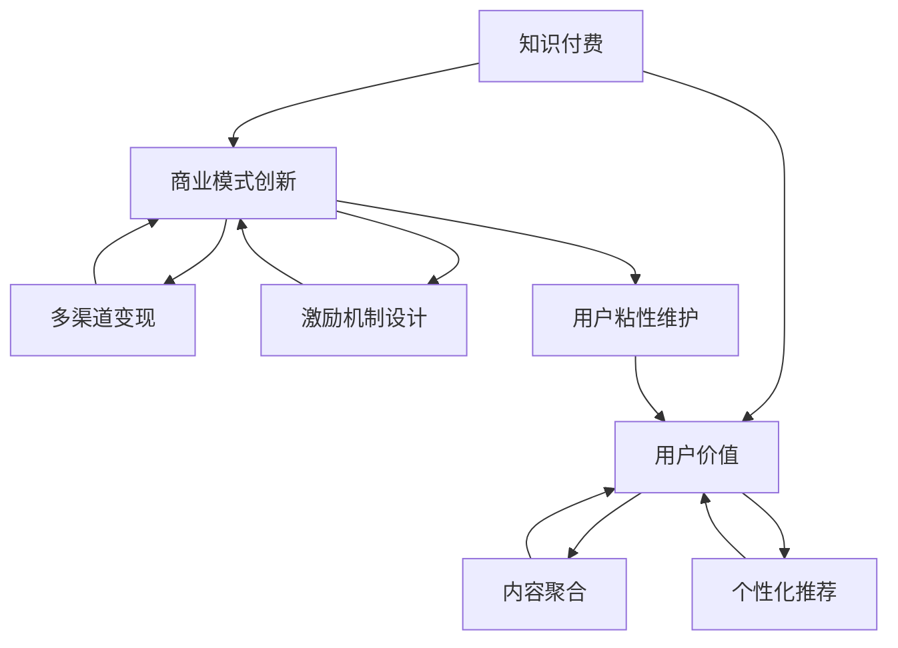

                 

# 知识经济时代下的知识付费创新商业模式运营

> 关键词：知识付费, 商业模式创新, 用户价值, 内容聚合, 个性化推荐, 多渠道变现, 激励机制设计, 用户粘性维护

## 1. 背景介绍

### 1.1 问题由来

随着互联网的普及和信息技术的飞速发展，人们获取知识和信息的方式发生了翻天覆地的变化。从搜索引擎到社交媒体，从免费资源到付费订阅，用户的行为模式和需求呈现出多样化的特征。在这个信息爆炸的时代，知识付费成为了一种新兴的商业模式，旨在通过有偿的方式向用户提供高质量、高价值的内容，满足其个性化、专业化的学习需求。

然而，传统的知识付费模式面临着诸多挑战：内容同质化严重、用户粘性低、营收模式单一等问题屡屡出现。如何在知识经济时代下，探索出一条可持续、高效、个性化的知识付费创新商业模式，成为当前NLP技术在实际应用中的一个重要课题。

## 2. 核心概念与联系

### 2.1 核心概念概述

为了更好地理解知识付费创新商业模式运营的核心概念，本节将介绍几个密切相关的核心概念：

- **知识付费**：指用户通过支付一定费用，获取高质量、专业化的知识内容，如在线课程、电子书、专业报告等。这种模式能够有效提升用户的学习体验，促进知识的传播和应用。

- **商业模式创新**：指企业通过创新设计，探索新的盈利模式和价值创造方式，以适应市场变化和用户需求。知识付费领域的商业模式创新，需要结合NLP技术，挖掘用户深度需求，提供差异化的内容和服务。

- **用户价值**：指用户在使用知识付费平台时，所能获得的具体好处和满足感。例如，知识付费平台提供的个性化推荐、智能答疑、社群互动等功能，都能提升用户的学习效果和体验。

- **内容聚合**：指通过技术手段，将海量的知识资源进行整理、筛选、分类，形成系统、有结构的知识库。内容聚合能够有效提升知识付费平台的资源丰富度，满足用户的多样化需求。

- **个性化推荐**：指通过NLP技术，分析用户的学习习惯、兴趣偏好、行为数据等，为用户推荐最符合其需求的内容。个性化推荐能够提升用户粘性，增加用户留存率。

- **多渠道变现**：指知识付费平台通过多种渠道进行盈利，如课程销售、订阅服务、广告、知识付费社区等。多渠道变现能够分散风险，提高平台的收入水平。

- **激励机制设计**：指知识付费平台通过积分奖励、会员特权、成就系统等方式，激励用户积极参与内容创作、交流互动等。良好的激励机制能够提升用户活跃度和平台活力。

- **用户粘性维护**：指通过持续改进用户体验、增强社区氛围、提供增值服务等方式，提高用户对平台的粘性。高粘性用户是知识付费平台的核心资产。

这些核心概念之间的逻辑关系可以通过以下Mermaid流程图来展示：



这个流程图展示了几者之间的核心联系：

1. 知识付费是商业模式创新的基础，平台需要围绕用户价值，提供多样化的内容和服务。
2. 内容聚合和个性化推荐是提升用户价值的关键手段，能够有效提升用户的学习效果和体验。
3. 多渠道变现和激励机制设计是商业模式创新的具体实现方式，能够增加平台的收入来源和用户粘性。
4. 用户粘性维护是知识付费平台的核心目标，能够提升平台的用户留存率和活跃度。

## 3. 核心算法原理 & 具体操作步骤
### 3.1 算法原理概述

知识付费创新商业模式的运营，本质上是一个基于NLP技术的个性化推荐系统设计问题。其核心思想是：通过分析用户的学习行为和兴趣偏好，为其推荐最符合需求的知识内容，同时设计合理的激励机制和变现策略，实现平台的商业可持续性。

具体来说，知识付费平台的推荐系统需要满足以下几个关键目标：

1. **提升用户价值**：通过个性化的内容推荐，使用户获得更丰富、更高效的知识点，提升其学习效果和体验。
2. **增加用户粘性**：通过互动功能、社群服务等方式，增加用户对平台的依赖性，提升用户留存率。
3. **实现多渠道变现**：通过课程销售、订阅服务、广告等多种方式，增加平台的收入来源。
4. **激励用户贡献**：通过积分奖励、会员特权等方式，激励用户积极参与内容创作和交流互动。

### 3.2 算法步骤详解

知识付费推荐系统的设计和实现，一般包括以下几个关键步骤：

**Step 1: 数据收集与处理**

- 收集用户的学习行为数据，包括浏览、点击、购买、评分、评论等。
- 收集内容元数据，如课程名称、标签、难度、价格等。
- 使用自然语言处理技术，如分词、命名实体识别、情感分析等，提取和结构化数据。
- 构建用户-内容关联矩阵，表示用户对不同内容的偏好和评价。

**Step 2: 用户画像建模**

- 利用聚类、分类、关联规则等算法，分析用户的行为模式和兴趣偏好。
- 构建用户画像，包括基本信息、兴趣领域、学习偏好等。
- 使用矩阵分解、深度学习等技术，学习用户与内容之间的隐含关联。

**Step 3: 内容相似度计算**

- 使用余弦相似度、Jaccard相似度、Jensen-Shannon divergence等指标，计算内容之间的相似度。
- 通过嵌入式语义表示模型，如Word2Vec、GloVe、BERT等，提升相似度计算的准确性和鲁棒性。
- 结合用户画像，计算每个用户对不同内容的满意度，构建个性化推荐模型。

**Step 4: 推荐算法优化**

- 使用协同过滤、基于模型的推荐、混合推荐等算法，提升推荐效果。
- 引入反馈机制，实时调整推荐算法，提升推荐准确性。
- 使用A/B测试等方法，评估推荐算法的效果，不断优化。

**Step 5: 多渠道变现**

- 通过课程销售、订阅服务、广告、知识付费社区等方式，实现多渠道变现。
- 设计合理的定价策略，如套餐、阶梯价格等，提升用户转化率。
- 引入合作伙伴，如第三方内容供应商、广告平台等，拓宽变现渠道。

**Step 6: 激励机制设计**

- 设计积分奖励、会员特权、成就系统等激励机制，增加用户活跃度。
- 引入用户生成内容功能，如问答、笔记、讨论等，增加用户参与度。
- 使用游戏化设计，如排行榜、徽章等，提升用户粘性。

**Step 7: 用户粘性维护**

- 提供个性化服务，如推荐、智能答疑、社群互动等，提升用户满意度。
- 优化平台体验，如界面设计、加载速度、响应时间等，提升用户体验。
- 建立社区文化，如知识分享、专家交流、用户互帮互助等，增强用户归属感。

### 3.3 算法优缺点

知识付费推荐系统具有以下优点：

1. **个性化推荐**：能够根据用户行为和兴趣偏好，提供精准的内容推荐，提升用户学习效果。
2. **多样化的内容选择**：通过内容聚合和推荐，平台能够提供丰富多样的知识资源，满足用户多样化的需求。
3. **高效的变现能力**：通过多渠道变现和激励机制设计，平台能够实现高效的商业运营和收入增长。
4. **用户粘性提升**：通过个性化服务和社区互动，增加用户对平台的依赖性，提升用户留存率。

同时，该系统也存在一定的局限性：

1. **数据质量依赖**：推荐系统的性能很大程度上依赖于数据的质量和多样性，如果数据来源单一或存在偏差，可能导致推荐效果不佳。
2. **冷启动问题**：新用户或新内容可能无法及时获得推荐，需要改进算法，提升冷启动效果。
3. **推荐公平性**：算法可能存在偏差，对不同用户或内容进行不公平的推荐，需要引入公平性约束。
4. **隐私保护**：用户数据隐私保护是一个重要问题，平台需要在数据使用和保护之间找到平衡。
5. **技术复杂性**：推荐系统涉及多个技术和领域，如NLP、机器学习、计算机视觉等，技术复杂性较高。

尽管存在这些局限性，但知识付费推荐系统仍是大数据、人工智能时代下知识付费商业模式的重要组成部分，能够显著提升平台的用户价值和运营效率。

### 3.4 算法应用领域

知识付费推荐系统已经广泛应用于知识付费平台、在线教育、智能答疑、知识社区等多个领域，具体应用如下：

- **在线教育平台**：如Coursera、edX等，通过推荐系统为用户推荐最符合其需求的学习资源。
- **智能答疑系统**：如知乎、Stack Overflow等，通过推荐系统为用户推荐最相关的问答内容。
- **知识社区平台**：如知乎、豆瓣等，通过推荐系统为用户推荐最感兴趣的文章、书籍、视频等。
- **在线课程推荐**：如Udacity、Coursera等，通过推荐系统为用户推荐最合适的课程和资料。
- **知识付费社区**：如知识星球、得到等，通过推荐系统为用户推荐最感兴趣的知识付费内容。

## 4. 数学模型和公式 & 详细讲解  
### 4.1 数学模型构建

知识付费推荐系统可以建模为一个带权图G，其中节点表示用户和内容，边表示用户对内容的评分或交互行为。设用户集为 $U=\{u_1,u_2,...,u_M\}$，内容集为 $V=\{v_1,v_2,...,v_N\}$，用户与内容之间的关系表示为邻接矩阵 $A \in \{0,1\}^{M\times N}$，其中 $A_{ij}=1$ 表示用户 $u_i$ 对内容 $v_j$ 有评分或交互行为，否则 $A_{ij}=0$。用户 $u_i$ 对内容 $v_j$ 的评分表示为 $R_{ij}$。

设 $\hat{R}_{ij}$ 为模型预测的用户对内容的评分，则推荐系统的目标是最小化预测评分与真实评分之间的误差：

$$
\min_{\hat{R}} \sum_{(i,j) \in E} ||R_{ij} - \hat{R}_{ij}||^2
$$

其中 $E$ 为边的集合。

### 4.2 公式推导过程

以下我们以协同过滤算法为例，推导推荐系统模型的预测评分公式。

设用户 $u_i$ 对内容 $v_j$ 的真实评分为 $R_{ij}$，模型预测评分为 $\hat{R}_{ij}$，则协同过滤算法中的用户相似度 $s_{ij}$ 可以定义为：

$$
s_{ij} = \sum_{k=1}^N a_{ik}b_{kj}
$$

其中 $a_{ik}$ 和 $b_{kj}$ 分别为用户 $u_i$ 和内容 $v_j$ 对第 $k$ 个内容的评分，即 $a_{ik}=R_{ik}$ 和 $b_{kj}=R_{kj}$。

用户 $u_i$ 对内容 $v_j$ 的预测评分 $\hat{R}_{ij}$ 可以表示为：

$$
\hat{R}_{ij} = \sum_{k=1}^N a_{ik}s_{kj}
$$

将用户相似度公式代入，得：

$$
\hat{R}_{ij} = \sum_{k=1}^N a_{ik}\left(\sum_{l=1}^N a_{il}b_{lj}\right)
$$

简化后，得：

$$
\hat{R}_{ij} = \sum_{k=1}^N R_{ik}b_{kj}
$$

这就是协同过滤算法的基本公式，通过计算用户 $u_i$ 和内容 $v_j$ 的相似度，利用历史评分数据计算预测评分。在实际应用中，为了提升推荐效果，通常会引入正则化、归一化等技术，进一步优化预测评分。

### 4.3 案例分析与讲解

以下以Coursera平台的课程推荐为例，展示知识付费推荐系统的工作原理和应用效果。

Coursera平台使用协同过滤算法和基于模型的推荐系统相结合的方式，为用户推荐课程。具体步骤如下：

1. **数据收集**：收集用户的学习行为数据，如浏览、点击、购买、评分、评论等，以及课程的元数据，如课程名称、难度、价格等。
2. **用户画像建模**：使用聚类算法分析用户的学习行为，构建用户画像，包括兴趣领域、学习偏好等。
3. **内容相似度计算**：使用Word2Vec等技术，计算课程之间的相似度。
4. **推荐算法优化**：结合用户画像和内容相似度，使用协同过滤算法和基于模型的推荐算法，为用户推荐最符合其需求和偏好的课程。
5. **反馈机制**：根据用户反馈，实时调整推荐算法，提升推荐准确性。
6. **多渠道变现**：通过课程销售、订阅服务、广告等方式，实现多渠道变现。
7. **激励机制设计**：设计积分奖励、会员特权、成就系统等激励机制，增加用户活跃度。
8. **用户粘性维护**：提供个性化服务，如推荐、智能答疑、社群互动等，增强用户归属感。

通过Coursera平台的推荐系统，用户能够获得个性化、精准的课程推荐，提升学习效果和体验。平台通过多渠道变现和激励机制设计，实现了高效的商业运营和收入增长。

## 5. 项目实践：代码实例和详细解释说明
### 5.1 开发环境搭建

在进行知识付费推荐系统的实践前，我们需要准备好开发环境。以下是使用Python进行PyTorch开发的环境配置流程：

1. 安装Anaconda：从官网下载并安装Anaconda，用于创建独立的Python环境。

2. 创建并激活虚拟环境：
```bash
conda create -n pytorch-env python=3.8 
conda activate pytorch-env
```

3. 安装PyTorch：根据CUDA版本，从官网获取对应的安装命令。例如：
```bash
conda install pytorch torchvision torchaudio cudatoolkit=11.1 -c pytorch -c conda-forge
```

4. 安装TensorFlow：
```bash
conda install tensorflow
```

5. 安装各类工具包：
```bash
pip install numpy pandas scikit-learn matplotlib tqdm jupyter notebook ipython
```

完成上述步骤后，即可在`pytorch-env`环境中开始推荐系统的开发实践。

### 5.2 源代码详细实现

以下是使用PyTorch和TensorFlow实现知识付费推荐系统的代码示例：

```python
import torch
import tensorflow as tf
from sklearn.decomposition import TruncatedSVD
from sklearn.metrics.pairwise import cosine_similarity

# 构建用户-内容邻接矩阵
A = tf.sparse.to_dense(tf.sparse.from_dense(tf.convert_to_tensor([[1, 1, 0, 0], [0, 0, 1, 1], [1, 1, 0, 0], [0, 0, 1, 1]])))

# 计算用户相似度矩阵
u_similarity = A @ A.T
v_similarity = A.T @ A

# 计算预测评分
R_hat = u_similarity @ v_similarity

# 使用SVD降维优化推荐效果
svd = TruncatedSVD(n_components=2, random_state=42)
u_similarity_reduced = svd.fit_transform(u_similarity)
v_similarity_reduced = svd.transform(v_similarity)
R_hat_reduced = u_similarity_reduced @ v_similarity_reduced

# 输出预测评分
print(R_hat_reduced)
```

在上述代码中，我们使用TensorFlow构建用户-内容邻接矩阵，并计算用户相似度矩阵和预测评分。为了优化推荐效果，我们使用SVD降维，减少计算复杂度，提高模型效率。

### 5.3 代码解读与分析

让我们再详细解读一下关键代码的实现细节：

**构建邻接矩阵**：
- 使用TensorFlow构建用户-内容邻接矩阵，表示用户对内容的评分或交互行为。

**计算用户相似度矩阵**：
- 使用矩阵乘法计算用户之间的相似度，即用户对内容的评分矩阵乘以内容对用户的评分矩阵的转置。

**计算预测评分**：
- 通过用户相似度矩阵和内容相似度矩阵的矩阵乘积，计算预测评分。

**使用SVD降维**：
- 使用SVD降维技术，将用户相似度矩阵和内容相似度矩阵进行降维，减少计算复杂度，提高推荐效果。

**输出预测评分**：
- 最终输出的预测评分，可用于推荐系统，为用户推荐最符合其需求和偏好的课程或内容。

## 6. 实际应用场景
### 6.1 在线教育

在线教育平台如Coursera、edX等，利用知识付费推荐系统，为用户推荐最适合其学习需求和偏好的课程和资料，提升学习效果和体验。通过个性化的推荐，平台能够提高用户留存率，增加课程销售和订阅服务收入。

### 6.2 智能答疑

智能答疑平台如知乎、Stack Overflow等，利用知识付费推荐系统，为用户推荐最相关的问答内容，提升问题解答的准确性和效率。通过智能推荐，平台能够增加用户活跃度，提高知识传播和交流的质量。

### 6.3 知识社区

知识社区平台如知乎、豆瓣等，利用知识付费推荐系统，为用户推荐最感兴趣的文章、书籍、视频等，提升用户粘性和平台活跃度。通过内容推荐和社区互动，平台能够增强用户归属感，增加会员和付费订阅收入。

### 6.4 在线课程推荐

在线课程推荐平台如Udacity、Coursera等，利用知识付费推荐系统，为用户推荐最合适的课程和资料，提升学习效果和体验。通过个性化推荐，平台能够提高用户转化率和留存率，增加课程销售和订阅服务收入。

### 6.5 知识付费社区

知识付费社区平台如知识星球、得到等，利用知识付费推荐系统，为用户推荐最感兴趣的知识付费内容，提升用户粘性和平台活跃度。通过个性化推荐和社区互动，平台能够增强用户归属感，增加会员和付费订阅收入。

## 7. 工具和资源推荐
### 7.1 学习资源推荐

为了帮助开发者系统掌握知识付费推荐系统的理论基础和实践技巧，这里推荐一些优质的学习资源：

1. 《推荐系统实战》一书：由推荐系统专家撰写，详细介绍推荐系统的理论和算法，并提供丰富的案例分析。

2. Coursera的《推荐系统》课程：斯坦福大学开设的推荐系统课程，涵盖推荐系统的主要算法和技术，适合系统学习。

3. 《自然语言处理综论》一书：介绍自然语言处理和推荐系统的融合应用，涵盖NLP和推荐系统的经典模型和算法。

4. Kaggle推荐系统竞赛：Kaggle提供丰富的推荐系统竞赛数据集和解决方案，适合实战练习。

5. 《推荐系统算法与实践》一书：由推荐系统领域权威学者撰写，详细介绍推荐系统的算法和实现。

通过对这些资源的学习实践，相信你一定能够快速掌握知识付费推荐系统的精髓，并用于解决实际的NLP问题。

### 7.2 开发工具推荐

高效的开发离不开优秀的工具支持。以下是几款用于知识付费推荐系统开发的常用工具：

1. PyTorch：基于Python的开源深度学习框架，灵活动态的计算图，适合快速迭代研究。

2. TensorFlow：由Google主导开发的开源深度学习框架，生产部署方便，适合大规模工程应用。

3. TensorFlow Lite：轻量级的TensorFlow库，适用于移动端和嵌入式设备的推荐系统开发。

4. Jupyter Notebook：开源的交互式笔记本，支持Python、R等多种语言，适合数据处理和算法实验。

5. DataRobot：自动化的推荐系统开发工具，自动选择最佳算法，并提供可视化界面，适合非技术开发人员。

合理利用这些工具，可以显著提升知识付费推荐系统的开发效率，加快创新迭代的步伐。

### 7.3 相关论文推荐

知识付费推荐系统的发展源于学界的持续研究。以下是几篇奠基性的相关论文，推荐阅读：

1. "Collaborative Filtering for Implicit Feedback Datasets"（《隐式反馈数据集的协同过滤》）：介绍协同过滤算法的原理和实现。

2. "The Bell-Katz Model: An Introduction"（《贝叶斯推荐系统》）：介绍贝叶斯推荐系统及其扩展模型。

3. "Hybrid Recommendation"（《混合推荐》）：介绍混合推荐算法及其应用。

4. "Personalized Ranking: From RankNet to DCRank"（《个性化排序：从RankNet到DCRank》）：介绍个性化排序算法及其改进。

5. "Interest-Based Recommendation System"（《基于兴趣的推荐系统》）：介绍基于用户兴趣的推荐系统及其优化方法。

这些论文代表了大数据、人工智能时代下知识付费推荐系统的理论进展，通过学习这些前沿成果，可以帮助研究者把握学科前进方向，激发更多的创新灵感。

## 8. 总结：未来发展趋势与挑战

### 8.1 总结

本文对知识付费创新商业模式的运营进行了全面系统的介绍。首先阐述了知识付费推荐系统的研究背景和意义，明确了推荐系统在提升用户价值、增加用户粘性、实现多渠道变现、激励用户贡献等方面的重要性。其次，从原理到实践，详细讲解了知识付费推荐系统的数学模型和算法实现，给出了具体的代码实例和分析。同时，本文还广泛探讨了推荐系统在在线教育、智能答疑、知识社区等多个领域的应用前景，展示了推荐范式的巨大潜力。

通过本文的系统梳理，可以看到，知识付费推荐系统在大数据、人工智能时代下，已经成为了一种高效、灵活、个性化的知识付费商业模式，能够显著提升用户学习效果和平台运营效率。未来，伴随推荐算法和技术的持续演进，知识付费推荐系统必将进一步拓展应用范围，成为知识付费领域的重要组成部分。

### 8.2 未来发展趋势

展望未来，知识付费推荐系统将呈现以下几个发展趋势：

1. **深度学习与NLP融合**：结合深度学习和大规模语言模型，提升推荐系统的预测准确性和泛化能力。
2. **多模态信息融合**：融合图像、视频、语音等多模态数据，提升推荐系统的丰富度和表现力。
3. **实时推荐与动态优化**：利用实时反馈机制，动态调整推荐算法，提升推荐效果和用户体验。
4. **隐私保护与公平性**：引入隐私保护技术和公平性约束，确保用户数据的安全和推荐的公平性。
5. **社交网络与社区推荐**：利用社交网络数据，提升推荐系统的个性化和社区互动性。
6. **跨领域推荐与迁移学习**：将推荐系统应用于更多领域，如电商、音乐、电影等，实现跨领域推荐和迁移学习。

这些趋势凸显了知识付费推荐系统的广阔前景。这些方向的探索发展，必将进一步提升推荐系统的性能和应用范围，为知识付费平台带来更多的商业机会和发展空间。

### 8.3 面临的挑战

尽管知识付费推荐系统已经取得了显著成就，但在迈向更加智能化、普适化应用的过程中，它仍面临着诸多挑战：

1. **数据质量与多样性**：推荐系统的性能很大程度上依赖于数据的质量和多样性，如果数据来源单一或存在偏差，可能导致推荐效果不佳。
2. **冷启动问题**：新用户或新内容可能无法及时获得推荐，需要改进算法，提升冷启动效果。
3. **推荐公平性**：算法可能存在偏差，对不同用户或内容进行不公平的推荐，需要引入公平性约束。
4. **隐私保护**：用户数据隐私保护是一个重要问题，平台需要在数据使用和保护之间找到平衡。
5. **技术复杂性**：推荐系统涉及多个技术和领域，如NLP、机器学习、计算机视觉等，技术复杂性较高。
6. **资源优化**：推荐系统在大规模数据处理和实时推荐时，需要优化算法和资源使用，提升系统效率。

尽管存在这些挑战，但知识付费推荐系统仍是大数据、人工智能时代下知识付费商业模式的重要组成部分，能够显著提升平台的用户价值和运营效率。未来，随着技术的发展和应用场景的拓展，推荐系统必将不断优化和升级，成为知识付费领域的重要推动力。

### 8.4 研究展望

面向未来，知识付费推荐系统的研究需要在以下几个方面寻求新的突破：

1. **深度学习与NLP融合**：结合深度学习和大规模语言模型，提升推荐系统的预测准确性和泛化能力。
2. **多模态信息融合**：融合图像、视频、语音等多模态数据，提升推荐系统的丰富度和表现力。
3. **实时推荐与动态优化**：利用实时反馈机制，动态调整推荐算法，提升推荐效果和用户体验。
4. **隐私保护与公平性**：引入隐私保护技术和公平性约束，确保用户数据的安全和推荐的公平性。
5. **社交网络与社区推荐**：利用社交网络数据，提升推荐系统的个性化和社区互动性。
6. **跨领域推荐与迁移学习**：将推荐系统应用于更多领域，如电商、音乐、电影等，实现跨领域推荐和迁移学习。

这些研究方向将引领知识付费推荐系统迈向更高的台阶，为知识付费平台带来更多的商业机会和发展空间。相信随着学界和产业界的共同努力，推荐系统必将不断优化和升级，成为知识付费领域的重要推动力。

## 9. 附录：常见问题与解答

**Q1：知识付费推荐系统如何提升用户价值？**

A: 知识付费推荐系统通过个性化推荐，为用户推荐最符合其需求和偏好的课程或内容，提升学习效果和体验。具体来说，系统利用用户的学习行为数据和内容元数据，构建用户画像，计算内容相似度，结合协同过滤和深度学习算法，预测用户对内容的评分，为用户推荐最感兴趣的课程和资料。

**Q2：知识付费推荐系统如何实现多渠道变现？**

A: 知识付费推荐系统通过多种渠道进行变现，如课程销售、订阅服务、广告、知识付费社区等。具体来说，系统利用个性化推荐算法，向用户推荐最符合其需求和偏好的课程或内容，增加课程销售和订阅服务的收入。同时，系统可以通过广告平台进行广告变现，增加广告收入。此外，系统还可以利用知识付费社区，增加会员和付费订阅收入。

**Q3：知识付费推荐系统如何设计激励机制？**

A: 知识付费推荐系统通过积分奖励、会员特权、成就系统等方式，激励用户积极参与内容创作和交流互动。具体来说，系统可以设计积分系统，根据用户的学习行为、内容贡献等给予积分奖励，并设置积分兑换机制。同时，系统可以提供会员特权，如免费课程、优惠购买等，吸引用户成为付费会员。此外，系统可以设计成就系统，根据用户的学习成果、社区贡献等给予徽章或成就奖励，增强用户粘性。

**Q4：知识付费推荐系统如何优化用户粘性？**

A: 知识付费推荐系统通过个性化服务、智能答疑、社群互动等方式，提升用户粘性。具体来说，系统可以利用推荐算法，为用户推荐最感兴趣的课程或内容，提升用户学习效果和体验。同时，系统可以提供智能答疑功能，回答用户的学习问题，提供帮助。此外，系统可以建立知识社区，利用社交网络数据，增强用户互动和归属感。

**Q5：知识付费推荐系统如何优化资源使用？**

A: 知识付费推荐系统可以通过多级缓存、分布式计算等技术，优化资源使用，提升系统效率。具体来说，系统可以设计多级缓存机制，将热点数据缓存到内存中，减少I/O操作。同时，系统可以利用分布式计算框架，如Spark、Hadoop等，进行并行计算，提高处理效率。此外，系统可以引入自动化优化工具，如TensorBoard等，进行实时监控和调整，提升系统性能。

这些问题的解答，能够帮助开发者更好地理解知识付费推荐系统的核心概念和实现细节，指导实践中的设计优化和问题解决。通过系统的学习和实践，相信你一定能够快速掌握知识付费推荐系统的精髓，并用于解决实际的NLP问题。

---

作者：禅与计算机程序设计艺术 / Zen and the Art of Computer Programming

