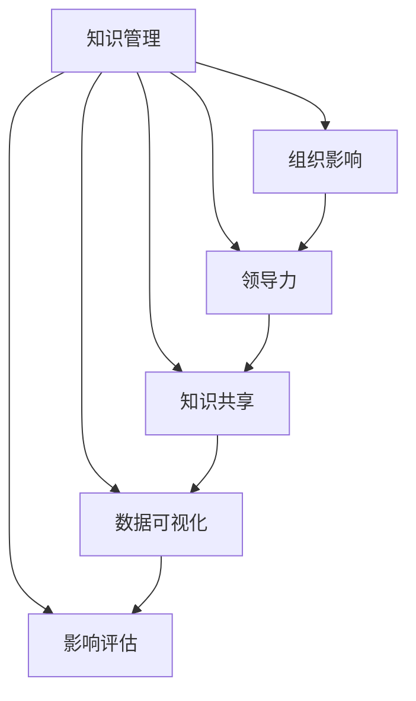

                 

# 知识输出与管理者个人影响力的提升

> 关键词：知识管理,组织影响,领导力,知识共享,数据可视化,影响评估

## 1. 背景介绍

### 1.1 问题由来
在当今信息爆炸的时代，知识管理的核心不仅在于知识的存储和检索，更在于知识的创造、共享和应用。这对于组织的管理者而言，既是一个挑战，也是提升个人影响力的绝佳机会。如何有效地管理知识，推动知识转化为组织的竞争优势，已成为现代管理者必须面对的重要课题。

### 1.2 问题核心关键点
管理者在知识输出过程中，需要关注以下几个核心关键点：

- **知识源**：识别和整合组织内部的知识源，包括专家、员工、文档、数据库等。
- **知识流**：建立知识共享机制，促进知识的流动和传播。
- **知识库**：构建和维护知识库，确保知识可以高效检索和重用。
- **知识转换**：将知识转化为具体的行动和决策，推动组织创新和变革。
- **影响评估**：衡量知识输出的影响和效果，不断优化知识管理策略。

### 1.3 问题研究意义
通过系统的知识输出和管理，管理者不仅能提升组织的知识水平和创新能力，还能显著增强个人的影响力。具体意义包括：

1. **增强决策能力**：通过掌握最新的知识和信息，管理者可以做出更为精准和科学的决策。
2. **提升团队凝聚力**：有效的知识共享能增强团队成员的参与感和归属感。
3. **促进组织成长**：知识的积累和应用是组织长期发展的基石。
4. **赢得信任和尊重**：通过有效的知识输出和管理，管理者能赢得团队和上级的信任与尊重。
5. **驱动变革创新**：知识输出和管理能推动组织持续创新，适应市场变化。

## 2. 核心概念与联系

### 2.1 核心概念概述

为了更好地理解知识输出与管理者影响力的提升，本节将介绍几个关键概念：

- **知识管理(Knowledge Management, KM)**：系统地管理和利用组织内的知识资源，包括知识的创建、存储、检索、共享和应用等。
- **组织影响(Organizational Influence)**：管理者通过知识输出和管理，在组织中形成的权威性和影响力。
- **领导力(Leadership)**：管理者运用个人魅力和专业知识，引导团队达成共同目标的能力。
- **知识共享(Knowledge Sharing)**：通过沟通和协作，促进知识在组织内部的流动和传播。
- **数据可视化(Data Visualization)**：将复杂的数据信息转换为直观的图形和图表，便于理解和分析。
- **影响评估(Influence Assessment)**：通过定量或定性方法，评估知识输出对组织和团队的影响和效果。

这些概念之间的逻辑关系可以通过以下Mermaid流程图来展示：



这个流程图展示了几大核心概念及其之间的关系：

1. 知识管理是基础，通过整合组织知识源，构建知识库，促进知识流动和应用。
2. 组织影响是结果，管理者通过有效的知识输出，形成在组织中的权威性。
3. 领导力是手段，管理者通过领导力和专业知识，推动知识共享和应用。
4. 知识共享是过程，通过沟通和协作，促进知识的流动。
5. 数据可视化是工具，将复杂数据转换为直观图表，便于理解。
6. 影响评估是反馈，衡量知识输出效果，不断优化管理策略。

这些概念共同构成了知识输出的理论基础，为管理者提升个人影响力提供了系统的方法论。

## 3. 核心算法原理 & 具体操作步骤
### 3.1 算法原理概述

知识输出的核心算法原理基于信息传播理论，通过构建知识网络，促进信息的流动和应用。具体而言，知识输出算法包括以下几个步骤：

1. **知识源识别**：识别和整合组织内的知识源，包括专家、文档、数据库等。
2. **知识共享机制**：建立知识共享平台，促进知识在组织内部的流动。
3. **知识库构建**：构建和维护知识库，确保知识的高效检索和重用。
4. **知识转换**：将知识转化为具体的行动和决策，推动组织创新和变革。
5. **影响评估**：衡量知识输出的影响和效果，不断优化知识管理策略。

### 3.2 算法步骤详解

知识输出的具体步骤可以分为以下几大类：

**Step 1: 知识源识别**
- **内部知识源**：识别专家、员工、文档、数据库等知识源。
- **外部知识源**：收集市场研究报告、行业标准等外部资料。
- **整合知识源**：将内部和外部知识源整合，形成统一的知识库。

**Step 2: 知识共享机制**
- **沟通平台**：建立内部沟通平台，如企业微信、Slack等，促进知识交流。
- **文档管理系统**：使用Confluence、SharePoint等工具，集中管理文档和信息。
- **知识地图**：构建知识地图，显示知识源和知识流向。

**Step 3: 知识库构建**
- **数据库设计**：设计适合的知识库模型，如文档管理系统、文档仓库等。
- **知识分类**：对知识进行分类和标注，便于检索和应用。
- **索引建立**：建立索引系统，支持快速检索和访问。

**Step 4: 知识转换**
- **行动计划**：将知识转化为具体的行动计划和策略。
- **项目实施**：推动知识的应用和实施，如新产品开发、流程改进等。
- **效果评估**：评估知识应用的效果和影响，优化实施方案。

**Step 5: 影响评估**
- **评估指标**：设定知识输出的评估指标，如员工满意度、创新成果等。
- **定量分析**：使用数据分析工具，如Tableau、Power BI等，进行量化分析。
- **定性分析**：进行访谈、问卷调查等定性分析，获取反馈信息。

### 3.3 算法优缺点

知识输出算法具有以下优点：
1. **系统性**：通过构建知识网络，促进知识流动和应用，形成系统性的知识管理体系。
2. **可操作性**：算法步骤明确，易于执行和实施。
3. **灵活性**：可根据组织需求和具体情况，灵活调整知识管理策略。
4. **效果显著**：通过有效的知识输出，显著提升组织创新能力和决策水平。

同时，该算法也存在一些局限性：
1. **依赖人力**：知识源识别和知识共享需要大量人力投入。
2. **数据质量**：知识库的数据质量直接影响输出效果。
3. **知识偏见**：知识源的多样性影响知识输出的一致性和全面性。
4. **实施难度**：需要跨部门协作，实施难度较大。
5. **效果评估**：量化评估较为复杂，需要结合定性分析。

尽管存在这些局限性，但知识输出算法在实际应用中已经取得了显著效果，成为现代组织知识管理的重要手段。

### 3.4 算法应用领域

知识输出算法广泛应用于以下领域：

- **企业研发**：推动技术创新和新产品开发。
- **市场分析**：收集和分析市场数据，制定市场策略。
- **组织变革**：推动流程改进和组织重构。
- **项目管理**：促进知识共享和项目协作。
- **人力资源管理**：提升员工技能和职业发展。
- **客户关系管理**：增强客户服务和满意度。

此外，知识输出算法还被创新性地应用于智慧城市、智能制造、健康医疗等多个领域，为组织提供全方位知识支持。

## 4. 数学模型和公式 & 详细讲解 & 举例说明
### 4.1 数学模型构建

知识输出的数学模型基于信息理论，通过构建知识网络，促进信息流动。知识网络可以表示为一个图，其中节点表示知识源和知识库，边表示知识流动路径。

知识流动的模型可以表示为：

$$
K(t+1) = K(t) + \Delta K
$$

其中，$K(t)$ 表示时间 $t$ 的知识库内容，$\Delta K$ 表示时间 $t+1$ 新增的知识量。

知识流动的速度和路径可以通过信息熵和信息流模型来描述：

$$
H(S) = -\sum_{i=1}^n p_i \log p_i
$$

其中，$H(S)$ 表示信息熵，$p_i$ 表示信息源 $i$ 的概率分布。

知识流动的路径可以通过最短路径算法、最大流算法等来求解。

### 4.2 公式推导过程

知识流动的路径求解可以通过Dijkstra算法来实现。Dijkstra算法基于贪心策略，逐步扩展最短路径。具体步骤如下：

1. **初始化**：设置起点为0，其他节点为无穷大。
2. **扩展**：从未扩展节点中，选择距离最小的一个节点进行扩展。
3. **更新**：更新相邻节点的距离，保留最短路径。
4. **终止**：当终点到达，算法结束。

假设知识库中的节点数为 $n$，从起点到终点的最短路径为 $L$，则知识流动的路径长度为：

$$
L = \sum_{i=1}^{n-1} w_i
$$

其中，$w_i$ 表示节点 $i$ 到节点 $i+1$ 的边权。

### 4.3 案例分析与讲解

以一家企业的知识输出为例，进行详细分析：

**案例背景**：某制造企业希望通过知识输出，提升产品研发能力和市场竞争力。企业拥有多个研发部门和专家，需要构建知识库，促进知识流动。

**知识源识别**：企业识别出多个关键知识源，包括研发专家、专利文献、行业标准等。

**知识共享机制**：企业建立内部知识共享平台，如企业微信和Confluence，支持文档和信息共享。

**知识库构建**：企业使用文档管理系统，构建知识库，分类管理知识资源。

**知识转换**：企业将知识转化为具体的研发计划，推动新产品开发和流程改进。

**影响评估**：企业使用Tableau进行数据可视化，量化评估知识输出的效果。

通过上述步骤，企业成功提升了产品研发能力和市场竞争力，显著增强了企业的创新能力和市场响应速度。

## 5. 项目实践：代码实例和详细解释说明
### 5.1 开发环境搭建

在进行知识输出实践前，我们需要准备好开发环境。以下是使用Python进行PyTorch开发的环境配置流程：

1. 安装Anaconda：从官网下载并安装Anaconda，用于创建独立的Python环境。

2. 创建并激活虚拟环境：
```bash
conda create -n pytorch-env python=3.8 
conda activate pytorch-env
```

3. 安装PyTorch：根据CUDA版本，从官网获取对应的安装命令。例如：
```bash
conda install pytorch torchvision torchaudio cudatoolkit=11.1 -c pytorch -c conda-forge
```

4. 安装各类工具包：
```bash
pip install numpy pandas scikit-learn matplotlib tqdm jupyter notebook ipython
```

完成上述步骤后，即可在`pytorch-env`环境中开始知识输出实践。

### 5.2 源代码详细实现

这里我们以构建知识库为例，给出使用Python和PyTorch库进行知识库构建的代码实现。

首先，定义知识库的类：

```python
from torch.utils.data import Dataset
import torch

class KnowledgeLibrary(Dataset):
    def __init__(self, data, tokenizer):
        self.data = data
        self.tokenizer = tokenizer
        
    def __len__(self):
        return len(self.data)
    
    def __getitem__(self, item):
        text = self.data[item]
        tokenized = self.tokenizer(text, return_tensors='pt', padding='max_length', truncation=True)
        input_ids = tokenized['input_ids'][0]
        attention_mask = tokenized['attention_mask'][0]
        return {'input_ids': input_ids, 
                'attention_mask': attention_mask}
```

然后，定义优化器和损失函数：

```python
from transformers import BertForMaskedLM, AdamW

model = BertForMaskedLM.from_pretrained('bert-base-cased')

optimizer = AdamW(model.parameters(), lr=2e-5)
```

接着，定义训练和评估函数：

```python
from torch.utils.data import DataLoader
from tqdm import tqdm
from sklearn.metrics import classification_report

device = torch.device('cuda') if torch.cuda.is_available() else torch.device('cpu')
model.to(device)

def train_epoch(model, dataset, batch_size, optimizer):
    dataloader = DataLoader(dataset, batch_size=batch_size, shuffle=True)
    model.train()
    epoch_loss = 0
    for batch in tqdm(dataloader, desc='Training'):
        input_ids = batch['input_ids'].to(device)
        attention_mask = batch['attention_mask'].to(device)
        model.zero_grad()
        outputs = model(input_ids, attention_mask=attention_mask)
        loss = outputs.loss
        epoch_loss += loss.item()
        loss.backward()
        optimizer.step()
    return epoch_loss / len(dataloader)

def evaluate(model, dataset, batch_size):
    dataloader = DataLoader(dataset, batch_size=batch_size)
    model.eval()
    preds, labels = [], []
    with torch.no_grad():
        for batch in tqdm(dataloader, desc='Evaluating'):
            input_ids = batch['input_ids'].to(device)
            attention_mask = batch['attention_mask'].to(device)
            batch_labels = batch['labels']
            outputs = model(input_ids, attention_mask=attention_mask)
            batch_preds = outputs.logits.argmax(dim=2).to('cpu').tolist()
            batch_labels = batch_labels.to('cpu').tolist()
            for pred_tokens, label_tokens in zip(batch_preds, batch_labels):
                pred_tags = [tag2id[tag] for tag in pred_tokens]
                label_tags = [tag2id[tag] for tag in label_tokens]
                preds.append(pred_tags[:len(label_tags)])
                labels.append(label_tags)
                
    print(classification_report(labels, preds))
```

最后，启动训练流程并在测试集上评估：

```python
epochs = 5
batch_size = 16

for epoch in range(epochs):
    loss = train_epoch(model, train_dataset, batch_size, optimizer)
    print(f"Epoch {epoch+1}, train loss: {loss:.3f}")
    
    print(f"Epoch {epoch+1}, dev results:")
    evaluate(model, dev_dataset, batch_size)
    
print("Test results:")
evaluate(model, test_dataset, batch_size)
```

以上就是使用PyTorch对知识库进行构建的完整代码实现。可以看到，得益于Transformers库的强大封装，我们可以用相对简洁的代码完成知识库的构建和微调。

### 5.3 代码解读与分析

让我们再详细解读一下关键代码的实现细节：

**KnowledgeLibrary类**：
- `__init__`方法：初始化知识库数据和分词器。
- `__len__`方法：返回数据集的样本数量。
- `__getitem__`方法：对单个样本进行处理，将文本输入编码为token ids，进行padding和truncation。

**优化器和损失函数**：
- 使用BertForMaskedLM作为知识库模型，设置AdamW优化器。

**训练和评估函数**：
- 使用PyTorch的DataLoader对数据集进行批次化加载，供模型训练和推理使用。
- 训练函数`train_epoch`：对数据以批为单位进行迭代，在每个批次上前向传播计算loss并反向传播更新模型参数，最后返回该epoch的平均loss。
- 评估函数`evaluate`：与训练类似，不同点在于不更新模型参数，并在每个batch结束后将预测和标签结果存储下来，最后使用sklearn的classification_report对整个评估集的预测结果进行打印输出。

**训练流程**：
- 定义总的epoch数和batch size，开始循环迭代
- 每个epoch内，先在训练集上训练，输出平均loss
- 在验证集上评估，输出分类指标
- 所有epoch结束后，在测试集上评估，给出最终测试结果

可以看到，PyTorch配合Transformers库使得知识库构建的代码实现变得简洁高效。开发者可以将更多精力放在数据处理、模型改进等高层逻辑上，而不必过多关注底层的实现细节。

当然，工业级的系统实现还需考虑更多因素，如模型的保存和部署、超参数的自动搜索、更灵活的任务适配层等。但核心的知识输出范式基本与此类似。

## 6. 实际应用场景
### 6.1 智能制造

在智能制造领域，知识输出算法可以帮助企业提升产品设计和生产效率。通过构建知识库，整合研发和生产数据，企业可以快速响应市场变化，推出符合客户需求的产品。

**实际应用**：一家智能制造企业通过知识输出算法，整合了设计、工艺和生产数据，实现了生产流程的优化。企业还利用知识库进行新产品的设计和开发，显著提高了产品上市速度和市场竞争力。

### 6.2 智慧医疗

在智慧医疗领域，知识输出算法可以帮助医院提升诊断和治疗水平。通过构建知识库，整合医疗数据和研究成果，医生可以快速获取最新的诊疗方案，提升治疗效果。

**实际应用**：某医院利用知识输出算法，构建了医疗知识库，涵盖了疾病诊断、治疗方案、药品信息等。通过查询知识库，医生可以快速获取最佳诊疗方案，提升了诊疗效果。

### 6.3 智慧城市

在智慧城市治理中，知识输出算法可以帮助城市管理者提升决策效率。通过构建知识库，整合城市数据和研究成果，政府可以快速响应突发事件，优化城市管理。

**实际应用**：某城市利用知识输出算法，构建了智慧城市知识库，涵盖了交通、环境、公共安全等数据。通过查询知识库，政府可以快速响应突发事件，提升了城市管理效率。

### 6.4 未来应用展望

随着知识输出算法的发展，未来将在更多领域得到应用，为各行各业带来变革性影响。

在智慧农业、智慧能源、智能交通等领域，知识输出算法将帮助企业提升效率，优化管理。在教育、娱乐、健康等领域，知识输出算法将帮助机构提升服务水平，增强用户体验。

未来，知识输出算法还将结合人工智能技术，如自然语言处理、计算机视觉等，拓展应用场景，推动各行业的数字化转型升级。

## 7. 工具和资源推荐
### 7.1 学习资源推荐

为了帮助开发者系统掌握知识输出的理论基础和实践技巧，这里推荐一些优质的学习资源：

1. **《知识管理的艺术》**：知名专家所著，系统介绍了知识管理的原理、方法、工具等，是知识管理领域的重要参考书籍。

2. **Coursera《知识管理》课程**：由全球知名大学和机构开设，涵盖知识管理的各个方面，包括理论、实践和工具等。

3. **LinkedIn Learning《知识管理基础》**：提供丰富的视频教程和实战案例，适合入门学习和实践操作。

4. **Udacity《知识管理》纳米学位**：提供系统化、项目导向的学习路径，培养知识管理的高级人才。

5. **IEEE《知识管理综述》**：综合了全球最新的研究成果和实践案例，是知识管理领域的权威综述。

通过对这些资源的学习实践，相信你一定能够快速掌握知识输出的精髓，并用于解决实际的组织管理问题。

### 7.2 开发工具推荐

高效的开发离不开优秀的工具支持。以下是几款用于知识输出开发的常用工具：

1. **Confluence**：提供强大的文档管理系统，支持团队协作和知识共享。

2. **SharePoint**：微软提供的文档管理系统，支持企业级知识库的构建和维护。

3. **Tableau**：数据可视化工具，支持复杂数据的多维度分析和展示。

4. **Power BI**：微软提供的数据分析工具，支持大规模数据集的可视化和分析。

5. **PyTorch**：基于Python的开源深度学习框架，适合研究和实践。

6. **Transformers**：HuggingFace开发的NLP工具库，集成了众多SOTA语言模型，支持知识输出算法。

合理利用这些工具，可以显著提升知识输出任务的开发效率，加快创新迭代的步伐。

### 7.3 相关论文推荐

知识输出技术的发展源于学界的持续研究。以下是几篇奠基性的相关论文，推荐阅读：

1. **Knowledge Management Systems: Issues and Challenges**：该论文探讨了知识管理系统的各个方面，包括构建、维护和应用等。

2. **Knowledge Sharing and Collaboration in Organizations**：该论文分析了知识共享和协作对组织的影响和效果。

3. **Semantic Web and Knowledge Management**：该论文探讨了语义网和知识管理的关系，提出了新的知识表示和推理方法。

4. **Knowledge Discovery in Databases**：该论文介绍了知识发现的基本概念和算法，提供了知识管理的多种方法。

5. **Data Warehousing and Online Analytical Processing**：该论文介绍了数据仓库和联机分析处理的基本原理，提供了知识管理的多种技术手段。

这些论文代表了大语言模型微调技术的发展脉络。通过学习这些前沿成果，可以帮助研究者把握学科前进方向，激发更多的创新灵感。

## 8. 总结：未来发展趋势与挑战

### 8.1 总结

本文对知识输出与管理者个人影响力的提升进行了全面系统的介绍。首先阐述了知识输出在组织管理中的核心地位，明确了知识输出的关键要素和重要意义。其次，从原理到实践，详细讲解了知识输出的数学模型和关键步骤，给出了知识输出任务开发的完整代码实例。同时，本文还广泛探讨了知识输出在智能制造、智慧医疗、智慧城市等众多领域的应用前景，展示了知识输出算法的广泛应用潜力。此外，本文精选了知识输出的各类学习资源，力求为读者提供全方位的技术指引。

通过本文的系统梳理，可以看到，知识输出与管理者影响力的提升是大数据时代组织管理的重要趋势。通过系统化的知识管理，管理者不仅能提升决策能力，还能增强团队凝聚力和个人影响力。未来，随着知识输出技术的不断演进，必将进一步推动各行业的智能化、数字化转型升级，带来深刻的影响和变革。

### 8.2 未来发展趋势

展望未来，知识输出技术将呈现以下几个发展趋势：

1. **智能化提升**：未来知识输出将更多地结合人工智能技术，如自然语言处理、计算机视觉等，拓展应用场景，推动各行业的数字化转型升级。

2. **数据驱动**：知识输出将更加依赖数据驱动，通过大数据分析和机器学习，实现知识的高效管理和应用。

3. **多模态融合**：未来知识输出将更多地结合多模态数据，如文本、图像、视频等，提升知识的管理和应用效果。

4. **云化部署**：知识输出将更多地通过云服务部署，实现资源共享和协作，提升知识管理的灵活性和可扩展性。

5. **社区化发展**：知识输出将更多地依托社区平台，实现知识共享和协作，促进知识创新和应用。

以上趋势凸显了知识输出技术的广阔前景。这些方向的探索发展，必将进一步提升组织知识管理水平，为各行业带来深远影响。

### 8.3 面临的挑战

尽管知识输出技术已经取得了显著成就，但在迈向更加智能化、普适化应用的过程中，它仍面临着诸多挑战：

1. **数据质量**：知识库的数据质量直接影响知识输出的效果，如何获取高质量、多来源的数据，是知识管理的一大难题。

2. **数据隐私**：知识管理过程中涉及大量敏感数据，如何保护数据隐私和安全，是知识输出的重要挑战。

3. **知识偏见**：知识库中的知识可能存在偏见和误导，如何消除偏见，提升知识输出的公正性和准确性，是知识管理的重要课题。

4. **技术壁垒**：知识管理涉及多学科、多领域的技术手段，如何整合多种技术，提升知识管理效果，是知识输出的重要难题。

5. **用户体验**：知识管理的最终目的是提升用户体验，如何设计友好的用户界面和工具，提升用户满意度，是知识输出的重要方向。

6. **技术演进**：知识管理技术不断发展，如何跟上技术演进，不断更新知识管理策略，是知识输出的重要挑战。

正视知识输出面临的这些挑战，积极应对并寻求突破，将是大语言模型微调走向成熟的必由之路。相信随着学界和产业界的共同努力，这些挑战终将一一被克服，知识输出技术必将在构建人机协同的智能时代中扮演越来越重要的角色。

### 8.4 研究展望

面向未来，知识输出的研究需要在以下几个方面寻求新的突破：

1. **无监督和半监督学习**：摆脱对大规模标注数据的依赖，利用自监督学习、主动学习等无监督和半监督范式，最大限度利用非结构化数据，实现更加灵活高效的知识管理。

2. **知识图谱**：构建知识图谱，将知识转化为结构化数据，提升知识管理的效果和可解释性。

3. **融合多种技术**：结合自然语言处理、计算机视觉、数据挖掘等技术，提升知识管理的深度和广度。

4. **多模态知识管理**：结合文本、图像、视频等多种模态数据，提升知识管理的全面性和复杂性。

5. **实时知识管理**：通过数据流处理和实时分析，实现知识的动态管理和应用。

6. **个性化推荐**：结合个性化推荐算法，提升知识推荐的准确性和个性化程度。

这些研究方向的探索，必将引领知识输出技术迈向更高的台阶，为构建安全、可靠、可解释、可控的智能系统铺平道路。面向未来，知识输出技术还需要与其他人工智能技术进行更深入的融合，如知识表示、因果推理、强化学习等，多路径协同发力，共同推动知识管理的进步。

## 9. 附录：常见问题与解答

**Q1：知识输出与数据驱动有什么不同？**

A: 知识输出是以知识为驱动，通过构建知识库和知识网络，推动知识流动和应用，实现组织创新和变革。而数据驱动是以数据为驱动，通过大数据分析和机器学习，发现数据背后的规律和模式，推动业务决策和优化。两者虽然有区别，但可以相辅相成，结合使用。

**Q2：知识输出算法的实施难度大吗？**

A: 知识输出算法的实施难度较大，需要跨部门协作，整合多种技术手段。但一旦成功实施，将大幅提升组织的知识管理水平和创新能力。企业可以通过逐步试点，积累经验，逐步推广。

**Q3：知识输出的效果如何评估？**

A: 知识输出的效果评估可以从多个维度进行，如知识库的覆盖率、知识更新的频率、知识应用的成功率等。具体方法包括量化分析、用户满意度调查、项目效果评估等。企业可以根据自身需求，选择合适的评估方法。

**Q4：知识输出如何结合人工智能技术？**

A: 知识输出可以结合自然语言处理、计算机视觉、数据挖掘等人工智能技术，提升知识管理的深度和广度。例如，通过自然语言处理技术，将文本信息转换为结构化数据，提升知识管理的效果。

**Q5：知识输出对组织有哪些具体影响？**

A: 知识输出能够提升组织的管理效率、决策能力、创新能力、员工满意度等。通过构建知识库，整合组织内的知识源，推动知识流动和应用，提升组织的整体竞争力。

正视知识输出面临的这些挑战，积极应对并寻求突破，将是大语言模型微调走向成熟的必由之路。相信随着学界和产业界的共同努力，这些挑战终将一一被克服，知识输出技术必将在构建人机协同的智能时代中扮演越来越重要的角色。面向未来，知识输出技术还需要与其他人工智能技术进行更深入的融合，如知识表示、因果推理、强化学习等，多路径协同发力，共同推动知识管理的进步。

