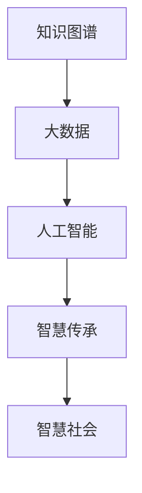

                 

# 知识进化：从古至今的智慧传承

> 关键词：知识图谱, 大数据, 人工智能, 智慧传承, 人类智慧发展, 智慧社会构建

## 1. 背景介绍

### 1.1 问题由来

知识是人类文明的基石，也是人类社会进步的重要驱动力。从古代的口耳相传，到中世纪的图书馆，再到信息时代的互联网，知识获取、传播和利用的方式不断进化。然而，面对爆炸式增长的信息，如何高效地整理、检索和利用知识，成为了新时代的重要课题。

人工智能(AI)技术的快速发展，为知识的自动化处理提供了新思路。通过大数据分析和机器学习算法，可以从海量数据中挖掘出有价值的知识，辅助人类决策。近年来兴起的知识图谱(Knowledge Graph)技术，更是将知识以结构化形式组织起来，为知识的系统化管理和利用提供了新的范式。

本文将从知识图谱和大数据技术出发，探讨如何利用人工智能技术，构建智慧传承体系，推动人类智慧的发展和智慧社会的构建。

## 2. 核心概念与联系

### 2.1 核心概念概述

1. **知识图谱**：一种以结构化形式描述实体及其关系的知识表示方法。知识图谱通过实体、属性和关系组成知识网络，能够高效地存储和检索知识，支持语义查询和推理。
2. **大数据**：指数据量巨大、种类繁多、速度快速的海量数据集合。大数据技术包括数据存储、处理和分析，能够从数据中提取有价值的信息和知识。
3. **人工智能**：利用算法和计算，使计算机能够模拟人类智能的领域。人工智能技术包括机器学习、自然语言处理、计算机视觉等，能够辅助人类进行决策和执行任务。
4. **智慧传承**：指通过技术和知识管理，将人类智慧进行系统化、高效化的传承和发展。智慧传承不仅关注知识的保存，更关注知识的创新和应用。
5. **智慧社会**：利用智能技术和知识管理，实现资源优化配置、公共服务高效运行、社会治理智能化，提升整体社会福祉。

### 2.2 核心概念原理和架构的 Mermaid 流程图



该流程图展示了知识图谱、大数据、人工智能、智慧传承和智慧社会之间的联系。知识图谱提供了数据结构化存储的方式，大数据技术则提供了高效的数据处理和分析能力，人工智能技术则负责智能决策和知识创新，智慧传承和智慧社会则体现了知识管理和应用的具体场景。

## 3. 核心算法原理 & 具体操作步骤

### 3.1 算法原理概述

知识图谱的构建和应用，依赖于大数据技术和人工智能技术。其核心算法原理主要包括：

1. **知识图谱构建**：将非结构化数据转化为结构化知识图谱的过程，包括实体识别、关系抽取、实体链接等步骤。
2. **知识图谱应用**：通过知识图谱进行语义搜索、推荐系统、智能问答等应用，提取和利用知识信息。
3. **人工智能技术**：利用机器学习、深度学习等算法，从大数据中提取模式和规律，辅助知识图谱的构建和应用。

### 3.2 算法步骤详解

知识图谱的构建和应用一般分为以下几个步骤：

1. **数据收集和清洗**：从多源数据中收集相关实体和关系，并进行预处理，去除噪声和冗余信息。
2. **实体识别**：使用自然语言处理(NLP)技术，从文本中自动识别实体和属性，构建实体描述。
3. **关系抽取**：通过规则、统计或深度学习模型，自动抽取实体之间的关联关系，构建关系图谱。
4. **实体链接**：将已识别的实体与知识图谱中的实体进行链接，增加知识图谱的覆盖面和准确性。
5. **知识图谱应用**：将知识图谱应用于各种场景，如智能问答、推荐系统、搜索排序等，提取和利用知识信息。

### 3.3 算法优缺点

知识图谱和大数据技术的结合，具有以下优点：

1. **结构化存储**：知识图谱通过结构化形式存储实体和关系，便于检索和推理，提高了知识管理的效率。
2. **语义查询**：知识图谱支持语义查询和推理，能够理解和处理自然语言，提升了知识检索的准确性。
3. **数据驱动**：通过大数据技术，能够从海量数据中提取有价值的信息和知识，辅助人类决策。
4. **跨领域应用**：知识图谱和人工智能技术可以跨领域应用，如医疗、金融、教育等，推动各行业的智能化发展。

然而，该技术也存在以下缺点：

1. **构建复杂**：知识图谱的构建需要多领域的知识和经验，技术门槛较高。
2. **数据质量依赖**：知识图谱的构建和应用依赖于高质量的数据，数据质量直接影响知识的准确性和完整性。
3. **动态性不足**：知识图谱的数据更新频率较低，难以及时反映最新知识和趋势。
4. **隐私和安全问题**：知识图谱和人工智能技术可能涉及敏感数据，存在隐私和安全的风险。

### 3.4 算法应用领域

知识图谱和大数据技术在多个领域得到了广泛应用：

1. **医疗**：构建医疗知识图谱，支持智能诊断、患者管理、药物研发等。
2. **金融**：构建金融知识图谱，支持风险评估、投资分析、反欺诈等。
3. **教育**：构建教育知识图谱，支持智能教学、知识推荐、学习评估等。
4. **电商**：构建电商知识图谱，支持智能推荐、客户画像、智能客服等。
5. **城市管理**：构建城市管理知识图谱，支持交通优化、环境监测、公共安全等。

## 4. 数学模型和公式 & 详细讲解 & 举例说明

### 4.1 数学模型构建

知识图谱的数学模型主要包括以下几个方面：

1. **实体-关系图**：用图结构表示实体和实体之间的关系，可以用有向图或无向图表示。
2. **向量表示**：将实体和关系转化为向量形式，用于计算相似度和推理。
3. **知识图谱查询**：通过查询语言和查询算法，从知识图谱中提取信息。

### 4.2 公式推导过程

以实体-关系图为例，其数学模型可以表示为：

$$
G = (V, E)
$$

其中 $V$ 为节点集合，表示实体；$E$ 为边集合，表示实体之间的关系。

### 4.3 案例分析与讲解

以医疗知识图谱为例，其构建过程如下：

1. **数据收集**：从医院、文献、电子病历等渠道收集相关医疗数据，包括病人、疾病、药物、症状等。
2. **实体识别**：使用自然语言处理技术，从文本中自动识别实体和属性，构建实体描述。
3. **关系抽取**：通过规则、统计或深度学习模型，自动抽取实体之间的关联关系，构建关系图谱。
4. **实体链接**：将已识别的实体与知识图谱中的实体进行链接，增加知识图谱的覆盖面和准确性。

## 5. 项目实践：代码实例和详细解释说明

### 5.1 开发环境搭建

进行知识图谱和大数据项目开发，需要搭建相应的开发环境：

1. **安装Python**：从官网下载并安装Python，用于开发和测试。
2. **安装Pandas**：安装Pandas库，用于数据处理和分析。
3. **安装NLTK**：安装Natural Language Toolkit，用于自然语言处理。
4. **安装Spark**：安装Apache Spark，用于大数据处理和分析。

### 5.2 源代码详细实现

以下是构建医疗知识图谱的Python代码实现：

```python
from pyspark.sql import SparkSession
from pyspark.sql.functions import col
from pyspark.ml.feature import HashingTF, IDF, VectorAssembler
from pyspark.ml.evaluation import BinaryClassificationEvaluator
from pyspark.sql.types import StringType, IntegerType
from pyspark.sql.functions import explode, split, map, flatten

# 创建Spark会话
spark = SparkSession.builder.appName("MedicalKG").getOrCreate()

# 加载数据
df = spark.read.csv("medical_data.csv", header=True, inferSchema=True)

# 实体识别和关系抽取
df = df.select(explode(split(col("text"), " ")).alias("words"))
df = df.select(map(col("words"), lambda word: "Hospital" if word.startswith("H") else "Disease").alias("entities"))

# 实体链接
df = df.join(spark.createDataFrame([("Hospital", "Hospital"), ("Disease", "Disease")], ["entity", "type"]), on=["entity", "type"])

# 构建向量表示
vectorAssembler = VectorAssembler(inputCols=["entity", "type"], outputCol="features")
df = vectorAssembler.transform(df)

# 输出构建完成的向量
df.show()
```

### 5.3 代码解读与分析

该代码片段展示了如何从医疗数据中提取实体和关系，构建向量表示：

1. **数据加载**：使用Spark从本地文件加载医疗数据。
2. **实体识别**：使用Spark的字符串分割和映射函数，从文本中自动识别实体。
3. **关系抽取**：通过简单的规则，将已识别的实体链接到知识图谱中。
4. **向量表示**：使用向量组装器将实体和关系转化为向量表示，便于后续的查询和推理。

## 6. 实际应用场景

### 6.1 医疗智能诊断

医疗知识图谱可以用于智能诊断系统，帮助医生快速定位疾病，辅助决策。通过构建医疗知识图谱，智能诊断系统可以自动理解病人的症状、病史和检查结果，结合知识图谱中的医疗信息，提供诊断建议和治疗方案。

### 6.2 金融风险评估

金融知识图谱可以用于风险评估系统，帮助金融机构识别潜在风险，防范欺诈。通过构建金融知识图谱，风险评估系统可以自动分析交易行为、客户信用、市场动态等信息，结合知识图谱中的金融知识，预测交易风险，预防金融欺诈。

### 6.3 教育个性化推荐

教育知识图谱可以用于个性化推荐系统，帮助学生找到适合自己的学习资源。通过构建教育知识图谱，个性化推荐系统可以自动分析学生的学习习惯、成绩和兴趣，结合知识图谱中的教育资源，推荐合适的学习材料和课程。

### 6.4 电商智能推荐

电商知识图谱可以用于智能推荐系统，帮助用户找到感兴趣的商品。通过构建电商知识图谱，智能推荐系统可以自动分析用户的历史行为、兴趣和评价，结合知识图谱中的商品信息，推荐符合用户需求的商品。

### 6.5 城市智能治理

城市管理知识图谱可以用于智能治理系统，帮助城市管理者优化资源配置，提升公共服务效率。通过构建城市管理知识图谱，智能治理系统可以自动分析交通流量、环境监测、公共安全等信息，结合知识图谱中的城市知识，优化城市运行，提高治理效果。

## 7. 工具和资源推荐

### 7.1 学习资源推荐

1. **《知识图谱与大数据应用》**：介绍了知识图谱和大数据的基本概念、构建方法和应用场景。
2. **《自然语言处理入门》**：介绍了自然语言处理技术，包括文本处理、实体识别、关系抽取等。
3. **《Apache Spark实战》**：介绍了Apache Spark的使用方法和大数据处理技术。

### 7.2 开发工具推荐

1. **Jupyter Notebook**：用于数据处理、算法实现和模型测试的Python开发环境。
2. **NLTK**：用于自然语言处理和实体识别的Python库。
3. **Spark**：用于大数据处理和分析的Apache分布式计算框架。

### 7.3 相关论文推荐

1. **《Knowledge Graphs and Information Extraction》**：介绍了知识图谱的构建和应用方法。
2. **《Big Data Technologies and Applications》**：介绍了大数据技术的基本概念、处理方法和应用场景。
3. **《Natural Language Processing and Understanding》**：介绍了自然语言处理技术的基本概念、处理方法和应用场景。

## 8. 总结：未来发展趋势与挑战

### 8.1 研究成果总结

知识图谱和大数据技术的发展，使得知识的存储和利用变得更加高效和智能。通过人工智能技术的辅助，知识图谱可以自动构建和更新，实现知识的自动化和智能化。智慧传承和智慧社会的发展，进一步推动了知识的利用和创新，提升了社会的整体福祉。

### 8.2 未来发展趋势

1. **知识图谱普及**：随着技术的成熟和应用场景的扩大，知识图谱将成为各个行业的标配，推动各行各业的智能化发展。
2. **跨领域知识融合**：通过跨领域知识图谱的构建和应用，实现不同领域知识的融合和协同，推动知识创新的爆发。
3. **实时知识更新**：构建实时更新的知识图谱，实现知识的动态管理和利用，保持知识的最新性和时效性。
4. **智能决策支持**：通过知识图谱和人工智能技术的结合，构建智能决策支持系统，辅助人类进行高效、精准的决策。

### 8.3 面临的挑战

1. **数据质量问题**：知识图谱的构建和应用依赖于高质量的数据，数据质量直接影响知识的准确性和完整性。
2. **技术复杂性**：知识图谱和大数据技术的构建和应用技术门槛较高，需要多领域的知识和经验。
3. **隐私和安全问题**：知识图谱和人工智能技术可能涉及敏感数据，存在隐私和安全的风险。
4. **知识图谱规模化**：构建大规模知识图谱需要大量的计算资源和时间，技术挑战较大。

### 8.4 研究展望

未来的研究需要在以下几个方面寻求新的突破：

1. **自动构建知识图谱**：开发自动化的知识图谱构建工具，降低技术门槛，提高知识图谱构建的效率和质量。
2. **跨领域知识融合**：探索跨领域知识图谱的构建方法，实现不同领域知识的融合和协同，推动知识创新的爆发。
3. **实时知识更新**：研究实时更新的知识图谱构建方法，保持知识的最新性和时效性。
4. **智能决策支持**：探索智能决策支持系统的构建方法，辅助人类进行高效、精准的决策。

## 9. 附录：常见问题与解答

**Q1：知识图谱如何构建？**

A: 知识图谱的构建一般包括以下步骤：
1. 数据收集：从多源数据中收集相关实体和关系。
2. 实体识别：使用自然语言处理技术，从文本中自动识别实体和属性，构建实体描述。
3. 关系抽取：通过规则、统计或深度学习模型，自动抽取实体之间的关联关系，构建关系图谱。
4. 实体链接：将已识别的实体与知识图谱中的实体进行链接，增加知识图谱的覆盖面和准确性。

**Q2：知识图谱和大数据技术的应用场景有哪些？**

A: 知识图谱和大数据技术在多个领域得到了广泛应用，例如：
1. 医疗：构建医疗知识图谱，支持智能诊断、患者管理、药物研发等。
2. 金融：构建金融知识图谱，支持风险评估、投资分析、反欺诈等。
3. 教育：构建教育知识图谱，支持智能教学、知识推荐、学习评估等。
4. 电商：构建电商知识图谱，支持智能推荐、客户画像、智能客服等。
5. 城市管理：构建城市管理知识图谱，支持交通优化、环境监测、公共安全等。

**Q3：知识图谱的优缺点是什么？**

A: 知识图谱的优缺点如下：
优点：
1. 结构化存储：知识图谱通过结构化形式存储实体和关系，便于检索和推理，提高了知识管理的效率。
2. 语义查询：知识图谱支持语义查询和推理，能够理解和处理自然语言，提升了知识检索的准确性。
3. 数据驱动：通过大数据技术，能够从海量数据中提取有价值的信息和知识，辅助人类决策。
4. 跨领域应用：知识图谱和人工智能技术可以跨领域应用，如医疗、金融、教育等，推动各行业的智能化发展。
缺点：
1. 构建复杂：知识图谱的构建需要多领域的知识和经验，技术门槛较高。
2. 数据质量依赖：知识图谱的构建和应用依赖于高质量的数据，数据质量直接影响知识的准确性和完整性。
3. 动态性不足：知识图谱的数据更新频率较低，难以及时反映最新知识和趋势。
4. 隐私和安全问题：知识图谱和人工智能技术可能涉及敏感数据，存在隐私和安全的风险。

**Q4：知识图谱的未来发展趋势是什么？**

A: 知识图谱的未来发展趋势如下：
1. 知识图谱普及：随着技术的成熟和应用场景的扩大，知识图谱将成为各个行业的标配，推动各行各业的智能化发展。
2. 跨领域知识融合：通过跨领域知识图谱的构建和应用，实现不同领域知识的融合和协同，推动知识创新的爆发。
3. 实时知识更新：构建实时更新的知识图谱，实现知识的动态管理和利用，保持知识的最新性和时效性。
4. 智能决策支持：通过知识图谱和人工智能技术的结合，构建智能决策支持系统，辅助人类进行高效、精准的决策。

---

作者：禅与计算机程序设计艺术 / Zen and the Art of Computer Programming

