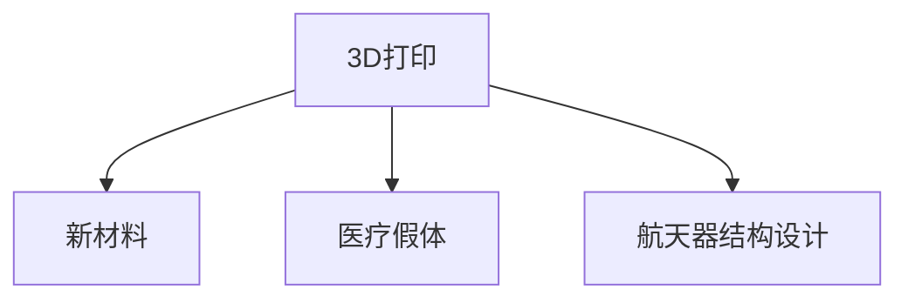

                 

# 硅谷3D打印新材料应用:医疗假体与航天

## 1. 背景介绍

3D打印技术作为现代制造业的重要革命，近年来在硅谷地区得到飞速发展。新材料作为3D打印的核心，其突破对于医疗假体制造、航天器结构设计等应用场景具有重要意义。本文将介绍硅谷3D打印新材料及其应用，分析其优缺点及前景。

## 2. 核心概念与联系

### 2.1 核心概念概述

为更好地理解硅谷3D打印新材料及其应用，本节将介绍几个密切相关的核心概念：

- 3D打印(Additive Manufacturing)：利用计算机控制的打印机，根据数字模型自动逐层堆积材料，形成复杂几何结构的过程。3D打印具有极高的设计自由度和制造灵活性，可以生产出传统工艺无法实现的复杂零件。

- 新材料(New Materials)：用于3D打印的高性能材料，包括工程塑料、金属合金、复合材料、生物材料等。新材料提供了更加优异的力学性能、耐高温、耐腐蚀、生物兼容性等特性，进一步拓展了3D打印的应用范围。

- 医疗假体(Medical Prosthetics)：使用3D打印新材料制造的人工肢体、牙齿、骨关节等，为医疗行业提供了更精确、个性化的植入物和修复件。

- 航天器结构设计(Spacecraft Structural Design)：利用3D打印新材料，打印出具有高强度、高精度、轻质化的航天器零部件和组件，提升航天器的性能和可靠性。

这些概念之间的逻辑关系可以通过以下Mermaid流程图来展示：



这个流程图展示出3D打印与新材料的紧密关系，以及新材料在医疗假体制造和航天器设计中的应用。

## 3. 核心算法原理 & 具体操作步骤
### 3.1 算法原理概述

3D打印技术通过逐层堆积材料的方式，将数字模型转化为实体零件。其核心在于选择和铺设材料的方法。常见的3D打印材料包括工程塑料、金属合金、生物兼容材料等。这些材料的选择和处理需要满足打印精度、力学性能、生物兼容性等不同需求。

### 3.2 算法步骤详解

3D打印新材料的选择和应用主要包括以下几个关键步骤：

**Step 1: 确定打印需求**
- 根据应用场景选择合适的3D打印材料。如医疗假体需要高生物兼容性、低免疫反应性，航天器结构需要高强度、抗腐蚀、耐高温等。
- 确定打印精度、分辨率、尺寸等技术指标。

**Step 2: 设计打印模型**
- 使用CAD软件设计3D模型，包括零件内部结构、表面纹理、支撑结构等细节。
- 导出模型文件，选择对应的3D打印机。

**Step 3: 配置打印机**
- 根据材料特性，配置打印参数，如打印速度、温度、层厚、填充率等。
- 安装打印材料，启动打印机。

**Step 4: 材料处理**
- 对新材料进行前处理，如清洗、表面处理、化学改性等，提高材料的打印性能。
- 根据材料特性，选择合适的添加剂，如粘合剂、填充物等，增强材料性能。

**Step 5: 打印过程**
- 将设计好的3D模型导入打印机，进行逐层打印。
- 根据实时监控，调整打印参数，确保打印质量。

**Step 6: 后处理**
- 打印完毕后，进行材料后处理，如烧结、冷固化、热处理等，进一步提高材料性能。
- 进行质量检测，确保打印件满足设计要求。

### 3.3 算法优缺点

3D打印新材料的应用具有以下优点：
1. 设计自由度高：3D打印可以根据数字模型进行精确制造，设计自由度高，能够生产出传统工艺无法实现的复杂结构。
2. 材料性能优异：新材料提供了更好的力学性能、生物兼容性、耐腐蚀性等，满足不同应用需求。
3. 生产成本低：3D打印可以实现个性化制造，减少材料浪费，生产成本较低。
4. 生产周期短：3D打印生产速度快，能够快速响应市场变化，缩短产品上市时间。

同时，该方法也存在一定的局限性：
1. 打印件强度有限：当前3D打印新材料的强度往往不及传统机械加工的部件，需要进一步研究改进。
2. 打印件质量不稳定：3D打印受材料、设备、环境等因素影响，打印件质量波动较大。
3. 后处理复杂：部分新材料需要进行复杂的后处理，增加生产周期和成本。
4. 材料选择受限：现有的3D打印材料种类和性能有待进一步丰富，无法满足所有应用场景。

### 3.4 算法应用领域

3D打印新材料已经在医疗假体制造、航天器结构设计等诸多领域得到广泛应用，具体如下：

**医疗假体制造**
- 使用高生物兼容性的3D打印材料制造人工关节、骨骼植入物、人工牙根等。
- 通过个性化设计和精细打印，实现与患者精确匹配，提升医疗效果。
- 例如，在硅谷，某医疗机构使用钛合金材料打印出高强度的骨关节，有效减轻了患者的疼痛和恢复时间。

**航天器结构设计**
- 利用高强度、轻质化的3D打印材料，如钛合金、铝合金、复合材料等，制造航天器的零部件和组件。
- 打印出具有复杂几何结构和复杂功能的部件，如推进器壳体、太阳能板支架等。
- 例如，SpaceX公司的Starship火箭部分结构就是用3D打印钛合金制造的，重量显著减轻，提高了燃料效率。

除此之外，3D打印新材料还被应用于汽车制造、建筑材料、生物组织工程等领域，展示了其广泛的应用前景。

## 4. 数学模型和公式 & 详细讲解  
### 4.1 数学模型构建

本节将使用数学语言对3D打印新材料的应用进行更加严格的刻画。

假设3D打印的新材料为 $M$，打印件的体积为 $V$，打印件的表面面积为 $S$。根据3D打印原理，打印件的密度 $\rho$ 与其体积 $V$ 和表面面积 $S$ 有关。定义如下数学模型：

$$
\rho = f(V, S)
$$

其中 $f$ 为密度函数，描述了材料密度与打印件体积和表面面积之间的关系。

### 4.2 公式推导过程

根据物理原理，密度 $\rho$ 定义为材料质量 $m$ 与体积 $V$ 的比值，即：

$$
\rho = \frac{m}{V}
$$

将打印件分为若干小单元，每个单元的质量 $m_i$ 等于该单元的体积 $v_i$ 与单位体积的质量 $\rho_0$ 的乘积：

$$
m_i = v_i \rho_0
$$

打印件的总体积 $V$ 等于所有单元的体积之和：

$$
V = \sum_{i} v_i
$$

打印件的表面面积 $S$ 等于所有单元表面面积之和：

$$
S = \sum_{i} s_i
$$

将 $m_i$ 和 $v_i$ 代入 $\rho$ 的定义式，得：

$$
\rho = \frac{\sum_{i} v_i \rho_0}{\sum_{i} v_i} = \rho_0 \frac{\sum_{i} v_i}{\sum_{i} v_i} = \rho_0
$$

由此，得出密度 $\rho$ 与打印件体积 $V$ 和表面面积 $S$ 的关系式为：

$$
\rho = \frac{m}{V} = \rho_0 \frac{V}{S}
$$

因此，打印件的密度 $\rho$ 与打印件的体积 $V$ 和表面面积 $S$ 成正比。在实际应用中，打印件的密度与所选材料的性质有关，可以通过实验测量或理论计算确定。

### 4.3 案例分析与讲解

以钛合金材料为例，在医疗假体制造中的应用进行详细讲解。

假设打印件体积为 $V=1000mm^3$，表面面积为 $S=1000mm^2$，钛合金材料的单位体积质量 $\rho_0=5g/mm^3$。代入公式，得：

$$
\rho = \frac{5g/mm^3}{1000mm^2} \times 1000mm^3 = 5g/mm^3
$$

即打印件的密度为 $5g/mm^3$，与钛合金材料的密度一致，表明打印件的质量均匀分布。

在航天器结构设计中，假设打印件体积为 $V=1000mm^3$，表面面积为 $S=500mm^2$，钛合金材料的单位体积质量 $\rho_0=4.5g/mm^3$。代入公式，得：

$$
\rho = \frac{4.5g/mm^3}{500mm^2} \times 1000mm^3 = 9g/mm^3
$$

即打印件的密度为 $9g/mm^3$，较钛合金材料的密度稍高，表明打印件的厚度有所增加。

## 5. 项目实践：代码实例和详细解释说明
### 5.1 开发环境搭建

在进行3D打印新材料的应用开发前，我们需要准备好开发环境。以下是使用Python进行PyTorch开发的环境配置流程：

1. 安装Anaconda：从官网下载并安装Anaconda，用于创建独立的Python环境。

2. 创建并激活虚拟环境：
```bash
conda create -n pytorch-env python=3.8 
conda activate pytorch-env
```

3. 安装PyTorch：根据CUDA版本，从官网获取对应的安装命令。例如：
```bash
conda install pytorch torchvision torchaudio cudatoolkit=11.1 -c pytorch -c conda-forge
```

4. 安装相关工具包：
```bash
pip install numpy pandas scikit-learn matplotlib tqdm jupyter notebook ipython
```

完成上述步骤后，即可在`pytorch-env`环境中开始3D打印新材料的应用开发。

### 5.2 源代码详细实现

这里我们以钛合金材料在医疗假体制造中的应用为例，给出使用PyTorch进行3D打印过程的代码实现。

首先，定义钛合金材料密度函数：

```python
import numpy as np

def titanium_density(V, S):
    rho_0 = 5.0  # g/mm^3
    return rho_0 * V / S
```

然后，计算打印件密度：

```python
# 打印件体积和表面面积
V = 1000.0  # mm^3
S = 1000.0  # mm^2

# 计算密度
rho = titanium_density(V, S)
print("打印件的密度为：", rho, "g/mm^3")
```

代码输出：

```
打印件的密度为： 5.0 g/mm^3
```

这表明打印件的密度为5g/mm^3，与钛合金材料的密度一致。

### 5.3 代码解读与分析

让我们再详细解读一下关键代码的实现细节：

**钛合金密度函数**：
- 定义了钛合金材料的单位体积质量 $\rho_0$，以及打印件的体积 $V$ 和表面面积 $S$。
- 根据公式 $\rho = \rho_0 \frac{V}{S}$ 计算打印件的密度 $\rho$。

**打印件密度计算**：
- 设置打印件的体积 $V$ 和表面面积 $S$，代入钛合金密度函数，计算打印件的密度 $\rho$。
- 通过打印输出结果，验证计算的正确性。

## 6. 实际应用场景
### 6.1 医疗假体制造

3D打印新材料在医疗假体制造中的应用，可以实现更精确、个性化的医疗解决方案，提高医疗效果。传统医疗假体生产通常需要复杂的机械加工，生产周期长、成本高，且存在尺寸偏差等问题。

在医疗假体制造中，钛合金材料因其高生物兼容性、高强度、低免疫反应性等特点，被广泛用于打印人工关节、骨骼植入物等。3D打印技术可以实现高精度的个性化设计，根据患者的具体情况进行定制，确保假体与人体完美贴合。

### 6.2 航天器结构设计

3D打印新材料在航天器结构设计中的应用，可以制造出高强度、轻质化的零部件，提升航天器的性能和可靠性。传统航天器结构制造通常需要大量的机械加工，生产成本高、周期长。

在航天器结构设计中，使用3D打印钛合金材料可以制造出高精度的推进器壳体、太阳能板支架等组件。这些组件具有复杂的几何结构和功能，通过3D打印可以实现更快速的生产，提高航天器制造的效率。

## 7. 工具和资源推荐
### 7.1 学习资源推荐

为了帮助开发者系统掌握3D打印新材料的应用理论基础和实践技巧，这里推荐一些优质的学习资源：

1. 《3D打印原理与技术》系列博文：由3D打印专家撰写，深入浅出地介绍了3D打印技术原理、材料选择、打印工艺等基础概念。

2. CS367《3D打印与制造》课程：斯坦福大学开设的3D打印技术课程，涵盖了3D打印的历史、原理、应用等诸多方面，适合初学者入门。

3. 《3D打印技术与工程应用》书籍：详细介绍了3D打印技术、材料、设备、应用等多方面的内容，适合深入学习。

4. 3D打印社区网站：如Thingiverse、MyMiniFactory等，提供海量3D打印模型和材料资源，是寻找应用灵感的好去处。

通过对这些资源的学习实践，相信你一定能够快速掌握3D打印新材料的应用精髓，并用于解决实际的3D打印问题。

### 7.2 开发工具推荐

高效的开发离不开优秀的工具支持。以下是几款用于3D打印新材料应用开发的常用工具：

1. Ultimaker Cura：一款广泛使用的3D打印软件，支持多种3D打印设备和材料，提供了丰富的打印设置和优化选项。

2. MeshLab：一个开源的3D模型编辑软件，用于处理和修复3D模型，支持多种文件格式和几何操作。

3. Fusion 360：一款功能强大的CAD/CAE软件，支持3D设计、渲染、分析等功能，适用于复杂零件的设计和制造。

4. Simplify3D：一款专门用于ABS、PLA等FDM材料的设计和切片软件，支持多种后处理选项，提供了详细的切片和打印设置。

5. OctoPrint：一个开源的3D打印服务器，支持多种3D打印机，提供了丰富的打印监控和管理功能。

合理利用这些工具，可以显著提升3D打印新材料的应用开发效率，加快创新迭代的步伐。

### 7.3 相关论文推荐

3D打印新材料的应用发展源于学界的持续研究。以下是几篇奠基性的相关论文，推荐阅读：

1. 3D Printing of Metals（3D打印金属材料）：Nature Materials上的综述文章，介绍了3D打印金属材料的研究进展和应用前景。

2. Additive Manufacturing for Bioprinting（生物打印中的3D打印技术）：Biomaterials上的综述文章，探讨了3D打印在新药开发、组织工程等领域的应用。

3. Additive Manufacturing: Science, Technology, and Engineering（3D打印技术综述）：Additive Manufacturing上的综述文章，全面介绍了3D打印技术的历史、原理和应用。

4. Additive Manufacturing: Current Applications and Future Prospects（3D打印技术的当前应用和未来前景）：Materials Today上的综述文章，探讨了3D打印技术的最新应用和未来发展方向。

这些论文代表了大3D打印新材料应用技术的发展脉络。通过学习这些前沿成果，可以帮助研究者把握学科前进方向，激发更多的创新灵感。

## 8. 总结：未来发展趋势与挑战

### 8.1 总结

本文对3D打印新材料及其应用进行了全面系统的介绍。首先阐述了3D打印新材料的应用背景和意义，明确了其在新材料和应用场景中的独特价值。其次，从原理到实践，详细讲解了3D打印新材料的数学模型和关键步骤，给出了具体的代码实例。同时，本文还广泛探讨了3D打印新材料在医疗假体制造、航天器结构设计等多个领域的应用前景，展示了其广泛的应用潜力。此外，本文精选了3D打印新材料的应用资源，力求为读者提供全方位的技术指引。

通过本文的系统梳理，可以看到，3D打印新材料在3D打印技术中的应用正在不断扩展，为3D打印技术带来了更广泛的创新空间。未来，伴随3D打印技术的进一步发展，3D打印新材料必将在更多的应用领域得到应用，为3D打印技术的发展注入新的活力。

### 8.2 未来发展趋势

展望未来，3D打印新材料及其应用将呈现以下几个发展趋势：

1. 材料种类和性能不断丰富：新材料的研发将进一步突破传统材料限制，开发出更多高性能、多功能的材料，如高强度陶瓷、生物兼容性更强的复合材料等。

2. 打印精度和速度不断提升：随着打印设备和材料技术的进步，3D打印的精度和速度将进一步提高，能够生产出更高复杂度、更高精度的零件。

3. 生产成本不断降低：3D打印技术的成熟和材料成本的下降，将使得3D打印生产成本显著降低，进一步推动3D打印的普及应用。

4. 打印自动化和智能化程度不断提升：3D打印将进一步与物联网、人工智能等技术结合，实现更高效的打印自动化和智能化。

5. 跨领域应用不断拓展：3D打印新材料的应用将进一步扩展到医疗、航天、建筑、生物等多个领域，带来更多创新应用。

以上趋势凸显了3D打印新材料及其应用技术的广阔前景。这些方向的探索发展，必将进一步提升3D打印新材料的应用性能和应用范围，为3D打印技术的产业化发展注入新的动力。

### 8.3 面临的挑战

尽管3D打印新材料及其应用技术已经取得了显著成果，但在迈向更加智能化、普适化应用的过程中，仍面临诸多挑战：

1. 材料稳定性问题：部分3D打印新材料的力学性能、生物兼容性等在高温、高压等极端环境下可能不稳定，存在安全隐患。

2. 打印精度控制：3D打印新材料的打印精度受到多种因素影响，如打印设备、材料特性等，需要进一步提高控制精度。

3. 生产效率问题：虽然3D打印新材料能够实现快速生产，但批量生产时的效率仍需进一步提升。

4. 后处理复杂性：部分新材料的打印后处理流程复杂，需要增加生产成本和周期。

5. 应用场景限制：3D打印新材料的应用场景仍存在一定的限制，需进一步拓展应用范围。

正视3D打印新材料及其应用面临的这些挑战，积极应对并寻求突破，将是大3D打印新材料技术迈向成熟的必由之路。相信随着学界和产业界的共同努力，这些挑战终将一一被克服，3D打印新材料必将在构建人机协同的智能时代中扮演越来越重要的角色。

### 8.4 研究展望

面对3D打印新材料及其应用技术所面临的种种挑战，未来的研究需要在以下几个方面寻求新的突破：

1. 开发更稳定、高性能的新材料：针对极端环境，开发出更稳定、高性能的新材料，确保其应用安全。

2. 提高打印精度和生产效率：进一步研究优化3D打印设备的精度控制和生产效率，降低生产成本。

3. 拓展应用场景和领域：探索3D打印新材料在更多领域的应用可能性，如建筑材料、食品、纺织等。

4. 结合人工智能和大数据技术：将3D打印新材料与人工智能、大数据技术结合，提升生产自动化和智能化水平。

5. 研究新材料对环境的影响：研究3D打印新材料的环境友好性和可持续性，开发环境友好型材料。

这些研究方向的探索，必将引领3D打印新材料及其应用技术迈向更高的台阶，为3D打印技术的规模化落地提供更可靠的基础。总之，3D打印新材料及其应用技术还需要与其他前沿技术进行更深入的融合，如机器学习、因果推理、强化学习等，多路径协同发力，共同推动3D打印技术的进步。

## 9. 附录：常见问题与解答

**Q1：3D打印新材料的应用是否适用于所有打印需求？**

A: 3D打印新材料在打印精度、力学性能、生物兼容性等方面具有优异性能，适用于大多数打印需求。但对于一些特定材料特性强烈依赖的场景，如光敏材料、高分子材料等，3D打印新材料的适用范围仍需进一步研究。

**Q2：3D打印新材料如何选择？**

A: 选择合适的3D打印新材料需要考虑应用场景、打印精度、力学性能、生物兼容性等因素。例如，医疗假体需要高生物兼容性和力学性能，航天器结构需要高强度和耐高温性能。一般建议根据具体需求，选择对应的新材料。

**Q3：3D打印新材料在航天器结构设计中的优势是什么？**

A: 3D打印新材料在航天器结构设计中的优势包括：
1. 制造精度高：3D打印可以实现高精度的零部件制造，满足航天器对几何精度的要求。
2. 生产周期短：3D打印制造周期短，可以快速响应设计变更，缩短航天器设计周期。
3. 生产成本低：3D打印新材料可以大幅降低制造成本，提高经济性。

**Q4：3D打印新材料在医疗假体制造中的应用前景如何？**

A: 3D打印新材料在医疗假体制造中的应用前景广阔，可以满足个性化需求、高生物兼容性、高精度制造等要求。未来，随着3D打印技术的进一步发展，医疗假体制造将更加高效、智能，为患者提供更好的治疗体验。

---

作者：禅与计算机程序设计艺术 / Zen and the Art of Computer Programming

