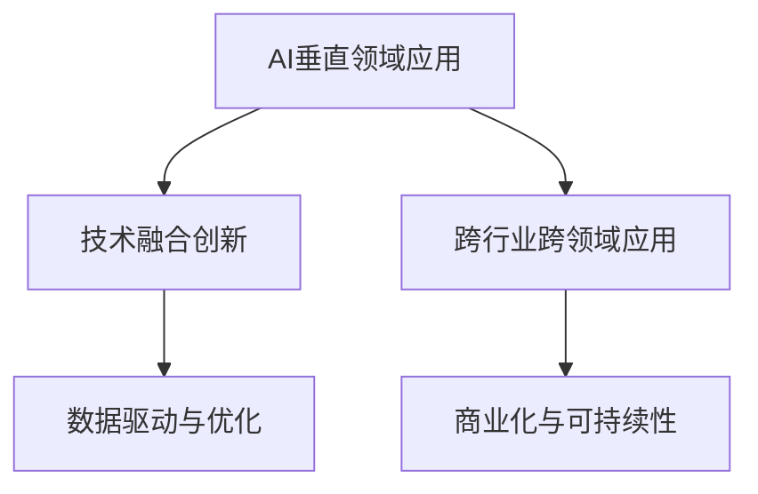

                 

# 硅谷多元化发展：AI企业创新探索垂直领域独特价值

> 关键词：硅谷,人工智能,垂直领域,多元化发展,创新探索,企业价值,独特应用

## 1. 背景介绍

### 1.1 问题由来
硅谷作为全球科技创新和人才集聚的“圣地”，一直以来都是全球人工智能(AI)和深度学习技术的诞生地。从谷歌大脑、OpenAI，到特斯拉的自动驾驶，再到医疗健康、金融科技等领域，硅谷的企业一直在不断引领AI技术的前沿。

近年来，随着AI技术的不断成熟和应用场景的不断拓展，硅谷的AI企业开始探索更多元化的发展路径，试图在垂直领域中寻找新的商业机会和增长点。这种多元化的探索不仅带来了AI技术应用的新空间，也推动了AI企业创新能力的提升，为未来的发展开辟了新的视角。

### 1.2 问题核心关键点
硅谷的AI企业多元化发展，主要体现在以下几个关键点：
1. **垂直领域的深度挖掘**：聚焦于特定行业，利用AI技术进行深度应用和优化。
2. **技术融合创新**：将AI技术与传统行业现有技术进行融合，实现功能增强和效率提升。
3. **跨行业跨领域应用**：打破行业界限，实现跨行业的AI应用，如AI在医疗、制造、教育等多个领域的融合。
4. **数据驱动与优化**：以数据为核心，不断优化算法模型，提升AI模型的应用效果。
5. **商业化与可持续性**：将AI技术转化为可规模化、可重复的商业模式，并寻求可持续性发展。

## 2. 核心概念与联系

### 2.1 核心概念概述

为更好地理解硅谷AI企业在垂直领域的多元化发展，本节将介绍几个关键概念：

- **AI垂直领域应用**：指AI技术在特定行业的应用，如医疗、金融、教育、制造业等。通过聚焦特定行业，AI企业能够提供更具针对性的解决方案。
- **技术融合创新**：将AI技术与行业现有技术进行深度融合，实现功能增强和效率提升，如AI在制造业中的质量控制、预测维护等应用。
- **跨行业跨领域应用**：打破行业界限，实现AI技术在多个领域的融合应用，如医疗AI在智能问诊、影像分析等多个环节的应用。
- **数据驱动与优化**：以数据为核心，不断优化AI模型的算法和参数，提升模型的应用效果，如数据增强、迁移学习等。
- **商业化与可持续性**：将AI技术转化为可规模化、可重复的商业模式，并通过业务发展和用户反馈不断优化产品，实现可持续性发展。

这些概念之间的逻辑关系可以通过以下Mermaid流程图来展示：



这个流程图展示了硅谷AI企业在垂直领域多元化发展的主要路径和策略：

1. **从特定行业出发**：AI企业聚焦于某一垂直领域，进行深度应用。
2. **技术与现有技术融合**：在垂直领域内，AI技术与传统行业技术深度融合。
3. **跨行业跨领域应用**：打破行业界限，实现AI技术在多个领域的融合。
4. **数据驱动与优化**：通过数据驱动，不断优化AI模型的算法和参数。
5. **商业化与可持续性**：将AI技术转化为商业应用，并实现可持续性发展。

## 3. 核心算法原理 & 具体操作步骤
### 3.1 算法原理概述

硅谷AI企业在垂直领域的多元化发展，本质上是通过深度学习和人工智能技术，在特定领域实现功能增强和效率提升的过程。其核心思想是：

1. **数据获取与预处理**：收集目标领域的大量数据，并进行清洗、标注和预处理。
2. **模型训练与优化**：利用预处理后的数据，训练深度学习模型，并通过迁移学习、数据增强等技术，优化模型在特定领域的表现。
3. **技术融合与集成**：将训练好的模型与其他行业技术（如自然语言处理、计算机视觉等）进行集成，实现更全面的功能。
4. **商业化与可持续性**：将模型转化为实际应用，并不断收集反馈，进行优化和迭代。

### 3.2 算法步骤详解

以下是硅谷AI企业在垂直领域应用中的核心算法步骤：

**Step 1: 数据获取与预处理**
- 收集目标领域的标注数据，包括文本、图像、视频等。
- 对数据进行清洗、去噪、标注和预处理，确保数据质量和可用性。

**Step 2: 模型训练与优化**
- 利用预处理后的数据，选择适合的深度学习模型（如CNN、RNN、Transformer等）进行训练。
- 应用迁移学习技术，将预训练模型在通用语料上获得的知识，迁移应用到特定领域。
- 利用数据增强技术（如数据合成、回译等）丰富训练数据，提高模型泛化能力。
- 通过超参数调优、正则化等技术，防止模型过拟合。

**Step 3: 技术融合与集成**
- 将训练好的模型与其他技术进行融合，如自然语言处理(NLP)、计算机视觉(CV)等，实现多模态的应用。
- 实现功能增强和集成，如智能问答系统、图像识别、预测维护等。

**Step 4: 商业化与可持续性**
- 将模型转化为实际应用，如APP、SaaS平台、API服务等。
- 收集用户反馈，进行持续优化和迭代。
- 通过市场验证，不断扩展业务规模和市场份额。

### 3.3 算法优缺点

硅谷AI企业在垂直领域的多元化发展，具有以下优点：
1. **行业针对性**：针对特定行业，提供量身定做的解决方案，提升业务效率和客户满意度。
2. **技术融合创新**：结合行业现有技术，实现功能增强和效率提升，推动技术进步。
3. **跨行业应用潜力**：打破行业界限，实现跨行业的AI应用，带来新的商业机会。
4. **数据驱动优化**：以数据为核心，不断优化算法模型，提升应用效果。

同时，该方法也存在一些局限性：
1. **行业数据获取困难**：特定行业的标注数据获取难度大，数据量少。
2. **模型泛化能力不足**：模型对特定领域的泛化能力可能有限，难以应对新任务。
3. **技术复杂度高**：需要同时掌握AI技术和行业知识，对人才要求高。
4. **商业化风险高**：投入大量资源，如果市场验证不理想，可能面临较高的商业风险。

尽管存在这些局限性，但就目前而言，这种多元化发展范式仍是大规模企业AI应用的主流，也是硅谷AI企业探索新增长点的重要方向。

### 3.4 算法应用领域

硅谷AI企业在垂直领域的多元化发展，已在多个行业取得了显著成效。以下是几个典型的应用领域：

- **医疗健康**：AI在医疗影像分析、智能问诊、药物研发等方面的应用，提升了诊断准确性和治疗效率。如DeepMind的AlphaGo在围棋中的应用，展示了AI在复杂决策问题上的潜力。

- **金融科技**：AI在金融风险管理、智能投顾、自动化交易等方面的应用，提升了金融服务的智能化水平。如JPMorgan Chase的AI系统，实现了实时交易分析和自动化交易执行。

- **智能制造**：AI在智能制造、质量控制、预测维护等方面的应用，提升了制造业的生产效率和产品质量。如GE的Predix平台，实现了设备预测维护和智能化生产。

- **教育**：AI在智能教育、个性化推荐、智能测评等方面的应用，提升了教育质量和学习效率。如Coursera的智能推荐系统，个性化推荐适合学员的课程。

- **零售电商**：AI在客户推荐、库存管理、需求预测等方面的应用，提升了零售电商的运营效率和客户满意度。如Amazon的推荐系统，实现个性化商品推荐和销售预测。

除了上述这些典型领域，AI在能源、农业、环保、公共安全等众多行业也展现了巨大的应用潜力。随着AI技术的不断进步，硅谷的AI企业将在更多领域实现多元化发展。

## 4. 数学模型和公式 & 详细讲解 & 举例说明

### 4.1 数学模型构建

在硅谷AI企业的垂直领域应用中，通常涉及大量的数据处理和模型训练任务。以下以医疗影像分析为例，介绍数据驱动与优化的数学模型构建。

设目标任务为医疗影像的肿瘤检测，输入为医疗影像图像 $I$，输出为肿瘤存在与否的分类标签 $Y$。数学模型构建过程如下：

1. **数据预处理**：对医疗影像进行预处理，如尺寸归一化、噪声滤除等。
2. **模型选择**：选择适合的深度学习模型，如卷积神经网络(CNN)、全卷积网络(FCN)等。
3. **损失函数定义**：定义模型输出的损失函数，如交叉熵损失、均方误差损失等。
4. **优化器选择**：选择适合的优化算法，如Adam、SGD等。
5. **模型训练**：利用预处理后的数据，训练模型，最小化损失函数。

### 4.2 公式推导过程

以医疗影像分类任务为例，介绍模型训练和优化的数学推导过程：

**目标函数**：
$$
\min_{\theta} L(\theta) = \frac{1}{N} \sum_{i=1}^N \ell(M_{\theta}(I_i), Y_i)
$$
其中，$M_{\theta}$ 表示模型参数，$\ell$ 表示损失函数。

**交叉熵损失函数**：
$$
\ell(M_{\theta}(I), Y) = -\sum_{i=1}^C Y_i \log(M_{\theta}(I)_i)
$$
其中，$C$ 表示类别数，$M_{\theta}(I)_i$ 表示模型输出中类别 $i$ 的概率。

**梯度下降算法**：
$$
\theta_{t+1} = \theta_t - \eta \nabla_{\theta}L(\theta_t)
$$
其中，$\eta$ 为学习率，$\nabla_{\theta}L(\theta_t)$ 表示损失函数对模型参数的梯度。

### 4.3 案例分析与讲解

以医疗影像分类为例，介绍数据驱动与优化的具体实施步骤：

1. **数据获取与预处理**：收集大量医疗影像数据，并进行预处理，如尺寸归一化、噪声滤除等。
2. **模型选择与训练**：选择适合的深度学习模型，如全卷积网络(FCN)，并在训练集上进行训练，最小化交叉熵损失。
3. **模型验证与优化**：在验证集上评估模型性能，根据性能指标调整模型超参数，如学习率、批大小等。
4. **模型部署与应用**：将训练好的模型部署到实际应用中，如智能医疗诊断平台，实现肿瘤检测等功能的落地。

## 5. 项目实践：代码实例和详细解释说明

### 5.1 开发环境搭建

在进行垂直领域应用开发前，我们需要准备好开发环境。以下是使用Python进行TensorFlow开发的环境配置流程：

1. 安装Anaconda：从官网下载并安装Anaconda，用于创建独立的Python环境。

2. 创建并激活虚拟环境：
```bash
conda create -n tf-env python=3.8 
conda activate tf-env
```

3. 安装TensorFlow：根据CUDA版本，从官网获取对应的安装命令。例如：
```bash
conda install tensorflow -c pytorch -c conda-forge
```

4. 安装各类工具包：
```bash
pip install numpy pandas scikit-learn matplotlib tqdm jupyter notebook ipython
```

完成上述步骤后，即可在`tf-env`环境中开始开发实践。

### 5.2 源代码详细实现

这里我们以医疗影像分类任务为例，给出使用TensorFlow进行模型训练的代码实现。

首先，定义模型和损失函数：

```python
import tensorflow as tf
from tensorflow.keras import layers, models

model = models.Sequential([
    layers.Conv2D(32, (3, 3), activation='relu', input_shape=(256, 256, 3)),
    layers.MaxPooling2D((2, 2)),
    layers.Conv2D(64, (3, 3), activation='relu'),
    layers.MaxPooling2D((2, 2)),
    layers.Conv2D(128, (3, 3), activation='relu'),
    layers.MaxPooling2D((2, 2)),
    layers.Flatten(),
    layers.Dense(128, activation='relu'),
    layers.Dense(1, activation='sigmoid')
])

loss_fn = tf.keras.losses.BinaryCrossentropy()

```

然后，定义训练函数：

```python
@tf.function
def train_step(images, labels):
    with tf.GradientTape() as tape:
        predictions = model(images)
        loss = loss_fn(labels, predictions)
    gradients = tape.gradient(loss, model.trainable_variables)
    optimizer.apply_gradients(zip(gradients, model.trainable_variables))
    return loss

@tf.function
def train_epoch(model, dataset, batch_size, optimizer):
    model.train()
    total_loss = 0.0
    for images, labels in dataset:
        images = images / 255.0
        loss = train_step(images, labels)
        total_loss += loss
    return total_loss / len(dataset)

```

最后，启动训练流程并在测试集上评估：

```python
epochs = 10
batch_size = 32
learning_rate = 0.001
optimizer = tf.keras.optimizers.Adam(learning_rate)

dataset = tf.data.Dataset.from_tensor_slices((train_images, train_labels))
dataset = dataset.batch(batch_size).shuffle(buffer_size=1024)

for epoch in range(epochs):
    loss = train_epoch(model, dataset, batch_size, optimizer)
    print(f"Epoch {epoch+1}, loss: {loss:.3f}")
    
    dataset = tf.data.Dataset.from_tensor_slices((test_images, test_labels))
    dataset = dataset.batch(batch_size).shuffle(buffer_size=1024)
    evaluate(model, dataset, batch_size)

```

以上就是使用TensorFlow进行医疗影像分类任务开发的完整代码实现。可以看到，TensorFlow提供了强大的API支持，使得模型训练和优化变得简单高效。

### 5.3 代码解读与分析

让我们再详细解读一下关键代码的实现细节：

**模型定义**：
- `Sequential`模型：定义一个序列化的模型，即模型由多个层次化的模块组成，按照顺序依次连接。
- `Conv2D`层：卷积层，用于提取图像特征。
- `MaxPooling2D`层：池化层，用于降采样和特征提取。
- `Dense`层：全连接层，用于分类。

**损失函数定义**：
- `BinaryCrossentropy`：二分类交叉熵损失函数，用于二分类问题。

**训练函数实现**：
- `train_step`函数：定义单步训练流程，包括前向传播、损失计算、梯度计算和反向传播。
- `train_epoch`函数：定义单epoch训练流程，遍历数据集，计算并更新模型参数。

**训练和评估**：
- `train_epoch`函数：在训练集上进行训练，输出每个epoch的平均损失。
- `evaluate`函数：在测试集上进行评估，输出模型在测试集上的性能。

## 6. 实际应用场景

### 6.1 医疗影像分析

医疗影像分析是硅谷AI企业的重要应用场景之一。通过深度学习模型对医疗影像进行分类、分割、检测等处理，可以大幅提升医疗诊断的准确性和效率。

以乳腺癌筛查为例，AI模型可以从数字化的乳腺X光片或超声图像中，自动检测出可疑的肿瘤区域。具体流程如下：
1. 收集大量标注好的乳腺影像数据。
2. 使用深度学习模型，如U-Net、ResNet等，进行分类和分割。
3. 在测试集上评估模型性能，不断优化模型参数和结构。
4. 将训练好的模型集成到实际应用中，如医院影像诊断系统，帮助医生进行乳腺癌筛查和诊断。

### 6.2 智能客服系统

智能客服系统也是硅谷AI企业的重要应用方向。通过深度学习模型对用户提问进行自然语言处理和理解，可以实现自动回复、情感分析等功能。

以智能客服聊天机器人为例，AI模型可以从历史对话数据中学习用户的意图和语境，自动回复常见问题，并处理复杂查询。具体流程如下：
1. 收集大量的用户对话数据，并进行预处理和标注。
2. 使用深度学习模型，如Seq2Seq、Transformer等，进行对话生成和情感分析。
3. 在测试集上评估模型性能，不断优化模型参数和结构。
4. 将训练好的模型集成到实际应用中，如企业客服平台，实现自动化客服功能。

### 6.3 智能制造

智能制造也是硅谷AI企业的重点应用领域之一。通过深度学习模型对工业设备进行预测维护、质量控制等处理，可以大幅提升制造业的生产效率和产品质量。

以预测维护为例，AI模型可以从设备运行数据中，预测设备故障和维护需求。具体流程如下：
1. 收集大量设备运行数据，并进行预处理和标注。
2. 使用深度学习模型，如RNN、LSTM等，进行故障预测和维护调度。
3. 在测试集上评估模型性能，不断优化模型参数和结构。
4. 将训练好的模型集成到实际应用中，如GE的Predix平台，实现设备预测维护和智能化生产。

### 6.4 未来应用展望

随着AI技术的不断进步和应用场景的不断拓展，硅谷的AI企业将在更多领域实现多元化发展。以下是一些未来可能的应用方向：

- **自动驾驶**：AI在自动驾驶领域的应用，可以实现车辆的智能导航、避障等功能。
- **个性化推荐系统**：AI在电商、娱乐等领域的应用，可以实现个性化商品推荐、个性化内容推荐等功能。
- **智能家居**：AI在智能家居领域的应用，可以实现智能语音交互、智能家居设备管理等功能。
- **环境监测**：AI在环境保护领域的应用，可以实现空气质量监测、水质监测等功能。

## 7. 工具和资源推荐

### 7.1 学习资源推荐

为了帮助开发者系统掌握硅谷AI企业在垂直领域的多元化发展，这里推荐一些优质的学习资源：

1. **深度学习框架TensorFlow**：Google开源的深度学习框架，提供了丰富的API和工具支持，适用于大规模企业AI开发。
2. **深度学习框架PyTorch**：Facebook开源的深度学习框架，灵活易用，适用于学术研究和企业开发。
3. **自然语言处理工具NLTK**：Python的自然语言处理工具库，适用于NLP任务的开发和研究。
4. **计算机视觉工具OpenCV**：开源的计算机视觉库，适用于图像处理和计算机视觉任务的开发。
5. **机器学习框架Scikit-Learn**：Python的机器学习工具库，适用于各种机器学习任务的开发。

通过这些资源的学习和实践，相信你一定能够快速掌握硅谷AI企业的垂直领域应用，并用于解决实际的AI问题。

### 7.2 开发工具推荐

高效的开发离不开优秀的工具支持。以下是几款用于硅谷AI企业AI开发常用的工具：

1. **Jupyter Notebook**：交互式的Python开发环境，支持代码运行、数据可视化和文档编辑，适用于数据科学和AI开发。
2. **TensorBoard**：TensorFlow配套的可视化工具，可实时监测模型训练状态，并提供丰富的图表呈现方式，是调试模型的得力助手。
3. **GitLab**：开源项目管理平台，支持代码托管、CI/CD、协作开发等功能，适用于企业级的AI项目管理和开发。
4. **Docker**：开源的容器化技术，支持应用部署和环境隔离，适用于企业级AI应用的部署和扩展。
5. **Kubernetes**：开源的容器编排系统，支持大规模集群管理和资源调度，适用于企业级AI应用的部署和扩展。

合理利用这些工具，可以显著提升硅谷AI企业的AI开发效率，加快创新迭代的步伐。

### 7.3 相关论文推荐

硅谷AI企业在垂直领域的多元化发展，源于学界的持续研究。以下是几篇奠基性的相关论文，推荐阅读：

1. **Deep Learning for Healthcare**：IEEE论文，介绍了深度学习在医疗影像分析、智能问诊等方面的应用。
2. **AI in Manufacturing**：IEEE论文，介绍了AI在智能制造、预测维护等方面的应用。
3. **Smart Cities through AI**：IEEE论文，介绍了AI在智慧城市治理、环境监测等方面的应用。
4. **Personalized Recommendation Systems**：KDD论文，介绍了AI在个性化推荐系统中的应用。
5. **Automated Driving Systems**：IEEE论文，介绍了AI在自动驾驶系统中的应用。

这些论文代表了大规模企业AI发展的最新成果，通过学习这些前沿成果，可以帮助研究者把握学科前进方向，激发更多的创新灵感。

## 8. 总结：未来发展趋势与挑战

### 8.1 总结

本文对硅谷AI企业在垂直领域的多元化发展进行了全面系统的介绍。首先阐述了硅谷AI企业的背景和多元化发展的重要意义，明确了垂直领域应用在提升业务效率和客户满意度方面的独特价值。其次，从原理到实践，详细讲解了垂直领域应用的数学模型构建和核心算法步骤，给出了具体应用的代码实例。同时，本文还广泛探讨了硅谷AI企业在医疗影像分析、智能客服、智能制造等多个领域的应用前景，展示了多元化发展的广阔潜力。此外，本文精选了垂直领域应用的各类学习资源，力求为开发者提供全方位的技术指引。

通过本文的系统梳理，可以看到，硅谷AI企业在垂直领域的多元化发展，为AI技术的应用打开了新的篇章，推动了硅谷AI企业创新能力的提升。未来，伴随AI技术的不断进步和应用场景的不断拓展，硅谷的AI企业必将在更多领域实现多元化发展，为全球科技和经济带来新的动力。

### 8.2 未来发展趋势

展望未来，硅谷AI企业在垂直领域的多元化发展，将呈现以下几个发展趋势：

1. **技术融合创新**：AI技术与传统行业的深度融合，带来更多创新应用和功能增强。
2. **跨行业跨领域应用**：打破行业界限，实现AI技术在更多领域的融合应用。
3. **数据驱动与优化**：以数据为核心，不断优化AI模型的算法和参数，提升应用效果。
4. **商业化与可持续性**：将AI技术转化为可规模化、可重复的商业模式，实现可持续发展。
5. **AI伦理与安全**：在AI技术应用中，重视伦理和安全问题，确保技术应用的合规性和安全性。

这些趋势凸显了硅谷AI企业在垂直领域多元化的发展方向，为未来技术应用和商业化提供了新的视角和路径。

### 8.3 面临的挑战

尽管硅谷AI企业在垂直领域的多元化发展取得了显著成效，但在迈向更加智能化、普适化应用的过程中，它仍面临诸多挑战：

1. **数据获取与标注**：特定行业的标注数据获取难度大，数据量少。
2. **模型泛化能力**：模型对特定领域的泛化能力可能有限，难以应对新任务。
3. **技术复杂度高**：需要同时掌握AI技术和行业知识，对人才要求高。
4. **商业化风险高**：投入大量资源，如果市场验证不理想，可能面临较高的商业风险。
5. **AI伦理与安全**：在AI技术应用中，重视伦理和安全问题，确保技术应用的合规性和安全性。

尽管存在这些挑战，但未来相关研究的不断突破，将有助于硅谷AI企业在垂直领域的多元化发展，进一步提升AI技术的实际应用效果和商业价值。

### 8.4 研究展望

面向未来，硅谷AI企业在垂直领域的多元化发展，需要在以下几个方面进行持续探索和创新：

1. **数据获取与预处理**：探索更多元化的数据获取和预处理技术，提高数据质量和可用性。
2. **模型泛化能力**：研究更具泛化能力的模型，提升模型在不同领域的适应性。
3. **技术融合与集成**：探索更多技术融合与集成的方法，实现更全面的功能增强。
4. **商业化与可持续性**：探索更高效的商业化策略，确保AI技术的高效应用和可持续发展。
5. **AI伦理与安全**：重视AI技术的伦理和安全问题，确保技术应用的合规性和安全性。

这些研究方向和探索，将进一步推动硅谷AI企业在垂直领域的多元化发展，为全球科技和经济带来新的创新和突破。总之，硅谷AI企业的多元化发展，必将为AI技术在垂直领域的落地应用开辟新的篇章，推动硅谷AI企业持续创新和成长。

## 9. 附录：常见问题与解答

**Q1：AI企业在垂直领域的多元化发展是否存在数据获取困难的问题？**

A: 是的，特定行业的标注数据获取难度大，数据量少。但可以通过数据增强、迁移学习等方法，缓解数据获取困难的问题。

**Q2：AI企业在垂直领域的多元化发展是否需要大量的预训练数据？**

A: 不需要。即使没有大量预训练数据，也可以通过迁移学习和微调等技术，在少量标注数据上实现高效的多元化应用。

**Q3：AI企业在垂直领域的多元化发展是否需要高水平的人才？**

A: 是的。需要同时掌握AI技术和行业知识，对人才要求高。

**Q4：AI企业在垂直领域的多元化发展是否存在高商业风险？**

A: 是的。投入大量资源，如果市场验证不理想，可能面临较高的商业风险。

**Q5：AI企业在垂直领域的多元化发展是否需要重视伦理和安全问题？**

A: 是的。在AI技术应用中，重视伦理和安全问题，确保技术应用的合规性和安全性。

---

作者：禅与计算机程序设计艺术 / Zen and the Art of Computer Programming

