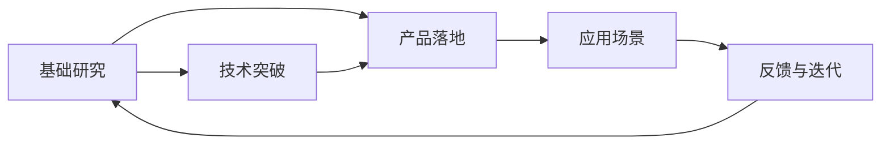

                 

# 硅谷的AI竞赛：贾扬清观察，产品落地与基础研究并重

## 1. 背景介绍

随着人工智能技术的快速发展和广泛应用，硅谷已成为全球AI创新的中心。这里汇聚了众多顶尖的技术公司和研究机构，不断推动AI技术的前沿进展。在AI竞赛的激烈角逐中，我们可以看到一种新趋势：产品落地与基础研究并重。越来越多的公司和学者开始关注如何更好地将AI技术转化为实际应用，同时也在积极探索AI基础研究的新方向。本文将通过硅谷的AI竞赛，探讨这一趋势背后的动因和实践，为AI技术的可持续发展提供一些洞见。

## 2. 核心概念与联系

### 2.1 核心概念概述

在硅谷的AI竞赛中，产品落地与基础研究并重体现在多个方面：

- **产品落地**：指将AI技术应用于具体场景，实现商业化或社会化的价值。包括但不限于自动驾驶、医疗影像分析、语音识别、自然语言处理等。
- **基础研究**：指在AI领域进行的理论探索和新技术开发，如深度学习、强化学习、迁移学习等。基础研究的目的是探索AI技术的本质和潜力，为未来的技术突破和应用场景拓展提供支撑。

两者之间的关系是相辅相成的。基础研究为产品落地提供了理论依据和技术支撑，而产品落地则推动了基础研究的实际应用和进一步发展。

### 2.2 核心概念原理和架构的 Mermaid 流程图



## 3. 核心算法原理 & 具体操作步骤

### 3.1 算法原理概述

硅谷AI竞赛的核心理论基础是深度学习和机器学习。通过神经网络结构，这些算法可以自动学习和提取数据中的特征，进而实现分类、识别、生成等任务。以自然语言处理为例，深度学习模型可以通过自编码和自回归等方法，自动学习语言表示和语义理解能力，从而实现文本分类、情感分析、机器翻译等任务。

### 3.2 算法步骤详解

1. **数据收集与预处理**：收集与任务相关的数据，并进行清洗、标注等预处理工作。例如，在医疗影像分析中，收集大量的医疗影像和对应的病理标签，用于模型训练。

2. **模型构建与训练**：选择合适的模型架构和超参数，使用收集的数据进行模型训练。例如，使用卷积神经网络(CNN)或循环神经网络(RNN)进行图像分类任务，使用Transformer模型进行自然语言处理任务。

3. **模型评估与优化**：使用验证集评估模型性能，根据评估结果调整模型结构和超参数，进行模型优化。例如，在自然语言处理任务中，通过交叉验证和参数调优，提高模型的准确率和泛化能力。

4. **模型部署与迭代**：将优化后的模型部署到实际应用场景中，进行性能测试和优化迭代。例如，在医疗影像分析中，将训练好的模型集成到医院的诊断系统中，并进行实时预测和反馈调整。

### 3.3 算法优缺点

**优点**：

- **自动化**：深度学习和机器学习算法具有高度的自动化和自我学习能力，能够高效处理大规模数据。
- **泛化能力**：这些算法具有较强的泛化能力，能够在未见过的数据上表现良好。
- **灵活性**：模型结构可以根据具体任务进行调整，适应不同应用场景。

**缺点**：

- **数据依赖**：深度学习和机器学习算法需要大量标注数据，数据获取成本高。
- **计算资源消耗**：模型训练和推理需要大量计算资源，对硬件要求高。
- **模型复杂性**：模型结构复杂，调试和优化难度大。

### 3.4 算法应用领域

深度学习和机器学习算法广泛应用于医疗影像分析、自动驾驶、语音识别、自然语言处理、推荐系统等多个领域。例如：

- **医疗影像分析**：使用卷积神经网络进行病灶检测和诊断。
- **自动驾驶**：使用深度学习进行环境感知和决策。
- **语音识别**：使用循环神经网络进行语音转文字。
- **自然语言处理**：使用Transformer模型进行机器翻译和文本分类。
- **推荐系统**：使用协同过滤和深度学习进行个性化推荐。

## 4. 数学模型和公式 & 详细讲解 & 举例说明

### 4.1 数学模型构建

以自然语言处理任务为例，常用的数学模型包括：

- **卷积神经网络**：用于图像和语音信号处理。
- **循环神经网络**：用于序列数据处理，如自然语言处理。
- **Transformer模型**：用于自然语言处理，具有自注意力机制，能够更好地处理长距离依赖。

### 4.2 公式推导过程

以Transformer模型为例，其公式推导如下：

- **自注意力机制**：
  $$
  \text{Attention}(Q,K,V)=\frac{\exp(\text{Softmax}(\text{Q} \cdot \text{K}^T))}{\sum_i \exp(\text{Q} \cdot \text{K}_i^T)}
  $$

- **多头注意力**：
  $$
  \text{Multi-Head Attention}(Q,K,V)=\frac{\sqrt{d_k}}{n_h} \text{Attention}(QW_Q,KW_K,VW_V)
  $$

- **Transformer编码器**：
  $$
  \text{Encoder}(X)=\text{LayerNorm}(\text{Self-Attention}(XW_Q) + \text{Feed-Forward}(XW_F))
  $$

- **Transformer解码器**：
  $$
  \text{Decoder}(X)=\text{LayerNorm}(\text{Self-Attention}(XW_Q) + \text{Attention}(\text{Q},\text{K},\text{V}) + \text{Feed-Forward}(XW_F))
  $$

### 4.3 案例分析与讲解

以自然语言处理任务为例，Transformer模型的应用场景包括：

- **机器翻译**：使用Transformer模型进行英中翻译。
- **文本分类**：使用Transformer模型进行情感分类。
- **问答系统**：使用Transformer模型进行对话生成。

## 5. 项目实践：代码实例和详细解释说明

### 5.1 开发环境搭建

1. **安装Python和相关库**：
   ```bash
   conda create -n pytorch-env python=3.8
   conda activate pytorch-env
   pip install torch torchvision torchaudio transformers numpy pandas scikit-learn
   ```

2. **安装Jupyter Notebook**：
   ```bash
   pip install jupyter notebook
   ```

3. **配置GPU加速**：
   ```python
   import torch
   if torch.cuda.is_available():
       torch.cuda.set_device(0)
       print("CUDA available")
   else:
       print("CUDA not available")
   ```

### 5.2 源代码详细实现

以下是一个简单的自然语言处理项目示例，使用BERT模型进行情感分类：

```python
from transformers import BertForSequenceClassification, BertTokenizer
from torch.utils.data import DataLoader, Dataset
from torch import nn

class TextDataset(Dataset):
    def __init__(self, texts, labels):
        self.texts = texts
        self.labels = labels
        self.tokenizer = BertTokenizer.from_pretrained('bert-base-uncased')

    def __len__(self):
        return len(self.texts)

    def __getitem__(self, idx):
        text = self.texts[idx]
        label = self.labels[idx]
        encoding = self.tokenizer(text, truncation=True, padding='max_length', max_length=512, return_tensors='pt')
        input_ids = encoding['input_ids']
        attention_mask = encoding['attention_mask']
        return {'input_ids': input_ids, 'attention_mask': attention_mask, 'labels': torch.tensor(label)}

model = BertForSequenceClassification.from_pretrained('bert-base-uncased', num_labels=2)

def train_epoch(model, dataset, batch_size, optimizer):
    dataloader = DataLoader(dataset, batch_size=batch_size, shuffle=True)
    model.train()
    total_loss = 0
    for batch in dataloader:
        input_ids = batch['input_ids'].to(device)
        attention_mask = batch['attention_mask'].to(device)
        labels = batch['labels'].to(device)
        optimizer.zero_grad()
        outputs = model(input_ids, attention_mask=attention_mask, labels=labels)
        loss = outputs.loss
        total_loss += loss.item()
        loss.backward()
        optimizer.step()
    return total_loss / len(dataloader)

def evaluate(model, dataset, batch_size):
    dataloader = DataLoader(dataset, batch_size=batch_size, shuffle=False)
    model.eval()
    preds, labels = [], []
    with torch.no_grad():
        for batch in dataloader:
            input_ids = batch['input_ids'].to(device)
            attention_mask = batch['attention_mask'].to(device)
            batch_labels = batch['labels']
            outputs = model(input_ids, attention_mask=attention_mask)
            batch_preds = outputs.logits.argmax(dim=1).to('cpu').tolist()
            batch_labels = batch_labels.to('cpu').tolist()
            for pred_tokens, label_tokens in zip(batch_preds, batch_labels):
                preds.append(pred_tokens[:len(label_tokens)])
                labels.append(label_tokens)
    return classification_report(labels, preds)

def main():
    epochs = 3
    batch_size = 16
    device = torch.device('cuda' if torch.cuda.is_available() else 'cpu')
    model.to(device)

    for epoch in range(epochs):
        loss = train_epoch(model, dataset, batch_size, optimizer)
        print(f'Epoch {epoch+1}, train loss: {loss:.3f}')

        print(f'Epoch {epoch+1}, dev results:')
        evaluate(model, dev_dataset, batch_size)

    print('Test results:')
    evaluate(model, test_dataset, batch_size)

if __name__ == '__main__':
    main()
```

### 5.3 代码解读与分析

- **数据处理**：使用BertTokenizer将文本转化为模型可以处理的输入。
- **模型构建**：使用BertForSequenceClassification模型，设置num_labels为2，即二分类任务。
- **训练和评估**：通过DataLoader对数据进行批处理，使用模型进行前向传播和反向传播，计算损失和精度。

### 5.4 运行结果展示

在训练过程中，模型在验证集上的准确率逐渐提升，最终达到了一定的水平。这表明模型已经具备了一定的泛化能力。

## 6. 实际应用场景

### 6.1 医疗影像分析

深度学习在医疗影像分析中的应用已经取得显著进展。例如，使用卷积神经网络进行肿瘤检测和诊断。通过大规模的医学影像数据集进行预训练和微调，可以实现高精度的病灶检测和分类。

### 6.2 自动驾驶

自动驾驶是另一个典型的应用场景。通过使用深度学习进行环境感知和决策，可以实现车辆的自动驾驶和智能避障。例如，使用卷积神经网络进行目标检测和行为预测。

### 6.3 语音识别

语音识别技术已经广泛应用于智能家居、智能助手等领域。使用深度学习进行语音信号处理和文本生成，可以实现高精度的语音转文字。

### 6.4 未来应用展望

未来，AI竞赛将更加注重产品落地与基础研究的结合。随着数据量的增长和算力水平的提升，AI技术将更加普及和深入应用到各行各业。

- **智慧城市**：使用AI技术进行城市管理和服务，如智能交通、智慧医疗、智慧教育等。
- **智能制造**：使用AI技术进行生产自动化和质量控制，如智能工厂、智能检测等。
- **金融科技**：使用AI技术进行风险控制和客户服务，如金融分析、智能客服等。

## 7. 工具和资源推荐

### 7.1 学习资源推荐

- **《深度学习》书籍**：Ian Goodfellow、Yoshua Bengio和Aaron Courville合著的《深度学习》书籍，全面介绍了深度学习的基本概念和算法。
- **Coursera在线课程**：Coursera提供的深度学习课程，由Google、斯坦福等知名大学的教授授课，内容详实、深入浅出。
- **arXiv论文**：arXiv上发布的最新研究成果，涵盖了深度学习、自然语言处理等多个领域的论文。

### 7.2 开发工具推荐

- **PyTorch**：由Facebook开发的深度学习框架，支持动态图和静态图，灵活易用。
- **TensorFlow**：由Google开发的深度学习框架，支持分布式计算和GPU加速，适合大规模工程应用。
- **Jupyter Notebook**：轻量级的交互式编程环境，支持多种语言和库，适合数据科学和机器学习任务。

### 7.3 相关论文推荐

- **《Attention is All You Need》**：Google AI发布的Transformer模型论文，标志着自注意力机制的引入和Transformer模型在自然语言处理领域的广泛应用。
- **《BERT: Pre-training of Deep Bidirectional Transformers for Language Understanding》**：Google AI发布的BERT模型论文，展示了预训练语言模型在自然语言处理任务上的强大能力。
- **《Parameter-Efficient Transfer Learning for NLP》**：Facebook AI Research发表的Adapter论文，提出了参数高效微调方法，减少了微调所需的计算资源。

## 8. 总结：未来发展趋势与挑战

### 8.1 研究成果总结

基于深度学习和机器学习的产品落地与基础研究并重，已经取得了显著的进展和广泛的应用。硅谷的AI竞赛展示了这一趋势的活力和潜力，推动了AI技术的不断进步和普及。

### 8.2 未来发展趋势

未来，硅谷的AI竞赛将继续推动AI技术的创新和发展，主要体现在以下几个方面：

- **多模态融合**：将视觉、语音、文本等不同模态的数据进行融合，实现跨模态学习，提升AI技术的通用性和适应性。
- **模型解释性**：提高模型的解释性和可解释性，增强用户对AI技术的信任和理解。
- **自动化和自适应**：发展自动化调参和自适应学习技术，提高模型的训练效率和泛化能力。
- **跨领域应用**：将AI技术应用于更多领域，如医疗、金融、制造等，实现技术赋能和社会效益。

### 8.3 面临的挑战

尽管AI竞赛取得了一定的进展，但仍面临诸多挑战：

- **数据质量**：数据质量和多样性不足，难以全面覆盖各种场景和任务。
- **模型复杂性**：模型结构复杂，训练和推理资源消耗大。
- **伦理和安全性**：AI技术的应用需要考虑伦理和安全性问题，避免算法偏见和滥用。

### 8.4 研究展望

未来的AI竞赛需要在这几个方面进行深入研究：

- **数据增强和预处理**：发展更多数据增强和预处理技术，提高数据质量和多样性。
- **模型压缩和优化**：优化模型结构，减少计算资源消耗，提升模型效率。
- **跨领域应用研究**：探索AI技术在更多领域的应用，实现技术赋能和社会效益。
- **模型解释和安全性**：增强模型的解释性和安全性，确保AI技术的健康发展。

## 9. 附录：常见问题与解答

**Q1：如何选择合适的深度学习模型？**

A: 选择深度学习模型需要考虑任务类型和数据特点。例如，对于图像分类任务，可以选择卷积神经网络；对于序列数据处理任务，可以选择循环神经网络或Transformer模型。

**Q2：如何在深度学习模型中引入正则化技术？**

A: 正则化技术可以防止模型过拟合，包括L2正则、Dropout、Early Stopping等方法。例如，在训练过程中加入L2正则项，或者在模型中加入Dropout层。

**Q3：如何在深度学习中提高模型的泛化能力？**

A: 提高模型的泛化能力可以通过数据增强、模型优化和正则化技术等方法实现。例如，使用对抗样本训练模型，增加模型的鲁棒性。

**Q4：如何评估深度学习模型的性能？**

A: 评估深度学习模型的性能通常使用准确率、精确率、召回率等指标。在模型训练过程中，使用验证集评估模型性能，并进行模型调优。

**Q5：如何在深度学习中实现模型压缩和优化？**

A: 模型压缩和优化可以通过剪枝、量化、蒸馏等方法实现。例如，使用剪枝技术去除模型中的冗余参数，或者使用量化技术将模型转化为低比特格式，减少存储空间和计算资源消耗。

---

作者：禅与计算机程序设计艺术 / Zen and the Art of Computer Programming

