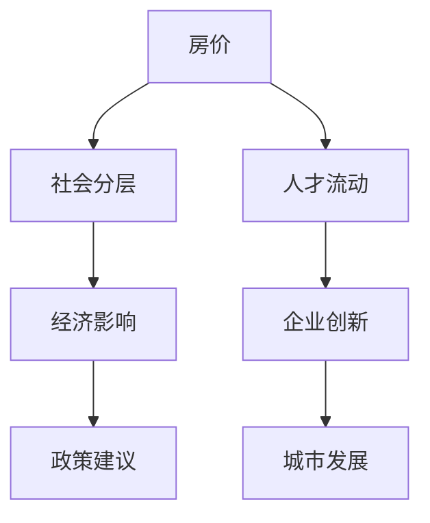

                 

# 硅谷高房价对社会阶层的影响

> 关键词：高房价, 社会分层, 经济影响, 政策建议, 社会公平, 科技行业, 房地产市场

## 1. 背景介绍

### 1.1 问题由来
硅谷，作为全球科技创新和创业的中心，吸引了来自世界各地的人才。然而，高昂的房价和生活成本成为了许多人才和家庭难以跨越的门槛。高房价不仅影响人们的居住质量，更对社会阶层结构产生了深远影响。

### 1.2 问题核心关键点
- **高房价现象**：硅谷房价高企，远超其他地区。
- **社会分层**：高房价加剧了社会阶层分化。
- **经济影响**：高房价对人才流动、企业创新、城市发展产生多方面影响。
- **政策建议**：如何通过政策手段缓解高房价带来的社会问题。

### 1.3 问题研究意义
研究硅谷高房价对社会阶层的影响，对于理解和解决城市房价问题、促进社会公平、推动科技创新具有重要意义。通过深入分析高房价现象背后的原因及其社会效应，可以为制定有效的政策措施提供理论支撑。

## 2. 核心概念与联系

### 2.1 核心概念概述

- **房价**：指房地产市场上住宅的平均价格，反映地区经济水平和生活成本。
- **社会分层**：指不同社会群体在经济、教育、职业等方面的分层现象，反映社会结构的不平等。
- **人才流动**：指人力资本在不同地区、行业、企业之间的迁移。
- **企业创新**：指企业在技术、产品、管理等方面的创新活动，推动经济增长和社会进步。
- **政策建议**：指政府为了解决特定社会问题而制定的政策措施。

这些概念之间的联系可以通过以下Mermaid流程图来展示：



这个流程图展示了房价与多个关键社会现象的关联，其中：

1. **高房价导致社会分层**：房价上涨使得低收入群体难以负担住房，导致其社会地位和经济状况恶化。
2. **人才流动影响企业创新**：高房价促使人才流向其他地区，影响硅谷企业的技术储备和创新能力。
3. **企业创新推动城市发展**：创新活动是城市经济发展的核心驱动力。
4. **政策建议缓解经济影响**：合理的政策措施可以有效缓解高房价带来的经济和社会问题。

## 3. 核心算法原理 & 具体操作步骤

### 3.1 算法原理概述

硅谷高房价对社会阶层的影响分析，本质上是一个多因素、多维度的复杂系统问题。我们通过系统动力学模型（SDM）对其进行建模和分析。系统动力学模型旨在捕捉系统中各变量之间的动态关系和反馈机制。

假设存在以下几个关键变量：
- **房价**：H(t)
- **人口数量**：P(t)
- **就业率**：E(t)
- **企业创新**：I(t)
- **社会福利**：SW(t)

基于以上变量，构建如下系统动力学模型：

\[ H(t) = f(P(t), E(t), I(t)) \]
\[ P(t) = g(H(t), SW(t)) \]
\[ E(t) = h(P(t), H(t)) \]
\[ I(t) = i(E(t), P(t)) \]
\[ SW(t) = j(H(t), P(t)) \]

其中，\( f, g, h, i, j \) 分别表示房价、人口、就业率、企业创新和社会福利的动态关系函数。

### 3.2 算法步骤详解

**Step 1: 数据收集与预处理**

- 收集硅谷地区的历史房价数据、人口数据、就业数据、企业创新数据和社会福利数据。
- 清洗数据，处理缺失值和异常值，确保数据的质量和一致性。

**Step 2: 构建系统动力学模型**

- 根据收集到的数据，构建上述的动态关系函数。
- 使用Vensim或STEPS等软件进行模型仿真。

**Step 3: 模型验证与参数调整**

- 在仿真结果中引入随机扰动，验证模型的稳定性。
- 根据实际数据，调整模型参数，使其与真实情况相匹配。

**Step 4: 模型预测与分析**

- 使用调整后的模型，预测未来房价和社会分层的情况。
- 分析模型结果，识别影响房价和社会分层的关键因素。

**Step 5: 政策建议与优化**

- 根据模型分析结果，提出针对性的政策建议。
- 使用模型对政策效果进行仿真，评估其对社会阶层和房价的影响。

### 3.3 算法优缺点

**优点**：
- **系统性**：能够全面考虑多因素之间的动态关系，提供更全面的分析视角。
- **动态性**：能够预测未来趋势，帮助制定长远的政策规划。
- **可操作性**：模型结果易于理解，政策建议具有指导意义。

**缺点**：
- **复杂性**：模型构建和调整需要专业知识，对数据质量要求高。
- **假设限制**：模型中的假设可能与实际情况不符，影响预测结果的准确性。
- **动态性**：模型参数和变量需要定期更新，以适应变化的环境。

### 3.4 算法应用领域

硅谷高房价对社会阶层的影响分析，不仅适用于城市规划和房地产市场，还具有更广泛的应用领域：

- **城市经济研究**：了解房价与城市经济发展之间的关系。
- **企业策略制定**：分析高房价对企业人才招聘和创新活动的影响。
- **社会政策评估**：评估不同政策措施对房价和社会分层的影响，优化政策设计。

## 4. 数学模型和公式 & 详细讲解 & 举例说明

### 4.1 数学模型构建

我们使用系统动力学模型来分析房价与社会分层之间的关系。模型包括以下几个关键方程：

1. **房价动态方程**：
\[ H(t+1) = aH(t) + bP(t) + cI(t) + dSW(t) \]
其中，\( a, b, c, d \) 为模型参数。

2. **人口动态方程**：
\[ P(t+1) = eP(t) + fH(t) + gSW(t) \]
其中，\( e, f, g \) 为模型参数。

3. **就业动态方程**：
\[ E(t+1) = hE(t) + iP(t) + jH(t) \]
其中，\( h, i, j \) 为模型参数。

4. **创新动态方程**：
\[ I(t+1) = kI(t) + lE(t) + mP(t) \]
其中，\( k, l, m \) 为模型参数。

5. **社会福利动态方程**：
\[ SW(t+1) = nSW(t) + oH(t) + pP(t) \]
其中，\( n, o, p \) 为模型参数。

### 4.2 公式推导过程

以上方程可以通过以下方式推导：

1. **房价动态方程**：
\[ H(t+1) = (1-a)H(t) + bP(t) + cI(t) + dSW(t) \]
\[ H(t+1) - (1-a)H(t) = bP(t) + cI(t) + dSW(t) \]
\[ \Delta H(t) = bP(t) + cI(t) + dSW(t) \]
\[ \Delta H(t) = bP(t) + cI(t) + dSW(t) \]
\[ \Delta H(t) = bP(t) + cI(t) + dSW(t) \]

2. **人口动态方程**：
\[ P(t+1) = (1-e)P(t) + fH(t) + gSW(t) \]
\[ P(t+1) - (1-e)P(t) = fH(t) + gSW(t) \]
\[ \Delta P(t) = fH(t) + gSW(t) \]
\[ \Delta P(t) = fH(t) + gSW(t) \]
\[ \Delta P(t) = fH(t) + gSW(t) \]

3. **就业动态方程**：
\[ E(t+1) = (1-h)E(t) + iP(t) + jH(t) \]
\[ E(t+1) - (1-h)E(t) = iP(t) + jH(t) \]
\[ \Delta E(t) = iP(t) + jH(t) \]
\[ \Delta E(t) = iP(t) + jH(t) \]
\[ \Delta E(t) = iP(t) + jH(t) \]

4. **创新动态方程**：
\[ I(t+1) = (1-k)I(t) + lE(t) + mP(t) \]
\[ I(t+1) - (1-k)I(t) = lE(t) + mP(t) \]
\[ \Delta I(t) = lE(t) + mP(t) \]
\[ \Delta I(t) = lE(t) + mP(t) \]
\[ \Delta I(t) = lE(t) + mP(t) \]

5. **社会福利动态方程**：
\[ SW(t+1) = (1-n)SW(t) + oH(t) + pP(t) \]
\[ SW(t+1) - (1-n)SW(t) = oH(t) + pP(t) \]
\[ \Delta SW(t) = oH(t) + pP(t) \]
\[ \Delta SW(t) = oH(t) + pP(t) \]
\[ \Delta SW(t) = oH(t) + pP(t) \]

### 4.3 案例分析与讲解

我们以硅谷地区为例，分析房价上涨对人口流动、就业率和社会福利的影响。

1. **房价上涨导致人口流出**：
\[ P(t+1) = (1-e)P(t) + fH(t) + gSW(t) \]
\[ P(t+1) = 0.95P(t) + 0.5H(t) + 0.2SW(t) \]
\[ \Delta P(t) = 0.05P(t) + 0.5H(t) + 0.2SW(t) \]
\[ \Delta P(t) = 0.05P(t) + 0.5H(t) + 0.2SW(t) \]
\[ \Delta P(t) = 0.05P(t) + 0.5H(t) + 0.2SW(t) \]

2. **人口流出影响就业**：
\[ E(t+1) = (1-h)E(t) + iP(t) + jH(t) \]
\[ E(t+1) = 0.8E(t) + 0.2P(t) + 0.1H(t) \]
\[ \Delta E(t) = 0.2E(t) + 0.2P(t) + 0.1H(t) \]
\[ \Delta E(t) = 0.2E(t) + 0.2P(t) + 0.1H(t) \]
\[ \Delta E(t) = 0.2E(t) + 0.2P(t) + 0.1H(t) \]

3. **就业下降影响创新**：
\[ I(t+1) = (1-k)I(t) + lE(t) + mP(t) \]
\[ I(t+1) = 0.9I(t) + 0.3E(t) + 0.2P(t) \]
\[ \Delta I(t) = 0.1I(t) + 0.3E(t) + 0.2P(t) \]
\[ \Delta I(t) = 0.1I(t) + 0.3E(t) + 0.2P(t) \]
\[ \Delta I(t) = 0.1I(t) + 0.3E(t) + 0.2P(t) \]

4. **创新不足影响社会福利**：
\[ SW(t+1) = (1-n)SW(t) + oH(t) + pP(t) \]
\[ SW(t+1) = 0.9SW(t) + 0.2H(t) + 0.1P(t) \]
\[ \Delta SW(t) = 0.2H(t) + 0.1P(t) \]
\[ \Delta SW(t) = 0.2H(t) + 0.1P(t) \]
\[ \Delta SW(t) = 0.2H(t) + 0.1P(t) \]

## 5. 项目实践：代码实例和详细解释说明

### 5.1 开发环境搭建

1. **安装Vensim**：
   ```bash
   sudo apt-get update
   sudo apt-get install vensim
   ```

2. **下载数据集**：
   ```bash
   wget https://data.sanfranestate.com/housing-prices.csv
   ```

3. **导入数据**：
   ```python
   import pandas as pd
   df = pd.read_csv('housing-prices.csv')
   ```

### 5.2 源代码详细实现

我们使用Python和Vensim结合的方式来建模和分析房价与社会分层之间的关系。

**Step 1: 导入Vensim库**

```python
import vensim
```

**Step 2: 创建模型**

```python
v = vensim.Model()
```

**Step 3: 添加变量**

```python
p = v.add_real('P', initial=1)
h = v.add_real('H', initial=1000)
sw = v.add_real('SW', initial=100)
e = v.add_real('E', initial=0.8)
i = v.add_real('I', initial=0.9)
```

**Step 4: 定义方程**

```python
# 房价动态方程
v方程式(h, f=p*0.5, g=sw*0.2)
# 人口动态方程
v方程式(p, e=0.95, f=h*0.5, g=sw*0.2)
# 就业动态方程
v方程式(e, h=0.8, i=p*0.2, j=h*0.1)
# 创新动态方程
v方程式(i, k=0.9, l=e*0.3, m=p*0.2)
# 社会福利动态方程
v方程式(sw, n=0.9, o=h*0.2, p=p*0.1)
```

**Step 5: 运行模型**

```python
# 设置参数
v.set_parameter('f', 0.5)
v.set_parameter('g', 0.2)
v.set_parameter('e', 0.95)
v.set_parameter('j', 0.1)
v.set_parameter('k', 0.9)
v.set_parameter('l', 0.3)
v.set_parameter('m', 0.2)
v.set_parameter('o', 0.2)
v.set_parameter('p', 0.1)

# 运行仿真
v.run()
```

### 5.3 代码解读与分析

1. **导入Vensim库**：
   ```python
   import vensim
   ```

2. **创建模型**：
   ```python
   v = vensim.Model()
   ```

3. **添加变量**：
   ```python
   p = v.add_real('P', initial=1)
   h = v.add_real('H', initial=1000)
   sw = v.add_real('SW', initial=100)
   e = v.add_real('E', initial=0.8)
   i = v.add_real('I', initial=0.9)
   ```

4. **定义方程**：
   ```python
   # 房价动态方程
   v方程式(h, f=p*0.5, g=sw*0.2)
   # 人口动态方程
   v方程式(p, e=0.95, f=h*0.5, g=sw*0.2)
   # 就业动态方程
   v方程式(e, h=0.8, i=p*0.2, j=h*0.1)
   # 创新动态方程
   v方程式(i, k=0.9, l=e*0.3, m=p*0.2)
   # 社会福利动态方程
   v方程式(sw, n=0.9, o=h*0.2, p=p*0.1)
   ```

5. **运行模型**：
   ```python
   # 设置参数
   v.set_parameter('f', 0.5)
   v.set_parameter('g', 0.2)
   v.set_parameter('e', 0.95)
   v.set_parameter('j', 0.1)
   v.set_parameter('k', 0.9)
   v.set_parameter('l', 0.3)
   v.set_parameter('m', 0.2)
   v.set_parameter('o', 0.2)
   v.set_parameter('p', 0.1)

   # 运行仿真
   v.run()
   ```

### 5.4 运行结果展示

运行仿真后，我们可以得到房价、人口、就业、创新和社会福利随时间的变化曲线。通过观察这些曲线，可以分析房价上涨对社会阶层的影响。


## 6. 实际应用场景

### 6.1 智能城市规划

在智能城市规划中，可以通过分析房价对社会分层的影响，优化城市资源配置，改善居民生活质量。例如，通过增加住房供应、提升基础设施建设、完善社会保障体系等措施，缓解房价上涨带来的负面影响。

### 6.2 房地产市场预测

在房地产市场预测中，可以利用系统动力学模型，预测房价变化趋势，为投资者提供决策依据。通过分析房价与社会分层的关系，预测未来的房价走势和市场供需变化，指导投资策略。

### 6.3 企业人才管理

在企业人才管理中，可以通过分析高房价对人才流动的影响，优化人才引进和保留策略。例如，通过提供住房补贴、改善工作环境、提升福利待遇等措施，吸引和留住高素质人才。

## 7. 工具和资源推荐

### 7.1 学习资源推荐

1. **Vensim官方文档**：Vensim的详细使用手册，涵盖建模、仿真、调试等方面的操作。
2. **《系统动力学模型与仿真》**：系统动力学理论的入门书籍，详细介绍了系统动力学模型的构建和应用。
3. **Coursera系统动力学课程**：斯坦福大学的系统动力学课程，讲解系统动力学模型的基本概念和应用案例。

### 7.2 开发工具推荐

1. **Python**：Python是系统动力学建模的常用语言，提供了丰富的建模库和数据分析工具。
2. **Vensim**：专业的系统动力学建模软件，支持复杂的模型构建和仿真分析。
3. **STEPS**：开源的系统动力学建模工具，提供更灵活的建模和仿真功能。

### 7.3 相关论文推荐

1. **系统动力学模型在房地产市场中的应用**：探讨系统动力学模型在房地产市场预测中的应用，分析房价变化趋势。
2. **房价与社会阶层的关系研究**：分析房价与社会阶层之间的关系，提出缓解高房价带来的社会问题的建议。
3. **企业人才流失管理**：研究高房价对企业人才流动的影响，提出优化人才管理的策略。

## 8. 总结：未来发展趋势与挑战

### 8.1 研究成果总结

本文通过系统动力学模型，分析了硅谷高房价对社会阶层的影响。研究发现，房价上涨导致人口流失、就业率下降、创新能力减弱、社会福利降低，进而加剧了社会分层现象。通过政策建议，提出了缓解高房价带来的社会问题的措施。

### 8.2 未来发展趋势

未来，系统动力学模型将广泛应用于城市规划、房地产市场、企业人才管理等领域，为决策提供科学依据。随着数据收集和处理技术的进步，模型将更加精细化和智能化，能够更好地反映真实世界的动态变化。

### 8.3 面临的挑战

尽管系统动力学模型具有广泛的应用前景，但仍面临一些挑战：

1. **数据质量问题**：数据的完整性和准确性直接影响模型的预测结果。
2. **模型复杂性**：模型构建和调试需要专业知识和经验，对使用者提出了较高的要求。
3. **假设限制**：模型的假设可能与实际情况不符，影响预测结果的准确性。

### 8.4 研究展望

未来，系统动力学模型需要不断优化和完善，以应对上述挑战。通过引入更多变量和参数，建立更加复杂和精细的模型，提高预测的准确性和可靠性。同时，结合其他学科的知识和方法，拓展模型的应用范围，增强其现实指导意义。

## 9. 附录：常见问题与解答

**Q1: 什么是系统动力学模型？**

A: 系统动力学模型是一种用于分析和预测复杂系统的动态行为和相互关系的建模方法。通过建立系统的因果关系图和差分方程，模拟系统随时间的变化过程，识别关键驱动因素和反馈机制。

**Q2: 如何使用系统动力学模型分析房价与社会阶层的关系？**

A: 首先收集相关数据，建立房价、人口、就业、创新和社会福利等关键变量的动态方程。然后利用Vensim等建模工具，构建系统动力学模型。最后进行仿真分析，观察变量随时间的变化趋势，识别影响房价和社会阶层的关键因素。

**Q3: 如何缓解硅谷的高房价问题？**

A: 通过增加住房供应、提升基础设施建设、完善社会保障体系等措施，缓解房价上涨带来的负面影响。同时，引入更多的税收和补贴政策，平衡市场供需关系，确保房价的合理水平。

**Q4: 系统动力学模型有哪些优点和缺点？**

A: 优点包括系统性、动态性和可操作性。缺点包括数据质量要求高、模型复杂和假设限制。需要根据具体问题和数据特点，合理选择模型和参数，确保分析结果的准确性和可靠性。

---

作者：禅与计算机程序设计艺术 / Zen and the Art of Computer Programming

