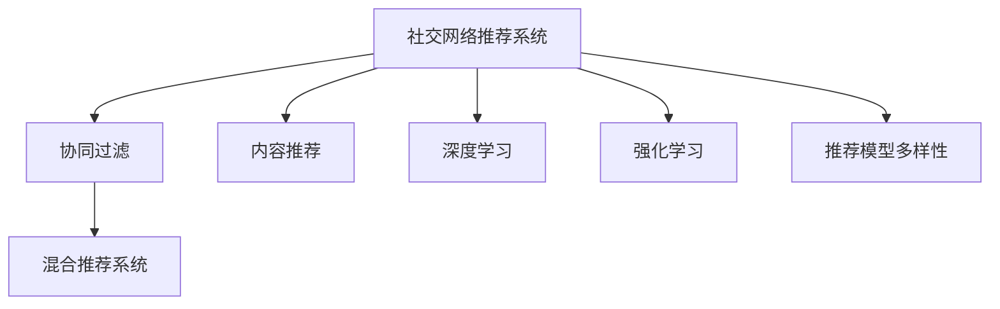

                 

# 社交网络推荐系统的进步：连接用户兴趣

## 1. 背景介绍

### 1.1 问题由来
随着互联网的普及和社交媒体的兴起，社交网络已成为人们交流和获取信息的重要平台。然而，在信息爆炸的时代，用户在海量内容中筛选和发现感兴趣的信息变得越来越困难。推荐系统通过分析用户的历史行为和兴趣，智能地为用户推送个性化内容，极大地提升了用户体验。

### 1.2 问题核心关键点
社交网络推荐系统的核心在于理解用户的兴趣和行为，构建用户与内容之间的关联关系，从而实现精准推荐。早期的推荐系统往往基于简单的统计方法和协同过滤算法，如基于项目的协同过滤、基于用户的协同过滤等，但这些方法存在数据稀疏性、冷启动问题等局限性。

### 1.3 问题研究意义
通过提升社交网络推荐系统的准确性和多样性，能够有效提升用户的满意度和参与度，促进内容创作者与用户之间的互动，增强平台的活跃度和粘性。此外，推荐系统还能发现和推广高质量内容，避免低质量信息的泛滥，提升整个网络的信息质量和内容生态。

## 2. 核心概念与联系

### 2.1 核心概念概述

为更好地理解社交网络推荐系统的进步，本节将介绍几个密切相关的核心概念：

- 社交网络推荐系统：通过分析用户社交关系和历史行为，为用户推荐个性化内容的技术系统。
- 协同过滤(Collaborative Filtering)：基于用户历史行为和项目特征，预测用户对未接触过内容的偏好。
- 内容推荐(Content-Based Filtering)：通过分析用户兴趣特征和内容属性，推荐与用户兴趣匹配度高的内容。
- 混合推荐系统(Hybrid Recommender System)：结合协同过滤和内容推荐，实现优势互补，提升推荐精度。
- 深度学习(DL)：使用神经网络模型对用户兴趣和内容特征进行深度表示学习，提高推荐效果。
- 强化学习(RL)：通过用户行为反馈进行优化，动态调整推荐策略，提升推荐系统的实时性和自适应性。
- 推荐模型的多样性：包括基于矩阵分解、序列模型、图神经网络等多种算法，满足不同应用场景的需求。

这些核心概念之间的逻辑关系可以通过以下Mermaid流程图来展示：



这个流程图展示社交网络推荐系统的核心概念及其之间的关系：

1. 社交网络推荐系统通过协同过滤、内容推荐、深度学习、强化学习等技术手段，构建用户与内容之间的关联关系。
2. 深度学习在协同过滤和内容推荐中，通过神经网络对用户兴趣和内容属性进行深度表示学习，提高推荐精度。
3. 强化学习通过实时反馈，动态调整推荐策略，提升推荐系统的自适应性。
4. 推荐模型多样性通过多种算法的组合，实现优势互补，满足不同应用场景的需求。

这些概念共同构成了社交网络推荐系统的技术框架，使得推荐系统能够更精确地理解用户兴趣，更高效地推荐个性化内容。

## 3. 核心算法原理 & 具体操作步骤
### 3.1 算法原理概述

社交网络推荐系统的基本原理是通过分析用户历史行为和社交关系，预测用户对未接触过内容的兴趣，从而进行个性化推荐。其核心思想包括：

- 构建用户-内容关联矩阵，通过协同过滤算法预测用户对内容的兴趣。
- 提取用户和内容的特征表示，通过内容推荐算法找到与用户兴趣匹配的内容。
- 结合深度学习和强化学习，对用户和内容进行联合建模，提升推荐精度和实时性。

推荐系统通常由用户数据采集、数据预处理、特征提取、模型训练、推荐生成等多个模块构成。其中，用户兴趣建模和内容推荐策略设计是核心环节。

### 3.2 算法步骤详解

社交网络推荐系统一般包括以下几个关键步骤：

**Step 1: 数据收集与预处理**
- 收集用户历史行为数据，如浏览、点击、评分等，构建用户-项目关联矩阵。
- 清洗和标准化数据，处理缺失值和异常值。
- 进行用户画像构建，提取用户的兴趣特征和社交关系特征。

**Step 2: 特征工程**
- 对用户和内容进行特征提取，如用户ID、兴趣标签、内容ID、类别标签等。
- 应用向量化技术，将文本、图像等非结构化数据转化为数值特征。
- 引入用户-用户、内容-内容的关联特征，构建稠密特征矩阵。

**Step 3: 模型训练**
- 选择协同过滤、深度学习、强化学习等算法进行模型训练。
- 根据验证集性能，调整模型参数和训练策略，如正则化、学习率、采样方式等。
- 进行模型评估，选择合适的评估指标，如均方误差、准确率、召回率等。

**Step 4: 推荐生成**
- 根据模型预测结果，为用户生成个性化推荐列表。
- 将推荐结果排序，提升推荐多样性和时效性。
- 采用A/B测试等方法，评估推荐策略的效果。

**Step 5: 系统迭代与优化**
- 定期更新模型参数和特征，保持推荐系统的实时性。
- 引入冷启动策略，处理新用户和新内容。
- 应用异常检测和故障恢复机制，提升系统稳定性和鲁棒性。

以上是社交网络推荐系统的一般流程。在实际应用中，还需要根据具体业务需求，对各个环节进行优化和改进。

### 3.3 算法优缺点

社交网络推荐系统具有以下优点：
1. 个性化推荐：能够根据用户历史行为和兴趣，提供高度个性化的内容推荐，提升用户体验。
2. 实时更新：能够实时捕捉用户行为变化，动态调整推荐内容，保持内容的时效性和相关性。
3. 多样化内容：能够推荐不同类型的内容，满足用户多样化的信息需求。
4. 用户画像：能够构建详细的用户画像，了解用户兴趣和行为模式，实现精准营销。

同时，该方法也存在一定的局限性：
1. 数据稀疏性：用户历史行为数据往往稀疏，难以覆盖所有用户行为，影响推荐精度。
2. 冷启动问题：对于新用户和新内容，缺乏足够的数据进行推荐，需引入冷启动策略。
3. 推荐多样性：容易陷入“过滤泡沫”，推荐内容单一化，影响用户探索新内容的能力。
4. 用户隐私：在数据收集和存储过程中，用户隐私和数据安全需得到充分保护。
5. 算力消耗：高维特征和大规模数据集的处理，需要大量计算资源，影响系统响应速度。

尽管存在这些局限性，但社交网络推荐系统通过不断改进和优化，已经成为了互联网和社交媒体平台不可或缺的核心功能，为用户提供了巨大的便利和价值。

### 3.4 算法应用领域

社交网络推荐系统在多个领域得到了广泛应用，例如：

- 社交媒体平台：如微博、微信、抖音等，为用户推荐新闻、视频、文章等内容，提升平台活跃度和粘性。
- 电子商务平台：如淘宝、京东等，为用户推荐商品、评价、用户评论等信息，提升购物体验。
- 新闻媒体平台：如今日头条、网易新闻等，为用户推荐新闻、文章、视频等内容，增加用户停留时间。
- 视频流媒体平台：如腾讯视频、爱奇艺等，为用户推荐视频、电影、电视剧等内容，提升用户观看时长。
- 在线教育平台：如Coursera、edX等，为用户推荐课程、讲座、论坛帖子等信息，促进知识分享。

除了上述这些经典应用外，社交网络推荐系统还被创新性地应用于个性化游戏推荐、精准广告投放、智能家居控制等多个场景中，为用户的日常生活和工作带来了新的便利和效率。

## 4. 数学模型和公式 & 详细讲解 & 举例说明
### 4.1 数学模型构建

社交网络推荐系统的数学模型主要包括以下几个关键部分：

1. 用户-项目关联矩阵 $R$：表示用户 $u$ 对项目 $i$ 的评分或行为记录。其中 $R_{ui} = r_{ui}$ 表示用户 $u$ 对项目 $i$ 的评分或行为记录。
2. 用户特征矩阵 $U$：表示用户 $u$ 的兴趣特征，如兴趣标签、社交关系等。其中 $U_{ui} = x_{ui}$ 表示用户 $u$ 的第 $i$ 个兴趣特征。
3. 项目特征矩阵 $V$：表示项目 $i$ 的属性特征，如类别标签、描述、标签等。其中 $V_{ui} = y_{ui}$ 表示项目 $i$ 的第 $u$ 个属性特征。
4. 用户兴趣和项目属性之间的关系 $W$：表示用户兴趣和项目属性之间的关联权重，如 $W_{ui} = w_{ui}$。

基于上述模型，社交网络推荐系统的优化目标为最大化用户对推荐结果的满意度，通常使用均方误差作为损失函数：

$$
\min_{R, U, V, W} \sum_{u \in U} \sum_{i \in V} \sum_{j \in I} (R_{ui} - f_{u}(i;U,V,W))^2
$$

其中 $f_{u}(i;U,V,W)$ 表示用户 $u$ 对项目 $i$ 的兴趣预测值，通常通过协同过滤、深度学习等算法得到。

### 4.2 公式推导过程

以下我们以协同过滤算法中的矩阵分解为例，推导其优化目标和最小二乘法求解过程。

假设用户 $u$ 对项目 $i$ 的评分 $r_{ui}$ 可表示为：

$$
r_{ui} = \hat{r}_{ui} + \epsilon_{ui}
$$

其中 $\hat{r}_{ui}$ 表示用户 $u$ 对项目 $i$ 的预测评分，$\epsilon_{ui}$ 表示评分误差。

通过矩阵分解，将用户和项目的特征矩阵 $U$ 和 $V$ 分解为低秩矩阵 $U_{L} \in \mathbb{R}^{m \times k}$ 和 $V_{L} \in \mathbb{R}^{n \times k}$，其中 $k$ 表示隐向量维度。则有：

$$
U = U_{L} \times D_{u}, \quad V = V_{L} \times D_{i}
$$

其中 $D_{u} \in \mathbb{R}^{k \times 1}$ 和 $D_{i} \in \mathbb{R}^{k \times 1}$ 分别为用户和项目的隐向量。则有：

$$
r_{ui} = \sum_{k=1}^{K} U_{Luk} \times V_{Lki}
$$

最小二乘法求解目标为：

$$
\min_{U_{L}, V_{L}, D_{u}, D_{i}} \sum_{u \in U} \sum_{i \in V} \sum_{j \in I} (r_{ui} - \sum_{k=1}^{K} U_{Luk} \times V_{Lki})^2
$$

通过矩阵分解，将原始矩阵 $R$ 转化为低秩矩阵 $U_{L}$ 和 $V_{L}$，可以更好地捕捉用户和项目的局部特征，提升推荐精度。

### 4.3 案例分析与讲解

下面我们以深度学习在推荐系统中的应用为例，给出详细案例分析。

假设一个电商推荐系统，需要为用户推荐商品。该系统收集了用户的历史购物数据、商品的属性信息、用户和商品之间的评分数据。用户 $u$ 对商品 $i$ 的评分 $r_{ui}$ 可表示为：

$$
r_{ui} = \hat{r}_{ui} + \epsilon_{ui}
$$

其中 $\hat{r}_{ui}$ 表示用户 $u$ 对商品 $i$ 的预测评分，$\epsilon_{ui}$ 表示评分误差。

通过深度学习模型，将用户特征 $x_{ui}$ 和商品特征 $y_{ui}$ 映射为高维特征表示，通过神经网络对用户和商品之间的关系进行建模：

$$
\hat{r}_{ui} = \sum_{j=1}^{M} w_{uj} \times x_{uj} \times h_j(x_{ui}, y_{ui})
$$

其中 $w_{uj}$ 表示用户 $u$ 对特征 $j$ 的权重，$h_j(x_{ui}, y_{ui})$ 表示神经网络对特征 $j$ 的隐表示。

通过上述模型，可以动态调整用户和商品的特征权重，提升推荐精度。在实际应用中，可以采用如深度矩阵分解、神经协同过滤等算法，结合深度学习技术，实现更加复杂的推荐策略。

## 5. 项目实践：代码实例和详细解释说明
### 5.1 开发环境搭建

在进行社交网络推荐系统开发前，我们需要准备好开发环境。以下是使用Python进行TensorFlow开发的环境配置流程：

1. 安装Anaconda：从官网下载并安装Anaconda，用于创建独立的Python环境。

2. 创建并激活虚拟环境：
```bash
conda create -n tf-env python=3.8 
conda activate tf-env
```

3. 安装TensorFlow：根据CUDA版本，从官网获取对应的安装命令。例如：
```bash
pip install tensorflow-gpu==2.8
```

4. 安装Keras：
```bash
pip install keras
```

5. 安装TensorBoard：
```bash
pip install tensorboard
```

6. 安装TensorFlow Addons：
```bash
pip install tensorflow-addons
```

完成上述步骤后，即可在`tf-env`环境中开始推荐系统开发。

### 5.2 源代码详细实现

下面我们以电商推荐系统为例，给出使用TensorFlow对推荐模型进行训练的PyTorch代码实现。

首先，定义推荐模型的架构：

```python
from tensorflow.keras.layers import Input, Dense, Embedding, Flatten, concatenate, dot, dot_product
from tensorflow.keras.models import Model

user_input = Input(shape=(num_users,), name='user')
item_input = Input(shape=(num_items,), name='item')
user_vector = Embedding(num_users, embedding_dim)(user_input)
item_vector = Embedding(num_items, embedding_dim)(item_input)
user_vector = Flatten()(user_vector)
item_vector = Flatten()(item_vector)
concatenated = concatenate([user_vector, item_vector])
output = dot_product(concatenated, item_vector)
rating_prediction = Dense(1, activation='linear')(output)
```

然后，定义数据生成器：

```python
import numpy as np
from tensorflow.keras.preprocessing.sequence import pad_sequences

def data_generator(train_data, batch_size):
    while True:
        indices = np.random.permutation(train_data['uid'].shape[0])
        for i in range(0, train_data['uid'].shape[0], batch_size):
            batch_uid = indices[i:i+batch_size]
            batch_user = np.array(train_data['uid'].iloc[batch_uid])
            batch_item = np.array(train_data['iid'].iloc[batch_uid])
            batch_score = np.array(train_data['score'].iloc[batch_uid])
            batch_user = pad_sequences(batch_user, maxlen=num_users-1)
            batch_item = pad_sequences(batch_item, maxlen=num_items-1)
            yield [batch_user, batch_item], batch_score
```

接着，定义训练函数：

```python
from tensorflow.keras.optimizers import Adam
from tensorflow.keras.metrics import MeanAbsoluteError

num_epochs = 10
batch_size = 512
learning_rate = 0.001

model.compile(optimizer=Adam(learning_rate), loss='mse', metrics=[MeanAbsoluteError()])

train_generator = data_generator(train_data, batch_size)
for epoch in range(num_epochs):
    epoch_loss = []
    epoch_mae = []
    for user, item, score in train_generator:
        loss = model.loss(user, item, score)
        mae = model.metrics[0].predict(user, item, score)
        epoch_loss.append(loss.numpy().mean())
        epoch_mae.append(mae.numpy().mean())
    print('Epoch {} - Loss: {:.4f} - MAE: {:.4f}'.format(epoch+1, np.mean(epoch_loss), np.mean(epoch_mae)))
```

最后，启动训练流程：

```python
import pickle

with open('train_data.pkl', 'rb') as f:
    train_data = pickle.load(f)
    
model.fit(train_data, epochs=num_epochs, batch_size=batch_size, validation_split=0.2)
model.save('recommendation_model.h5')
```

以上就是使用TensorFlow对电商推荐模型进行训练的完整代码实现。可以看到，得益于Keras和TensorFlow的强大封装，我们可以用相对简洁的代码完成推荐模型的构建和训练。

### 5.3 代码解读与分析

让我们再详细解读一下关键代码的实现细节：

**用户和商品输入层**：
- `user_input` 和 `item_input` 表示用户和商品输入层，分别用于输入用户和商品的ID序列。
- `num_users` 和 `num_items` 表示用户和商品的总数。
- `Embedding` 层用于将用户和商品ID映射为高维特征向量。
- `Flatten` 层用于将高维特征向量扁平化为低维特征向量。

**模型结构**：
- `concatenate` 层用于将用户和商品特征向量拼接在一起。
- `dot_product` 层用于计算用户和商品特征向量之间的点积，得到预测评分。
- `Dense` 层用于输出预测评分。

**数据生成器**：
- `data_generator` 函数用于生成训练数据集，通过随机打乱数据并批量生成，提高模型训练效率。
- `pad_sequences` 函数用于对用户和商品ID进行填充，使其长度一致。

**训练函数**：
- `model.compile` 方法用于定义优化器和损失函数，并设置评估指标。
- `train_generator` 用于生成训练数据集，以便模型在训练过程中不断更新权重。
- 循环遍历数据集，计算损失和评估指标，并打印输出。

**模型保存和加载**：
- `model.save` 方法用于保存训练好的模型，便于后续使用。
- `model.load` 方法用于加载保存的模型，进行预测或继续训练。

可以看到，TensorFlow配合Keras使得推荐模型的代码实现变得简洁高效。开发者可以将更多精力放在模型改进、数据处理等高层逻辑上，而不必过多关注底层的实现细节。

当然，工业级的系统实现还需考虑更多因素，如模型的保存和部署、超参数的自动搜索、更灵活的推荐策略等。但核心的推荐范式基本与此类似。

## 6. 实际应用场景
### 6.1 电商推荐

电商推荐系统通过分析用户的购买历史、浏览记录、评分数据等，为用户推荐商品。通过深度学习模型，能够捕捉用户和商品的复杂关联关系，提升推荐精度。

在技术实现上，可以收集用户的历史行为数据，如浏览时间、点击次数、评分等，构建用户-商品关联矩阵。在此基础上，对用户和商品进行特征工程，提取高维特征表示，通过深度学习模型进行联合建模。微调后的模型能够实时捕捉用户行为变化，动态调整推荐策略，推荐个性化商品，提高用户的购物体验和平台转化率。

### 6.2 新闻推荐

新闻推荐系统通过分析用户的阅读历史、点击记录、分享行为等，为用户推荐新闻文章。通过深度学习模型，能够挖掘用户对不同类型新闻的兴趣，推荐多样化的新闻内容。

在技术实现上，可以收集用户的阅读数据，构建用户-新闻文章关联矩阵。在此基础上，对用户和新闻文章进行特征工程，提取高维特征表示，通过深度学习模型进行联合建模。微调后的模型能够实时捕捉用户行为变化，动态调整推荐策略，推荐个性化新闻内容，提高用户的阅读体验和平台粘性。

### 6.3 音乐推荐

音乐推荐系统通过分析用户的听歌历史、评分数据等，为用户推荐音乐作品。通过深度学习模型，能够挖掘用户对不同类型音乐的兴趣，推荐多样化的音乐内容。

在技术实现上，可以收集用户的听歌数据，构建用户-音乐作品关联矩阵。在此基础上，对用户和音乐作品进行特征工程，提取高维特征表示，通过深度学习模型进行联合建模。微调后的模型能够实时捕捉用户行为变化，动态调整推荐策略，推荐个性化音乐作品，提高用户的听歌体验和平台粘性。

### 6.4 未来应用展望

随着深度学习技术的发展，社交网络推荐系统将呈现出以下几个趋势：

1. 多模态推荐：融合文本、图像、视频等多种模态信息，提升推荐系统对复杂数据的理解能力。
2. 深度学习融合：通过深度学习模型，对用户和内容进行联合建模，提升推荐精度。
3. 强化学习优化：通过强化学习技术，动态调整推荐策略，提高推荐系统的实时性和自适应性。
4. 用户行为建模：通过建模用户行为，提升推荐系统的个性化和多样性。
5. 隐私保护：在数据收集和存储过程中，充分保护用户隐私，防止数据泄露和滥用。
6. 跨领域推荐：通过迁移学习、多任务学习等技术，提升推荐系统的泛化能力和适应性。

这些趋势将进一步提升社交网络推荐系统的精度和效果，为用户带来更加丰富和个性化的体验。未来，随着技术的不断进步，推荐系统将在更多领域得到应用，为用户的日常生活和工作带来新的便利和效率。

## 7. 工具和资源推荐
### 7.1 学习资源推荐

为了帮助开发者系统掌握社交网络推荐系统的理论基础和实践技巧，这里推荐一些优质的学习资源：

1. 《推荐系统原理与算法》书籍：该书系统讲解了推荐系统的基础概念、协同过滤、深度学习等多种算法，是推荐系统学习的经典教材。
2. Coursera《推荐系统》课程：由斯坦福大学开设的推荐系统课程，有Lecture视频和配套作业，涵盖推荐系统的基础理论和前沿算法。
3. Kaggle推荐系统竞赛：通过实际数据集和比赛，锻炼推荐系统建模和调优能力，提升实战水平。
4. GitHub推荐系统项目：浏览GitHub上的推荐系统开源项目，了解最佳实践和前沿技术。
5. DeepLearning.AI推荐系统教程：由DeepLearning.AI提供的推荐系统在线课程，覆盖推荐系统的基础理论和深度学习技术。

通过对这些资源的学习实践，相信你一定能够快速掌握社交网络推荐系统的精髓，并用于解决实际的推荐问题。

### 7.2 开发工具推荐

高效的开发离不开优秀的工具支持。以下是几款用于社交网络推荐系统开发的常用工具：

1. TensorFlow：由Google主导开发的开源深度学习框架，生产部署方便，适合大规模工程应用。
2. PyTorch：基于Python的开源深度学习框架，灵活动态的计算图，适合快速迭代研究。
3. Keras：深度学习高级API，能够简化模型构建和训练流程，提高开发效率。
4. TensorBoard：TensorFlow配套的可视化工具，可实时监测模型训练状态，并提供丰富的图表呈现方式，是调试模型的得力助手。
5. Weights & Biases：模型训练的实验跟踪工具，可以记录和可视化模型训练过程中的各项指标，方便对比和调优。
6. Jupyter Notebook：开源的交互式编程环境，支持多语言代码运行，便于协作开发和实时调试。

合理利用这些工具，可以显著提升社交网络推荐系统的开发效率，加快创新迭代的步伐。

### 7.3 相关论文推荐

社交网络推荐系统在多个领域得到了广泛应用，以下是几篇奠基性的相关论文，推荐阅读：

1. "Collaborative Filtering for Implicit Feedback Datasets"：提出基于隐式反馈的协同过滤算法，解决了传统协同过滤算法面临的评分稀疏性问题。
2. "Neural Collaborative Filtering"：提出深度神经网络在协同过滤中的应用，通过多层非线性映射，提升了推荐精度和泛化能力。
3. "Learning Deep Structure for Recommender Systems"：提出深度学习在推荐系统中的应用，通过模型联合训练，提高了推荐系统的复杂度和表达能力。
4. "Reinforcement Learning for Personalized Recommendation"：提出基于强化学习的推荐算法，通过实时反馈，动态调整推荐策略，提高了推荐系统的实时性和自适应性。
5. "Multi-Task Learning with Multi-Output Structured Output"：提出多任务学习在推荐系统中的应用，通过联合训练多个任务，提升了推荐系统的泛化能力和适应性。

这些论文代表了大语言模型推荐系统的发展脉络。通过学习这些前沿成果，可以帮助研究者把握学科前进方向，激发更多的创新灵感。

## 8. 总结：未来发展趋势与挑战
### 8.1 总结

本文对社交网络推荐系统的进步进行了全面系统的介绍。首先阐述了推荐系统的研究背景和意义，明确了推荐系统在提升用户体验、促进内容创作者与用户互动方面的重要价值。其次，从原理到实践，详细讲解了推荐系统的数学模型和关键算法，给出了推荐任务开发的完整代码实例。同时，本文还广泛探讨了推荐系统在电商、新闻、音乐等多个领域的应用前景，展示了推荐系统技术的广泛影响力。

通过本文的系统梳理，可以看到，社交网络推荐系统通过不断改进和优化，已经成为互联网和社交媒体平台不可或缺的核心功能，为用户提供了巨大的便利和价值。未来，随着深度学习技术的发展，推荐系统将在更多领域得到应用，为用户的日常生活和工作带来新的便利和效率。

### 8.2 未来发展趋势

展望未来，社交网络推荐系统将呈现出以下几个发展趋势：

1. 多模态推荐：融合文本、图像、视频等多种模态信息，提升推荐系统对复杂数据的理解能力。
2. 深度学习融合：通过深度学习模型，对用户和内容进行联合建模，提升推荐精度。
3. 强化学习优化：通过强化学习技术，动态调整推荐策略，提高推荐系统的实时性和自适应性。
4. 用户行为建模：通过建模用户行为，提升推荐系统的个性化和多样性。
5. 隐私保护：在数据收集和存储过程中，充分保护用户隐私，防止数据泄露和滥用。
6. 跨领域推荐：通过迁移学习、多任务学习等技术，提升推荐系统的泛化能力和适应性。

这些趋势将进一步提升社交网络推荐系统的精度和效果，为用户带来更加丰富和个性化的体验。未来，随着技术的不断进步，推荐系统将在更多领域得到应用，为用户的日常生活和工作带来新的便利和效率。

### 8.3 面临的挑战

尽管社交网络推荐系统已经取得了显著进展，但在迈向更加智能化、普适化应用的过程中，仍面临诸多挑战：

1. 数据稀疏性：用户行为数据往往稀疏，难以覆盖所有用户行为，影响推荐精度。
2. 冷启动问题：对于新用户和新内容，缺乏足够的数据进行推荐，需引入冷启动策略。
3. 推荐多样性：容易陷入“过滤泡沫”，推荐内容单一化，影响用户探索新内容的能力。
4. 用户隐私：在数据收集和存储过程中，用户隐私和数据安全需得到充分保护。
5. 算力消耗：高维特征和大规模数据集的处理，需要大量计算资源，影响系统响应速度。
6. 模型泛化性：模型在面对新数据时，容易发生泛化失效，影响推荐效果。

尽管存在这些挑战，但推荐系统的研究者和开发者正在不断探索新的解决方案，通过引入深度学习、强化学习等前沿技术，提升推荐系统的精度和效果。相信随着技术的不断进步，这些挑战终将一一被克服，社交网络推荐系统必将在构建人机协同的智能时代中扮演越来越重要的角色。

### 8.4 研究展望

面向未来，社交网络推荐系统的研究应在以下几个方向寻求新的突破：

1. 多模态推荐：融合文本、图像、视频等多种模态信息，提升推荐系统对复杂数据的理解能力。
2. 深度学习融合：通过深度学习模型，对用户和内容进行联合建模，提升推荐精度。
3. 强化学习优化：通过强化学习技术，动态调整推荐策略，提高推荐系统的实时性和自适应性。
4. 用户行为建模：通过建模用户行为，提升推荐系统的个性化和多样性。
5. 隐私保护：在数据收集和存储过程中，充分保护用户隐私，防止数据泄露和滥用。
6. 跨领域推荐：通过迁移学习、多任务学习等技术，提升推荐系统的泛化能力和适应性。

这些研究方向的探索，必将引领社交网络推荐系统技术迈向更高的台阶，为构建安全、可靠、可解释、可控的智能系统铺平道路。面向未来，社交网络推荐系统还需要与其他人工智能技术进行更深入的融合，如知识表示、因果推理、强化学习等，多路径协同发力，共同推动自然语言理解和智能交互系统的进步。只有勇于创新、敢于突破，才能不断拓展推荐系统的边界，让智能技术更好地造福人类社会。

## 9. 附录：常见问题与解答

**Q1：推荐系统如何避免过拟合问题？**

A: 过拟合是推荐系统面临的主要挑战，尤其是在数据稀疏的情况下。常见的缓解策略包括：
1. 数据增强：通过回译、近义替换等方式扩充训练集。
2. 正则化：使用L2正则、Dropout等避免过拟合。
3. 对抗训练：引入对抗样本，提高模型鲁棒性。
4. 参数高效微调：只调整少量参数，减小过拟合风险。
5. 多模型集成：训练多个推荐模型，取平均输出，抑制过拟合。

这些策略往往需要根据具体任务和数据特点进行灵活组合。只有在数据、模型、训练、推理等各环节进行全面优化，才能最大限度地发挥推荐系统的威力。

**Q2：推荐系统如何处理冷启动问题？**

A: 冷启动问题是指对于新用户和新内容，缺乏足够的数据进行推荐。常见的冷启动策略包括：
1. 基于内容的推荐：通过分析内容属性和特征，推荐与用户兴趣匹配的内容。
2. 基于相似性的推荐：通过用户相似度或内容相似度，推荐与新用户或新内容相似的内容。
3. 基于流行度的推荐：通过分析热门内容或热门用户，推荐受欢迎的内容。
4. 基于用户生成内容的推荐：通过用户生成的内容，推荐与用户兴趣匹配的内容。

这些策略可以灵活组合，根据具体业务场景进行选择。同时，引入深度学习、强化学习等前沿技术，也能有效缓解冷启动问题。

**Q3：推荐系统如何提升推荐多样性？**

A: 推荐系统容易陷入“过滤泡沫”，推荐内容单一化，影响用户探索新内容的能力。提升推荐多样性的策略包括：
1. 多样性损失：在损失函数中加入多样性约束，鼓励推荐多种内容。
2. 多样性惩罚：对推荐内容进行多样性惩罚，避免重复推荐。
3. 多样性选择：通过采样或排序，选择多样性高的推荐结果。
4. 多样性模型：采用多样性推荐模型，如多样性感知矩阵分解、多样性感知神经协同过滤等。

这些策略可以在推荐系统设计阶段进行优化，也可以在模型训练和评估阶段进行调整。

**Q4：推荐系统如何保护用户隐私？**

A: 在数据收集和存储过程中，用户隐私和数据安全需得到充分保护。常见的隐私保护策略包括：
1. 数据匿名化：对用户数据进行匿名化处理，防止数据泄露。
2. 数据加密：对数据进行加密存储，防止数据被非法访问。
3. 差分隐私：在数据处理和分析中引入差分隐私技术，保护用户隐私。
4. 用户控制：让用户能够控制自己的数据使用范围和频率，增强用户信任。
5. 数据审计：对数据处理和使用过程进行审计，确保数据安全合规。

这些策略需要结合具体业务场景进行设计，并在系统设计阶段充分考虑隐私保护。

**Q5：推荐系统如何优化模型性能？**

A: 推荐系统需要优化模型性能，提升推荐精度和效率。常见的优化策略包括：
1. 特征工程：通过特征提取和工程，提升模型表达能力。
2. 模型调参：通过超参数调优，选择最优模型参数。
3. 模型压缩：通过剪枝、量化等技术，优化模型大小和计算效率。
4. 模型融合：通过模型融合和集成，提升推荐精度和鲁棒性。
5. 模型复用：通过复用已训练好的模型，减少重复训练。

这些策略需要结合具体业务场景进行设计，并在系统优化阶段不断迭代和改进。

总之，社交网络推荐系统通过不断改进和优化，已经成为了互联网和社交媒体平台不可或缺的核心功能，为用户提供了巨大的便利和价值。未来，随着深度学习技术的发展，推荐系统将在更多领域得到应用，为用户的日常生活和工作带来新的便利和效率。

