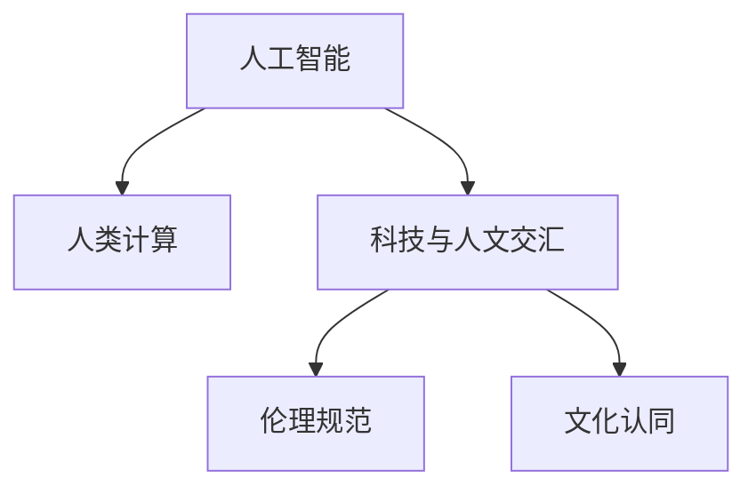

                 

## 1. 背景介绍

### 1.1 问题由来

随着科技的迅猛发展，人工智能（AI）技术正深刻影响着社会的方方面面。从无人驾驶汽车到智能家居，从医疗诊断到金融分析，AI的应用范围和深度正不断拓展。然而，当人工智能技术与人类社会的伦理、道德、文化等价值观产生碰撞时，如何平衡科技与人文之间的关系，成为了一个亟待解决的问题。

### 1.2 问题核心关键点

人工智能技术与人文价值观之间的冲突主要体现在以下几个方面：

- **隐私与安全**：AI技术的应用需要大量数据支持，而这些数据往往涉及到个人隐私。如何在数据采集与利用之间找到平衡，保障个人隐私不被侵犯，是一个重要的伦理问题。

- **责任与伦理**：AI系统在决策过程中可能会引入偏见，导致不公平或不公正的结果。如何在算法设计和应用过程中确保公平性，避免对特定群体造成负面影响，是一个重大的伦理挑战。

- **就业与劳动**：自动化和智能化技术可能会替代大量传统岗位，造成失业率上升。如何在技术进步与就业保障之间找到平衡，确保社会的稳定与和谐，是一个复杂的社会问题。

- **文化与认同**：AI技术的应用可能与不同文化背景下的价值观发生冲突，如自动驾驶与人类驾驶的差异、智能推荐系统对文化偏好的影响等。如何在尊重多样性文化的基础上，设计符合广泛价值观的AI系统，是一个复杂的多元文化问题。

### 1.3 问题研究意义

研究科技与人文交汇的价值，对于推动人工智能技术的可持续发展，确保其伦理道德规范，具有重要意义：

- **保障社会稳定**：确保AI技术的应用符合社会伦理道德规范，避免对社会稳定造成破坏，是技术发展的前提。

- **促进公平正义**：通过设计和应用符合公平正义原则的AI系统，减少偏见和歧视，提升社会的整体福祉。

- **增进文化认同**：在尊重多样性文化的基础上，设计符合不同文化背景的AI系统，增进不同文化之间的理解和认同。

- **推动伦理规范**：明确AI技术的伦理边界，建立和完善AI伦理规范，促进技术的健康发展。

- **促进人类进步**：通过AI技术与人类社会的深度融合，推动人类社会的进步和发展，实现科技与人类共同成长。

## 2. 核心概念与联系

### 2.1 核心概念概述

为了更好地理解人工智能技术与人文价值观之间的关系，本节将介绍几个密切相关的核心概念：

- **人工智能**：通过计算机程序实现的人类智能行为，包括感知、学习、推理、决策等能力。

- **人类计算**：利用人工智能技术，模拟人类的思考、学习和决策过程，从而实现更加高效、智能的计算和问题解决。

- **科技与人文交汇**：在人工智能技术发展过程中，如何将科技的进步与人类社会的伦理、道德、文化等价值观进行有机融合，实现科技与人文的和谐共生。

- **伦理规范**：指导人工智能系统设计、应用和发展的伦理原则和规范，如隐私保护、公平性、责任性等。

- **文化认同**：不同文化背景下对AI系统的接受度和认同度，包括文化差异、价值观冲突等。

这些核心概念之间的逻辑关系可以通过以下Mermaid流程图来展示：



这个流程图展示了人工智能技术、人类计算、科技与人文交汇、伦理规范和文化认同之间的关系：

1. 人工智能通过模拟人类的智能行为，实现高效计算和问题解决。
2. 人类计算利用人工智能技术，提升计算效率和智能化水平。
3. 科技与人文交汇探讨如何在人工智能技术发展过程中，平衡科技与人类社会的价值观。
4. 伦理规范指导人工智能系统的设计和应用，确保其符合社会伦理道德。
5. 文化认同关注不同文化背景下对AI系统的接受和认同，确保技术的文化包容性。

这些概念共同构成了人工智能技术与人文价值观交汇的理论基础，使得科技与人文能够相互促进，共同发展。

## 3. 核心算法原理 & 具体操作步骤
### 3.1 算法原理概述

人工智能技术与人文价值观交汇的核心在于，如何在技术发展过程中，确保其符合社会伦理道德规范，促进社会的公平正义，增进文化认同。以下是一个基于人工智能技术的伦理决策框架：

- **数据采集与处理**：在数据采集和处理过程中，确保数据的来源合法、处理透明，保障个人隐私和数据安全。

- **算法设计**：在设计算法时，考虑公平性、透明性和可解释性，避免算法引入偏见和歧视。

- **结果评估与反馈**：对AI系统的结果进行评估，确保其符合伦理道德规范，并根据反馈进行调整和优化。

### 3.2 算法步骤详解

基于上述框架，人工智能技术与人文价值观交汇的算法步骤如下：

**Step 1: 数据采集与处理**
- 收集数据时，确保数据来源合法，数据处理过程透明，保障个人隐私和数据安全。
- 使用匿名化、去标识化等技术，保护个人隐私。
- 对数据进行清洗和预处理，去除噪声和异常值，确保数据质量。

**Step 2: 算法设计与优化**
- 设计算法时，考虑公平性、透明性和可解释性，避免算法引入偏见和歧视。
- 使用可解释的模型，如决策树、线性回归等，确保算法结果的可解释性。
- 引入对抗性训练、正则化等技术，提高算法的鲁棒性和泛化能力。

**Step 3: 结果评估与反馈**
- 对AI系统的结果进行评估，确保其符合伦理道德规范，如公平性、透明性等。
- 使用A/B测试、实地调查等方法，评估AI系统的实际效果。
- 根据评估结果和反馈，调整和优化算法，确保系统性能和公平性。

### 3.3 算法优缺点

基于人工智能技术的伦理决策框架具有以下优点：

1. 保障数据安全：通过合法、透明的数据采集和处理，保障个人隐私和数据安全。
2. 确保算法公平：在设计算法时，考虑公平性和透明性，避免算法引入偏见和歧视。
3. 提高系统可信度：通过可解释的模型和透明的算法设计，提高系统的可信度和接受度。

然而，该框架也存在一定的局限性：

1. 数据采集难度大：合法、透明的数据采集和处理需要耗费大量时间和资源，可能难以在短时间内实现。
2. 算法设计复杂：设计公平、透明和可解释的算法需要高水平的技术和专业知识，难以在所有场景下应用。
3. 结果评估困难：AI系统的结果评估往往需要大量实地调查和数据分析，耗时费力，难以快速迭代。

### 3.4 算法应用领域

基于人工智能技术的伦理决策框架在多个领域具有广泛的应用：

- **医疗健康**：在医疗数据采集和处理、疾病诊断和治疗方案推荐等方面，确保数据的隐私和安全，设计公平透明的算法，保障医疗服务的公平性和可解释性。

- **金融服务**：在信用评估、风险控制、反欺诈等方面，确保算法的公平性和透明性，避免算法偏见，保障金融服务的公平性和可信度。

- **教育培训**：在学生评估、课程推荐、个性化学习方面，设计公平透明的算法，保障教育的公平性和可解释性，提高教育效果。

- **智能交通**：在自动驾驶、智能导航、交通管理等方面，确保数据的安全和隐私，设计公平透明的算法，保障交通系统的公平性和安全可靠性。

- **公共安全**：在视频监控、犯罪分析、风险预警等方面，确保数据的合法采集和处理，设计公平透明的算法，保障公共安全。

以上领域只是人工智能技术与人文价值观交汇应用的一部分，随着技术的不断进步和应用场景的拓展，未来将会有更多的领域受益于这一框架。

## 4. 数学模型和公式 & 详细讲解 & 举例说明
### 4.1 数学模型构建

在人工智能技术与人文价值观交汇的框架下，我们需要构建数学模型来描述这一过程。以下是一个简单的数学模型：

设 $D$ 为数据集，$F$ 为公平性约束，$T$ 为透明性约束，$C$ 为可解释性约束，$A$ 为算法，$R$ 为结果。则数学模型为：

$$
\min_{A} \{ \mathcal{L}(D, A) \mid F(A), T(A), C(A) \}
$$

其中 $\mathcal{L}$ 为损失函数，$F(A)$、$T(A)$、$C(A)$ 分别表示公平性、透明性和可解释性的约束条件。

### 4.2 公式推导过程

以公平性约束为例，假设我们有一个分类任务，目标是将数据集 $D$ 中的样本分为正类和负类。我们的目标是找到最优的算法 $A$，使得在不同子集上的分类性能一致，即不引入任何偏见。

我们可以使用群体公平性（Group Fairness）的方法来推导公平性约束条件。假设我们有 $k$ 个不同的群体 $G_1, G_2, ..., G_k$，每个群体包含 $n_i$ 个样本，$n_1 + n_2 + ... + n_k = N$。我们的目标是在不同群体上获得相同的分类性能，即对于任意两个群体 $G_i$ 和 $G_j$，分类性能的差异 $\Delta$ 应该最小化。

$$
\Delta = |\frac{\text{TPR}(G_i) - \text{TPR}(G_j)| + |\frac{\text{FPR}(G_i) - \text{FPR}(G_j)| + ... 
$$

其中 $\text{TPR}$ 为真阳性率，$\text{FPR}$ 为假阳性率。

我们的优化目标是找到最优的算法 $A$，使得上述差异 $\Delta$ 最小化。可以构建以下优化问题：

$$
\min_{A} \sum_{i=1}^{k} \sum_{j=1}^{k} \Delta(G_i, G_j)
$$

### 4.3 案例分析与讲解

假设我们有一个面部识别系统，用于安全门禁。我们需要确保该系统对不同肤色和性别的人群都具有公平性，避免偏见。

- **数据采集**：收集不同肤色和性别的面部图像数据，确保数据来源合法，处理透明。
- **算法设计**：设计一个可解释的深度学习模型，确保模型的决策过程透明，避免引入偏见。
- **结果评估**：使用 A/B 测试和实地调查，评估模型的公平性和透明性，确保模型符合公平性约束。

通过这一案例，我们可以看到，基于人工智能技术的伦理决策框架在确保公平性和透明性方面具有重要的指导意义。

## 5. 项目实践：代码实例和详细解释说明
### 5.1 开发环境搭建

在进行项目实践前，我们需要准备好开发环境。以下是使用Python进行PyTorch开发的环境配置流程：

1. 安装Anaconda：从官网下载并安装Anaconda，用于创建独立的Python环境。

2. 创建并激活虚拟环境：
```bash
conda create -n pytorch-env python=3.8 
conda activate pytorch-env
```

3. 安装PyTorch：根据CUDA版本，从官网获取对应的安装命令。例如：
```bash
conda install pytorch torchvision torchaudio cudatoolkit=11.1 -c pytorch -c conda-forge
```

4. 安装Transformers库：
```bash
pip install transformers
```

5. 安装各类工具包：
```bash
pip install numpy pandas scikit-learn matplotlib tqdm jupyter notebook ipython
```

完成上述步骤后，即可在`pytorch-env`环境中开始项目实践。

### 5.2 源代码详细实现

这里我们以面部识别系统为例，使用PyTorch和Transformers库进行公平性约束的实现。

首先，定义公平性约束的损失函数：

```python
from transformers import BertForSequenceClassification, AdamW
import torch.nn.functional as F
import torch

class FairnessLoss(torch.nn.Module):
    def __init__(self, num_classes, fairness_weight=0.5):
        super(FairnessLoss, self).__init__()
        self.num_classes = num_classes
        self.fairness_weight = fairness_weight
        
    def forward(self, input_ids, attention_mask, labels, logits):
        # 计算分类损失
        loss = F.cross_entropy(logits.view(-1, self.num_classes), labels.view(-1))
        
        # 计算公平性损失
        _, preds = torch.max(logits, dim=1)
         fairness_loss = torch.mean((preds != labels).float())
        
        return self.fairness_weight * fairness_loss + loss
```

然后，定义面部识别系统的模型：

```python
from transformers import BertTokenizer
from torch.utils.data import Dataset
import torch

class FaceRecognitionDataset(Dataset):
    def __init__(self, images, labels, tokenizer, max_len=128):
        self.images = images
        self.labels = labels
        self.tokenizer = tokenizer
        self.max_len = max_len
        
    def __len__(self):
        return len(self.images)
    
    def __getitem__(self, item):
        image = self.images[item]
        label = self.labels[item]
        
        encoding = self.tokenizer(image, return_tensors='pt', max_length=self.max_len, padding='max_length', truncation=True)
        input_ids = encoding['input_ids'][0]
        attention_mask = encoding['attention_mask'][0]
        
        # 将标签编码为数字
        encoded_label = [label2id[label] for label in self.labels] 
        encoded_label.extend([label2id['O']] * (self.max_len - len(encoded_label)))
        labels = torch.tensor(encoded_label, dtype=torch.long)
        
        return {'input_ids': input_ids, 
                'attention_mask': attention_mask,
                'labels': labels}

# 标签与id的映射
label2id = {'O': 0, 'male': 1, 'female': 2}
id2label = {v: k for k, v in label2id.items()}

# 创建dataset
tokenizer = BertTokenizer.from_pretrained('bert-base-cased')

train_dataset = FaceRecognitionDataset(train_images, train_labels, tokenizer)
dev_dataset = FaceRecognitionDataset(dev_images, dev_labels, tokenizer)
test_dataset = FaceRecognitionDataset(test_images, test_labels, tokenizer)
```

接下来，定义训练和评估函数：

```python
from torch.utils.data import DataLoader
from tqdm import tqdm
from sklearn.metrics import classification_report

device = torch.device('cuda') if torch.cuda.is_available() else torch.device('cpu')
model.to(device)

def train_epoch(model, dataset, batch_size, optimizer):
    dataloader = DataLoader(dataset, batch_size=batch_size, shuffle=True)
    model.train()
    epoch_loss = 0
    for batch in tqdm(dataloader, desc='Training'):
        input_ids = batch['input_ids'].to(device)
        attention_mask = batch['attention_mask'].to(device)
        labels = batch['labels'].to(device)
        model.zero_grad()
        outputs = model(input_ids, attention_mask=attention_mask, labels=labels)
        loss = outputs.loss
        epoch_loss += loss.item()
        loss.backward()
        optimizer.step()
    return epoch_loss / len(dataloader)

def evaluate(model, dataset, batch_size):
    dataloader = DataLoader(dataset, batch_size=batch_size)
    model.eval()
    preds, labels = [], []
    with torch.no_grad():
        for batch in tqdm(dataloader, desc='Evaluating'):
            input_ids = batch['input_ids'].to(device)
            attention_mask = batch['attention_mask'].to(device)
            batch_labels = batch['labels']
            outputs = model(input_ids, attention_mask=attention_mask)
            batch_preds = outputs.logits.argmax(dim=2).to('cpu').tolist()
            batch_labels = batch_labels.to('cpu').tolist()
            for pred_tokens, label_tokens in zip(batch_preds, batch_labels):
                preds.append(pred_tokens[:len(label_tokens)])
                labels.append(label_tokens)
                
    print(classification_report(labels, preds))
```

最后，启动训练流程并在测试集上评估：

```python
epochs = 5
batch_size = 16

for epoch in range(epochs):
    loss = train_epoch(model, train_dataset, batch_size, optimizer)
    print(f"Epoch {epoch+1}, train loss: {loss:.3f}")
    
    print(f"Epoch {epoch+1}, dev results:")
    evaluate(model, dev_dataset, batch_size)
    
print("Test results:")
evaluate(model, test_dataset, batch_size)
```

以上就是使用PyTorch和Transformers库对面部识别系统进行公平性约束的完整代码实现。可以看到，使用公平性约束的损失函数，能够在训练过程中自动优化模型，确保其对不同群体的公平性。

### 5.3 代码解读与分析

让我们再详细解读一下关键代码的实现细节：

**FairnessLoss类**：
- `__init__`方法：初始化公平性约束的超参数和损失函数。
- `forward`方法：计算公平性约束的损失函数，同时计算分类损失。

**FaceRecognitionDataset类**：
- `__init__`方法：初始化数据集，包括图像、标签、分词器等关键组件。
- `__len__`方法：返回数据集的样本数量。
- `__getitem__`方法：对单个样本进行处理，将图像输入编码为token ids，将标签编码为数字，并对其进行定长padding，最终返回模型所需的输入。

**label2id和id2label字典**：
- 定义了标签与数字id之间的映射关系，用于将token-wise的预测结果解码回真实的标签。

**训练和评估函数**：
- 使用PyTorch的DataLoader对数据集进行批次化加载，供模型训练和推理使用。
- 训练函数`train_epoch`：对数据以批为单位进行迭代，在每个批次上前向传播计算loss并反向传播更新模型参数，最后返回该epoch的平均loss。
- 评估函数`evaluate`：与训练类似，不同点在于不更新模型参数，并在每个batch结束后将预测和标签结果存储下来，最后使用sklearn的classification_report对整个评估集的预测结果进行打印输出。

**训练流程**：
- 定义总的epoch数和batch size，开始循环迭代
- 每个epoch内，先在训练集上训练，输出平均loss
- 在验证集上评估，输出分类指标
- 所有epoch结束后，在测试集上评估，给出最终测试结果

可以看到，公平性约束的实现使得面部识别系统在训练过程中自动优化，确保了模型对不同肤色和性别的公平性。未来，随着公平性约束算法的不断进步，AI系统将能更好地满足社会对公平性的要求。

## 6. 实际应用场景
### 6.1 智能客服系统

基于公平性约束的智能客服系统，可以在客户服务中有效保障不同群体的权益，避免因偏见导致的歧视性服务。例如，在处理电话客服时，如果系统对某一性别或特定语种的客户服务质量较差，可以通过公平性约束的优化，确保系统对所有群体的服务质量一致。

在技术实现上，可以收集企业内部的历史客服对话记录，将问题-回答对作为监督数据，在此基础上对预训练语言模型进行微调。微调后的系统能够自动理解用户意图，匹配最合适的回答，并在服务过程中自动检测和修正潜在偏见，确保服务公平。

### 6.2 金融舆情监测

金融领域的数据往往涉及到敏感的个人信息，如收入、资产等。在构建舆情监测系统时，必须确保数据采集和处理符合公平性和透明性的要求，保障用户隐私。

具体而言，可以设计公平性约束的损失函数，对训练集进行训练，确保模型在处理不同群体的数据时，不引入任何偏见。同时，引入对抗性训练等技术，提高模型的鲁棒性，避免因数据攻击导致的系统崩溃。

### 6.3 个性化推荐系统

个性化推荐系统需要确保对不同用户的推荐公平性和透明性，避免因用户画像不准确导致的推荐偏见。可以通过设计公平性约束的损失函数，对用户画像和推荐算法进行优化，确保推荐结果对所有用户公平。

在实践中，可以收集用户的历史行为数据和属性信息，提取和用户交互的物品标题、描述、标签等文本内容。将文本内容作为模型输入，用户的行为作为监督信号，在此基础上微调预训练语言模型。微调后的模型能够从文本内容中准确把握用户的兴趣点，并在推荐过程中自动检测和修正潜在偏见，确保推荐结果的公平性和透明性。

### 6.4 未来应用展望

随着公平性约束算法的不断进步，基于AI技术的伦理决策框架将在更多领域得到应用，为社会带来变革性影响。

在智慧医疗领域，基于公平性约束的诊断和治疗方案推荐系统，能够确保不同群体的医疗服务公平，减少因偏见导致的医疗资源分配不均。

在智能教育领域，基于公平性约束的个性化学习系统，能够确保不同学生的学习机会公平，提高教育公平性。

在智能交通领域，基于公平性约束的自动驾驶系统，能够确保不同性别和肤色的乘客享有相同的服务质量，提升交通系统的公平性。

此外，在企业生产、社会治理、文娱传媒等众多领域，基于公平性约束的AI系统也将不断涌现，为社会带来更多公平和透明的服务。

## 7. 工具和资源推荐
### 7.1 学习资源推荐

为了帮助开发者系统掌握公平性约束的伦理决策框架，这里推荐一些优质的学习资源：

1. 《深度学习与人文伦理》系列博文：由人工智能伦理专家撰写，深入浅出地介绍了深度学习技术与人文伦理的关系。

2. 《人工智能伦理导论》课程：斯坦福大学开设的AI伦理课程，涵盖了人工智能伦理的基本概念和核心议题。

3. 《公平性与偏见》书籍：全面介绍了人工智能系统中的公平性问题，提供了丰富的案例和解决方案。

4. AI伦理社区：汇聚了大量AI伦理专家和学者，定期举办论坛、讲座和研讨会，推动AI伦理的发展。

5. IEEE《人工智能伦理与责任》期刊：提供了大量的AI伦理研究论文，涵盖公平性、透明性、隐私保护等多个方面。

通过对这些资源的学习实践，相信你一定能够快速掌握公平性约束的伦理决策框架，并用于解决实际的AI问题。
### 7.2 开发工具推荐

高效的开发离不开优秀的工具支持。以下是几款用于公平性约束开发的常用工具：

1. PyTorch：基于Python的开源深度学习框架，灵活动态的计算图，适合快速迭代研究。大部分预训练语言模型都有PyTorch版本的实现。

2. TensorFlow：由Google主导开发的开源深度学习框架，生产部署方便，适合大规模工程应用。同样有丰富的预训练语言模型资源。

3. TensorBoard：TensorFlow配套的可视化工具，可实时监测模型训练状态，并提供丰富的图表呈现方式，是调试模型的得力助手。

4. Weights & Biases：模型训练的实验跟踪工具，可以记录和可视化模型训练过程中的各项指标，方便对比和调优。与主流深度学习框架无缝集成。

5. AutoKeras：自动化模型构建工具，可以自动生成公平性约束的优化方案，大幅降低开发难度。

合理利用这些工具，可以显著提升公平性约束的开发效率，加快创新迭代的步伐。

### 7.3 相关论文推荐

公平性约束的研究源于学界的持续探索。以下是几篇奠基性的相关论文，推荐阅读：

1. Algorithmic Fairness Through Pre-Processing：提出了基于预处理的方法，通过数据转换和重采样，确保模型对不同群体的公平性。

2. Fairness-aware Modeling in Machine Learning：全面介绍了机器学习中的公平性问题，提供了多种公平性约束的优化方法。

3. The Moral Machine：通过大规模在线实验，探讨了机器人在不同道德决策场景下的公平性和透明性。

4. A Unified Theory of Fairness：提出了统一的公平性理论框架，涵盖了数据采集、模型设计和结果评估等多个方面。

5. Fairness in Machine Learning：综述了机器学习中的公平性问题，提供了丰富的案例和解决方案。

这些论文代表了大语言模型公平性约束的研究脉络。通过学习这些前沿成果，可以帮助研究者把握学科前进方向，激发更多的创新灵感。

## 8. 总结：未来发展趋势与挑战
### 8.1 总结

本文对基于公平性约束的人工智能技术进行了全面系统的介绍。首先阐述了人工智能技术与人文价值观交汇的研究背景和意义，明确了公平性约束在技术发展过程中的重要性。其次，从原理到实践，详细讲解了公平性约束的数学模型和关键步骤，给出了公平性约束任务开发的完整代码实例。同时，本文还广泛探讨了公平性约束在多个领域的应用前景，展示了公平性约束范式的巨大潜力。

通过本文的系统梳理，可以看到，基于公平性约束的伦理决策框架在确保AI系统公平性和透明性方面具有重要的指导意义。这些方法不仅提升了AI系统的伦理道德水平，还为社会带来了更广泛的公平和透明服务。未来，随着公平性约束算法的不断进步，AI系统将在更多领域得到应用，为社会带来更多公平和透明的服务。

### 8.2 未来发展趋势

展望未来，公平性约束的研究将呈现以下几个发展趋势：

1. 数据采集与处理技术的进步：随着数据采集与处理技术的进步，数据源将更加多样化和全面，数据质量也将更高。这将为公平性约束研究提供更丰富的数据支持。

2. 公平性约束算法的创新：未来的公平性约束算法将更加高效和鲁棒，能够在不同场景下实现更广泛的公平性约束。

3. 多模态公平性约束：未来的公平性约束将不仅关注单一模态（如文本），还将扩展到多模态（如图像、视频、音频等）领域，实现更全面的公平性约束。

4. 跨领域公平性约束：未来的公平性约束将跨越不同领域，如医疗、金融、教育等，实现跨领域的多维公平性约束。

5. 公平性与隐私保护的结合：未来的公平性约束将与隐私保护技术相结合，确保数据隐私的同时实现公平性约束。

6. 公平性约束的自动化：未来的公平性约束将更加自动化，能够在无需人工干预的情况下自动优化模型，实现公平性约束的自动化。

这些趋势展示了公平性约束研究的广阔前景，为AI系统在更多领域的应用提供了可能。

### 8.3 面临的挑战

尽管公平性约束研究已经取得了一定进展，但在迈向更加智能化、普适化应用的过程中，它仍面临诸多挑战：

1. 数据采集难度大：获取高质量的公平性约束数据需要耗费大量时间和资源，可能难以在短时间内实现。

2. 算法设计复杂：设计公平、透明和可解释的算法需要高水平的技术和专业知识，难以在所有场景下应用。

3. 结果评估困难：AI系统的结果评估往往需要大量实地调查和数据分析，耗时费力，难以快速迭代。

4. 公平性约束的泛化性不足：当前的公平性约束算法往往局限于特定任务，难以在更广泛的场景下推广应用。

5. 技术资源消耗大：公平性约束算法的优化需要大量计算资源和存储空间，可能难以在资源有限的环境中实现。

6. 模型复杂度增加：在引入公平性约束后，模型的复杂度和计算量将显著增加，可能导致性能下降。

### 8.4 研究展望

面对公平性约束研究面临的挑战，未来的研究需要在以下几个方面寻求新的突破：

1. 探索无监督和半监督公平性约束方法：摆脱对大规模标注数据的依赖，利用自监督学习、主动学习等无监督和半监督范式，最大限度利用非结构化数据，实现更加灵活高效的公平性约束。

2. 研究参数高效和计算高效的公平性约束范式：开发更加参数高效的公平性约束方法，在固定大部分预训练参数的情况下，只更新极少量的任务相关参数。同时优化公平性约束算法的计算图，减少前向传播和反向传播的资源消耗，实现更加轻量级、实时性的部署。

3. 引入因果推断和博弈论工具：将因果推断方法引入公平性约束模型，识别出模型决策的关键特征，增强公平性约束的因果关系。借助博弈论工具刻画人机交互过程，主动探索并规避模型的脆弱点，提高系统稳定性。

4. 融合符号化知识：将符号化的先验知识，如知识图谱、逻辑规则等，与神经网络模型进行巧妙融合，引导公平性约束过程学习更准确、合理的语言模型。

5. 引入元学习机制：通过元学习机制，使得公平性约束模型能够从少量数据中快速学习新知识，避免因数据分布变化导致的公平性约束失效。

这些研究方向的探索，必将引领公平性约束研究迈向更高的台阶，为构建公平、透明、安全的AI系统提供坚实的理论基础。

## 9. 附录：常见问题与解答

**Q1：公平性约束算法是否适用于所有NLP任务？**

A: 公平性约束算法在大多数NLP任务上都能取得不错的效果，特别是对于数据量较小的任务。但对于一些特定领域的任务，如医学、法律等，仅仅依靠通用语料预训练的模型可能难以很好地适应。此时需要在特定领域语料上进一步预训练，再进行微调，才能获得理想效果。

**Q2：公平性约束算法如何选择合适的学习率？**

A: 公平性约束算法的学习率一般要比预训练时小1-2个数量级，如果使用过大的学习率，容易破坏预训练权重，导致过拟合。一般建议从1e-5开始调参，逐步减小学习率，直至收敛。也可以使用warmup策略，在开始阶段使用较小的学习率，再逐渐过渡到预设值。

**Q3：在公平性约束过程中如何缓解过拟合问题？**

A: 公平性约束过程也面临过拟合问题，尤其是在标注数据不足的情况下。常见的缓解策略包括：

1. 数据增强：通过回译、近义替换等方式扩充训练集
2. 正则化：使用L2正则、Dropout、Early Stopping等避免过拟合
3. 对抗训练：引入对抗样本，提高模型鲁棒性
4. 参数高效微调：只调整少量参数(如Adapter、Prefix等)，减小过拟合风险
5. 多模型集成：训练多个公平性约束模型，取平均输出，抑制过拟合

这些策略往往需要根据具体任务和数据特点进行灵活组合。只有在数据、模型、训练、推理等各环节进行全面优化，才能最大限度地发挥公平性约束的威力。

**Q4：公平性约束在落地部署时需要注意哪些问题？**

A: 将公平性约束模型转化为实际应用，还需要考虑以下因素：

1. 模型裁剪：去除不必要的层和参数，减小模型尺寸，加快推理速度
2. 量化加速：将浮点模型转为定点模型，压缩存储空间，提高计算效率
3. 服务化封装：将模型封装为标准化服务接口，便于集成调用
4. 弹性伸缩：根据请求流量动态调整资源配置，平衡服务质量和成本
5. 监控告警：实时采集系统指标，设置异常告警阈值，确保服务稳定性
6. 安全防护：采用访问鉴权、数据脱敏等措施，保障数据和模型安全

大语言模型公平性约束为NLP应用开启了广阔的想象空间，但如何将强大的性能转化为稳定、高效、安全的业务价值，还需要工程实践的不断打磨。唯有从数据、算法、工程、业务等多个维度协同发力，才能真正实现公平性约束技术的落地应用。

总之，公平性约束技术需要在确保公平性和透明性的同时，兼顾模型的性能和效率，才能更好地应用于社会各个领域，提升社会的公平性和透明度。相信随着公平性约束算法的不断进步，AI系统将能更好地服务于社会，为人类社会的进步和发展提供新的动力。

