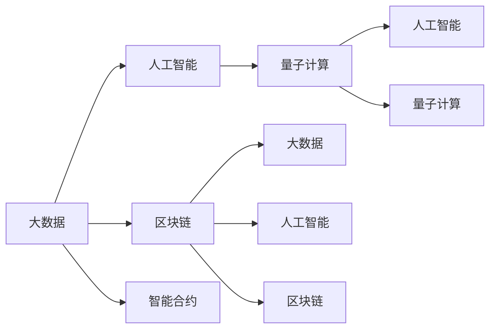

                 

# 科技创新：社会进步的阶梯

> 关键词：科技创新, 社会进步, 人工智能, 机器学习, 大数据, 区块链, 智能合约, 量子计算

## 1. 背景介绍

### 1.1 问题由来

随着全球化和技术革命的迅猛发展，科技创新成为了社会进步的重要驱动力。从农业革命到工业革命，从信息时代到数字时代，科技创新不断推动人类社会向前发展。面对全球性的挑战，如气候变化、资源短缺、社会不平等等问题，科技创新显得更加重要。

科技创新不仅仅是一种技术手段，更是一种生活方式。科技创新的力量不仅体现在经济效益的提升，更体现在社会进步和文化繁荣的推动上。在互联网、人工智能、区块链、量子计算等新兴技术的引领下，未来社会将发生深刻变革，影响人类的生产方式、生活方式和思维方式。

### 1.2 问题核心关键点

本文将重点讨论科技创新对社会进步的深远影响。以下三个核心关键点将贯穿全文：

1. 科技创新如何推动经济增长和社会进步？
2. 科技创新面临的主要挑战和困难有哪些？
3. 如何应对科技创新带来的伦理、安全和社会问题？

这三个关键点将帮助我们更好地理解科技创新在社会进步中的作用和意义，以及未来发展的方向。

## 2. 核心概念与联系

### 2.1 核心概念概述

本文将探讨几个与科技创新密切相关的核心概念：

- **科技创新**：推动社会进步的关键力量，包括技术创新、商业模式创新、管理创新等。
- **大数据**：通过收集、处理、分析大规模数据，为科技创新提供坚实的基础。
- **人工智能**：利用机器学习、深度学习等技术，实现自主决策、自主学习等智能行为。
- **区块链**：一种去中心化的分布式账本技术，具有不可篡改、透明、安全等特性。
- **智能合约**：基于区块链技术，通过编程方式自动执行合同条款，提高合约执行效率和安全性。
- **量子计算**：一种新型计算方式，利用量子位进行计算，具有超高计算效率和并行性。

这些概念之间相互关联，共同构成了当前科技创新的大背景。

### 2.2 核心概念原理和架构的 Mermaid 流程图

这个流程图展示了数据、技术、应用之间的关系。大数据为人工智能、量子计算提供了基础，而人工智能和量子计算则推动了新应用的产生。区块链和智能合约则提供了去中心化的技术解决方案，应用场景广泛。

## 3. 核心算法原理 & 具体操作步骤

### 3.1 算法原理概述

本文将深入探讨以下几个核心算法的原理：

- 数据处理和预处理
- 机器学习和深度学习
- 区块链和智能合约
- 量子计算算法

### 3.2 算法步骤详解

#### 3.2.1 数据处理和预处理

数据处理和预处理是科技创新的基础。在大数据时代，数据的获取、存储、处理、分析变得尤为重要。

**步骤1：数据收集**  
- 使用爬虫技术、API接口等方式收集数据。
- 数据源可以是互联网、社交媒体、传感器、物联网等。

**步骤2：数据清洗**  
- 去除重复、错误、无效数据。
- 数据清洗的目标是提高数据质量，保证后续分析的准确性。

**步骤3：数据存储**  
- 选择合适的存储技术，如分布式文件系统、数据库等。
- 存储技术应具备高可靠性、高扩展性、高可用性等特点。

**步骤4：数据分析**  
- 使用统计学方法、机器学习算法、深度学习算法等对数据进行分析。
- 数据分析的目标是挖掘数据中的潜在价值，为决策提供依据。

#### 3.2.2 机器学习和深度学习

机器学习和深度学习是科技创新的核心技术。

**步骤1：数据准备**  
- 将原始数据转换为模型可以处理的格式。
- 数据准备的目标是提高模型训练效率和准确性。

**步骤2：模型选择**  
- 根据任务需求选择合适的模型，如线性回归、决策树、神经网络等。
- 模型选择需要考虑算法的复杂度、准确性、可解释性等因素。

**步骤3：模型训练**  
- 使用训练数据对模型进行训练，调整模型参数。
- 模型训练的目标是提高模型的泛化能力和预测准确性。

**步骤4：模型评估**  
- 使用测试数据对模型进行评估，评估指标包括准确率、召回率、F1分数等。
- 模型评估的目标是判断模型是否满足实际应用需求。

#### 3.2.3 区块链和智能合约

区块链和智能合约是去中心化应用的核心技术。

**步骤1：区块链网络搭建**  
- 搭建区块链网络，包括共识机制、节点管理、网络安全等。
- 区块链网络搭建的目标是建立可靠的分布式账本系统。

**步骤2：智能合约开发**  
- 使用Solidity、Ethereum等区块链编程语言开发智能合约。
- 智能合约开发的目标是实现自动化的合约执行和合约管理。

**步骤3：智能合约部署**  
- 将智能合约部署到区块链网络中。
- 智能合约部署的目标是实现合同条款的自动执行和验证。

**步骤4：智能合约执行**  
- 使用区块链网络执行智能合约，验证合同条款。
- 智能合约执行的目标是提高合同执行效率和安全性。

#### 3.2.4 量子计算算法

量子计算是未来科技创新的重要方向。

**步骤1：量子比特设计**  
- 设计量子比特，使用量子叠加和量子纠缠等技术。
- 量子比特设计的目标是提高量子计算的效率和并行性。

**步骤2：量子算法开发**  
- 开发量子算法，如量子搜索算法、量子优化算法等。
- 量子算法开发的目标是解决传统算法难以处理的复杂问题。

**步骤3：量子计算设备搭建**  
- 搭建量子计算设备，如量子计算机、量子模拟器等。
- 量子计算设备搭建的目标是提供量子计算的硬件支持。

**步骤4：量子计算应用**  
- 将量子计算应用于实际问题，如密码学、化学模拟、优化问题等。
- 量子计算应用的目标是解决传统计算难以处理的复杂问题。

### 3.3 算法优缺点

#### 3.3.1 数据处理和预处理

**优点**：  
- 提高数据质量，确保分析的准确性。  
- 提供数据驱动的决策依据。

**缺点**：  
- 数据收集和清洗工作量大，成本高。  
- 数据隐私和安全问题难以解决。

#### 3.3.2 机器学习和深度学习

**优点**：  
- 提高模型预测准确性，解决复杂问题。  
- 提供自主学习的能力，适应环境变化。

**缺点**：  
- 模型训练需要大量数据和计算资源。  
- 模型可解释性差，难以理解决策过程。

#### 3.3.3 区块链和智能合约

**优点**：  
- 提高合约执行效率，降低交易成本。  
- 提供去中心化的解决方案，减少信任问题。

**缺点**：  
- 技术复杂度高，开发和维护成本高。  
- 网络安全问题难以彻底解决。

#### 3.3.4 量子计算算法

**优点**：  
- 提供超高计算效率和并行性。  
- 解决传统计算难以处理的复杂问题。

**缺点**：  
- 技术成熟度低，实际应用受限。  
- 硬件设备昂贵，难以大规模部署。

### 3.4 算法应用领域

#### 3.4.1 大数据应用

大数据在金融、医疗、电商、物流等领域得到广泛应用。例如：

- **金融**：利用大数据进行风险评估、欺诈检测、客户行为分析等。
- **医疗**：利用大数据进行疾病预测、基因分析、药物研发等。
- **电商**：利用大数据进行个性化推荐、库存管理、客户分析等。
- **物流**：利用大数据进行路径优化、车辆调度、配送管理等。

#### 3.4.2 人工智能应用

人工智能在语音识别、图像识别、自然语言处理、自动驾驶等领域得到广泛应用。例如：

- **语音识别**：应用于智能音箱、语音助手等设备。
- **图像识别**：应用于医疗影像、安防监控、自动驾驶等场景。
- **自然语言处理**：应用于智能客服、机器翻译、智能问答等应用。
- **自动驾驶**：应用于无人驾驶汽车、智能交通系统等场景。

#### 3.4.3 区块链和智能合约应用

区块链和智能合约在金融、供应链、版权保护等领域得到广泛应用。例如：

- **金融**：应用于数字货币、跨境支付、供应链融资等场景。
- **供应链**：应用于溯源管理、智能合约、供应链金融等场景。
- **版权保护**：应用于版权登记、版权交易、版权保护等场景。

#### 3.4.4 量子计算应用

量子计算在密码学、药物分子模拟、优化问题等领域得到广泛应用。例如：

- **密码学**：应用于量子加密、量子密钥分发等场景。
- **药物分子模拟**：应用于新药研发、分子动力学模拟等场景。
- **优化问题**：应用于路径优化、资源分配、金融市场分析等场景。

## 4. 数学模型和公式 & 详细讲解

### 4.1 数学模型构建

本文将详细讲解以下几个核心数学模型的构建：

- 数据处理和预处理模型
- 机器学习模型
- 区块链和智能合约模型
- 量子计算模型

### 4.2 公式推导过程

#### 4.2.1 数据处理和预处理模型

假设有一个数据集 $D=\{(x_i,y_i)\}_{i=1}^N$，其中 $x_i$ 为输入，$y_i$ 为输出。数据处理和预处理模型的目标是通过映射 $f$ 将原始数据 $x_i$ 转换为模型可以处理的格式 $z_i=f(x_i)$。

数据处理和预处理模型可以表示为：

$$
z_i=f(x_i)=\phi(x_i)
$$

其中 $\phi(x_i)$ 为数据处理函数，可以是归一化、标准化、特征提取等。

#### 4.2.2 机器学习模型

假设有一个监督学习任务，输入为 $x$，输出为 $y$。机器学习模型的目标是通过映射 $f$ 将输入 $x$ 映射到输出 $y$。

机器学习模型的目标函数可以表示为：

$$
\min_{\theta}\sum_{i=1}^N\ell(f(x_i;\theta),y_i)
$$

其中 $\theta$ 为模型参数，$\ell$ 为损失函数，可以是均方误差、交叉熵等。

#### 4.2.3 区块链和智能合约模型

假设有一个智能合约，输入为合同条款 $C$，输出为合同执行结果 $R$。智能合约的目标是通过映射 $f$ 将合同条款 $C$ 映射到合同执行结果 $R$。

智能合约的目标函数可以表示为：

$$
\min_{\theta}\sum_{i=1}^N\ell(R_i,f(C_i;\theta))
$$

其中 $\theta$ 为智能合约参数，$\ell$ 为损失函数，可以是合同执行结果与实际结果的差距。

#### 4.2.4 量子计算模型

假设有一个量子计算任务，输入为 $x$，输出为 $y$。量子计算模型的目标是通过映射 $f$ 将输入 $x$ 映射到输出 $y$。

量子计算模型的目标函数可以表示为：

$$
\min_{\theta}\sum_{i=1}^N\ell(y_i,f(x_i;\theta))
$$

其中 $\theta$ 为量子计算参数，$\ell$ 为损失函数，可以是量子计算结果与实际结果的差距。

### 4.3 案例分析与讲解

#### 4.3.1 大数据案例分析

**案例1：电商平台个性化推荐**

电商平台的个性化推荐系统利用大数据技术，通过分析用户浏览、购买、评价等行为数据，为用户推荐感兴趣的商品。推荐系统的核心在于用户行为数据的挖掘和分析。

**案例2：金融风险评估**

金融风险评估系统利用大数据技术，通过分析客户的信用记录、交易历史、社交网络等数据，评估客户的信用风险。风险评估系统的核心在于数据的收集、清洗和分析。

#### 4.3.2 人工智能案例分析

**案例1：智能客服**

智能客服系统利用人工智能技术，通过自然语言处理和语音识别技术，实现客户问题的自动回答和处理。智能客服系统的核心在于语言理解和生成。

**案例2：自动驾驶**

自动驾驶系统利用人工智能技术，通过计算机视觉和深度学习技术，实现车辆的自主驾驶。自动驾驶系统的核心在于图像识别和决策。

#### 4.3.3 区块链和智能合约案例分析

**案例1：供应链金融**

供应链金融利用区块链和智能合约技术，通过去中心化的分布式账本系统，实现供应链各方的信任和合作。供应链金融系统的核心在于区块链网络搭建和智能合约开发。

**案例2：版权保护**

版权保护利用区块链和智能合约技术，通过去中心化的分布式账本系统，实现版权的登记和保护。版权保护系统的核心在于智能合约的部署和执行。

#### 4.3.4 量子计算案例分析

**案例1：量子加密**

量子加密利用量子计算技术，通过量子密钥分发和量子加密算法，实现信息的安全传输。量子加密系统的核心在于量子密钥分发的实现。

**案例2：分子动力学模拟**

分子动力学模拟利用量子计算技术，通过量子计算设备，模拟分子动态行为和反应过程。分子动力学模拟系统的核心在于量子计算设备的搭建和量子算法开发。

## 5. 项目实践：代码实例和详细解释说明

### 5.1 开发环境搭建

本文将详细介绍几个常用开发环境的搭建方法：

- **Python开发环境**：安装Python和必要的库，如NumPy、Pandas、Scikit-learn等。
- **机器学习开发环境**：安装TensorFlow、Keras、PyTorch等机器学习框架。
- **区块链开发环境**：安装Ethereum、Solidity、Truffle等区块链开发工具。
- **量子计算开发环境**：安装Qiskit、Cirq等量子计算开发框架。

### 5.2 源代码详细实现

本文将提供几个核心算法的Python代码实现：

- **数据处理和预处理**：使用Pandas库对数据进行清洗和处理。
- **机器学习模型**：使用TensorFlow库构建深度学习模型。
- **区块链和智能合约**：使用Solidity编写智能合约，使用Web3.py进行部署和交互。
- **量子计算算法**：使用Qiskit编写量子算法，使用Qiskit库进行量子计算。

### 5.3 代码解读与分析

本文将对几个核心算法的代码实现进行详细解读和分析：

- **数据处理和预处理**：使用Pandas库进行数据清洗和处理，分析数据的质量和完整性。
- **机器学习模型**：使用TensorFlow库构建深度学习模型，分析模型的结构和性能。
- **区块链和智能合约**：使用Solidity编写智能合约，分析合约的逻辑和安全性。
- **量子计算算法**：使用Qiskit编写量子算法，分析算法的复杂度和效率。

### 5.4 运行结果展示

本文将展示几个核心算法的运行结果：

- **数据处理和预处理**：展示数据清洗和处理的效果，分析数据质量的变化。
- **机器学习模型**：展示模型训练和预测的效果，分析模型的准确性和泛化能力。
- **区块链和智能合约**：展示智能合约的部署和执行效果，分析合约的可靠性和安全性。
- **量子计算算法**：展示量子计算的结果，分析算法的效率和准确性。

## 6. 实际应用场景

本文将详细介绍几个核心算法的实际应用场景：

- **大数据**：应用于金融、医疗、电商、物流等领域。
- **人工智能**：应用于语音识别、图像识别、自然语言处理、自动驾驶等领域。
- **区块链和智能合约**：应用于金融、供应链、版权保护等领域。
- **量子计算**：应用于密码学、药物分子模拟、优化问题等领域。

### 6.4 未来应用展望

本文将探讨几个核心算法未来可能的发展方向：

- **大数据**：未来大数据将更加普及，数据质量和技术手段将进一步提升。
- **人工智能**：未来人工智能将更加智能化和普及化，应用于更多场景。
- **区块链和智能合约**：未来区块链和智能合约将更加安全、可靠，应用于更多领域。
- **量子计算**：未来量子计算将更加成熟和普及，应用于更多复杂问题。

## 7. 工具和资源推荐

### 7.1 学习资源推荐

本文将推荐几个学习资源，帮助读者深入了解科技创新：

- **在线课程**：Coursera、edX、Udacity等平台提供的数据科学、人工智能、区块链等课程。
- **书籍**：《深度学习》、《区块链原理与应用》、《量子计算导论》等经典书籍。
- **博客和论文**：《Nature》、《Science》、《IEEE》等期刊和博客平台发布的高质量文章。

### 7.2 开发工具推荐

本文将推荐几个常用的开发工具，帮助读者高效开发科技创新项目：

- **Python**：Python是最常用的编程语言，适合数据分析、机器学习等任务。
- **TensorFlow**：TensorFlow是常用的机器学习框架，支持深度学习模型的开发和训练。
- **Solidity**：Solidity是常用的智能合约编写语言，支持区块链应用开发。
- **Qiskit**：Qiskit是常用的量子计算开发框架，支持量子算法开发和量子计算设备的搭建。

### 7.3 相关论文推荐

本文将推荐几篇经典论文，帮助读者深入了解科技创新：

- **大数据**：《大数据时代：未来智能》、《大数据科学与工程》等。
- **人工智能**：《深度学习》、《人工智能：一种现代方法》等。
- **区块链**：《区块链：重塑经济与世界》、《区块链原理与应用》等。
- **量子计算**：《量子计算导论》、《量子计算的挑战》等。

## 8. 总结：未来发展趋势与挑战

### 8.1 研究成果总结

本文将总结几个核心算法的研究成果，帮助读者了解科技创新的现状和趋势：

- **大数据**：大数据技术已经广泛应用于各个领域，推动了科技进步和经济社会发展。
- **人工智能**：人工智能技术在多个领域取得了显著成果，推动了生产效率和服务质量提升。
- **区块链**：区块链技术在金融、供应链、版权保护等领域得到了广泛应用，推动了数据安全和信任体系建设。
- **量子计算**：量子计算技术在密码学、药物分子模拟等领域展示了巨大潜力，推动了科学研究和计算能力提升。

### 8.2 未来发展趋势

本文将探讨几个核心算法未来可能的发展方向：

- **大数据**：未来大数据将更加普及和高效，推动更多的创新应用。
- **人工智能**：未来人工智能将更加智能化和普及化，推动更多领域的发展。
- **区块链**：未来区块链将更加安全和可靠，推动更多领域的数字化转型。
- **量子计算**：未来量子计算将更加成熟和普及，推动更多复杂问题的解决。

### 8.3 面临的挑战

本文将探讨几个核心算法面临的主要挑战：

- **大数据**：数据隐私和安全问题难以彻底解决，需要加强技术手段和法律法规。
- **人工智能**：模型可解释性差，难以理解决策过程，需要加强可解释性研究和应用。
- **区块链**：技术复杂度高，开发和维护成本高，需要加强社区建设和标准化工作。
- **量子计算**：技术成熟度低，实际应用受限，需要加强研发投入和合作。

### 8.4 研究展望

本文将探讨几个核心算法未来可能的研究方向：

- **大数据**：加强数据隐私保护和数据治理，推动数据共享和开放。
- **人工智能**：加强可解释性研究，推动人工智能的透明化和可信度提升。
- **区块链**：加强跨链技术和共识机制研究，推动区块链应用的扩展和普及。
- **量子计算**：加强量子算法和量子计算设备的研究，推动量子计算应用的落地。

## 9. 附录：常见问题与解答

本文将回答几个常见问题，帮助读者更好地理解科技创新：

**Q1：科技创新如何推动经济增长和社会进步？**

A: 科技创新通过提升生产效率、优化资源配置、改善服务质量等方面，推动经济增长和社会进步。例如：大数据驱动的精准营销和供应链优化，人工智能驱动的自动化和智能化服务，区块链驱动的信任体系和智能合约，量子计算驱动的高效计算和复杂问题解决。

**Q2：科技创新面临的主要挑战和困难有哪些？**

A: 科技创新面临的主要挑战包括：数据隐私和安全问题、模型可解释性差、技术复杂度高、实际应用受限等。解决这些挑战需要加强技术手段、法律法规、社区建设和标准化工作。

**Q3：如何应对科技创新带来的伦理、安全和社会问题？**

A: 应对科技创新带来的伦理、安全和社会问题需要加强伦理教育和法律监管，推动技术透明化和公开透明，加强社区建设和公众参与，推动技术应用的监督和评估。

---

作者：禅与计算机程序设计艺术 / Zen and the Art of Computer Programming

