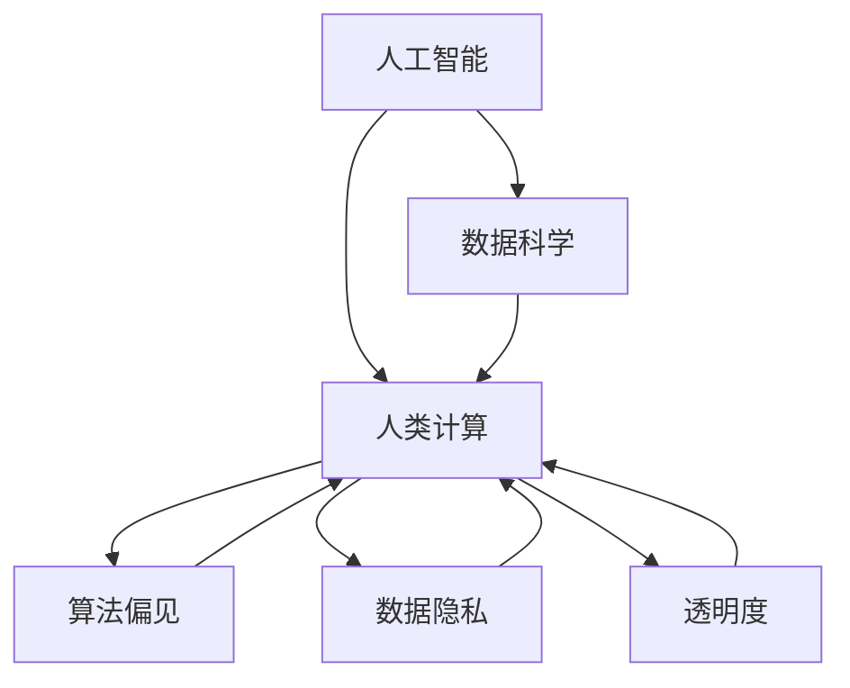

                 

# 科技向善的力量：利用人类计算造福人类

> 关键词：科技伦理, 人工智能, 计算公益, 数据驱动, 人工智能责任

## 1. 背景介绍

### 1.1 问题由来
在科技迅速发展的今天，人工智能（AI）和数据科学的应用无所不在。它们不仅改变了我们的生活和工作方式，还在各个领域展现出巨大的潜力，如医疗、教育、金融、城市管理等。然而，技术进步的双刃剑效应也日益凸显，它既带来了前所未有的便利，也带来了新的挑战和风险，包括隐私泄漏、算法偏见、决策透明度不足等问题。因此，科技公司和社会各界都开始关注并探讨如何使科技更好地服务于社会，即“科技向善”。

“科技向善”（Tech for Good）的概念最早由联合国发展计划署提出，旨在推动技术创新，解决全球社会问题，促进可持续发展。其中，利用人类计算（Human Computation）是一种将数据和人工智能技术应用于公共利益的重要方式。通过大规模数据收集和分析，人工智能算法可以在教育、医疗、环境保护等众多领域为社会带来正向影响，并解决一些传统方法难以应对的复杂问题。

### 1.2 问题核心关键点
人类计算的核心理念是将人类的认知与计算能力相结合，通过算法和数据挖掘，发现并解决问题，提升社会福祉。其主要关键点包括：
- 数据驱动：利用大规模数据进行模式识别和预测，发现趋势和关联。
- 算法创新：开发高效的算法，使数据能够转化为可操作的信息和解决方案。
- 社会责任：确保技术应用的公平性和透明性，防止算法偏见，保障个人隐私。
- 公共利益：聚焦于社会问题的解决，推动可持续发展，造福全人类。

## 2. 核心概念与联系

### 2.1 核心概念概述

为更好地理解人类计算在“科技向善”中的作用，本节将介绍几个关键概念：

- 人工智能（AI）：利用算法和计算模型模拟人类智能行为的技术，涵盖机器学习、深度学习、自然语言处理等领域。
- 数据科学：应用统计学、数据挖掘等方法分析数据，提取有用信息，指导决策。
- 人类计算（Human Computation）：结合人类认知与计算技术，利用数据和算法解决复杂社会问题，提升公共福祉。
- 算法偏见（Algorithmic Bias）：由于算法设计、数据采集等问题导致的系统性偏见，影响决策公正性。
- 数据隐私（Data Privacy）：保护个人或团体数据不被不当使用或泄露，维护数据主体的权益。
- 透明度（Transparency）：确保算法决策过程的公开透明，增强公众对技术的信任。

这些概念之间紧密相连，共同构成了“科技向善”的核心框架，旨在通过科技手段实现社会公益。

### 2.2 核心概念原理和架构的 Mermaid 流程图



该图展示了各个概念之间的关系。人工智能和数据科学是实现人类计算的基础技术，而人类计算则直接服务于社会公益。算法偏见、数据隐私和透明度是确保技术公正、透明和可信赖的关键因素。

## 3. 核心算法原理 & 具体操作步骤

### 3.1 算法原理概述

人类计算的核心算法原理主要基于数据驱动的机器学习与深度学习。其基本流程包括数据采集、预处理、模型训练、结果分析与反馈，如图3所示。


具体步骤如下：

1. **数据采集**：收集相关的数据，涵盖社会问题的各个方面，如公共健康数据、环境监测数据、教育成果数据等。
2. **数据预处理**：清洗数据，处理缺失值，提取特征，确保数据质量。
3. **模型训练**：利用机器学习或深度学习算法训练模型，识别数据中的模式和规律。
4. **结果分析**：通过模型分析数据，生成洞察，提出解决方案。
5. **反馈**：收集模型预测结果的应用效果，进行优化和改进。

### 3.2 算法步骤详解

以医疗领域为例，介绍人类计算的具体操作步骤：

1. **数据采集**：
   - 采集医院电子健康记录（EHR）、公共卫生数据、患者随访记录等。
   - 使用API获取基因组数据，整合基因信息与临床数据，分析疾病与基因表达之间的关系。

2. **数据预处理**：
   - 对EHR数据进行去标识化处理，保护患者隐私。
   - 使用标准化工具提取临床特征，如疾病史、实验室指标、用药信息等。
   - 整合来自不同来源的数据，构建综合数据库。

3. **模型训练**：
   - 使用深度学习模型（如CNN、RNN、Transformer等）处理序列数据。
   - 利用迁移学习将预训练的通用模型（如BERT、GPT-3）应用于特定任务，提升模型性能。
   - 采用集成学习结合多个模型的预测结果，提高模型鲁棒性。

4. **结果分析**：
   - 通过模型预测患者的疾病风险，识别高危人群。
   - 分析疾病的关联因素，如生活习惯、遗传背景等。
   - 预测患者的治疗效果，制定个性化治疗方案。

5. **反馈**：
   - 实时监测预测结果的应用效果，收集患者反馈。
   - 利用反馈数据调整模型参数，提升预测准确度。
   - 定期更新数据，持续优化模型。

### 3.3 算法优缺点

人类计算在提升社会福祉方面具有以下优点：
- **高效性**：自动化数据处理和模型训练，节省大量人力物力。
- **全面性**：利用大数据和深度学习技术，发现潜在问题，提供全局视角。
- **灵活性**：算法可以适应不同任务和数据类型，灵活应对多种社会问题。
- **可扩展性**：模型易于扩展，随着数据和计算资源的增加，能力逐步增强。

同时，人类计算也面临以下挑战：
- **数据隐私**：大规模数据收集和使用可能引发隐私问题，需要严格的数据保护措施。
- **算法透明**：复杂的模型决策过程难以解释，公众难以理解和信任。
- **算法偏见**：数据和模型设计可能引入偏见，影响决策公平性。
- **资源需求**：高质量数据和计算资源的高成本投入，限制了技术的应用范围。

### 3.4 算法应用领域

人类计算在多个领域展现出广泛的应用潜力，如：

- **医疗健康**：利用大数据分析，预测疾病风险，制定个性化治疗方案，优化医疗资源配置。
- **教育**：通过学习分析，评估学生学习效果，提供个性化学习路径，提升教育质量。
- **环境保护**：监测环境变化，预测自然灾害，提升环境保护措施的科学性。
- **城市管理**：分析城市数据，优化交通流量，提高公共服务效率，改善居民生活质量。
- **公共安全**：利用AI技术监测犯罪行为，预测潜在风险，提升社会治安水平。

## 4. 数学模型和公式 & 详细讲解 & 举例说明

### 4.1 数学模型构建

以预测疾病的风险为例，构建数学模型。设 $X$ 为输入数据集，$Y$ 为输出标签，模型 $f$ 为预测函数，目标是最小化损失函数 $L$，求得最优参数 $\theta$。

目标函数为：

$$
\min_\theta L(f_\theta(x), y)
$$

其中，$L$ 可以是交叉熵损失函数：

$$
L = -\frac{1}{N}\sum_{i=1}^N y_i\log(f_\theta(x_i)) + (1-y_i)\log(1-f_\theta(x_i))
$$

目标函数的梯度为：

$$
\nabla_\theta L = -\frac{1}{N}\sum_{i=1}^N \frac{y_i}{f_\theta(x_i)} - \frac{1-y_i}{1-f_\theta(x_i)} \nabla_\theta f_\theta(x_i)
$$

通过优化算法（如梯度下降）更新参数 $\theta$，得到最终模型。

### 4.2 公式推导过程

以回归问题为例，推导最小二乘法（Least Squares）的目标函数及其求解。

设 $X$ 为 $N \times d$ 的特征矩阵，$y$ 为 $N$ 维的目标向量，模型为线性回归 $y = Wx + b$。最小二乘法目标函数为：

$$
J(W) = \frac{1}{2N}\sum_{i=1}^N(y_i - Wx_i - b)^2
$$

其梯度为：

$$
\nabla_J(W) = \frac{1}{N}(X^TX)^{-1}X^T(y-XW-b)
$$

通过求解上述梯度方程，得到模型参数 $W$ 和 $b$。

### 4.3 案例分析与讲解

以股票市场预测为例，利用机器学习算法进行时间序列分析。

假设收集了股票市场的交易数据 $D = \{(x_t, y_t)\}_{t=1}^T$，其中 $x_t$ 为 $t$ 时刻的特征向量（如股票价格、交易量等），$y_t$ 为 $t$ 时刻的股票收益。利用LSTM等时间序列模型对数据进行训练，目标是最小化预测误差。

1. **数据采集**：收集历史交易数据，包括股票价格、成交量、财务数据等。
2. **数据预处理**：将时间序列数据转换为模型可处理的向量形式，进行标准化处理。
3. **模型训练**：使用LSTM模型处理序列数据，进行时间依赖性建模。
4. **结果分析**：评估模型预测性能，计算均方误差（MSE）等指标。
5. **反馈**：利用预测结果进行投资决策，收集实际收益与预测结果的对比，持续优化模型。

## 5. 项目实践：代码实例和详细解释说明

### 5.1 开发环境搭建

在进行项目实践前，需要准备好开发环境。以下是使用Python进行PyTorch开发的环境配置流程：

1. 安装Anaconda：从官网下载并安装Anaconda，用于创建独立的Python环境。
2. 创建并激活虚拟环境：
```bash
conda create -n pytorch-env python=3.8 
conda activate pytorch-env
```
3. 安装PyTorch：根据CUDA版本，从官网获取对应的安装命令。例如：
```bash
conda install pytorch torchvision torchaudio cudatoolkit=11.1 -c pytorch -c conda-forge
```
4. 安装Transformers库：
```bash
pip install transformers
```
5. 安装各类工具包：
```bash
pip install numpy pandas scikit-learn matplotlib tqdm jupyter notebook ipython
```

完成上述步骤后，即可在`pytorch-env`环境中开始项目实践。

### 5.2 源代码详细实现

以下是利用PyTorch进行股票市场预测的代码实现：

```python
import torch
import torch.nn as nn
import torch.optim as optim
from torch.utils.data import DataLoader, Dataset
import numpy as np

# 数据预处理
class StockData(Dataset):
    def __init__(self, data):
        self.data = data
        self.scaler = StandardScaler()
        self.data = self.scaler.fit_transform(self.data)

    def __len__(self):
        return len(self.data)

    def __getitem__(self, idx):
        x = torch.tensor(self.data[idx], dtype=torch.float32)
        y = torch.tensor(self.data[idx+1], dtype=torch.float32)
        return x, y

# 定义模型
class StockLSTM(nn.Module):
    def __init__(self, input_dim, hidden_dim, output_dim):
        super(StockLSTM, self).__init__()
        self.lstm = nn.LSTM(input_dim, hidden_dim, 1, batch_first=True)
        self.fc = nn.Linear(hidden_dim, output_dim)

    def forward(self, x):
        h0 = torch.zeros(1, 1, self.fc.in_features)
        c0 = torch.zeros(1, 1, self.fc.in_features)
        out, _ = self.lstm(x, (h0, c0))
        return self.fc(out[:, -1, :])

# 训练函数
def train_model(model, data_loader, device, learning_rate):
    model.train()
    optimizer = optim.Adam(model.parameters(), lr=learning_rate)
    for epoch in range(epochs):
        for x, y in data_loader:
            x = x.to(device)
            y = y.to(device)
            optimizer.zero_grad()
            y_hat = model(x)
            loss = nn.MSELoss()(y_hat, y)
            loss.backward()
            optimizer.step()
            print(f"Epoch {epoch+1}, Loss: {loss.item()}")

# 评估函数
def evaluate_model(model, data_loader, device):
    model.eval()
    correct = 0
    total = 0
    with torch.no_grad():
        for x, y in data_loader:
            x = x.to(device)
            y = y.to(device)
            y_hat = model(x)
            _, predicted = torch.max(y_hat, 1)
            total += y.size(0)
            correct += (predicted == y).sum().item()
    print(f"Accuracy: {correct/total*100}%")

# 启动训练流程
device = torch.device('cuda') if torch.cuda.is_available() else torch.device('cpu')
model = StockLSTM(10, 64, 1).to(device)
data = np.load('stock_data.npy')
dataset = StockData(data)
data_loader = DataLoader(dataset, batch_size=32, shuffle=True)
train_model(model, data_loader, device, learning_rate=0.01)
evaluate_model(model, data_loader, device)
```

### 5.3 代码解读与分析

让我们再详细解读一下关键代码的实现细节：

**StockData类**：
- `__init__`方法：初始化数据集，并使用标准化工具处理数据。
- `__len__`方法：返回数据集的样本数量。
- `__getitem__`方法：对单个样本进行处理，将数据转换为模型所需的输入格式。

**StockLSTM类**：
- `__init__`方法：定义LSTM模型的层结构，包括输入、隐藏和输出层。
- `forward`方法：定义前向传播过程，通过LSTM处理输入数据，并输出预测结果。

**train_model函数**：
- 对模型进行训练，使用Adam优化器，设定学习率。
- 遍历数据集，计算模型在每个批次上的损失，并根据梯度更新模型参数。

**evaluate_model函数**：
- 对模型进行评估，计算准确率等指标。
- 使用数据集中的所有样本进行测试，统计预测结果与真实标签的一致性。

**启动训练流程**：
- 确定模型结构，加载数据集，设定训练参数。
- 在GPU上运行模型，使用标准化的学习率进行训练。
- 在训练过程中，计算并输出模型损失，评估模型性能。

通过以上代码实现，可以明显看到PyTorch的灵活性和易用性。开发者可以基于此框架，快速构建自定义的预测模型，并在实际应用中进行优化。

## 6. 实际应用场景

### 6.1 智能医疗

在医疗领域，人类计算可以通过AI技术分析大量的临床数据，预测疾病风险，优化治疗方案，提升患者生活质量。例如，通过分析EHR数据，可以预测心脏病、癌症等慢性病的风险，提前进行干预，改善患者的长期健康状况。

### 6.2 智慧城市

智慧城市利用大数据和AI技术，提升城市管理的效率和智能化水平。例如，通过分析交通流量数据，可以优化城市交通规划，减少拥堵；通过分析环境监测数据，可以提前预测自然灾害，保护居民安全。

### 6.3 农业管理

农业领域需要实时监测作物生长情况，进行精准施肥、灌溉等管理。通过利用AI算法分析气象数据、土壤数据和作物生长数据，可以优化农业生产，提高产量和质量。

### 6.4 未来应用展望

未来，人类计算在“科技向善”方面的应用将更加广泛和深入。以下是一些可能的趋势：

1. **环境监测**：利用AI技术分析卫星数据，监测森林砍伐、海洋污染等问题，推动全球环境保护。
2. **教育个性化**：通过学习分析，评估学生的学习效果，提供个性化的学习路径和资源，提高教育质量。
3. **智能服务**：利用自然语言处理技术，开发智能客服、智能家居等，提升服务效率和用户体验。
4. **公共安全**：通过分析社交媒体数据，预测潜在社会事件，提升公共安全管理水平。
5. **科学研究**：利用AI技术分析海量科研数据，发现科学规律，推动科学研究的发展。

这些趋势展示了人类计算在“科技向善”中的巨大潜力，未来的发展将更加丰富多彩。

## 7. 工具和资源推荐

### 7.1 学习资源推荐

为了帮助开发者系统掌握人类计算的理论基础和实践技巧，这里推荐一些优质的学习资源：

1. 《机器学习实战》系列书籍：深入浅出地介绍了机器学习的基础知识，适合初学者入门。
2. Coursera《深度学习专项课程》：由斯坦福大学教授Andrew Ng讲授，涵盖深度学习的核心概念和应用。
3. 《Python数据科学手册》：介绍Python在数据科学中的应用，涵盖数据处理、机器学习等内容。
4. Kaggle平台：提供大量的数据集和比赛，帮助开发者实践AI技术，提升实际应用能力。
5. 《科技向善》（Tech for Good）在线课程：由联合国发展计划署推出的课程，探讨如何利用科技解决社会问题。

通过对这些资源的学习实践，相信你一定能够快速掌握人类计算的精髓，并用于解决实际的科技伦理问题。

### 7.2 开发工具推荐

高效的开发离不开优秀的工具支持。以下是几款用于人类计算开发的常用工具：

1. PyTorch：基于Python的开源深度学习框架，灵活动态的计算图，适合快速迭代研究。
2. TensorFlow：由Google主导开发的开源深度学习框架，生产部署方便，适合大规模工程应用。
3. Jupyter Notebook：交互式编程环境，支持代码编写、数据可视化和结果展示。
4. Weights & Biases：模型训练的实验跟踪工具，可以记录和可视化模型训练过程中的各项指标，方便对比和调优。
5. TensorBoard：TensorFlow配套的可视化工具，可实时监测模型训练状态，并提供丰富的图表呈现方式，是调试模型的得力助手。

合理利用这些工具，可以显著提升人类计算的开发效率，加快创新迭代的步伐。

### 7.3 相关论文推荐

人类计算和科技伦理的研究源于学界的持续研究。以下是几篇奠基性的相关论文，推荐阅读：

1. “Human Computation and Social Physics”（Yu et al., 2012）：探讨了人类计算在社会问题解决中的应用。
2. “Algorithms of Trust”（OReilly et al., 2019）：分析了AI系统的透明度和可信度问题。
3. “Towards a Theory of Fairness”（Rohrer et al., 2016）：讨论了AI系统中的偏见和公平性问题。
4. “Human-AI Collaboration for Health”（Zhang et al., 2021）：研究了人机协作在医疗领域的应用。
5. “Human-Centered AI”（Bolukbasi et al., 2019）：探讨了人工智能如何更好地服务于人类，提升公共福祉。

这些论文代表了大数据和AI技术在“科技向善”领域的研究进展，提供了丰富的理论支持和实际案例。

## 8. 总结：未来发展趋势与挑战

### 8.1 研究成果总结

人类计算在“科技向善”方面的研究取得了显著成果，广泛应用于医疗、教育、环境监测等多个领域。通过数据驱动和算法创新，推动了社会问题的解决，提升了公共福祉。

### 8.2 未来发展趋势

展望未来，人类计算在“科技向善”方面的应用将更加广泛和深入。以下是一些可能的趋势：

1. **多模态融合**：结合视觉、语音、文本等多模态数据，提升AI系统的感知能力和理解深度。
2. **自动化决策**：开发更加智能的决策系统，辅助医生、教师等专业人士进行决策。
3. **隐私保护**：加强数据保护措施，确保个人隐私不被不当使用或泄露。
4. **全球合作**：推动全球范围内的数据共享和协作，提升AI技术的普适性和可扩展性。
5. **伦理监管**：建立完善的伦理监管机制，确保技术应用符合人类价值观和法律规范。

### 8.3 面临的挑战

尽管人类计算在“科技向善”方面取得了一些进展，但仍面临诸多挑战：

1. **数据获取**：高质量数据的获取成本较高，数据分布不均。
2. **算法偏见**：数据和模型设计可能引入偏见，影响决策公平性。
3. **技术透明**：复杂的模型决策过程难以解释，公众难以理解和信任。
4. **资源需求**：高质量数据和计算资源的高成本投入，限制了技术的应用范围。

### 8.4 研究展望

未来需要在以下几个方面寻求新的突破：

1. **数据质量提升**：探索更多数据获取和处理方法，确保数据的高质量和多样性。
2. **模型公平性**：研究如何减少算法偏见，提高模型的公平性和透明度。
3. **技术解释**：开发可解释的AI模型，增强公众对技术的信任和理解。
4. **跨领域应用**：推动AI技术在更多垂直领域的应用，提升社会福祉。

这些研究方向的探索，必将引领人类计算在“科技向善”方面的不断进步，为构建更加公平、透明、普适的AI系统铺平道路。面向未来，人类计算需要更多跨学科的合作和创新，才能真正实现科技向善，为人类社会的可持续发展贡献力量。

## 9. 附录：常见问题与解答

**Q1：如何确保人类计算模型不引入偏见？**

A: 确保模型不引入偏见，需要从数据采集和模型设计两个环节入手。在数据采集阶段，要确保数据来源多样性，避免样本偏差；在模型设计阶段，可以使用公平性约束、对抗训练等方法，减少模型偏见。此外，建立透明的模型评估机制，定期进行偏见检测和修正，也是确保模型公正性的重要手段。

**Q2：如何保护数据隐私？**

A: 数据隐私保护需要从数据收集、存储、传输和使用等多个环节进行严格管理。在数据收集阶段，采用匿名化、去标识化等手段，保护个人隐私；在数据存储和传输阶段，采用加密技术，防止数据泄露；在使用阶段，限制数据访问权限，确保数据只能被授权人员使用。

**Q3：如何提升模型的透明度？**

A: 提升模型透明度，需要开发可解释的AI模型，如决策树、线性回归等，并使用可视化工具展示模型的决策过程。此外，建立透明的模型评估机制，定期发布模型评估报告，公开模型的训练数据和决策依据，增强公众对模型的信任。

**Q4：如何优化模型的计算资源消耗？**

A: 优化模型计算资源消耗，需要从模型结构和算法两个层面进行改进。在模型结构层面，可以使用参数压缩、模型剪枝等方法，减少模型参数量；在算法层面，可以使用更高效的算法和数据表示，降低计算复杂度。同时，采用分布式训练、混合精度训练等技术，提高计算效率。

**Q5：如何提高模型的公平性？**

A: 提高模型的公平性，需要从数据采集和模型训练两个环节进行优化。在数据采集阶段，确保数据来源多样性，避免样本偏差；在模型训练阶段，使用公平性约束、对抗训练等方法，减少模型偏见。此外，建立透明的模型评估机制，定期进行偏见检测和修正，确保模型在各个群体上的公平性。

通过以上问题的解答，可以看到，人类计算在“科技向善”方面还面临诸多挑战，需要更多跨学科的研究和合作，才能推动技术不断进步，更好地服务于社会。

---

作者：禅与计算机程序设计艺术 / Zen and the Art of Computer Programming

