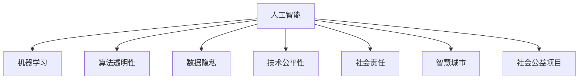

                 

# 科技向善：用科技解决社会问题

> 关键词：科技伦理,社会责任,人工智能,机器学习,算法透明性,社会福祉,数据隐私,公益项目,智慧城市

## 1. 背景介绍

### 1.1 问题由来
随着人工智能(AI)技术的迅猛发展，科技公司已经成为推动社会进步的重要力量。然而，科技的快速发展也带来了诸多挑战。如何确保科技向善，用AI技术解决社会问题，成为当前科技界和社会各界共同关注的话题。

近年来，大数据、机器学习等技术的广泛应用，为社会治理、环境保护、健康医疗等多个领域带来了重大变革。例如，基于机器学习的智能监控系统提升了城市安全，大数据分析改善了公共卫生决策，AI辅助诊断提高了医疗服务水平。但与此同时，科技发展也引发了诸多伦理问题，如数据隐私保护、算法透明性、技术滥用等，亟需引起重视。

### 1.2 问题核心关键点
科技向善的核心在于如何平衡科技发展与伦理道德的关系，确保技术应用能够切实提升社会福祉，同时避免带来新的社会问题。主要包括以下几个方面：

1. **数据隐私保护**：科技应用依赖大量的数据支持，如何保护用户隐私，避免数据滥用，是向善科技的首要问题。
2. **算法透明性**：确保AI决策过程可解释，用户能够理解和信任算法，避免"黑箱"问题。
3. **技术公平性**：避免技术偏见和歧视，确保所有人都能公平享受科技带来的好处。
4. **社会责任**：科技公司应承担社会责任，主动参与社会公益项目，解决社会问题。
5. **国际合作**：在全球化背景下，各国应共同制定AI伦理标准，推动技术应用规范化。

这些关键点构成了科技向善的基本框架，是衡量科技公司社会责任和伦理道德的重要标准。

## 2. 核心概念与联系

### 2.1 核心概念概述

为更好地理解如何用科技解决社会问题，本节将介绍几个密切相关的核心概念：

- **人工智能(AI)**：利用计算机技术模拟人类智能，通过数据、算法和计算资源实现任务自动化。
- **机器学习(ML)**：AI的重要组成部分，利用数据训练模型，使其具备学习能力，能够从数据中提取特征和模式。
- **算法透明性(Algorithmic Transparency)**：指AI决策过程的可解释性和可理解性，确保用户能够理解和信任AI的决策。
- **数据隐私(Data Privacy)**：指个人信息的保护，避免数据被滥用或泄露，确保用户数据安全。
- **技术公平性(Fairness in Technology)**：指AI模型在训练和应用过程中，避免歧视和不公平对待特定群体。
- **社会责任(Corporate Social Responsibility, CSR)**：指企业在追求经济效益的同时，应承担社会责任，为社会福祉贡献力量。
- **智慧城市(Smart Cities)**：利用科技手段提升城市管理水平，改善市民生活质量。
- **社会公益项目(Social Good Projects)**：利用AI技术解决社会问题，如健康医疗、环境保护、教育等领域的公益项目。

这些核心概念之间的逻辑关系可以通过以下Mermaid流程图来展示：



这个流程图展示了大语言模型的核心概念及其之间的关系：

1. 人工智能通过机器学习算法获取数据知识和模式。
2. 算法透明性和数据隐私是确保用户信任的前提。
3. 技术公平性和社会责任指导AI应用的方向和伦理。
4. 智慧城市和社会公益项目是AI技术应用的重要领域。

## 3. 核心算法原理 & 具体操作步骤

### 3.1 算法原理概述

科技向善的核心在于通过科技手段解决社会问题。这通常涉及以下几个关键步骤：

1. **数据收集与预处理**：收集与问题相关的数据，并对数据进行清洗、标注、归一化等预处理操作。
2. **模型训练与优化**：利用机器学习算法训练模型，并进行超参数调优，确保模型效果最优。
3. **模型评估与验证**：使用测试集对模型进行评估，验证模型的泛化能力和性能。
4. **部署与监控**：将模型部署到实际应用中，并持续监控模型表现，及时调整优化。

通过这些步骤，科技公司可以基于数据和算法，开发出能够解决社会问题的AI系统，从而实现科技向善。

### 3.2 算法步骤详解

以下是科技向善的详细操作步骤：

**Step 1: 数据收集与预处理**

1. **数据来源**：识别和收集与目标问题相关的数据来源，包括公共数据集、用户数据、传感器数据等。
2. **数据清洗**：处理数据中的缺失值、异常值、噪声等，确保数据质量。
3. **数据标注**：为数据添加标签，标注问题解决的目标和预期结果。
4. **数据归一化**：对数据进行归一化处理，使其符合模型训练的要求。

**Step 2: 模型训练与优化**

1. **选择算法**：根据问题类型选择合适的机器学习算法，如分类、回归、聚类等。
2. **模型训练**：使用数据集训练模型，进行交叉验证等超参数调优。
3. **性能评估**：在测试集上评估模型性能，如精度、召回率、F1分数等。
4. **模型优化**：根据评估结果调整模型参数，优化模型效果。

**Step 3: 模型部署与监控**

1. **模型部署**：将训练好的模型部署到实际应用中，如智慧城市管理平台、医疗健康APP等。
2. **监控与反馈**：实时监控模型表现，收集用户反馈，及时调整优化。
3. **模型维护**：定期更新数据和模型，确保系统持续有效。

### 3.3 算法优缺点

科技向善的算法具有以下优点：

1. **高效性**：通过机器学习算法，可以自动处理大量数据，提高决策效率。
2. **普适性**：科技应用可以跨越地域、文化、语言等限制，适用于不同场景。
3. **可扩展性**：算法模型可以随着数据量的增加持续优化，提升性能。

同时，科技向善的算法也存在以下局限：

1. **数据依赖性**：算法效果依赖于数据质量，数据的偏差可能导致模型偏见。
2. **算法透明性**：黑盒算法缺乏可解释性，用户可能难以理解和信任。
3. **公平性问题**：模型训练数据可能存在偏差，导致技术应用不公平。
4. **资源消耗**：模型训练和推理可能消耗大量计算资源，增加成本。

### 3.4 算法应用领域

科技向善的算法在多个领域得到了广泛应用，以下是几个典型应用：

**医疗健康**：利用AI进行疾病诊断、治疗方案推荐、健康预测等，提高医疗服务水平，改善患者体验。

**环境保护**：利用AI进行空气质量监测、水污染预警、垃圾分类识别等，推动绿色可持续发展。

**教育培训**：利用AI进行个性化教学、智能评估、学习内容推荐等，提升教育质量，实现因材施教。

**公共安全**：利用AI进行智能监控、异常行为检测、犯罪预警等，提升城市安全管理水平。

## 4. 数学模型和公式 & 详细讲解 & 举例说明

### 4.1 数学模型构建

本节将使用数学语言对科技向善的基本框架进行更加严格的刻画。

假设要解决的社会问题为 $P$，相关数据集为 $D=\{(x_i, y_i)\}_{i=1}^N$，其中 $x_i$ 为输入，$y_i$ 为输出。目标是通过机器学习算法训练模型 $M$，使其在测试集 $D_{test}$ 上的损失函数 $L$ 最小化。

设机器学习算法的模型为 $M_{\theta}$，其中 $\theta$ 为模型参数。则模型的目标函数为：

$$
\mathop{\arg\min}_{\theta} \mathcal{L}(M_{\theta}, D_{test})
$$

在实践中，我们通常使用交叉熵损失、均方误差损失等常用损失函数，并采用梯度下降等优化算法进行求解。

### 4.2 公式推导过程

以下我们以分类任务为例，推导常用的交叉熵损失函数及其梯度的计算公式。

假设模型 $M_{\theta}$ 在输入 $x$ 上的输出为 $\hat{y}=M_{\theta}(x) \in [0,1]$，表示样本属于正类的概率。真实标签 $y \in \{0,1\}$。则二分类交叉熵损失函数定义为：

$$
\ell(M_{\theta}(x),y) = -[y\log \hat{y} + (1-y)\log (1-\hat{y})]
$$

将其代入目标函数，得：

$$
\mathcal{L}(\theta) = -\frac{1}{N}\sum_{i=1}^N [y_i\log M_{\theta}(x_i)+(1-y_i)\log(1-M_{\theta}(x_i))]
$$

根据链式法则，损失函数对参数 $\theta_k$ 的梯度为：

$$
\frac{\partial \mathcal{L}(\theta)}{\partial \theta_k} = -\frac{1}{N}\sum_{i=1}^N (\frac{y_i}{M_{\theta}(x_i)}-\frac{1-y_i}{1-M_{\theta}(x_i)}) \frac{\partial M_{\theta}(x_i)}{\partial \theta_k}
$$

其中 $\frac{\partial M_{\theta}(x_i)}{\partial \theta_k}$ 可进一步递归展开，利用自动微分技术完成计算。

### 4.3 案例分析与讲解

以下以医疗健康领域的智能诊断系统为例，给出具体的应用案例。

假设目标是为患者诊断某种疾病，数据集包含患者的基本信息、病历记录、检测结果等，目标标签为疾病诊断结果（健康、疾病）。通过机器学习算法训练模型，将患者输入信息映射到疾病诊断结果。

具体步骤如下：

1. **数据收集与预处理**：从医疗数据库中收集患者数据，并进行清洗、标注等预处理操作。
2. **模型训练与优化**：选择适合的机器学习算法，如随机森林、神经网络等，使用数据集训练模型，并进行超参数调优。
3. **模型评估与验证**：在测试集上评估模型性能，如准确率、召回率、F1分数等。
4. **模型部署与监控**：将训练好的模型部署到实际应用中，实时监控模型表现，收集用户反馈，及时调整优化。

在实际应用中，智能诊断系统可以辅助医生进行快速诊断，提高诊断准确率，降低误诊率。同时，系统还可以提供个性化健康建议，改善患者体验。

## 5. 项目实践：代码实例和详细解释说明

### 5.1 开发环境搭建

在进行科技向善的开发实践前，我们需要准备好开发环境。以下是使用Python进行Scikit-Learn开发的环境配置流程：

1. 安装Anaconda：从官网下载并安装Anaconda，用于创建独立的Python环境。

2. 创建并激活虚拟环境：
```bash
conda create -n pytorch-env python=3.8 
conda activate pytorch-env
```

3. 安装Scikit-Learn：
```bash
pip install scikit-learn
```

4. 安装各类工具包：
```bash
pip install numpy pandas scikit-learn matplotlib tqdm jupyter notebook ipython
```

完成上述步骤后，即可在`pytorch-env`环境中开始科技向善的实践。

### 5.2 源代码详细实现

下面我们以医疗健康领域的智能诊断系统为例，给出使用Scikit-Learn进行机器学习任务开发的PyTorch代码实现。

首先，定义智能诊断系统的数据处理函数：

```python
from sklearn.model_selection import train_test_split
from sklearn.preprocessing import StandardScaler

def preprocess_data(X, y, test_size=0.2, random_state=42):
    X_train, X_test, y_train, y_test = train_test_split(X, y, test_size=test_size, random_state=random_state)
    scaler = StandardScaler()
    X_train = scaler.fit_transform(X_train)
    X_test = scaler.transform(X_test)
    return X_train, X_test, y_train, y_test
```

然后，定义模型和优化器：

```python
from sklearn.ensemble import RandomForestClassifier
from sklearn.metrics import accuracy_score

model = RandomForestClassifier(n_estimators=100, random_state=42)

X_train, X_test, y_train, y_test = preprocess_data(X, y)
model.fit(X_train, y_train)

y_pred = model.predict(X_test)
accuracy = accuracy_score(y_test, y_pred)
print(f"Accuracy: {accuracy:.2f}")
```

接着，定义训练和评估函数：

```python
def train_epoch(model, X_train, y_train, X_test, y_test, n_epochs=10, batch_size=32):
    for epoch in range(n_epochs):
        model.fit(X_train, y_train)
        y_pred = model.predict(X_test)
        accuracy = accuracy_score(y_test, y_pred)
        print(f"Epoch {epoch+1}, accuracy: {accuracy:.2f}")
```

最后，启动训练流程并在测试集上评估：

```python
train_epoch(model, X_train, y_train, X_test, y_test)
```

以上就是使用Scikit-Learn对随机森林模型进行医疗健康领域智能诊断任务微调的完整代码实现。可以看到，得益于Scikit-Learn的强大封装，我们可以用相对简洁的代码完成模型训练和评估。

### 5.3 代码解读与分析

让我们再详细解读一下关键代码的实现细节：

**preprocess_data函数**：
- `train_test_split`方法：将数据集划分为训练集和测试集。
- `StandardScaler`方法：对数据进行标准化处理，使其均值为0，方差为1。

**train_epoch函数**：
- 定义训练轮数`n_epochs`和批次大小`batch_size`。
- 在每个epoch上训练模型，并计算测试集上的准确率。

**训练流程**：
- 调用`train_epoch`函数，在训练集上训练模型。
- 在测试集上评估模型，输出准确率。

可以看到，Scikit-Learn提供了一整套高效的数据处理和模型训练工具，可以大幅降低开发者的时间和精力成本。

当然，实际系统实现还需考虑更多因素，如模型的保存和部署、超参数的自动搜索、更多任务适配层等。但核心的机器学习范式基本与此类似。

## 6. 实际应用场景

### 6.1 智慧医疗

基于科技向善的机器学习技术，智慧医疗领域正在经历深刻的变革。传统医疗服务依赖大量人力物力资源，受限于医生的知识水平和经验，难以满足日益增长的医疗需求。

通过科技向善的机器学习算法，可以构建智能诊断系统、健康预测系统等，辅助医生进行快速诊断和精准治疗，提高医疗服务的效率和质量。例如，智能诊断系统可以通过分析患者病历、影像、实验室数据等，自动诊断疾病，推荐治疗方案，并提供健康管理建议。

### 6.2 环境保护

环境保护是全球关注的重大问题，科技向善的机器学习技术在环境监测和污染治理方面也发挥了重要作用。

利用机器学习算法，可以实时监测空气质量、水质、噪音等环境指标，分析环境污染来源和趋势，预警环境风险。例如，智能监测系统可以通过传感器收集环境数据，利用机器学习算法进行分析，预测环境污染事件，采取相应措施，改善环境质量。

### 6.3 教育培训

教育培训领域也在不断引入科技向善的机器学习技术。传统教育方式往往难以适应个体差异，导致教育质量参差不齐。

通过机器学习算法，可以构建智能评估系统、个性化推荐系统等，提升教育质量和教学效率。例如，智能评估系统可以自动批改作业、考试，提供个性化反馈，指导学生学习。个性化推荐系统可以根据学生的学习行为和兴趣，推荐适合的学习资源和内容，实现因材施教。

### 6.4 未来应用展望

随着机器学习技术的不断进步，科技向善的应用领域将进一步拓展，为社会带来更大的福祉。

在智慧城市治理中，利用科技向善的机器学习技术，可以提升城市管理水平，改善市民生活质量。例如，智能交通系统可以通过数据分析优化交通流量，减少交通拥堵。智能安防系统可以实时监控城市安全，及时预警和处理异常情况，提升城市安全管理水平。

在社会公益项目中，科技向善的机器学习技术可以解决诸多社会问题，推动社会进步。例如，AI辅助灾情监测系统可以通过分析卫星图像、地理数据，快速评估灾情，提供救援指导，减轻灾害影响。智能教育机器人可以为偏远地区提供教育资源，提升教育公平性。

## 7. 工具和资源推荐

### 7.1 学习资源推荐

为了帮助开发者系统掌握科技向善的理论基础和实践技巧，这里推荐一些优质的学习资源：

1. 《机器学习实战》书籍：详细介绍机器学习算法的原理和实现，并辅以大量实际案例，适合初学者入门。
2. Coursera《机器学习》课程：由斯坦福大学Andrew Ng教授主讲，涵盖机器学习的基础理论和实践技巧，是机器学习领域的经典课程。
3. Kaggle竞赛平台：汇集大量数据科学竞赛，可以锻炼机器学习算法的应用能力，提升实战水平。
4. Arxiv预印本网站：发布最新的机器学习论文和研究成果，可以跟踪学术前沿，了解最新动态。
5. GitHub开源项目：搜索科技向善相关项目，学习开源实现，提升项目开发能力。

通过对这些资源的学习实践，相信你一定能够快速掌握科技向善的精髓，并用于解决实际的机器学习问题。

### 7.2 开发工具推荐

高效的开发离不开优秀的工具支持。以下是几款用于科技向善的机器学习开发的常用工具：

1. Scikit-Learn：基于Python的开源机器学习库，提供高效的数据处理和模型训练工具，适合初学者和小规模项目。
2. TensorFlow：由Google主导开发的开源深度学习框架，支持大规模模型训练和部署，适合工业级应用。
3. PyTorch：基于Python的开源深度学习框架，灵活性高，支持动态计算图，适合研究和原型开发。
4. Weights & Biases：模型训练的实验跟踪工具，可以记录和可视化模型训练过程中的各项指标，方便对比和调优。
5. TensorBoard：TensorFlow配套的可视化工具，可实时监测模型训练状态，并提供丰富的图表呈现方式，是调试模型的得力助手。

合理利用这些工具，可以显著提升科技向善机器学习任务的开发效率，加快创新迭代的步伐。

### 7.3 相关论文推荐

科技向善的研究源于学界的持续研究。以下是几篇奠基性的相关论文，推荐阅读：

1. Deep Learning with Confidence: A Confident-and-Responsible Approach to Machine Learning: 提出了一种负责任的机器学习方法，确保模型在保证准确性的同时，具备可解释性和公平性。
2. Fairness-aware Machine Learning: 综述了机器学习中的公平性问题，提出了一系列公平性评估和优化方法。
3. Explainable AI: Interpretable Machine Learning for Data Mining and Statistical Learning: 介绍了可解释机器学习的方法和技术，确保模型决策过程透明可理解。
4. A Survey of Explainable Machine Learning: 综述了机器学习模型的可解释性研究，提出了一系列解释方法和工具。
5. Ethical AI: 提出了一种基于伦理的AI设计原则，确保AI系统符合社会价值观和伦理道德。

这些论文代表了大语言模型微调技术的发展脉络。通过学习这些前沿成果，可以帮助研究者把握学科前进方向，激发更多的创新灵感。

## 8. 总结：未来发展趋势与挑战

### 8.1 总结

本文对科技向善的机器学习技术进行了全面系统的介绍。首先阐述了科技向善在解决社会问题中的重要性，明确了机器学习在提升社会福祉、推动技术公平、保障数据隐私等方面的价值。其次，从原理到实践，详细讲解了机器学习的数学模型和关键步骤，给出了科技向善任务开发的完整代码实例。同时，本文还广泛探讨了科技向善在医疗健康、环境保护、教育培训等多个行业领域的应用前景，展示了科技向善范式的广阔前景。

通过本文的系统梳理，可以看到，科技向善的机器学习技术正在成为解决社会问题的重要手段，极大地拓展了机器学习的应用边界，为社会带来了深刻的影响。未来，伴随机器学习技术的持续演进，科技向善必将在更广泛的领域得到应用，为人类社会带来更多的福祉。

### 8.2 未来发展趋势

展望未来，机器学习技术将呈现以下几个发展趋势：

1. 模型规模持续增大。随着算力成本的下降和数据规模的扩张，机器学习模型的参数量还将持续增长。超大规模模型蕴含的丰富知识，有望支撑更加复杂多变的社会问题解决。
2. 模型公平性提升。未来将涌现更多公平性优化算法，确保机器学习模型在不同群体之间具备一致性，避免技术偏见。
3. 可解释性加强。越来越多的研究将关注机器学习模型的可解释性，确保决策过程透明可理解，避免“黑箱”问题。
4. 跨领域融合。机器学习技术将与其他领域的技术进行更深入的融合，如知识表示、因果推理、强化学习等，共同推动科技向善。
5. 隐私保护加强。未来将涌现更多隐私保护技术，确保数据在处理和使用过程中得到有效保护。
6. 多模态学习提升。机器学习技术将更多地应用于多模态数据，如文本、图像、语音等，提升模型的泛化能力。

这些趋势凸显了机器学习技术在解决社会问题中的潜力，为未来发展指明了方向。

### 8.3 面临的挑战

尽管机器学习技术在解决社会问题中取得了显著成效，但在迈向更加智能化、普适化应用的过程中，它仍面临着诸多挑战：

1. 数据质量问题。机器学习模型依赖高质量的数据，但数据获取和标注成本较高，且可能存在偏差和噪声。
2. 技术公平性问题。机器学习模型可能会引入技术偏见，导致不同群体之间的不公平。
3. 模型透明性问题。机器学习模型往往具备“黑箱”特性，用户难以理解和信任。
4. 资源消耗问题。模型训练和推理可能消耗大量计算资源，增加成本。
5. 伦理和法律问题。机器学习模型的决策过程可能面临伦理和法律的质疑，需要加强监管。
6. 数据隐私问题。机器学习模型可能泄露用户隐私，需要加强数据保护。

这些挑战需要科技公司和社会各界共同努力，通过技术创新和制度建设，逐步解决。

### 8.4 研究展望

面对机器学习面临的这些挑战，未来的研究需要在以下几个方面寻求新的突破：

1. 数据预处理技术。研发更加高效、自动化的数据预处理技术，确保数据质量。
2. 公平性优化算法。开发更加公平、透明的机器学习算法，确保模型在不同群体之间具备一致性。
3. 可解释性技术。开发更加可解释的机器学习模型，确保决策过程透明可理解。
4. 跨模态融合技术。将视觉、语音、文本等多种模态数据进行有效融合，提升模型的泛化能力。
5. 隐私保护技术。研发更加有效的隐私保护技术，确保数据在处理和使用过程中得到有效保护。
6. 伦理和法律框架。建立机器学习模型的伦理和法律框架，确保其符合社会价值观和伦理道德。

这些研究方向的探索，必将引领机器学习技术迈向更高的台阶，为构建安全、可靠、可解释、可控的智能系统铺平道路。面向未来，机器学习技术还需要与其他人工智能技术进行更深入的融合，如知识表示、因果推理、强化学习等，多路径协同发力，共同推动科技向善。

## 9. 附录：常见问题与解答

**Q1：机器学习是否适用于所有社会问题？**

A: 机器学习在解决许多社会问题方面已经取得了显著成效，如医疗诊断、环境保护、智能交通等。但对于一些复杂且涉及伦理道德的问题，如社会治理、道德伦理、法律规范等，机器学习可能难以直接应用于解决。这些问题的解决需要结合人类智慧和社会制度共同努力。

**Q2：如何确保机器学习模型的公平性？**

A: 确保机器学习模型的公平性可以从以下几个方面入手：
1. 数据集预处理：确保数据集平衡，避免数据偏见。
2. 模型设计：选择公平性优化算法，如公平性约束、公平性调整等。
3. 结果评估：使用公平性指标评估模型性能，如误报率、漏报率、公平性曲线等。
4. 透明性提升：提高模型可解释性，确保决策过程透明可理解。

**Q3：如何保护机器学习模型的隐私？**

A: 保护机器学习模型的隐私可以从以下几个方面入手：
1. 数据匿名化：对数据进行去标识化处理，确保数据隐私。
2. 访问控制：限制模型访问权限，确保只有授权人员可以访问和使用模型。
3. 数据加密：对数据进行加密处理，确保数据传输和存储安全。
4. 差分隐私：使用差分隐私技术，确保模型训练和使用过程中数据隐私得到保护。

**Q4：如何提升机器学习模型的可解释性？**

A: 提升机器学习模型的可解释性可以从以下几个方面入手：
1. 特征工程：选择具有代表性的特征，确保模型输入数据简洁明了。
2. 模型简化：简化模型结构，降低复杂度，提高可解释性。
3. 模型解释工具：使用可解释工具，如LIME、SHAP等，解释模型决策过程。
4. 可视化技术：使用可视化技术，如热力图、特征重要性等，展示模型输出和特征影响。

**Q5：如何优化机器学习模型的性能？**

A: 优化机器学习模型的性能可以从以下几个方面入手：
1. 数据集扩充：扩充数据集，增加模型训练样本。
2. 超参数调优：优化模型超参数，如学习率、批次大小等，提高模型效果。
3. 模型融合：使用集成学习技术，如Bagging、Boosting等，提高模型性能。
4. 模型正则化：使用正则化技术，如L1正则、Dropout等，避免过拟合。

**Q6：如何确保机器学习模型的透明性？**

A: 确保机器学习模型的透明性可以从以下几个方面入手：
1. 模型架构：设计简单、可解释的模型架构，避免复杂性。
2. 特征选择：选择具有代表性的特征，确保模型输入数据简洁明了。
3. 结果解释：使用可解释工具，如LIME、SHAP等，解释模型决策过程。
4. 透明度报告：定期发布透明度报告，展示模型性能、参数设置等关键信息。

这些问题的解答可以帮助开发者更好地理解机器学习技术的应用和局限，确保机器学习模型在解决社会问题中的公平性、透明性和隐私保护，推动科技向善的持续发展。

---

作者：禅与计算机程序设计艺术 / Zen and the Art of Computer Programming

