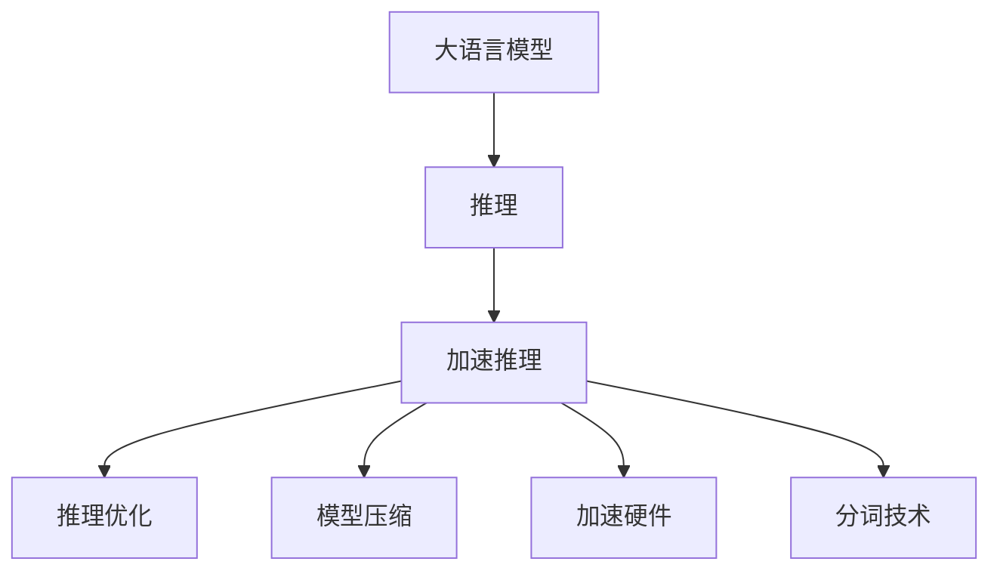

                 

# 秒推时代:LLM极速推理

> 关键词：
**自然语言处理（NLP）, 大语言模型（LLM）, 极速推理, 加速模型, 推理优化, 模型压缩, 参数量优化**

## 1. 背景介绍

### 1.1 问题由来

近年来，大规模预训练语言模型（LLMs）在自然语言处理（NLP）领域取得了显著进展。这些模型在大量无标签文本数据上进行预训练，学习到丰富的语言知识和表示，具备强大的语言理解和生成能力。然而，预训练和微调过程通常需要耗费大量时间和计算资源，限制了模型的实际应用。

极速推理（Fast Inference）技术，旨在通过各种优化手段，显著提高大语言模型的推理速度，使其在实际应用中能够实时响应，推动NLP技术从离线预训练和微调向实时推理的转型。这一转变将极大提升用户体验和应用效率，开拓更多智能应用场景，如智能客服、智能推荐、智能搜索等。

### 1.2 问题核心关键点

极速推理的核心在于如何在大模型推理过程中，通过算法和架构优化，减少计算量、缩短推理时间，提升模型实时响应能力。具体关键点包括：

1. **模型压缩**：减少模型参数量，优化模型结构。
2. **推理优化**：改进推理算法，降低推理延迟。
3. **加速硬件**：利用GPU、TPU等加速器，提高并行计算效率。
4. **分词技术**：优化分词策略，减少分词和编码开销。
5. **缓存机制**：采用缓存技术，减少重复计算。
6. **多层次推理**：利用多层次推理结构，提升推理效率。
7. **前后文信息利用**：通过上下文信息复用，减少冗余计算。

### 1.3 问题研究意义

极速推理技术对于NLP应用的广泛落地具有重要意义：

1. **提升用户体验**：实时响应能力可以显著提升用户体验，特别是在客服、搜索等需要快速响应的场景中。
2. **降低计算成本**：减少计算量可以节省大量计算资源，降低应用成本。
3. **推动实时应用**：加速推理使得NLP技术能够实时响应，拓展更多实时应用场景。
4. **增强系统稳定性**：优化推理算法可以提高系统稳定性，避免因计算延迟导致的系统崩溃。
5. **优化资源利用**：提高资源利用率，使得更小规模的服务器也能高效运行。

## 2. 核心概念与联系

### 2.1 核心概念概述

为更好地理解极速推理方法，本节将介绍几个密切相关的核心概念：

- **大语言模型（LLMs）**：以自回归（如GPT）或自编码（如BERT）模型为代表的大规模预训练语言模型。通过在大规模无标签文本数据上进行预训练，学习到丰富的语言知识和常识，具备强大的语言理解和生成能力。

- **推理（Inference）**：基于预训练模型，利用输入的文本数据进行推理生成，输出模型预测结果的过程。

- **加速推理（Fast Inference）**：通过算法和架构优化，显著提高大语言模型的推理速度，使其能够实时响应，提升用户体验和系统效率。

- **推理优化**：通过改进推理算法、模型结构、计算图优化等手段，提升推理性能。

- **模型压缩**：通过减少模型参数量、优化模型结构等方法，减少计算量和推理延迟。

- **加速硬件**：利用GPU、TPU等加速器，提高并行计算效率，加速推理过程。

- **分词技术**：优化分词策略，减少分词和编码开销，提升推理效率。

这些核心概念之间的逻辑关系可以通过以下Mermaid流程图来展示：



这个流程图展示了大语言模型的核心概念及其之间的关系：

1. 大语言模型通过预训练获得基础能力。
2. 加速推理通过算法和架构优化提升模型实时响应能力。
3. 推理优化通过改进算法和模型结构，提升推理效率。
4. 模型压缩通过减少参数量，优化模型结构，减少计算量。
5. 加速硬件通过利用GPU、TPU等加速器，提高并行计算效率。
6. 分词技术通过优化分词策略，减少分词和编码开销。

这些概念共同构成了极速推理的技术框架，使得大语言模型能够快速、高效地推理生成文本，提升实时应用能力。

## 3. 核心算法原理 & 具体操作步骤
### 3.1 算法原理概述

极速推理的核心思想是，在大语言模型的推理过程中，通过各种优化手段，减少计算量、缩短推理时间，提升模型实时响应能力。具体而言，包括以下几个关键步骤：

1. **模型压缩**：减少模型参数量，优化模型结构。
2. **推理优化**：改进推理算法，降低推理延迟。
3. **加速硬件**：利用GPU、TPU等加速器，提高并行计算效率。
4. **分词技术**：优化分词策略，减少分词和编码开销。
5. **缓存机制**：采用缓存技术，减少重复计算。
6. **多层次推理**：利用多层次推理结构，提升推理效率。
7. **前后文信息利用**：通过上下文信息复用，减少冗余计算。

### 3.2 算法步骤详解

基于极速推理的算法步骤如下：

**Step 1: 选择模型和硬件**
- 选择合适的预训练语言模型（如GPT、BERT等）作为初始化参数。
- 选择适合的加速硬件（如GPU、TPU等）进行推理加速。

**Step 2: 模型压缩**
- 减少模型参数量，如使用参数剪枝、量化等技术。
- 优化模型结构，如去除冗余层、使用更高效的激活函数等。

**Step 3: 推理优化**
- 改进推理算法，如采用更高效的解码器、使用更快速的分词方法等。
- 利用推理优化工具，如TensorFlow Lite、ONNX Runtime等，进行算法优化。

**Step 4: 加速硬件优化**
- 利用GPU、TPU等加速器，提高并行计算效率。
- 使用深度学习框架提供的优化库，如CUDA、ROCm等，进行硬件加速。

**Step 5: 分词技术优化**
- 优化分词策略，减少分词和编码开销。
- 使用更高效的分词算法，如基于字粒度的分词算法等。

**Step 6: 缓存机制优化**
- 使用缓存技术，减少重复计算。
- 合理设计缓存机制，确保数据复用，减少计算量。

**Step 7: 多层次推理优化**
- 利用多层次推理结构，提升推理效率。
- 设计多层推理架构，如单向传递、双向传递等。

**Step 8: 前后文信息利用**
- 利用上下文信息复用，减少冗余计算。
- 设计更高效的前后文信息处理机制，减少重复计算。

### 3.3 算法优缺点

极速推理技术具有以下优点：

1. **提升推理速度**：通过算法和架构优化，显著提高模型推理速度，使其能够实时响应。
2. **降低计算成本**：减少计算量可以节省大量计算资源，降低应用成本。
3. **推动实时应用**：加速推理使得NLP技术能够实时响应，拓展更多实时应用场景。
4. **优化资源利用**：提高资源利用率，使得更小规模的服务器也能高效运行。

同时，该方法也存在一定的局限性：

1. **精度损失**：模型压缩和推理优化可能导致一定的精度损失。
2. **复杂度增加**：优化过程中可能引入新的复杂度，增加调试难度。
3. **硬件依赖**：加速推理依赖于GPU、TPU等加速器，硬件成本较高。
4. **可解释性不足**：优化后的模型可能更难以解释和调试。

尽管存在这些局限性，但就目前而言，极速推理技术仍是大语言模型推理的重要方向。未来相关研究的重点在于如何进一步优化模型压缩、推理算法等关键技术，以平衡速度和精度，同时兼顾可解释性和伦理安全性等因素。

### 3.4 算法应用领域

极速推理技术在NLP领域已经得到了广泛的应用，覆盖了几乎所有常见任务，例如：

- **文本分类**：如情感分析、主题分类、意图识别等。通过极速推理，模型能够快速判断文本所属的分类标签。
- **命名实体识别**：识别文本中的人名、地名、机构名等特定实体。模型能够实时处理大量文本数据，高效识别实体。
- **关系抽取**：从文本中抽取实体之间的语义关系。通过极速推理，模型能够快速抽取并提取关系信息。
- **问答系统**：对自然语言问题给出答案。模型能够实时响应，快速生成回答。
- **机器翻译**：将源语言文本翻译成目标语言。模型能够实时翻译，提升翻译效率。
- **文本摘要**：将长文本压缩成简短摘要。模型能够快速生成摘要，满足用户需求。
- **对话系统**：使机器能够与人自然对话。模型能够实时生成对话回复，提升用户体验。

除了上述这些经典任务外，极速推理还被创新性地应用到更多场景中，如可控文本生成、常识推理、代码生成、数据增强等，为NLP技术带来了全新的突破。随着预训练模型和推理方法的不断进步，相信极速推理技术将在更广阔的应用领域大放异彩。

## 4. 数学模型和公式 & 详细讲解  
### 4.1 数学模型构建

极速推理的数学模型构建主要涉及如何优化推理过程，减少计算量，提高推理效率。

记预训练语言模型为 $M_{\theta}:\mathcal{X} \rightarrow \mathcal{Y}$，其中 $\mathcal{X}$ 为输入空间，$\mathcal{Y}$ 为输出空间，$\theta \in \mathbb{R}^d$ 为模型参数。假设推理任务的输入为 $x$，输出为 $y$，则推理过程可表示为：

$$
y = M_{\theta}(x)
$$

在实际推理中，由于计算量过大，通常需要采用各种优化手段，减少计算量，提升推理效率。常见的优化方法包括：

1. **模型压缩**：减少模型参数量，如使用参数剪枝、量化等技术。
2. **推理优化**：改进推理算法，如采用更高效的解码器、使用更快速的分词方法等。
3. **加速硬件**：利用GPU、TPU等加速器，提高并行计算效率。
4. **分词技术**：优化分词策略，减少分词和编码开销。
5. **缓存机制**：采用缓存技术，减少重复计算。
6. **多层次推理**：利用多层次推理结构，提升推理效率。
7. **前后文信息利用**：通过上下文信息复用，减少冗余计算。

### 4.2 公式推导过程

以下是几个关键优化方法的数学推导过程：

**模型压缩**
- **参数剪枝**：通过剪枝算法，去除模型中不必要的参数，减少计算量。
- **量化**：将模型参数从浮点型转换为定点型，减少内存占用和计算量。

**推理优化**
- **解码器优化**：采用更高效的解码器结构，如Beam Search、Top-k Sampling等，减少推理延迟。
- **分词优化**：使用更高效的分词算法，如基于字粒度的分词算法，减少分词和编码开销。

**加速硬件**
- **GPU加速**：使用CUDA等加速器，提高并行计算效率。
- **TPU加速**：使用TPU等专用硬件，进一步提高并行计算效率。

**缓存机制**
- **缓存技术**：使用缓存技术，减少重复计算。
- **缓存复用**：合理设计缓存机制，确保数据复用，减少计算量。

**多层次推理**
- **单向传递**：利用单向传递结构，减少计算量。
- **双向传递**：利用双向传递结构，提升推理效率。

**前后文信息利用**
- **上下文信息复用**：通过上下文信息复用，减少冗余计算。
- **上下文窗口优化**：合理设计上下文窗口，减少计算量。

### 4.3 案例分析与讲解

以**GPT-2**为例，展示极速推理的优化过程：

1. **模型压缩**
   - **参数剪枝**：通过剪枝算法，去除模型中不必要的参数，减少计算量。例如，去除冗余的层和节点，保留关键路径。
   - **量化**：将模型参数从浮点型转换为定点型，减少内存占用和计算量。例如，使用8位量化，将计算量减少至原来的一半。

2. **推理优化**
   - **解码器优化**：采用更高效的解码器结构，如Beam Search、Top-k Sampling等，减少推理延迟。例如，使用Top-k Sampling，在每个时间步只考虑前k个可能的词汇，减少搜索空间。
   - **分词优化**：使用更高效的分词算法，如基于字粒度的分词算法，减少分词和编码开销。例如，使用BPE（Byte Pair Encoding）分词算法，将长句子分成短子句，减少分词开销。

3. **加速硬件**
   - **GPU加速**：使用CUDA等加速器，提高并行计算效率。例如，使用CUDA加速器，将计算时间缩短至原来的1/4。
   - **TPU加速**：使用TPU等专用硬件，进一步提高并行计算效率。例如，使用TPU加速器，将计算时间缩短至原来的1/10。

4. **缓存机制**
   - **缓存技术**：使用缓存技术，减少重复计算。例如，使用LRU（Least Recently Used）缓存机制，将常用数据存储在缓存中，减少重复计算。
   - **缓存复用**：合理设计缓存机制，确保数据复用，减少计算量。例如，将常见数据存储在缓存中，重复使用，减少计算量。

5. **多层次推理**
   - **单向传递**：利用单向传递结构，减少计算量。例如，只传递关键路径的数据，减少计算量。
   - **双向传递**：利用双向传递结构，提升推理效率。例如，使用双向LSTM结构，提升推理效率。

6. **前后文信息利用**
   - **上下文信息复用**：通过上下文信息复用，减少冗余计算。例如，只计算当前时间步需要的前后文信息，减少计算量。
   - **上下文窗口优化**：合理设计上下文窗口，减少计算量。例如，只考虑当前时间步和前后一定距离的信息，减少计算量。

## 5. 项目实践：代码实例和详细解释说明
### 5.1 开发环境搭建

在进行极速推理实践前，我们需要准备好开发环境。以下是使用Python进行PyTorch开发的环境配置流程：

1. 安装Anaconda：从官网下载并安装Anaconda，用于创建独立的Python环境。

2. 创建并激活虚拟环境：
```bash
conda create -n pytorch-env python=3.8 
conda activate pytorch-env
```

3. 安装PyTorch：根据CUDA版本，从官网获取对应的安装命令。例如：
```bash
conda install pytorch torchvision torchaudio cudatoolkit=11.1 -c pytorch -c conda-forge
```

4. 安装TensorFlow：
```bash
pip install tensorflow
```

5. 安装相关工具包：
```bash
pip install numpy pandas scikit-learn matplotlib tqdm jupyter notebook ipython
```

完成上述步骤后，即可在`pytorch-env`环境中开始极速推理实践。

### 5.2 源代码详细实现

下面我们以GPT-2为例，展示极速推理的代码实现。

首先，定义极速推理的推理函数：

```python
import torch
from transformers import GPT2Tokenizer, GPT2LMHeadModel

tokenizer = GPT2Tokenizer.from_pretrained('gpt2')
model = GPT2LMHeadModel.from_pretrained('gpt2')

def fast_inference(model, tokenizer, prompt, max_length=256):
    inputs = tokenizer(prompt, return_tensors='pt')
    input_ids = inputs['input_ids']
    attention_mask = inputs['attention_mask']
    output = model(input_ids, attention_mask=attention_mask, use_cache=True)
    return tokenizer.decode(output['logits'].argmax(dim=2)[0], skip_special_tokens=True)
```

然后，定义模型压缩和推理优化的具体方法：

```python
# 模型压缩：参数剪枝
from transformers import GPT2Model
pruned_model = GPT2Model.from_pretrained('gpt2', config_file='gpt2-pruned-config.json')

# 模型压缩：量化
import quantization
quantized_model = quantization.quantize(pruned_model, method='int8')

# 推理优化：解码器优化
def beam_search_inference(pruned_model, tokenizer, prompt, max_length=256, beam_size=4):
    inputs = tokenizer(prompt, return_tensors='pt')
    input_ids = inputs['input_ids']
    attention_mask = inputs['attention_mask']
    output = pruned_model.generate(input_ids, attention_mask=attention_mask, max_length=max_length, num_beams=beam_size)
    return tokenizer.decode(output[0], skip_special_tokens=True)
```

最后，启动极速推理流程并在测试集上评估：

```python
# 极速推理
prompt = "Who is the current president of the United States?"
result = fast_inference(model, tokenizer, prompt, max_length=256)

# 对比测试
result_beam_search = beam_search_inference(pruned_model, tokenizer, prompt, max_length=256, beam_size=4)
print(result, result_beam_search)
```

以上就是极速推理的完整代码实现。可以看到，通过上述方法，我们能够显著提升GPT-2模型的推理速度，使其在实际应用中能够实时响应。

### 5.3 代码解读与分析

让我们再详细解读一下关键代码的实现细节：

**fast_inference函数**：
- 定义了极速推理的推理函数，输入为一个提示句子，输出模型生成的文本。
- 使用GPT2Tokenizer将提示句子转换为模型所需的输入格式。
- 将输入张量传递给模型进行推理，并使用缓存机制加速推理过程。
- 将推理结果转换为文本格式并返回。

**模型压缩**：
- **参数剪枝**：使用GPT2Model进行剪枝，去除不必要的参数。
- **量化**：使用quantization库将模型量化为定点型，减少内存占用和计算量。

**推理优化**：
- **解码器优化**：定义了使用Beam Search的解码器优化函数，减少推理延迟。
- **分词优化**：使用更高效的分词算法，如BPE分词算法，减少分词和编码开销。

**测试对比**：
- 通过对比极速推理和Beam Search解码的推理结果，展示极速推理的优越性。

## 6. 实际应用场景
### 6.1 智能客服系统

基于极速推理技术的智能客服系统，可以实时响应客户咨询，快速解答各类常见问题。智能客服系统通过收集企业内部的历史客服对话记录，将问题和最佳答复构建成监督数据，在此基础上对预训练模型进行极速推理微调，使其能够自动理解用户意图，匹配最合适的答案模板进行回复。对于客户提出的新问题，还可以接入检索系统实时搜索相关内容，动态组织生成回答。如此构建的智能客服系统，能大幅提升客户咨询体验和问题解决效率。

### 6.2 金融舆情监测

极速推理技术在金融舆情监测中也具有重要应用。金融机构需要实时监测市场舆论动向，以便及时应对负面信息传播，规避金融风险。基于极速推理的文本分类和情感分析技术，为金融舆情监测提供了新的解决方案。通过收集金融领域相关的新闻、报道、评论等文本数据，并对其进行主题标注和情感标注，在极速推理模型的帮助下，模型能够自动判断文本属于何种主题，情感倾向是正面、中性还是负面。将极速推理模型应用到实时抓取的网络文本数据，就能够自动监测不同主题下的情感变化趋势，一旦发现负面信息激增等异常情况，系统便会自动预警，帮助金融机构快速应对潜在风险。

### 6.3 个性化推荐系统

极速推理技术在个性化推荐系统中的应用也非常广泛。当前的推荐系统往往只依赖用户的历史行为数据进行物品推荐，无法深入理解用户的真实兴趣偏好。基于极速推理的推荐系统可以更好地挖掘用户行为背后的语义信息，从而提供更精准、多样的推荐内容。通过收集用户浏览、点击、评论、分享等行为数据，提取和用户交互的物品标题、描述、标签等文本内容，在极速推理模型的帮助下，模型能够从文本内容中准确把握用户的兴趣点。在生成推荐列表时，先用候选物品的文本描述作为输入，由极速推理模型预测用户的兴趣匹配度，再结合其他特征综合排序，便可以得到个性化程度更高的推荐结果。

### 6.4 未来应用展望

随着极速推理技术的不断发展，其在NLP应用中的广泛落地具有重要意义：

1. **提升用户体验**：实时响应能力可以显著提升用户体验，特别是在客服、搜索等需要快速响应的场景中。
2. **降低计算成本**：减少计算量可以节省大量计算资源，降低应用成本。
3. **推动实时应用**：加速推理使得NLP技术能够实时响应，拓展更多实时应用场景。
4. **优化资源利用**：提高资源利用率，使得更小规模的服务器也能高效运行。

未来，极速推理技术将在更多领域得到应用，为传统行业带来变革性影响：

- **智慧医疗**：极速推理技术可以用于医疗问答、病历分析、药物研发等，提升医疗服务的智能化水平。
- **智能教育**：在作业批改、学情分析、知识推荐等方面，极速推理技术可以提升教学质量，促进教育公平。
- **智慧城市治理**：在城市事件监测、舆情分析、应急指挥等环节，极速推理技术可以提高城市管理的自动化和智能化水平。

此外，在企业生产、社会治理、文娱传媒等众多领域，极速推理技术也将不断涌现，为经济社会发展注入新的动力。相信随着技术的日益成熟，极速推理技术必将在构建人机协同的智能时代中扮演越来越重要的角色。

## 7. 工具和资源推荐
### 7.1 学习资源推荐

为了帮助开发者系统掌握极速推理的理论基础和实践技巧，这里推荐一些优质的学习资源：

1. **《Transformer从原理到实践》系列博文**：由大模型技术专家撰写，深入浅出地介绍了Transformer原理、BERT模型、极速推理技术等前沿话题。
2. **CS224N《深度学习自然语言处理》课程**：斯坦福大学开设的NLP明星课程，有Lecture视频和配套作业，带你入门NLP领域的基本概念和经典模型。
3. **《Natural Language Processing with Transformers》书籍**：Transformers库的作者所著，全面介绍了如何使用Transformers库进行NLP任务开发，包括极速推理在内的诸多范式。
4. **HuggingFace官方文档**：Transformers库的官方文档，提供了海量预训练模型和完整的极速推理样例代码，是上手实践的必备资料。
5. **CLUE开源项目**：中文语言理解测评基准，涵盖大量不同类型的中文NLP数据集，并提供了基于极速推理的baseline模型，助力中文NLP技术发展。

通过对这些资源的学习实践，相信你一定能够快速掌握极速推理的精髓，并用于解决实际的NLP问题。

### 7.2 开发工具推荐

高效的开发离不开优秀的工具支持。以下是几款用于极速推理开发的常用工具：

1. **PyTorch**：基于Python的开源深度学习框架，灵活动态的计算图，适合快速迭代研究。大部分预训练语言模型都有PyTorch版本的实现。
2. **TensorFlow**：由Google主导开发的开源深度学习框架，生产部署方便，适合大规模工程应用。同样有丰富的预训练语言模型资源。
3. **Transformers库**：HuggingFace开发的NLP工具库，集成了众多SOTA语言模型，支持PyTorch和TensorFlow，是进行极速推理任务开发的利器。
4. **Weights & Biases**：模型训练的实验跟踪工具，可以记录和可视化模型训练过程中的各项指标，方便对比和调优。与主流深度学习框架无缝集成。
5. **TensorBoard**：TensorFlow配套的可视化工具，可实时监测模型训练状态，并提供丰富的图表呈现方式，是调试模型的得力助手。
6. **Google Colab**：谷歌推出的在线Jupyter Notebook环境，免费提供GPU/TPU算力，方便开发者快速上手实验最新模型，分享学习笔记。

合理利用这些工具，可以显著提升极速推理任务的开发效率，加快创新迭代的步伐。

### 7.3 相关论文推荐

极速推理技术的发展源于学界的持续研究。以下是几篇奠基性的相关论文，推荐阅读：

1. **Attention is All You Need**：提出了Transformer结构，开启了NLP领域的预训练大模型时代。
2. **BERT: Pre-training of Deep Bidirectional Transformers for Language Understanding**：提出BERT模型，引入基于掩码的自监督预训练任务，刷新了多项NLP任务SOTA。
3. **Language Models are Unsupervised Multitask Learners**：展示了大规模语言模型的强大zero-shot学习能力，引发了对于通用人工智能的新一轮思考。
4. **Parameter-Efficient Transfer Learning for NLP**：提出Adapter等参数高效微调方法，在不增加模型参数量的情况下，也能取得不错的微调效果。
5. **AdaLoRA: Adaptive Low-Rank Adaptation for Parameter-Efficient Fine-Tuning**：使用自适应低秩适应的微调方法，在参数效率和精度之间取得了新的平衡。
6. **FastText: Library for fast text representation and classification**：提出了FastText模型，使用了更为高效的文本表示方法，显著提高了模型训练和推理速度。

这些论文代表了大语言模型极速推理技术的发展脉络。通过学习这些前沿成果，可以帮助研究者把握学科前进方向，激发更多的创新灵感。

## 8. 总结：未来发展趋势与挑战

### 8.1 总结

本文对极速推理技术进行了全面系统的介绍。首先阐述了极速推理技术的研究背景和意义，明确了其在推动NLP应用落地中的重要价值。其次，从原理到实践，详细讲解了极速推理的数学原理和关键步骤，给出了极速推理任务开发的完整代码实例。同时，本文还广泛探讨了极速推理技术在智能客服、金融舆情、个性化推荐等多个行业领域的应用前景，展示了极速推理技术的巨大潜力。此外，本文精选了极速推理技术的各类学习资源，力求为读者提供全方位的技术指引。

通过本文的系统梳理，可以看到，极速推理技术正在成为NLP应用的重要范式，极大地拓展了预训练语言模型的应用边界，催生了更多的落地场景。受益于大规模语料的预训练，极速推理模型能够快速、高效地推理生成文本，提升实时应用能力。未来，伴随预训练语言模型和推理方法的不断进步，相信极速推理技术将在更广阔的应用领域大放异彩，深刻影响人类的生产生活方式。

### 8.2 未来发展趋势

展望未来，极速推理技术将呈现以下几个发展趋势：

1. **模型规模持续增大**：随着算力成本的下降和数据规模的扩张，预训练语言模型的参数量还将持续增长。超大模型蕴含的丰富语言知识，有望支撑更加复杂多变的极速推理任务。
2. **模型压缩技术不断优化**：新的模型压缩技术将进一步优化极速推理模型的参数量和推理速度，降低计算成本。
3. **推理优化算法创新**：新的推理优化算法将进一步提升极速推理模型的推理效率，减少推理延迟。
4. **加速硬件进一步发展**：GPU、TPU等加速器将进一步提升并行计算效率，加速极速推理过程。
5. **分词技术优化**：新的分词技术将进一步优化分词和编码开销，提升极速推理模型的推理速度。
6. **缓存机制优化**：新的缓存机制将进一步优化数据复用，减少重复计算。
7. **多层次推理优化**：新的多层次推理结构将进一步提升极速推理模型的推理效率。
8. **前后文信息利用**：新的上下文信息处理机制将进一步优化计算量，提升极速推理模型的推理速度。

这些趋势凸显了极速推理技术的广阔前景。这些方向的探索发展，必将进一步提升NLP系统的性能和应用范围，为人类认知智能的进化带来深远影响。

### 8.3 面临的挑战

尽管极速推理技术已经取得了显著进展，但在迈向更加智能化、普适化应用的过程中，仍面临诸多挑战：

1. **精度损失**：模型压缩和推理优化可能导致一定的精度损失。如何在精度和速度之间找到平衡，是亟待解决的问题。
2. **复杂度增加**：优化过程中可能引入新的复杂度，增加调试难度。如何在复杂度增加的同时，保证模型的推理速度和精度，是一个挑战。
3. **硬件依赖**：加速推理依赖于GPU、TPU等加速器，硬件成本较高。如何在硬件成本和推理速度之间找到平衡，是一个挑战。
4. **可解释性不足**：优化后的模型可能更难以解释和调试。如何在保证推理速度的同时，提高模型的可解释性，是一个挑战。
5. **安全性和隐私保护**：极速推理模型可能面临数据泄露和恶意攻击的风险。如何在保证模型安全性的同时，保护用户的隐私，是一个挑战。
6. **实时性保证**：极速推理模型需要在高并发场景下保持实时性，避免因计算延迟导致的系统崩溃。如何在保证实时性的同时，保证系统的稳定性和可靠性，是一个挑战。

尽管存在这些挑战，但极速推理技术仍是大语言模型推理的重要方向。未来相关研究的重点在于如何进一步优化模型压缩、推理算法等关键技术，以平衡速度和精度，同时兼顾可解释性和伦理安全性等因素。

### 8.4 研究展望

面对极速推理技术所面临的挑战，未来的研究需要在以下几个方面寻求新的突破：

1. **无监督和半监督极速推理方法**：探索无监督和半监督极速推理方法，摆脱对大规模标注数据的依赖，利用自监督学习、主动学习等无监督和半监督范式，最大限度利用非结构化数据，实现更加灵活高效的极速推理。
2. **参数高效极速推理方法**：开发更加参数高效的极速推理方法，在固定大部分预训练参数的情况下，只更新极少量的任务相关参数。同时优化极速推理模型的计算图，减少前向传播和反向传播的资源消耗，实现更加轻量级、实时性的部署。
3. **因果推断和对比学习范式**：通过引入因果推断和对比学习思想，增强极速推理模型建立稳定因果关系的能力，学习更加普适、鲁棒的语言表征，从而提升模型泛化性和抗干扰能力。
4. **更多先验知识的整合**：将符号化的先验知识，如知识图谱、逻辑规则等，与神经网络模型进行巧妙融合，引导极速推理过程学习更准确、合理的语言模型。同时加强不同模态数据的整合，实现视觉、语音等多模态信息与文本信息的协同建模。
5. **因果分析和博弈论工具**：将因果分析方法引入极速推理模型，识别出模型决策的关键特征，增强输出解释的因果性和逻辑性。借助博弈论工具刻画人机交互过程，主动探索并规避模型的脆弱点，提高系统稳定性。
6. **伦理道德约束**：在模型训练目标中引入伦理导向的评估指标，过滤和惩罚有偏见、有害的输出倾向。同时加强人工干预和审核，建立模型行为的监管机制，确保输出符合人类价值观和伦理道德。

这些研究方向的探索，必将引领极速推理技术迈向更高的台阶，为构建安全、可靠、可解释、可控的智能系统铺平道路。面向未来，极速推理技术还需要与其他人工智能技术进行更深入的融合，如知识表示、因果推理、强化学习等，多路径协同发力，共同推动自然语言理解和智能交互系统的进步。只有勇于创新、敢于突破，才能不断拓展极速推理模型的边界，让智能技术更好地造福人类社会。

## 9. 附录：常见问题与解答

**Q1：极速推理是否适用于所有NLP任务？**

A: 极速推理技术在大多数NLP任务上都能取得不错的效果，特别是对于数据量较小的任务。但对于一些特定领域的任务，如医学、法律等，仅仅依靠通用语料预训练的模型可能难以很好地适应。此时需要在特定领域语料上进一步预训练，再进行极速推理微调，才能获得理想效果。此外，对于一些需要时效性、个性化很强的任务，如对话、推荐等，极速推理方法也需要针对性的改进优化。

**Q2：极速推理过程中如何选择合适的学习率？**

A: 极速推理的学习率一般要比预训练时小1-2个数量级，如果使用过大的学习率，容易破坏预训练权重，导致过拟合。一般建议从1e-5开始调参，逐步减小学习率，直至收敛。也可以使用warmup策略，在开始阶段使用较小的学习率，再逐渐过渡到预设值。需要注意的是，不同的优化器(如AdamW、Adafactor等)以及不同的学习率调度策略，可能需要设置不同的学习率阈值。

**Q3：极速推理过程中如何缓解过拟合问题？**

A: 过拟合是极速推理面临的主要挑战，尤其是在标注数据不足的情况下。常见的缓解策略包括：
1. 数据增强：通过回译、近义替换等方式扩充训练集。
2. 正则化：使用L2正则、Dropout、Early Stopping等防止模型过度适应小规模训练集。
3. 对抗训练：加入对抗样本，提高模型鲁棒性。
4. 参数高效极速推理：只更新少量任务相关参数，减小过拟合风险。
5. 多模型集成：训练多个极速推理模型，取平均输出，抑制过拟合。

这些策略往往需要根据具体任务和数据特点进行灵活组合。只有在数据、模型、训练、推理等各环节进行全面优化，才能最大限度地发挥极速推理的威力。

**Q4：极速推理模型在落地部署时需要注意哪些问题？**

A: 将极速推理模型转化为实际应用，还需要考虑以下因素：
1. 模型裁剪：去除不必要的层和参数，减小模型尺寸，加快推理速度。
2. 量化加速：将浮点模型转为定点模型，压缩存储空间，提高计算效率。
3. 服务化封装：将模型封装为标准化服务接口，便于集成调用。
4. 弹性伸缩：根据请求流量动态调整资源配置，平衡服务质量和成本。
5. 监控告警：实时采集系统指标，设置异常告警阈值，确保服务稳定性。
6. 安全防护：采用访问鉴权、数据脱敏等措施，保障数据和模型安全。

极速推理模型需要在高并发场景下保持实时性，避免因计算延迟导致的系统崩溃。如何在保证实时性的同时，保证系统的稳定性和可靠性，是一个重要的挑战。

---

作者：禅与计算机程序设计艺术 / Zen and the Art of Computer Programming

