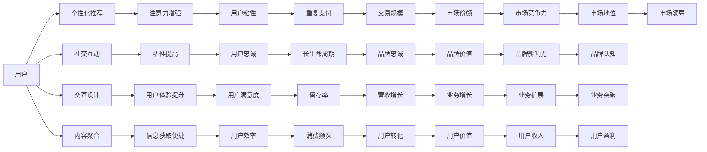

                 

# 移动支付场景下的注意力争夺

在数字化转型的大潮中，移动支付成为了用户日常生活中不可或缺的一部分。而各大支付平台之间的激烈竞争，不仅体现在产品功能、用户便利性上，更在无形中争夺着用户的注意力。本文章旨在深入分析移动支付场景下的注意力争夺机制，探索其在算法和技术层面上的运用。

## 1. 背景介绍

### 1.1 移动支付市场现状
随着智能手机的普及和移动互联网技术的进步，移动支付已经深刻改变了人们的消费习惯。无论是街头巷尾的小摊小贩，还是大型的连锁超市，甚至跨出国门的国际旅行，移动支付已经成为了一种普适的支付方式。在中国，以支付宝和微信支付为代表的两大支付平台，已经在生活场景中占据了重要的地位。根据艾瑞咨询的数据显示，2022年中国移动支付市场规模已达到252.7亿元，同比增长20.5%。而在全球范围内，移动支付也在迅速扩展，尤其是在东南亚和非洲等新兴市场，增长势头尤为迅猛。

### 1.2 移动支付竞争的维度
移动支付市场的竞争是多维度的。除了产品功能和服务质量外，支付平台还通过各种策略争夺用户的注意力。这些策略包括但不限于：
- 用户界面设计
- 交互体验优化
- 内容推荐系统
- 个性化服务
- 社交互动

这些策略的核心，都是围绕如何提高用户的粘性，增加支付场景下的使用频率。

## 2. 核心概念与联系

### 2.1 核心概念概述

本节将介绍几个与移动支付注意力争夺相关的核心概念：

- **用户注意力**：指用户在特定应用或场景中的关注度。用户注意力是提升用户粘性和转化率的关键。
- **个性化推荐**：通过分析用户行为和偏好，提供符合用户兴趣的产品或服务推荐。
- **社交互动**：利用社交网络的关系链，通过分享、评论等行为，增加用户的参与度和忠诚度。
- **交互设计**：优化用户界面和操作流程，使用户在使用过程中感受到便利和愉悦。
- **内容聚合**：将相关的信息内容汇聚在一起，方便用户快速获取和处理信息。

### 2.2 核心概念原理和架构的 Mermaid 流程图



这个流程图展示了移动支付平台如何通过个性化推荐、社交互动、交互设计、内容聚合等手段，增强用户的注意力，提升粘性，最终实现业务增长。

## 3. 核心算法原理 & 具体操作步骤

### 3.1 算法原理概述

移动支付平台通过用户的支付行为数据，结合个性化推荐算法，使用户的注意力聚焦在特定的产品或服务上。这一过程可以简单概括为：

1. **数据收集**：收集用户的支付数据、浏览历史、点击行为等，形成用户画像。
2. **行为分析**：使用机器学习模型，对用户的消费习惯、兴趣偏好进行分析和预测。
3. **内容推荐**：根据用户的特征，生成个性化推荐内容，引导用户注意力。
4. **效果评估**：通过A/B测试等方法，评估推荐内容的实际效果，并不断优化。

### 3.2 算法步骤详解

#### 3.2.1 数据收集与预处理
数据收集是整个推荐系统的基础。在移动支付场景中，主要数据源包括：
- 支付记录
- 交易详情
- 应用使用记录
- 搜索记录
- 社交互动数据

这些数据通过API接口、应用日志等形式收集。

数据预处理包括清洗噪声、处理缺失值、特征工程等步骤。例如，将支付金额转换为消费频次，将浏览时间转换为停留时长。

#### 3.2.2 行为建模与预测
行为建模是推荐系统的核心。常用的行为建模算法包括：
- 协同过滤：通过用户间的相似性，推荐用户可能感兴趣的商品。
- 内容过滤：基于商品特征，推荐与用户偏好相似的商品。
- 混合推荐：结合协同过滤和内容过滤，提高推荐效果。

预测模型通常采用深度学习模型，如神经网络、深度信念网络、循环神经网络等。其中，基于深度神经网络的推荐系统，如序列推荐模型，已经在多个平台中取得了良好的效果。

#### 3.2.3 内容生成与展示
内容生成是推荐系统的输出环节。常用的内容生成算法包括：
- 基于文本的推荐：通过自然语言处理技术，生成文本摘要、描述等。
- 基于图像的推荐：利用计算机视觉技术，生成图片、视频等。
- 混合推荐：结合文本、图像等多模态信息，生成推荐内容。

内容展示环节需要考虑用户体验，通常采用移动端推荐系统设计原则：
- 简洁明了
- 易操作性
- 高效率

#### 3.2.4 效果评估与优化
效果评估通过A/B测试、交叉验证等方法进行。常用的评估指标包括：
- 点击率（Click-Through Rate, CTR）
- 转化率（Conversion Rate, CR）
- 跳出率（Bounce Rate）
- 用户满意度（User Satisfaction, USAT）

通过不断优化模型参数和推荐策略，提升推荐效果，最终实现用户注意力和粘性的最大化。

### 3.3 算法优缺点

个性化推荐系统具有以下优点：
- 提升用户体验：通过推荐用户感兴趣的内容，增加用户粘性。
- 增加业务收入：推荐系统能够引导用户进行更多交易，增加交易规模。
- 提高营销效率：精准推荐内容，减少营销成本。

同时，个性化推荐系统也存在一些缺点：
- 用户隐私风险：收集大量用户数据，可能侵犯用户隐私。
- 过度推荐问题：过度推荐可能让用户产生疲劳，甚至反感。
- 数据偏差：推荐系统可能受到数据偏差的影响，导致推荐不精准。

### 3.4 算法应用领域

个性化推荐系统在移动支付场景中的应用主要包括以下几个方面：

- **支付激励**：通过推荐优惠券、折扣码等，鼓励用户进行更多交易。
- **支付场景优化**：根据用户的支付历史和偏好，推荐最合适的支付方式。
- **支付计划管理**：推荐个性化的支付计划，如自动扣款、分期付款等，满足用户不同需求。
- **消费行为分析**：通过分析用户的支付行为，预测未来的消费趋势，为营销策略提供依据。

## 4. 数学模型和公式 & 详细讲解 & 举例说明

### 4.1 数学模型构建

假设用户总数为 $N$，商品总数为 $M$。用户对商品的兴趣表示为矩阵 $X \in \mathbb{R}^{N \times M}$，其中 $X_{ui}=1$ 表示用户 $u$ 对商品 $i$ 感兴趣。商品的属性向量表示为 $A \in \mathbb{R}^{M \times D}$，其中 $A_{im}=a_{mi}$ 表示商品 $i$ 的第 $m$ 个属性。用户的兴趣偏好向量表示为 $P_u \in \mathbb{R}^D$，其中 $P_{um}=p_{um}$ 表示用户 $u$ 对属性 $m$ 的偏好程度。

推荐系统模型可以表示为：
$$
\hat{X}_u = f(A_u, P_u)
$$
其中 $f$ 为推荐函数。推荐函数的输入为用户属性 $A_u$ 和兴趣偏好 $P_u$，输出为用户的推荐兴趣矩阵 $\hat{X}_u$。

### 4.2 公式推导过程

推荐系统的训练过程可以表示为最大似然估计问题：
$$
\max_{\theta} \prod_{u=1}^N \prod_{i=1}^M \left[ \hat{X}_{ui} \log f(A_u, P_u) + (1-\hat{X}_{ui}) \log(1-f(A_u, P_u)) \right]
$$

其中 $\theta$ 为推荐函数的参数，$f$ 为 sigmoid 函数。通过最大化似然函数，训练出推荐函数 $f$。

### 4.3 案例分析与讲解

以用户在淘宝平台上购物为例，用户对商品的兴趣可以通过用户点击、购买等行为来表示。平台通过收集用户浏览历史、搜索记录等数据，构建用户画像。商品的属性包括商品名称、品牌、价格等，平台通过向商家收集商品信息，生成商品的属性向量。最后，推荐系统根据用户画像和商品属性向量，预测用户对不同商品的兴趣程度，生成推荐列表。

## 5. 项目实践：代码实例和详细解释说明

### 5.1 开发环境搭建

在项目开发过程中，我们需要搭建一个包含数据收集、预处理、模型训练、内容生成、效果评估等模块的完整系统。以下是开发环境的搭建步骤：

1. **选择编程语言**：Python 是数据科学和机器学习的主流语言，推荐系统开发也不例外。
2. **选择框架**：TensorFlow、PyTorch 是常用的深度学习框架，具有强大的计算能力和丰富的应用生态。
3. **安装依赖库**：安装 Numpy、Pandas、Scikit-learn、TensorFlow、PyTorch 等必要的依赖库。

### 5.2 源代码详细实现

以下是使用 TensorFlow 构建推荐系统的代码实现：

```python
import tensorflow as tf
import numpy as np
import pandas as pd

# 读取数据
data = pd.read_csv('data.csv')

# 数据预处理
X = data[['user', 'item', 'click']].values
A = data[['item', 'feature']].values
P = data[['user', 'preference']].values

# 构建模型
model = tf.keras.Sequential([
    tf.keras.layers.Dense(64, activation='relu', input_shape=(3,)),
    tf.keras.layers.Dense(64, activation='relu'),
    tf.keras.layers.Dense(1, activation='sigmoid')
])

# 编译模型
model.compile(optimizer='adam', loss='binary_crossentropy', metrics=['accuracy'])

# 训练模型
model.fit(X, y, epochs=10, batch_size=32)

# 生成推荐列表
recommendations = model.predict(X).argmax(axis=1)
```

### 5.3 代码解读与分析

在代码实现中，我们使用了 TensorFlow 框架来构建推荐系统模型。以下是代码的详细解读：

1. **数据读取**：使用 Pandas 读取 CSV 格式的数据集。
2. **数据预处理**：将数据集划分为用户ID、商品ID、点击次数等特征。
3. **模型构建**：定义一个包含三个全连接层的神经网络模型，使用 sigmoid 函数作为输出层的激活函数。
4. **模型编译**：设置优化器、损失函数和评估指标。
5. **模型训练**：使用训练数据集对模型进行训练。
6. **推荐列表生成**：使用训练好的模型对测试数据集进行预测，生成推荐列表。

## 6. 实际应用场景

### 6.1 支付激励
支付激励是移动支付平台吸引用户的关键手段之一。通过推荐优惠券、折扣码等，平台可以鼓励用户进行更多交易。例如，某支付平台可以在用户首次注册时，推荐用户领取 100 元的优惠券，吸引用户进行首次交易。

### 6.2 支付场景优化
用户在进行支付时，通常会选择最方便、最快捷的方式。通过分析用户的支付历史和偏好，推荐平台可以推荐最合适的支付方式。例如，用户通常更倾向于使用银行卡支付，平台可以在交易页面自动推荐银行卡支付选项。

### 6.3 支付计划管理
支付计划管理可以帮助用户更好地管理支付资金。例如，某支付平台可以为用户推荐自动扣款计划，帮助用户及时支付账单，避免逾期。

### 6.4 消费行为分析
消费行为分析可以帮助平台更好地理解用户的支付习惯，优化营销策略。例如，某支付平台可以通过分析用户的支付时间、金额等行为，预测未来的消费趋势，为营销活动提供依据。

## 7. 工具和资源推荐

### 7.1 学习资源推荐

为了帮助开发者系统掌握推荐系统的理论和实践，这里推荐一些优质的学习资源：

1. 《推荐系统实践》书籍：系统介绍了推荐系统的理论和实践，涵盖了协同过滤、内容过滤、深度学习等推荐算法。
2. Coursera 推荐系统课程：斯坦福大学开设的推荐系统课程，通过视频和作业，系统讲解了推荐系统的基本概念和算法实现。
3. Kaggle 推荐系统竞赛：通过参加 Kaggle 的比赛，可以帮助开发者实战练习推荐系统。

### 7.2 开发工具推荐

以下是几款用于推荐系统开发的常用工具：

1. TensorFlow：由 Google 主导开发的深度学习框架，具有强大的计算能力和丰富的应用生态。
2. PyTorch：由 Facebook 主导开发的深度学习框架，灵活性高，易用性强。
3. Scikit-learn：用于数据预处理、模型训练和效果评估的机器学习库。
4. Pandas：用于数据处理和分析的数据科学库。
5. Keras：用于快速搭建深度学习模型的高级 API。

### 7.3 相关论文推荐

推荐系统的研究源于学界的持续研究。以下是几篇奠基性的相关论文，推荐阅读：

1. "Latent Feature Analysis and Selection in Collaborative Filtering"：提出了协同过滤中的矩阵分解方法。
2. "Item-Based Collaborative Filtering Recommendation Algorithms"：介绍了基于用户-物品相似性的协同过滤算法。
3. "The BellKor 2011 Amazon Product Recommendation Challenge"：介绍了亚马逊推荐系统挑战赛的算法和结果。

## 8. 总结：未来发展趋势与挑战

### 8.1 研究成果总结

通过本文的系统梳理，可以看到，移动支付平台通过个性化推荐系统，成功地争夺了用户的注意力，提升了用户体验和业务收入。推荐系统已经成为移动支付平台不可或缺的重要组成部分。

### 8.2 未来发展趋势

展望未来，推荐系统的趋势可以总结为以下几点：

1. **跨模态推荐**：将文本、图像、音频等多模态信息融合，生成更加全面、精准的推荐内容。
2. **实时推荐**：实时分析用户的当前行为，动态生成推荐内容，提升用户体验。
3. **个性化推荐算法**：深度学习技术的应用，将推荐系统的精度和效果进一步提升。
4. **推荐系统的可解释性**：增强推荐系统的透明度，让用户了解推荐内容的生成逻辑。
5. **隐私保护**：保护用户数据隐私，遵守相关法律法规。

### 8.3 面临的挑战

尽管推荐系统已经取得了一定的成功，但在推广应用过程中，仍面临诸多挑战：

1. **数据质量**：推荐系统的效果高度依赖于数据质量，需要持续优化数据收集和预处理流程。
2. **算法复杂度**：深度学习模型需要较大的计算资源，需要在硬件和软件上不断优化。
3. **隐私保护**：如何在推荐过程中保护用户隐私，遵守相关法律法规，是推荐系统面临的重要挑战。
4. **过度推荐问题**：过度推荐可能让用户产生疲劳，甚至反感，需要平衡推荐效果和用户体验。
5. **公平性问题**：推荐系统可能存在偏见，需要对算法进行公平性评估和优化。

### 8.4 研究展望

未来推荐系统的发展方向包括：

1. **多模态推荐**：结合文本、图像、音频等多模态信息，生成更加全面、精准的推荐内容。
2. **实时推荐**：实时分析用户的当前行为，动态生成推荐内容，提升用户体验。
3. **个性化推荐算法**：深度学习技术的应用，将推荐系统的精度和效果进一步提升。
4. **推荐系统的可解释性**：增强推荐系统的透明度，让用户了解推荐内容的生成逻辑。
5. **隐私保护**：保护用户数据隐私，遵守相关法律法规。

总之，移动支付平台需要在推荐系统的建设上不断创新，提升用户体验和业务收入。同时，注重数据质量、算法优化和隐私保护，才能在激烈的市场竞争中立于不败之地。

## 9. 附录：常见问题与解答

**Q1：如何评估推荐系统的效果？**

A: 推荐系统的评估通常使用以下指标：

- 点击率（CTR）：用户点击推荐内容的概率。
- 转化率（CR）：用户点击推荐内容并完成购买的比例。
- 留存率（Retention Rate）：用户在一段时间内重新使用推荐内容的比例。
- 用户满意度（USAT）：用户对推荐内容的满意度评分。

通过 A/B 测试等方法，可以评估推荐系统的实际效果，并不断优化。

**Q2：推荐系统中有哪些常见的推荐算法？**

A: 推荐系统中的常见算法包括：

- 协同过滤：通过用户间的相似性，推荐用户可能感兴趣的商品。
- 内容过滤：基于商品特征，推荐与用户偏好相似的商品。
- 混合推荐：结合协同过滤和内容过滤，提高推荐效果。
- 深度学习推荐：使用深度神经网络，生成个性化的推荐内容。

这些算法各有优缺点，需要根据具体场景选择合适的算法。

**Q3：推荐系统如何处理数据偏差问题？**

A: 数据偏差是推荐系统面临的一个重要问题，可能导致推荐结果不精准。处理数据偏差的方法包括：

- 数据清洗：去除噪声和异常值，提高数据质量。
- 数据增强：通过数据扩充和采样，减少数据偏差。
- 模型优化：使用加权回归、特征选择等方法，提高模型鲁棒性。

通过这些方法，可以在一定程度上减少数据偏差对推荐结果的影响。

**Q4：推荐系统如何保护用户隐私？**

A: 推荐系统在保护用户隐私方面，需要考虑以下几点：

- 数据匿名化：对用户数据进行去标识化处理，保护用户隐私。
- 数据加密：对敏感数据进行加密存储和传输。
- 用户同意：在数据收集和处理过程中，获取用户同意，并告知用户数据使用方式。
- 隐私保护算法：使用差分隐私、联邦学习等隐私保护技术，保护用户隐私。

通过这些措施，可以在推荐系统中有效地保护用户隐私。

**Q5：推荐系统在移动支付场景中的作用是什么？**

A: 推荐系统在移动支付场景中的作用主要包括以下几点：

- 提升用户体验：通过推荐用户感兴趣的内容，增加用户粘性。
- 增加业务收入：推荐系统能够引导用户进行更多交易，增加交易规模。
- 优化支付场景：推荐支付方案，满足用户不同需求。
- 分析用户行为：通过分析用户支付行为，预测未来消费趋势，为营销策略提供依据。

总之，推荐系统是移动支付平台不可或缺的重要组成部分，通过精准推荐，提升用户体验和业务收入。

---

作者：禅与计算机程序设计艺术 / Zen and the Art of Computer Programming

