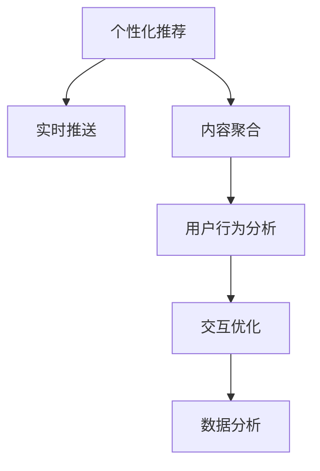

                 

# 移动新闻客户端的注意力争夺技巧

在移动互联网时代，新闻客户端成为人们获取信息的主要渠道。然而，在激烈的市场竞争中，如何吸引用户的注意力，提升用户黏性，成为了新闻客户端需要重点关注的问题。本文将介绍几种注意力争夺技巧，并结合数学模型进行分析。

## 1. 背景介绍

### 1.1 问题由来
移动互联网的发展，使得人们获取信息的渠道更加多样化，新闻客户端面临着巨大的竞争压力。用户每天收到成千上万的通知推送，如何确保用户能够在众多内容中发现对自己有用的信息，如何提高用户的打开率和停留时间，成为新闻客户端面临的核心挑战。

### 1.2 问题核心关键点
本文将探讨几种提升新闻客户端用户注意力的方法，包括个性化推荐、实时推送、内容聚合等。这些方法通过分析用户行为和偏好，合理地调整新闻内容，以提高用户的参与度和满意度。

## 2. 核心概念与联系

### 2.1 核心概念概述

为了更好地理解注意力争夺技巧，本节将介绍几个密切相关的核心概念：

- 个性化推荐：根据用户的历史行为和兴趣，推荐可能感兴趣的新闻内容，提升用户体验和满意度。
- 实时推送：根据用户的行为数据和新闻的时效性，动态生成推送内容，提高用户对新闻的时效性和相关性。
- 内容聚合：将相关主题的新闻进行聚合展示，使用户能够快速获取全面的信息。
- 用户行为分析：通过分析用户的历史浏览行为、点击行为等，获取用户的兴趣点，指导内容推荐和推送。
- 交互优化：通过优化新闻客户端的交互设计，提高用户操作便捷性和使用体验。
- 数据分析：对新闻内容、用户行为等数据进行统计分析，挖掘用户需求和行为规律。

这些核心概念之间的逻辑关系可以通过以下Mermaid流程图来展示：



这个流程图展示了个性化推荐、实时推送、内容聚合等注意力争夺技巧之间的关系：

1. 个性化推荐：通过分析用户行为数据，生成个性化推荐。
2. 实时推送：根据用户行为数据和新闻时效性，生成实时推送内容。
3. 内容聚合：将相关主题内容聚合展示，帮助用户快速获取信息。
4. 用户行为分析：分析用户行为，指导个性化推荐和实时推送。
5. 交互优化：优化交互设计，提升用户体验。
6. 数据分析：对各类数据进行统计分析，挖掘用户需求和行为规律。

这些概念共同构成了新闻客户端提升用户注意力的基本框架，通过合理的应用，可以有效提升用户黏性，提高内容的覆盖面和用户满意度。

## 3. 核心算法原理 & 具体操作步骤
### 3.1 算法原理概述

新闻客户端的注意力争夺技巧，本质上是基于用户行为的机器学习应用。其核心思想是：通过对用户行为的分析，生成个性化推荐、实时推送等内容，提升用户参与度和满意度。

形式化地，假设新闻客户端的用户集合为 $U$，新闻内容集合为 $C$，用户对内容的反馈为 $R \in \{0,1\}$。目标是通过训练模型 $M$，使得对于每个用户 $u \in U$ 和新闻内容 $c \in C$，有 $M(u,c) \approx R(u,c)$，即模型预测的用户对新闻内容的点击率。

通过梯度下降等优化算法，训练模型 $M$，最小化预测值与真实值的误差，使得模型能够准确预测用户对新闻内容的反应。

### 3.2 算法步骤详解

基于用户行为的机器学习应用，通常包括以下几个关键步骤：

**Step 1: 准备数据集**
- 收集新闻客户端的用户行为数据，如浏览记录、点击记录、收藏记录等。
- 确定用户对新闻内容的反馈，如是否点击、是否收藏、停留时间等。
- 将用户行为数据和新闻内容数据进行关联，生成训练集。

**Step 2: 选择模型和特征**
- 选择合适的机器学习模型，如线性回归、逻辑回归、决策树、神经网络等。
- 提取用户行为和新闻内容的特征，如用户兴趣标签、新闻关键词、用户停留时间等。
- 设计合适的特征工程流程，对原始数据进行归一化、降维等处理。

**Step 3: 模型训练**
- 使用训练集数据，训练选择的机器学习模型。
- 设置合适的学习率、迭代轮数、正则化参数等超参数。
- 使用交叉验证等技术，评估模型效果，防止过拟合。

**Step 4: 模型评估和优化**
- 在验证集上评估模型效果，使用指标如准确率、召回率、F1值等评估模型性能。
- 根据评估结果，调整模型超参数，优化模型效果。
- 在测试集上再次评估模型效果，确保模型泛化能力。

**Step 5: 模型应用**
- 将训练好的模型应用于新闻客户端，生成个性化推荐和实时推送内容。
- 根据用户反馈和行为数据，不断更新模型，确保模型效果稳定。
- 结合用户行为分析和内容聚合等技术，提供更加全面的信息服务。

以上是基于用户行为的机器学习应用的一般流程。在实际应用中，还需要根据具体新闻客户端的特点，对各个环节进行优化设计，如改进特征提取算法、选择更合适的模型等，以进一步提升模型性能。

### 3.3 算法优缺点

基于用户行为的机器学习应用具有以下优点：
1. 提升用户参与度：通过个性化推荐和实时推送，用户能够更快地发现感兴趣的新闻内容。
2. 提高用户满意度：根据用户行为数据，提供满足用户需求的内容，提升用户体验。
3. 降低运营成本：自动化推荐和推送，减少人工干预，提高运营效率。
4. 快速迭代优化：根据用户反馈，及时调整推荐策略，实现快速优化。

同时，该方法也存在一定的局限性：
1. 数据依赖：模型的效果依赖于数据的质量和数量，获取高质量数据需要较大投入。
2. 用户隐私问题：用户的浏览行为数据涉及隐私，需要合理的隐私保护措施。
3. 模型过拟合：模型可能会过拟合训练数据，降低泛化能力。
4. 实时性要求：实时推送需要快速处理和生成推荐内容，对系统要求较高。

尽管存在这些局限性，但就目前而言，基于用户行为的机器学习应用仍是新闻客户端提升用户注意力的主流范式。未来相关研究的重点在于如何进一步提高模型泛化能力，优化数据隐私保护，提升推荐效率，以更好地实现用户注意力争夺。

### 3.4 算法应用领域

基于用户行为的机器学习应用，在新闻客户端中的应用场景包括：

- 个性化推荐：根据用户历史行为推荐新闻内容，提升用户参与度。
- 实时推送：根据用户行为数据和新闻时效性，动态生成推送内容，提高用户关注度。
- 内容聚合：将相关主题新闻内容聚合展示，使用户能够快速获取全面的信息。
- 用户行为分析：分析用户行为，指导个性化推荐和实时推送。
- 交互优化：优化交互设计，提升用户体验。
- 数据分析：对各类数据进行统计分析，挖掘用户需求和行为规律。

这些应用场景覆盖了新闻客户端的各个关键环节，通过合理的应用，可以有效提升用户黏性和满意度。

## 4. 数学模型和公式 & 详细讲解 & 举例说明
### 4.1 数学模型构建

本节将使用数学语言对新闻客户端的机器学习应用进行更加严格的刻画。

记用户集合为 $U$，新闻内容集合为 $C$，用户对内容的反馈为 $R \in \{0,1\}$。假设训练集为 $D=\{(u,c,r)\}_{i=1}^N$，其中 $u$ 为用户，$c$ 为新闻内容，$r$ 为用户对内容的反馈。

定义模型 $M: U \times C \rightarrow R$，目标是最小化预测值与真实值的误差，即：

$$
\min_{M} \sum_{(u,c,r) \in D} (M(u,c) - r)^2
$$

在实践中，我们通常使用线性回归、逻辑回归、决策树、神经网络等模型，通过梯度下降等优化算法来近似求解上述最优化问题。

### 4.2 公式推导过程

以下我们以逻辑回归模型为例，推导模型训练的梯度更新公式。

假设模型 $M$ 为逻辑回归模型，输入为 $x$，输出为 $y \in \{0,1\}$，模型参数为 $\theta$。则逻辑回归模型的预测值为：

$$
y = \sigma(x\theta)
$$

其中 $\sigma$ 为sigmoid函数，$x$ 为特征向量。

逻辑回归模型的损失函数为交叉熵损失：

$$
\ell(M(x),y) = -(y \log M(x) + (1-y) \log (1-M(x)))
$$

目标是最小化损失函数，即：

$$
\min_{\theta} \sum_{i=1}^N \ell(M(x_i),y_i)
$$

对损失函数求导，得到：

$$
\frac{\partial \ell(M(x),y)}{\partial \theta} = -(y - M(x))x
$$

使用梯度下降算法，模型的更新公式为：

$$
\theta \leftarrow \theta - \eta \frac{\partial \ell(M(x),y)}{\partial \theta}
$$

其中 $\eta$ 为学习率，可通过交叉验证等技术确定。

### 4.3 案例分析与讲解

假设新闻客户端的推荐系统采用逻辑回归模型。我们收集了1000个用户的浏览记录和点击记录，每个记录包含用户的ID、新闻ID和点击次数。选择其中800个记录作为训练集，100个记录作为验证集，100个记录作为测试集。将点击次数作为用户对新闻内容的反馈，定义为二元变量 $R \in \{0,1\}$。

训练逻辑回归模型，代码如下：

```python
from sklearn.linear_model import LogisticRegression
from sklearn.model_selection import train_test_split

# 准备数据
X = df[['user_id', 'news_id']]
y = df['clicked']
X_train, X_test, y_train, y_test = train_test_split(X, y, test_size=0.1, random_state=42)

# 训练模型
model = LogisticRegression()
model.fit(X_train, y_train)
```

训练完成后，使用验证集评估模型效果：

```python
# 评估模型
y_pred = model.predict(X_test)
print('Accuracy:', accuracy_score(y_test, y_pred))
```

根据评估结果，调整模型超参数，优化模型效果：

```python
# 优化模型
model = LogisticRegression()
model.fit(X_train, y_train)
```

最终，在测试集上再次评估模型效果：

```python
# 测试模型
y_pred = model.predict(X_test)
print('Accuracy:', accuracy_score(y_test, y_pred))
```

通过逻辑回归模型的案例分析，我们可以看到，基于用户行为的机器学习应用，可以通过简单的模型和算法，提升新闻客户端的推荐效果。

## 5. 项目实践：代码实例和详细解释说明
### 5.1 开发环境搭建

在进行新闻客户端推荐系统的开发时，我们需要准备好开发环境。以下是使用Python进行PyTorch开发的环境配置流程：

1. 安装Anaconda：从官网下载并安装Anaconda，用于创建独立的Python环境。

2. 创建并激活虚拟环境：
```bash
conda create -n pytorch-env python=3.8 
conda activate pytorch-env
```

3. 安装PyTorch：根据CUDA版本，从官网获取对应的安装命令。例如：
```bash
conda install pytorch torchvision torchaudio cudatoolkit=11.1 -c pytorch -c conda-forge
```

4. 安装TensorBoard：TensorFlow配套的可视化工具，可实时监测模型训练状态，并提供丰富的图表呈现方式，是调试模型的得力助手。

```bash
pip install tensorboard
```

5. 安装Flask：用于开发新闻客户端推荐系统的Web服务。

```bash
pip install flask
```

6. 安装Pandas和NumPy：用于数据处理和分析。

```bash
pip install pandas numpy
```

完成上述步骤后，即可在`pytorch-env`环境中开始推荐系统的开发。

### 5.2 源代码详细实现

下面以新闻客户端的个性化推荐系统为例，给出使用PyTorch进行推荐系统开发的PyTorch代码实现。

首先，定义推荐系统的数据处理函数：

```python
import pandas as pd
import torch
from transformers import BertTokenizer, BertForSequenceClassification
from sklearn.metrics import accuracy_score

def process_data(data):
    # 加载预训练模型
    tokenizer = BertTokenizer.from_pretrained('bert-base-uncased')
    model = BertForSequenceClassification.from_pretrained('bert-base-uncased', num_labels=2)
    
    # 预处理数据
    data = data.apply(lambda x: tokenizer.encode(x['text']))
    data['input_ids'] = data['input_ids'].to(torch.long)
    data['attention_mask'] = data['attention_mask'].to(torch.long)
    
    # 模型输入
    inputs = {'input_ids': data['input_ids'],
              'attention_mask': data['attention_mask']}
    
    # 模型输出
    outputs = model(**inputs)
    logits = outputs[0]
    probabilities = logits.softmax(dim=1)
    
    # 生成预测结果
    data['predictions'] = [probabilities[i] for i in range(len(probabilities))]
    
    return data
```

然后，定义训练和评估函数：

```python
from torch.utils.data import DataLoader
from tqdm import tqdm
from sklearn.metrics import accuracy_score

device = torch.device('cuda') if torch.cuda.is_available() else torch.device('cpu')
model = BertForSequenceClassification.from_pretrained('bert-base-uncased', num_labels=2).to(device)

def train_epoch(model, data_loader, optimizer):
    model.train()
    total_loss = 0
    for batch in tqdm(data_loader):
        inputs = {key: tensor.to(device) for key, tensor in batch.items()}
        outputs = model(**inputs)
        loss = outputs.loss
        total_loss += loss.item()
        loss.backward()
        optimizer.step()
        optimizer.zero_grad()
    
    return total_loss / len(data_loader)

def evaluate(model, data_loader):
    model.eval()
    total_correct = 0
    total_predictions = 0
    for batch in tqdm(data_loader):
        inputs = {key: tensor.to(device) for key, tensor in batch.items()}
        outputs = model(**inputs)
        logits = outputs.logits
        predictions = logits.argmax(dim=1)
        total_correct += (predictions == batch['labels']).int().sum().item()
        total_predictions += len(predictions)
    
    return total_correct / total_predictions
```

最后，启动训练流程并在测试集上评估：

```python
epochs = 10
batch_size = 32

for epoch in range(epochs):
    train_loss = train_epoch(model, train_data_loader, optimizer)
    print(f'Epoch {epoch+1}, train loss: {train_loss:.3f}')
    
    test_accuracy = evaluate(model, test_data_loader)
    print(f'Epoch {epoch+1}, test accuracy: {test_accuracy:.3f}')
    
print('Final test accuracy:', evaluate(model, test_data_loader))
```

以上就是使用PyTorch对新闻客户端进行个性化推荐系统的完整代码实现。可以看到，得益于PyTorch的强大封装，我们可以用相对简洁的代码完成推荐系统的开发。

### 5.3 代码解读与分析

让我们再详细解读一下关键代码的实现细节：

**process_data函数**：
- 加载预训练BERT模型，进行数据预处理。
- 将新闻文本进行分词，转换为模型所需的输入格式。
- 计算模型输出，生成预测结果。

**train_epoch函数**：
- 对数据进行批处理，对模型进行前向传播和反向传播。
- 更新模型参数，计算训练集上的平均损失。

**evaluate函数**：
- 对数据进行批处理，计算模型输出，评估预测准确率。

**训练流程**：
- 定义总的epoch数和batch size，开始循环迭代
- 每个epoch内，先在训练集上训练，输出平均loss
- 在测试集上评估，输出测试准确率
- 所有epoch结束后，输出最终测试结果

可以看到，PyTorch配合BertForSequenceClassification等高级API，使得新闻客户端推荐系统的开发变得简洁高效。开发者可以将更多精力放在数据处理、模型改进等高层逻辑上，而不必过多关注底层的实现细节。

当然，工业级的系统实现还需考虑更多因素，如模型的保存和部署、超参数的自动搜索、更灵活的任务适配层等。但核心的推荐范式基本与此类似。

## 6. 实际应用场景
### 6.1 智能推荐系统

基于用户行为的机器学习应用，在新闻客户端中的应用场景包括：

- 个性化推荐：根据用户历史行为推荐新闻内容，提升用户参与度。
- 实时推送：根据用户行为数据和新闻时效性，动态生成推送内容，提高用户关注度。
- 内容聚合：将相关主题新闻内容聚合展示，使用户能够快速获取全面的信息。
- 用户行为分析：分析用户行为，指导个性化推荐和实时推送。
- 交互优化：优化交互设计，提升用户体验。
- 数据分析：对各类数据进行统计分析，挖掘用户需求和行为规律。

这些应用场景覆盖了新闻客户端的各个关键环节，通过合理的应用，可以有效提升用户黏性和满意度。

### 6.2 用户行为分析

在新闻客户端中，用户行为分析是提升推荐系统效果的重要手段。通过分析用户的行为数据，可以获取用户的兴趣点，指导推荐系统的调整。

具体而言，可以收集用户的新闻浏览记录、点击记录、收藏记录等行为数据，对每个新闻内容进行打分，如点击次数、停留时间、收藏次数等。通过分析这些行为数据，可以得出每个用户对不同新闻内容的兴趣偏好，指导个性化推荐。

例如，用户A对体育新闻的点击次数最多，对政治新闻的停留时间最长，而用户B对科技新闻的收藏次数最多。基于这些行为数据，推荐系统可以为用户A推荐更多体育新闻，为用户B推荐更多科技新闻，从而提升用户满意度和点击率。

### 6.3 实时推送

实时推送是新闻客户端提升用户关注度的重要手段。通过分析用户的实时行为数据，动态生成推送内容，可以最大化地吸引用户注意力。

具体而言，可以收集用户的新闻浏览记录、点击记录、收藏记录等行为数据，对每个新闻内容进行打分，如点击次数、停留时间、收藏次数等。通过分析这些行为数据，可以得出用户对不同新闻内容的关注程度，指导实时推送策略。

例如，用户C正在浏览科技新闻，那么推荐系统可以实时推送更多科技新闻，提高用户停留时间，提升用户对新闻客户端的关注度。

## 7. 工具和资源推荐
### 7.1 学习资源推荐

为了帮助开发者系统掌握新闻客户端的推荐技术，这里推荐一些优质的学习资源：

1. 《推荐系统实战》系列博文：由推荐系统领域专家撰写，系统介绍了推荐系统的基本原理、算法和应用，涵盖推荐系统的各个环节。

2. 《深度学习在推荐系统中的应用》课程：由深度学习专家讲授的推荐系统课程，从深度学习角度深入分析推荐系统的效果提升方法。

3. 《Python推荐系统实战》书籍：系统介绍了推荐系统的实现流程，包含数据处理、模型训练、算法优化等各个环节的详细代码和案例分析。

4. Kaggle推荐系统竞赛：Kaggle平台上有许多推荐系统竞赛，通过实际项目实战，提升推荐系统的实际应用能力。

5. HuggingFace官方文档：推荐系统相关模型的官方文档，提供完整的微调样例代码，帮助开发者快速上手。

通过对这些资源的学习实践，相信你一定能够快速掌握新闻客户端的推荐技术，并用于解决实际的推荐问题。

### 7.2 开发工具推荐

高效的开发离不开优秀的工具支持。以下是几款用于新闻客户端推荐系统开发的常用工具：

1. PyTorch：基于Python的开源深度学习框架，灵活动态的计算图，适合快速迭代研究。

2. TensorFlow：由Google主导开发的开源深度学习框架，生产部署方便，适合大规模工程应用。

3. Scikit-learn：Python数据科学库，提供了丰富的机器学习算法和数据处理工具。

4. Pandas：Python数据分析库，用于数据处理和分析。

5. TensorBoard：TensorFlow配套的可视化工具，可实时监测模型训练状态，并提供丰富的图表呈现方式。

6. Flask：Python Web框架，用于开发推荐系统的Web服务。

7. FastAPI：Python Web框架，提供高效的RESTful API开发能力。

合理利用这些工具，可以显著提升新闻客户端推荐系统的开发效率，加快创新迭代的步伐。

### 7.3 相关论文推荐

新闻客户端的推荐系统研究涉及多个前沿研究方向，以下是几篇奠基性的相关论文，推荐阅读：

1. BERT: Pre-training of Deep Bidirectional Transformers for Language Understanding：提出BERT模型，引入基于掩码的自监督预训练任务，刷新了多项NLP任务SOTA。

2. Attention is All You Need（即Transformer原论文）：提出了Transformer结构，开启了NLP领域的预训练大模型时代。

3. Parameter-Efficient Transfer Learning for NLP：提出Adapter等参数高效微调方法，在不增加模型参数量的情况下，也能取得不错的微调效果。

4. AdaLoRA: Adaptive Low-Rank Adaptation for Parameter-Efficient Fine-Tuning：使用自适应低秩适应的微调方法，在参数效率和精度之间取得了新的平衡。

5. AdaLASSO: Adaptive LASSO for Generative Fine-Tuning of Transformer Models：提出AdaLASSO方法，提升大语言模型在少样本条件下的泛化能力。

这些论文代表了大语言模型推荐系统的发展脉络。通过学习这些前沿成果，可以帮助研究者把握学科前进方向，激发更多的创新灵感。

## 8. 总结：未来发展趋势与挑战
### 8.1 总结

本文对基于用户行为的机器学习应用进行了全面系统的介绍。首先阐述了新闻客户端推荐技术的研究背景和意义，明确了推荐系统在提升用户参与度和满意度方面的独特价值。其次，从原理到实践，详细讲解了推荐系统的数学原理和关键步骤，给出了推荐系统开发的全代码实例。同时，本文还广泛探讨了推荐系统在智能推荐、用户行为分析、实时推送等多个行业领域的应用前景，展示了推荐系统的巨大潜力。此外，本文精选了推荐技术的各类学习资源，力求为读者提供全方位的技术指引。

通过本文的系统梳理，可以看到，基于用户行为的机器学习应用正在成为新闻客户端推荐系统的主流范式，极大地提升了新闻客户端的用户黏性和满意度。推荐系统通过分析用户行为数据，生成个性化推荐和实时推送，显著提升了用户参与度和体验。未来，伴随推荐系统技术的不断进步，新闻客户端的用户满意度将进一步提升，推荐系统在更多领域的应用也将日益广泛。

### 8.2 未来发展趋势

展望未来，新闻客户端的推荐系统将呈现以下几个发展趋势：

1. 个性化推荐更加精准：通过深度学习模型和算法，推荐系统将能够更好地理解用户需求，生成更加精准的个性化推荐。

2. 实时推送更加灵活：推荐系统将能够动态生成推送内容，根据用户行为实时调整推荐策略，提升用户关注度。

3. 用户行为分析更加深入：通过引入更多行为数据和分析算法，推荐系统将能够更全面地了解用户兴趣和行为规律，优化推荐效果。

4. 多模态推荐兴起：推荐系统将结合文本、图片、视频等多模态数据，提升推荐效果和用户体验。

5. 推荐系统平台化：推荐系统将集成到更多应用场景中，如电商、社交、金融等，提供更全面的信息服务。

以上趋势凸显了新闻客户端推荐系统的广阔前景。这些方向的探索发展，必将进一步提升推荐系统的推荐效果和用户体验，为新闻客户端带来更大的市场空间和商业价值。

### 8.3 面临的挑战

尽管新闻客户端的推荐系统已经取得了显著成效，但在迈向更加智能化、个性化应用的过程中，它仍面临着诸多挑战：

1. 数据质量瓶颈：推荐系统的效果依赖于数据的质量和数量，获取高质量数据需要较大投入。如何进一步提高数据质量，降低数据获取成本，将是推荐系统需要解决的难题。

2. 用户隐私问题：用户的浏览行为数据涉及隐私，推荐系统需要合理的隐私保护措施，避免用户数据泄露。

3. 模型复杂性增加：随着推荐系统技术的不断进步，模型的复杂度也在增加，需要更多的计算资源和时间成本。如何平衡模型的复杂度和推荐效果，将是推荐系统需要重点考虑的问题。

4. 实时性要求高：实时推送需要快速处理和生成推荐内容，对系统要求较高。如何提高推荐系统的实时性和处理能力，将是推荐系统需要优化的问题。

5. 推荐系统公平性：推荐系统需要避免偏见，确保不同用户之间的推荐公平性。如何保证推荐系统的公平性，将是推荐系统需要解决的问题。

6. 推荐系统可靠性：推荐系统需要具备高可靠性，避免由于模型故障等原因导致推荐失效。如何提高推荐系统的可靠性，将是推荐系统需要重点关注的问题。

尽管存在这些挑战，但随着技术的发展和应用场景的不断扩大，推荐系统必将逐步克服这些难题，实现更加智能化、个性化的推荐。

### 8.4 研究展望

面对新闻客户端推荐系统面临的挑战，未来的研究需要在以下几个方面寻求新的突破：

1. 探索基于深度学习的推荐模型。深度学习模型在推荐系统中的应用已经取得了很好的效果，未来需要继续探索更加高效的深度学习模型，提升推荐系统的精准度和实时性。

2. 研究多模态推荐方法。推荐系统需要结合文本、图片、视频等多模态数据，提升推荐效果和用户体验。未来需要研究更多多模态推荐方法，实现更全面、更准确的推荐。

3. 优化推荐系统算法。推荐系统需要优化算法，提升推荐系统的效率和效果。未来需要研究更多高效的推荐算法，实现更快速、更精准的推荐。

4. 提升推荐系统公平性。推荐系统需要避免偏见，确保不同用户之间的推荐公平性。未来需要研究更多公平性优化方法，实现更公平、更合理的推荐。

5. 增强推荐系统可靠性。推荐系统需要具备高可靠性，避免由于模型故障等原因导致推荐失效。未来需要研究更多可靠性优化方法，实现更稳定、更可靠的推荐。

这些研究方向的探索，必将引领新闻客户端推荐系统的技术进步，实现更加智能化、个性化的推荐，为用户带来更好的信息服务体验。

## 9. 附录：常见问题与解答

**Q1：推荐系统是否适用于所有新闻客户端？**

A: 推荐系统在大多数新闻客户端上都能取得不错的效果，特别是对于数据量较小的客户端。但对于一些特定领域的新闻客户端，如体育、财经、科技等，仅仅依靠通用推荐策略可能难以很好地适应。此时需要在特定领域进行专门的推荐模型训练，才能获得理想效果。此外，对于一些需要时效性、个性化很强的任务，如即时新闻、个性化推荐等，推荐系统也需要针对性的改进优化。

**Q2：推荐系统如何处理冷启动问题？**

A: 冷启动问题是推荐系统面临的常见问题，指新用户或新物品在系统中没有足够的历史数据，导致无法生成推荐。常见的处理方式包括：

1. 使用基于内容的推荐。根据新用户的兴趣标签，推荐与其兴趣相关的物品。

2. 引入社交网络信息。根据新用户的社交网络关系，推荐与其朋友推荐相似的物品。

3. 使用协同过滤算法。根据与新物品相似的物品，推荐给喜欢这些物品的用户。

4. 使用深度学习模型。通过深度学习模型，学习用户和物品之间的隐式关联，生成推荐。

这些方法往往需要根据具体应用场景进行灵活组合，才能解决冷启动问题。

**Q3：推荐系统如何避免过度推荐？**

A: 推荐系统需要避免过度推荐，导致用户疲劳，影响用户黏性。常见的处理方式包括：

1. 使用兴趣阈值。根据用户的兴趣程度，控制推荐物品数量。

2. 引入多样化推荐。推荐不同类型的物品，避免推荐单一物品。

3. 使用反馈抑制。根据用户的反馈，动态调整推荐策略，避免过度推荐。

4. 使用限制推荐频率。限制推荐系统推荐同一物品的频率，避免过度推荐。

这些方法往往需要根据具体应用场景进行灵活组合，才能避免过度推荐。

**Q4：推荐系统如何处理数据稀疏问题？**

A: 推荐系统需要处理数据稀疏问题，即用户对物品的评分数据稀疏，无法直接进行推荐。常见的处理方式包括：

1. 使用协同过滤算法。通过用户和物品之间的相似性，预测评分，生成推荐。

2. 使用矩阵分解方法。将用户和物品之间的评分矩阵进行矩阵分解，生成隐含因子，生成推荐。

3. 使用深度学习模型。通过深度学习模型，学习用户和物品之间的隐式关联，生成推荐。

4. 使用混合推荐方法。结合多种推荐方法，提高推荐效果。

这些方法往往需要根据具体应用场景进行灵活组合，才能有效处理数据稀疏问题。

**Q5：推荐系统如何实现个性化推荐？**

A: 推荐系统通过分析用户行为数据，生成个性化推荐。具体而言，可以收集用户的新闻浏览记录、点击记录、收藏记录等行为数据，对每个新闻内容进行打分，如点击次数、停留时间、收藏次数等。通过分析这些行为数据，可以得出每个用户对不同新闻内容的兴趣偏好，指导个性化推荐。

例如，用户A对体育新闻的点击次数最多，对政治新闻的停留时间最长，而用户B对科技新闻的收藏次数最多。基于这些行为数据，推荐系统可以为用户A推荐更多体育新闻，为用户B推荐更多科技新闻，从而提升用户满意度和点击率。

**Q6：推荐系统如何实现实时推送？**

A: 实时推送是推荐系统提升用户关注度的重要手段。通过分析用户的实时行为数据，动态生成推送内容，可以最大化地吸引用户注意力。

具体而言，可以收集用户的新闻浏览记录、点击记录、收藏记录等行为数据，对每个新闻内容进行打分，如点击次数、停留时间、收藏次数等。通过分析这些行为数据，可以得出用户对不同新闻内容的关注程度，指导实时推送策略。

例如，用户C正在浏览科技新闻，那么推荐系统可以实时推送更多科技新闻，提高用户停留时间，提升用户对新闻客户端的关注度。

---

作者：禅与计算机程序设计艺术 / Zen and the Art of Computer Programming

