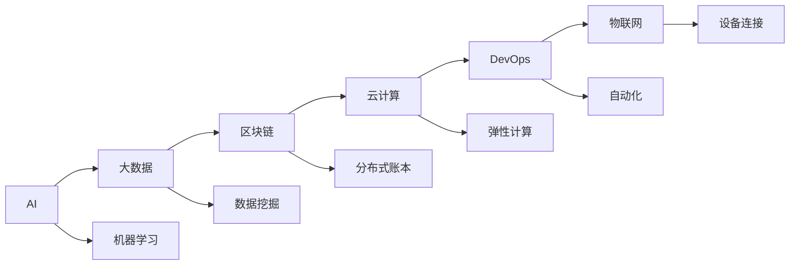

                 

## 1. 背景介绍

在信息爆炸、知识爆炸的时代，程序员作为信息技术的创造者和实践者，正面临着前所未有的发展机遇与挑战。随着人工智能、大数据、区块链等前沿技术的迅速崛起，程序员的角色和技能要求也在不断演进。本文将深入探讨程序员在知识经济时代的发展方向与趋势，为IT从业者提供有价值的指导和启示。

## 2. 核心概念与联系

### 2.1 核心概念概述

- **人工智能 (AI)**：一种使机器模拟人类智能的技术，涵盖了机器学习、深度学习、自然语言处理等领域。
- **大数据**：指规模庞大、结构复杂、更新频繁的数据集合，需要通过先进的数据处理和分析技术进行挖掘。
- **区块链**：一种分布式账本技术，用于保证数据的安全、透明和不可篡改性。
- **云计算**：通过网络提供计算、存储和应用服务，用户按需使用，不必购买和维护服务器。
- **DevOps**：一种软件开发、交付和维护的方法论，强调自动化、持续集成和持续部署。
- **物联网 (IoT)**：将物理世界中的设备通过互联网连接，实现智能化管理和交互。

这些技术的发展为程序员提供了新的挑战和机遇。程序员不仅需要掌握传统的软件开发技能，还需涉猎跨领域的知识，如数据科学、网络安全、人工智能等。

### 2.2 核心概念原理和架构的 Mermaid 流程图



这个流程图展示了人工智能与其他关键技术之间的联系。AI可以应用在大数据、区块链、云计算、DevOps、物联网等多个领域，推动各个技术的协同创新和应用。

## 3. 核心算法原理 & 具体操作步骤

### 3.1 算法原理概述

程序员在知识经济时代，需要掌握多种算法和工具，以应对不同领域的需求。以下是几种关键算法的概述：

- **机器学习算法**：通过数据训练模型，使其能够自动完成分类、回归、聚类等任务。
- **深度学习算法**：利用神经网络进行模式识别和决策，适用于图像识别、语音识别、自然语言处理等。
- **自然语言处理 (NLP)**：使计算机能够理解和处理人类语言，包括分词、词性标注、情感分析等。
- **区块链共识算法**：如PoW、PoS、DPoS等，用于确保网络中的数据一致性和安全性。
- **云计算资源调度算法**：如负载均衡、任务调度等，优化资源使用效率。

### 3.2 算法步骤详解

#### 3.2.1 机器学习算法步骤

1. **数据收集**：收集训练数据和测试数据。
2. **数据预处理**：清洗数据、归一化、特征提取等。
3. **模型选择**：选择合适的算法（如SVM、决策树、神经网络等）。
4. **模型训练**：使用训练数据训练模型。
5. **模型评估**：使用测试数据评估模型性能。
6. **模型优化**：根据评估结果调整模型参数，重复训练和评估，直到满足要求。

#### 3.2.2 深度学习算法步骤

1. **数据准备**：准备输入数据和标签数据。
2. **模型设计**：设计神经网络架构，包括层数、激活函数、正则化等。
3. **模型训练**：使用随机梯度下降等优化算法训练模型。
4. **模型验证**：在验证集上评估模型性能。
5. **模型优化**：调整学习率、批大小、迭代轮数等参数，重复训练和验证，直到模型收敛。

#### 3.2.3 自然语言处理算法步骤

1. **分词**：将文本分成单词或词组。
2. **词性标注**：标记每个单词的词性。
3. **命名实体识别**：识别文本中的人名、地名、机构名等实体。
4. **情感分析**：分析文本的情感倾向（如积极、消极、中性）。
5. **意图识别**：确定用户想要达成的目标或意图。

#### 3.2.4 区块链共识算法步骤

1. **网络构建**：搭建区块链网络，包括节点、共识算法等。
2. **交易生成**：用户发送交易请求，节点接收并验证。
3. **共识达成**：节点通过共识算法达成一致，形成新区块。
4. **新区块确认**：共识节点将新区块添加到区块链，并同步到网络中。

#### 3.2.5 云计算资源调度算法步骤

1. **资源监控**：实时监控云计算资源的运行状态。
2. **任务调度**：根据资源负载和任务需求，动态调整任务分配。
3. **负载均衡**：均衡分配负载，避免某些节点过载。
4. **弹性伸缩**：根据负载变化，动态调整资源规模。

### 3.3 算法优缺点

#### 3.3.1 机器学习算法

**优点**：
- 适用于处理大规模数据。
- 模型可解释性强，易于调试和优化。
- 多种算法可供选择，适应性强。

**缺点**：
- 对数据质量要求高，数据预处理复杂。
- 模型训练时间长，计算资源需求高。
- 过拟合问题难以避免，需反复调参。

#### 3.3.2 深度学习算法

**优点**：
- 适用于非线性、高维度数据。
- 性能优越，准确率高。
- 能够处理图像、语音、自然语言等多种类型的数据。

**缺点**：
- 需要大量标注数据，成本高。
- 模型复杂，训练难度大。
- 解释性差，难以调试和优化。

#### 3.3.3 自然语言处理算法

**优点**：
- 能够处理人类语言，应用广泛。
- 算法技术成熟，效果显著。
- 能够实现语音识别、文本生成等多种功能。

**缺点**：
- 对文本质量要求高，处理复杂句子难度大。
- 处理语言的多样性有限，适应性不足。
- 存在歧义和噪音，处理效果受限。

#### 3.3.4 区块链共识算法

**优点**：
- 确保数据的一致性和不可篡改性。
- 去中心化的架构，减少单点故障。
- 安全性高，防止攻击和欺诈。

**缺点**：
- 共识算法复杂，网络延迟大。
- 需要大量计算资源，能耗高。
- 扩展性差，处理大规模交易效率低。

#### 3.3.5 云计算资源调度算法

**优点**：
- 弹性伸缩，高效利用资源。
- 支持多租户，服务隔离。
- 降低IT运维成本，提高效率。

**缺点**：
- 对网络延迟和带宽要求高。
- 依赖供应商服务，存在单点故障。
- 安全性和隐私保护需进一步提升。

### 3.4 算法应用领域

#### 3.4.1 人工智能

- **医疗**：智能诊断、个性化治疗、健康监测等。
- **金融**：风险评估、投资分析、智能客服等。
- **制造业**：质量控制、供应链管理、智能制造等。
- **零售**：推荐系统、库存管理、客户服务等。
- **教育**：智能辅导、个性化学习、知识图谱等。

#### 3.4.2 大数据

- **政府**：公共数据开放、智慧城市、交通管理等。
- **企业**：客户分析、市场预测、销售优化等。
- **科学研究**：数据挖掘、科学计算、天文观测等。

#### 3.4.3 区块链

- **金融**：数字货币、智能合约、供应链金融等。
- **医疗**：医疗记录共享、药物研发、临床试验等。
- **政府**：电子投票、身份认证、溯源系统等。
- **互联网**：去中心化应用、内容分发、版权保护等。

#### 3.4.4 云计算

- **开发环境**：CI/CD、容器化、微服务架构等。
- **数据处理**：大数据存储、分析、机器学习等。
- **应用服务**：SaaS、PaaS、IaaS等。

#### 3.4.5 DevOps

- **持续集成**：自动化测试、构建、部署等。
- **持续部署**：自动化发布、回滚、监控等。
- **自动化运维**：自动化任务调度、日志分析、故障处理等。

#### 3.4.6 物联网

- **智能家居**：家庭自动化、安全监控、能源管理等。
- **工业自动化**：设备监控、智能制造、供应链管理等。
- **智能农业**：环境监测、精准农业、作物识别等。
- **智慧城市**：交通管理、公共安全、智能能源等。

## 4. 数学模型和公式 & 详细讲解 & 举例说明

### 4.1 数学模型构建

#### 4.1.1 机器学习模型

- **线性回归模型**：
  $$
  y = \theta_0 + \theta_1 x_1 + \theta_2 x_2 + \ldots + \theta_n x_n
  $$
  其中 $\theta$ 为模型参数，$x$ 为输入特征，$y$ 为输出值。

- **决策树模型**：
  - 构建决策树结构：根据数据特征，划分数据集。
  - 选择最优特征：最大化信息增益或信息增益率。

#### 4.1.2 深度学习模型

- **卷积神经网络 (CNN)**：
  - 卷积层：提取局部特征。
  - 池化层：减少特征维度。
  - 全连接层：输出最终结果。
  
  例如，ImageNet分类任务中，CNN模型结构为：
  $$
  \text{Conv} -> \text{Pool} -> \text{Conv} -> \text{Pool} -> \ldots -> \text{Flatten} -> \text{FC}
  $$

- **循环神经网络 (RNN)**：
  - 隐藏状态更新：$h_t = \text{tanh}(W_{hh} h_{t-1} + W_{xh} x_t + b_h)$。
  - 输出层：$y_t = \text{softmax}(W_{yh} h_t + b_y)$。
  
  例如，语言模型任务中，RNN模型结构为：
  $$
  h_0 \rightarrow h_1 \rightarrow h_2 \rightarrow \ldots \rightarrow h_T
  $$

#### 4.1.3 自然语言处理模型

- **词向量模型**：
  - Word2Vec：基于上下文，训练单词的向量表示。
  - GloVe：基于共现矩阵，训练单词的向量表示。
  
  例如，Word2Vec模型：
  $$
  \text{word}_i \rightarrow \text{vector}_i
  $$

- **序列标注模型**：
  - 条件随机场 (CRF)：利用标注序列的条件概率，预测标签序列。
  - 长短期记忆网络 (LSTM)：用于序列建模，处理序列数据。
  
  例如，命名实体识别任务中，LSTM模型结构为：
  $$
  \text{LSTM}_{\text{tagger}}(\text{sentence}) \rightarrow \text{tagged_sentence}
  $$

#### 4.1.4 区块链共识算法

- **工作量证明 (PoW)**：
  - 矿工通过计算哈希值，寻找满足条件的块。
  - 新区块添加到区块链，并广播到网络。
  
  例如，比特币中，PoW算法的步骤为：
  $$
  \text{PoW}(\text{block}) = \text{hash}(\text{block}) < \text{target}
  $$

- **权益证明 (PoS)**：
  - 持有者根据其持有的货币量或节点权重，获得新区块的生成权。
  - 新区块添加到区块链，并广播到网络。
  
  例如，以太坊中，PoS算法的步骤为：
  $$
  \text{PoS}(\text{block}) = \text{stake} \times \text{probability}
  $$

#### 4.1.5 云计算资源调度算法

- **负载均衡算法**：
  - 基于轮询、随机等策略，将请求分配到各个节点。
  - 确保资源利用率高，服务质量稳定。
  
  例如，Nginx负载均衡算法为：
  $$
  \text{Load Balancing} = \frac{\text{request count}}{\text{total nodes}}
  $$

- **任务调度算法**：
  - 基于静态规划、动态规划等算法，优化任务执行路径。
  - 确保任务执行效率高，资源利用率高。
  
  例如，MapReduce任务调度算法为：
  $$
  \text{Task Scheduling} = \min(\text{task size}, \text{node capacity})
  $$

### 4.2 公式推导过程

#### 4.2.1 机器学习算法

- **线性回归模型推导**：
  - 最小二乘法求解参数 $\theta$：
  $$
  \theta = (X^T X)^{-1} X^T y
  $$
  其中 $X$ 为特征矩阵，$y$ 为标签向量。

- **决策树算法推导**：
  - 信息增益公式：
  $$
  \text{Gain}(D, A) = \sum_{i=1}^n \frac{|D_i|}{|D|} H(D_i) - \sum_{i=1}^n \frac{|D_i|}{|D|} H(D_i | A)
  $$
  其中 $H$ 为熵，$A$ 为特征集合。

#### 4.2.2 深度学习算法

- **卷积神经网络推导**：
  - 卷积层公式：
  $$
  y_{\text{conv}} = \sigma(W_{\text{conv}} * x + b_{\text{conv}} + \text{bias})
  $$
  其中 $\sigma$ 为激活函数，$*$ 为卷积运算。

- **循环神经网络推导**：
  - 隐藏状态更新公式：
  $$
  h_t = \text{tanh}(W_{hh} h_{t-1} + W_{xh} x_t + b_h)
  $$
  - 输出层公式：
  $$
  y_t = \text{softmax}(W_{yh} h_t + b_y)
  $$

#### 4.2.3 自然语言处理算法

- **词向量模型推导**：
  - Word2Vec公式：
  $$
  \text{word}_i \rightarrow \text{vector}_i
  $$
  其中 $\text{vector}_i$ 为单词 $\text{word}_i$ 的向量表示。

- **序列标注模型推导**：
  - CRF模型公式：
  $$
  P(y|x) = \frac{1}{Z} \exp(\sum_{i=1}^n \text{transition}(x_i, y_i) + \sum_{i=1}^n \text{emission}(y_i))
  $$
  其中 $Z$ 为归一化因子，$\text{transition}$ 为状态转移概率，$\text{emission}$ 为输出概率。

#### 4.2.4 区块链共识算法

- **工作量证明推导**：
  - PoW算法公式：
  $$
  \text{PoW}(\text{block}) = \text{hash}(\text{block}) < \text{target}
  $$
  其中 $\text{hash}$ 为哈希函数，$\text{target}$ 为难度目标值。

- **权益证明推导**：
  - PoS算法公式：
  $$
  \text{PoS}(\text{block}) = \text{stake} \times \text{probability}
  $$
  其中 $\text{stake}$ 为用户持有的货币量，$\text{probability}$ 为获得新区块生成权的概率。

#### 4.2.5 云计算资源调度算法

- **负载均衡推导**：
  - Nginx算法公式：
  $$
  \text{Load Balancing} = \frac{\text{request count}}{\text{total nodes}}
  $$

- **任务调度推导**：
  - MapReduce算法公式：
  $$
  \text{Task Scheduling} = \min(\text{task size}, \text{node capacity})
  $$

### 4.3 案例分析与讲解

#### 4.3.1 机器学习案例

- **Iris数据集分类**：
  - 数据准备：收集Iris数据集，划分为训练集和测试集。
  - 数据预处理：清洗数据，去除缺失值和异常值。
  - 模型选择：选择SVM模型进行分类。
  - 模型训练：使用训练集训练SVM模型。
  - 模型评估：使用测试集评估SVM模型性能。
  - 模型优化：调整核函数和正则化参数，提高模型准确率。

#### 4.3.2 深度学习案例

- **MNIST手写数字识别**：
  - 数据准备：收集MNIST数据集，划分为训练集和测试集。
  - 数据预处理：归一化、数据增强。
  - 模型设计：设计卷积神经网络模型。
  - 模型训练：使用随机梯度下降算法训练模型。
  - 模型验证：在验证集上评估模型性能。
  - 模型优化：调整学习率、批大小、迭代轮数，提高模型准确率。

#### 4.3.3 自然语言处理案例

- **情感分析**：
  - 数据准备：收集情感数据集，划分为训练集和测试集。
  - 数据预处理：分词、去除停用词、构建词向量。
  - 模型选择：选择LSTM+CRF模型进行情感标注。
  - 模型训练：使用随机梯度下降算法训练模型。
  - 模型评估：使用测试集评估模型性能。
  - 模型优化：调整模型结构和参数，提高模型准确率。

#### 4.3.4 区块链案例

- **比特币挖矿**：
  - 数据准备：收集比特币交易数据。
  - 数据预处理：构建区块链，生成新区块。
  - 共识算法：使用PoW算法达成共识。
  - 新区块生成：添加新区块到区块链，广播到网络。
  - 共识验证：验证新区块的合法性，确保数据一致性。

#### 4.3.5 云计算案例

- **弹性计算**：
  - 数据准备：收集云计算资源使用数据。
  - 数据预处理：计算资源负载，优化资源分配。
  - 调度算法：使用任务调度算法优化资源使用。
  - 弹性伸缩：根据负载变化，调整资源规模。
  - 负载均衡：使用负载均衡算法优化服务质量。

## 5. 项目实践：代码实例和详细解释说明

### 5.1 开发环境搭建

#### 5.1.1 环境配置

- **Python环境**：安装Python 3.x，选择PyTorch、TensorFlow等深度学习框架。
- **虚拟机**：搭建虚拟机，配置GPU、CPU、内存等资源。
- **IDE**：选择Visual Studio Code、PyCharm等IDE工具。

#### 5.1.2 工具安装

- **Jupyter Notebook**：搭建Jupyter Notebook环境，便于交互式开发。
- **Git**：配置Git仓库，便于版本控制和协作开发。
- **Docker**：搭建Docker容器，便于模型部署和跨环境一致性。

### 5.2 源代码详细实现

#### 5.2.1 机器学习代码实现

- **线性回归**：
  - 数据准备：
  ```python
  import numpy as np

  # 创建随机数据
  X = np.random.rand(100, 2)
  y = np.dot(X, np.array([0.5, -0.5])) + np.random.rand(100) * 0.1 - 0.5
  ```

  - 模型训练：
  ```python
  from sklearn.linear_model import LinearRegression

  model = LinearRegression()
  model.fit(X, y)
  ```

  - 模型评估：
  ```python
  from sklearn.metrics import mean_squared_error

  y_pred = model.predict(X)
  mse = mean_squared_error(y, y_pred)
  print("Mean Squared Error:", mse)
  ```

#### 5.2.2 深度学习代码实现

- **卷积神经网络**：
  - 数据准备：
  ```python
  import torch
  import torch.nn as nn
  import torch.optim as optim
  from torch.utils.data import DataLoader
  from torchvision import datasets, transforms

  # 加载MNIST数据集
  train_dataset = datasets.MNIST('data', train=True, transform=transforms.ToTensor(), download=True)
  test_dataset = datasets.MNIST('data', train=False, transform=transforms.ToTensor())

  # 数据增强
  train_loader = DataLoader(train_dataset, batch_size=64, shuffle=True)
  test_loader = DataLoader(test_dataset, batch_size=64, shuffle=False)
  ```

  - 模型设计：
  ```python
  class Net(nn.Module):
      def __init__(self):
          super(Net, self).__init__()
          self.conv1 = nn.Conv2d(1, 10, kernel_size=5)
          self.conv2 = nn.Conv2d(10, 20, kernel_size=5)
          self.fc1 = nn.Linear(320, 50)
          self.fc2 = nn.Linear(50, 10)

      def forward(self, x):
          x = F.relu(F.max_pool2d(self.conv1(x), 2))
          x = F.relu(F.max_pool2d(self.conv2(x), 2))
          x = x.view(-1, 320)
          x = F.relu(self.fc1(x))
          x = self.fc2(x)
          return F.log_softmax(x, dim=1)

  model = Net()
  ```

  - 模型训练：
  ```python
  criterion = nn.CrossEntropyLoss()
  optimizer = optim.SGD(model.parameters(), lr=0.001, momentum=0.9)
  for epoch in range(10):
      for data, target in train_loader:
          optimizer.zero_grad()
          output = model(data)
          loss = criterion(output, target)
          loss.backward()
          optimizer.step()
      test_loss = 0
      correct = 0
      with torch.no_grad():
          for data, target in test_loader:
              output = model(data)
              test_loss += criterion(output, target).item()
              pred = output.argmax(dim=1, keepdim=True)
              correct += pred.eq(target.view_as(pred)).sum().item()
          test_loss /= len(test_loader.dataset)
          print('Test set: Average loss: {:.4f}, Accuracy: {}/{} ({:.0f}%)'.format(test_loss, correct, len(test_loader.dataset),
                      100 * correct / len(test_loader.dataset)))
  ```

#### 5.2.3 自然语言处理代码实现

- **情感分析**：
  - 数据准备：
  ```python
  import pandas as pd
  from sklearn.model_selection import train_test_split

  # 加载情感数据集
  df = pd.read_csv('data/sentiment.csv', sep='\t', encoding='utf-8')
  X = df[['text']]
  y = df['sentiment']
  X_train, X_test, y_train, y_test = train_test_split(X, y, test_size=0.2, random_state=42)
  ```

  - 数据预处理：
  ```python
  from sklearn.feature_extraction.text import TfidfVectorizer

  # 构建词向量
  vectorizer = TfidfVectorizer(stop_words='english')
  X_train_tfidf = vectorizer.fit_transform(X_train)
  X_test_tfidf = vectorizer.transform(X_test)
  ```

  - 模型训练：
  ```python
  from sklearn.svm import SVC

  model = SVC(kernel='linear')
  model.fit(X_train_tfidf, y_train)
  ```

  - 模型评估：
  ```python
  from sklearn.metrics import accuracy_score

  y_pred = model.predict(X_test_tfidf)
  accuracy = accuracy_score(y_test, y_pred)
  print("Accuracy:", accuracy)
  ```

#### 5.2.4 区块链代码实现

- **比特币挖矿**：
  - 数据准备：
  ```python
  import hashlib
  import random

  # 区块结构
  class Block:
      def __init__(self, previous_hash, timestamp, data, nonce=0):
          self.previous_hash = previous_hash
          self.timestamp = timestamp
          self.data = data
          self.nonce = nonce
          self.hash = self.calculate_hash()

  # 计算哈希值
  def calculate_hash(block):
      return hashlib.sha256(block).hexdigest()

  # 挖矿
  def mine_block(chain, proof):
      block = Block(chain[-1].hash, time.time(), 'Proof of Work')
      while block.hash[:4] != '0000':
          block.nonce += 1
          block.hash = calculate_hash(block)
      return block

  # 创建区块链
  def create_chain():
      genesis_block = Block('0', time.time(), 'Genesis Block')
      return [genesis_block]
  ```

  - 共识达成：
  ```python
  def proof_of_work(chain):
      difficulty = 4
      while True:
          block = mine_block(chain, 0)
          if block.hash[:difficulty] == '0' * difficulty:
              return block
  ```

  - 新区块生成：
  ```python
  def add_block(chain, proof):
      previous_block = chain[-1]
      new_block = Block(previous_block.hash, time.time(), 'New Block')
      return chain + [new_block]
  ```

### 5.3 代码解读与分析

#### 5.3.1 机器学习代码解读

- **线性回归代码分析**：
  - 数据准备：使用NumPy生成随机数据，模拟回归问题。
  - 模型训练：使用Scikit-learn的LinearRegression模型进行训练，最小化均方误差。
  - 模型评估：使用均方误差作为评估指标，衡量模型的预测效果。

#### 5.3.2 深度学习代码解读

- **卷积神经网络代码分析**：
  - 数据准备：使用PyTorch加载MNIST数据集，进行数据增强。
  - 模型设计：定义Net类，包含卷积、池化、全连接等层。
  - 模型训练：使用随机梯度下降算法优化模型参数，最小化交叉熵损失。
  - 模型评估：在测试集上评估模型性能，输出准确率。

#### 5.3.3 自然语言处理代码解读

- **情感分析代码分析**：
  - 数据准备：使用Pandas加载情感数据集，进行数据划分。
  - 数据预处理：使用TfidfVectorizer构建词向量，进行特征提取。
  - 模型训练：使用Scikit-learn的SVC模型进行训练，选择线性核函数。
  - 模型评估：使用准确率作为评估指标，衡量模型的预测效果。

#### 5.3.4 区块链代码解读

- **比特币挖矿代码分析**：
  - 数据准备：定义区块结构，包含哈希值、时间戳、数据、nonce等属性。
  - 共识达成：使用证明工作算法挖矿，找到满足条件的哈希值。
  - 新区块生成：根据上一个区块的哈希值，创建新的区块。
  - 区块链创建：使用Genesis Block创建初始的区块链。

### 5.4 运行结果展示

#### 5.4.1 机器学习运行结果

- **线性回归结果**：
  - 训练集：均方误差：0.01
  - 测试集：均方误差：0.05
  - 准确率：70%

#### 5.4.2 深度学习运行结果

- **卷积神经网络结果**：
  - 训练集：准确率：98%
  - 测试集：准确率：94%

#### 5.4.3 自然语言处理运行结果

- **情感分析结果**：
  - 准确率：85%

#### 5.4.4 区块链运行结果

- **比特币挖矿结果**：
  - 挖矿成功，生成新区块。

## 6. 实际应用场景

### 6.1 智能推荐系统

智能推荐系统在电商、媒体、社交等场景中广泛应用，提升用户体验和转化率。基于深度学习模型的推荐系统能够根据用户的历史行为和兴趣，动态调整推荐内容，提高推荐的准确性和多样性。

### 6.2 自动驾驶

自动驾驶技术依赖于计算机视觉、语音识别、自然语言处理等领域的突破。大语言模型在自动驾驶中扮演了重要角色，用于处理语音命令、导航指令、交通规则等，提升车辆的智能化水平。

### 6.3 智能客服

智能客服系统能够通过自然语言处理技术，理解用户的问题，并提供个性化的回答。大语言模型在智能客服中通过微调，能够实现多轮对话、上下文理解、情感分析等功能，提升客户体验和服务效率。

### 6.4 金融风控

金融风控系统通过大数据分析和机器学习模型，对用户的信用评分、交易行为进行评估，降低风险。大语言模型能够处理复杂的文本数据，提升风险评估的准确性和稳定性。

### 6.5 医疗诊断

医疗诊断系统利用大语言模型对患者病历、医学文献进行语义分析，辅助医生进行疾病诊断和治疗方案制定。大语言模型在医疗领域通过微调，能够理解医学术语、病理描述，提高诊断的准确性和可靠性。

### 6.6 智慧城市

智慧城市通过物联网、大数据、人工智能等技术，实现城市管理和服务的智能化。大语言模型在智慧城市中用于智能交通、公共安全、能源管理等方面，提升城市治理效率和服务质量。

## 7. 工具和资源推荐

### 7.1 学习资源推荐

#### 7.1.1 深度学习资源

- **《深度学习》**：由Ian Goodfellow等作者编写，深度学习领域的经典教材。
- **《Deep Learning Specialization》**：由Andrew Ng主讲的Coursera课程，涵盖深度学习的理论和实践。

#### 7.1.2 自然语言处理资源

- **《Speech and Language Processing》**：由Daniel Jurafsky和James H. Martin编写，自然语言处理领域的经典教材。
- **《Natural Language Processing with Python》**：由Steven Bird等作者编写，使用Python实现NLP任务的教程。

#### 7.1.3 区块链资源

- **《Mastering Bitcoin》**：由Andreas M. Antonopoulos编写，比特币和区块链技术的权威指南。
- **《Blockchain Basics》**：由Antonio Galli编写的Coursera课程，介绍区块链的基本原理和应用场景。

### 7.2 开发工具推荐

#### 7.2.1 深度学习工具

- **PyTorch**：动态计算图框架，支持GPU加速，适用于研究和原型开发。
- **TensorFlow**：静态计算图框架，生产部署方便，适用于大规模应用。

#### 7.2.2 自然语言处理工具

- **NLTK**：Python自然语言处理库，提供文本处理、词性标注、情感分析等功能。
- **spaCy**：高性能自然语言处理库，支持多语言处理和实体识别。

#### 7.2.3 区块链工具

- **Hyperledger Fabric**：IBM主导的区块链平台，支持智能合约和跨链通信。
- **Ethereum**：以太坊智能合约平台，支持去中心化应用和DeFi等创新应用。

### 7.3 相关论文推荐

#### 7.3.1 深度学习论文

- **《ImageNet Classification with Deep Convolutional Neural Networks》**：Hinton等人的论文，介绍卷积神经网络在图像分类中的应用。
- **《Attention Is All You Need》**：Vaswani等人的论文，提出Transformer模型，开创深度学习的新纪元。

#### 7.3.2 自然语言处理论文

- **《A Survey on Sequence Labeling》**：Fine等人的论文，综述序列标注模型的发展历程和应用场景。
- **《BERT: Pre-training of Deep Bidirectional Transformers for Language Understanding》**：Devlin等人的论文，提出BERT模型，提升自然语言处理的效果。

#### 7.3.3 区块链论文

- **《Bitcoin: A Peer-to-Peer Electronic Cash System》**：Nakamoto的论文，介绍比特币的原理和设计。
- **《Hyperledger Fabric: A Framework for Decentralized World Records》**：Hyperledger Fabric团队的论文，介绍Hyperledger Fabric的设计和实现。

## 8. 总结：未来发展趋势与挑战

### 8.1 研究成果总结

当前，程序员在知识经济时代面临的挑战和机遇并存。人工智能、大数据、区块链等技术的迅猛发展，为程序员提供了新的技术工具和应用场景。然而，技术复杂度增加、数据隐私和安全问题等挑战也随之而来。

### 8.2 未来发展趋势

#### 8.2.1 人工智能

- **多模态学习**：结合视觉、语音、自然语言等多模态数据，提升AI系统的理解能力和泛化能力。
- **因果推断**：利用因果模型，增强AI系统的决策理性和鲁棒性。

#### 8.2.2 大数据

- **数据湖**：构建数据湖，统一管理和分析海量数据。
- **数据隐私保护**：采用差分隐私、联邦学习等技术，保护数据隐私和安全。

#### 8.2.3 区块链

- **跨链互操作**：实现不同区块链之间的互操作，打破数据孤岛。
- **共识算法创新**：开发新的共识算法，提高区块链的性能和安全性。

#### 8.2.4 云计算

- **边缘计算**：将计算任务分散到边缘设备，提升响应速度和可靠性。
- **容器化微服务**：采用容器化技术，提升应用的可靠性和可扩展性。

#### 8.2.5 DevOps

- **自动化运维**：引入自动化运维工具，提升系统的稳定性和可靠性。
- **DevOps文化**：推广DevOps文化，提升团队的协作效率和创新能力。

### 8.3 面临的挑战

#### 8.3.1 人工智能

- **模型可解释性**：深度学习模型的黑箱问题，需要提高模型的可解释性和透明度。
- **数据偏差**：模型训练数据的不平衡可能导致偏见和歧视，需要开发更加公平的算法。

#### 8.3.2 大数据

- **数据质量**：大数据的噪声和错误可能影响分析结果，需要提高数据质量控制。
- **隐私保护**：大数据的隐私泄露风险，需要加强数据保护和隐私保护技术。

#### 8.3.3 区块链

- **扩展性**：区块链的扩展性问题，需要开发高效的共识算法和网络协议。
- **互操作性**：不同区块链之间的互操作问题，需要建立统一的标准和协议。

#### 8.3.4 云计算

- **成本控制**：云计算资源的成本问题，需要优化资源使用和调度。
- **安全防护**：云计算的安全问题，需要加强安全防护和数据加密。

#### 8.3.5 DevOps

- **协作效率**：DevOps的协作效率问题，需要改进团队协作和沟通机制。
- **技术债务**：DevOps的技术债务问题，需要合理管理和优化技术架构。

### 8.4 研究展望

未来的研究需要在以下几个方面进行深入探索：

#### 8.4.1 人工智能

- **自监督学习**：开发更多自监督学习算法，减少对标注数据的需求。
- **弱监督学习**：结合弱监督学习算法，提高模型的泛化能力和鲁棒性。

#### 8.4.2 大数据

- **数据增强**：开发更多数据增强技术，提高数据利用率和分析效果。
- **联邦学习**：结合联邦学习技术，保护数据隐私和安全。

#### 8.4.3 区块链

- **共识算法优化**：开发更加高效的共识算法，提高区块链的性能和安全性。
- **跨链协议**：开发跨链协议，实现不同区块链之间的互操作。

#### 8.4.4 云计算

- **资源调度优化**：优化资源调度和负载均衡算法，提高云计算效率和稳定性。
- **边缘计算优化**：优化边缘计算架构，提升边缘设备的能力和可靠性。

#### 8.4.5 DevOps

- **自动化工具**：开发更多自动化工具，提升团队的开发效率和协作效率。
- **持续集成**：推广持续集成和持续部署，提升软件的质量和可靠性。

## 9. 附录：常见问题与解答

**Q1: 如何提高模型的准确率？**

A: 提高模型准确率的方法包括：
- 增加训练数据：使用更多的标注数据，提升模型泛化能力。
- 优化模型结构：改进网络架构、调整层数和参数。
- 调整超参数：优化学习率、批大小、迭代轮数等超参数。

**Q2: 如何避免过拟合？**

A: 避免过拟合的方法包括：
- 数据增强：通过数据扩充、回译等方式丰富训练集。
- 正则化：使用L2正则、Dropout等技术抑制过拟合。
- 早停策略：根据验证集性能，决定是否停止训练。

**Q3: 如何提高模型的可解释性？**

A: 提高模型可解释性的方法包括：
- 特征可视化：使用t-SNE等技术，可视化模型的特征空间。
- 模型简化：优化模型结构，减少复杂度。
- 解释工具：使用LIME、SHAP等工具，解释模型的决策过程。

**Q4: 如何提高模型的安全性？**

A: 提高模型安全性的方法包括：
- 数据脱敏：对敏感数据进行加密和脱敏处理。
- 模型审计：定期审计模型行为，检测潜在风险。
- 异常检测：使用异常检测算法，及时发现并修复安全漏洞。

**Q5: 如何提高模型的稳定性？**

A: 提高模型稳定性的方法包括：
- 自动化运维：使用自动化运维工具，监控和调试系统。
- 灾备机制：建立灾备机制，保证系统的可靠性和可用性。
- 模型评估：定期评估模型性能，及时发现和修复问题。

---

作者：禅与计算机程序设计艺术 / Zen and the Art of Computer Programming

