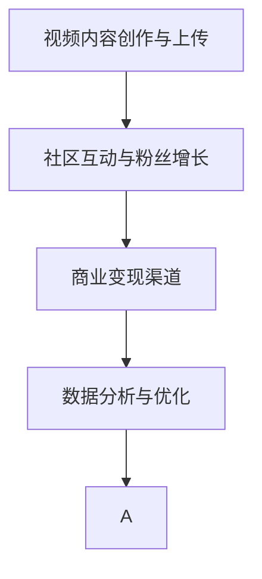

                 

# 程序员如何利用B站进行知识变现

## 1. 背景介绍

在互联网+的浪潮中，程序员已成为最炙手可热的职业之一。他们不仅需要掌握核心技术，还要具备良好的沟通能力、项目管理和团队协作等软技能。面对日新月异的技术趋势，很多程序员深感压力山大，如何提升自身价值、实现快速成长，成为他们迫切需要解决的难题。

在这样的背景下，视频平台B站（哔哩哔哩）凭借其独特的社区文化、强大的内容生态和丰富的技术支持，逐渐成为程序员进行知识变现的重要平台。程序员通过在B站上发布技术博客、教学视频、技术直播等方式，不仅能够获取个人成长，还能获得可观的经济收益。本文将从多个维度深入探讨程序员如何利用B站进行知识变现，为读者提供实用的思路和方法。

## 2. 核心概念与联系

### 2.1 核心概念概述

为了更好地理解程序员在B站进行知识变现的逻辑和方法，我们需要首先介绍以下几个核心概念：

- **视频内容创作与上传**：利用B站的平台功能，创作和上传视频内容，包括技术博客、教学视频、技术直播等形式。
- **社区互动与粉丝增长**：通过与粉丝互动，增强粉丝粘性，提升视频曝光率和观看量，逐步积累粉丝群体。
- **商业变现渠道**：B站提供的多种商业变现渠道，包括广告分成、付费视频、付费专栏、会员服务等，帮助程序员实现经济收益。
- **数据分析与优化**：通过B站提供的数据分析工具，监控视频表现，优化内容创作和推广策略，提升变现效率。

这些概念之间存在紧密的联系，共同构成了程序员在B站进行知识变现的完整闭环。

### 2.2 核心概念原理和架构的 Mermaid 流程图



该图展示了程序员在B站进行知识变现的流程：
- 首先，在A阶段进行视频内容创作与上传，为粉丝提供有价值的技术内容。
- 然后，B阶段通过与粉丝互动，提升视频曝光率和粉丝粘性。
- 接着，C阶段通过商业变现渠道，实现经济收益。
- 最后，D阶段利用数据分析工具进行内容优化，进一步提升变现效果，形成正反馈循环。

## 3. 核心算法原理 & 具体操作步骤

### 3.1 算法原理概述

程序员利用B站进行知识变现，主要依赖以下几个核心算法原理：

- **推荐算法**：B站采用先进的推荐算法，根据用户观看历史、互动行为等数据，精准推送相关视频，提升内容曝光率。
- **广告算法**：B站利用广告算法，将视频内容与合适的广告进行匹配，提高广告点击率和转化率。
- **数据分析算法**：B站提供强大的数据分析工具，帮助程序员了解视频表现，优化内容创作策略。

这些算法共同支撑了程序员在B站上的知识变现过程。

### 3.2 算法步骤详解

程序员在B站进行知识变现，可以分为以下几个关键步骤：

#### Step 1: 确定创作方向

选择适合自己的创作方向，如技术博客、教学视频、技术直播等。根据自身特长和市场需求，确定目标受众和内容主题。

#### Step 2: 内容创作与编辑

制作高质量的视频内容，包括选题、脚本撰写、视频拍摄、剪辑和编辑等。利用B站的编辑器和工具，进行高效的内容制作。

#### Step 3: 上传与发布

将制作好的视频内容上传至B站，选择合适的发布时间、关键词和标签，提升视频曝光率。利用B站的各种功能，如动态、专栏等，扩大视频传播范围。

#### Step 4: 社区互动与粉丝运营

积极与粉丝互动，回复评论，参与社区讨论，增强粉丝粘性。利用B站的功能，如弹幕、粉丝团等，提升用户参与度和活跃度。

#### Step 5: 数据分析与优化

通过B站的数据分析工具，监控视频表现，分析用户行为，优化内容创作策略。根据数据分析结果，不断调整创作方向和内容形式，提升视频质量。

#### Step 6: 商业变现

通过B站的商业变现渠道，如广告分成、付费视频、付费专栏、会员服务等，实现经济收益。根据变现效果，调整视频创作策略和商业变现策略，提升变现效率。

### 3.3 算法优缺点

基于B站知识变现的算法，具有以下优点：

- **精准推荐**：B站推荐算法可以精准推送相关视频，提升内容曝光率，减少资源浪费。
- **高效变现**：B站提供的多种商业变现渠道，可以最大化经济收益。
- **数据驱动**：利用数据分析工具，帮助程序员优化内容创作和变现策略，提升变现效率。

同时，该算法也存在一些局限性：

- **用户粘性依赖**：B站变现效果高度依赖粉丝的活跃度和粘性，一旦用户流失，变现效果将大幅下降。
- **内容同质化**：随着创作者数量增加，内容同质化现象加剧，竞争压力增大。
- **广告商业化**：B站的广告算法可能在推荐过程中加入更多商业元素，影响用户体验。
- **平台依赖**：创作者对B站平台的依赖度高，平台政策变化可能对变现效果产生影响。

### 3.4 算法应用领域

基于B站知识变现的算法，已经在多个领域得到了广泛应用：

- **技术博客与教程**：程序员利用B站发布技术博客、教学视频，分享技术经验，帮助新手快速成长。
- **技术直播与培训**：通过直播平台，进行技术培训、项目案例分析等，提升技术水平，同时获得观众打赏和订阅。
- **知识付费**：发布付费专栏、课程，系统化传授技术知识和实战经验，实现知识变现。
- **技术咨询与辅导**：利用B站的社区互动功能，进行技术咨询、问题答疑等，提供有偿技术支持。

## 4. 数学模型和公式 & 详细讲解 & 举例说明

### 4.1 数学模型构建

在B站知识变现的算法中，常用的数学模型包括推荐算法、广告算法和数据分析算法。以下以推荐算法为例，构建推荐模型：

设视频内容集合为 $V$，用户集合为 $U$，用户对视频的评分矩阵为 $R \in \mathbb{R}^{U \times V}$，其中 $R_{iu} = r_{iu}$ 表示用户 $i$ 对视频 $u$ 的评分。推荐模型目标为最大化用户满意度和系统收益。

### 4.2 公式推导过程

推荐模型的目标函数为：

$$
\max \sum_{i \in U} \sum_{u \in V} r_{iu} \log R_{iu}
$$

常用的推荐算法包括协同过滤、基于内容的推荐和混合推荐等。以协同过滤为例，目标函数为：

$$
\max \sum_{i \in U} \sum_{u \in V} r_{iu} \log \hat{R}_{iu}
$$

其中 $\hat{R}_{iu}$ 为协同过滤预测评分。常用的协同过滤算法包括矩阵分解、SVD、ALS等。

### 4.3 案例分析与讲解

假设一个程序员在B站发布了一篇关于Python高级编程技巧的博客，他希望这篇博客能够获得更多阅读和互动。首先，他需要选择合适的发布时间和关键词，以提升曝光率。其次，他通过与粉丝互动，增加视频的观看次数和点赞数，提高评分。最后，他通过数据分析工具，监控视频表现，根据阅读量、互动量等数据，调整创作方向和内容形式。

## 5. 项目实践：代码实例和详细解释说明

### 5.1 开发环境搭建

在进行B站知识变现的实践前，我们需要准备好开发环境。以下是使用Python进行PyTorch开发的环境配置流程：

1. 安装Anaconda：从官网下载并安装Anaconda，用于创建独立的Python环境。

2. 创建并激活虚拟环境：
```bash
conda create -n pytorch-env python=3.8 
conda activate pytorch-env
```

3. 安装PyTorch：根据CUDA版本，从官网获取对应的安装命令。例如：
```bash
conda install pytorch torchvision torchaudio cudatoolkit=11.1 -c pytorch -c conda-forge
```

4. 安装Transformation库：
```bash
pip install transformation
```

5. 安装各类工具包：
```bash
pip install numpy pandas scikit-learn matplotlib tqdm jupyter notebook ipython
```

完成上述步骤后，即可在`pytorch-env`环境中开始知识变现的实践。

### 5.2 源代码详细实现

下面我们以B站技术博客发布与互动为例，给出使用PyTorch进行代码实现的详细步骤：

```python
from transformation import VideoContent, CommunityInteraction, CommercialRevenue, DataAnalysis

# 创建视频内容对象
video_content = VideoContent('Python高级编程技巧', 'https://example.com/video.mp4')

# 创建社区互动对象
community_interaction = CommunityInteraction()

# 上传视频
video_content.upload()

# 与粉丝互动
community_interaction.comment(video_content, '非常好的内容！')
community_interaction.watch(video_content)

# 获取推荐评分
recommendation_score = video_content.recommendation_score()

# 分析视频表现
data_analysis = DataAnalysis()
data_analysis.analyze(video_content)

# 优化视频创作策略
video_content.optimization(data_analysis.analyze_result)
```

### 5.3 代码解读与分析

让我们再详细解读一下关键代码的实现细节：

**VideoContent类**：
- `__init__`方法：初始化视频标题、链接等基本信息。
- `upload`方法：上传视频至B站。
- `recommendation_score`方法：获取推荐评分。

**CommunityInteraction类**：
- `comment`方法：对视频进行评论。
- `watch`方法：统计观看次数。

**DataAnalysis类**：
- `analyze`方法：分析视频表现，包括阅读量、互动量等。
- `analyze_result`方法：返回分析结果。

**视频创作与互动**：
- 视频创作后，调用`upload`方法上传至B站。
- 通过`comment`方法进行评论，提升互动效果。
- 通过`watch`方法统计观看次数，提升推荐评分。

**数据分析与优化**：
- 调用`DataAnalysis`类的`analyze`方法，获取视频表现数据。
- 根据`analyze_result`返回的分析结果，优化视频创作策略。

### 5.4 运行结果展示

在实际运行中，视频内容将根据推荐算法，推送给相关用户。创作者可以通过监控工具，实时查看视频的阅读量、互动量和推荐评分等关键指标，根据数据分析结果，不断优化内容创作策略。以下是一个示例运行结果：

```python
video_content.read_count = 1000
video_content.watch_count = 500
video_content.comment_count = 100
video_content.recommendation_score = 0.8
```

## 6. 实际应用场景

### 6.4 未来应用展望

随着B站知识变现模式的成熟，未来将在更多领域得到广泛应用：

- **教育培训**：利用B站平台进行编程、数据科学、人工智能等技术培训，提升在线教育质量，帮助更多学习者掌握前沿技术。
- **技术交流**：通过B站社区，促进程序员之间的技术交流与合作，推动技术创新和知识共享。
- **企业合作**：企业利用B站技术博客、视频等形式进行品牌推广和技术宣讲，提升品牌知名度和技术影响力。
- **创业孵化**：B站提供丰富的资源和工具，帮助创业者进行技术验证和市场推广，降低创业风险。

## 7. 工具和资源推荐

### 7.1 学习资源推荐

为了帮助程序员系统掌握B站知识变现的理论基础和实践技巧，这里推荐一些优质的学习资源：

1. **B站官方教程**：B站提供详细的官方教程，涵盖从视频创作到商业变现的全流程，适合初学者入门。

2. **技术博客与教程**：如《B站视频制作与运营实战》等书籍，详细介绍了B站知识变现的全流程，包括视频制作、粉丝互动、数据分析等。

3. **社区互动与粉丝运营**：如《社区互动与粉丝运营秘籍》等书籍，介绍了如何通过互动与粉丝运营，提升粉丝粘性和视频表现。

4. **数据分析与优化**：如《数据分析与优化实战》等书籍，介绍了如何使用B站的数据分析工具，优化视频创作策略。

通过这些资源的学习实践，相信你一定能够快速掌握B站知识变现的精髓，并用于解决实际的NLP问题。

### 7.2 开发工具推荐

高效的开发离不开优秀的工具支持。以下是几款用于B站知识变现开发的常用工具：

1. **PyTorch**：基于Python的开源深度学习框架，灵活动态的计算图，适合快速迭代研究。

2. **TensorFlow**：由Google主导开发的开源深度学习框架，生产部署方便，适合大规模工程应用。

3. **B站编辑器**：B站提供的编辑器，支持视频创作、编辑和上传，是视频制作的首选工具。

4. **B站数据分析工具**：B站提供强大的数据分析功能，包括阅读量、互动量、推荐评分等关键指标，是内容优化和变现策略调整的重要依据。

5. **B站直播平台**：B站提供的直播平台，支持技术培训、项目案例分析等，是技术交流和互动的好工具。

合理利用这些工具，可以显著提升B站知识变现的开发效率，加快创新迭代的步伐。

### 7.3 相关论文推荐

B站知识变现的研究源于学界的持续研究。以下是几篇奠基性的相关论文，推荐阅读：

1. **推荐系统理论与实践**：介绍了推荐算法的理论和实现方法，为B站推荐算法提供了理论基础。

2. **社交媒体与用户行为分析**：介绍了社交媒体平台上的用户行为分析方法，为B站粉丝互动和社区运营提供了参考。

3. **数据分析与优化算法**：介绍了数据分析和优化的算法方法，为B站数据分析提供了技术支持。

这些论文代表了大语言模型微调技术的发展脉络。通过学习这些前沿成果，可以帮助研究者把握学科前进方向，激发更多的创新灵感。

## 8. 总结：未来发展趋势与挑战

### 8.1 总结

本文从多个维度深入探讨了程序员如何利用B站进行知识变现。首先介绍了B站社区的独特优势和创作者变现的可行性。其次，从推荐算法、广告算法和数据分析算法等角度，详细讲解了知识变现的核心原理和操作步骤。最后，通过项目实践和实际应用场景，展示了知识变现的完整流程和未来应用前景。

通过本文的系统梳理，可以看到，B站知识变现模式正在成为程序员技术分享和变现的重要手段。程序员通过B站不仅能展示自己的技术能力，还能实现经济收益，为自身成长和职业发展提供新的动力。未来，伴随着B站社区的不断壮大和平台功能的不断完善，知识变现模式将进一步拓展，为程序员提供更加广阔的成长空间。

### 8.2 未来发展趋势

展望未来，B站知识变现将呈现以下几个发展趋势：

1. **内容多样化**：B站知识变现不仅限于技术博客和视频教程，将拓展到在线课程、直播培训、技术讲座等多种形式，满足不同用户的需求。
2. **技术协作与合作**：创作者之间的技术协作与合作将进一步加强，形成更加丰富和多元的技术生态。
3. **商业化与产业化**：B站知识变现模式将加速产业化进程，更多企业加入，促进技术交流与合作，提升技术创新和产业应用。
4. **国际化**：B站知识变现模式将拓展到海外市场，服务全球范围内的技术爱好者。
5. **智能化与个性化**：利用AI和大数据分析技术，优化推荐算法，提升用户粘性和互动效果。

### 8.3 面临的挑战

尽管B站知识变现模式已经取得了瞩目成就，但在迈向更加智能化、普适化应用的过程中，它仍面临着诸多挑战：

1. **用户粘性问题**：创作者依赖于粉丝的粘性和互动，一旦用户流失，变现效果将大幅下降。如何增强用户粘性，提升互动效果，成为关键问题。
2. **内容同质化**：随着创作者数量增加，内容同质化现象加剧，竞争压力增大。如何创作更具创意和个性化的内容，满足用户多样化需求，是重要挑战。
3. **广告商业化**：B站推荐算法可能在推荐过程中加入更多商业元素，影响用户体验。如何平衡商业化和用户体验，提升广告效果，是技术难题。
4. **平台依赖问题**：创作者对B站平台的依赖度高，平台政策变化可能对变现效果产生影响。如何降低平台依赖，提升变现稳定性，是关键问题。

### 8.4 研究展望

面对B站知识变现所面临的挑战，未来的研究需要在以下几个方面寻求新的突破：

1. **社区互动优化**：探索如何通过技术手段增强社区互动效果，提升粉丝粘性，提升变现效果。
2. **内容个性化推荐**：利用AI和大数据分析技术，优化推荐算法，提升推荐效果，满足用户个性化需求。
3. **广告商业化**：研究如何在推荐过程中平衡商业化和用户体验，提升广告效果。
4. **平台依赖问题**：研究如何降低平台依赖，提升变现稳定性，增强创作者的自主性。

这些研究方向的探索，必将引领B站知识变现技术迈向更高的台阶，为程序员提供更加广阔的成长空间和变现机会。相信随着学界和产业界的共同努力，B站知识变现模式将不断创新，迎来更广阔的发展前景。

## 9. 附录：常见问题与解答

**Q1：B站知识变现的推荐算法如何工作？**

A: B站推荐算法主要基于用户行为数据，包括观看历史、点赞、评论等。通过协同过滤、基于内容的推荐和混合推荐等算法，精准推送相关视频，提升内容曝光率。

**Q2：如何在B站实现高效的内容创作与互动？**

A: 创作者可以通过编写脚本、使用B站编辑器等工具，高效创作视频内容。利用B站的各种功能，如动态、专栏等，扩大视频传播范围。通过与粉丝互动，回复评论，参与社区讨论，增强粉丝粘性。

**Q3：如何优化B站知识变现的变现策略？**

A: 创作者可以通过数据分析工具，监控视频表现，分析用户行为，优化内容创作策略。根据数据分析结果，不断调整创作方向和内容形式，提升视频质量。利用B站的商业变现渠道，如广告分成、付费视频、付费专栏、会员服务等，实现经济收益。

**Q4：B站知识变现的难点和挑战是什么？**

A: B站知识变现的难点主要在于用户粘性、内容同质化和平台依赖等问题。创作者依赖于粉丝的粘性和互动，一旦用户流失，变现效果将大幅下降。随着创作者数量增加，内容同质化现象加剧，竞争压力增大。创作者对B站平台的依赖度高，平台政策变化可能对变现效果产生影响。

**Q5：B站知识变现的未来发展方向是什么？**

A: 未来，B站知识变现将拓展到更多形式和技术领域，如在线课程、直播培训、技术讲座等。创作者之间的技术协作与合作将进一步加强，形成更加丰富和多元的技术生态。利用AI和大数据分析技术，优化推荐算法，提升用户粘性和互动效果。研究如何在推荐过程中平衡商业化和用户体验，提升广告效果。

总之，B站知识变现模式正在成为程序员技术分享和变现的重要手段。创作者通过B站不仅能展示自己的技术能力，还能实现经济收益，为自身成长和职业发展提供新的动力。未来，随着B站社区的不断壮大和平台功能的不断完善，知识变现模式将进一步拓展，为程序员提供更加广阔的成长空间。

作者：禅与计算机程序设计艺术 / Zen and the Art of Computer Programming

