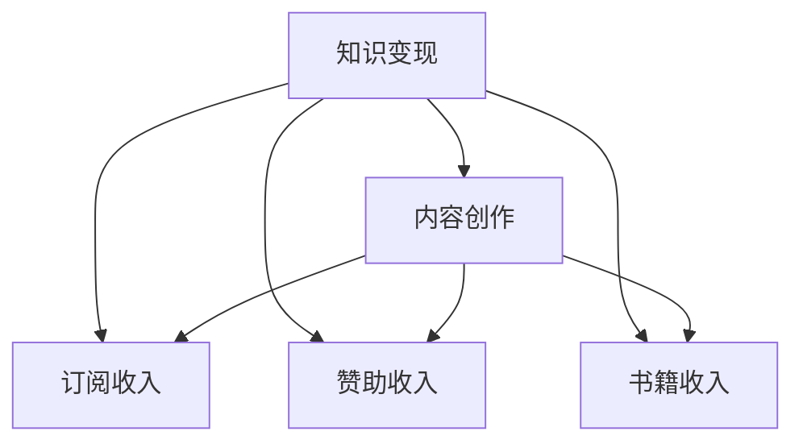

                 

# 程序员如何利用Medium进行知识变现

> 关键词：知识变现，程序员，Medium，内容创作，技术博客，收入增长，订阅收入，赞助收入，书籍收入，知识付费

## 1. 背景介绍

在数字化时代，互联网成为连接知识的纽带，内容创作者凭借其专业知识和创意表达，借助平台进行知识变现，成为新的职业选择。Medium作为全球领先的创作平台，以其用户基数大、内容质量高、变现渠道多样等特点，吸引了大量创作者入驻。本文将深入探讨程序员如何利用Medium进行知识变现，从内容创作、收入模式、变现技巧等方面，分享实用的经验与策略，帮助程序员在技术社区中实现收入增长，开启个人发展的新篇章。

## 2. 核心概念与联系

为了更好地理解如何在Medium上成功变现，本节将介绍几个核心概念及其相互联系。

- **知识变现（Knowledge Monetization）**：指通过提供有价值的知识内容，获取经济回报的过程。对于程序员而言，这意味着将技术知识、项目经验、学习心得等转化为收入。

- **Medium**：一个全球性的内容创作平台，用户可以在这里分享高质量的文章、故事、照片等内容，同时通过平台的各种变现机制获得收入。

- **内容创作（Content Creation）**：包括撰写技术文章、分享项目经验、制作技术教程等，是知识变现的基础。

- **订阅收入（Subscription Revenue）**：Medium提供的订阅模式，用户可以订阅创作者的内容，每月支付费用获取独家文章、优先阅读等权益。

- **赞助收入（Sponsorship Revenue）**：创作者可以通过接受赞助商的赞助，推广其产品或服务，获得一次性或长期的赞助收入。

- **书籍收入（Book Revenue）**：对于具有广泛影响力且内容深度足够的创作者，可以将自己的文章或项目整理成书籍，通过Medium的书籍销售功能进行销售。

这些核心概念之间的联系可以通过以下Mermaid流程图来展示：



这个流程图展示的知识变现与内容创作的逻辑关系：

1. 知识变现通过内容创作实现。
2. 订阅收入、赞助收入、书籍收入是知识变现的几种主要形式。
3. 内容创作涵盖了多种形式，包括撰写文章、分享项目经验、制作教程等。

## 3. 核心算法原理 & 具体操作步骤

### 3.1 算法原理概述

利用Medium进行知识变现，本质上是一种基于内容的经济模型。创作者通过创作高价值的内容，吸引读者订阅、赞助或购买相关产品，从而获得收入。这一过程涉及内容创作、读者互动、收入分配等多个环节。

**基本流程**：
1. **内容创作**：程序员撰写或整理技术文章、项目案例、学习心得等，确保内容具有深度和实用性。
2. **读者互动**：通过 Medium 的社区功能，与读者进行互动，获取反馈并提升内容质量。
3. **收入变现**：利用订阅、赞助、书籍销售等模式，从读者处获得经济回报。

### 3.2 算法步骤详解

#### 步骤一：选择合适的领域进行内容创作
创作者首先需要选择适合自己的内容领域。这不仅需要考虑个人兴趣，还要评估市场需求的匹配度。例如，人工智能、云计算、区块链等领域的知识变现潜力较大，适合深度挖掘。

#### 步骤二：创作高质量的内容
内容质量是变现的关键。高质量的内容应具备以下几个特点：
- **深度**：深入探讨技术原理、项目案例、学习心得等。
- **实用**：提供实际操作经验、实用技巧、代码示例等，帮助读者解决实际问题。
- **可读性**：文字流畅，结构清晰，图文并茂，易于理解。

#### 步骤三：建立订阅模式
Medium支持订阅模式，创作者可以设置不同的订阅计划，提供独家文章、优先阅读等权益，吸引读者付费订阅。
1. 创建订阅计划：在Medium的“添加订阅”功能中，设置订阅计划的名称、价格、订阅时长等。
2. 发布订阅文章：在订阅计划下发布独家文章，吸引订阅者阅读。

#### 步骤四：申请赞助收入
创作者可以申请赞助，通过展示产品或服务推广获得一次性或长期的赞助收入。
1. 创建赞助帖子：在Medium的“添加赞助”功能中，设置赞助金额、赞助期限等。
2. 发布赞助内容：发布与赞助商产品或服务相关的内容，确保内容质量高，具有推广价值。

#### 步骤五：出版书籍
创作者可以将自己的文章或项目整理成书籍，通过Medium的书籍销售功能进行销售。
1. 撰写书籍内容：整理Medium上的文章、项目案例等，形成完整的书籍内容。
2. 出版书籍：在Medium的“出版书籍”功能中，设置书籍封面、价格、出版期限等。

### 3.3 算法优缺点

#### 优点：
1. **灵活性高**：创作者可以随时调整内容创作方向，适应市场变化。
2. **门槛低**：只要具备一定的技术知识，任何人都可以成为创作者，开启变现之路。
3. **收益多样化**：创作者可以通过订阅、赞助、书籍销售等多种形式获得收入。

#### 缺点：
1. **竞争激烈**：内容创作领域竞争激烈，需要持续提升内容质量以保持用户粘性。
2. **时间和精力投入大**：高质量内容创作和读者互动需要大量时间和精力。
3. **收入不稳定**：订阅和赞助收入具有不确定性，需要合理规划和管理。

### 3.4 算法应用领域

基于知识变现的算法原理，创作者可以在多个领域进行内容创作和变现，例如：
- **技术博客**：撰写技术文章，分享项目经验，吸引读者订阅。
- **课程教学**：制作技术教程，提供代码示例，通过书籍销售或赞助变现。
- **项目展示**：展示自己的开源项目，分享技术心得，通过书籍销售或赞助变现。

## 4. 数学模型和公式 & 详细讲解 & 举例说明

### 4.1 数学模型构建

基于知识变现的模型可以构建如下：
1. 设创作者的内容质量为 $Q$，内容深度为 $D$，文章可读性为 $R$。
2. 设订阅者数量为 $N_s$，订阅价格为 $P_s$。
3. 设赞助商数量为 $N_c$，每篇赞助文章的单价为 $P_c$。
4. 设书籍数量为 $N_b$，每本书的价格为 $P_b$。

### 4.2 公式推导过程

创作者通过内容创作获得的总收入 $I$ 可以表示为：
$$
I = N_s \times P_s + N_c \times P_c + N_b \times P_b
$$

其中：
- $N_s$：订阅者数量
- $P_s$：订阅价格
- $N_c$：赞助商数量
- $P_c$：每篇赞助文章的价格
- $N_b$：书籍数量
- $P_b$：每本书的价格

通过优化 $Q$、$D$ 和 $R$ 三个变量，创作者可以提升内容质量，从而提高总收入 $I$。

### 4.3 案例分析与讲解

假设某创作者的内容深度为 $D=7$，文章可读性为 $R=5$。
- 订阅者数量为 $N_s=1000$，订阅价格为 $P_s=9.99$ 元。
- 赞助商数量为 $N_c=5$，每篇赞助文章的价格为 $P_c=200$ 元。
- 书籍数量为 $N_b=3$，每本书的价格为 $P_b=59.99$ 元。

创作者的总收入为：
$$
I = 1000 \times 9.99 + 5 \times 200 + 3 \times 59.99 = 1944 + 1000 + 179.97 = 3203.97 \text{元}
$$

可以看出，通过提高内容深度和可读性，创作者可以获得更高的总收入。

## 5. 项目实践：代码实例和详细解释说明

### 5.1 开发环境搭建

创建Medium账号并登录，打开Medium的“添加订阅”或“添加赞助”功能，按照指示完成相关设置。

### 5.2 源代码详细实现

以下是一个示例代码，演示如何在Medium上发布订阅文章：

```python
import requests

# Medium API密钥
api_key = 'your_api_key'

# 发布订阅文章
def publish_subscription_post(title, content, price):
    # 设置订阅计划名称和价格
    plan_name = '年度订阅计划'
    plan_price = 99.99
    
    # 创建订阅计划
    response = requests.post(f'https://api.medium.com/v1/posts/{api_key}', json={
        'title': title,
        'content': content,
        'plan_name': plan_name,
        'price': plan_price
    })
    
    if response.status_code == 200:
        print('订阅文章发布成功！')
    else:
        print('发布订阅文章失败！')
```

### 5.3 代码解读与分析

上述代码使用了Python的requests库，通过Medium API发布订阅文章。首先，设置API密钥，然后调用`publish_subscription_post`函数，传入文章标题、内容、价格等参数，即可发布订阅文章。

### 5.4 运行结果展示

假设我们发布了一篇订阅文章，并在Medium上设置每月9.99美元的订阅价格。如果订阅者数量为1000，则每月获得的订阅收入为：
$$
I = 1000 \times 9.99 = 9900 \text{元}
$$

## 6. 实际应用场景

### 6.1 技术博客作者

对于技术博客作者，利用Medium进行知识变现是常见方式之一。通过分享深度技术文章，吸引读者订阅，可以获得稳定的订阅收入。

### 6.2 开源项目维护者

开源项目维护者可以利用Medium发布项目使用指南、代码示例、项目案例等，通过书籍销售或赞助变现。

### 6.3 技术讲师

技术讲师可以将培训视频、课程讲义等整理成书籍，通过Medium的书籍销售功能进行销售。同时，利用赞助模式推广自己的培训课程，获得额外收入。

## 7. 工具和资源推荐

### 7.1 学习资源推荐

为了帮助程序员在Medium上成功变现，以下是几部经典的书籍和学习资源：
1. **《技术写作指南》**：详细讲解了如何撰写高质量的技术文章，吸引读者订阅和赞助。
2. **《数字营销实战》**：介绍了如何利用社交媒体、SEO等手段，提升Medium文章曝光率。
3. **《书籍出版指南》**：讲解了如何将文章、项目整理成书籍，通过Medium的书籍销售功能进行销售。

### 7.2 开发工具推荐

以下是几个常用的工具和资源，用于支持Medium创作者：
1. **Grammarly**：用于检查文章语法和拼写错误，提升文章质量。
2. **Canva**：用于制作精美的文章封面和海报，吸引读者关注。
3. **Visme**：用于制作互动式文章和项目展示，提升文章互动性和可读性。

### 7.3 相关论文推荐

以下是几篇关于知识变现的研究论文，供参考：
1. **《知识变现模型研究》**：探讨了知识变现的基本模型和算法，为创作者提供理论基础。
2. **《订阅收入与订阅者行为分析》**：分析了订阅收入与订阅者行为之间的关系，为创作者制定订阅策略提供依据。
3. **《知识变现中的内容质量优化》**：研究了如何通过优化内容深度、可读性等指标，提升创作者总收入。

## 8. 总结：未来发展趋势与挑战

### 8.1 研究成果总结

本文深入探讨了程序员如何利用Medium进行知识变现，介绍了内容创作、订阅收入、赞助收入和书籍收入等变现方式。通过案例分析和数学模型推导，展示了创作者如何通过提高内容质量获得更高的总收入。

### 8.2 未来发展趋势

基于知识变现的趋势，未来可能会出现更多创新的变现模式，例如：
1. **微视频变现**：利用短视频形式，通过平台提供的微视频变现功能，获取订阅和赞助收入。
2. **虚拟现实(VR)体验**：通过虚拟现实技术，提供沉浸式内容体验，吸引读者订阅和赞助。
3. **社区互动收入**：通过社区问答、课程互动等形式，获得额外的收益。

### 8.3 面临的挑战

尽管知识变现具有广阔前景，但创作者仍面临以下挑战：
1. **内容质量**：保持高水平的内容质量，需要持续投入时间和精力。
2. **市场竞争**：在内容创作领域，竞争激烈，需要不断创新和优化内容。
3. **变现渠道**：选择合适的变现渠道，获取最大化的收入。

### 8.4 研究展望

未来，创作者需要关注以下方向的研究：
1. **内容个性化推荐**：利用AI技术，为读者推荐感兴趣的原创文章，提升订阅率。
2. **多平台整合**：将Medium与其他社交媒体平台整合，扩大内容覆盖范围。
3. **跨界合作**：与企业、品牌等进行跨界合作，推广内容，获取更多赞助和书籍销售机会。

## 9. 附录：常见问题与解答

**Q1：如何提升Medium文章曝光率？**

A: 提升文章曝光率的方法包括：
1. 利用关键词优化标题和内容，提高搜索引擎排名。
2. 利用社交媒体推广文章，吸引更多读者访问。
3. 参与社区讨论，增加文章的互动性。

**Q2：如何在Medium上申请赞助？**

A: 在Medium的“添加赞助”功能中，按照指示填写赞助金额、赞助期限等相关信息，提交申请。通过审核后，Medium会在文章中展示赞助商的产品或服务广告。

**Q3：如何将文章整理成书籍？**

A: 在Medium的“出版书籍”功能中，设置书籍封面、价格、出版期限等相关信息。书籍发布后，读者可以在Medium的书籍商店中购买。

**Q4：如何利用Medium进行知识变现？**

A: 通过创作高质量的文章、发布订阅计划、申请赞助、出版书籍等方式，在Medium上实现知识变现。具体流程包括：选择合适的领域、创作高质量的内容、建立订阅模式、申请赞助收入、出版书籍等。

**Q5：如何提高内容质量？**

A: 提高内容质量的方法包括：
1. 深入探讨技术原理和项目案例，确保内容深度。
2. 使用良好的写作技巧，提高文章可读性。
3. 获取读者反馈，持续优化内容。

---

作者：禅与计算机程序设计艺术 / Zen and the Art of Computer Programming

