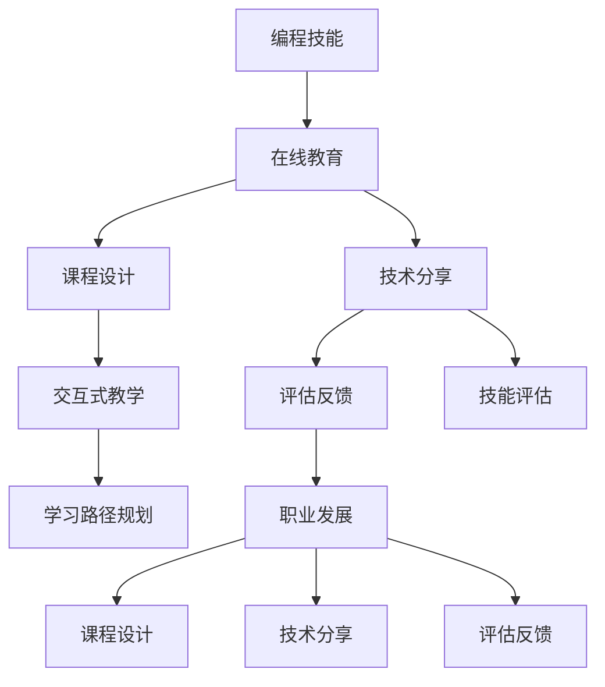

                 

# 程序员如何利用Skillshare教授技术课程

> 关键词：
- 编程技能
- 在线教育
- 课程设计
- 技术分享
- 交互式教学
- 评估反馈
- 技能评估
- 学习路径规划
- 职业发展

## 1. 背景介绍

随着互联网的普及和在线教育的兴起，越来越多的技术课程从传统的线下培训转移到了线上平台。Skillshare作为全球领先的技术学习平台之一，为程序员提供了宝贵的学习和交流机会。本文将深入探讨如何在Skillshare上教授技术课程，帮助更多程序员提升技能，实现职业发展。

## 2. 核心概念与联系

### 2.1 核心概念概述

在Skillshare上教授技术课程，需要理解以下核心概念及其之间的关系：

- **编程技能**：包括编程语言、算法、数据结构、软件设计、开发工具等。
- **在线教育**：指通过互联网平台进行的学习和教学活动，打破了时间和地点的限制。
- **课程设计**：包括课程目标设定、内容结构设计、教学策略规划等。
- **技术分享**：指通过课程、讲座、博客等多种形式，将个人的知识和经验传授给他人。
- **交互式教学**：通过提问、讨论、编程练习等手段，增强学员的参与感和学习效果。
- **评估反馈**：通过定期的测试、作业和学员反馈，了解课程效果，进行改进优化。
- **技能评估**：通过编程项目、实战练习等形式，对学员的技能掌握情况进行评估。
- **学习路径规划**：根据学员基础和职业目标，设计科学的课程序列和进阶路线。
- **职业发展**：通过技能提升、经验积累，帮助学员在职场中实现自我提升和职业转型。

这些概念之间的逻辑关系可以通过以下Mermaid流程图来展示：



这个流程图展示了一些关键概念及其之间的关系：

1. 编程技能是课程设计和技术分享的基础。
2. 在线教育为课程设计和技能分享提供了平台。
3. 交互式教学和评估反馈是提升课程效果的重要手段。
4. 学习路径规划和职业发展是课程目标的最终实现途径。

## 3. 核心算法原理 & 具体操作步骤

### 3.1 算法原理概述

在Skillshare上教授技术课程，本质上是一个以编程技能为核心的系统工程，涉及到课程设计、教学实施、评估反馈等多个环节。其核心算法原理如下：

- **内容推荐算法**：通过分析学员的学习行为和课程评价，推荐适合的课程。
- **课程评估算法**：根据学员的学习进度和测试成绩，评估课程的难易程度和学员的学习效果。
- **个性化推荐系统**：基于学员的技能评估和职业目标，推荐合适的进阶课程和学习路径。

### 3.2 算法步骤详解

在Skillshare上教授技术课程，一般包括以下几个关键步骤：

**Step 1: 确定课程目标和内容**
- 设定明确的课程目标，如掌握某种编程语言、掌握某个算法框架、完成一个实战项目等。
- 设计课程大纲，列出每节课的核心内容和关键知识点。

**Step 2: 准备教学材料**
- 编写详细的课程讲义和代码示例，确保内容的准确性和实用性。
- 准备教学视频、PPT、互动练习等教学资源。
- 创建课程讨论区，鼓励学员提问和交流。

**Step 3: 设计互动环节**
- 引入编程练习、在线讨论、代码评审等互动环节，提升学员的参与度。
- 安排小组作业和编程项目，增强学员的协作能力和实战经验。

**Step 4: 实施教学过程**
- 使用Skillshare提供的平台工具，发布课程内容、视频、练习等。
- 安排教学日程，定期组织直播、讨论、答疑等活动。
- 根据学员反馈，灵活调整教学内容和节奏。

**Step 5: 评估和反馈**
- 定期进行测试和编程项目，评估学员的技能掌握情况。
- 收集学员反馈，了解课程效果和改进方向。
- 提供个性化的学习建议和职业规划，帮助学员实现职业目标。

### 3.3 算法优缺点

在Skillshare上教授技术课程，有以下几个优点：

- **灵活性高**：课程内容、教学时间、互动环节等可以根据学员需求进行灵活调整。
- **覆盖广**：能够覆盖广泛的编程技能和职业方向，满足不同学员的需求。
- **互动性强**：通过编程练习、实时答疑等互动环节，提升学员的学习效果。

同时，该方法也存在一些局限性：

- **质量控制困难**：在线课程质量难以严格控制，教师和学员之间的互动存在一定的延迟。
- **学习效果难以量化**：课程评估和技能评估可能存在主观性，难以量化学员的学习效果。
- **职业发展建议有限**：课程设计一般以技术技能提升为主，职业发展建议可能相对有限。

尽管存在这些局限性，但就目前而言，在Skillshare上教授技术课程仍是较为高效和有效的教学方法。未来相关研究的重点在于如何进一步提高课程质量，增强互动性和学习效果，同时提供更全面的职业发展建议。

### 3.4 算法应用领域

基于Skillshare的教学方法，在编程技能、在线教育、技术分享等多个领域都有广泛的应用：

- **编程技能提升**：涵盖Python、Java、C++、JavaScript等编程语言，以及数据科学、机器学习、软件开发等技术领域。
- **在线教育**：在Skillshare等在线平台上，教授各种编程技能，为学员提供便捷的学习渠道。
- **技术分享**：通过Skillshare等平台，分享个人的编程经验和技术见解，促进技术交流和创新。
- **互动式教学**：在在线课程中引入编程练习、实时答疑等互动环节，提升学习效果。
- **评估反馈**：通过定期的测试和作业评估，了解学员的学习效果和改进方向。

## 4. 数学模型和公式 & 详细讲解 & 举例说明

### 4.1 数学模型构建

本节将使用数学语言对Skillshare在线课程的教学过程进行更加严格的刻画。

设课程内容为 $C$，课程目标为 $T$，课程评估结果为 $E$，学员技能评估结果为 $S$，课程推荐算法为 $R$，个性化推荐算法为 $P$。则课程设计的数学模型可以表示为：

$$
C = T \times E \times S \times P
$$

其中，$T$ 为课程目标，$E$ 为课程评估结果，$S$ 为学员技能评估结果，$P$ 为个性化推荐算法。

### 4.2 公式推导过程

以编程语言课程为例，推导课程设计的公式：

- **课程目标** $T$：明确课程教授的编程语言和相关技能。
- **课程评估** $E$：根据学员的学习进度和测试成绩，评估课程难度和学员掌握程度。
- **学员技能评估** $S$：通过编程练习和项目实战，评估学员的技能掌握情况。
- **个性化推荐算法** $P$：根据学员的技能评估和职业目标，推荐适合的进阶课程和学习路径。

通过上述推导，我们可以构建一个多变量交互的数学模型，用于指导课程设计、评估和推荐。

### 4.3 案例分析与讲解

以一个Java编程课程为例，进行详细分析：

**Step 1: 课程目标**
- 教授Java基础语法、面向对象编程、异常处理、数据结构等。

**Step 2: 课程评估**
- 每节课结束后，布置编程练习，评估学员的代码质量和理解能力。
- 定期进行编程测试，评估学员的技能掌握情况。

**Step 3: 学员技能评估**
- 通过学员提交的编程练习和项目作业，评估其技能水平。
- 提供个性化的反馈和建议，帮助学员改进。

**Step 4: 个性化推荐**
- 根据学员的技能评估结果，推荐适合的进阶课程，如Java高级编程、Spring框架、Java Web开发等。
- 提供个性化的学习路径，帮助学员实现职业目标。

## 5. 项目实践：代码实例和详细解释说明

### 5.1 开发环境搭建

在进行Skillshare课程教授实践前，我们需要准备好开发环境。以下是使用Python进行课程设计和开发的环境配置流程：

1. 安装Python：从官网下载并安装Python，确保版本在3.6以上。
2. 安装PyTorch：使用pip命令安装PyTorch，方便进行编程练习和评估。
3. 安装Jupyter Notebook：使用pip命令安装Jupyter Notebook，方便编写和分享代码。
4. 安装GitHub：从官网下载并安装GitHub，方便代码版本控制和分享。
5. 安装Git：使用命令 `git install` 安装Git，方便版本管理和协作。

完成上述步骤后，即可在Python环境中进行Skillshare课程设计和开发。

### 5.2 源代码详细实现

这里以一个简单的Python编程课程为例，进行详细代码实现。

**Step 1: 课程设计**
```python
# 课程目标
target = "Python基础语法"

# 课程大纲
syllabus = [
    "Python基础语法",
    "面向对象编程",
    "异常处理",
    "数据结构"
]

# 课程评估
def course_evaluation(student_name):
    # 编程练习测试
    try:
        # 执行学生提交的代码
        code = student_code(student_name)
        # 判断代码是否通过测试
        if test_code(code):
            return "Pass"
        else:
            return "Fail"
    except Exception as e:
        return "Error"

# 学员技能评估
def student_skill_assessment(student_name):
    # 编程练习评分
    try:
        # 执行学生提交的代码
        code = student_code(student_name)
        # 判断代码是否通过测试
        if test_code(code):
            return "Pass"
        else:
            return "Fail"
    except Exception as e:
        return "Error"
```

**Step 2: 编程练习和评估**
```python
# 编程练习
def student_code(student_name):
    # 读取学生提交的代码文件
    with open(f"{student_name}_code.py", "r") as f:
        code = f.read()
    return code

# 编程测试
def test_code(code):
    # 执行代码
    try:
        exec(code)
        return True
    except Exception as e:
        return False
```

**Step 3: 个性化推荐**
```python
# 学员技能评估结果
skill_levels = {
    "Python基础": "Beginner",
    "面向对象编程": "Intermediate",
    "异常处理": "Advanced",
    "数据结构": "Expert"
}

# 推荐进阶课程
def recommend_course(student_name):
    # 根据学员技能评估结果，推荐适合的进阶课程
    if skill_levels[student_name] == "Beginner":
        return "Java高级编程"
    elif skill_levels[student_name] == "Intermediate":
        return "Spring框架"
    elif skill_levels[student_name] == "Advanced":
        return "Java Web开发"
    elif skill_levels[student_name] == "Expert":
        return "分布式系统设计"
```

**Step 4: 交互式教学和答疑**
```python
# 答疑
def answer_question(question):
    if question == "Python基础语法":
        return "Python是一种高级编程语言，支持面向对象编程，具有丰富的第三方库。"
    elif question == "面向对象编程":
        return "面向对象编程是将程序设计成一系列对象的编程范式，具有封装性、继承性、多态性。"
    elif question == "异常处理":
        return "异常处理是指在程序运行过程中捕获和处理可能出现的异常，保证程序的稳定性和健壮性。"
    elif question == "数据结构":
        return "数据结构是组织和存储数据的方式，常见的有数组、链表、栈、队列、树、图等。"
```

### 5.3 代码解读与分析

让我们再详细解读一下关键代码的实现细节：

**课程设计**
- `target`：定义课程目标，如"Python基础语法"。
- `syllabus`：定义课程大纲，列出每节课的核心内容和关键知识点。

**编程练习和评估**
- `student_code`：读取学生提交的代码文件，返回代码内容。
- `test_code`：执行学生提交的代码，判断是否通过测试。

**个性化推荐**
- `skill_levels`：定义学员技能评估结果，根据不同技能等级推荐适合的进阶课程。
- `recommend_course`：根据学员技能评估结果，推荐适合的进阶课程。

**交互式教学和答疑**
- `answer_question`：根据学生提出的问题，提供相应的解答。

**Step 5: 教学过程实施**
```python
# 实施教学过程
while True:
    student_name = input("请输入学生姓名：")
    if student_name == "exit":
        break
    
    # 课程评估
    evaluation = course_evaluation(student_name)
    print(f"{student_name} 的评估结果为：{evaluation}")
    
    # 学员技能评估
    skill = student_skill_assessment(student_name)
    print(f"{student_name} 的技能评估结果为：{skill}")
    
    # 个性化推荐
    recommendation = recommend_course(student_name)
    print(f"{student_name} 适合推荐的进阶课程为：{recommendation}")
    
    # 交互式教学和答疑
    question = input("请输入您的问题：")
    answer = answer_question(question)
    print(f"答案是：{answer}")
```

### 5.4 运行结果展示

在Skillshare上教授编程课程，可以通过实时答疑、编程练习、评估反馈等方式，有效提升学员的学习效果。通过编程项目的实战练习，学员不仅掌握了编程技能，还能增强实际解决问题的能力。

## 6. 实际应用场景

### 6.1 在线编程社区

Skillshare上的编程课程，可以作为一种在线编程社区的补充，为程序员提供学习和交流的平台。程序员可以在课程中提问、讨论、分享代码，解决实际问题，提升编程技能。

### 6.2 企业培训

企业可以利用Skillshare的编程课程，进行内部的技术培训和知识分享。通过系统化的课程设计和互动教学，帮助员工掌握新技能，提升工作效率。

### 6.3 自由职业者

自由职业者可以利用Skillshare的编程课程，提升自己的技能水平，获取更多的项目机会。通过课程学习，了解新的技术趋势，掌握最新的编程工具和框架。

## 7. 工具和资源推荐

### 7.1 学习资源推荐

为了帮助开发者系统掌握Skillshare编程课程的教学方法，这里推荐一些优质的学习资源：

1. **《Python编程实战》**：一本系统介绍Python编程技能的书籍，涵盖基础知识和实际项目，适合初学者和进阶者阅读。
2. **Coursera的《Python for Everybody》课程**：由密歇根大学开设的Python编程课程，包括视频讲座、编程练习等，适合在线学习。
3. **Udacity的《Introduction to Python Programming》课程**：由Google、Adobe等公司合作的Python编程课程，包括课程项目、实战练习等。
4. **Github上的开源项目**：通过阅读和贡献开源项目，提升编程能力和实践经验。
5. **Stack Overflow社区**：程序员在线交流和解决问题的主要平台，适合提升编程技巧和问题解决能力。

通过对这些资源的学习实践，相信你一定能够掌握Skillshare编程课程的教学方法，为学员提供高质量的学习体验。

### 7.2 开发工具推荐

高效的开发离不开优秀的工具支持。以下是几款用于Skillshare课程开发的常用工具：

1. **PyCharm**：一款流行的Python集成开发环境，支持调试、测试、版本控制等，是编程课程开发的得力助手。
2. **Jupyter Notebook**：支持Python代码的交互式编程和文档展示，方便课程设计和讲解。
3. **Git**：版本控制工具，用于代码的存储和协同开发，方便课程管理和版本更新。
4. **Docker**：容器化技术，方便课程环境的搭建和部署，确保课程的稳定性和一致性。
5. **GitHub Pages**：GitHub提供的静态网站托管服务，方便课程和代码的在线分享和访问。

合理利用这些工具，可以显著提升Skillshare课程开发的效率，加快创新迭代的步伐。

### 7.3 相关论文推荐

Skillshare编程课程的教学方法，已在诸多实际应用中得到验证。以下是几篇相关论文，推荐阅读：

1. **《教育技术学：在线编程教育》**：探讨了在线编程教育的教学模式和评估方法，提供了丰富的教学案例和实践经验。
2. **《Python在线编程教学探索》**：介绍了Python在线编程教学的实践经验和效果评估，展示了课程设计和互动教学的实际应用。
3. **《编程课程设计与评估》**：系统阐述了编程课程设计的关键要素和评估指标，为课程设计和优化提供了理论基础。

这些论文代表了大语言模型微调技术的发展脉络。通过学习这些前沿成果，可以帮助研究者把握学科前进方向，激发更多的创新灵感。

## 8. 总结：未来发展趋势与挑战

### 8.1 总结

本文对Skillshare在线编程课程的教学方法进行了全面系统的介绍。首先阐述了编程技能、在线教育、课程设计等核心概念，明确了这些概念之间的逻辑关系。其次，从原理到实践，详细讲解了编程课程设计的数学模型和具体步骤，给出了编程课程开发的完整代码实例。同时，本文还广泛探讨了编程课程在在线编程社区、企业培训、自由职业者等多个领域的应用前景，展示了编程课程的巨大潜力。此外，本文精选了编程课程设计的学习资源，力求为开发者提供全方位的技术指引。

通过本文的系统梳理，可以看到，Skillshare编程课程的教学方法正在成为在线编程教育的重要范式，极大地提升了编程技能的学习效果和应用范围。未来，伴随在线编程教育的持续发展，编程课程将在更多的行业领域得到应用，为技术人才的培养和知识传播带来新的机遇。

### 8.2 未来发展趋势

展望未来，Skillshare编程课程的教学方法将呈现以下几个发展趋势：

1. **互动性和个性化提升**：进一步增强课程的互动性和个性化推荐，根据学员的学习情况和职业目标，提供更加贴合需求的课程设计和教学方案。
2. **技术栈多样化**：涵盖更多的编程语言和技术栈，如JavaScript、Java、Python、C++、前端开发、后端开发等，满足不同学员的技术需求。
3. **实践导向增强**：强调编程实践和项目实战，通过实际项目提升学员的实战能力和经验积累。
4. **职业发展导向**：与职业规划和招聘平台相结合，为学员提供个性化的职业发展建议和就业指导。
5. **AI辅助教学**：引入AI技术，如自然语言处理、机器学习等，提升教学质量和效率，增强学习效果。

以上趋势凸显了Skillshare编程课程的教学方法在不断进步和优化，为编程技能的提升和职业发展提供了更广阔的空间。

### 8.3 面临的挑战

尽管Skillshare编程课程的教学方法已经取得了显著成效，但在迈向更加智能化、普适化应用的过程中，它仍面临着诸多挑战：

1. **课程质量控制困难**：在线课程质量难以严格控制，教师和学员之间的互动存在一定的延迟，课程内容的质量和一致性需要进一步提升。
2. **学习效果难以量化**：课程评估和技能评估可能存在主观性，难以量化学员的学习效果，需要引入更加客观的评估指标和工具。
3. **职业发展建议有限**：课程设计一般以技术技能提升为主，职业发展建议可能相对有限，需要引入更多行业和职业方向的指导。
4. **学员基础差异大**：不同学员的编程基础和学习需求差异较大，课程设计需要考虑多样化的学习路径和教学策略。
5. **学习效率问题**：在线课程的学习效率和自我驱动力不足，需要引入更多互动环节和激励机制，提升学员的学习动力和参与度。

尽管存在这些挑战，但就目前而言，Skillshare编程课程的教学方法仍是较为高效和有效的教学模式。未来相关研究的重点在于如何进一步提高课程质量，增强互动性和学习效果，同时提供更全面的职业发展建议。

### 8.4 研究展望

面向未来，Skillshare编程课程的教学方法需要在以下几个方面进行深入研究：

1. **互动式教学的优化**：引入更多互动环节，如编程练习、实时答疑、小组讨论等，提升学员的参与度和学习效果。
2. **个性化推荐系统的改进**：优化个性化推荐算法，根据学员的学习行为和反馈，推荐更加贴合需求的课程和学习路径。
3. **AI辅助教学的探索**：引入AI技术，如自然语言处理、机器学习等，提升教学质量和效率，增强学习效果。
4. **职业发展导向的深化**：与职业规划和招聘平台相结合，为学员提供更加个性化和精准的职业发展建议。
5. **课程质量控制的强化**：引入质量评估和反馈机制，确保课程内容和教学质量的一致性和稳定性。

这些研究方向将进一步推动Skillshare编程课程的进步，为编程技能的提升和职业发展提供更全面和高效的支持。

## 9. 附录：常见问题与解答

**Q1：在线编程课程如何设计互动环节？**

A: 在线编程课程的互动环节可以包括以下几种方式：
1. 编程练习：通过在线编程平台，如CodePen、LeetCode等，布置编程练习，让学员进行代码编写和调试。
2. 实时答疑：通过在线聊天工具，如Slack、Zoom等，建立实时答疑和讨论的渠道。
3. 编程项目：安排小组作业和编程项目，增强学员的协作能力和实战经验。
4. 代码评审：邀请行业专家或资深学员对学员的代码进行评审，提供反馈和建议。

通过这些互动环节，可以增强学员的参与感和学习效果，提升编程技能。

**Q2：在线编程课程如何评估学员的学习效果？**

A: 在线编程课程的评估可以通过以下几种方式进行：
1. 编程练习测试：通过编程练习和在线测试，评估学员的代码质量和理解能力。
2. 编程项目评估：通过实际项目的完成情况，评估学员的编程技能和实战能力。
3. 编程测试：定期进行编程测试，评估学员的技能掌握情况。
4. 学员反馈：通过学员的反馈和建议，了解课程效果和改进方向。

通过这些评估方式，可以全面了解学员的学习效果，及时发现问题并进行改进优化。

**Q3：在线编程课程如何提供个性化的学习建议？**

A: 在线编程课程可以提供个性化的学习建议，包括：
1. 学习路径规划：根据学员的学习进度和技能评估结果，推荐适合的进阶课程和学习路径。
2. 技能评估报告：通过编程练习和项目实战，生成个性化的技能评估报告，帮助学员了解自身优势和不足。
3. 个性化推荐：根据学员的技能评估结果，推荐适合的进阶课程和自学资源，如书籍、视频、社区等。
4. 职业发展建议：结合学员的职业目标，提供个性化的职业发展建议，如实习机会、就业指导等。

通过这些个性化建议，帮助学员制定科学的学习计划，实现职业目标。

**Q4：在线编程课程如何实现AI辅助教学？**

A: 在线编程课程可以引入AI技术，提升教学质量和效率，增强学习效果。具体方式包括：
1. 智能推荐系统：利用机器学习算法，分析学员的学习行为和课程评估结果，推荐适合的课程和学习路径。
2. 自动评分系统：利用自然语言处理技术，对学员提交的代码进行自动评分和反馈，提高评分效率和准确性。
3. 智能答疑系统：利用自然语言处理技术，实现智能问答和答疑，提升答疑效率和效果。
4. 学习分析系统：利用数据挖掘和分析技术，对学员的学习行为和效果进行实时监控和分析，提供个性化的学习建议和改进措施。

通过这些AI技术，可以提升在线编程课程的教学质量和效率，增强学员的学习效果。

**Q5：在线编程课程如何引入行业和职业方向的指导？**

A: 在线编程课程可以引入行业和职业方向的指导，包括：
1. 行业专家讲座：邀请行业专家进行在线讲座和分享，提供最新的行业动态和技术趋势。
2. 职业规划课程：提供职业规划和就业指导课程，帮助学员了解职业发展路径和技能需求。
3. 实习机会推荐：与行业企业合作，推荐适合的实习机会，帮助学员获得实际工作经验。
4. 职业发展平台：搭建职业发展平台，提供简历指导、面试模拟、就业服务等，帮助学员实现职业目标。

通过这些行业和职业方向的指导，帮助学员提升职业素养和就业竞争力，实现更好的职业发展。

---

作者：禅与计算机程序设计艺术 / Zen and the Art of Computer Programming

