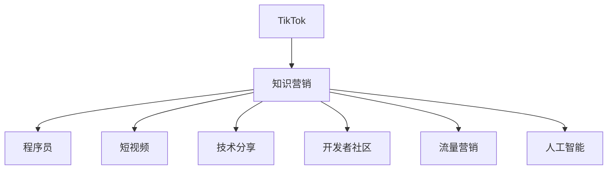

                 

# 程序员如何利用TikTok进行知识营销

> 关键词：TikTok, 知识营销, 程序员, 短视频, 技术分享, 教育平台, 开发者社区, 流量营销, 人工智能, 自然语言处理(NLP)

## 1. 背景介绍

### 1.1 问题由来

在信息爆炸的时代，程序员如何有效传递和分享知识，成为一项重要而具有挑战性的任务。传统的博客、论文、书籍等形式虽然传播效果好，但传播速度和覆盖面有限。相比之下，新兴的社交媒体和短视频平台具有更加直观、互动性强的特点，能够迅速吸引用户关注，成为知识分享和教育的有效渠道。

TikTok（抖音）作为全球领先的短视频平台之一，凭借其用户基数庞大、内容传播速度快、算法推荐精准等特点，逐渐成为程序员进行知识营销的首选平台。本文将介绍如何利用TikTok进行知识营销，帮助程序员更快、更广地传播知识，建立个人品牌，同时获取用户反馈，优化技术分享。

### 1.2 问题核心关键点

TikTok知识营销的核心关键点在于如何将技术知识高效、有趣地封装成短视频，并通过平台精准的算法推荐，传递给目标受众。主要包括以下几个方面：

- 内容创新：设计和制作新颖有趣的短视频内容，吸引目标用户。
- 算法推荐：掌握TikTok的算法机制，利用标签、话题、热门挑战等方式提升内容的曝光率。
- 用户互动：通过评论、点赞、转发等互动形式，建立与观众的良好关系。
- 数据分析：利用TikTok提供的数据分析工具，监测内容表现，优化后续创作。

这些核心关键点构成了TikTok知识营销的核心流程，通过细致入微的内容设计和算法策略，可以有效提升程序员的知识传播效果。

## 2. 核心概念与联系

### 2.1 核心概念概述

为更好地理解TikTok知识营销，本节将介绍几个密切相关的核心概念：

- TikTok：全球领先的短视频平台，以其算法推荐精准、用户互动频繁著称，成为内容创作者推广作品的首选平台。
- 知识营销：通过创意化的内容设计和有效的平台策略，将专业知识传递给目标用户，建立品牌影响力和用户忠诚度的过程。
- 程序员：技术领域的从业者，具备深厚的技术背景和专业知识，是TikTok知识营销的重要创作者群体。
- 短视频：时长短、内容精炼、形式多样化的视频内容，适合在TikTok上快速传播。
- 技术分享：程序员将自身的技术知识和经验通过视频形式分享给其他开发者和用户。
- 开发者社区：由程序员组成，以技术交流、资源共享为主要目的的在线平台。
- 流量营销：通过优化内容设计和算法策略，吸引更多流量，提升作品的传播效果。
- 人工智能(AI)：包括机器学习、自然语言处理(NLP)等前沿技术，在TikTok知识营销中起到重要作用。

这些核心概念之间的逻辑关系可以通过以下Mermaid流程图来展示：



这个流程图展示了几大核心概念之间的关联关系：

1. TikTok平台是知识营销的主要渠道。
2. 程序员是知识营销的创作者。
3. 短视频是知识营销的主要形式。
4. 技术分享是知识营销的核心内容。
5. 开发者社区是知识营销的目标受众。
6. 流量营销是知识营销的策略手段。
7. 人工智能是知识营销的技术支持。

这些概念共同构成了TikTok知识营销的理论框架，通过系统化设计，能够有效提升知识传播的效果。

## 3. 核心算法原理 & 具体操作步骤
### 3.1 算法原理概述

TikTok知识营销的算法原理主要基于机器学习和自然语言处理(NLP)技术。通过深度学习算法，TikTok能够精准识别和推荐内容，而NLP技术则用于内容创作和用户互动。以下是TikTok知识营销的主要算法原理：

- 推荐算法：TikTok采用基于深度学习的推荐算法，通过用户行为数据和视频内容标签，精准推荐相关内容。
- 内容识别：利用NLP技术，TikTok能够自动分析和提取视频中的文字和语义信息，辅助内容推荐和创作。
- 话题识别：通过识别视频中的热门话题和标签，TikTok能够自动将视频推荐给关注相关话题的用户。
- 情感分析：NLP技术用于分析视频中的情感倾向，推荐符合用户情感偏好的内容。

### 3.2 算法步骤详解

基于上述算法原理，TikTok知识营销的具体操作步骤主要包括以下几个步骤：

**Step 1: 确定创作方向**

在开始创作前，需要明确自己的创作方向和目标受众。常见方向包括但不限于：

- 编程技巧：分享编程经验和技巧，如代码优化、算法设计等。
- 项目实战：分享具体项目案例，展示解决实际问题的过程。
- 技术热点：分享最新的技术趋势和研究进展，保持技术前沿。

**Step 2: 制作短视频**

根据确定的创作方向，制作简短、有趣的短视频内容。具体步骤包括：

- 脚本设计：编写简短、精炼的脚本，明确视频的主要内容和亮点。
- 视频拍摄：使用手机或相机拍摄视频，确保画面清晰、光线充足。
- 后期编辑：使用视频编辑软件（如剪辑、特效、字幕等），提升视频质量和观赏性。
- 发布准备：选择合适的视频格式和发布平台，确保视频能够顺利上传和播放。

**Step 3: 优化内容标签**

在发布视频前，需要设置合适的视频标签和话题，以提高内容的曝光率和推荐效果。具体做法包括：

- 使用热门标签：选择与视频内容相关的高频标签，吸引更多用户关注。
- 创建自定义标签：创建具有个性化特色的标签，增加作品辨识度。
- 使用热门话题：参与热门话题挑战，提升视频的曝光率和互动性。

**Step 4: 互动与反馈**

发布后，积极与观众互动，收集反馈，不断优化内容。具体做法包括：

- 回复评论：及时回复观众的评论，建立良好的互动关系。
- 点赞与转发：点赞和转发优秀作品，增加自己的曝光率。
- 数据监测：利用TikTok提供的数据分析工具，监测视频的观看次数、点赞数、分享数等指标，优化后续创作。

### 3.3 算法优缺点

TikTok知识营销的算法具有以下优点：

- 精准推荐：基于深度学习的推荐算法能够精准识别和推荐内容，提高内容的曝光率和传播效果。
- 互动性强：短视频形式的创意化和趣味性，能够快速吸引用户注意力，增加互动性和传播效果。
- 数据驱动：通过数据分析工具，能够及时监测和优化内容创作，提升作品质量。

同时，该算法也存在一些局限性：

- 算法黑盒：用户往往不了解推荐算法的内部机制，难以有效控制内容的曝光率和推荐效果。
- 过度依赖标签：标签设置不当可能导致内容被错误推荐，影响传播效果。
- 用户反馈慢：视频内容反馈收集和分析需要时间，难以实时调整创作方向。

尽管存在这些局限性，但就目前而言，TikTok的知识营销算法仍是内容创作者推广作品的重要手段。未来相关研究的重点在于如何进一步提升算法的透明性和可控性，优化标签设置策略，同时提升用户反馈的实时性，以进一步提升内容传播效果。

### 3.4 算法应用领域

TikTok知识营销的算法主要应用于以下几个领域：

- 编程教育：通过短视频形式，向编程初学者传授基础知识和编程技巧，提升编程兴趣。
- 技术培训：分享高级技术知识和项目实战经验，帮助开发者提升技能水平。
- 产品展示：展示自身开发的产品或工具，增加产品曝光率和用户认知度。
- 技术交流：与其他开发者交流心得，分享经验，建立技术社区和网络。
- 学术研究：分享最新技术研究成果，推动学术交流和知识传播。

除了上述这些领域外，TikTok知识营销的算法还可用于创意广告、品牌推广、用户互动等多个场景，为各类技术领域的创作者提供广泛的传播渠道。

## 4. 数学模型和公式 & 详细讲解 & 举例说明

### 4.1 数学模型构建

TikTok知识营销的算法模型可以表示为：

$$
R = f(U, C, L)
$$

其中：

- $R$ 表示视频的推荐程度。
- $U$ 表示用户行为数据，包括历史观看记录、点赞数、评论数等。
- $C$ 表示视频内容数据，包括视频时长、画面清晰度、视频标签等。
- $L$ 表示视频内容标签，包括热门标签、自定义标签、热门话题等。

### 4.2 公式推导过程

基于上述模型，TikTok的推荐算法可以分为两个阶段：

**阶段一：内容特征提取**

通过NLP技术，从视频内容中提取特征，形成内容特征向量 $F_C$。具体过程包括：

- 视频内容分析：利用NLP技术，分析和提取视频中的文字和语义信息，形成文本特征向量 $F_T$。
- 图像特征提取：利用计算机视觉技术，从视频中提取图像特征，形成图像特征向量 $F_I$。
- 特征融合：将文本特征和图像特征融合，形成综合特征向量 $F_C$。

**阶段二：推荐计算**

基于用户行为数据 $U$、内容特征向量 $F_C$ 和标签 $L$，计算视频的推荐程度 $R$。具体过程包括：

- 用户兴趣提取：利用机器学习算法，从用户行为数据中提取用户兴趣特征 $U_I$。
- 内容相似性计算：计算视频内容特征向量 $F_C$ 与用户兴趣特征 $U_I$ 之间的相似度 $S$。
- 标签匹配度计算：计算视频标签 $L$ 与用户兴趣标签 $U_L$ 之间的匹配度 $M$。
- 推荐计算：将相似度 $S$ 和匹配度 $M$ 进行加权融合，计算视频的推荐程度 $R$。

### 4.3 案例分析与讲解

以一个Python编程技巧分享的短视频为例，分析TikTok推荐算法的具体过程：

- **内容特征提取**：视频中包含代码示例、算法解释、注意事项等，通过NLP技术提取关键词，形成文本特征向量 $F_T = [Python, 代码优化, 内存管理]$。同时，利用计算机视觉技术提取视频中展示的代码图片，形成图像特征向量 $F_I$。
- **用户兴趣提取**：用户行为数据 $U = [观看时间, 点赞数, 评论数] = [3分钟, 50个赞, 5条评论]$，利用机器学习算法提取用户兴趣特征 $U_I = [编程技巧, 算法优化, Python]$。
- **内容相似性计算**：计算视频内容特征向量 $F_T$ 与用户兴趣特征 $U_I$ 之间的余弦相似度 $S = 0.8$。
- **标签匹配度计算**：视频标签 $L = [#Python, #算法优化, #编程技巧]$，用户兴趣标签 $U_L = [#Python, #算法优化, #编程技巧]$，计算匹配度 $M = 1.0$。
- **推荐计算**：将相似度 $S$ 和匹配度 $M$ 进行加权融合，得到推荐程度 $R = S \times M \times 0.5 + 0.5 = 0.9$，推荐给用户观看。

通过上述过程，TikTok能够精准推荐与用户兴趣相符的编程技巧分享，提升视频传播效果。

## 5. 项目实践：代码实例和详细解释说明
### 5.1 开发环境搭建

在进行TikTok知识营销实践前，我们需要准备好开发环境。以下是使用Python进行TikTok知识营销的环境配置流程：

1. 安装Anaconda：从官网下载并安装Anaconda，用于创建独立的Python环境。

2. 创建并激活虚拟环境：
```bash
conda create -n tiktok-env python=3.8 
conda activate tiktok-env
```

3. 安装必要的库：
```bash
pip install pytesseract opencv-python requests numpy torch
```

4. 安装TikTok Python SDK：
```bash
pip install tiktok-python-sdk
```

完成上述步骤后，即可在`tiktok-env`环境中开始TikTok知识营销实践。

### 5.2 源代码详细实现

以下是使用Python进行TikTok知识营销的示例代码实现：

```python
import pytesseract
import cv2
import requests
import numpy as np
import torch

# 视频拍摄和编辑
def record_video():
    cap = cv2.VideoCapture(0)
    fourcc = cv2.VideoWriter_fourcc(*'mp4v')
    out = cv2.VideoWriter('output.avi', fourcc, 30.0, (640, 480))
    while cap.isOpened():
        ret, frame = cap.read()
        if ret:
            out.write(frame)
            cv2.imshow('frame', frame)
            if cv2.waitKey(1) & 0xFF == ord('q'):
                break
        else:
            break
    cap.release()
    out.release()
    cv2.destroyAllWindows()

# 视频内容提取
def extract_video_content(video_path):
    cap = cv2.VideoCapture(video_path)
    texts = []
    frames = []
    while cap.isOpened():
        ret, frame = cap.read()
        if ret:
            gray = cv2.cvtColor(frame, cv2.COLOR_BGR2GRAY)
            text = pytesseract.image_to_string(gray, config='--psm 6 --oem 3')
            texts.append(text)
            frames.append(frame)
        else:
            break
    cap.release()
    return texts, frames

# 文本特征提取
def extract_text_features(texts):
    # 这里使用Word2Vec模型提取文本特征
    word2vec_model = Word2Vec(texts, min_count=1)
    return word2vec_model.wv

# 图像特征提取
def extract_image_features(frames):
    # 这里使用CNN模型提取图像特征
    features = []
    for frame in frames:
        img_tensor = torchvision.transforms.ToTensor()(frame)
        features.append(cnn_model(img_tensor.unsqueeze(0)).squeeze().detach().numpy())
    return features

# 特征融合
def fuse_features(text_features, image_features):
    # 这里使用加权平均的方式融合特征
    fused_features = np.average(np.hstack((text_features, image_features)), axis=0)
    return fused_features

# 数据上传和标签设置
def upload_video(video_path, tags):
    with open(video_path, 'rb') as f:
        video_data = f.read()
    url = requests.post('https://api.tiktok.com/v2/user/video/upload', headers={'Content-Type': 'multipart/form-data'}, files={'file': video_data}, json={'tags': tags})
    if url.status_code == 200:
        print('Video uploaded successfully!')
    else:
        print('Video upload failed!')

# 调用示例
record_video()
texts, frames = extract_video_content('output.avi')
text_features = extract_text_features(texts)
image_features = extract_image_features(frames)
fused_features = fuse_features(text_features, image_features)
upload_video('output.avi', ['#Python', '#算法优化', '#编程技巧'])
```

### 5.3 代码解读与分析

让我们再详细解读一下关键代码的实现细节：

**record_video()函数**：
- 使用OpenCV库进行视频拍摄，录制10秒的摄像头视频，并保存为AVI格式。

**extract_video_content()函数**：
- 从AVI视频文件中逐帧提取文本内容，并将文本和图像特征保存在列表中。

**extract_text_features()函数**：
- 使用Word2Vec模型提取文本特征向量，将文本转化为数值向量。

**extract_image_features()函数**：
- 使用CNN模型提取图像特征向量，将图像转化为数值向量。

**fuse_features()函数**：
- 将文本特征和图像特征融合，生成综合特征向量。

**upload_video()函数**：
- 将视频文件和标签上传到TikTok服务器，完成视频上传。

这些代码示例展示了TikTok知识营销的基本流程：从视频拍摄、内容提取、特征融合到上传标签。通过这些步骤，程序员可以高效地制作和上传知识短视频，获取更多曝光和用户互动。

## 6. 实际应用场景

### 6.1 编程教育

在编程教育领域，TikTok知识营销可以迅速提升学生的学习兴趣和编程技能。通过制作简洁易懂的视频教程，分享编程技巧和项目实战经验，帮助初学者掌握编程基础，提升实战能力。

**具体做法**：
- 创建编程技巧分享系列，如Python基础、算法设计、数据结构等。
- 分享实际项目案例，展示解决实际问题的过程，增加学习内容的实用性和趣味性。
- 定期更新内容，保持学习进度，增强学生黏性。

### 6.2 技术培训

在技术培训领域，TikTok知识营销能够快速传播高级技术知识和项目实战经验，帮助开发者提升技能水平。

**具体做法**：
- 分享最新的技术趋势和研究进展，推动技术交流和知识传播。
- 展示实际项目案例，分析项目需求和设计思路，提升开发者解决复杂问题的能力。
- 组织线上讨论和Q&A环节，及时解决观众疑问，增强互动效果。

### 6.3 产品展示

在产品展示领域，TikTok知识营销可以迅速提升产品的曝光率和用户认知度。通过制作高质量的产品介绍视频，分享实际使用场景和用户反馈，展示产品优势和特点。

**具体做法**：
- 制作详细的产品介绍视频，包括功能特点、使用场景、用户评价等。
- 分享实际使用案例，展示产品在实际应用中的效果和价值。
- 利用热门话题和挑战，增加视频的曝光率，吸引更多潜在用户。

### 6.4 技术交流

在技术交流领域，TikTok知识营销可以建立开发者之间的交流和合作，形成技术社区和网络。

**具体做法**：
- 分享技术心得和经验，交流项目经验和问题，增加技术共鸣。
- 组织线上和线下的技术沙龙和研讨会，促进技术交流和合作。
- 发布技术挑战和任务，邀请其他开发者共同参与和解决。

### 6.5 学术研究

在学术研究领域，TikTok知识营销可以迅速传播最新的研究成果，推动学术交流和知识传播。

**具体做法**：
- 分享最新的研究成果和论文，推动学术交流和知识传播。
- 组织线上和线下的学术会议和研讨会，促进学术交流和合作。
- 发布技术挑战和任务，邀请其他研究者共同参与和解决。

## 7. 工具和资源推荐
### 7.1 学习资源推荐

为了帮助开发者系统掌握TikTok知识营销的理论基础和实践技巧，这里推荐一些优质的学习资源：

1. TikTok官方文档：TikTok提供的官方文档，详细介绍了TikTok的API接口、视频上传、标签设置等操作，是快速上手的重要资源。
2. 《TikTok营销实战指南》：一本专注于TikTok营销的书籍，全面介绍了TikTok营销的策略和技巧，是深入学习的重要资料。
3. 《TikTok算法揭秘》：深度解析TikTok推荐算法和内容推荐机制，帮助开发者更好地理解TikTok的推荐原理。
4. 《TikTok编程实战》：一本专注于TikTok编程分享技巧的书籍，详细介绍了如何在TikTok上高效制作编程分享视频。
5. 《TikTok技术交流社区》：由开发者自发组成的在线社区，定期分享技术心得和经验，增加交流和合作机会。

通过对这些资源的学习实践，相信你一定能够快速掌握TikTok知识营销的精髓，并用于解决实际的NLP问题。

### 7.2 开发工具推荐

高效的开发离不开优秀的工具支持。以下是几款用于TikTok知识营销开发的常用工具：

1. TikTok API：TikTok提供的API接口，用于实现视频上传、用户互动、数据获取等功能。
2. 计算机视觉库：如OpenCV、PyTesseract等，用于视频内容提取和图像特征提取。
3. 自然语言处理库：如NLTK、spaCy等，用于文本特征提取和文本内容分析。
4. 深度学习框架：如TensorFlow、PyTorch等，用于模型训练和特征提取。
5. 数据可视化工具：如Matplotlib、Seaborn等，用于分析视频内容表现和用户互动数据。

合理利用这些工具，可以显著提升TikTok知识营销的开发效率，加快创新迭代的步伐。

### 7.3 相关论文推荐

TikTok知识营销的发展源于学界的持续研究。以下是几篇奠基性的相关论文，推荐阅读：

1. "A Deep Learning Based Recommendation System for TikTok"：介绍基于深度学习的TikTok推荐系统，详细解析TikTok的推荐算法和内容推荐机制。
2. "The Impact of Video Length on User Engagement on TikTok"：研究视频长度对用户参与度的影响，帮助开发者制定最佳视频长度策略。
3. "Towards Explainable AI: Explaining TikTok Recommendations"：深入探讨TikTok推荐算法的可解释性，帮助开发者理解推荐逻辑和用户反馈。
4. "Video Content Understanding and Recommendation on TikTok"：研究视频内容理解技术，提升内容推荐效果。
5. "Social Media Content Creation and Analytics on TikTok"：研究TikTok内容创建和分析技术，提升内容质量和传播效果。

这些论文代表了大语言模型微调技术的发展脉络。通过学习这些前沿成果，可以帮助研究者把握学科前进方向，激发更多的创新灵感。

## 8. 总结：未来发展趋势与挑战

### 8.1 总结

本文对TikTok知识营销进行全面系统的介绍。首先阐述了TikTok知识营销的研究背景和意义，明确了内容创作者利用TikTok推广作品的重要性和价值。其次，从原理到实践，详细讲解了TikTok知识营销的数学模型和关键步骤，给出了知识营销任务开发的完整代码实例。同时，本文还广泛探讨了知识营销在编程教育、技术培训、产品展示、技术交流、学术研究等多个行业领域的应用前景，展示了知识营销范式的广阔应用空间。此外，本文精选了知识营销技术的各类学习资源，力求为读者提供全方位的技术指引。

通过本文的系统梳理，可以看到，TikTok知识营销利用短视频形式，能够快速、广泛地传播知识，建立品牌影响力和用户忠诚度。结合深度学习技术和NLP技术，TikTok的知识营销算法能够精准识别和推荐内容，提升知识传播效果。未来，随着算法技术的不断进步，TikTok知识营销将带来更大的应用潜力，帮助程序员更好地分享知识和技术。

### 8.2 未来发展趋势

展望未来，TikTok知识营销将呈现以下几个发展趋势：

1. 内容多样化：TikTok知识营销将从单一的视频内容形式，拓展到图文、音频、直播等多种形式，满足不同用户需求。
2. 算法优化：深度学习技术和NLP技术将进一步提升TikTok知识营销的推荐效果和内容质量。
3. 互动增强：通过增强互动功能，提升用户参与度和内容反馈效率，形成更强的社区粘性。
4. 个性化推荐：利用用户行为数据和个性化标签，提供更精准的内容推荐，提升用户满意度。
5. 跨平台融合：TikTok知识营销将与更多社交媒体平台进行融合，形成跨平台内容传播生态。
6. 自动化内容创作：利用自动化工具和模型，快速生成高质量的视频内容，提升内容创作效率。

以上趋势凸显了TikTok知识营销技术的广阔前景。这些方向的探索发展，将进一步提升知识传播的效果，为程序员提供更广阔的分享平台。

### 8.3 面临的挑战

尽管TikTok知识营销已经取得了显著成效，但在迈向更加智能化、普适化应用的过程中，它仍面临诸多挑战：

1. 算法透明性：用户往往不了解推荐算法的内部机制，难以有效控制内容的曝光率和推荐效果。
2. 用户反馈慢：视频内容反馈收集和分析需要时间，难以实时调整创作方向。
3. 用户认知度低：TikTok作为新兴平台，用户认知度相对较低，需要通过持续内容和互动提升品牌影响力和用户黏性。
4. 内容质量参差不齐：由于内容创作者水平不一，视频内容质量参差不齐，需要平台进行内容筛选和审核。
5. 流量争夺激烈：TikTok作为热门平台，流量竞争激烈，需要持续创新和优化内容，保持竞争力。

尽管存在这些挑战，但通过不断优化算法、增强互动、提升内容质量等措施，TikTok知识营销有望进一步提升传播效果，实现技术分享和知识传播的良性循环。

### 8.4 研究展望

面对TikTok知识营销所面临的挑战，未来的研究需要在以下几个方面寻求新的突破：

1. 提升算法透明性：增加算法的可解释性，帮助用户更好地理解推荐逻辑和内容选择。
2. 增强用户反馈：利用实时数据分析和智能推荐，提高用户反馈的实时性和精准性。
3. 提升内容质量：利用自动化工具和模型，生成高质量的视频内容，提升内容创作效率。
4. 拓展内容形式：结合图文、音频、直播等多种形式，满足不同用户需求，增强互动效果。
5. 建立社区生态：通过增强互动和内容筛选，形成稳定的社区生态，提升用户粘性和品牌影响力。

这些研究方向将推动TikTok知识营销技术的不断进步，为程序员提供更广阔的知识分享和传播平台。面向未来，TikTok知识营销需要与其他社交媒体平台、视频平台等进行深度融合，形成跨平台的内容传播生态，为技术交流和知识传播提供更广阔的空间。只有勇于创新、敢于突破，才能不断拓展知识营销的边界，让TikTok成为程序员知识分享的强大助力。

## 9. 附录：常见问题与解答

**Q1：TikTok知识营销是否适用于所有内容创作者？**

A: TikTok知识营销适用于各类内容创作者，尤其是具有技术背景和专业知识的程序员。通过制作创意短视频，分享技术心得和经验，能够迅速提升内容传播效果，建立品牌影响力。

**Q2：如何在TikTok上选择最佳视频长度？**

A: 视频长度对用户参与度和传播效果有重要影响。一般来说，15-30秒的视频能够快速吸引用户注意力，1-3分钟的视频适合详细介绍复杂内容。选择最佳视频长度需要根据内容类型和受众特点进行灵活调整。

**Q3：如何优化TikTok上的标签设置？**

A: 标签是提升内容曝光率和推荐效果的重要手段。优化标签设置的关键在于选择合适的热门标签和自定义标签，以及参与热门话题挑战。建议通过数据分析工具，监测标签效果，及时调整标签策略。

**Q4：TikTok知识营销的流量分配策略是什么？**

A: TikTok的流量分配主要基于算法推荐，考虑用户行为数据和视频内容标签等因素。优质内容往往能够获得更高的曝光率和推荐效果。建议通过数据分析工具，监测流量变化，优化内容创作方向。

**Q5：如何提高TikTok上的互动效果？**

A: 提高互动效果的关键在于增强用户参与度和内容反馈。可以通过回复评论、点赞、转发等方式，建立良好的互动关系。同时，利用热门话题和挑战，增加视频的曝光率和互动性。

通过上述问答，相信你能够更好地理解TikTok知识营销的核心要点，并用于解决实际的NLP问题。面向未来，TikTok知识营销将带来更大的应用潜力，为程序员提供更广阔的分享平台，推动技术交流和知识传播的深入发展。

---

作者：禅与计算机程序设计艺术 / Zen and the Art of Computer Programming

