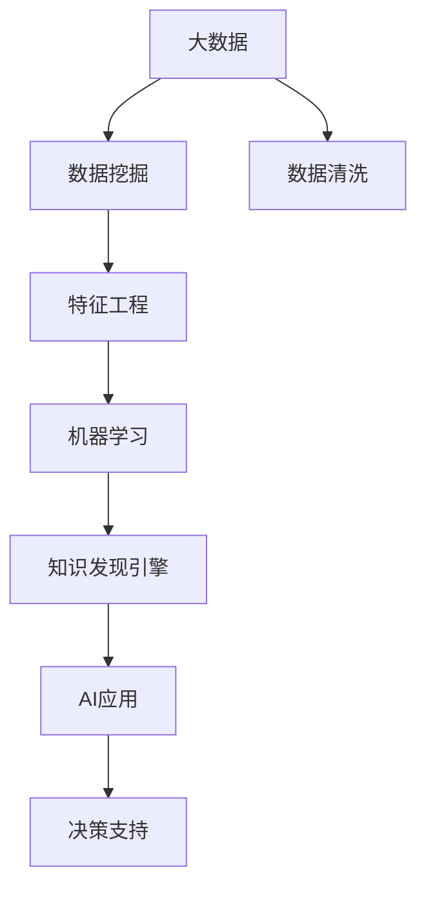

                 

# 程序员如何利用知识发现引擎实现财富自由

> 关键词：知识发现引擎,大数据,数据挖掘,机器学习,人工智能,财富自由

## 1. 背景介绍

在现代社会中，信息爆炸和数据量激增使得知识的获取和利用变得更加复杂和困难。数据驱动的决策和个性化服务需求日益增加，知识发现引擎作为一种能够从海量数据中提取有价值信息的技术，逐渐成为企业和个人实现数据驱动决策和创新应用的重要工具。然而，尽管知识发现引擎具有巨大潜力，要充分释放其价值，还需进一步结合人工智能技术，实现高效、精准的知识发现和应用。

本文将深入探讨如何利用知识发现引擎和人工智能技术，帮助程序员实现财富自由。文章将从背景介绍、核心概念与联系、核心算法原理、具体操作步骤、数学模型构建、项目实践、实际应用场景、工具和资源推荐、总结、未来发展趋势与挑战、以及常见问题与解答等多个维度展开讨论，为读者提供全面的技术指导。

## 2. 核心概念与联系

### 2.1 核心概念概述

- **知识发现引擎(Knowledge Discovery Engine, KDE)**：利用数据挖掘、统计分析、机器学习等技术，从大规模数据中提取有价值的信息和知识的工具。知识发现引擎通过自动化地分析数据，发现模式、规律和关联，支持决策和创新应用。

- **大数据(Big Data)**：指规模巨大、类型多样、更新快速的数据集，通常无法通过传统的数据处理工具进行管理、分析和处理。大数据包括结构化数据、半结构化数据和非结构化数据。

- **数据挖掘(Data Mining)**：从大规模数据集中自动发现模式、关联、异常和知识的过程，是知识发现的重要手段。

- **机器学习(Machine Learning)**：利用算法和统计模型，让计算机从数据中学习规律和知识，并应用于实际问题解决的技术。

- **人工智能(Artificial Intelligence, AI)**：使计算机具备人类智能的算法和系统，可以自主学习、推理和决策。

这些核心概念之间的联系主要体现在知识发现引擎通常通过大数据处理和数据挖掘技术，利用机器学习算法，实现对数据的深度分析和知识发现，最终为人工智能应用提供有力支持。

### 2.2 核心概念原理和架构的 Mermaid 流程图



该图表展示了大数据到AI应用的整体流程：大数据通过数据挖掘得到清洗和特征处理，经过机器学习算法提取知识，最终由知识发现引擎实现对数据的深度分析和知识发现，并为AI应用提供决策支持。

## 3. 核心算法原理 & 具体操作步骤

### 3.1 算法原理概述

知识发现引擎利用机器学习算法对数据进行建模和分析，从中发现隐藏的模式和知识。常用的算法包括分类、聚类、关联规则、异常检测等。以下是几种典型算法的原理概述：

- **分类算法**：用于将数据集划分为不同的类别，常用的算法有决策树、朴素贝叶斯、支持向量机等。
- **聚类算法**：将相似的数据点划分为同一类别的无监督学习算法，常用的算法有K-means、层次聚类等。
- **关联规则算法**：用于发现数据集中的频繁项集和关联规则，常用的算法有Apriori、FP-Growth等。
- **异常检测算法**：用于识别数据集中的异常点或离群值，常用的算法有孤立森林、DBSCAN等。

### 3.2 算法步骤详解

以分类算法为例，其基本步骤包括：

1. **数据预处理**：对原始数据进行清洗、归一化和特征选择等预处理操作。
2. **特征提取**：从数据中提取有用的特征，用于训练分类模型。
3. **模型训练**：选择合适的分类算法，使用训练数据集训练模型。
4. **模型评估**：使用测试数据集评估模型的性能，选择合适的超参数。
5. **模型应用**：将训练好的模型应用于新数据的分类任务。

### 3.3 算法优缺点

- **优点**：
  - 自动发现数据中的模式和关联，无需手动干预。
  - 算法可扩展性强，适用于大规模数据集。
  - 可用于多种数据类型和领域，应用广泛。

- **缺点**：
  - 数据质量对算法性能影响较大，需要保证数据清洁。
  - 部分算法计算复杂度较高，训练时间长。
  - 算法结果需要人类专家解释和验证。

### 3.4 算法应用领域

知识发现引擎和大数据技术已广泛应用于多个领域，包括但不限于：

- **金融行业**：利用客户交易数据和市场数据，进行信用评分、风险管理和投资决策。
- **医疗健康**：分析患者数据和医疗记录，发现疾病模式和关联，支持临床决策和医疗管理。
- **市场营销**：挖掘客户行为数据和市场趋势，优化广告投放策略，提升客户满意度。
- **供应链管理**：分析供应链数据，优化库存管理，减少供应链中断风险。

## 4. 数学模型和公式 & 详细讲解 & 举例说明

### 4.1 数学模型构建

以决策树分类算法为例，其数学模型可表示为：

$$
\hat{y} = \begin{cases}
1, & \text{if}\; x_{i_1} \leq c_1 \land x_{i_2} \leq c_2 \ldots \land x_{i_n} \leq c_n \\
0, & \text{otherwise}
\end{cases}
$$

其中，$x_{i_1}, x_{i_2}, \ldots, x_{i_n}$ 为输入特征，$c_1, c_2, \ldots, c_n$ 为特征阈值，$\hat{y}$ 为分类结果。

### 4.2 公式推导过程

决策树分类算法的推导过程包括以下步骤：

1. 计算每个特征的信息增益或信息增益比。
2. 选择信息增益或信息增益比最大的特征作为节点。
3. 根据特征值将数据集分割成子集，递归构建子树。
4. 当子集无法进一步分割或达到预设终止条件时，返回叶节点。

### 4.3 案例分析与讲解

假设某电商网站需要分析客户的购买行为，预测客户是否会再次购买。可以使用决策树算法，以客户基本信息、购买历史和浏览历史作为输入特征，通过数据挖掘和机器学习，构建决策树模型。模型预测结果可以用于个性化推荐和客户留存管理。

## 5. 项目实践：代码实例和详细解释说明

### 5.1 开发环境搭建

项目实践需要以下开发环境：

- Python：选择3.x版本，安装Pandas、NumPy、Scikit-learn等数据科学库。
- Jupyter Notebook：用于编写和执行代码，展示结果。

### 5.2 源代码详细实现

以下是一个简单的决策树分类算法示例：

```python
import pandas as pd
from sklearn.tree import DecisionTreeClassifier
from sklearn.model_selection import train_test_split

# 加载数据集
data = pd.read_csv('customer_data.csv')

# 数据预处理
X = data.drop('buy', axis=1)
y = data['buy']

# 数据分割
X_train, X_test, y_train, y_test = train_test_split(X, y, test_size=0.2)

# 构建模型
clf = DecisionTreeClassifier()
clf.fit(X_train, y_train)

# 模型评估
score = clf.score(X_test, y_test)
print(f"模型准确率：{score:.3f}")
```

### 5.3 代码解读与分析

上述代码实现了使用决策树算法对客户购买行为进行分类的过程。首先，加载客户数据集，并进行数据预处理。然后，使用train_test_split函数将数据集分割为训练集和测试集。接着，构建决策树模型并进行训练。最后，使用测试集评估模型性能，输出准确率。

## 6. 实际应用场景

### 6.1 金融行业

在金融行业，知识发现引擎和大数据技术可以用于客户信用评分、风险管理和投资决策等方面。以客户信用评分为例，银行可以利用客户的交易记录和行为数据，构建信用评分模型，帮助评估客户的信用风险。

### 6.2 医疗健康

在医疗健康领域，知识发现引擎可以用于疾病诊断、治疗方案推荐和患者健康管理。例如，医院可以通过分析患者的病历记录，构建疾病模式和关联，支持医生的临床决策。

### 6.3 市场营销

市场营销领域可以利用知识发现引擎和数据挖掘技术，进行客户细分、个性化推荐和广告优化。例如，电商平台可以分析用户的浏览和购买行为，生成推荐列表，提升用户粘性和销售额。

### 6.4 供应链管理

在供应链管理中，知识发现引擎可以用于库存管理、供应商选择和需求预测。例如，企业可以通过分析供应链数据，优化库存水平，减少供应链中断风险。

## 7. 工具和资源推荐

### 7.1 学习资源推荐

为了快速掌握知识发现引擎和大数据技术，推荐以下学习资源：

1. 《Python数据科学手册》：全面介绍Python在数据科学中的应用，包括Pandas、NumPy、Scikit-learn等库的使用。
2. Coursera上的《数据科学与机器学习专项课程》：提供系统性的机器学习课程，涵盖分类、聚类、关联规则等多个主题。
3. Kaggle：提供海量数据集和机器学习竞赛，练习和应用所学知识。

### 7.2 开发工具推荐

- Python：简单易学，具有丰富的科学计算库和数据处理工具。
- Jupyter Notebook：提供交互式编程环境，便于调试和展示代码结果。
- Scikit-learn：开源机器学习库，提供丰富的算法和工具，支持快速原型开发。

### 7.3 相关论文推荐

- 《基于关联规则的数据挖掘技术》：详细介绍Apriori和FP-Growth算法。
- 《决策树算法原理与实现》：深入解析决策树算法的原理和应用。
- 《异常检测算法综述》：总结各种异常检测算法及其应用场景。

## 8. 总结：未来发展趋势与挑战

### 8.1 未来发展趋势

1. **自动化和智能化**：未来知识发现引擎将更加自动化和智能化，能够自动发现和生成新的知识模型，提升决策效率。
2. **多模态数据融合**：知识发现引擎将支持多模态数据融合，结合图像、文本、语音等多种数据类型，实现更全面和深入的洞察。
3. **联邦学习**：通过分布式计算，知识发现引擎可以在不同数据源间进行数据共享和知识协作，提升数据隐私保护和模型鲁棒性。
4. **可解释性增强**：未来知识发现引擎将更加注重模型可解释性，通过可视化、解释性模型等手段，帮助用户理解模型的决策过程。
5. **云计算和大数据平台**：知识发现引擎将更好地与云计算和大数据平台集成，实现高效的数据处理和知识发现。

### 8.2 面临的挑战

1. **数据质量问题**：数据质量对知识发现引擎的性能影响巨大，需要保证数据的准确性、完整性和一致性。
2. **计算资源限制**：知识发现引擎对计算资源要求较高，需要高性能计算设备和算法优化。
3. **模型可解释性不足**：许多现代算法，如深度学习，难以解释其决策过程，对知识发现应用的实际部署带来挑战。
4. **数据隐私保护**：在数据共享和联邦学习过程中，如何保护数据隐私和模型安全是一个重要问题。
5. **跨领域知识应用**：不同领域的数据和应用场景复杂多样，如何有效整合和应用跨领域知识是一个挑战。

### 8.3 研究展望

未来，知识发现引擎和大数据技术将在以下几个方向进行研究：

1. **自动化知识发现**：研究自动发现和生成知识模型的算法和技术，提升知识发现的效率和准确性。
2. **跨领域知识融合**：研究如何有效地整合和应用跨领域数据和知识，提升模型的泛化能力和应用效果。
3. **可解释性和可视化**：研究增强模型可解释性，利用可视化技术帮助用户理解模型的决策过程。
4. **联邦学习和分布式计算**：研究如何在不同数据源间进行数据共享和知识协作，保护数据隐私和模型安全。

## 9. 附录：常见问题与解答

**Q1: 什么是知识发现引擎？**

A: 知识发现引擎利用数据挖掘、统计分析和机器学习等技术，从大规模数据中自动发现模式、关联和知识，支持决策和创新应用。

**Q2: 知识发现引擎和大数据技术有何关系？**

A: 知识发现引擎和大数据技术密切相关，大数据技术提供丰富的数据源和数据处理工具，知识发现引擎则利用这些数据进行模式发现和知识挖掘。

**Q3: 如何使用知识发现引擎实现财富自由？**

A: 知识发现引擎可以通过数据分析和模式发现，帮助企业优化决策、提升效率和创新应用，从而在商业竞争中获得优势，实现财富自由。

**Q4: 知识发现引擎在实际应用中面临哪些挑战？**

A: 知识发现引擎在实际应用中面临数据质量、计算资源、模型可解释性、数据隐私保护和跨领域知识应用等多方面的挑战。

**Q5: 如何提升知识发现引擎的性能？**

A: 提升知识发现引擎性能的方法包括数据清洗、特征工程、模型优化和算法选择等。合理选择算法和优化模型，可以有效提升知识发现的准确性和效率。

---

作者：禅与计算机程序设计艺术 / Zen and the Art of Computer Programming

